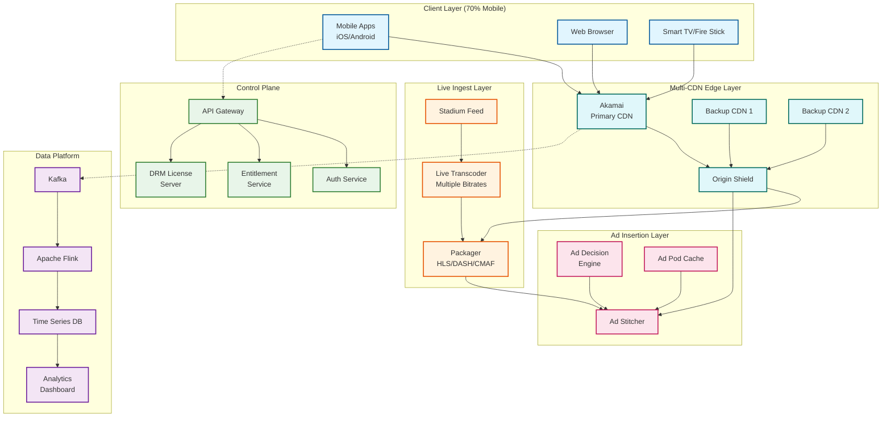

# Disney+ Hotstar - Live Sports Streaming System Design

## Overview

Disney+ Hotstar is India's premier live sports streaming platform, serving as the primary destination for cricket (IPL, ICC tournaments) and other major sporting events. The platform represents one of the most challenging live streaming engineering problems globally due to extreme traffic spikes during popular matches.

**Key Challenge**: Handle 20x traffic surges within 10 minutes of match start, serving 59M+ concurrent viewers with sub-40-second glass-to-glass latency.

---

## System Characteristics

| Characteristic | Description |
|----------------|-------------|
| **Traffic Pattern** | Burst-heavy with predictable spikes tied to match schedules |
| **Primary Device** | Mobile-first (70% traffic from smartphones) |
| **Geography** | India-centric with diaspora coverage |
| **Content Type** | Live sports with multi-language commentary |
| **Monetization** | Freemium + SSAI (Server-Side Ad Insertion) |
| **Latency Target** | 30-40 seconds glass-to-glass (stability over ultra-low) |

---

## Complexity Rating

| Dimension | Rating | Notes |
|-----------|--------|-------|
| Traffic Spikes | Very High | 20x surge in 10 minutes, 59M peak concurrent |
| SSAI at Scale | Very High | 25M+ concurrent ad decisions |
| Multi-CDN | High | Akamai primary + failover CDNs |
| Multi-Language | High | 8+ commentary languages |
| DRM Complexity | High | Widevine, FairPlay, PlayReady |
| Mobile Optimization | High | Bandwidth-constrained users |
| Real-time Analytics | High | Live viewer counts, QoE metrics |

**Overall Complexity: Very High**

---

## Quick Navigation

| Document | Description |
|----------|-------------|
| [01 - Requirements](./01-requirements-and-estimations.md) | Functional/non-functional requirements, capacity planning |
| [02 - High-Level Design](./02-high-level-design.md) | System architecture, data flows |
| [03 - Low-Level Design](./03-low-level-design.md) | Data models, APIs, algorithms |
| [04 - Deep Dive](./04-deep-dive-and-bottlenecks.md) | Traffic spikes, SSAI, multi-CDN |
| [05 - Scalability](./05-scalability-and-reliability.md) | Ladder-based scaling, fault tolerance |
| [06 - Security](./06-security-and-compliance.md) | DRM, geo-restrictions, compliance |
| [07 - Observability](./07-observability.md) | Real-time monitoring, alerting |
| [08 - Interview Guide](./08-interview-guide.md) | Pacing, trap questions, trade-offs |

---

## Core Modules

```
┌─────────────────────────────────────────────────────────────────────────┐
│                        Disney+ Hotstar Core Modules                      │
├─────────────────┬──────────────────┬────────────────┬───────────────────┤
│  Live Ingest    │   Multi-CDN      │     SSAI       │      DVR          │
│  - Stadium feed │   - Akamai       │  - Ad decision │  - Catch-up       │
│  - Transcoding  │   - Failover     │  - Demographic │  - Seek support   │
│  - Packaging    │   - Origin shield│  - Stitching   │  - Segment cache  │
├─────────────────┼──────────────────┼────────────────┼───────────────────┤
│  ABR Engine     │  Multi-Language  │  Interactive   │  Analytics        │
│  - Quality tiers│  - 8+ languages  │  - Watch'N Play│  - Real-time      │
│  - Bandwidth    │  - Separate audio│  - Polls       │  - QoE metrics    │
│  - Device-aware │  - Client select │  - Predictions │  - Viewer count   │
└─────────────────┴──────────────────┴────────────────┴───────────────────┘
```

---

## Architecture Overview



---

## Platform Comparison

| Feature | Disney+ Hotstar | Netflix Live | YouTube Live | Twitch |
|---------|-----------------|--------------|--------------|--------|
| **Peak Concurrent** | 59M | N/A (no live sports) | ~20M | ~10M |
| **Primary Use** | Sports (Cricket) | Movies/Series | UGC, Sports | Gaming |
| **Latency Target** | 30-40s | N/A | 20-60s | 2-10s |
| **Ad Model** | SSAI | No ads (premium) | Pre-roll, mid-roll | Pre-roll |
| **Geography** | India-focused | Global | Global | Global |
| **Spike Pattern** | Extreme (20x) | Steady | Moderate | Moderate |
| **Mobile Share** | 70% | 50% | 60% | 30% |

---

## Key Scale Numbers

| Metric | Value | Context |
|--------|-------|---------|
| Peak Concurrent Viewers | 59M | T20 World Cup 2024 |
| IPL Peak | 25.3M | Historical record |
| Traffic Spike | 20x in 10 min | Match start surge |
| Monthly Active Users | 450M+ | Post JioHotstar merger |
| Infrastructure | 500+ AWS instances | During peak events |
| Compute Resources | 16TB RAM, 8000 cores | Peak configuration |
| Microservices | 800+ | Production services |
| Peak Bandwidth | 32 Gbps | Internal network |
| Languages Supported | 8+ | Hindi, English, Tamil, etc. |
| Quality Tiers | 6 | 360p to 4K |

---

## Quick Reference Card

```
╔══════════════════════════════════════════════════════════════════════════╗
║               DISNEY+ HOTSTAR SYSTEM DESIGN QUICK REFERENCE              ║
╠══════════════════════════════════════════════════════════════════════════╣
║                                                                          ║
║  TRAFFIC PATTERN                                                         ║
║  ├─ Peak: 59M concurrent (T20 World Cup 2024)                           ║
║  ├─ Spike: 20x in 10 minutes at match start                             ║
║  └─ Pre-warm: 2M capacity ready before events                           ║
║                                                                          ║
║  LATENCY TARGETS                                                         ║
║  ├─ Glass-to-glass: 30-40 seconds                                       ║
║  ├─ Playback start: < 3 seconds                                         ║
║  └─ Infrastructure add: 90 seconds                                      ║
║                                                                          ║
║  KEY ARCHITECTURE DECISIONS                                              ║
║  ├─ Multi-CDN with Origin Shield (thundering herd protection)           ║
║  ├─ SSAI over CSAI (no ad-blocker bypass, unified QoE)                  ║
║  ├─ 30-40s latency (stability > ultra-low for 59M users)                ║
║  └─ Demographic ad grouping (50-100 groups, not 1:1)                    ║
║                                                                          ║
║  SCALING STRATEGY                                                        ║
║  ├─ L0 (Baseline): Always-on capacity                                   ║
║  ├─ L1 (T-60 min): 2x baseline                                          ║
║  ├─ L2 (T-30 min): 5x baseline                                          ║
║  ├─ L3 (T-10 min): 10x baseline                                         ║
║  └─ L4 (Match live): 20x+ baseline (reactive)                           ║
║                                                                          ║
║  GRACEFUL DEGRADATION                                                    ║
║  ├─ Level 0: Full features                                              ║
║  ├─ Level 1: Generic ads (no personalization)                           ║
║  ├─ Level 2: No interactive features                                    ║
║  ├─ Level 3: Max 720p quality                                           ║
║  └─ Level 4: Audio-only emergency mode                                  ║
║                                                                          ║
╚══════════════════════════════════════════════════════════════════════════╝
```

---

## Related Topics

- [5.4 Netflix](../5.4-netflix/00-index.md) - VOD streaming architecture
- [5.6 Google Photos](../5.6-google-photos/00-index.md) - Media storage at scale
- [2.1 Real-time Chat](../2.1-realtime-chat/00-index.md) - WebSocket patterns

---

## Document History

| Version | Date | Changes |
|---------|------|---------|
| 1.0 | 2025-02 | Initial documentation |
