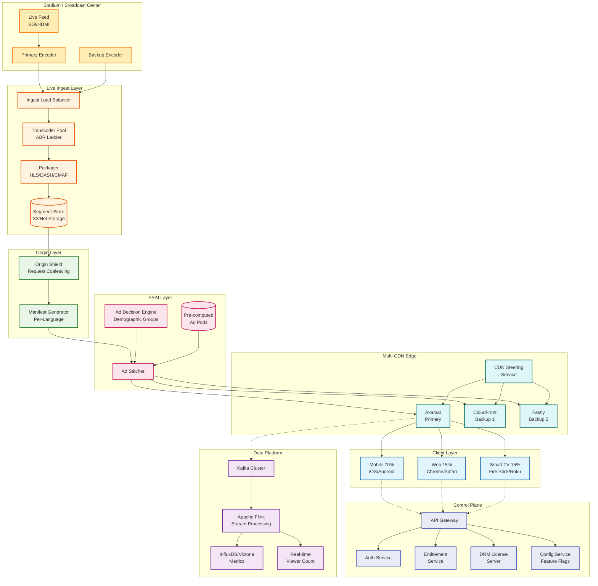
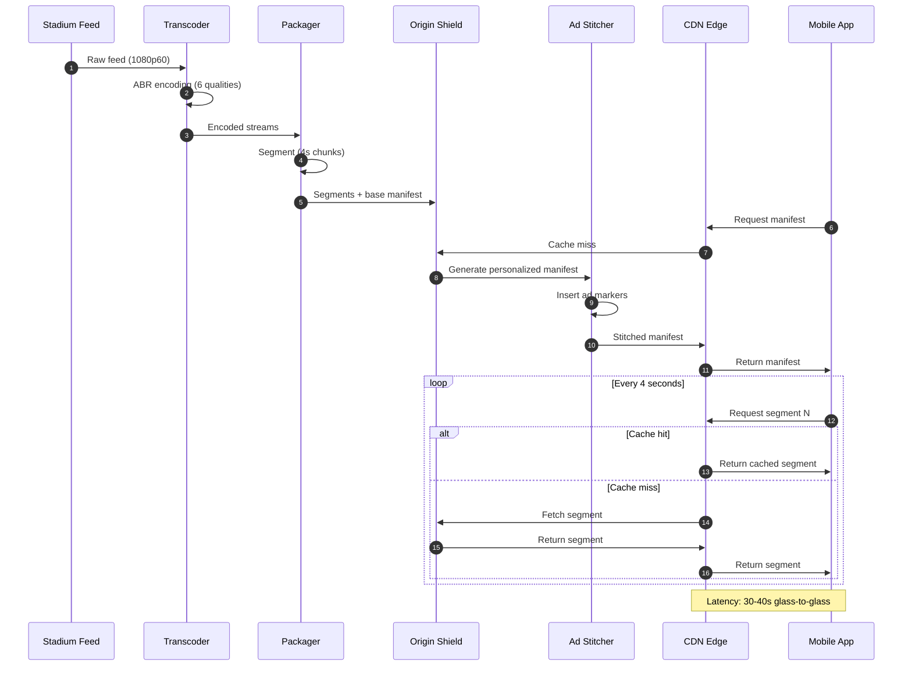
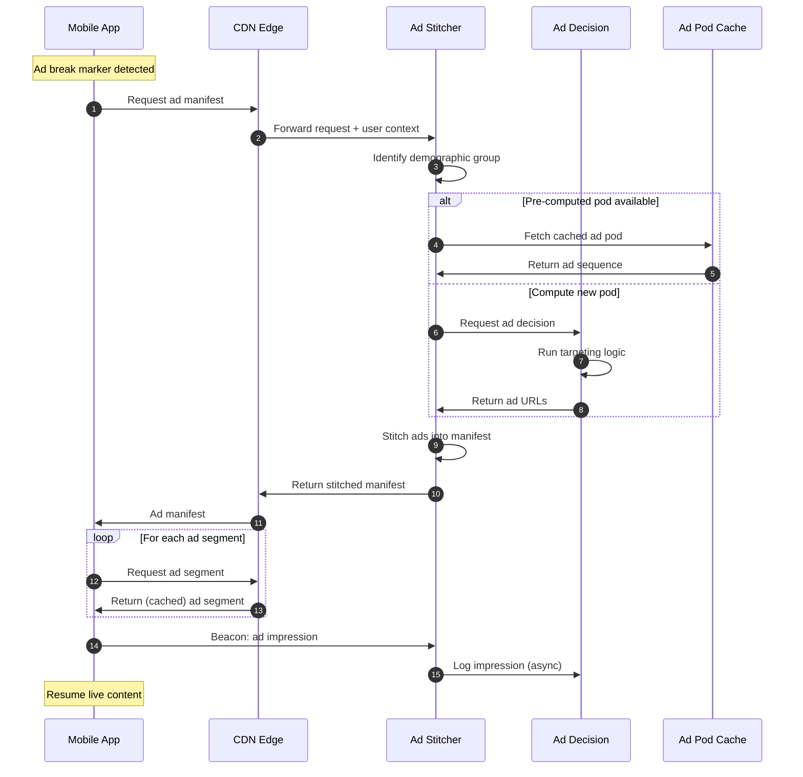
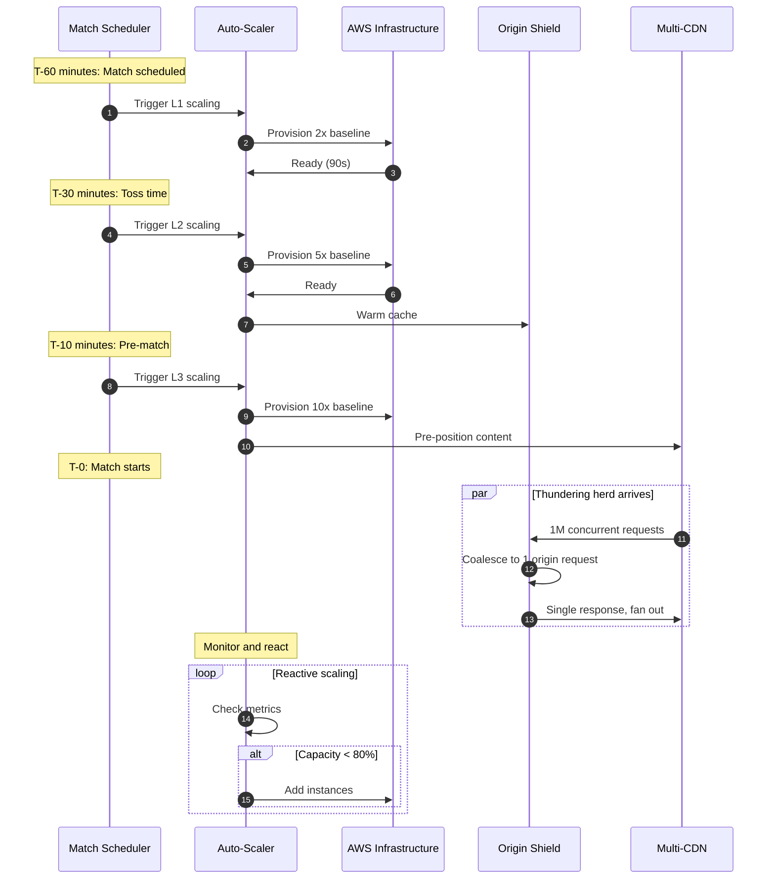

# High-Level Design

## Overview

This document presents the system architecture for a live sports streaming platform capable of handling 59M+ concurrent viewers with extreme traffic spikes. The design prioritizes stability over ultra-low latency, employing multi-CDN orchestration, server-side ad insertion, and ladder-based scaling.

---

## System Architecture



---

## Component Descriptions

### Stadium / Broadcast Center

| Component | Responsibility | Details |
|-----------|----------------|---------|
| Live Feed | Raw video input | SDI/HDMI from cameras |
| Primary Encoder | Initial encoding | Low-latency H.264/HEVC |
| Backup Encoder | Redundancy | Hot standby, automatic failover |

### Live Ingest Layer

| Component | Responsibility | Scaling |
|-----------|----------------|---------|
| Ingest Load Balancer | Route feeds to transcoders | Active-passive |
| Transcoder Pool | ABR ladder creation | 6 quality tiers × N redundancy |
| Packager | HLS/DASH/CMAF segmentation | 4-second segments |
| Segment Store | Hot segment storage | S3 with edge caching |

### Origin Layer

| Component | Responsibility | Key Feature |
|-----------|----------------|-------------|
| Origin Shield | Request coalescing | Collapse 1M requests to 1 origin fetch |
| Manifest Generator | Per-user manifests | Language, quality, ad markers |

### SSAI Layer

| Component | Responsibility | Scale |
|-----------|----------------|-------|
| Ad Decision Engine | Targeting logic | 50-100 demographic groups |
| Ad Stitcher | Manifest manipulation | Seamless ad insertion |
| Ad Pod Cache | Pre-computed ad sequences | Per demographic group |

### Multi-CDN Edge

| CDN | Role | Traffic Share |
|-----|------|---------------|
| Akamai | Primary | 70% |
| CloudFront | Backup 1 | 20% |
| Fastly | Backup 2 | 10% |
| CDN Steering | Traffic director | Real-time decisions |

### Control Plane

| Service | Responsibility | SLO |
|---------|----------------|-----|
| API Gateway | Request routing | < 50ms P99 |
| Auth Service | User authentication | < 50ms P99 |
| Entitlement | Subscription validation | 99%+ cache hit |
| DRM License | Key delivery | < 200ms P99 |
| Config Service | Feature flags | Eventually consistent |

### Data Platform

| Component | Responsibility | Throughput |
|-----------|----------------|------------|
| Kafka | Event streaming | 10M+ events/sec |
| Apache Flink | Stream processing | Real-time aggregation |
| Time Series DB | Metrics storage | 1M+ points/sec |
| Viewer Count | Real-time counter | 59M concurrent |

---

## Data Flow: Live Streaming



### Latency Breakdown

| Stage | Latency | Cumulative |
|-------|---------|------------|
| Capture to encoder | ~1s | 1s |
| Encoding (ABR) | ~3s | 4s |
| Packaging | ~2s | 6s |
| Origin to CDN | ~1s | 7s |
| CDN propagation | ~2s | 9s |
| Segment duration | 4s | 13s |
| Player buffer | 12-16s | 25-29s |
| Network jitter buffer | 5-10s | 30-39s |

---

## Data Flow: SSAI (Ad Insertion)



### SSAI Key Decisions

| Decision | Choice | Rationale |
|----------|--------|-----------|
| SSAI vs CSAI | SSAI | No ad-blocker bypass, unified QoE |
| Targeting granularity | 50-100 groups | Balance personalization vs cache efficiency |
| Ad pod caching | Yes | Reduce ad server load at scale |
| Fallback strategy | Generic ads | Never fail to show ads |

---

## Data Flow: Traffic Spike Handling



### Scaling Ladder

| Level | Trigger | Capacity | Action |
|-------|---------|----------|--------|
| L0 | Always | 1x baseline | Normal operation |
| L1 | T-60 min | 2x baseline | Pre-warm |
| L2 | T-30 min | 5x baseline | Cache warming |
| L3 | T-10 min | 10x baseline | Full pre-positioning |
| L4 | Reactive | 20x+ baseline | Dynamic scaling |

---

## Key Architectural Decisions

### 1. Multi-CDN with Origin Shield

**Decision**: Use multiple CDNs with an origin shield layer

```
┌─────────────────────────────────────────────────────────────┐
│                        Origin Shield                         │
│  ┌─────────────────────────────────────────────────────┐   │
│  │              Request Coalescing Engine               │   │
│  │                                                      │   │
│  │  1,000,000 requests  ──────►  1 origin request      │   │
│  │  for same segment           + fan-out response      │   │
│  └─────────────────────────────────────────────────────┘   │
└───────────────────────────┬─────────────────────────────────┘
                            │
        ┌───────────────────┼───────────────────┐
        ▼                   ▼                   ▼
   ┌─────────┐        ┌─────────┐        ┌─────────┐
   │ Akamai  │        │CloudFront│       │ Fastly  │
   │  (70%)  │        │  (20%)  │        │  (10%)  │
   └─────────┘        └─────────┘        └─────────┘
```

**Rationale**:
- No single CDN can handle 80+ Tbps alone
- Origin protection from thundering herd
- Failover capability for regional outages
- Negotiate better rates with competition

### 2. 30-40 Second Latency Trade-off

**Decision**: Target 30-40s glass-to-glass, not ultra-low (<10s)

| Factor | Ultra-Low (<10s) | Our Choice (30-40s) |
|--------|------------------|---------------------|
| Buffer size | 2-3 segments | 8-10 segments |
| Rebuffering | Higher risk | Very low |
| ABR stability | Difficult | Stable |
| Scale | Challenging | Proven at 59M |
| Social media sync | Near real-time | Slight delay |

**Rationale**: At 59M concurrent viewers, stability beats speed. A 1% rebuffer event affects 590,000 users simultaneously.

### 3. SSAI Over CSAI

**Decision**: Server-Side Ad Insertion

| Aspect | CSAI (Client-Side) | SSAI (Server-Side) |
|--------|-------------------|-------------------|
| Ad blockers | Bypassable | Immune |
| Stream continuity | Visible switch | Seamless |
| Analytics | Client-dependent | Unified |
| Scale complexity | Lower | Higher |
| Personalization | Full | Group-based |

**Rationale**: Revenue protection and unified QoE measurement justify the complexity.

### 4. Mobile-First Architecture

**Decision**: Optimize for mobile (70% of traffic)

| Optimization | Implementation |
|--------------|----------------|
| Bitrate ladder | Include 360p, 480p tiers |
| Segment size | 4s (balance bandwidth estimation) |
| Startup quality | Start low, upgrade fast |
| Offline mode | Download for poor connectivity |
| Battery | Efficient codecs, adaptive polling |

---

## Architecture Pattern Checklist

| Pattern | Applied | Implementation |
|---------|---------|----------------|
| Load Balancing | Yes | CDN steering, API gateway |
| Caching | Yes | Multi-tier: CDN, Origin Shield, App |
| Circuit Breaker | Yes | CDN failover, SSAI fallback |
| Bulkhead | Yes | Isolated services, separate pools |
| CQRS | Partial | Read-heavy, eventual consistency |
| Event Sourcing | Yes | Kafka for analytics events |
| Saga | No | Not needed for streaming |
| Sidecar | Yes | Metrics collection, logging |
| Gateway | Yes | API Gateway, CDN steering |
| Strangler | No | Greenfield design |

---

## Component Interaction Matrix

| Component | Depends On | Depended By |
|-----------|------------|-------------|
| Transcoder | Ingest LB | Packager |
| Packager | Transcoder | Origin Shield |
| Origin Shield | Packager, Segment Store | Ad Stitcher, CDN |
| Ad Stitcher | Origin Shield, Ad Decision | CDN |
| CDN | Ad Stitcher | Clients |
| API Gateway | - | Auth, Entitlement, DRM |
| Auth Service | - | API Gateway |
| Kafka | CDN (events) | Flink |
| Flink | Kafka | TSDB, Viewer Count |

---

## Next Steps

See [03-low-level-design.md](./03-low-level-design.md) for detailed data models, API specifications, and algorithms.
