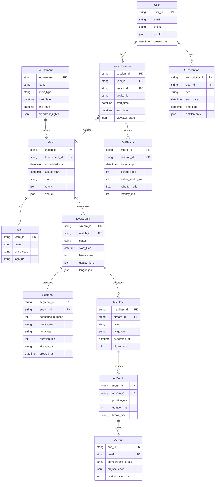

# Low-Level Design

## Overview

This document details the data models, database schemas, API specifications, and core algorithms for the live sports streaming platform. Focus areas include segment management, multi-language manifests, SSAI, and scaling algorithms.

---

## Data Models

### Core Entities



---

## Schema Designs

### Match Metadata (PostgreSQL)

```sql
-- Tournament table
CREATE TABLE tournaments (
    tournament_id VARCHAR(36) PRIMARY KEY,
    name VARCHAR(255) NOT NULL,
    sport_type VARCHAR(50) NOT NULL,
    start_date TIMESTAMP NOT NULL,
    end_date TIMESTAMP NOT NULL,
    broadcast_rights JSONB NOT NULL DEFAULT '{}',
    created_at TIMESTAMP DEFAULT CURRENT_TIMESTAMP,
    updated_at TIMESTAMP DEFAULT CURRENT_TIMESTAMP
);

-- Match table
CREATE TABLE matches (
    match_id VARCHAR(36) PRIMARY KEY,
    tournament_id VARCHAR(36) REFERENCES tournaments(tournament_id),
    team_home_id VARCHAR(36) NOT NULL,
    team_away_id VARCHAR(36) NOT NULL,
    venue_id VARCHAR(36),
    scheduled_start TIMESTAMP NOT NULL,
    actual_start TIMESTAMP,
    status VARCHAR(20) DEFAULT 'scheduled',
    -- Status: scheduled, live, completed, cancelled
    result JSONB,
    metadata JSONB DEFAULT '{}',
    created_at TIMESTAMP DEFAULT CURRENT_TIMESTAMP
);

-- Indexes
CREATE INDEX idx_matches_tournament ON matches(tournament_id);
CREATE INDEX idx_matches_scheduled ON matches(scheduled_start);
CREATE INDEX idx_matches_status ON matches(status);
CREATE INDEX idx_matches_live ON matches(status) WHERE status = 'live';
```

### Live Stream State (Redis)

```
# Active stream state
HSET stream:{stream_id} \
    match_id "{match_id}" \
    status "live" \
    start_time "2025-02-15T19:30:00Z" \
    current_segment 1542 \
    latency_ms 35000 \
    viewer_count 45000000

# Segment metadata (with TTL for DVR window)
HSET segment:{stream_id}:{sequence} \
    quality_tiers "360p,480p,720p,1080p,4k" \
    languages "hi,en,ta,te,kn,bn,mr,ml" \
    duration_ms 4000 \
    created_at "2025-02-15T20:15:30Z"
EXPIRE segment:{stream_id}:{sequence} 14400  # 4-hour DVR

# Quality tier URLs
HSET segment_urls:{stream_id}:{sequence}:{quality} \
    url "https://origin.example.com/seg_{sequence}_{quality}.ts" \
    size_bytes 524288

# Language audio URLs
HSET segment_audio:{stream_id}:{sequence}:{lang} \
    url "https://origin.example.com/audio_{sequence}_{lang}.aac" \
    size_bytes 32768
```

### Session State (Redis Cluster)

```
# User session (sharded by user_id)
HSET session:{user_id}:{device_id} \
    match_id "{match_id}" \
    stream_id "{stream_id}" \
    current_position_ms 3600000 \
    quality "720p" \
    language "hi" \
    last_heartbeat "2025-02-15T20:16:00Z"
EXPIRE session:{user_id}:{device_id} 300  # 5-min heartbeat window

# Active sessions per match (HyperLogLog for cardinality)
PFADD match_viewers:{match_id} {user_id}
PFCOUNT match_viewers:{match_id}  # Approximate viewer count
```

### Ad Pod Cache (Redis)

```
# Pre-computed ad pod for demographic group
HSET adpod:{break_id}:{demographic_group} \
    pod_id "{pod_id}" \
    ads '[{"ad_id":"ad1","duration":15000},{"ad_id":"ad2","duration":30000}]' \
    total_duration_ms 45000 \
    manifest_url "https://ads.example.com/pod_{pod_id}.m3u8"
EXPIRE adpod:{break_id}:{demographic_group} 3600  # 1-hour TTL

# Demographic group mapping
HSET user_demographic:{user_id} \
    group "premium_male_18-35_metro" \
    last_updated "2025-02-15T00:00:00Z"
```

---

## API Design

### Playback APIs

#### Get Live Manifest

```
GET /api/v2/playback/{match_id}/manifest
```

**Request Headers:**
```
Authorization: Bearer {jwt_token}
X-Device-Id: {device_id}
X-Device-Type: mobile|web|tv
X-Preferred-Language: hi
X-Network-Type: 4g|5g|wifi
```

**Response (200 OK):**
```json
{
  "manifest_url": "https://cdn.example.com/live/{stream_id}/master.m3u8?token={playback_token}",
  "drm": {
    "widevine": {
      "license_url": "https://drm.example.com/widevine/license",
      "certificate_url": "https://drm.example.com/widevine/cert"
    },
    "fairplay": {
      "license_url": "https://drm.example.com/fairplay/license",
      "certificate_url": "https://drm.example.com/fairplay/cert"
    }
  },
  "playback_token": "{short_lived_token}",
  "token_refresh_interval_sec": 300,
  "available_languages": ["hi", "en", "ta", "te", "kn", "bn", "mr", "ml"],
  "available_qualities": ["360p", "480p", "720p", "1080p", "4k"],
  "dvr_window_sec": 14400,
  "cdn_steering_url": "https://steer.example.com/v1/select"
}
```

#### Switch Language

```
POST /api/v2/playback/{session_id}/language
```

**Request:**
```json
{
  "language": "ta",
  "current_position_ms": 3600000
}
```

**Response (200 OK):**
```json
{
  "manifest_url": "https://cdn.example.com/live/{stream_id}/master_ta.m3u8?token={token}",
  "seek_position_ms": 3600000
}
```

#### DVR Seek

```
POST /api/v2/playback/{session_id}/seek
```

**Request:**
```json
{
  "target_position_ms": 1800000,
  "direction": "backward"
}
```

**Response (200 OK):**
```json
{
  "manifest_url": "https://cdn.example.com/live/{stream_id}/dvr.m3u8?start=1800000&token={token}",
  "available_from_ms": 0,
  "available_to_ms": 7200000,
  "is_live_edge": false
}
```

### Match APIs

#### Get Match Schedule

```
GET /api/v2/matches/schedule?date=2025-02-15&sport=cricket
```

**Response (200 OK):**
```json
{
  "matches": [
    {
      "match_id": "ipl-2025-match-42",
      "tournament": "IPL 2025",
      "teams": {
        "home": {"id": "mi", "name": "Mumbai Indians", "short": "MI"},
        "away": {"id": "csk", "name": "Chennai Super Kings", "short": "CSK"}
      },
      "venue": "Wankhede Stadium, Mumbai",
      "scheduled_start": "2025-02-15T19:30:00+05:30",
      "status": "scheduled",
      "is_free": false,
      "required_tier": "premium"
    }
  ],
  "pagination": {
    "page": 1,
    "total_pages": 3,
    "total_matches": 28
  }
}
```

### Interactive APIs (WebSocket)

#### Watch'N Play Connection

```
WebSocket: wss://interactive.example.com/v1/watchnplay/{match_id}
```

**Client → Server (Subscribe):**
```json
{
  "type": "subscribe",
  "match_id": "ipl-2025-match-42",
  "user_id": "{user_id}",
  "auth_token": "{jwt_token}"
}
```

**Server → Client (Poll):**
```json
{
  "type": "poll",
  "poll_id": "poll-123",
  "question": "Who will score more runs in this over?",
  "options": [
    {"id": "a", "text": "Rohit Sharma"},
    {"id": "b", "text": "Boundary"}
  ],
  "expires_at": "2025-02-15T20:16:30Z"
}
```

**Client → Server (Vote):**
```json
{
  "type": "vote",
  "poll_id": "poll-123",
  "option_id": "a"
}
```

---

## Core Algorithms

### 1. Ladder-Based Scaling Algorithm

```python
"""
Ladder-Based Auto-Scaling for Live Events

Proactively scales infrastructure based on match schedule,
with reactive adjustments during the event.
"""

from dataclasses import dataclass
from datetime import datetime, timedelta
from enum import Enum
from typing import Dict, List

class ScaleLevel(Enum):
    L0_BASELINE = 0      # Normal operations
    L1_PREWARM = 1       # T-60 minutes
    L2_READY = 2         # T-30 minutes
    L3_POSITIONED = 3    # T-10 minutes
    L4_REACTIVE = 4      # During match

@dataclass
class ScaleConfig:
    level: ScaleLevel
    multiplier: float
    trigger_before_minutes: int
    services: Dict[str, int]  # service_name -> instance_count

SCALE_LADDER = {
    ScaleLevel.L0_BASELINE: ScaleConfig(
        level=ScaleLevel.L0_BASELINE,
        multiplier=1.0,
        trigger_before_minutes=0,
        services={
            "transcoder": 10,
            "packager": 20,
            "origin_shield": 50,
            "ad_stitcher": 30,
            "api_gateway": 50,
        }
    ),
    ScaleLevel.L1_PREWARM: ScaleConfig(
        level=ScaleLevel.L1_PREWARM,
        multiplier=2.0,
        trigger_before_minutes=60,
        services={
            "transcoder": 20,
            "packager": 40,
            "origin_shield": 100,
            "ad_stitcher": 60,
            "api_gateway": 100,
        }
    ),
    ScaleLevel.L2_READY: ScaleConfig(
        level=ScaleLevel.L2_READY,
        multiplier=5.0,
        trigger_before_minutes=30,
        services={
            "transcoder": 30,
            "packager": 100,
            "origin_shield": 200,
            "ad_stitcher": 150,
            "api_gateway": 200,
        }
    ),
    ScaleLevel.L3_POSITIONED: ScaleConfig(
        level=ScaleLevel.L3_POSITIONED,
        multiplier=10.0,
        trigger_before_minutes=10,
        services={
            "transcoder": 50,
            "packager": 200,
            "origin_shield": 400,
            "ad_stitcher": 250,
            "api_gateway": 400,
        }
    ),
}

class LadderScaler:
    def __init__(self, infrastructure_client):
        self.infra = infrastructure_client
        self.current_level = ScaleLevel.L0_BASELINE
        self.scaling_in_progress = False

    def determine_scale_level(
        self,
        match_start: datetime,
        current_time: datetime
    ) -> ScaleLevel:
        """Determine required scale level based on time to match."""
        minutes_until_start = (match_start - current_time).total_seconds() / 60

        if minutes_until_start > 60:
            return ScaleLevel.L0_BASELINE
        elif minutes_until_start > 30:
            return ScaleLevel.L1_PREWARM
        elif minutes_until_start > 10:
            return ScaleLevel.L2_READY
        else:
            return ScaleLevel.L3_POSITIONED

    async def scale_to_level(self, target_level: ScaleLevel) -> bool:
        """Scale infrastructure to target level."""
        if self.scaling_in_progress:
            return False

        if target_level.value <= self.current_level.value:
            return True  # Already at or above target

        self.scaling_in_progress = True
        config = SCALE_LADDER[target_level]

        try:
            # Scale each service in parallel
            tasks = []
            for service, count in config.services.items():
                tasks.append(
                    self.infra.scale_service(service, count)
                )

            await asyncio.gather(*tasks)

            # Verify scaling completed
            for service, count in config.services.items():
                actual = await self.infra.get_instance_count(service)
                if actual < count * 0.95:  # 95% threshold
                    raise ScalingError(f"{service} underscaled")

            self.current_level = target_level
            return True

        finally:
            self.scaling_in_progress = False

    async def reactive_scale(self, metrics: Dict) -> None:
        """React to real-time metrics during match."""
        cpu_util = metrics.get("cpu_utilization", 0)
        request_rate = metrics.get("request_rate", 0)
        error_rate = metrics.get("error_rate", 0)

        # Trigger reactive scaling if thresholds exceeded
        if cpu_util > 70 or error_rate > 0.01:
            # Add 20% capacity
            for service in SCALE_LADDER[self.current_level].services:
                current = await self.infra.get_instance_count(service)
                await self.infra.scale_service(
                    service,
                    int(current * 1.2)
                )
```

### 2. SSAI Ad Decisioning Algorithm

```python
"""
Server-Side Ad Insertion Decision Engine

Groups users into demographic segments to enable
efficient caching while maintaining targeting value.
"""

from dataclasses import dataclass
from typing import List, Optional, Dict
import hashlib

@dataclass
class UserContext:
    user_id: str
    subscription_tier: str  # free, premium
    age_group: str          # 18-24, 25-34, 35-44, 45+
    gender: str             # m, f, unknown
    location_tier: str      # metro, tier1, tier2, rural
    device_type: str        # mobile, web, tv
    language: str
    interests: List[str]

@dataclass
class AdPod:
    pod_id: str
    ads: List[Dict]
    total_duration_ms: int
    manifest_url: str

class DemographicGrouper:
    """
    Groups users into 50-100 demographic segments.
    Balance: More groups = better targeting, worse cache hit rate
    """

    # Define grouping dimensions (product of all = max groups)
    AGE_BUCKETS = ["18-34", "35+"]           # 2 buckets
    GENDER_BUCKETS = ["m", "f", "u"]          # 3 buckets
    LOCATION_BUCKETS = ["metro", "non-metro"] # 2 buckets
    TIER_BUCKETS = ["free", "premium"]        # 2 buckets
    DEVICE_BUCKETS = ["mobile", "other"]      # 2 buckets
    # Total: 2 * 3 * 2 * 2 * 2 = 48 groups

    def get_demographic_group(self, ctx: UserContext) -> str:
        """Map user to a demographic group identifier."""
        age_bucket = "18-34" if ctx.age_group in ["18-24", "25-34"] else "35+"

        gender_bucket = ctx.gender if ctx.gender in ["m", "f"] else "u"

        location_bucket = "metro" if ctx.location_tier == "metro" else "non-metro"

        tier_bucket = ctx.subscription_tier

        device_bucket = "mobile" if ctx.device_type == "mobile" else "other"

        group_id = f"{age_bucket}_{gender_bucket}_{location_bucket}_{tier_bucket}_{device_bucket}"
        return group_id

class AdDecisionEngine:
    def __init__(self, ad_server_client, cache_client):
        self.ad_server = ad_server_client
        self.cache = cache_client
        self.grouper = DemographicGrouper()

    async def get_ad_pod(
        self,
        user_ctx: UserContext,
        break_id: str,
        duration_ms: int
    ) -> AdPod:
        """
        Get ad pod for user, using demographic group caching.

        Flow:
        1. Map user to demographic group
        2. Check cache for pre-computed pod
        3. If miss, compute and cache
        4. Return pod
        """
        # Step 1: Get demographic group
        demo_group = self.grouper.get_demographic_group(user_ctx)

        # Step 2: Check cache
        cache_key = f"adpod:{break_id}:{demo_group}"
        cached_pod = await self.cache.get(cache_key)

        if cached_pod:
            return AdPod(**cached_pod)

        # Step 3: Compute new pod (cache miss)
        try:
            pod = await self._compute_ad_pod(
                demo_group,
                break_id,
                duration_ms,
                user_ctx.language
            )

            # Cache for 1 hour
            await self.cache.set(cache_key, pod.__dict__, ttl=3600)
            return pod

        except AdServerError:
            # Fallback to generic pod
            return await self._get_fallback_pod(break_id, duration_ms)

    async def _compute_ad_pod(
        self,
        demo_group: str,
        break_id: str,
        duration_ms: int,
        language: str
    ) -> AdPod:
        """Request ad pod from ad decision server."""
        response = await self.ad_server.request_ads(
            demographic=demo_group,
            duration_ms=duration_ms,
            break_type=break_id.split("-")[0],  # strategic, innings, etc.
            language=language
        )

        return AdPod(
            pod_id=response["pod_id"],
            ads=response["ads"],
            total_duration_ms=sum(ad["duration"] for ad in response["ads"]),
            manifest_url=response["manifest_url"]
        )

    async def _get_fallback_pod(
        self,
        break_id: str,
        duration_ms: int
    ) -> AdPod:
        """Return generic ad pod when targeting fails."""
        # Pre-cached generic pods per break type
        return await self.cache.get(f"adpod:generic:{break_id}")


class AdStitcher:
    """Stitches ad segments into live manifest."""

    def stitch_manifest(
        self,
        base_manifest: str,
        ad_pod: AdPod,
        break_position_ms: int
    ) -> str:
        """
        Insert ad pod into HLS manifest at break position.

        Uses EXT-X-DISCONTINUITY markers for seamless playback.
        """
        lines = base_manifest.split("\n")
        result = []

        for line in lines:
            result.append(line)

            # Insert ads after segment at break position
            if self._is_segment_at_position(line, break_position_ms):
                result.append("#EXT-X-DISCONTINUITY")

                for ad in ad_pod.ads:
                    result.append(f"#EXTINF:{ad['duration'] / 1000:.3f},")
                    result.append(ad["segment_url"])

                result.append("#EXT-X-DISCONTINUITY")

        return "\n".join(result)
```

### 3. Multi-Language Manifest Generation

```python
"""
Multi-Language Manifest Generator

Generates HLS manifests with multiple audio tracks
for 8+ commentary languages.
"""

from dataclasses import dataclass
from typing import List, Dict

@dataclass
class AudioTrack:
    language: str
    name: str
    is_default: bool
    uri_template: str

@dataclass
class QualityTier:
    name: str
    bandwidth: int
    resolution: str
    codecs: str

AUDIO_TRACKS = [
    AudioTrack("hi", "Hindi", True, "audio_hi_{seq}.aac"),
    AudioTrack("en", "English", False, "audio_en_{seq}.aac"),
    AudioTrack("ta", "Tamil", False, "audio_ta_{seq}.aac"),
    AudioTrack("te", "Telugu", False, "audio_te_{seq}.aac"),
    AudioTrack("kn", "Kannada", False, "audio_kn_{seq}.aac"),
    AudioTrack("bn", "Bengali", False, "audio_bn_{seq}.aac"),
    AudioTrack("mr", "Marathi", False, "audio_mr_{seq}.aac"),
    AudioTrack("ml", "Malayalam", False, "audio_ml_{seq}.aac"),
]

QUALITY_TIERS = [
    QualityTier("360p", 400000, "640x360", "avc1.42c01e"),
    QualityTier("480p", 800000, "854x480", "avc1.42c01f"),
    QualityTier("720p", 1500000, "1280x720", "avc1.4d401f"),
    QualityTier("1080p", 3000000, "1920x1080", "avc1.640028"),
    QualityTier("1080p+", 5000000, "1920x1080", "avc1.640028"),
    QualityTier("4k", 15000000, "3840x2160", "hvc1.1.6.L150.90"),
]

class ManifestGenerator:
    def __init__(self, cdn_base_url: str):
        self.cdn_base = cdn_base_url

    def generate_master_manifest(
        self,
        stream_id: str,
        available_languages: List[str],
        available_qualities: List[str],
        user_preferred_language: str = "hi"
    ) -> str:
        """
        Generate HLS master playlist with all variants.

        Structure:
        - Audio tracks (8 languages)
        - Video variants (6 qualities × 8 audio associations)
        """
        lines = [
            "#EXTM3U",
            "#EXT-X-VERSION:6",
            "",
            "# Audio tracks"
        ]

        # Add audio track declarations
        for track in AUDIO_TRACKS:
            if track.language in available_languages:
                is_default = "YES" if track.language == user_preferred_language else "NO"
                autoselect = "YES" if track.is_default else "NO"

                lines.append(
                    f'#EXT-X-MEDIA:TYPE=AUDIO,'
                    f'GROUP-ID="audio",'
                    f'NAME="{track.name}",'
                    f'LANGUAGE="{track.language}",'
                    f'DEFAULT={is_default},'
                    f'AUTOSELECT={autoselect},'
                    f'URI="{self.cdn_base}/{stream_id}/audio_{track.language}.m3u8"'
                )

        lines.append("")
        lines.append("# Video variants")

        # Add video variant streams
        for tier in QUALITY_TIERS:
            if tier.name in available_qualities:
                lines.append(
                    f'#EXT-X-STREAM-INF:'
                    f'BANDWIDTH={tier.bandwidth},'
                    f'RESOLUTION={tier.resolution},'
                    f'CODECS="{tier.codecs},mp4a.40.2",'
                    f'AUDIO="audio"'
                )
                lines.append(f"{self.cdn_base}/{stream_id}/video_{tier.name}.m3u8")

        return "\n".join(lines)

    def generate_media_playlist(
        self,
        stream_id: str,
        track_type: str,  # "video" or "audio"
        track_id: str,    # quality tier or language
        segments: List[Dict],
        is_live: bool = True
    ) -> str:
        """Generate HLS media playlist for specific track."""
        lines = [
            "#EXTM3U",
            "#EXT-X-VERSION:6",
            "#EXT-X-TARGETDURATION:4",
            f"#EXT-X-MEDIA-SEQUENCE:{segments[0]['sequence']}",
        ]

        if is_live:
            lines.append("#EXT-X-PLAYLIST-TYPE:EVENT")

        for seg in segments:
            lines.append(f"#EXTINF:{seg['duration']:.3f},")
            lines.append(f"{self.cdn_base}/{stream_id}/{track_type}_{track_id}_{seg['sequence']}.ts")

        return "\n".join(lines)
```

### 4. CDN Steering Algorithm

```python
"""
Multi-CDN Steering Algorithm

Routes users to optimal CDN based on:
- Health metrics
- Geographic proximity
- Current load
- Cost optimization
"""

from dataclasses import dataclass
from typing import Dict, List, Optional
from enum import Enum
import random

class CDNProvider(Enum):
    AKAMAI = "akamai"
    CLOUDFRONT = "cloudfront"
    FASTLY = "fastly"

@dataclass
class CDNHealth:
    provider: CDNProvider
    availability: float      # 0.0 - 1.0
    avg_latency_ms: int
    cache_hit_rate: float
    error_rate_5xx: float
    current_load_pct: float

@dataclass
class SteeringDecision:
    primary: CDNProvider
    fallback: CDNProvider
    weight: float

class CDNSteering:
    # Target traffic distribution (when all healthy)
    DEFAULT_WEIGHTS = {
        CDNProvider.AKAMAI: 0.70,
        CDNProvider.CLOUDFRONT: 0.20,
        CDNProvider.FASTLY: 0.10,
    }

    # Health thresholds
    UNHEALTHY_ERROR_RATE = 0.01      # 1% 5xx
    UNHEALTHY_LATENCY_MS = 500       # 500ms avg
    DEGRADED_CACHE_HIT = 0.85        # Below 85% cache hit

    def __init__(self, metrics_client):
        self.metrics = metrics_client
        self.current_weights = self.DEFAULT_WEIGHTS.copy()

    async def get_cdn_health(self) -> Dict[CDNProvider, CDNHealth]:
        """Fetch real-time health metrics for all CDNs."""
        health = {}
        for provider in CDNProvider:
            metrics = await self.metrics.get_cdn_metrics(provider.value)
            health[provider] = CDNHealth(
                provider=provider,
                availability=metrics["availability"],
                avg_latency_ms=metrics["avg_latency_ms"],
                cache_hit_rate=metrics["cache_hit_rate"],
                error_rate_5xx=metrics["error_rate_5xx"],
                current_load_pct=metrics["load_pct"]
            )
        return health

    def calculate_cdn_score(self, health: CDNHealth) -> float:
        """
        Calculate health score for CDN (0.0 - 1.0).
        Higher is better.
        """
        score = 1.0

        # Penalize high error rate (critical)
        if health.error_rate_5xx > self.UNHEALTHY_ERROR_RATE:
            score *= 0.1  # Severe penalty

        # Penalize high latency
        if health.avg_latency_ms > self.UNHEALTHY_LATENCY_MS:
            score *= 0.5
        elif health.avg_latency_ms > 200:
            score *= 0.8

        # Penalize low cache hit rate
        if health.cache_hit_rate < self.DEGRADED_CACHE_HIT:
            score *= 0.7

        # Factor in availability
        score *= health.availability

        # Slight penalty for high load (load balancing)
        if health.current_load_pct > 80:
            score *= 0.9

        return score

    async def select_cdn(
        self,
        user_region: str,
        device_type: str
    ) -> SteeringDecision:
        """
        Select optimal CDN for user request.

        Returns primary CDN and fallback for manifest URLs.
        """
        health_map = await self.get_cdn_health()

        # Calculate scores
        scores = {}
        for provider, health in health_map.items():
            base_score = self.calculate_cdn_score(health)

            # Apply regional preference (simplified)
            regional_boost = self._get_regional_boost(provider, user_region)

            scores[provider] = base_score * regional_boost

        # Sort by score
        ranked = sorted(scores.items(), key=lambda x: x[1], reverse=True)

        primary = ranked[0][0]
        fallback = ranked[1][0] if len(ranked) > 1 else primary

        # Check if primary is healthy enough
        if scores[primary] < 0.5:
            # All CDNs degraded, use weighted random
            return self._weighted_random_selection(scores)

        return SteeringDecision(
            primary=primary,
            fallback=fallback,
            weight=scores[primary]
        )

    def _get_regional_boost(
        self,
        provider: CDNProvider,
        region: str
    ) -> float:
        """Boost CDN score based on regional presence."""
        # Akamai has strong India presence
        if region.startswith("in-") and provider == CDNProvider.AKAMAI:
            return 1.2
        return 1.0

    def _weighted_random_selection(
        self,
        scores: Dict[CDNProvider, float]
    ) -> SteeringDecision:
        """Fallback: weighted random selection."""
        total = sum(scores.values())
        if total == 0:
            # All dead, pick Akamai as default
            return SteeringDecision(
                primary=CDNProvider.AKAMAI,
                fallback=CDNProvider.CLOUDFRONT,
                weight=0.0
            )

        # Normalize and select
        r = random.random() * total
        cumulative = 0

        for provider, score in scores.items():
            cumulative += score
            if r <= cumulative:
                others = [p for p in CDNProvider if p != provider]
                return SteeringDecision(
                    primary=provider,
                    fallback=others[0] if others else provider,
                    weight=score / total
                )

        # Fallback
        return SteeringDecision(
            primary=CDNProvider.AKAMAI,
            fallback=CDNProvider.CLOUDFRONT,
            weight=0.5
        )
```

---

## Indexing Strategy

### PostgreSQL Indexes

```sql
-- High-frequency queries
CREATE INDEX idx_matches_live_today ON matches(scheduled_start)
    WHERE status = 'live' AND scheduled_start >= CURRENT_DATE;

CREATE INDEX idx_matches_tournament_status ON matches(tournament_id, status);

-- Full-text search for match discovery
CREATE INDEX idx_matches_search ON matches
    USING gin(to_tsvector('english',
        coalesce(metadata->>'title', '') || ' ' ||
        coalesce(metadata->>'teams', '')
    ));
```

### Redis Key Patterns

| Pattern | TTL | Access Pattern |
|---------|-----|----------------|
| `stream:{id}` | No expiry (live) | High read, low write |
| `segment:{stream}:{seq}` | 4 hours | Very high read |
| `session:{user}:{device}` | 5 min | High read/write |
| `adpod:{break}:{demo}` | 1 hour | High read |
| `manifest:{stream}:{quality}:{lang}` | 4 sec | Extreme read |

---

## Data Retention Policy

| Data Type | Hot Storage | Warm Storage | Cold/Archive | Delete |
|-----------|-------------|--------------|--------------|--------|
| Live segments | 4 hours | - | - | After DVR |
| VOD segments | 30 days | 1 year | 7 years | Never |
| Session events | 7 days | 90 days | 2 years | After 2 years |
| QoE metrics | 30 days | 1 year | - | After 1 year |
| Ad impressions | 90 days | 2 years | 7 years | Never |
| User profiles | Forever | - | - | On request |

---

## Next Steps

See [04-deep-dive-and-bottlenecks.md](./04-deep-dive-and-bottlenecks.md) for detailed analysis of critical components.
