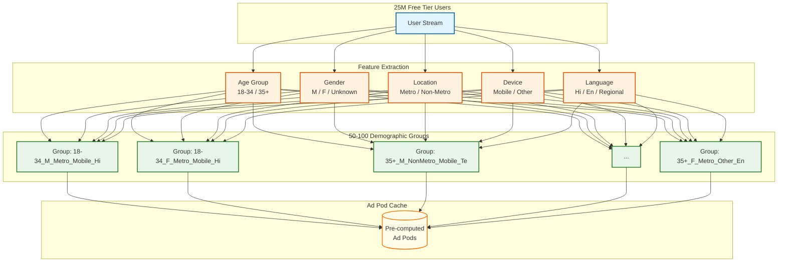
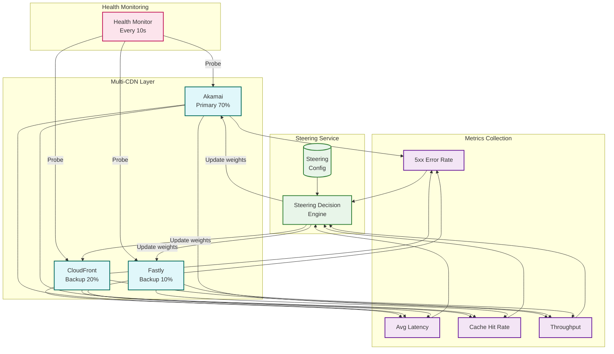
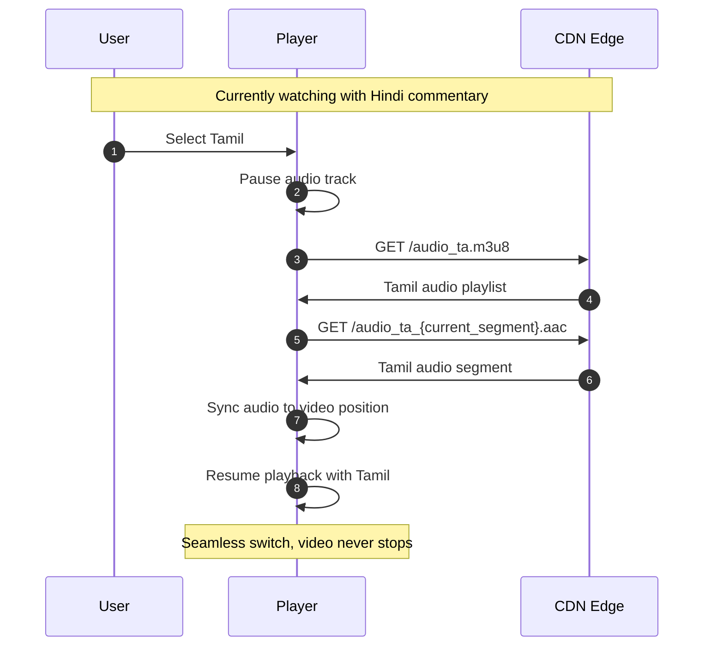

# Deep Dive and Bottlenecks

## Overview

This document provides detailed analysis of the critical components that make live sports streaming at 59M+ concurrent scale possible. Each section addresses specific engineering challenges unique to handling India's massive cricket viewership.

---

## Critical Component 1: Traffic Spike Handling

### The Challenge

```
Normal Day → IPL Match Day

Viewers
60M ┤                                    ╭─────────────────
    │                               ╭────╯
50M ┤                          ╭────╯
    │                     ╭────╯
40M ┤                ╭────╯
    │           ╭────╯
30M ┤      ╭────╯
    │  ╭───╯
20M ┤──╯
    │
10M ┤
    │
 3M ┼────────────────┐               ← Baseline
    ┼────┬────┬────┬─┴──┬────┬────┬────┬────┬────┬────
    6PM  7PM  8PM  TOSS START     10PM 11PM
                   │    │
                   │    └─ 20x spike in 10 minutes
                   │
                   └─ First surge (toss announcement)

The Problem:
├─ 20x traffic increase in 10 minutes
├─ Thundering herd to origin servers
├─ API authentication storm (30M users × 3 calls)
├─ CDN cache cold for new segments
└─ No margin for error during high-profile matches
```

### Pre-warming Timeline

```mermaid
flowchart LR
    subgraph T60["T-60 Minutes"]
        A1[Trigger L1 Scale]
        A2[2x Baseline Capacity]
        A3[Start Cache Warming]
    end

    subgraph T30["T-30 Minutes"]
        B1[Trigger L2 Scale]
        B2[5x Baseline Capacity]
        B3[Pre-position Ad Pods]
        B4[Warm Auth Token Cache]
    end

    subgraph T10["T-10 Minutes"]
        C1[Trigger L3 Scale]
        C2[10x Baseline Capacity]
        C3[Pre-generate Manifests]
        C4[Establish CDN Connections]
    end

    subgraph T0["Match Start"]
        D1[Thundering Herd Arrives]
        D2[Origin Shield Coalesces]
        D3[Reactive L4 Scaling]
    end

    T60 --> T30 --> T10 --> T0

    classDef phase fill:#e8f5e9,stroke:#2e7d32,stroke-width:2px
    class T60,T30,T10,T0 phase
```



### Pre-warming Actions by Phase

| Phase | Time | Actions | Success Criteria |
|-------|------|---------|------------------|
| **L1** | T-60 min | Scale transcoders 2x, Scale API gateways 2x, Initialize monitoring dashboards | All instances healthy |
| **L2** | T-30 min | Scale to 5x, Pre-compute ad pods for all demographics, Warm entitlement cache for premium users | Cache hit rate >95% |
| **L3** | T-10 min | Scale to 10x, Pre-generate manifest templates, Establish persistent CDN connections, Alert on-call engineers | All systems green |
| **L4** | T-0 (reactive) | Monitor and add capacity, Enable aggressive request coalescing, Activate graceful degradation if needed | Error rate <0.1% |

### Origin Shield: Request Coalescing

```
Without Origin Shield:
┌─────────────────────────────────────────────────────────────┐
│                     1,000,000 Users                          │
│    Request segment #1542 at the same millisecond            │
└─────────────────────────────────────────────────────────────┘
                              │
                              ▼
                    ┌─────────────────┐
                    │   CDN Edge      │
                    │ (Cache miss)    │
                    └────────┬────────┘
                             │
              1,000,000 requests to origin
                             │
                             ▼
                    ┌─────────────────┐
                    │     Origin      │ ← OVERWHELMED
                    │    Packager     │
                    └─────────────────┘

With Origin Shield:
┌─────────────────────────────────────────────────────────────┐
│                     1,000,000 Users                          │
└─────────────────────────────────────────────────────────────┘
                              │
                              ▼
                    ┌─────────────────┐
                    │   CDN Edge      │
                    │ (Cache miss)    │
                    └────────┬────────┘
                             │
                    1 request (coalesced)
                             │
                             ▼
                    ┌─────────────────┐
                    │  Origin Shield  │
                    │   (Collapse     │
                    │    requests)    │
                    └────────┬────────┘
                             │
                    1 request to origin
                             │
                             ▼
                    ┌─────────────────┐
                    │     Origin      │ ← Protected
                    │    Packager     │
                    └─────────────────┘
                             │
                    Response fanned out
                    to 1,000,000 users
```

### Request Coalescing Implementation

```python
class OriginShield:
    """
    Coalesce concurrent requests for the same resource.
    Critical for protecting origin during live segment requests.
    """

    def __init__(self):
        self.pending_requests: Dict[str, asyncio.Future] = {}
        self.lock = asyncio.Lock()

    async def get_segment(self, segment_key: str) -> bytes:
        """
        Get segment with request coalescing.
        If request already in-flight, wait for it instead of issuing new one.
        """
        async with self.lock:
            if segment_key in self.pending_requests:
                # Request already in-flight, wait for it
                return await self.pending_requests[segment_key]

            # First request for this segment, create future
            future = asyncio.get_event_loop().create_future()
            self.pending_requests[segment_key] = future

        try:
            # Fetch from origin
            segment_data = await self._fetch_from_origin(segment_key)

            # Resolve future for all waiting requests
            future.set_result(segment_data)
            return segment_data

        except Exception as e:
            future.set_exception(e)
            raise

        finally:
            async with self.lock:
                del self.pending_requests[segment_key]
```

---

## Critical Component 2: SSAI at Scale

### The Challenge

| Metric | Scale |
|--------|-------|
| Free tier users | 25M+ concurrent |
| Ad breaks per match | ~25 |
| Unique ad decisions needed | 25M × 25 = 625M |
| Decision latency budget | <100ms |
| Cache efficiency required | >99% |

### Why Not 1:1 Personalization?

```
Naive Approach: 1:1 Ad Personalization
─────────────────────────────────────

25M users × unique ad decision = 25M cache entries
25M users × unique manifest = 25M origin requests
25M cache misses × 100ms = System collapse

Problem: No caching benefit, origin overwhelmed

─────────────────────────────────────────────────

Demographic Grouping Approach
─────────────────────────────

25M users ÷ 50 demographic groups = 500K users per group
50 groups × unique ad decision = 50 cache entries
50 cache entries × 4KB manifest = 200KB cache footprint

Benefit: 99.9998% cache hit rate possible
```

### Demographic Grouping Strategy



### SSAI Decision Flow

```
Timeline: Ad Break at Strategic Timeout
────────────────────────────────────────

T-5s (before break):
├─ Match controller signals upcoming break
├─ Ad Decision Engine receives break notification
└─ Pre-computation begins for all demographic groups

T-0 (break starts):
├─ Manifest generator inserts #EXT-X-DATERANGE ad marker
├─ Players detect ad marker
└─ 25M clients request ad manifest

T+0 to T+100ms:
├─ Requests hit CDN edge
├─ CDN checks cache by demographic group
│   ├─ 99%+ cache hit → Return cached manifest
│   └─ <1% cache miss → Forward to Ad Stitcher
├─ Ad Stitcher checks Ad Pod Cache
│   ├─ Hit → Stitch and return
│   └─ Miss → Query Ad Server (rare)
└─ Response to client

T+100ms to T+45s:
├─ Client plays ad segments
├─ Client sends impression beacons
└─ Beacons aggregated via Kafka

T+45s (break ends):
├─ Players detect discontinuity marker
└─ Resume live content
```

### Graceful Degradation for SSAI

| Level | Trigger | Action | Impact |
|-------|---------|--------|--------|
| Normal | System healthy | Full personalization | Best targeting |
| Level 1 | Ad server latency >200ms | Use cached group pods | Slightly stale targeting |
| Level 2 | Ad server error rate >1% | Use generic cached pods | No targeting |
| Level 3 | Ad system overloaded | Skip targeting, use fallback pod | Generic ads only |
| Level 4 | Ad system down | Insert slate/promo | No revenue, but no black screen |

---

## Critical Component 3: Multi-CDN Orchestration

### Architecture



### CDN Health Metrics

| Metric | Healthy | Degraded | Unhealthy | Action |
|--------|---------|----------|-----------|--------|
| 5xx Error Rate | <0.1% | 0.1-1% | >1% | Failover at unhealthy |
| Avg Latency | <100ms | 100-500ms | >500ms | Reduce traffic at degraded |
| Cache Hit Rate | >95% | 85-95% | <85% | Warm cache, investigate |
| Throughput | <80% cap | 80-95% cap | >95% cap | Shed traffic |

### Failover Triggers and Response

```python
class CDNFailoverManager:
    """
    Manages automatic failover between CDN providers.
    """

    FAILOVER_THRESHOLDS = {
        "error_rate_5xx": 0.01,      # 1%
        "latency_p99_ms": 500,
        "availability": 0.995,        # 99.5%
    }

    RECOVERY_THRESHOLDS = {
        "error_rate_5xx": 0.005,     # 0.5% (stricter to recover)
        "latency_p99_ms": 200,
        "availability": 0.999,
    }

    async def evaluate_cdn_health(self, cdn: str) -> HealthStatus:
        """Evaluate CDN health and determine status."""
        metrics = await self.get_current_metrics(cdn)

        # Check failover conditions
        if (metrics.error_rate > self.FAILOVER_THRESHOLDS["error_rate_5xx"] or
            metrics.latency_p99 > self.FAILOVER_THRESHOLDS["latency_p99_ms"] or
            metrics.availability < self.FAILOVER_THRESHOLDS["availability"]):
            return HealthStatus.UNHEALTHY

        # Check if degraded
        if (metrics.error_rate > 0.005 or
            metrics.latency_p99 > 200):
            return HealthStatus.DEGRADED

        return HealthStatus.HEALTHY

    async def execute_failover(
        self,
        failed_cdn: str,
        target_cdns: List[str]
    ) -> None:
        """Execute traffic failover from failed CDN."""

        # Calculate traffic to redistribute
        failed_traffic = await self.get_cdn_traffic_share(failed_cdn)

        # Redistribute proportionally to healthy CDNs
        healthy_cdns = [
            cdn for cdn in target_cdns
            if await self.evaluate_cdn_health(cdn) != HealthStatus.UNHEALTHY
        ]

        redistribution = failed_traffic / len(healthy_cdns)

        for cdn in healthy_cdns:
            current = await self.get_cdn_traffic_share(cdn)
            await self.set_cdn_traffic_share(cdn, current + redistribution)

        await self.set_cdn_traffic_share(failed_cdn, 0)

        # Alert operations
        await self.alert(
            severity="P1",
            message=f"CDN {failed_cdn} failed over. Traffic redistributed."
        )
```

---

## Critical Component 4: Multi-Language Commentary

### Architecture

```
Video Segments (Shared):
┌───────────────────────────────────────────────────────────────┐
│  segment_1.ts  │  segment_2.ts  │  segment_3.ts  │  ...      │
│    (4 sec)     │    (4 sec)     │    (4 sec)     │           │
│   All users    │   All users    │   All users    │           │
└───────────────────────────────────────────────────────────────┘

Audio Segments (Per Language):
┌───────────────────────────────────────────────────────────────┐
│ Hindi:    audio_hi_1.aac │ audio_hi_2.aac │ audio_hi_3.aac │ │
├───────────────────────────────────────────────────────────────┤
│ English:  audio_en_1.aac │ audio_en_2.aac │ audio_en_3.aac │ │
├───────────────────────────────────────────────────────────────┤
│ Tamil:    audio_ta_1.aac │ audio_ta_2.aac │ audio_ta_3.aac │ │
├───────────────────────────────────────────────────────────────┤
│ Telugu:   audio_te_1.aac │ audio_te_2.aac │ audio_te_3.aac │ │
├───────────────────────────────────────────────────────────────┤
│ Kannada:  audio_kn_1.aac │ audio_kn_2.aac │ audio_kn_3.aac │ │
├───────────────────────────────────────────────────────────────┤
│ Bengali:  audio_bn_1.aac │ audio_bn_2.aac │ audio_bn_3.aac │ │
├───────────────────────────────────────────────────────────────┤
│ Marathi:  audio_mr_1.aac │ audio_mr_2.aac │ audio_mr_3.aac │ │
├───────────────────────────────────────────────────────────────┤
│ Malayalam: audio_ml_1.aac│ audio_ml_2.aac │ audio_ml_3.aac │ │
└───────────────────────────────────────────────────────────────┘

Client Selection:
├─ Master manifest lists all audio tracks as EXT-X-MEDIA
├─ Client selects preferred language at startup
├─ Language switch: Client requests different audio playlist
└─ Video segments unchanged (no rebuffer)
```

### Language Switch Flow



### Storage Optimization

| Component | Per Segment | For 4-hour DVR | Total (8 languages) |
|-----------|-------------|----------------|---------------------|
| Video (1080p) | 2 MB | 7.2 GB | 7.2 GB (shared) |
| Audio (per lang) | 100 KB | 360 MB | 2.88 GB |
| **Total** | - | - | **~10 GB per match** |

Without shared video:
- 8 languages × 7.2 GB video = 57.6 GB
- Savings: **~47 GB per match**

---

## Concurrency and Race Conditions

### Session Handoff (Device Switch)

```
Scenario: User switches from mobile to TV during match

Timeline:
────────────────────────────────────────────────────

T0: Mobile watching at position 1:30:00
    Session: {user: U1, device: mobile, pos: 5400000ms}

T1: User opens TV app, requests playback
    Problem: If TV starts from beginning, user loses position
    Problem: If TV starts from position, concurrent stream issue

Solution: Session handoff protocol

Mobile:
├─ Receives "session_transfer" push notification
├─ Saves current position to session store
├─ Gracefully stops playback
└─ Shows "Watching on TV" message

TV:
├─ Requests playback with "handoff=true"
├─ Server checks for existing session
├─ Retrieves position from session store
├─ Issues new playback token
└─ Starts playback at transferred position

Session Store Update:
├─ Delete: session:{user}:{mobile}
├─ Create: session:{user}:{tv} with position
└─ Atomic operation to prevent race
```

### DVR Edge Cases

```python
class DVRManager:
    """Handle DVR edge cases for live streams."""

    async def handle_seek(
        self,
        stream_id: str,
        current_pos_ms: int,
        target_pos_ms: int,
        dvr_window_ms: int = 14400000  # 4 hours
    ) -> SeekResult:
        """Handle DVR seek with edge case handling."""

        live_edge = await self.get_live_edge_position(stream_id)
        dvr_start = live_edge - dvr_window_ms

        # Edge case 1: Seeking before DVR window
        if target_pos_ms < dvr_start:
            return SeekResult(
                success=False,
                error="POSITION_UNAVAILABLE",
                available_start=dvr_start,
                message="Content no longer available in DVR"
            )

        # Edge case 2: Seeking past live edge
        if target_pos_ms > live_edge:
            return SeekResult(
                success=True,
                actual_position=live_edge,
                is_live=True,
                message="Jumped to live"
            )

        # Edge case 3: Seeking during ad break
        ad_break = await self.get_ad_break_at_position(stream_id, target_pos_ms)
        if ad_break:
            # Skip to after ad break (ads already played in DVR)
            return SeekResult(
                success=True,
                actual_position=ad_break.end_position,
                skipped_ads=True,
                message="Skipped past ad break"
            )

        # Normal seek
        return SeekResult(
            success=True,
            actual_position=target_pos_ms,
            is_live=False
        )
```

---

## Bottleneck Analysis

| Rank | Bottleneck | Impact | Mitigation | Monitoring |
|------|------------|--------|------------|------------|
| 1 | **Manifest requests at match start** | System collapse without coalescing | Origin Shield + pre-generation | Manifest request rate, cache hit |
| 2 | **Ad decision latency** | Black screen during ad breaks | Demographic grouping, pre-compute | Ad decision P99, cache hit |
| 3 | **CDN cache cold start** | Rebuffering for new segments | Pre-positioning, multi-CDN | Cache hit rate, origin load |
| 4 | **Auth token storm** | Login failures | Token caching, pre-auth for known users | Auth latency P99, failure rate |
| 5 | **Segment storage I/O** | Origin cannot serve segments | SSD, tiered storage, aggressive caching | Storage IOPS, latency |

---

## System Health Indicators

### Green (Healthy)

| Metric | Threshold |
|--------|-----------|
| Error rate (5xx) | < 0.1% |
| Playback start time | < 3s P95 |
| Rebuffering ratio | < 0.5% |
| CDN cache hit rate | > 95% |
| Ad decision latency | < 100ms P99 |

### Yellow (Degraded)

| Metric | Threshold | Action |
|--------|-----------|--------|
| Error rate | 0.1% - 1% | Alert on-call, increase capacity |
| Playback start | 3s - 5s P95 | Investigate CDN, reduce quality floor |
| Rebuffering | 0.5% - 2% | Investigate network, adjust ABR |
| Cache hit | 85% - 95% | Warm cache, check origin |
| Ad latency | 100ms - 500ms | Enable fallback pods |

### Red (Critical)

| Metric | Threshold | Action |
|--------|-----------|--------|
| Error rate | > 1% | Incident declared, failover CDN |
| Playback start | > 5s P95 | Reduce features, cap quality |
| Rebuffering | > 2% | Emergency quality reduction |
| Cache hit | < 85% | Bypass origin, serve stale |
| Ad latency | > 500ms | Disable personalization |

---

## Next Steps

See [05-scalability-and-reliability.md](./05-scalability-and-reliability.md) for scaling strategies and fault tolerance mechanisms.
