# Scalability and Reliability

## Overview

This document details the scaling strategies and fault tolerance mechanisms required to reliably serve 59M+ concurrent viewers during peak sporting events. The architecture must handle 20x traffic spikes within 10 minutes while maintaining 99.95% availability.

---

## Scalability Strategy

### Horizontal Scaling by Component

| Component | Scaling Unit | Min Instances | Peak Instances | Scale Trigger |
|-----------|--------------|---------------|----------------|---------------|
| API Gateway | Pod | 50 | 400 | CPU >70%, RPS >10K/pod |
| Auth Service | Pod | 30 | 200 | Latency P99 >50ms |
| Entitlement | Pod | 20 | 100 | Cache miss >5% |
| Transcoder | EC2 | 10 | 50 | Queue depth >100 |
| Packager | Pod | 20 | 200 | Segment delay >1s |
| Origin Shield | Pod | 50 | 400 | Request rate, CPU |
| Ad Stitcher | Pod | 30 | 250 | Latency P99 >100ms |
| Manifest Gen | Pod | 30 | 200 | Request rate |

### Ladder-Based Scaling Timeline

```mermaid
flowchart TB
    subgraph L0["L0: Baseline (Always-On)"]
        L0A[100 instances total]
        L0B[Handles 3M concurrent]
        L0C[Normal day traffic]
    end

    subgraph L1["L1: Pre-Warm (T-60 min)"]
        L1A[200 instances total]
        L1B[Handles 6M concurrent]
        L1C[Start cache warming]
    end

    subgraph L2["L2: Ready (T-30 min)"]
        L2A[350 instances total]
        L2B[Handles 15M concurrent]
        L2C[Pre-compute ad pods]
        L2D[Warm auth cache]
    end

    subgraph L3["L3: Positioned (T-10 min)"]
        L3A[500 instances total]
        L3B[Handles 30M concurrent]
        L3C[Pre-generate manifests]
        L3D[Alert engineering on-call]
    end

    subgraph L4["L4: Reactive (Match Live)"]
        L4A[500-800 instances]
        L4B[Handles 60M+ concurrent]
        L4C[90-second scaling]
        L4D[Monitor and adjust]
    end

    L0 -->|"T-60 min<br/>Match scheduled"| L1
    L1 -->|"T-30 min<br/>Pre-show starts"| L2
    L2 -->|"T-10 min<br/>Toss approaching"| L3
    L3 -->|"T-0<br/>Match starts"| L4

    classDef baseline fill:#e8f5e9,stroke:#2e7d32,stroke-width:2px
    classDef prewarm fill:#fff3e0,stroke:#e65100,stroke-width:2px
    classDef ready fill:#e1f5fe,stroke:#01579b,stroke-width:2px
    classDef positioned fill:#fce4ec,stroke:#c2185b,stroke-width:2px
    classDef reactive fill:#f3e5f5,stroke:#6a1b9a,stroke-width:2px

    class L0,L0A,L0B,L0C baseline
    class L1,L1A,L1B,L1C prewarm
    class L2,L2A,L2B,L2C,L2D ready
    class L3,L3A,L3B,L3C,L3D positioned
    class L4,L4A,L4B,L4C,L4D reactive
```



### 90-Second Infrastructure Provisioning

```
Target: Add significant capacity in 90 seconds

Strategy:
├─ Pre-baked AMIs with all dependencies
├─ Warm instance pools (scaled down but running)
├─ Container images pre-pulled to nodes
├─ Configuration pre-staged in Parameter Store
└─ Health checks optimized for fast validation

Timeline Breakdown:
─────────────────────────────────────────

T+0s:   Scaling trigger fired
        ├─ CloudWatch alarm triggers
        └─ Lambda invokes Auto Scaling API

T+10s:  Instance request submitted
        ├─ ASG requests new instances
        └─ Warm pool instances activating

T+30s:  Instances launching
        ├─ Pre-baked AMI boots
        └─ User data script minimal

T+50s:  Application starting
        ├─ Container pulls (pre-cached)
        └─ Service initialization

T+70s:  Health checks passing
        ├─ ALB health check (10s interval)
        └─ Readiness probe success

T+90s:  Traffic serving
        ├─ Instance added to target group
        └─ Requests being served

Warm Pool Strategy:
├─ Maintain 20% of peak capacity in warm state
├─ Warm instances: running but not in service
├─ Activation time: ~30 seconds (vs 90 for cold)
└─ Cost: ~40% of running instance
```

---

## Compute Platform Architecture

### AWS Infrastructure Layout

```
Region: ap-south-1 (Mumbai)
────────────────────────────────────────

┌─────────────────────────────────────────────────────────────┐
│                        VPC                                   │
├─────────────────────────────────────────────────────────────┤
│                                                             │
│  ┌─────────────────────┐  ┌─────────────────────┐          │
│  │    AZ-1 (ap-south-1a)│  │    AZ-2 (ap-south-1b)│          │
│  │                     │  │                     │          │
│  │  ┌───────────────┐  │  │  ┌───────────────┐  │          │
│  │  │ EKS Node Group │  │  │  │ EKS Node Group │  │          │
│  │  │  (API/Control) │  │  │  │  (API/Control) │  │          │
│  │  │  100-200 nodes │  │  │  │  100-200 nodes │  │          │
│  │  └───────────────┘  │  │  └───────────────┘  │          │
│  │                     │  │                     │          │
│  │  ┌───────────────┐  │  │  ┌───────────────┐  │          │
│  │  │ EC2 Fleet     │  │  │  │ EC2 Fleet     │  │          │
│  │  │  (Transcoding)│  │  │  │  (Transcoding)│  │          │
│  │  │  GPU instances│  │  │  │  GPU instances│  │          │
│  │  └───────────────┘  │  │  └───────────────┘  │          │
│  │                     │  │                     │          │
│  └─────────────────────┘  └─────────────────────┘          │
│                                                             │
│  ┌─────────────────────────────────────────────────────┐   │
│  │              ElastiCache (Redis Cluster)             │   │
│  │              Session + Cache Layer                   │   │
│  │              50+ nodes, Multi-AZ                     │   │
│  └─────────────────────────────────────────────────────┘   │
│                                                             │
│  ┌─────────────────────────────────────────────────────┐   │
│  │              MSK (Kafka) Cluster                     │   │
│  │              Event Streaming                         │   │
│  │              100+ partitions per topic               │   │
│  └─────────────────────────────────────────────────────┘   │
│                                                             │
└─────────────────────────────────────────────────────────────┘

Peak Configuration:
├─ 500+ EC2 instances
├─ 8,000 CPU cores
├─ 16 TB RAM
├─ 400+ Kubernetes pods per service
└─ 50+ Redis cluster nodes
```

### Instance Types by Workload

| Workload | Instance Type | vCPU | Memory | Quantity (Peak) |
|----------|---------------|------|--------|-----------------|
| API/Control | m6i.2xlarge | 8 | 32 GB | 200 |
| Transcoding | g4dn.xlarge | 4 | 16 GB + GPU | 50 |
| Packaging | c6i.2xlarge | 8 | 16 GB | 100 |
| Origin Shield | r6i.2xlarge | 8 | 64 GB | 100 |
| Redis Cache | r6g.2xlarge | 8 | 52 GB | 50 |
| Kafka Broker | m6i.4xlarge | 16 | 64 GB | 30 |

---

## CDN Scaling

### Multi-CDN Capacity Distribution

```
Total Required Egress: 80+ Tbps at peak

CDN Distribution:
────────────────────────────────────────

Akamai (Primary - 70%):
├─ Capacity: 56 Tbps
├─ India PoPs: 40+
├─ ISP partnerships: Jio, Airtel, BSNL
└─ Cost: Premium but best India coverage

CloudFront (Backup - 20%):
├─ Capacity: 16 Tbps
├─ India PoPs: 10+
├─ Integration: Native AWS
└─ Cost: Moderate

Fastly (Backup - 10%):
├─ Capacity: 8 Tbps
├─ India PoPs: 5+
├─ Feature: Edge compute
└─ Cost: Moderate

Reserve Headroom:
├─ Total capacity: 80 Tbps active
├─ Reserve: 40 Tbps (50% headroom)
└─ Emergency: Additional CDNs on standby
```

### ISP Peering Strategy

```
Challenge: India's last-mile connectivity

Solution: Direct ISP Partnerships
────────────────────────────────

┌─────────────────────────────────────────────────────────────┐
│                     Hotstar Origin                           │
└───────────────────────────┬─────────────────────────────────┘
                            │
            ┌───────────────┼───────────────┐
            │               │               │
            ▼               ▼               ▼
       ┌─────────┐    ┌─────────┐    ┌─────────┐
       │ Jio     │    │ Airtel  │    │ BSNL    │
       │ Private │    │ Private │    │ Private │
       │ Peering │    │ Peering │    │ Peering │
       └────┬────┘    └────┬────┘    └────┬────┘
            │              │              │
            ▼              ▼              ▼
       ┌─────────┐    ┌─────────┐    ┌─────────┐
       │ Jio     │    │ Airtel  │    │ BSNL    │
       │ Users   │    │ Users   │    │ Users   │
       │ (40%)   │    │ (35%)   │    │ (15%)   │
       └─────────┘    └─────────┘    └─────────┘

Benefits:
├─ Reduced latency (skip public internet)
├─ Better throughput during peak
├─ Cost savings on transit
└─ Priority during congestion
```

---

## Reliability and Fault Tolerance

### Single Points of Failure (SPOF) Analysis

| Component | Is SPOF? | Mitigation | RTO |
|-----------|----------|------------|-----|
| Stadium Feed | Yes (external) | Backup encoder, multiple feeds | N/A |
| Primary Transcoder | No | N+2 redundancy, auto-failover | 10s |
| Packager | No | Active-active, stateless | 5s |
| Origin Shield | No | Multi-AZ, auto-scaling | 30s |
| Primary CDN (Akamai) | No | Multi-CDN steering | 60s |
| API Gateway | No | Multi-AZ ALB | 30s |
| Redis Cluster | No | Cluster mode, replicas | 30s |
| Kafka Cluster | No | Multi-AZ, replication | 60s |
| DRM License Server | No | Multi-region, cached licenses | 30s |

### Circuit Breaker Patterns

```python
class StreamingCircuitBreaker:
    """
    Circuit breaker implementation for streaming services.
    Prevents cascade failures during CDN or origin issues.
    """

    def __init__(self, service_name: str):
        self.service_name = service_name
        self.failure_count = 0
        self.success_count = 0
        self.state = CircuitState.CLOSED
        self.last_failure_time = None

        # Configuration
        self.failure_threshold = 5
        self.success_threshold = 3
        self.timeout_seconds = 30
        self.half_open_max_requests = 10

    async def call(self, func, *args, **kwargs):
        """Execute function with circuit breaker protection."""

        if self.state == CircuitState.OPEN:
            if self._should_attempt_reset():
                self.state = CircuitState.HALF_OPEN
            else:
                raise CircuitOpenError(
                    f"Circuit open for {self.service_name}"
                )

        try:
            result = await func(*args, **kwargs)
            self._record_success()
            return result

        except Exception as e:
            self._record_failure()
            raise

    def _record_failure(self):
        self.failure_count += 1
        self.last_failure_time = time.time()

        if self.failure_count >= self.failure_threshold:
            self.state = CircuitState.OPEN
            self._alert_circuit_open()

    def _record_success(self):
        if self.state == CircuitState.HALF_OPEN:
            self.success_count += 1
            if self.success_count >= self.success_threshold:
                self.state = CircuitState.CLOSED
                self._reset_counts()
        else:
            self.failure_count = 0

    def _should_attempt_reset(self) -> bool:
        return (
            time.time() - self.last_failure_time
            > self.timeout_seconds
        )

# Usage in CDN steering
cdn_circuits = {
    "akamai": StreamingCircuitBreaker("akamai"),
    "cloudfront": StreamingCircuitBreaker("cloudfront"),
    "fastly": StreamingCircuitBreaker("fastly"),
}

async def fetch_segment(segment_url: str, cdn: str):
    return await cdn_circuits[cdn].call(
        http_client.get, segment_url
    )
```

### Chaos Engineering: Hulk Load Testing

```
Hulk: Hotstar's internal load testing framework

Test Scenarios:
────────────────────────────────────────

Scenario 1: Thundering Herd Simulation
├─ Simulate 10M users joining in 5 minutes
├─ Verify origin shield coalescing
├─ Measure manifest generation latency
└─ Target: < 3s playback start

Scenario 2: CDN Failover
├─ Inject 50% packet loss on primary CDN
├─ Verify traffic shifts to backup CDN
├─ Measure failover time
└─ Target: < 60s full failover

Scenario 3: Ad System Degradation
├─ Inject 500ms latency on ad decisions
├─ Verify fallback to cached pods
├─ Measure user-visible impact
└─ Target: No black screens

Scenario 4: Zone Failure
├─ Simulate AZ-1 complete failure
├─ Verify cross-AZ failover
├─ Measure recovery time
└─ Target: < 2 min full recovery

Scenario 5: Database Saturation
├─ Inject Redis cluster partition
├─ Verify cache-aside fallback
├─ Measure degraded performance
└─ Target: Service continues (slower)

Execution Schedule:
├─ Weekly: Scenarios 1, 2
├─ Monthly: Scenarios 3, 4, 5
├─ Pre-tournament: Full suite
└─ Post-incident: Relevant scenario
```

---

## Graceful Degradation Levels

```mermaid
flowchart TB
    subgraph Level0["Level 0: Full Features"]
        L0A[4K streaming]
        L0B[Personalized ads]
        L0C[Interactive features]
        L0D[All languages]
    end

    subgraph Level1["Level 1: Reduced Personalization"]
        L1A[4K streaming]
        L1B[Generic ads by region]
        L1C[Interactive features]
        L1D[All languages]
    end

    subgraph Level2["Level 2: No Interactive"]
        L2A[1080p max]
        L2B[Generic ads]
        L2C[No polls/predictions]
        L2D[All languages]
    end

    subgraph Level3["Level 3: Quality Cap"]
        L3A[720p max]
        L3B[Generic ads]
        L3C[No interactive]
        L3D[Hindi + English only]
    end

    subgraph Level4["Level 4: Emergency Mode"]
        L4A[Audio only option]
        L4B[No ads - show slate]
        L4C[Core playback only]
        L4D[Hindi only]
    end

    Level0 -->|"Error rate > 0.5%"| Level1
    Level1 -->|"Error rate > 1%"| Level2
    Level2 -->|"Error rate > 2%"| Level3
    Level3 -->|"Error rate > 5%"| Level4

    classDef green fill:#e8f5e9,stroke:#2e7d32,stroke-width:2px
    classDef yellow fill:#fff3e0,stroke:#e65100,stroke-width:2px
    classDef orange fill:#ffe0b2,stroke:#ef6c00,stroke-width:2px
    classDef red fill:#ffcdd2,stroke:#c62828,stroke-width:2px
    classDef critical fill:#f3e5f5,stroke:#6a1b9a,stroke-width:2px

    class Level0,L0A,L0B,L0C,L0D green
    class Level1,L1A,L1B,L1C,L1D yellow
    class Level2,L2A,L2B,L2C,L2D orange
    class Level3,L3A,L3B,L3C,L3D red
    class Level4,L4A,L4B,L4C,L4D critical
```



### Degradation Trigger Matrix

| Metric | Level 1 | Level 2 | Level 3 | Level 4 |
|--------|---------|---------|---------|---------|
| Error Rate (5xx) | >0.5% | >1% | >2% | >5% |
| Playback Start P95 | >5s | >8s | >12s | >20s |
| Rebuffering Ratio | >1% | >2% | >5% | >10% |
| Origin CPU | >80% | >90% | >95% | >99% |
| CDN Capacity | >85% | >90% | >95% | >99% |

### Degradation Actions

```python
class DegradationManager:
    """Manages graceful degradation during incidents."""

    LEVELS = {
        0: DegradationLevel(
            name="FULL_FEATURES",
            max_quality="4k",
            ad_personalization=True,
            interactive_features=True,
            all_languages=True
        ),
        1: DegradationLevel(
            name="REDUCED_PERSONALIZATION",
            max_quality="4k",
            ad_personalization=False,  # Generic ads
            interactive_features=True,
            all_languages=True
        ),
        2: DegradationLevel(
            name="NO_INTERACTIVE",
            max_quality="1080p",
            ad_personalization=False,
            interactive_features=False,  # Disable Watch'N Play
            all_languages=True
        ),
        3: DegradationLevel(
            name="QUALITY_CAP",
            max_quality="720p",
            ad_personalization=False,
            interactive_features=False,
            all_languages=False,  # Hindi + English only
            disabled_features=["chromecast", "pip"]
        ),
        4: DegradationLevel(
            name="EMERGENCY_MODE",
            max_quality="480p",
            ad_personalization=False,
            interactive_features=False,
            all_languages=False,
            audio_only_option=True,
            disabled_features=["all_non_essential"]
        )
    }

    async def evaluate_and_apply(self, metrics: SystemMetrics) -> int:
        """Evaluate metrics and apply appropriate degradation level."""

        current_level = await self.get_current_level()
        target_level = self._calculate_target_level(metrics)

        if target_level != current_level:
            await self._apply_degradation(target_level)
            await self._notify_operations(current_level, target_level)

        return target_level

    def _calculate_target_level(self, metrics: SystemMetrics) -> int:
        """Determine degradation level from metrics."""

        if metrics.error_rate > 0.05 or metrics.rebuffer_ratio > 0.10:
            return 4
        elif metrics.error_rate > 0.02 or metrics.rebuffer_ratio > 0.05:
            return 3
        elif metrics.error_rate > 0.01 or metrics.rebuffer_ratio > 0.02:
            return 2
        elif metrics.error_rate > 0.005 or metrics.rebuffer_ratio > 0.01:
            return 1
        else:
            return 0
```

---

## Disaster Recovery

### Recovery Objectives

| Scenario | RTO | RPO | Strategy |
|----------|-----|-----|----------|
| Single AZ failure | 2 min | 0 | Auto-failover to other AZ |
| Primary CDN failure | 1 min | 0 | Multi-CDN steering |
| Redis cluster failure | 5 min | 1 min | Cluster failover + rebuild |
| Kafka broker failure | 2 min | 0 | Replica promotion |
| Complete region failure | 30 min | 5 min | DR region activation |
| DRM system failure | 5 min | 0 | Cached licenses (2-hour validity) |

### DR Region Architecture

```
Primary Region: ap-south-1 (Mumbai)
DR Region: ap-southeast-1 (Singapore)

Data Replication:
────────────────────────────────────────

┌─────────────────────┐         ┌─────────────────────┐
│    Mumbai (Primary) │         │  Singapore (DR)     │
├─────────────────────┤         ├─────────────────────┤
│                     │         │                     │
│  PostgreSQL Primary ├────────►│  PostgreSQL Replica │
│   (Async replica)   │  <1 min │   (Read replica)    │
│                     │         │                     │
│  Redis Primary      ├────────►│  Redis Replica      │
│   (Async replica)   │  <30s   │   (Warm standby)    │
│                     │         │                     │
│  S3 Segments        ├────────►│  S3 Segments        │
│   (Cross-region)    │  <5 min │   (Replicated)      │
│                     │         │                     │
└─────────────────────┘         └─────────────────────┘

DR Activation:
├─ Route53 health check failure triggers
├─ DNS failover to Singapore endpoints
├─ Singapore replicas promoted to primary
├─ CDN steering updated to route through Singapore
└─ Estimated activation: 15-30 minutes
```

---

## Capacity Planning

### Match-by-Match Forecasting

```python
class CapacityForecaster:
    """Forecast capacity needs based on match metadata."""

    # Historical multipliers
    MATCH_TYPE_MULTIPLIERS = {
        "ipl_final": 1.5,
        "ipl_qualifier": 1.3,
        "ipl_regular": 1.0,
        "world_cup_final": 2.0,
        "world_cup_semifinal": 1.8,
        "world_cup_group": 1.4,
        "bilateral_ind": 0.8,
        "bilateral_other": 0.3,
    }

    TEAM_POPULARITY = {
        "india": 1.5,
        "csk": 1.3,
        "mi": 1.3,
        "rcb": 1.2,
        "kkr": 1.1,
        "pakistan": 1.4,  # India vs Pakistan
        # ... other teams
    }

    TIME_SLOT_MULTIPLIERS = {
        "prime_time": 1.2,      # 7-10 PM IST
        "afternoon": 0.8,       # 2-5 PM IST
        "late_night": 0.6,      # After 10 PM IST
        "weekend": 1.1,
    }

    def forecast_peak_viewers(
        self,
        match_type: str,
        teams: List[str],
        time_slot: str,
        is_weekend: bool,
        historical_avg: int
    ) -> int:
        """Forecast peak concurrent viewers for a match."""

        base = historical_avg

        # Apply match type multiplier
        base *= self.MATCH_TYPE_MULTIPLIERS.get(match_type, 1.0)

        # Apply team popularity (use max of two teams)
        team_mult = max(
            self.TEAM_POPULARITY.get(t, 1.0) for t in teams
        )
        base *= team_mult

        # Apply time slot
        base *= self.TIME_SLOT_MULTIPLIERS.get(time_slot, 1.0)

        # Weekend bonus
        if is_weekend:
            base *= self.TIME_SLOT_MULTIPLIERS["weekend"]

        # Add 20% buffer for safety
        return int(base * 1.2)

    def calculate_infrastructure_needs(
        self,
        peak_viewers: int
    ) -> InfrastructureRequirements:
        """Calculate infrastructure based on viewer forecast."""

        return InfrastructureRequirements(
            api_instances=max(50, peak_viewers // 150000),
            transcoder_instances=max(10, peak_viewers // 5000000),
            packager_instances=max(20, peak_viewers // 1000000),
            origin_shield_instances=max(50, peak_viewers // 500000),
            redis_nodes=max(20, peak_viewers // 3000000),
            cdn_capacity_tbps=max(10, peak_viewers * 1.5 / 1000000),  # 1.5 Mbps avg
        )
```

### Capacity Calendar

| Match Type | Expected Peak | Infrastructure | Pre-scale Window |
|------------|---------------|----------------|------------------|
| IPL Regular | 25M | 350 instances | T-60 min |
| IPL Playoff | 40M | 500 instances | T-90 min |
| IPL Final | 50M | 600 instances | T-120 min |
| WC Group (IND) | 45M | 550 instances | T-90 min |
| WC Semifinal | 55M | 650 instances | T-120 min |
| WC Final (IND) | 65M+ | 750 instances | T-180 min |

---

## Next Steps

See [06-security-and-compliance.md](./06-security-and-compliance.md) for DRM, content protection, and compliance requirements.
