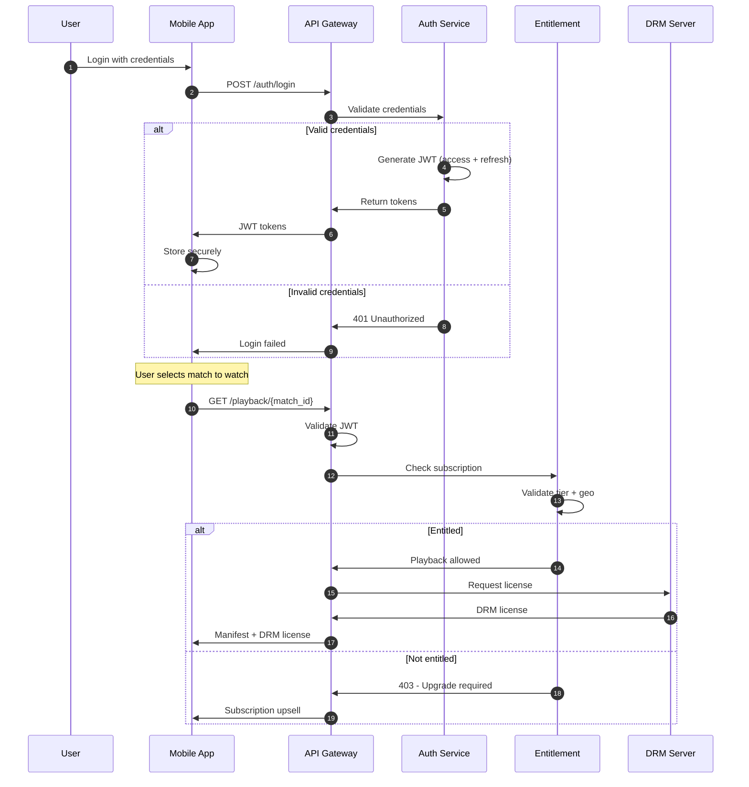
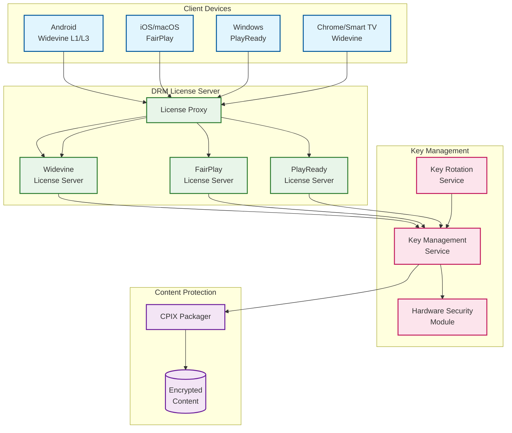
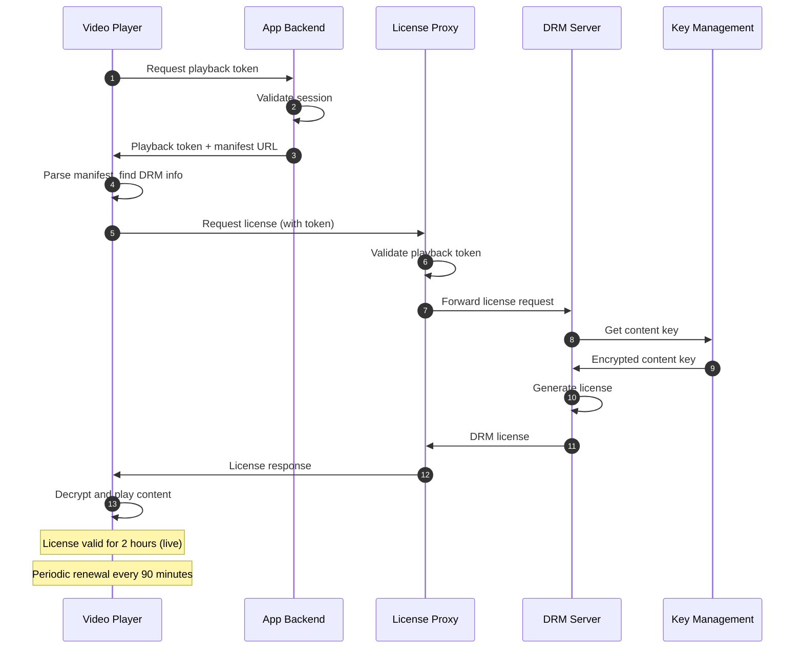

# Security and Compliance

## Overview

This document covers the security architecture for protecting premium sports content worth billions in rights fees, along with compliance requirements for India's Digital Personal Data Protection Act (DPDP) and advertising regulations.

---

## Authentication and Authorization

### Token-Based Authentication Flow



### JWT Token Structure

```json
{
  "header": {
    "alg": "RS256",
    "typ": "JWT",
    "kid": "key-2025-02"
  },
  "payload": {
    "sub": "user_abc123",
    "iat": 1739548800,
    "exp": 1739552400,
    "iss": "hotstar-auth",
    "aud": "hotstar-api",
    "tier": "premium",
    "geo": "IN",
    "device_id": "device_xyz789",
    "concurrent_limit": 2,
    "entitlements": ["ipl", "premier_league", "f1"]
  },
  "signature": "..."
}
```

### Subscription Tier Matrix

| Tier | Concurrent Streams | Quality | Ads | Live Sports | Price (INR) |
|------|-------------------|---------|-----|-------------|-------------|
| Free | 1 | 480p | Yes | Limited | 0 |
| Mobile | 1 | 720p | Yes | All | 499/yr |
| Super | 2 | 1080p | Limited | All | 899/yr |
| Premium | 4 | 4K | No | All | 1499/yr |

### Regional Entitlement Enforcement

```python
class EntitlementService:
    """Validates user entitlements including geo-restrictions."""

    # Match rights by region
    REGIONAL_RIGHTS = {
        "ipl_2025": ["IN", "US", "UK", "AE", "SG"],
        "premier_league": ["IN"],
        "la_liga": ["IN"],
        "f1_2025": ["IN", "US"],
        # Blackout: Some matches not available in certain regions
    }

    async def check_entitlement(
        self,
        user_id: str,
        content_id: str,
        user_region: str,
        device_type: str
    ) -> EntitlementResult:
        """Check if user can access content."""

        # Step 1: Get user subscription
        subscription = await self.get_subscription(user_id)
        if not subscription or subscription.is_expired():
            return EntitlementResult(
                allowed=False,
                reason="NO_SUBSCRIPTION",
                upsell_tier="mobile"
            )

        # Step 2: Check content in subscription
        content_rights = self.get_content_rights(content_id)
        if content_rights.required_tier > subscription.tier:
            return EntitlementResult(
                allowed=False,
                reason="TIER_INSUFFICIENT",
                upsell_tier=content_rights.required_tier
            )

        # Step 3: Check geo-restriction
        allowed_regions = self.REGIONAL_RIGHTS.get(content_id, [])
        if user_region not in allowed_regions:
            return EntitlementResult(
                allowed=False,
                reason="GEO_RESTRICTED",
                message=f"Not available in {user_region}"
            )

        # Step 4: Check device restrictions
        if subscription.tier == "mobile" and device_type != "mobile":
            return EntitlementResult(
                allowed=False,
                reason="DEVICE_RESTRICTED",
                message="Mobile-only subscription"
            )

        # Step 5: Check concurrent streams
        active_streams = await self.get_active_streams(user_id)
        if len(active_streams) >= subscription.concurrent_limit:
            return EntitlementResult(
                allowed=False,
                reason="CONCURRENT_LIMIT",
                active_devices=active_streams
            )

        return EntitlementResult(allowed=True)
```

---

## Digital Rights Management (DRM)

### Multi-DRM Architecture



### DRM Specifications by Platform

| Platform | DRM | Security Level | Max Quality | Offline Support |
|----------|-----|----------------|-------------|-----------------|
| Android (certified) | Widevine L1 | Hardware | 4K HDR | Yes |
| Android (other) | Widevine L3 | Software | 720p | No |
| iOS/iPadOS | FairPlay | Hardware | 4K HDR | Yes |
| macOS Safari | FairPlay | Hardware | 4K | No |
| Chrome | Widevine L1/L3 | Varies | 1080p* | No |
| Edge/Windows | PlayReady SL3000 | Hardware | 4K | Yes |
| Fire TV | Widevine L1 | Hardware | 4K HDR | No |
| Smart TVs | Widevine/PlayReady | Varies | 4K | No |

*Chrome on supported hardware can achieve 4K with L1

### DRM License Flow



### Key Rotation for Live Events

```python
class LiveKeyRotation:
    """
    Rotate encryption keys during live events.
    Prevents extended piracy if a key is compromised.
    """

    KEY_ROTATION_INTERVAL_SECONDS = 3600  # 1 hour
    LICENSE_VALIDITY_SECONDS = 7200       # 2 hours (overlap)

    async def rotate_keys(self, stream_id: str) -> None:
        """Rotate encryption keys for live stream."""

        # Generate new key
        new_key = await self.kms.generate_key(stream_id)

        # Update packager with new key
        await self.packager.update_key(
            stream_id,
            new_key,
            effective_segment=self._get_future_segment()
        )

        # Notify DRM servers of new key
        await self.drm_server.register_key(
            content_id=stream_id,
            key_id=new_key.key_id,
            key_value=new_key.encrypted_value
        )

        # Old licenses remain valid (2-hour validity)
        # Players will request new license on next renewal

        await self.log_key_rotation(stream_id, new_key.key_id)

    def _get_future_segment(self) -> int:
        """Get segment number 2 minutes in future for seamless transition."""
        current_segment = self.get_current_segment()
        return current_segment + 30  # 30 segments = 2 minutes
```

---

## Geo-Restrictions

### Match-Level Rights Enforcement

```
Rights Complexity Example: IPL 2025
────────────────────────────────────

India (IN):
├─ All matches: Hotstar exclusive
├─ Languages: All 8 available
└─ Quality: Up to 4K

United States (US):
├─ All matches: Available
├─ Languages: Hindi, English only
├─ Quality: Up to 1080p
└─ Blackout: None

United Kingdom (UK):
├─ All matches: Available
├─ Some matches: Delayed by 30 min (Sky Sports conflict)
└─ Quality: Up to 1080p

Middle East (AE):
├─ Most matches: Available
├─ Some matches: OSN has exclusive
└─ Quality: Up to 1080p

Rest of World:
├─ Varies by country
├─ Some: No rights (watch on other platforms)
└─ Some: Available with restrictions

Implementation:
├─ Rights database per match × region
├─ Check at playback request time
├─ Return appropriate error with redirect
```

### VPN Detection

```python
class VPNDetector:
    """
    Detect VPN/proxy usage to enforce geo-restrictions.
    Multi-layered approach for high accuracy.
    """

    async def is_vpn(self, request: PlaybackRequest) -> VPNResult:
        """Detect if request originates from VPN."""

        signals = []

        # Layer 1: IP reputation database
        ip_info = await self.ip_db.lookup(request.ip_address)
        if ip_info.is_datacenter or ip_info.is_known_vpn:
            signals.append(("ip_reputation", 0.9))

        # Layer 2: IP-to-ASN mismatch
        claimed_country = request.geo_from_ip
        mobile_carrier = await self.get_mobile_carrier(request)
        if mobile_carrier and mobile_carrier.country != claimed_country:
            signals.append(("carrier_mismatch", 0.7))

        # Layer 3: DNS leak detection
        # Check if DNS resolver is in different country
        dns_country = await self.detect_dns_country(request)
        if dns_country != claimed_country:
            signals.append(("dns_leak", 0.6))

        # Layer 4: WebRTC IP (browser only)
        if request.webrtc_local_ip:
            webrtc_country = await self.ip_db.lookup(request.webrtc_local_ip)
            if webrtc_country.country != claimed_country:
                signals.append(("webrtc_leak", 0.8))

        # Layer 5: Timezone mismatch
        if request.client_timezone:
            expected_tz = self.get_expected_timezone(claimed_country)
            if request.client_timezone not in expected_tz:
                signals.append(("timezone_mismatch", 0.5))

        # Calculate confidence score
        if not signals:
            return VPNResult(is_vpn=False, confidence=0.0)

        max_confidence = max(s[1] for s in signals)
        avg_confidence = sum(s[1] for s in signals) / len(signals)

        # High confidence required to block
        is_vpn = max_confidence > 0.85 or (len(signals) >= 3 and avg_confidence > 0.6)

        return VPNResult(
            is_vpn=is_vpn,
            confidence=max_confidence,
            signals=signals
        )
```

---

## Content Security

### AES-128 Encryption

```
Content Encryption Pipeline:
────────────────────────────

Raw Segment (4 seconds of video)
        │
        ▼
┌───────────────────┐
│  AES-128-CBC      │
│  Encryption       │
│                   │
│  Key: From KMS    │
│  IV: Random/segment│
└─────────┬─────────┘
        │
        ▼
Encrypted Segment + IV
        │
        ▼
┌───────────────────┐
│  Storage/CDN      │
│                   │
│  Key NOT stored   │
│  with content     │
└───────────────────┘

Decryption (Client):
├─ Get license from DRM server
├─ License contains encrypted content key
├─ Device decrypts key in secure enclave
├─ Content decrypted in protected buffer
└─ Clear content never exposed to app
```

### Forensic Watermarking

```
Purpose: Track source of leaked content

Watermarking Approach:
────────────────────────────────

Session-Based Watermarking:
├─ Invisible watermark embedded in video
├─ Unique per user session
├─ Survives transcoding, screen recording
├─ Can identify leaker from pirated copy

Embedding Points:
├─ Edge-based (CDN level): Lower latency
├─ Server-side (SSAI integration): Higher security
└─ Client-side (DRM): Varies by platform

Watermark Payload:
├─ User ID (hashed)
├─ Session ID
├─ Timestamp
├─ Device fingerprint
└─ Total: ~64 bits of information

Detection Process:
├─ Obtain pirated content sample
├─ Extract watermark using proprietary tool
├─ Decode payload to identify source
├─ Take action (disable account, legal)
```

---

## Threat Model

### Attack Surface Analysis

| Threat | Likelihood | Impact | Mitigation |
|--------|------------|--------|------------|
| Stream ripping | High | High | DRM L1, watermarking |
| Account sharing | High | Medium | Device limits, concurrent checks |
| Credential stuffing | High | Medium | Rate limiting, MFA, anomaly detection |
| VPN geo-bypass | High | Medium | Multi-layer VPN detection |
| HDCP stripping | Medium | High | No mitigation (hardware limitation) |
| License server DoS | Medium | Critical | Rate limiting, CDN caching |
| API abuse | Medium | Medium | Rate limiting, authentication |
| DDoS during finals | High | Critical | CDN absorption, Anycast |

### DDoS Protection During High-Profile Matches

```
India vs Pakistan World Cup Final Scenario:
────────────────────────────────────────────

Expected Traffic:
├─ Legitimate: 65M concurrent viewers
├─ Legitimate requests: 2M+ per second
└─ Potential DDoS: Additional 10M+ rps attack

Protection Layers:

Layer 1: Anycast DNS
├─ AWS Route53 + Global Accelerator
├─ Distribute across global PoPs
└─ Absorb volumetric attacks

Layer 2: CDN WAF
├─ Akamai Kona Site Defender
├─ Rate limiting by IP
├─ Bot detection
└─ Challenge suspicious traffic

Layer 3: API Gateway
├─ Request validation
├─ JWT verification
├─ Per-user rate limits
└─ Anomaly detection

Layer 4: Application
├─ Graceful degradation
├─ Circuit breakers
└─ Shed non-critical traffic

Preparation:
├─ Pre-coordinate with CDN (white-glove support)
├─ Pre-provision additional capacity
├─ War room with CDN, cloud, and security teams
└─ Pre-approved escalation procedures
```

---

## Privacy and Compliance

### India DPDP Act Compliance

```
Digital Personal Data Protection Act 2023:
────────────────────────────────────────────

Key Requirements:

1. Lawful Purpose
   ├─ Collect only for legitimate purposes
   ├─ Document purpose for each data type
   └─ Our use: Service delivery, personalization, billing

2. Consent
   ├─ Clear, specific, informed consent
   ├─ Easy withdrawal mechanism
   └─ Our implementation: Consent management platform

3. Data Minimization
   ├─ Collect only necessary data
   ├─ Pseudonymize where possible
   └─ Our approach: No unnecessary PII in logs

4. Storage Limitation
   ├─ Delete when purpose fulfilled
   ├─ Retention policy required
   └─ Our policy: See data retention table

5. Data Principal Rights
   ├─ Access: View their data
   ├─ Correction: Fix errors
   ├─ Erasure: Delete data
   └─ Our implementation: Self-service portal + manual request

6. Data Breach Notification
   ├─ Notify DPA within 72 hours
   ├─ Notify affected users
   └─ Our process: Incident response playbook

7. Cross-Border Transfer
   ├─ Allowed to permitted countries
   ├─ Government notification for others
   └─ Our approach: Process in India, limited transfers
```

### Data Retention Policy

| Data Type | Active | Archive | Delete | Legal Basis |
|-----------|--------|---------|--------|-------------|
| Account info | Account lifetime | 3 years | On request | Contract |
| Watch history | 2 years | 5 years | After retention | Legitimate interest |
| Payment data | Transaction + 7 years | N/A | After retention | Legal requirement |
| Session logs | 90 days | 1 year | After retention | Service improvement |
| QoE metrics | 30 days | 1 year | After retention | Service improvement |
| Ad impressions | 2 years | 5 years | After retention | Contract (advertisers) |
| Support tickets | Resolution + 2 years | 5 years | After retention | Legitimate interest |

### Privacy by Design

```python
class PrivacyCompliantLogging:
    """Ensure logs comply with DPDP Act."""

    # PII fields that should never be logged
    PROHIBITED_FIELDS = [
        "password", "credit_card", "cvv", "aadhaar",
        "pan_number", "bank_account"
    ]

    # Fields that should be hashed/pseudonymized
    PSEUDONYMIZE_FIELDS = [
        "user_id", "email", "phone", "ip_address", "device_id"
    ]

    def sanitize_for_logging(self, data: dict) -> dict:
        """Remove or hash sensitive data before logging."""

        sanitized = {}
        for key, value in data.items():
            # Never log prohibited fields
            if key.lower() in self.PROHIBITED_FIELDS:
                continue

            # Pseudonymize sensitive fields
            if key.lower() in self.PSEUDONYMIZE_FIELDS:
                sanitized[key] = self._hash(value)
            else:
                sanitized[key] = value

        return sanitized

    def _hash(self, value: str) -> str:
        """One-way hash for pseudonymization."""
        return hashlib.sha256(
            (value + self.salt).encode()
        ).hexdigest()[:16]
```

---

## Ad Compliance

### ASCI Guidelines Compliance

```
Advertising Standards Council of India (ASCI):
────────────────────────────────────────────────

Requirements for SSAI:

1. Ad Frequency Limits
   ├─ Max 12 minutes of ads per hour
   ├─ No more than 6 consecutive ads
   └─ Our implementation: Ad pod duration limits

2. Content Suitability
   ├─ No alcohol ads during children's content
   ├─ No tobacco ads at all
   └─ Our implementation: Content tagging + ad filtering

3. Gambling/Fantasy
   ├─ Require "Play responsibly" disclaimer
   ├─ No targeting minors
   └─ Our implementation: Age verification + disclaimer overlay

4. Loudness
   ├─ Ad audio level ≤ content audio level
   └─ Our implementation: Audio normalization

5. Clarity
   ├─ Clear distinction between content and ad
   └─ Our implementation: "Advertisement" label overlay
```

### Ad Blocking/Tracking Transparency

```
User Ad Preferences:
────────────────────

Options provided:
├─ Personalized ads (default): Full targeting
├─ Limited ads: Generic by region only
├─ Premium tier: No ads (subscription upgrade)

Transparency:
├─ Why this ad: Explain targeting criteria
├─ Ad preferences: User can adjust interests
├─ Do Not Sell: CCPA compliance for US users
```

---

## Next Steps

See [07-observability.md](./07-observability.md) for monitoring, alerting, and real-time analytics.
