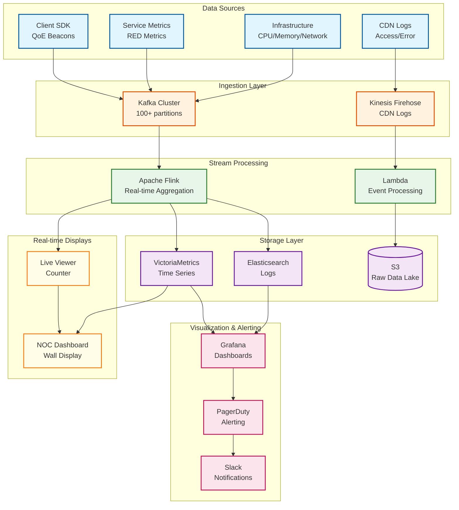
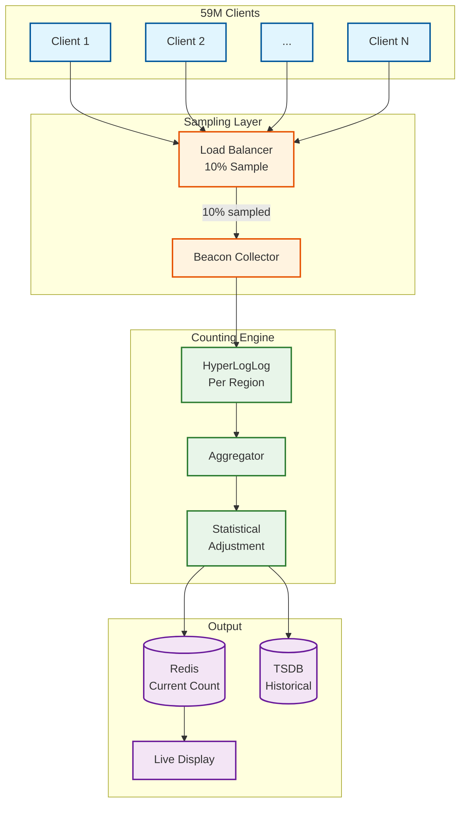

# Observability

## Overview

This document details the observability architecture for monitoring 59M+ concurrent viewers in real-time, tracking QoE metrics, and enabling rapid incident response during live sporting events.

---

## Observability Architecture



---

## Key Metrics

### Business Metrics

| Metric | Description | Aggregation | Alert Threshold |
|--------|-------------|-------------|-----------------|
| `viewers.concurrent` | Real-time viewer count | Sum | N/A (display only) |
| `viewers.unique_daily` | Daily unique viewers | Count distinct | N/A |
| `ad.impressions` | Ad views per minute | Count | < 50% expected |
| `ad.fill_rate` | % ad breaks with ads served | Ratio | < 90% |
| `subscription.upgrades` | Premium upgrades during match | Count | N/A |
| `churn.mid_stream` | Users who left early | Count | > 10% baseline |

### Technical Metrics (RED)

| Metric | Type | Labels | Purpose |
|--------|------|--------|---------|
| `request_rate` | Counter | service, endpoint, status | Throughput |
| `request_errors` | Counter | service, endpoint, error_code | Error tracking |
| `request_duration_ms` | Histogram | service, endpoint, percentile | Latency |
| `cdn_cache_hit_rate` | Gauge | cdn, region | Cache efficiency |
| `origin_requests_rate` | Counter | origin, segment_type | Origin load |

### QoE Metrics

| Metric | Description | Target | Critical |
|--------|-------------|--------|----------|
| `ttff_ms` | Time to first frame | < 3000ms P95 | > 5000ms |
| `rebuffer_ratio` | % time spent buffering | < 0.5% | > 2% |
| `rebuffer_count` | Rebuffer events per session | < 0.5 | > 3 |
| `bitrate_avg_kbps` | Average playback bitrate | > 1500 | < 800 |
| `bitrate_switches` | Quality changes per minute | < 2 | > 5 |
| `playback_failures` | Failed playback starts | < 0.1% | > 1% |
| `exit_before_video` | Left before playback started | < 2% | > 5% |

### CDN Metrics

| Metric | Description | Target | Action |
|--------|-------------|--------|--------|
| `cdn_5xx_rate` | Server error rate | < 0.1% | Failover trigger |
| `cdn_latency_p99_ms` | Response latency | < 200ms | Traffic shift |
| `cdn_throughput_gbps` | Data transfer rate | Monitor | Capacity alert |
| `cdn_cache_hit_ratio` | Cache effectiveness | > 95% | Warm cache |
| `origin_shield_coalesce_ratio` | Request coalescing | > 90% | Investigate |

---

## Real-Time Viewer Counting

### The Challenge

```
Scale Problem:
├─ 59M concurrent viewers
├─ Heartbeat every 30 seconds
├─ = 2M heartbeats/second
├─ Exact counting = expensive
└─ Need: Real-time display accurate to ±5%

Solution: Sampling + HyperLogLog
```

### Viewer Count Architecture



### Implementation

```python
class RealTimeViewerCounter:
    """
    Count concurrent viewers using sampling and HyperLogLog.
    Achieves <1% error at 59M scale with 90% cost reduction.
    """

    SAMPLE_RATE = 0.10  # 10% sampling
    HEARTBEAT_WINDOW_SECONDS = 60  # Consider active if heartbeat in last 60s
    UPDATE_INTERVAL_SECONDS = 5

    def __init__(self):
        self.regional_hlls: Dict[str, HyperLogLog] = {}
        self.last_heartbeats: Dict[str, float] = {}

    async def record_heartbeat(
        self,
        match_id: str,
        user_id: str,
        region: str
    ) -> None:
        """Record sampled heartbeat."""

        # Sampling decision (consistent by user)
        if not self._should_sample(user_id):
            return

        key = f"{match_id}:{region}"
        if key not in self.regional_hlls:
            self.regional_hlls[key] = HyperLogLog(precision=14)

        self.regional_hlls[key].add(user_id)
        self.last_heartbeats[f"{match_id}:{user_id}"] = time.time()

    def _should_sample(self, user_id: str) -> bool:
        """Consistent sampling by user ID."""
        # Use hash for consistent sampling
        hash_value = int(hashlib.md5(user_id.encode()).hexdigest()[:8], 16)
        return (hash_value % 100) < (self.SAMPLE_RATE * 100)

    async def get_viewer_count(self, match_id: str) -> ViewerCount:
        """Get current viewer count with confidence interval."""

        total_sampled = 0
        by_region = {}

        for key, hll in self.regional_hlls.items():
            if key.startswith(f"{match_id}:"):
                region = key.split(":")[1]
                count = hll.count()
                by_region[region] = count
                total_sampled += count

        # Extrapolate from sample
        estimated_total = int(total_sampled / self.SAMPLE_RATE)

        # HyperLogLog standard error: 1.04 / sqrt(2^precision)
        # For precision=14: ~0.8% error
        # Combined with sampling: ~3% total error
        error_margin = estimated_total * 0.03

        return ViewerCount(
            total=estimated_total,
            by_region=by_region,
            error_margin=error_margin,
            timestamp=time.time()
        )

    async def cleanup_stale(self, match_id: str) -> None:
        """Remove users who haven't sent heartbeat recently."""
        cutoff = time.time() - self.HEARTBEAT_WINDOW_SECONDS

        stale_keys = [
            k for k, v in self.last_heartbeats.items()
            if k.startswith(f"{match_id}:") and v < cutoff
        ]

        for key in stale_keys:
            del self.last_heartbeats[key]
            # Note: HLL doesn't support removal
            # Periodic rebuild required
```

### Accuracy vs Cost Trade-off

| Approach | Cost at 59M | Accuracy | Latency |
|----------|-------------|----------|---------|
| Exact counting (Redis) | $$$$ (60M writes/30s) | 100% | Real-time |
| Bloom filter | $$$ | ~95% | Real-time |
| HyperLogLog | $$ | ~99% | Real-time |
| **Sampling + HLL** | $ | **~97%** | Real-time |
| Batch aggregation | $ | 100% | 5-minute lag |

---

## Logging Strategy

### Log Levels by Environment

| Level | Production | Staging | Development |
|-------|------------|---------|-------------|
| ERROR | Always | Always | Always |
| WARN | Always | Always | Always |
| INFO | Sampled 10% | Always | Always |
| DEBUG | Never | Sampled 10% | Always |
| TRACE | Never | Never | On-demand |

### Structured Log Format

```json
{
  "timestamp": "2025-02-15T20:15:30.123Z",
  "level": "INFO",
  "service": "playback-api",
  "instance": "playback-api-7d4f5-abc12",
  "trace_id": "abc123def456",
  "span_id": "span789",
  "user_id_hash": "a1b2c3d4e5f6",
  "match_id": "ipl-2025-match-42",
  "event": "playback_start",
  "duration_ms": 2340,
  "quality": "1080p",
  "cdn": "akamai",
  "region": "ap-south-1",
  "device_type": "mobile",
  "os": "android",
  "app_version": "15.2.3"
}
```

### Log Retention

| Log Type | Hot (ES) | Warm (S3-IA) | Cold (Glacier) |
|----------|----------|--------------|----------------|
| Application | 7 days | 30 days | 1 year |
| Access logs | 3 days | 14 days | 90 days |
| Error logs | 30 days | 90 days | 2 years |
| Security/Audit | 90 days | 1 year | 7 years |
| CDN logs | 7 days | 30 days | 1 year |

---

## Distributed Tracing

### Trace Context Propagation

```
Trace Flow: Playback Request
────────────────────────────

[Client Request]
     │
     ▼ trace_id: abc123
[API Gateway] ─────────────────────────────────────┐
     │ span: gateway, duration: 5ms                │
     ▼                                             │
[Auth Service] ────────────────────────────────────│
     │ span: auth, duration: 15ms                  │
     ▼                                             │
[Entitlement Service] ─────────────────────────────│
     │ span: entitlement, duration: 8ms            │
     │                                             │
     ├──► [Redis Cache] span: cache_lookup, 2ms    │
     │                                             │
     ▼                                             │
[Manifest Generator] ──────────────────────────────│
     │ span: manifest_gen, duration: 25ms          │
     │                                             │
     ├──► [Origin Shield] span: segment_fetch, 10ms│
     │                                             │
     ▼                                             │
[SSAI Service] ────────────────────────────────────│
     │ span: ad_stitch, duration: 20ms             │
     │                                             │
     └──► [Ad Decision] span: ad_decision, 15ms    │
                                                   │
Total Trace Duration: 85ms ◄───────────────────────┘

Visualization: Jaeger/Zipkin
```

### Trace Sampling Strategy

```python
class AdaptiveTraceSampler:
    """
    Adaptive sampling to balance observability vs overhead.
    Sample more during incidents, less during peak load.
    """

    BASE_SAMPLE_RATE = 0.01  # 1% baseline
    INCIDENT_SAMPLE_RATE = 0.10  # 10% during incidents
    ERROR_SAMPLE_RATE = 1.0  # 100% for errors

    def should_sample(
        self,
        trace_context: TraceContext,
        is_incident: bool = False
    ) -> bool:
        """Determine if trace should be sampled."""

        # Always sample errors
        if trace_context.has_error:
            return True

        # Sample based on user_id for consistency
        hash_value = self._consistent_hash(trace_context.user_id)

        # Higher sampling during incidents
        if is_incident:
            return hash_value < self.INCIDENT_SAMPLE_RATE

        # Baseline sampling
        return hash_value < self.BASE_SAMPLE_RATE

    def _consistent_hash(self, value: str) -> float:
        """Return value between 0 and 1."""
        hash_int = int(hashlib.sha256(value.encode()).hexdigest()[:16], 16)
        return hash_int / (2 ** 64)
```

---

## Alerting Hierarchy

### Severity Levels

| Severity | Description | Response Time | Notification |
|----------|-------------|---------------|--------------|
| **SEV1** | Widespread playback failure | Immediate | PagerDuty + Exec Escalation |
| **SEV2** | Regional/CDN degradation | 5 minutes | PagerDuty + Slack |
| **SEV3** | Non-critical service issues | 15 minutes | Slack |
| **SEV4** | Warning/Informational | Next business day | Email |

### Alert Definitions

```yaml
# SEV1 Alerts - Immediate Response Required
alerts:
  - name: widespread_playback_failure
    severity: SEV1
    condition: |
      sum(rate(playback_failures_total[5m])) /
      sum(rate(playback_attempts_total[5m])) > 0.05
    for: 2m
    description: "More than 5% of playback attempts failing"
    runbook: "https://wiki/runbooks/playback-failure"

  - name: all_cdns_degraded
    severity: SEV1
    condition: |
      avg(cdn_error_rate) by (cdn) > 0.01
      # All CDNs above 1% error rate
    for: 3m
    description: "All CDN providers showing elevated errors"
    runbook: "https://wiki/runbooks/multi-cdn-failure"

  - name: viewer_count_drop
    severity: SEV1
    condition: |
      (viewers_concurrent offset 5m - viewers_concurrent) /
      viewers_concurrent offset 5m > 0.30
    for: 2m
    description: "30%+ sudden drop in concurrent viewers"
    runbook: "https://wiki/runbooks/viewer-drop"

# SEV2 Alerts - Urgent
  - name: single_cdn_degraded
    severity: SEV2
    condition: |
      cdn_error_rate{cdn="akamai"} > 0.01
    for: 3m
    description: "Primary CDN (Akamai) error rate elevated"
    runbook: "https://wiki/runbooks/cdn-failover"

  - name: ssai_degraded
    severity: SEV2
    condition: |
      rate(ad_decision_errors_total[5m]) /
      rate(ad_decision_total[5m]) > 0.05
    for: 3m
    description: "Ad decision error rate above 5%"
    runbook: "https://wiki/runbooks/ssai-degradation"

# SEV3 Alerts - Important
  - name: cache_hit_rate_low
    severity: SEV3
    condition: |
      cdn_cache_hit_rate < 0.90
    for: 10m
    description: "CDN cache hit rate below 90%"
    runbook: "https://wiki/runbooks/cache-warmup"

  - name: api_latency_elevated
    severity: SEV3
    condition: |
      histogram_quantile(0.99,
        rate(request_duration_seconds_bucket[5m])) > 0.5
    for: 5m
    description: "API P99 latency above 500ms"
    runbook: "https://wiki/runbooks/api-performance"
```

---

## Dashboard Types

### 1. Executive Dashboard

```
╔══════════════════════════════════════════════════════════════════════════╗
║                    IPL 2025 - MI vs CSK - LIVE                           ║
╠══════════════════════════════════════════════════════════════════════════╣
║                                                                          ║
║   CONCURRENT VIEWERS              QoE HEALTH                             ║
║   ┌────────────────────┐         ┌────────────────────┐                 ║
║   │                    │         │  Playback Start    │                 ║
║   │     45,234,567     │         │  ████████████ 98%  │                 ║
║   │                    │         │                    │                 ║
║   │  ▲ +2.3M vs prev   │         │  Rebuffer Rate     │                 ║
║   └────────────────────┘         │  ████████░░░░ 0.3% │                 ║
║                                  └────────────────────┘                 ║
║   VIEWER TREND (Last 30 min)                                            ║
║   50M ┤              ╭──────────                                        ║
║   40M ┤         ╭────╯                                                  ║
║   30M ┤    ╭────╯                                                       ║
║   20M ┤────╯                                                            ║
║       └─────┴─────┴─────┴─────┴─────┴                                   ║
║         -30   -25   -20   -15   -10   now                               ║
║                                                                          ║
║   TOP REGIONS            AD PERFORMANCE                                  ║
║   Maharashtra: 12.3M     Impressions: 234M                              ║
║   Gujarat: 8.7M          Fill Rate: 97.2%                               ║
║   Tamil Nadu: 6.2M       Revenue: ₹12.4Cr                               ║
║                                                                          ║
╚══════════════════════════════════════════════════════════════════════════╝
```

### 2. Engineering Dashboard

```
╔══════════════════════════════════════════════════════════════════════════╗
║                    ENGINEERING - SYSTEM HEALTH                           ║
╠══════════════════════════════════════════════════════════════════════════╣
║                                                                          ║
║   SERVICE STATUS                  INFRASTRUCTURE                         ║
║   ┌────────────────────────────┐  ┌────────────────────────────┐        ║
║   │ API Gateway      🟢 OK     │  │ EC2 Instances:    487/500  │        ║
║   │ Auth Service     🟢 OK     │  │ CPU Utilization:  67%      │        ║
║   │ Entitlement      🟢 OK     │  │ Memory Usage:     72%      │        ║
║   │ Manifest Gen     🟢 OK     │  │ Network I/O:      32 Gbps  │        ║
║   │ SSAI             🟡 WARN   │  │ Redis CPU:        45%      │        ║
║   │ Origin Shield    🟢 OK     │  │ Kafka Lag:        1.2s     │        ║
║   └────────────────────────────┘  └────────────────────────────┘        ║
║                                                                          ║
║   ERROR RATES (5m window)         LATENCY P99 (ms)                       ║
║   ┌────────────────────────────┐  ┌────────────────────────────┐        ║
║   │ Auth:      0.01%           │  │ Auth:         23ms         │        ║
║   │ Manifest:  0.02%           │  │ Manifest:     45ms         │        ║
║   │ SSAI:      0.15%  ⚠️       │  │ SSAI:         120ms        │        ║
║   │ CDN:       0.08%           │  │ CDN TTFB:     35ms         │        ║
║   └────────────────────────────┘  └────────────────────────────┘        ║
║                                                                          ║
║   RECENT DEPLOYMENTS              ALERTS (Last Hour)                     ║
║   • manifest-gen v2.3.1 (15m ago) • [WARN] SSAI latency elevated        ║
║   • auth-service v4.1.0 (2h ago)  • [INFO] Scaled to L3 capacity        ║
║                                                                          ║
╚══════════════════════════════════════════════════════════════════════════╝
```

### 3. CDN Operations Dashboard

```
╔══════════════════════════════════════════════════════════════════════════╗
║                    CDN OPERATIONS - MULTI-CDN                            ║
╠══════════════════════════════════════════════════════════════════════════╣
║                                                                          ║
║   TRAFFIC DISTRIBUTION            CDN HEALTH                             ║
║   ┌────────────────────────────┐  ┌────────────────────────────┐        ║
║   │ Akamai    ████████████ 68% │  │ Akamai                     │        ║
║   │ CloudFront ████░░░░░░░ 22% │  │  Error: 0.05%  🟢          │        ║
║   │ Fastly    ██░░░░░░░░░ 10%  │  │  Latency: 28ms             │        ║
║   └────────────────────────────┘  │  Cache Hit: 96.2%          │        ║
║                                   │                            │        ║
║   BANDWIDTH (Tbps)                │ CloudFront                 │        ║
║   80 ┤          ╭────────         │  Error: 0.08%  🟢          │        ║
║   60 ┤     ╭────╯                 │  Latency: 42ms             │        ║
║   40 ┤ ────╯                      │  Cache Hit: 94.1%          │        ║
║   20 ┤                            │                            │        ║
║      └─────────────────────       │ Fastly                     │        ║
║                                   │  Error: 0.03%  🟢          │        ║
║   ORIGIN SHIELD                   │  Latency: 31ms             │        ║
║   ┌────────────────────────────┐  │  Cache Hit: 95.8%          │        ║
║   │ Coalesce Ratio: 94.2%      │  └────────────────────────────┘        ║
║   │ Origin RPS:     12,453     │                                        ║
║   │ Shield Cache:   97.1%      │  FAILOVER STATUS                       ║
║   └────────────────────────────┘  │ Auto-steering: ENABLED              │
║                                   │ Last failover: None today           │
║                                                                          ║
╚══════════════════════════════════════════════════════════════════════════╝
```

### 4. Ad Operations Dashboard

```
╔══════════════════════════════════════════════════════════════════════════╗
║                    AD OPERATIONS - SSAI                                  ║
╠══════════════════════════════════════════════════════════════════════════╣
║                                                                          ║
║   AD METRICS (Current Break)      REVENUE                                ║
║   ┌────────────────────────────┐  ┌────────────────────────────┐        ║
║   │ Fill Rate:        97.2%    │  │ Today:      ₹42.3 Crore    │        ║
║   │ Completion Rate:  94.5%    │  │ This Match: ₹12.4 Crore    │        ║
║   │ Decision Latency: 45ms P99 │  │ This Break: ₹1.2 Crore     │        ║
║   │ Cache Hit Rate:   98.1%    │  └────────────────────────────┘        ║
║   └────────────────────────────┘                                        ║
║                                                                          ║
║   DEMOGRAPHIC DISTRIBUTION        AD POD PERFORMANCE                     ║
║   ┌────────────────────────────┐  ┌────────────────────────────┐        ║
║   │ 18-34 Male Metro:    32%   │  │ Pre-computed:   48/50      │        ║
║   │ 18-34 Female Metro:  18%   │  │ Real-time:      2/50       │        ║
║   │ 35+ Male Metro:      15%   │  │ Fallback:       0          │        ║
║   │ 18-34 Male Non-Metro: 14%  │  └────────────────────────────┘        ║
║   │ Others:              21%   │                                        ║
║   └────────────────────────────┘  ADVERTISER TOP 5                       ║
║                                   │ 1. Dream11:    23% share            │
║   AD BREAKS TODAY                 │ 2. CRED:       18% share            │
║   ┌────────────────────────────┐  │ 3. PhonePe:    15% share            │
║   │ Total:     18              │  │ 4. Thums Up:   12% share            │
║   │ Completed: 15              │  │ 5. Swiggy:     8% share             │
║   │ Current:   Strategic TO    │                                        ║
║   │ Remaining: 2               │                                        ║
║   └────────────────────────────┘                                        ║
║                                                                          ║
╚══════════════════════════════════════════════════════════════════════════╝
```

---

## Runbooks

### Runbook: Playback Failure Spike

```markdown
# Runbook: Playback Failure Spike

## Trigger
Alert: `widespread_playback_failure`
Condition: Playback failure rate > 5% for 2 minutes

## Severity
SEV1 - Immediate response required

## Impact
- Users unable to watch live match
- Potential revenue loss from ad impressions
- Brand reputation damage

## Investigation Steps

### 1. Identify Scope (1 min)
```bash
# Check failure by region
curl -s 'http://metrics/api/v1/query?query=sum(rate(playback_failures_total[5m])) by (region)'

# Check failure by CDN
curl -s 'http://metrics/api/v1/query?query=sum(rate(playback_failures_total[5m])) by (cdn)'

# Check failure by error code
curl -s 'http://metrics/api/v1/query?query=sum(rate(playback_failures_total[5m])) by (error_code)'
```

### 2. Determine Root Cause (2 min)

**If CDN-related:**
- Check CDN health dashboard
- Verify no CDN-wide outage (status.akamai.com)
- Consider triggering failover

**If Origin-related:**
- Check origin shield health
- Verify packager is producing segments
- Check segment storage availability

**If Auth-related:**
- Check auth service health
- Verify token validation working
- Check entitlement cache

### 3. Mitigation Actions

**Immediate:**
- [ ] Enable graceful degradation if not already active
- [ ] Trigger CDN failover if single CDN issue
- [ ] Scale up origin if capacity issue

**If CDN failover needed:**
```bash
# Emergency CDN steering override
curl -X POST 'http://cdn-steering/api/v1/override' \
  -d '{"cdn": "akamai", "weight": 0, "reason": "outage"}'
```

**If origin scaling needed:**
```bash
# Force L4 scaling
aws autoscaling set-desired-capacity \
  --auto-scaling-group-name origin-shield-asg \
  --desired-capacity 400
```

### 4. Communication
- [ ] Update #incident-live Slack channel
- [ ] Notify on-call manager if SEV1 > 5 minutes
- [ ] Prepare customer communication if widespread

### 5. Post-Incident
- [ ] Document timeline
- [ ] Schedule post-mortem
- [ ] Update runbook if needed
```

---

## Next Steps

See [08-interview-guide.md](./08-interview-guide.md) for interview preparation and common questions.
