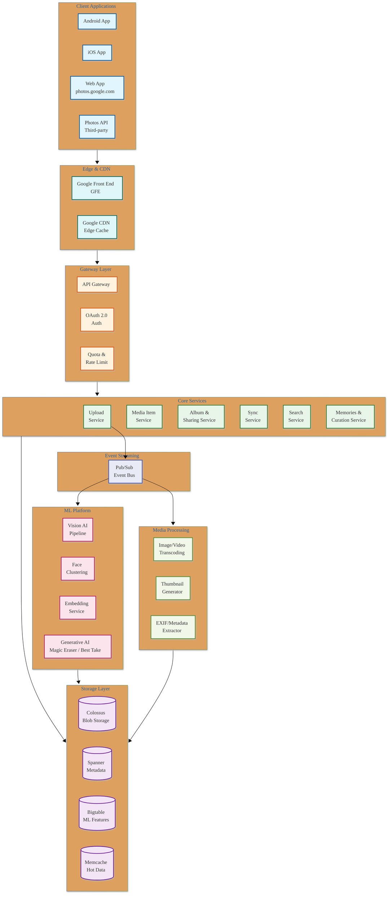

# Google Photos System Design

## Overview

Google Photos is the world's largest cloud photo and video management platform, serving **over 1 billion monthly active users** who collectively store **6+ trillion photos and videos**. The platform processes approximately **1.7 billion uploads daily**, running sophisticated ML pipelines for facial recognition, visual search, auto-curation, and generative AI editing — all backed by Google's planet-scale infrastructure (Colossus, Spanner, Bigtable, Borg).

This design focuses on four core challenges:
1. **Image Backup & Storage** — Reliable upload, deduplication, compression, and multi-device sync at planetary scale
2. **Facial Recognition & Clustering** — FaceNet-based face grouping across billions of photos with privacy controls
3. **Visual Search** — Content-based image retrieval enabling natural language queries ("beach sunset", "dog", "birthday cake")
4. **AI-Powered Features** — Memories, Magic Eraser, Best Take, Cinematic Photos, and generative AI editing

---

## Quick Navigation

| Document | Description |
|----------|-------------|
| [01 - Requirements & Estimations](./01-requirements-and-estimations.md) | Scale numbers, capacity planning, SLOs |
| [02 - High-Level Design](./02-high-level-design.md) | Architecture, data flows, key decisions |
| [03 - Low-Level Design](./03-low-level-design.md) | Data models, APIs, algorithms |
| [04 - Deep Dive & Bottlenecks](./04-deep-dive-and-bottlenecks.md) | Face clustering, upload pipeline, visual search |
| [05 - Scalability & Reliability](./05-scalability-and-reliability.md) | Scaling, fault tolerance, DR |
| [06 - Security & Compliance](./06-security-and-compliance.md) | Privacy, encryption, GDPR/CCPA |
| [07 - Observability](./07-observability.md) | Metrics, logging, alerting |
| [08 - Interview Guide](./08-interview-guide.md) | Pacing, trap questions, trade-offs |

---

## System Characteristics

| Characteristic | Value | Design Implication |
|----------------|-------|-------------------|
| Traffic Pattern | Write-heavy (uploads), Read-heavy (viewing/browsing) | Async upload pipeline, aggressive caching for reads |
| Content Type | Images (JPEG, HEIC, RAW, WebP) + Videos (MP4, MOV) | Format-specific processing pipelines |
| File Sizes | 2-30 MB per photo, 100 MB - 4 GB per video | Chunked upload, resumable transfers |
| Consistency Model | Eventual (sync), Strong (metadata writes) | Conflict resolution for multi-device |
| Latency Target | <200ms thumbnail load, <500ms full-res load | Edge caching, progressive rendering |
| ML Processing | Async, within minutes of upload | Separate ML pipeline with priority queues |
| Global Distribution | 200+ countries | Multi-region replication, geo-aware serving |

---

## Complexity Rating

| Component | Complexity | Reason |
|-----------|------------|--------|
| Upload & Sync Pipeline | **High** | Chunked/resumable uploads, dedup, multi-device conflict resolution |
| Image Processing Pipeline | **High** | Thumbnails, format conversion, EXIF extraction, quality tiers |
| Face Clustering (FaceNet) | **Very High** | Incremental clustering across billions of faces, privacy controls |
| Visual Search & Understanding | **Very High** | Multi-modal embeddings, scene/object/text detection, natural language queries |
| AI Features (Magic Eraser, etc.) | **Very High** | Generative AI inference, on-device + cloud hybrid ML |
| Storage & Replication | **High** | Exabyte-scale blob storage, erasure coding, geo-replication |
| Sharing & Access Control | Medium | Shared albums, partner sharing, link-based access |

**Overall Complexity: Very High**

---

## Architecture Overview

---

## Key Scale Numbers

| Metric | Value | Context |
|--------|-------|---------|
| Monthly Active Users | 1B+ | As of 2024, across Android/iOS/Web |
| Photos & Videos Stored | 6+ trillion | Growing ~1.7B/day |
| Daily Uploads | ~1.7 billion | Photos + videos combined |
| Storage Volume | Exabytes | Multi-region replicated |
| Face Clusters | Billions | Across all user libraries |
| Search Queries | Billions/month | Visual + text-based |
| ML Models Run Per Photo | 10+ | Classification, detection, face, OCR, etc. |
| Supported Formats | 20+ | JPEG, HEIC, RAW (CR2/ARW/DNG), WebP, PNG, MP4, MOV, etc. |

---

## Platform Comparison

| Aspect | Google Photos | Apple iCloud Photos | Amazon Photos | Samsung Gallery |
|--------|--------------|--------------------|--------------|-----------------|
| **Storage Model** | 15 GB free (Google One) | 5 GB free (iCloud+) | Unlimited photos (Prime) | Device + cloud |
| **ML Search** | Best-in-class NLP | On-device ML | Basic tagging | Samsung AI |
| **Face Grouping** | Cloud-based, opt-in | On-device only | Basic | On-device |
| **AI Editing** | Magic Eraser, Best Take, Reimagine | Clean Up, Memories | Basic filters | Object Eraser |
| **Cross-Platform** | Full (Android, iOS, Web) | Apple ecosystem only | Web + apps | Samsung devices |
| **Sharing** | Shared albums, partner sharing | Shared albums, Family | Family vault | Quick Share |
| **API** | Photos Library API | CloudKit (limited) | None | None |
| **Video Support** | 4K, stabilization | 4K, Live Photos | 4K | 4K |

---

## Key Technology Stack (Google Internal)

| Layer | Technology | Purpose |
|-------|------------|---------|
| **Global Network** | Google Front End (GFE) | TLS termination, routing |
| **CDN** | Google CDN (Edge POP) | Image/thumbnail serving |
| **Orchestration** | Borg / Kubernetes | Container orchestration |
| **Blob Storage** | Colossus (GFS v2) | Photo/video file storage |
| **Metadata** | Spanner | Globally consistent metadata |
| **ML Features** | Bigtable | Embeddings, face vectors |
| **Cache** | Memcache / In-memory | Hot thumbnail cache |
| **Event Bus** | Pub/Sub | Async processing triggers |
| **ML Framework** | TensorFlow / JAX | Vision models, FaceNet |
| **ML Serving** | TensorFlow Serving / TPU | Real-time inference |
| **Search Index** | Custom (inverted + vector) | Visual + text search |
| **Video Processing** | Borg-based pipeline | Transcoding, stabilization |

---

## Quality Tiers

| Tier | Photo Compression | Video Compression | Storage Counting |
|------|-------------------|-------------------|-----------------|
| **Original Quality** | No compression, original file preserved | No re-encoding | Counts against quota |
| **Storage Saver** | Photos >16 MP resized, JPEG compressed | Videos >1080p re-encoded | Counts against quota (post-June 2021) |
| **Express Backup** (mobile) | 3 MP, heavily compressed | 480p | Doesn't count against quota |

---

## Critical Trade-offs Summary

| Decision | Google's Choice | Alternative | Rationale |
|----------|----------------|-------------|-----------|
| Face Processing | Cloud-based (opt-in) | On-device only (Apple) | Better clustering quality across library |
| Storage Pricing | Freemium (15 GB free) | Unlimited (old model) | Sustainable business model |
| Search Architecture | Hybrid (embeddings + inverted index) | Keyword tags only | Natural language queries, semantic understanding |
| Upload Strategy | Chunked + resumable | Single-shot upload | Reliability on poor networks |
| ML Pipeline | Async post-upload | Synchronous | Don't block upload completion |
| Metadata DB | Spanner (strong consistency) | Cassandra (eventual) | Cross-device consistency for metadata |
| Image Format | WebP for serving, keep original | Convert all to JPEG | Quality preservation + bandwidth savings |

---

## What Makes Google Photos Unique

### 1. **World-Class Visual Search**
- Natural language queries ("photos of my dog at the beach last summer")
- Combines scene recognition, object detection, OCR, face recognition, temporal context
- Powered by Google's Vision AI / Gemini multimodal models

### 2. **FaceNet Face Clustering**
- 128-dimensional face embeddings with triplet loss training
- Incremental clustering that improves over time
- Cross-photo identity linking without manual tagging

### 3. **Generative AI Editing**
- Magic Eraser (object removal using inpainting)
- Best Take (face swap across burst photos)
- Photo Unblur (deblurring using generative models)
- Reimagine (generative scene editing with Gemini)

### 4. **Memories & Auto-Curation**
- ML-driven highlight reels from past photos
- Automatic collages, animations, cinematic photos
- Contextual surfacing based on date, location, people

### 5. **Planet-Scale Infrastructure**
- Google's own datacenter network, Colossus filesystem, Spanner database
- Hardware-accelerated ML with TPUs
- Zero-downtime updates via Borg

---

## Related Designs

| Topic | Link | Relevance |
|-------|------|-----------|
| YouTube | [5.1-youtube](../5.1-youtube/00-index.md) | Video processing pipeline patterns |
| Netflix | [5.2-netflix](../5.2-netflix/00-index.md) | Media delivery at scale |
| Instagram | [4.3-instagram](../4.3-instagram/00-index.md) | Photo storage, feed, stories |
| Blob Storage System | [1.12-blob-storage](../1.12-blob-storage-system/00-index.md) | Object storage fundamentals |
| CDN Design | [1.15-cdn](../1.15-content-delivery-network-cdn/00-index.md) | Content delivery patterns |
| Vector Database | [3.14-vector-db](../3.14-vector-database/00-index.md) | Embedding search for visual queries |
| AI Image Generation | [3.20-ai-image-gen](../3.20-ai-image-generation-platform/00-index.md) | Generative AI patterns |
| Recommendation Engine | [3.12-rec-engine](../3.12-recommendation-engine/00-index.md) | ML personalization |

---

## References

- [Google AI Blog - Image Search in Google Photos](https://ai.googleblog.com/)
- [FaceNet: A Unified Embedding for Face Recognition and Clustering (Schroff et al., 2015)](https://arxiv.org/abs/1503.03832)
- [Google Research - Advances in Image Understanding](https://research.google/pubs/)
- [Google Photos Engineering - GCP Next talks](https://cloud.google.com/blog)
- [Google Spanner: Globally-Distributed Database](https://research.google/pubs/pub39966/)
- [Colossus: Successor to the Google File System](https://cloud.google.com/blog/products/storage-data-transfer/a-peek-behind-colossus-googles-file-system)
- [Magic Eraser - Google AI Blog](https://blog.google/products/photos/)
- [Google Photos API Documentation](https://developers.google.com/photos)
- [EfficientNet: Rethinking Model Scaling for CNNs (Tan & Le, 2019)](https://arxiv.org/abs/1905.11946)
- [Google Vision AI Documentation](https://cloud.google.com/vision)
