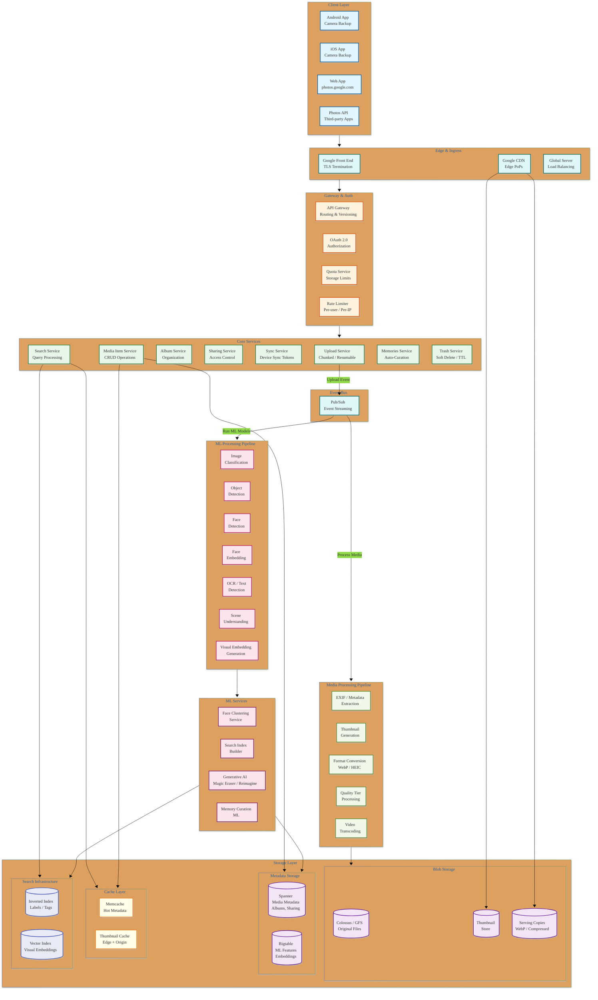
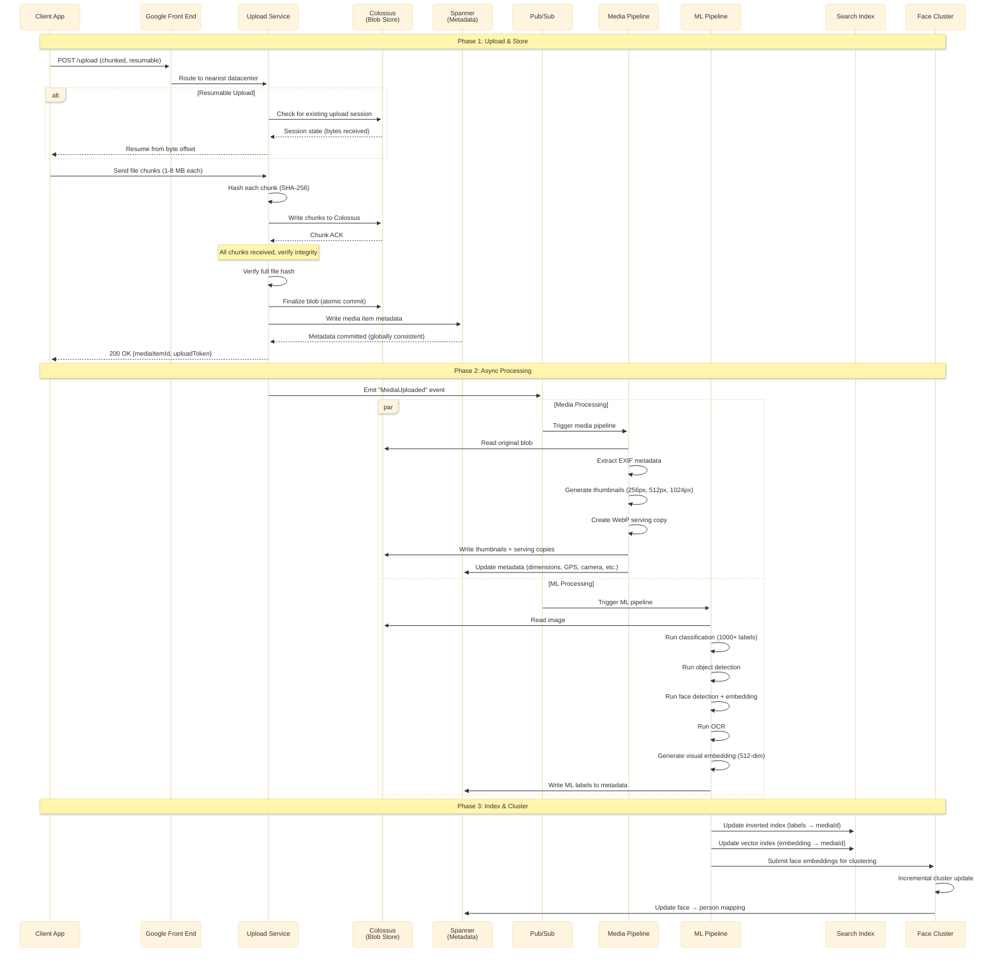
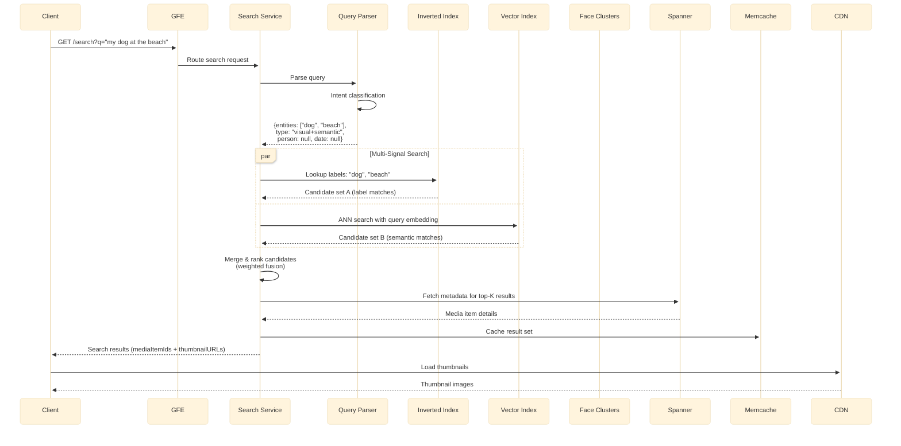
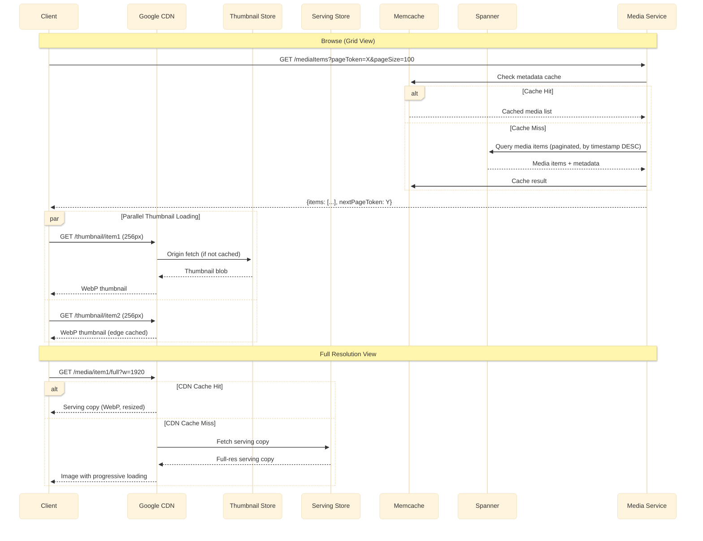
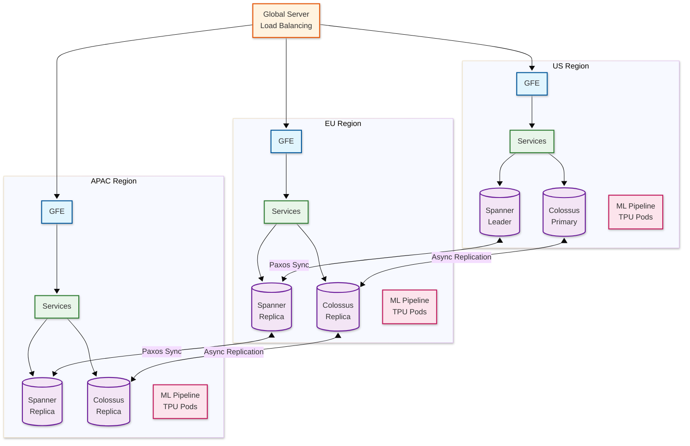

# Google Photos — High-Level Design

## System Architecture



---

## Data Flow: Upload Path



---

## Data Flow: Search Path



---

## Data Flow: View/Browse Path



---

## Key Architectural Decisions

### 1. Monolith vs Microservices

| Decision | **Microservices** |
|----------|-------------------|
| **Rationale** | Different components scale independently: upload spikes ≠ search spikes ≠ ML processing load |
| **Services** | Upload, Media, Album, Sharing, Sync, Search, Memories, ML Pipeline, Face Clustering |
| **Communication** | Sync (gRPC between services), Async (Pub/Sub for processing pipelines) |
| **Trade-off** | Higher operational complexity, but necessary at Google's scale |

### 2. Synchronous vs Asynchronous

| Path | Model | Justification |
|------|-------|---------------|
| Upload → Store | Synchronous | User needs confirmation that upload succeeded |
| Upload → ML Processing | **Asynchronous** | ML can take seconds to minutes; don't block upload |
| Upload → Thumbnail Generation | **Asynchronous** | Generated within seconds, served from cache once ready |
| Search Query | Synchronous | User expects immediate results |
| Face Clustering | **Asynchronous** | Batch + incremental; can take minutes to hours |
| Sync notification | **Asynchronous** | Push via FCM/APNs; pull-based reconciliation |

### 3. Database Choices

| Data Type | Storage | Justification |
|-----------|---------|---------------|
| **Photo/Video blobs** | Colossus (Distributed Filesystem) | Exabyte-scale, erasure-coded, geo-replicated |
| **Media metadata** | Spanner (Globally Consistent SQL) | Strong consistency for ownership, sharing, deletion |
| **ML features/embeddings** | Bigtable (Wide-column) | High write throughput for ML pipeline output |
| **Search index (labels)** | Custom Inverted Index | Fast term-based lookup |
| **Search index (visual)** | Custom Vector Index (ScaNN) | ANN search for visual similarity |
| **Hot metadata cache** | Memcache | Sub-millisecond reads for frequently accessed data |
| **Sync state** | Spanner | Consistent sync tokens across devices |

### 4. Caching Strategy

```
┌─────────────────────────────────────────────────────────┐
│ L1: Client Cache (Device)                               │
│   • Recent thumbnails in memory/disk cache              │
│   • Full-res images viewed recently                     │
│   • Offline-available content                           │
├─────────────────────────────────────────────────────────┤
│ L2: CDN Edge Cache (Google PoPs)                        │
│   • Popular thumbnails (hot photos, shared albums)      │
│   • Public/shared content                               │
│   • TTL: 24 hours (thumbnails), 1 hour (metadata)      │
├─────────────────────────────────────────────────────────┤
│ L3: Origin Cache (Memcache)                             │
│   • Media item metadata for active users                │
│   • Search results cache (per-user, short TTL)          │
│   • Album membership lists                              │
│   • Face cluster mappings                               │
├─────────────────────────────────────────────────────────┤
│ L4: Serving Copy Store                                  │
│   • Pre-generated WebP copies at standard resolutions   │
│   • Thumbnails at 256px, 512px, 1024px                  │
│   • Separated from original blobs for fast serving      │
├─────────────────────────────────────────────────────────┤
│ L5: Origin Storage (Colossus)                           │
│   • Original quality files                              │
│   • Erasure-coded, geo-replicated                       │
└─────────────────────────────────────────────────────────┘
```

### 5. Message Queue Usage

| Event | Queue | Consumers | Priority |
|-------|-------|-----------|----------|
| `MediaUploaded` | Pub/Sub topic | Media Pipeline, ML Pipeline | High |
| `ThumbnailReady` | Pub/Sub topic | CDN Prewarmer, Sync Service | High |
| `MLProcessingComplete` | Pub/Sub topic | Search Indexer, Face Clusterer | Medium |
| `FaceClusterUpdated` | Pub/Sub topic | Search Indexer, Memories Service | Low |
| `AlbumModified` | Pub/Sub topic | Sync Service, Notification Service | Medium |
| `MediaDeleted` | Pub/Sub topic | Blob Cleanup, Index Cleanup | Low |
| `ShareCreated` | Pub/Sub topic | Notification Service, Permission Service | Medium |

---

## Architecture Pattern Checklist

- [x] **Sync vs Async**: Upload = sync, ML/thumbnail = async via Pub/Sub
- [x] **Event-driven vs Request-response**: Event-driven for all post-upload processing
- [x] **Push vs Pull**: Push for sync notifications (FCM/APNs), pull for reconciliation
- [x] **Stateless vs Stateful**: All services stateless; state in Spanner/Colossus
- [x] **Read-heavy vs Write-heavy**: Read-heavy (10:1 ratio); CDN + cache for reads
- [x] **Real-time vs Batch**: Real-time for serving, batch for ML retraining & re-clustering
- [x] **Edge vs Origin**: Thumbnails served from edge CDN; ML runs at origin datacenters

---

## Multi-Region Architecture



**Key Decisions:**
- **Spanner**: Synchronous Paxos replication — strong consistency for metadata globally
- **Colossus**: Asynchronous replication — eventual consistency for blobs (read from nearest replica)
- **ML Processing**: Run in same region as upload to minimize data movement
- **GSLB**: Routes users to nearest healthy region based on latency + capacity

---

## Upload Protocol: Resumable Upload

```
Client                              Upload Service
  │                                       │
  │─── POST /upload/init ───────────────→│
  │    {filename, size, mimeType,         │
  │     hash, quality_tier}               │
  │                                       │
  │←── 200 {uploadSessionId, chunkSize} ──│
  │                                       │
  │─── PUT /upload/{sessionId}/chunk/0 ──→│
  │    [bytes 0..chunkSize]               │
  │←── 200 {bytesReceived: chunkSize} ────│
  │                                       │
  │─── PUT /upload/{sessionId}/chunk/1 ──→│
  │    [bytes chunkSize..2*chunkSize]     │
  │←── 200 {bytesReceived: 2*chunkSize} ──│
  │                                       │
  │         ... (network failure) ...      │
  │                                       │
  │─── GET /upload/{sessionId}/status ───→│
  │←── 200 {bytesReceived: 2*chunkSize} ──│
  │                                       │
  │─── PUT /upload/{sessionId}/chunk/2 ──→│  ← Resume from last ACK'd byte
  │    [remaining bytes]                  │
  │←── 200 {bytesReceived: total} ────────│
  │                                       │
  │─── POST /upload/{sessionId}/finalize →│
  │←── 200 {mediaItemId, status: ok} ─────│
```

**Key properties:**
- **Idempotent chunks**: Retrying a chunk write is safe (server checks offset)
- **Session TTL**: Upload sessions expire after 7 days
- **Chunk size**: 1-8 MB (adaptive based on network quality)
- **Integrity**: SHA-256 hash verified on finalization
- **Deduplication**: Hash-based dedup before storage (skip if identical blob exists)
