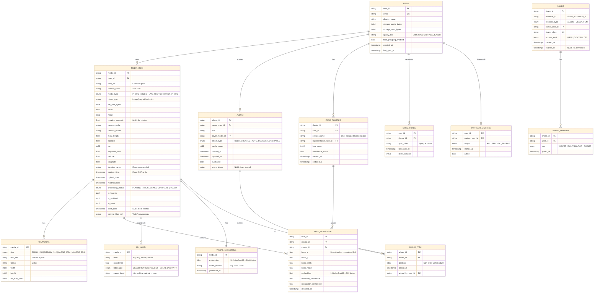
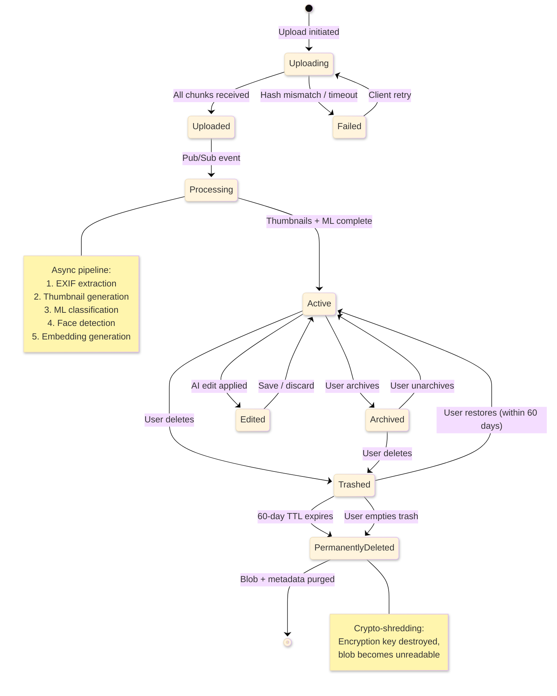
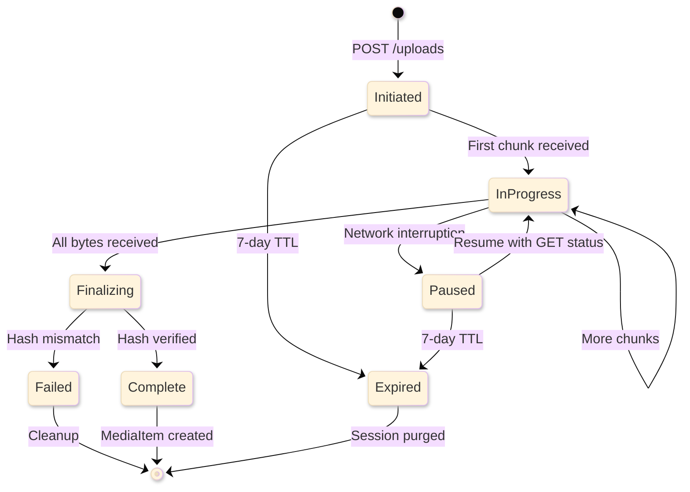

# Google Photos — Low-Level Design

## Data Model

### Entity Relationship Diagram



### Indexing Strategy

| Table | Index | Type | Purpose |
|-------|-------|------|---------|
| `MEDIA_ITEM` | `(user_id, capture_time DESC)` | Primary range | Chronological browsing |
| `MEDIA_ITEM` | `(user_id, upload_time DESC)` | Secondary | Recently uploaded |
| `MEDIA_ITEM` | `(user_id, is_favorite, capture_time)` | Composite | Favorites view |
| `MEDIA_ITEM` | `(user_id, in_trash, trash_time)` | Composite | Trash management (TTL cleanup) |
| `MEDIA_ITEM` | `(content_hash)` | Hash | Deduplication lookup |
| `MEDIA_ITEM` | `(user_id, latitude, longitude)` | Geospatial | Location-based browse (geo-hash) |
| `ALBUM_ITEM` | `(album_id, position)` | Interleaved | Album contents in order |
| `FACE_DETECTION` | `(cluster_id, recognition_confidence DESC)` | Secondary | Cluster representative selection |
| `FACE_DETECTION` | `(media_id)` | Secondary | Faces in a photo |
| `ML_LABEL` | `(user_id, label, confidence DESC)` | Inverted | Label-based search |
| `SYNC_TOKEN` | `(user_id, device_id)` | Primary | Sync state lookup |

### Partitioning Strategy

| Table | Partition Key | Strategy | Rationale |
|-------|---------------|----------|-----------|
| `MEDIA_ITEM` | `user_id` | Hash partition | Even distribution; all of a user's photos on same partition |
| `ALBUM` | `owner_user_id` | Hash partition | Co-located with user's media items |
| `FACE_DETECTION` | `user_id` | Hash partition | Face clustering operates per-user |
| `ML_LABEL` | `user_id` | Hash partition | Search is per-user scoped |
| `VISUAL_EMBEDDING` | `user_id` | Hash partition | Similarity search is per-user |

> **Spanner-specific**: Tables use interleaving (e.g., `ALBUM_ITEM` interleaved in `ALBUM`) for locality. Spanner automatically splits and merges based on load.

### Data Retention Policy

| Data Type | Retention | Mechanism |
|-----------|-----------|-----------|
| Active media items | Indefinite | Until user deletes |
| Trashed items | 60 days | Background job with TTL |
| Upload sessions | 7 days | TTL expiration |
| ML embeddings | Updated on model change | Re-generated on model update |
| Sync tokens | 90 days of inactivity | TTL with lazy cleanup |
| Deleted blob data | Crypto-shredded within 30 days | Key rotation + physical deletion |
| Audit logs | 2 years | Compliance requirement |

---

## API Design

### Media Items API

```
# Upload (Resumable)
POST   /v1/uploads
  Headers: X-Upload-Content-Type, X-Upload-Content-Length
  Request:  { fileName, description }
  Response: { uploadToken, uploadUrl, chunkSize }

PUT    /v1/uploads/{uploadToken}
  Headers: Content-Range: bytes {start}-{end}/{total}
  Body:    <binary chunk>
  Response: { bytesReceived, status: "IN_PROGRESS" | "COMPLETE" }

# Create Media Item (after upload)
POST   /v1/mediaItems:batchCreate
  Request:  {
    newMediaItems: [
      { uploadToken, description, albumId? }
    ]
  }
  Response: {
    newMediaItemResults: [
      { uploadToken, status, mediaItem: { id, baseUrl, mimeType, mediaMetadata } }
    ]
  }

# Get Media Item
GET    /v1/mediaItems/{mediaItemId}
  Response: {
    id, baseUrl, mimeType, filename,
    mediaMetadata: {
      width, height, creationTime,
      photo: { cameraMake, cameraModel, focalLength, aperture, isoEquivalent },
      video: { fps, status }
    },
    contributorInfo: { profilePictureBaseUrl, displayName }
  }

# List Media Items (paginated, reverse chronological)
GET    /v1/mediaItems
  Params:   pageSize (max 100), pageToken
  Response: { mediaItems: [...], nextPageToken }

# Search
POST   /v1/mediaItems:search
  Request:  {
    filters: {
      dateFilter:    { ranges: [{ startDate, endDate }] },
      contentFilter: { includedCategories: ["LANDSCAPES", "PETS"] },
      mediaTypeFilter: { mediaTypes: ["PHOTO", "VIDEO"] },
      featureFilter: { includedFeatures: ["FAVORITES"] }
    },
    orderBy: "RELEVANCE" | "CREATION_TIME",
    pageSize, pageToken
  }
  Response: { mediaItems: [...], nextPageToken }

# Batch Get
GET    /v1/mediaItems:batchGet
  Params:   mediaItemIds (max 50)
  Response: { mediaItemResults: [...] }
```

### Albums API

```
# Create Album
POST   /v1/albums
  Request:  { album: { title } }
  Response: { id, title, productUrl, isWriteable, mediaItemsCount, coverPhotoBaseUrl }

# List Albums
GET    /v1/albums
  Params:   pageSize (max 50), pageToken, excludeNonAppCreatedData
  Response: { albums: [...], nextPageToken }

# Get Album
GET    /v1/albums/{albumId}
  Response: { id, title, productUrl, mediaItemsCount, coverPhotoBaseUrl, shareInfo }

# Add Media to Album
POST   /v1/albums/{albumId}:batchAddMediaItems
  Request:  { mediaItemIds: ["id1", "id2"] }
  Response: {}

# Remove Media from Album
POST   /v1/albums/{albumId}:batchRemoveMediaItems
  Request:  { mediaItemIds: ["id1", "id2"] }
  Response: {}
```

### Sharing API

```
# Share Album
POST   /v1/albums/{albumId}:share
  Request:  {
    sharedAlbumOptions: {
      isCollaborative: true,
      isCommentable: true
    }
  }
  Response: { shareInfo: { sharedAlbumOptions, shareableUrl, shareToken } }

# Join Shared Album
POST   /v1/sharedAlbums:join
  Request:  { shareToken }
  Response: { album: {...} }

# List Shared Albums
GET    /v1/sharedAlbums
  Params:   pageSize, pageToken
  Response: { sharedAlbums: [...], nextPageToken }
```

### Image Serving URL Pattern

```
# Base URL format (returned by API)
https://lh3.googleusercontent.com/{encoded_path}

# Dynamic resizing via URL parameters
{baseUrl}=w{width}-h{height}      # Resize to fit within dimensions
{baseUrl}=s{size}                   # Resize to square
{baseUrl}=w{width}                  # Resize width, maintain aspect ratio
{baseUrl}=d                         # Force download
{baseUrl}=w2048-h1024-c             # Crop to exact dimensions
{baseUrl}=dv                        # Download video

# Example
https://lh3.googleusercontent.com/abc123=w256-h256  # 256px thumbnail
https://lh3.googleusercontent.com/abc123=w1920       # Full HD width
https://lh3.googleusercontent.com/abc123=s100-c       # 100px square crop
```

### Rate Limiting

| Endpoint | Limit | Window | Scope |
|----------|-------|--------|-------|
| `mediaItems:search` | 100 requests | per minute | per user |
| `mediaItems.list` | 1,000 requests | per minute | per user |
| `mediaItems.get` | 3,000 requests | per minute | per user |
| `uploads` | 2,000 uploads | per day | per user |
| `albums.create` | 50 albums | per day | per user |
| `batchCreate` | 50 items | per request | per request |
| API total | 10,000 requests | per day | per project (third-party) |

### Versioning Strategy

- URL path versioning: `/v1/`, `/v2/`
- Additive changes in same version (new fields, new endpoints)
- Breaking changes require new version
- Minimum 12-month deprecation window for old versions

### Idempotency

| Operation | Idempotency Key | Strategy |
|-----------|-----------------|----------|
| Upload | `uploadToken` | Server-generated, single-use |
| BatchCreate | `uploadToken` per item | Dedup on token |
| Album create | `requestId` header | Client-generated UUID |
| Add to album | `(albumId, mediaId)` pair | Natural idempotency (set operation) |
| Delete | `mediaItemId` | Idempotent by nature |

---

## Core Algorithms

### 1. Content-Based Deduplication

```
FUNCTION deduplicate(uploadedFile):
    // Phase 1: Hash-based exact dedup
    fileHash = SHA256(uploadedFile.bytes)

    existingBlob = LOOKUP blobStore WHERE content_hash = fileHash
                                      AND user_id = currentUser

    IF existingBlob EXISTS:
        // Exact duplicate — skip storage, link metadata
        CREATE mediaItem WITH blob_ref = existingBlob.path
        RETURN {status: DEDUPLICATED, mediaItemId: newId}

    // Phase 2: Near-duplicate detection (optional, for "Storage Saver")
    IF user.quality_tier == STORAGE_SAVER:
        perceptualHash = computePHash(uploadedFile)
        nearDuplicates = LOOKUP pHashIndex
                         WHERE hammingDistance(perceptualHash, stored_phash) < 5
                         AND user_id = currentUser

        IF nearDuplicates NOT EMPTY:
            // Flag for user review, don't auto-deduplicate
            MARK uploadedFile AS potential_duplicate
            SET duplicate_candidates = nearDuplicates

    // Phase 3: Store new blob
    blobPath = WRITE uploadedFile TO colossus
    CREATE mediaItem WITH blob_ref = blobPath, content_hash = fileHash
    RETURN {status: STORED, mediaItemId: newId}
```

**Complexity:** O(1) for hash lookup, O(log n) for perceptual hash ANN search

### 2. Thumbnail Generation Pipeline

```
FUNCTION generateThumbnails(mediaItem):
    originalBlob = READ colossus AT mediaItem.blob_ref

    IF mediaItem.type == PHOTO:
        image = DECODE(originalBlob, mediaItem.mime_type)

        // Auto-orient based on EXIF
        image = applyExifOrientation(image)

        // Strip sensitive EXIF before serving copies
        servingMetadata = stripSensitiveExif(image.exif)

        FOR EACH size IN [256, 512, 1024, 2048]:
            thumbnail = RESIZE(image, maxDimension=size, method=LANCZOS)
            thumbnail = ENCODE(thumbnail, format=WEBP, quality=80)
            path = WRITE thumbnail TO thumbnailStore
            SAVE Thumbnail(mediaItem.id, size, path)

        // Create serving copy (for full-res view)
        servingCopy = ENCODE(image, format=WEBP, quality=90)
        path = WRITE servingCopy TO servingStore
        UPDATE mediaItem SET serving_blob_ref = path

    ELSE IF mediaItem.type == VIDEO:
        // Extract poster frame at 1 second
        posterFrame = extractFrame(originalBlob, timestamp=1.0)

        FOR EACH size IN [256, 512, 1024]:
            thumbnail = RESIZE(posterFrame, maxDimension=size)
            thumbnail = ENCODE(thumbnail, format=WEBP, quality=80)
            SAVE Thumbnail(mediaItem.id, size, path)

        // Generate video preview (3-second clip)
        preview = extractClip(originalBlob, start=0, duration=3, resolution=480)
        SAVE videoPreview(mediaItem.id, preview)
```

### 3. Face Detection & Embedding (FaceNet-inspired)

```
FUNCTION processFaces(mediaItem):
    image = READ and DECODE mediaItem

    // Step 1: Face Detection (MTCNN or similar)
    faces = faceDetector.detect(image)
    // Returns: [{bbox, landmarks, confidence}]

    FOR EACH face IN faces WHERE face.confidence > 0.9:
        // Step 2: Face Alignment
        alignedFace = alignFace(image, face.landmarks)
        // Crop and align to 160x160 using eye/nose landmarks

        // Step 3: Face Embedding (FaceNet)
        embedding = faceEmbedder.encode(alignedFace)
        // Returns: 128-dimensional L2-normalized vector

        // Step 4: Store detection
        faceDetection = FaceDetection(
            face_id = generateId(),
            media_id = mediaItem.id,
            bbox = face.bbox,  // Normalized coordinates
            embedding = embedding,
            detection_confidence = face.confidence
        )
        SAVE faceDetection TO spanner

        // Step 5: Submit for clustering
        PUBLISH "FaceEmbeddingReady" TO pubsub WITH {
            user_id: mediaItem.user_id,
            face_id: faceDetection.face_id,
            embedding: embedding
        }

FUNCTION clusterFaces(userId, newFaceId, newEmbedding):
    // Incremental clustering — add new face to existing clusters

    existingClusters = LOAD faceClusters WHERE user_id = userId

    bestMatch = NULL
    bestDistance = INFINITY

    FOR EACH cluster IN existingClusters:
        // Compare against cluster centroid
        distance = L2_DISTANCE(newEmbedding, cluster.centroid)

        IF distance < bestDistance:
            bestDistance = distance
            bestMatch = cluster

    IF bestDistance < THRESHOLD (0.6):
        // Assign to existing cluster
        ADD newFaceId TO bestMatch
        UPDATE bestMatch.centroid = recomputeCentroid(bestMatch.faces)
        UPDATE bestMatch.face_count += 1
    ELSE:
        // Create new cluster
        newCluster = FaceCluster(
            cluster_id = generateId(),
            user_id = userId,
            centroid = newEmbedding,
            face_count = 1
        )
        ADD newFaceId TO newCluster
        SAVE newCluster

    // Periodic: Full re-clustering with HAC
    IF shouldReCluster(userId):
        SCHEDULE fullHACClustering(userId)
```

**FaceNet Distance Thresholds:**
- Same person: L2 distance < 0.6 (high confidence)
- Uncertain: 0.6 - 1.0 (may show "Is this the same person?" prompt)
- Different person: L2 distance > 1.0

### 4. Visual Search Query Processing

```
FUNCTION searchPhotos(userId, queryText):
    // Step 1: Parse and classify query
    queryAnalysis = analyzeQuery(queryText)
    // Returns: {
    //   entities: ["dog", "beach"],
    //   people: ["Mom"],
    //   dateRange: {start: "2024-06-01", end: "2024-08-31"},
    //   location: "Hawaii",
    //   intent: "VISUAL_SEARCH"
    // }

    candidateSets = []

    // Step 2: Multi-signal retrieval
    IF queryAnalysis.people NOT EMPTY:
        FOR EACH person IN queryAnalysis.people:
            clusterId = lookupPersonCluster(userId, person)
            mediaIds = LOOKUP faceDetections WHERE cluster_id = clusterId
            candidateSets.ADD(mediaIds, weight=2.0)

    IF queryAnalysis.entities NOT EMPTY:
        FOR EACH entity IN queryAnalysis.entities:
            mediaIds = LOOKUP invertedIndex
                       WHERE user_id = userId AND label = entity
            candidateSets.ADD(mediaIds, weight=1.0)

    IF queryAnalysis.dateRange NOT NULL:
        mediaIds = LOOKUP mediaItems
                   WHERE user_id = userId
                   AND capture_time BETWEEN start AND end
        candidateSets.ADD(mediaIds, weight=0.5)

    IF queryAnalysis.location NOT NULL:
        geoBounds = geocode(queryAnalysis.location)
        mediaIds = LOOKUP mediaItems
                   WHERE user_id = userId
                   AND geoWithin(lat, lng, geoBounds)
        candidateSets.ADD(mediaIds, weight=0.5)

    // Step 3: Semantic search via embedding similarity
    queryEmbedding = visualTextEncoder.encode(queryText)
    // Encode text query into same embedding space as images

    annResults = vectorIndex.search(
        userId, queryEmbedding, topK=200
    )
    candidateSets.ADD(annResults, weight=1.5)

    // Step 4: Fusion and ranking
    mergedResults = weightedFusion(candidateSets)
    // RRF (Reciprocal Rank Fusion) or weighted score combination

    // Step 5: Re-ranking with cross-encoder (optional for top-K)
    topResults = mergedResults.topK(50)
    rerankedResults = crossEncoderRerank(queryText, topResults)

    RETURN rerankedResults.topK(20)
```

**Complexity:** O(k log n) for ANN search + O(m) for inverted index lookup

### 5. Sync Protocol

```
FUNCTION syncDevice(userId, deviceId, lastSyncToken):
    // Server-side sync with opaque tokens

    // Step 1: Resolve sync position from token
    syncState = LOOKUP syncToken WHERE user_id = userId
                                   AND device_id = deviceId

    IF lastSyncToken != syncState.sync_token:
        // Token mismatch — client may have stale state
        RETURN {status: FULL_SYNC_REQUIRED}

    // Step 2: Fetch changes since last sync
    changes = QUERY mediaItems
              WHERE user_id = userId
              AND modified_time > syncState.last_sync_at
              ORDER BY modified_time ASC
              LIMIT 500

    albumChanges = QUERY albums
                   WHERE owner_user_id = userId
                   AND updated_at > syncState.last_sync_at

    // Step 3: Build change set
    changeSet = {
        newItems: changes.filter(c => c.upload_time > lastSync),
        modifiedItems: changes.filter(c => c.modified_time > lastSync AND c.upload_time <= lastSync),
        deletedItemIds: getDeletedSince(userId, syncState.last_sync_at),
        albumChanges: albumChanges
    }

    // Step 4: Generate new sync token
    newToken = generateSyncToken(userId, deviceId, NOW())
    UPDATE syncState SET sync_token = newToken, last_sync_at = NOW()

    RETURN {
        changes: changeSet,
        syncToken: newToken,
        hasMore: changes.count == 500
    }
```

### 6. Storage Saver Compression

```
FUNCTION applyStorageSaver(mediaItem):
    IF mediaItem.type == PHOTO:
        image = DECODE(mediaItem.blob)

        // Resize if over 16 megapixels
        IF image.width * image.height > 16_000_000:
            scaleFactor = SQRT(16_000_000 / (image.width * image.height))
            image = RESIZE(image, scaleFactor, method=LANCZOS)

        // Re-encode with quality optimization
        compressed = ENCODE(image, format=JPEG, quality=85)
        // Use perceptual quality metric (SSIM > 0.95)

        REPLACE mediaItem.blob WITH compressed
        UPDATE mediaItem.file_size = compressed.size

    ELSE IF mediaItem.type == VIDEO:
        IF videoResolution(mediaItem) > 1080:
            transcoded = TRANSCODE(mediaItem.blob,
                resolution=1080,
                codec=H264,
                bitrate=ADAPTIVE,
                preset=MEDIUM
            )
            REPLACE mediaItem.blob WITH transcoded
```

---

## State Diagrams

### Media Item Lifecycle



### Upload Session State



---

## Blob Storage Layout

```
colossus://photos/
├── originals/
│   └── {user_shard}/                    # Hash(userId) % 10000
│       └── {year}/{month}/
│           └── {media_id}.{ext}         # Original quality file
├── serving/
│   └── {user_shard}/
│       └── {media_id}.webp              # WebP serving copy
├── thumbnails/
│   └── {user_shard}/
│       └── {media_id}/
│           ├── s256.webp                # 256px
│           ├── s512.webp                # 512px
│           ├── s1024.webp               # 1024px
│           └── s2048.webp               # 2048px
├── videos/
│   └── {user_shard}/
│       └── {media_id}/
│           ├── original.mp4             # Original
│           ├── 1080p.mp4                # Transcoded
│           ├── 720p.mp4                 # Lower quality
│           └── poster.webp              # Video thumbnail
└── temp/
    └── uploads/
        └── {upload_session_id}/
            └── chunks/                  # Temporary chunk storage
```

**Key Design Choices:**
- **User sharding**: Hash-based directory sharding prevents hot directories
- **Temporal partitioning**: Year/month subdirectories for originals aid in bulk operations
- **Separation of concerns**: Originals, serving copies, and thumbnails in different trees for independent lifecycle management
- **Temp isolation**: Upload chunks in separate tree with aggressive TTL cleanup
