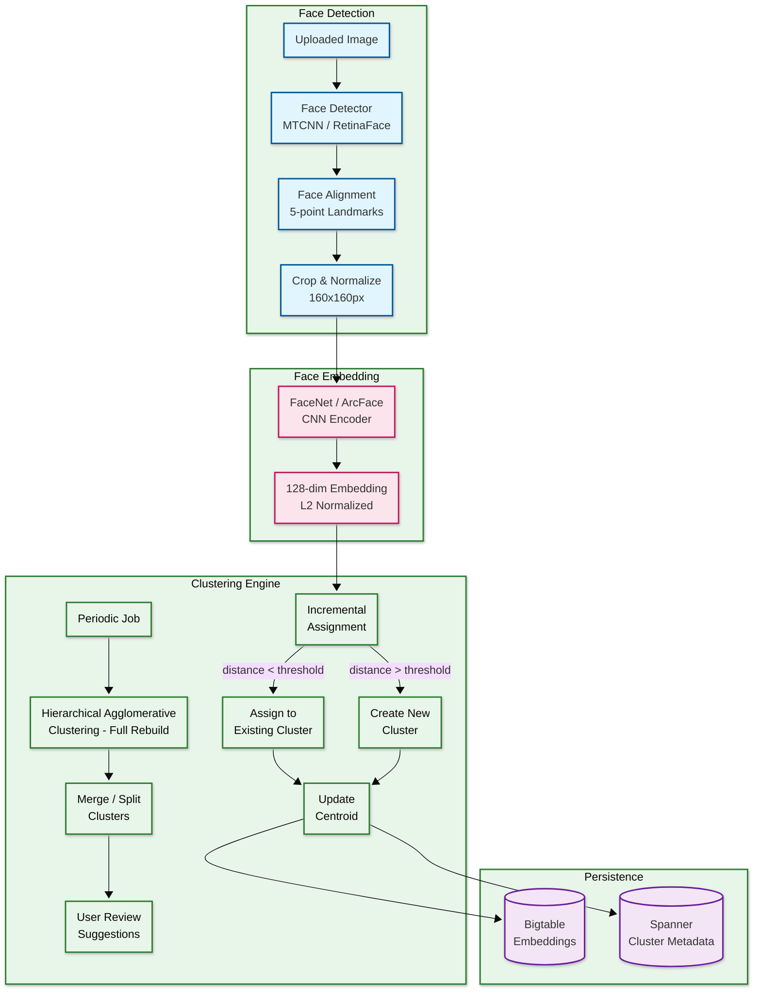
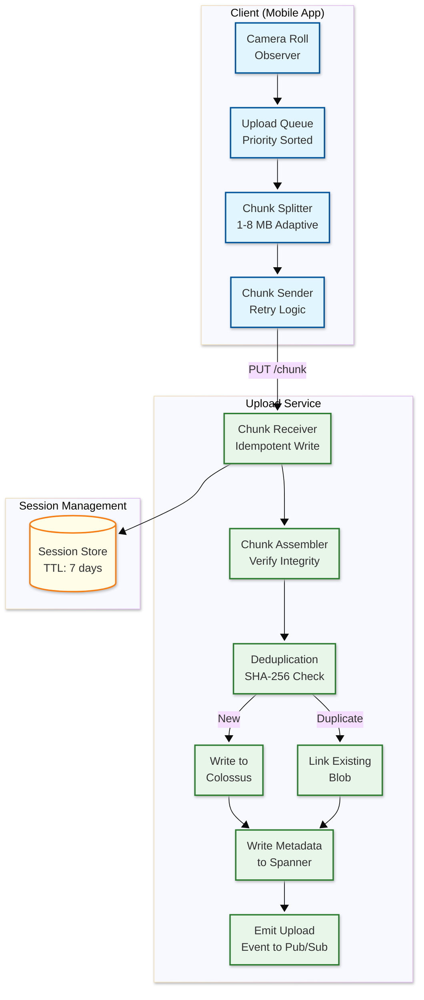

# Google Photos — Deep Dive & Bottlenecks

## Critical Component 1: Face Clustering at Scale

### Why Is This Critical?

Face grouping is one of Google Photos' most beloved features — users search by person name, create albums by person, and receive Memories featuring specific people. The system must cluster **billions of faces** across **trillions of photos** with:
- High accuracy (misidentifying people is jarring)
- Incremental updates (new photos should be clustered within minutes)
- Privacy compliance (face grouping is opt-in in EU/many regions)
- Graceful handling of aging, makeup, lighting variations

### How It Works Internally

#### Architecture



#### Face Detection Pipeline

1. **Multi-task CNN (MTCNN)** detects face bounding boxes and 5 facial landmarks (left eye, right eye, nose, mouth left, mouth right)
2. **Face alignment** uses affine transformation to normalize face orientation
3. **Quality filter** rejects:
   - Faces smaller than 36×36 pixels (too low resolution)
   - Detection confidence < 0.9
   - Extreme head angles (>60° yaw)
   - Heavily occluded faces (mask, sunglasses covering >50%)

#### FaceNet Embedding

- **Model**: Inception-ResNet variant trained with triplet loss
- **Training**: Large-scale face dataset with semi-hard negative mining
- **Output**: 128-dimensional L2-normalized vector
- **Property**: Euclidean distance directly corresponds to face similarity
  - Same person: d < 0.6 (typically 0.2-0.4)
  - Different person: d > 1.0 (typically 1.0-1.5)

#### Clustering Strategy: Hybrid Approach

**Online (Incremental):** For each new face embedding:
```
FOR EACH existing cluster (nearest centroids via ANN):
    IF L2_distance(newFace, centroid) < 0.6:
        ASSIGN to cluster
        UPDATE centroid (running average)
        BREAK
ELSE:
    CREATE new singleton cluster
```

**Offline (Batch):** Periodic full re-clustering:
```
HAC (Hierarchical Agglomerative Clustering):
    1. Start with all faces as singleton clusters
    2. Compute pairwise distances using ANN (not brute force)
    3. Merge closest pair if distance < threshold
    4. Use average-linkage criterion
    5. Stop when no mergeable pairs remain
```

**Why both?**
- **Incremental** provides near-real-time results (seconds after upload)
- **Batch HAC** catches errors from incremental (split/merge corrections) and incorporates model updates
- Batch runs nightly or when user uploads >50 photos at once

### Failure Modes & Handling

| Failure Mode | Impact | Mitigation |
|-------------|--------|------------|
| Face model returns wrong embedding | Misclassified person | Multi-photo consensus: need 3+ photos to confirm cluster |
| Cluster drift over time | Person's cluster splits | Periodic HAC re-clustering merges drifted subclusters |
| Twins / lookalikes merged | Two people in one cluster | User-initiated split; lower merge threshold for flagged clusters |
| Lighting/age causes poor embedding | Person not found in search | Data augmentation in training; periodically re-embed with newer models |
| ML pipeline lag | Faces not clustered for hours | Priority queuing: photos with detected faces get higher priority |

---

## Critical Component 2: Upload Pipeline & Resumable Uploads

### Why Is This Critical?

The upload pipeline handles **1.7 billion uploads/day** from mobile devices with unreliable networks. A failed upload means potential data loss (user may delete the original from their device). The pipeline must be:
- **Resumable**: Don't re-upload already-transmitted bytes
- **Idempotent**: Retrying any operation is safe
- **Deduplicating**: Don't store the same photo twice
- **Bandwidth-efficient**: Minimize data transfer on metered connections

### How It Works Internally



#### Client-Side Logic

```
FUNCTION backgroundUpload():
    // Runs as background service on Android / iOS background task

    newPhotos = cameraRollObserver.getNewSince(lastScanTime)

    FOR EACH photo IN newPhotos:
        // Check network conditions
        IF user.wifiOnlyEnabled AND NOT isOnWifi():
            SKIP

        // Check battery
        IF batteryLevel < 15% AND NOT isCharging():
            SKIP

        // Check if already uploaded (local DB)
        IF localDB.isUploaded(photo.localId):
            CONTINUE

        // Adaptive chunk sizing
        chunkSize = estimateOptimalChunkSize(networkSpeed)
        // Fast WiFi: 8 MB, Slow mobile: 1 MB

        uploadQueue.enqueue(photo, priority=photo.timestamp)

    processQueue()

FUNCTION processQueue():
    WHILE uploadQueue NOT EMPTY:
        photo = uploadQueue.dequeue()

        session = getOrCreateSession(photo)

        IF session.bytesUploaded < photo.fileSize:
            // Resume from last successful byte
            remainingChunks = splitIntoChunks(
                photo.bytes[session.bytesUploaded:],
                chunkSize
            )

            FOR EACH chunk IN remainingChunks:
                success = uploadChunkWithRetry(session, chunk, maxRetries=5)
                IF NOT success:
                    session.pause()
                    uploadQueue.requeue(photo, delay=exponentialBackoff())
                    BREAK

        IF session.bytesUploaded == photo.fileSize:
            finalizeUpload(session)
            localDB.markUploaded(photo.localId)
```

#### Adaptive Chunk Sizing

| Network Type | Speed Estimate | Chunk Size | Rationale |
|-------------|---------------|------------|-----------|
| WiFi (fast) | >10 Mbps | 8 MB | Maximize throughput |
| WiFi (slow) | 2-10 Mbps | 4 MB | Balance throughput/retry cost |
| 4G/LTE | 5-50 Mbps | 4 MB | Variable; medium chunks |
| 3G | 0.5-2 Mbps | 1 MB | Minimize retry waste |
| 2G | <0.5 Mbps | 256 KB | Tiny chunks to survive drops |

### Failure Modes & Handling

| Failure Mode | Impact | Mitigation |
|-------------|--------|------------|
| Network interruption mid-chunk | Partial data loss | Resumable protocol: server tracks bytes received, client resumes |
| App killed during upload | Upload stalls | Background service restart; session persisted on server (7-day TTL) |
| Disk full on server | Upload rejected | Pre-flight quota check; graceful rejection with retry-after header |
| Hash mismatch on finalize | Corrupted upload | Reject and require re-upload; client re-reads from device |
| Duplicate upload (multi-device) | Wasted storage | SHA-256 content hash dedup at finalization time |
| Upload rate spike (holiday) | Service overload | Per-user rate limiting; backpressure via 429 with retry-after |

---

## Critical Component 3: Visual Search Engine

### Why Is This Critical?

Google Photos' search is its primary differentiator — users can find photos by typing natural language queries. The system must:
- Search across a user's entire library (potentially 100K+ photos)
- Combine multiple signals (visual, temporal, spatial, faces)
- Return results in <400ms (p95)
- Handle ambiguous queries ("that photo from last summer")

### How It Works Internally

```mermaid
---
config:
  look: neo
  theme: base
---
flowchart TB
    subgraph QueryParsing["Query Understanding"]
        INPUT[User Query<br/>"mom at the beach<br/>last summer"] --> NLU[NLU / Intent<br/>Classification]
        NLU --> ENTITIES[Entity Extraction<br/>person: mom<br/>scene: beach<br/>time: last summer]
        NLU --> EMBED_Q[Query Embedding<br/>Text → Visual Space]
    end

    subgraph Retrieval["Multi-Signal Retrieval"]
        ENTITIES --> FACE_SEARCH[Face Index<br/>person → cluster → mediaIds]
        ENTITIES --> LABEL_SEARCH[Label Index<br/>label → mediaIds]
        ENTITIES --> TIME_SEARCH[Temporal Index<br/>date range → mediaIds]
        ENTITIES --> GEO_SEARCH[Geo Index<br/>location → mediaIds]
        EMBED_Q --> VECTOR_SEARCH[Vector Index<br/>ANN → top-K mediaIds]
    end

    subgraph Ranking["Fusion & Ranking"]
        FACE_SEARCH --> FUSION[Reciprocal Rank<br/>Fusion]
        LABEL_SEARCH --> FUSION
        TIME_SEARCH --> FUSION
        GEO_SEARCH --> FUSION
        VECTOR_SEARCH --> FUSION

        FUSION --> RERANK[Cross-Encoder<br/>Re-ranking<br/>Top 50]
        RERANK --> FINAL[Final Results<br/>Top 20]
    end

    classDef query fill:#fff3e0,stroke:#e65100,stroke-width:2px
    classDef retrieval fill:#e8f5e9,stroke:#2e7d32,stroke-width:2px
    classDef ranking fill:#e1f5fe,stroke:#01579b,stroke-width:2px

    class INPUT,NLU,ENTITIES,EMBED_Q query
    class FACE_SEARCH,LABEL_SEARCH,TIME_SEARCH,GEO_SEARCH,VECTOR_SEARCH retrieval
    class FUSION,RERANK,FINAL ranking
```

#### Embedding Model Architecture

Google uses variants of their **SigLIP / CoCa** models for traditional search, and **Gemini** for the newer "Ask Photos" feature:

**Traditional Visual Search (Dual-Encoder):**
- **Dual-encoder**: Separate image and text encoders that map to shared embedding space
- **Image encoder**: Vision Transformer (ViT-L/14) producing 512-dim embeddings
- **Text encoder**: Transformer that encodes search queries into same 512-dim space
- **Training**: Contrastive learning on billions of image-text pairs
- **Property**: cosine_similarity(image_embedding, text_embedding) indicates relevance

**Ask Photos (Gemini-Powered RAG, 2024-2025):**
- **Agent Model**: Gemini-based agent understands user intent and selects the best RAG retrieval tool
- **Vector-Based Retrieval**: Updated vector search extends existing metadata search; supports natural language queries (e.g., "person smiling while riding a bike")
- **Answer Model**: Gemini's long context window + multimodal capabilities analyze visual content, text, and metadata from retrieved photos
- **Learning**: Users can correct responses; system remembers corrections for future queries
- **Scale**: 370 million monthly search users

#### Search Index Architecture

```
Per-User Search Index:
├── Inverted Index (Labels → MediaIds)
│   ├── "dog"    → [m1, m45, m102, m567, ...]
│   ├── "beach"  → [m12, m45, m890, ...]
│   ├── "sunset" → [m45, m234, ...]
│   └── ...      → 1000+ labels per user library
│
├── Vector Index (ScaNN / SOAR - Google's ANN Search Library)
│   ├── Quantized embeddings (512-dim → 64 bytes via learned quantization)
│   ├── Clustering into tree-like structures for fast query-time pruning
│   ├── SOAR: newer algorithms for even faster search (built on ScaNN)
│   ├── Scales to 10B+ vectors in production (deployed in Spanner)
│   └── Updated incrementally on new uploads
│
├── Face Index (PersonName → ClusterIds → MediaIds)
│   ├── "Mom"   → cluster_abc → [m1, m12, m45, ...]
│   ├── "Dad"   → cluster_def → [m3, m67, ...]
│   └── Unlabeled clusters also searchable by face
│
├── Temporal Index (Timestamp → MediaIds)
│   └── B-tree on capture_time for range queries
│
└── Geo Index (GeoHash → MediaIds)
    └── Geo-hash grid for spatial queries
```

#### Reciprocal Rank Fusion (RRF)

```
FUNCTION reciprocalRankFusion(candidateLists, weights):
    // Merge multiple ranked lists into a single ranking

    scoreMap = {}
    k = 60  // RRF constant

    FOR EACH (list, weight) IN zip(candidateLists, weights):
        FOR EACH (rank, mediaId) IN enumerate(list):
            IF mediaId NOT IN scoreMap:
                scoreMap[mediaId] = 0
            scoreMap[mediaId] += weight * (1.0 / (k + rank))

    RETURN sortByScoreDescending(scoreMap)
```

### Failure Modes & Handling

| Failure Mode | Impact | Mitigation |
|-------------|--------|------------|
| Vector index out of sync | New photos not searchable | SLA: index within 10 min; background reconciliation job |
| ANN returns false negatives | Relevant photos missed | Use over-retrieval (top-200) + re-ranking with exact scoring |
| Query misunderstanding | Irrelevant results | Fallback to keyword-only search if NLU confidence low |
| Index corruption | Search fully broken | Redundant index copies; rebuild from ML features in Bigtable |
| Cold start (new user) | No ML labels yet | Show "processing" indicator; prioritize ML pipeline for new accounts |

---

## Concurrency & Race Conditions

### Race Condition 1: Concurrent Upload + Delete

**Scenario:** User uploads a photo from device A while simultaneously deleting it from device B.

```
Timeline:
  T1: Device A starts upload of photo X
  T2: Device B sends DELETE for photo X
  T3: Device A completes upload of photo X
  T4: Device B receives DELETE confirmation

Problem: Should photo X exist or not?
```

**Solution:** Spanner's strong consistency + transaction isolation
```
// Upload uses conditional write
BEGIN TRANSACTION
    IF NOT EXISTS (SELECT 1 FROM deleted_items WHERE media_id = X):
        INSERT INTO media_items (media_id, ...) VALUES (X, ...)
COMMIT

// Delete marks item, doesn't remove immediately
BEGIN TRANSACTION
    UPDATE media_items SET in_trash = true, trash_time = NOW()
        WHERE media_id = X
COMMIT
```

**Resolution:** Last-write-wins with Spanner's TrueTime ordering. If delete happens after upload commit, the item goes to trash. If delete races with upload, the upload's conditional check catches it.

### Race Condition 2: Concurrent Album Modification

**Scenario:** Two users add different photos to a shared album simultaneously.

**Solution:** Spanner supports concurrent writes to different rows. Album items are separate rows, so concurrent adds don't conflict. The album's `media_count` is updated atomically:
```
// Each add is an independent row insert + counter update
BEGIN TRANSACTION
    INSERT INTO album_items (album_id, media_id, position, added_at)
        VALUES (albumId, mediaId, nextPosition(), NOW())
    UPDATE albums SET media_count = media_count + 1
        WHERE album_id = albumId
COMMIT
```

### Race Condition 3: Face Cluster Merge During Upload

**Scenario:** Batch HAC re-clustering is running while new faces are being added incrementally.

**Solution:** Double-buffer approach:
1. HAC reads a snapshot of all embeddings (Spanner snapshot read)
2. HAC produces new cluster assignments
3. New faces that arrived during HAC are queued
4. Atomic swap: new cluster assignments are committed
5. Queued faces are re-assigned against new clusters

---

## Bottleneck Analysis

### Bottleneck 1: ML Processing Throughput

**Problem:** 4 billion photos/day × 10+ models = 48+ billion ML inferences/day. At peak (3x average), this is ~1.7M inferences/second.

**Impact:** If ML pipeline falls behind, photos won't be searchable or face-clustered for hours.

**Mitigation:**
| Strategy | Implementation |
|----------|---------------|
| **Hardware acceleration** | TPU v4/v5 pods dedicated to Photos ML pipeline |
| **Model optimization** | Quantized models (INT8), distilled smaller variants |
| **Batching** | Group 32-64 images per inference batch for GPU efficiency |
| **Priority queuing** | Interactive uploads get P0; backup uploads get P1; re-processing gets P2 |
| **Pipeline parallelism** | Different models run concurrently on same image |
| **Skip redundant models** | If a photo has no faces, skip face embedding; if a video, skip some photo-specific models |
| **Regional processing** | Process in the same region as upload to avoid cross-region data transfer |

### Bottleneck 2: Thumbnail Serving at Scale

**Problem:** 460K-1.4M thumbnail requests/second. Each grid view loads 50-100 thumbnails. Hot photos (shared albums, Memories) get disproportionate traffic.

**Impact:** Slow thumbnail loading makes the entire app feel sluggish.

**Mitigation:**
| Strategy | Implementation |
|----------|---------------|
| **Multi-layer caching** | Client cache (30 days) → CDN edge (24h) → Origin cache → Blob store |
| **Prewarming** | Pre-cache thumbnails for likely-to-be-viewed photos (recent uploads, Memories) |
| **WebP format** | 25-35% smaller than JPEG at same quality |
| **Progressive loading** | Load tiny placeholder (blur-up) → 256px → 512px on scroll-stop |
| **HTTP/2 multiplexing** | Single connection for all thumbnail requests in a grid view |
| **Cache-friendly URLs** | Immutable content-addressed URLs enable aggressive caching |

### Bottleneck 3: Storage Cost at Exabyte Scale

**Problem:** ~38 EB of effective storage (with erasure coding). Storage is the single largest cost center. Most photos are rarely accessed after the first week. Colossus filesystems each exceed 10 EB.

**Impact:** Unsustainable cost growth at ~3 EB/year.

**Mitigation:**
| Strategy | Implementation |
|----------|---------------|
| **Tiered storage** | Hot (SSD, first 30 days) → Warm (HDD, 30 days - 1 year) → Cold (archive, >1 year) |
| **Erasure coding** | 1.5x overhead vs 3x for triple replication |
| **Deduplication** | Content-hash dedup saves ~5-10% storage |
| **Storage Saver compression** | 40-60% size reduction for opted-in users |
| **Express Backup tier** | 3 MP compressed — significant savings for price-sensitive markets |
| **Freemium model** | Storage counts against quota; free tier limited to 15 GB (since June 2021) |
| **Intelligent tiering** | ML predicts access patterns; auto-move cold data to cheaper storage |

---

## Performance Optimization Techniques

### Image Serving Optimization

```
Client Request:  GET /photo/abc123?w=1920&h=1080&fit=cover

Server Pipeline:
1. Parse dimensions from URL parameters
2. Check CDN edge cache → HIT? Return cached
3. Check origin serving copy cache → HIT? Resize on-the-fly from cached copy
4. Fetch from serving copy store (pre-generated WebP)
5. Resize to requested dimensions
6. Apply quality optimization (SSIM-based)
7. Set Cache-Control: public, max-age=86400, immutable
8. Return with Content-Type: image/webp
```

### Prefetching Strategy

```
FUNCTION predictNextPhotos(userId, currentPosition, scrollDirection):
    // Predict which thumbnails user will see next

    IF scrollDirection == DOWN:
        nextBatch = fetchMediaItems(userId, after=currentPosition, limit=50)
    ELSE IF scrollDirection == UP:
        nextBatch = fetchMediaItems(userId, before=currentPosition, limit=50)

    // Prefetch thumbnails for predicted photos
    FOR EACH item IN nextBatch:
        prefetchThumbnail(item.thumbnailUrl, priority=LOW)

    // Also prefetch "likely to click" full-res for recent photos
    IF isRecent(currentPosition, days=7):
        FOR EACH item IN nextBatch[:5]:
            prefetchFullRes(item.servingUrl, priority=VERY_LOW)
```
