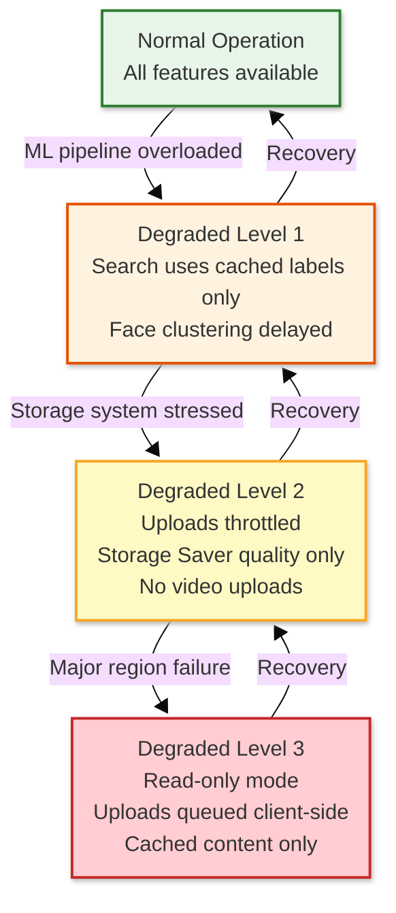

# Google Photos — Scalability & Reliability

## Scalability

### Horizontal vs Vertical Scaling Decisions

| Component | Scaling Type | Strategy |
|-----------|-------------|----------|
| Upload Service | **Horizontal** | Stateless; scale pods based on upload QPS |
| Media Service | **Horizontal** | Stateless; scale based on read QPS |
| ML Pipeline | **Horizontal** | Scale TPU/GPU worker pools based on queue depth |
| Face Clustering | **Vertical + Horizontal** | Per-user clustering is CPU-intensive; shard by user |
| Search Service | **Horizontal** | Per-user indexes sharded across search workers |
| Blob Storage (Colossus) | **Horizontal** | Add more chunk servers and disks |
| Metadata (Spanner) | **Horizontal** | Automatic split-based sharding |
| CDN Edge | **Horizontal** | Add more PoPs in regions with growing traffic |

### Auto-Scaling Triggers

| Service | Metric | Scale-Up Threshold | Scale-Down Threshold | Cooldown |
|---------|--------|-------------------|---------------------|----------|
| Upload Service | Request rate (QPS) | >80% capacity for 2 min | <30% capacity for 10 min | 5 min |
| Media Service | Latency p95 | >200ms for 3 min | <50ms for 15 min | 5 min |
| ML Pipeline Workers | Queue depth | >10K items pending | <1K items pending | 10 min |
| Thumbnail Service | CPU utilization | >70% for 2 min | <25% for 10 min | 3 min |
| Search Service | Latency p99 | >500ms for 2 min | <100ms for 15 min | 5 min |

### Database Scaling Strategy

#### Spanner (Metadata)

```
Spanner Topology:
├── Global Instance (multi-region)
│   ├── US-East (leader for Americas users)
│   ├── US-West (replica)
│   ├── EU-West (leader for EU users)
│   ├── EU-North (replica)
│   ├── APAC-East (leader for APAC users)
│   └── APAC-South (replica)
│
├── Sharding:
│   ├── Primary key: user_id (hash-based distribution)
│   ├── Interleaved tables: album_items IN albums, thumbnails IN media_items
│   └── Auto-splitting: Spanner splits hot ranges automatically
│
└── Read Patterns:
    ├── Strong reads: Metadata writes, deletion, sharing changes
    ├── Stale reads (10s): Browse, search (tolerate slight staleness)
    └── Snapshot reads: Batch ML processing, analytics
```

#### Colossus (Blob Storage)

```
Colossus Scaling:
├── Chunk Servers: Add more servers as storage grows
│   ├── Each server manages local SSDs/HDDs
│   └── Chunk size: 64 MB (larger than GFS for media workloads)
│
├── Metadata (Bigtable-backed):
│   ├── File → chunk mapping
│   └── Chunk → server mapping
│
├── Erasure Coding: Reed-Solomon (10,4)
│   ├── 10 data chunks + 4 parity chunks
│   ├── Tolerates loss of any 4 chunks
│   └── 1.4x overhead vs 3x for triple replication
│
└── Tiered Storage:
    ├── Flash/SSD: Hot data (< 30 days, frequently accessed)
    ├── HDD: Warm data (30 days - 1 year)
    └── Tape/Archive: Cold data (> 1 year, rarely accessed)
```

### Caching Layers

```mermaid
---
config:
  look: neo
  theme: base
---
flowchart LR
    subgraph L1["L1: Client Cache"]
        direction TB
        APP_MEM[In-Memory LRU<br/>Recent thumbnails]
        APP_DISK[Disk Cache<br/>100-500 MB]
    end

    subgraph L2["L2: CDN Edge Cache"]
        direction TB
        EDGE_HOT[Hot Cache<br/>Popular thumbnails<br/>Shared content]
        EDGE_WARM[Warm Cache<br/>Recent uploads<br/>24h TTL]
    end

    subgraph L3["L3: Origin Cache"]
        direction TB
        MEMCACHE_META[Memcache<br/>Metadata<br/>TTL: 5 min]
        MEMCACHE_THUMB[Memcache<br/>Hot Thumbnails<br/>TTL: 1 hour]
    end

    subgraph L4["L4: Serving Store"]
        direction TB
        SERVING[Pre-generated<br/>WebP Copies]
        THUMBS[Thumbnail<br/>Store]
    end

    subgraph L5["L5: Origin Store"]
        direction TB
        COLOSSUS[Colossus<br/>Original Blobs]
    end

    L1 -->|Miss| L2
    L2 -->|Miss| L3
    L3 -->|Miss| L4
    L4 -->|Miss| L5

    classDef l1 fill:#e1f5fe,stroke:#01579b,stroke-width:2px
    classDef l2 fill:#e0f7fa,stroke:#00695c,stroke-width:2px
    classDef l3 fill:#fffde7,stroke:#f57f17,stroke-width:2px
    classDef l4 fill:#f1f8e9,stroke:#558b2f,stroke-width:2px
    classDef l5 fill:#f3e5f5,stroke:#6a1b9a,stroke-width:2px

    class APP_MEM,APP_DISK l1
    class EDGE_HOT,EDGE_WARM l2
    class MEMCACHE_META,MEMCACHE_THUMB l3
    class SERVING,THUMBS l4
    class COLOSSUS l5
```



**Cache Hit Rates (Expected):**

| Layer | Hit Rate | Rationale |
|-------|----------|-----------|
| L1 (Client) | 60-70% | Most browsing is recent photos |
| L2 (CDN Edge) | 40-50% | Shared content, popular photos |
| L3 (Origin Cache) | 70-80% | Active user metadata |
| L4 (Serving Store) | 99%+ | Pre-generated; always present |
| **Effective** | **~95%** | Very few requests reach Colossus |

### Hot Spot Mitigation

| Hot Spot | Scenario | Mitigation |
|----------|----------|------------|
| **Viral shared album** | Celebrity shares album; millions of views | CDN edge caching; per-URL rate limiting |
| **Heavy uploader** | User uploads 10K photos at once (vacation dump) | Per-user upload rate limiting; queue-based processing |
| **Popular person search** | User searches for face across 100K+ photos | Pre-computed face→media mapping; cached per-user |
| **Spanner hot key** | Single user with massive library (1M+ photos) | Spanner auto-splits; interleaved tables distribute load |
| **ML pipeline spike** | Holiday upload surge (Christmas morning) | Auto-scaling ML workers; priority degradation (delay non-critical models) |

---

## Reliability & Fault Tolerance

### Single Points of Failure (SPOF) Identification

| Component | SPOF Risk | Mitigation |
|-----------|-----------|------------|
| Spanner | Low | Multi-region Paxos replication (5+ replicas) |
| Colossus | Low | Erasure coding (14 chunks, tolerates 4 failures) |
| Upload Service | Low | Stateless, multi-zone deployment |
| ML Pipeline | Medium | Queue-backed; temporary delays acceptable |
| Face Clustering | Medium | Per-user scope limits blast radius |
| CDN Edge PoP | Low | Traffic shifts to next-nearest PoP |
| Pub/Sub | Low | Multi-zone, replicated |

### Redundancy Strategy

```
┌───────────────────────────────────────────────────────┐
│ Zone-Level Redundancy                                 │
│                                                       │
│   Zone A          Zone B          Zone C              │
│   ┌──────┐       ┌──────┐       ┌──────┐             │
│   │Upload│       │Upload│       │Upload│    ← Active  │
│   │Media │       │Media │       │Media │      in all  │
│   │Search│       │Search│       │Search│      zones   │
│   └──────┘       └──────┘       └──────┘             │
│      ↕              ↕              ↕                  │
│   ┌──────┐       ┌──────┐       ┌──────┐             │
│   │Spanner│      │Spanner│      │Spanner│   ← Paxos  │
│   │Replica│      │Replica│      │Replica│     sync    │
│   └──────┘       └──────┘       └──────┘             │
│                                                       │
├───────────────────────────────────────────────────────┤
│ Region-Level Redundancy                               │
│                                                       │
│   US Region    EU Region    APAC Region               │
│   ┌────────┐  ┌────────┐  ┌────────┐                 │
│   │Full    │  │Full    │  │Full    │    ← Each region │
│   │Stack   │  │Stack   │  │Stack   │      fully       │
│   │        │  │        │  │        │      independent  │
│   │Colossus│  │Colossus│  │Colossus│                  │
│   │Spanner │  │Spanner │  │Spanner │                  │
│   │ML      │  │ML      │  │ML      │                  │
│   └────────┘  └────────┘  └────────┘                  │
│       ↕ async replication ↕                           │
└───────────────────────────────────────────────────────┘
```

### Failover Mechanisms

| Failure | Detection | Failover | Recovery Time |
|---------|-----------|----------|---------------|
| Zone failure | Health checks (2s interval) | GSLB shifts traffic to healthy zones | <30s |
| Region failure | Cross-region probes | GSLB shifts to nearest region | <2 min |
| Spanner leader failure | Paxos leader election | Automatic leader re-election | <10s |
| Colossus chunk server failure | Heartbeat timeout | Read from replica chunks; reconstruct from erasure codes | <1 min |
| ML pipeline failure | Queue depth monitoring | Route to backup ML cluster; degrade to delayed processing | <5 min |
| CDN PoP failure | Anycast routing | Traffic shifts to next-nearest PoP | <10s |

### Circuit Breaker Patterns

```
CIRCUIT_BREAKER_CONFIG = {
    "ml_pipeline": {
        failure_threshold: 50%,     // % of requests failing
        window: 60 seconds,
        open_duration: 30 seconds,  // Time before half-open
        half_open_requests: 10,     // Test requests in half-open

        fallback: "SKIP_ML",        // Skip ML processing, mark for retry later
    },
    "face_clustering": {
        failure_threshold: 30%,
        window: 120 seconds,
        open_duration: 60 seconds,
        half_open_requests: 5,

        fallback: "QUEUE_FOR_LATER", // Queue for batch processing
    },
    "search_vector_index": {
        failure_threshold: 20%,
        window: 30 seconds,
        open_duration: 15 seconds,
        half_open_requests: 20,

        fallback: "LABEL_ONLY_SEARCH", // Degrade to keyword-only search
    },
    "thumbnail_generation": {
        failure_threshold: 40%,
        window: 60 seconds,
        open_duration: 30 seconds,
        half_open_requests: 10,

        fallback: "SERVE_PLACEHOLDER", // Show generic placeholder
    }
}
```

### Retry Strategies

| Operation | Strategy | Max Retries | Base Delay | Max Delay | Jitter |
|-----------|----------|-------------|------------|-----------|--------|
| Upload chunk | Exponential backoff | 5 | 1s | 32s | Full |
| Metadata write | Exponential backoff | 3 | 100ms | 5s | Decorrelated |
| ML inference | Fixed delay | 2 | 5s | 5s | None |
| Search query | Immediate retry | 1 | 0ms | 0ms | None |
| Thumbnail fetch | Exponential backoff | 3 | 500ms | 4s | Full |
| Sync request | Exponential backoff | 5 | 2s | 60s | Full |

### Graceful Degradation



### Bulkhead Pattern

```
Service Isolation:
┌─────────────────────────────────────────────────┐
│ Upload Bulkhead           │ Read Bulkhead        │
│ ┌───────────────────────┐ │ ┌──────────────────┐ │
│ │ Upload Workers (Pool) │ │ │ Media Service    │ │
│ │ Max: 10K connections  │ │ │ Max: 50K conns   │ │
│ │ Timeout: 30s/chunk    │ │ │ Timeout: 5s      │ │
│ └───────────────────────┘ │ └──────────────────┘ │
├───────────────────────────┼──────────────────────┤
│ ML Bulkhead               │ Search Bulkhead      │
│ ┌───────────────────────┐ │ ┌──────────────────┐ │
│ │ ML Workers (TPU Pool) │ │ │ Search Workers   │ │
│ │ Max: 5K concurrent    │ │ │ Max: 20K conns   │ │
│ │ Timeout: 30s/image    │ │ │ Timeout: 2s      │ │
│ └───────────────────────┘ │ └──────────────────┘ │
└───────────────────────────┴──────────────────────┘

Key: Each bulkhead has independent resource pools.
     Failure in ML pipeline cannot starve upload or read paths.
```

---

## Disaster Recovery

### Recovery Objectives

| Metric | Target | Justification |
|--------|--------|---------------|
| **RTO** (Recovery Time Objective) | <5 minutes | Auto-failover to healthy region |
| **RPO** (Recovery Point Objective) | 0 for metadata, <1 min for blobs | Spanner = synchronous; Colossus = async replication |

### Backup Strategy

| Data Type | Backup Method | Frequency | Retention |
|-----------|--------------|-----------|-----------|
| Metadata (Spanner) | Continuous Paxos replication | Real-time | 5+ replicas always |
| Blobs (Colossus) | Erasure coding + geo-replication | Async (~seconds) | 3+ regions |
| ML Models | Versioned in model registry | Per deployment | 90 days of rollback |
| Search Index | Rebuild from source data | Continuous | Index + source of truth |
| Config | Version-controlled | Per change | Indefinite |

### Multi-Region Failover Procedure

```
SCENARIO: US-East region failure

1. Detection (T+0s):
   - Health check probes fail from US-East
   - GSLB detects 3 consecutive probe failures

2. Traffic Shift (T+10s):
   - GSLB removes US-East from DNS rotation
   - US users routed to US-West (next nearest)
   - In-flight uploads receive retry-with-redirect

3. Spanner Failover (T+15s):
   - Paxos leader re-election if US-East held leadership
   - New leader elected in US-West or EU-West
   - No data loss (synchronous replication)

4. Blob Availability (T+30s):
   - Reads served from geo-replicated copies in US-West
   - Any recently uploaded blobs not yet replicated:
     Fall back to "upload successful, processing pending"

5. ML Pipeline Redirect (T+2min):
   - ML processing queue drains to US-West TPU pods
   - Temporary processing delay (minutes, not hours)

6. Full Recovery (T+5min):
   - All services operational from remaining regions
   - User experience: brief latency spike, no data loss

7. Region Recovery (T+hours/days):
   - US-East brought back online
   - Spanner auto-resyncs
   - Colossus backfills missing chunks
   - Gradual traffic shift back to US-East
```

### Data Integrity Verification

```
BACKGROUND JOB: IntegrityChecker (runs continuously)

FOR EACH user IN randomSample(allUsers, 0.1%):
    // Check metadata ↔ blob consistency
    mediaItems = QUERY spanner WHERE user_id = user.id

    FOR EACH item IN mediaItems:
        // Verify blob exists
        IF NOT colossus.exists(item.blob_ref):
            ALERT "CRITICAL: Blob missing for media_item " + item.id
            ATTEMPT recovery from replica regions

        // Verify thumbnails exist
        FOR EACH size IN [256, 512, 1024]:
            IF NOT thumbnailStore.exists(item.id, size):
                SCHEDULE thumbnailRegeneration(item)

        // Verify search index entry
        IF NOT searchIndex.contains(item.id):
            SCHEDULE reindexing(item)

    // Check for orphaned blobs (blob exists but no metadata)
    orphanedBlobs = colossus.listBlobs(user.shard)
                    MINUS spanner.listBlobRefs(user.id)
    IF orphanedBlobs NOT EMPTY:
        SCHEDULE orphanCleanup(orphanedBlobs, delay=7days)
```
