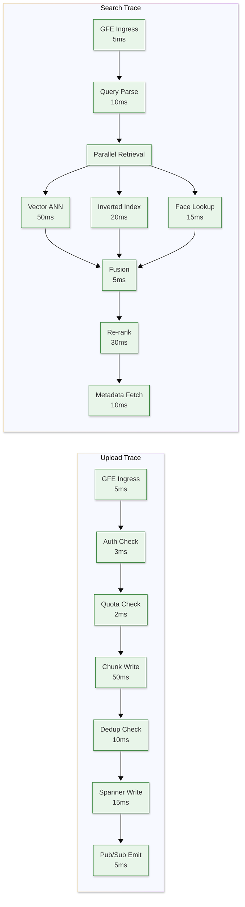

# Google Photos — Observability

## Metrics (USE / RED)

### USE Metrics (Infrastructure)

| Resource | Utilization | Saturation | Errors |
|----------|-------------|------------|--------|
| **Upload Workers** | CPU%, Memory% per pod | Queue depth, pending uploads | Upload failures, timeouts |
| **ML TPU Pods** | TPU utilization %, memory | Inference queue depth | Model inference errors |
| **Spanner** | CPU%, Storage% | Query queue depth, lock contention | Transaction aborts, deadline exceeded |
| **Colossus** | Disk utilization, IOPS | Write queue depth | Chunk write failures, read errors |
| **Memcache** | Hit rate, memory% | Eviction rate | Connection errors |
| **CDN Edge** | Bandwidth%, cache fill | Request queue, connection pool | 5xx from origin, cache miss storm |
| **Pub/Sub** | Throughput (msg/s) | Unacked message count, oldest unacked age | Dead letter queue depth |

### RED Metrics (Services)

| Service | Rate | Errors | Duration |
|---------|------|--------|----------|
| **Upload Service** | Uploads/second, bytes/second | Failed uploads, hash mismatches | Upload latency (p50/p95/p99) |
| **Media Service** | Reads/second (GET media items) | 404s, auth failures | Response latency |
| **Search Service** | Queries/second | No-result searches, timeouts | Search latency (p50/p95/p99) |
| **Thumbnail Service** | Thumbnails served/second | 404s (missing thumbnails) | TTFB (time to first byte) |
| **Face Clustering** | Faces clustered/minute | Clustering failures | Time-to-cluster (upload → searchable) |
| **ML Pipeline** | Inferences/second | Model errors, OOM | Processing latency per photo |
| **Sync Service** | Sync requests/second | Sync failures, conflicts | Sync convergence time |
| **Sharing Service** | Share events/second | Permission errors | Share creation latency |

### Business Metrics

| Metric | Description | Alert Threshold |
|--------|-------------|-----------------|
| Upload success rate | % of initiated uploads that complete | <99% → page |
| Time-to-searchable | Upload → photo appears in search | p99 > 30 min → warn |
| Face cluster accuracy | User correction rate | >5% manual corrections → investigate |
| Storage growth rate | TB/day added | >2x normal → capacity planning |
| Memories engagement | % of users interacting with Memories | Tracked for product health |
| Search zero-results rate | % of searches returning no results | >10% → improve models |
| DAU/MAU ratio | Daily engagement health | <40% → product concern |

---

## Key Dashboards

### Dashboard 1: Upload Health

```
┌─────────────────────────────────────────────────────────────┐
│ UPLOAD HEALTH                                    [Live] [1h]│
├──────────────────────────────┬──────────────────────────────┤
│ Upload Rate (QPS)            │ Upload Success Rate          │
│ ╭──────────────────────╮     │ ╭──────────────────────╮     │
│ │ ████████████████     │     │ │▬▬▬▬▬▬▬▬▬▬▬▬ 99.95% │     │
│ │ ██████████           │     │ │ ────────── Target    │     │
│ │ ████████████████████ │     │ │ 99.90%               │     │
│ ╰──────────────────────╯     │ ╰──────────────────────╯     │
│ Current: 22,450 QPS          │ Current: 99.97%              │
│ Peak: 58,200 QPS             │ SLO: 99.95%                  │
├──────────────────────────────┼──────────────────────────────┤
│ Upload Latency (p99)         │ Chunk Retry Rate             │
│ ╭──────────────────────╮     │ ╭──────────────────────╮     │
│ │ ──────────── 400ms   │     │ │ ████ 2.1%            │     │
│ │ ──── Target 500ms    │     │ │ Normal: <5%          │     │
│ ╰──────────────────────╯     │ ╰──────────────────────╯     │
├──────────────────────────────┼──────────────────────────────┤
│ Uploads by Region            │ Upload Errors by Type        │
│ APAC: ██████████ 42%         │ Timeout:  ██ 0.02%           │
│ EUR:  ██████ 24%             │ Hash Err: █ 0.005%           │
│ AMER: ██████ 25%             │ Quota:    ███ 0.03%          │
│ ROW:  ██ 9%                  │ Server:   █ 0.002%           │
└──────────────────────────────┴──────────────────────────────┘
```

### Dashboard 2: ML Pipeline Health

```
┌─────────────────────────────────────────────────────────────┐
│ ML PIPELINE HEALTH                               [Live] [1h]│
├──────────────────────────────┬──────────────────────────────┤
│ ML Queue Depth               │ Processing Latency (p95)     │
│ ╭──────────────────────╮     │ ╭──────────────────────╮     │
│ │ ████ 12,450          │     │ │ Classification: 45ms │     │
│ │ Target: <50K         │     │ │ Face Detect:    120ms│     │
│ ╰──────────────────────╯     │ │ Face Embed:     80ms │     │
│                              │ │ OCR:            150ms│     │
│ TPU Utilization              │ │ Scene:          90ms │     │
│ ╭──────────────────────╮     │ │ Embedding:      60ms │     │
│ │ ██████████████ 68%   │     │ ╰──────────────────────╯     │
│ │ Scale-up at 80%      │     │                              │
│ ╰──────────────────────╯     │ Total: ~545ms/photo          │
├──────────────────────────────┼──────────────────────────────┤
│ Time-to-Searchable (p99)     │ Face Clustering Lag          │
│ ╭──────────────────────╮     │ ╭──────────────────────╮     │
│ │ ███████ 4.2 min      │     │ │ ████ 2.1 min         │     │
│ │ SLO: <10 min         │     │ │ SLO: <10 min         │     │
│ ╰──────────────────────╯     │ ╰──────────────────────╯     │
└──────────────────────────────┴──────────────────────────────┘
```

### Dashboard 3: Search Performance

```
┌─────────────────────────────────────────────────────────────┐
│ SEARCH PERFORMANCE                               [Live] [1h]│
├──────────────────────────────┬──────────────────────────────┤
│ Search QPS                   │ Search Latency Distribution  │
│ ╭──────────────────────╮     │ p50:  ████████ 120ms         │
│ │ ████████████ 6,200   │     │ p95:  ██████████████ 310ms   │
│ │ Peak: 15,800         │     │ p99:  ███████████████ 650ms  │
│ ╰──────────────────────╯     │ SLO:  ─────────────── 800ms  │
├──────────────────────────────┼──────────────────────────────┤
│ Zero-Result Rate             │ Search by Signal Type        │
│ ╭──────────────────────╮     │ Visual:    ████████ 45%      │
│ │ ██ 3.2%              │     │ People:    ██████ 30%        │
│ │ Target: <5%          │     │ Temporal:  ███ 15%           │
│ ╰──────────────────────╯     │ Location:  ██ 10%            │
├──────────────────────────────┼──────────────────────────────┤
│ Vector Index Hit Rate        │ Cache Hit Rate               │
│ ╭──────────────────────╮     │ ╭──────────────────────╮     │
│ │ ██████████████ 94%   │     │ │ ████████████ 72%     │     │
│ │ (queries with results)│     │ │ (search result cache) │     │
│ ╰──────────────────────╯     │ ╰──────────────────────╯     │
└──────────────────────────────┴──────────────────────────────┘
```

---

## Logging

### What to Log

| Component | Log Events | Sensitivity |
|-----------|-----------|-------------|
| **Upload Service** | Upload init, chunk ACKs, finalize, dedup hits | Medium (contains file metadata) |
| **Media Service** | CRUD operations, permission checks | Medium |
| **Search Service** | Query text, result count, latency breakdown | High (user intent) — anonymize after 7 days |
| **ML Pipeline** | Model ID, inference latency, label counts | Low |
| **Face Clustering** | Cluster events, merge/split decisions | Medium (biometric context) |
| **Sharing Service** | Share create/revoke, permission changes | Medium |
| **Auth Service** | Login attempts, MFA challenges, token refresh | High |
| **Content Safety** | Detection events, quarantine actions | Critical |

### Log Levels Strategy

| Level | Usage | Example |
|-------|-------|---------|
| **ERROR** | Operation failed; requires attention | Upload finalization failed — hash mismatch |
| **WARN** | Degraded operation; auto-recovered | ML model timeout — retrying with backup model |
| **INFO** | Normal operations; audit trail | Media item created: {mediaId}, size: {bytes} |
| **DEBUG** | Detailed diagnostics (sampled) | Face embedding distance: 0.42, cluster: abc123 |

### Structured Logging Format

```
{
    "timestamp": "2026-03-08T10:15:30.123Z",
    "severity": "INFO",
    "service": "upload-service",
    "instance": "upload-svc-us-east-pod-42",
    "region": "us-east1",
    "trace_id": "4bf92f3577b34da6a3ce929d0e0e4736",
    "span_id": "00f067aa0ba902b7",
    "user_id_hash": "sha256:a1b2c3...",  // Pseudonymized
    "operation": "UPLOAD_FINALIZE",
    "media_id": "AJGf2...",
    "file_size_bytes": 4523890,
    "mime_type": "image/jpeg",
    "dedup_result": "NEW",
    "latency_ms": 234,
    "status": "SUCCESS",
    "labels": {
        "quality_tier": "STORAGE_SAVER",
        "upload_source": "ANDROID_BACKUP"
    }
}
```

### Log Retention

| Log Type | Hot Storage | Warm Storage | Cold Storage | Total |
|----------|-------------|-------------|-------------|-------|
| Error logs | 30 days | 90 days | 1 year | 1 year |
| Auth/security logs | 90 days | 1 year | 5 years | 5 years |
| Request logs | 7 days | 30 days | — | 30 days |
| Search query logs | 7 days (raw) | 30 days (anonymized) | — | 30 days |
| Content safety logs | Indefinite | — | — | Indefinite |
| Debug/trace logs | 24 hours | — | — | 24 hours |

---

## Distributed Tracing

### Trace Propagation Strategy

Google uses **Dapper-style tracing** (the system that inspired OpenTelemetry):

```
Trace Context Propagation:
  Client → GFE → API Gateway → Service → DB/Cache/ML

Headers:
  X-Cloud-Trace-Context: {traceId}/{spanId};o={options}

Each service:
  1. Extracts trace context from incoming request
  2. Creates child span with parent = incoming spanId
  3. Propagates context to outgoing calls
  4. Reports span to trace collector (async, sampled)
```

### Key Spans to Instrument



### Sampling Strategy

| Traffic Type | Sample Rate | Rationale |
|-------------|-------------|-----------|
| Normal requests | 0.1% (1 in 1000) | Sufficient for trend analysis |
| Error requests | 100% | Always trace failures |
| High-latency (>p99) | 100% | Capture tail latency causes |
| Search queries | 1% | Higher sampling for search optimization |
| ML pipeline | 0.01% | Very high volume; sample sparingly |
| New deployments (first 30 min) | 10% | Higher visibility during rollout |

---

## Alerting

### Critical Alerts (Page-Worthy)

| Alert | Condition | Window | Action |
|-------|-----------|--------|--------|
| **Upload SLO Breach** | Success rate < 99.5% | 5 min | Page on-call SRE |
| **Data Loss Detection** | Any blob-metadata mismatch | Immediate | Page storage team + SRE |
| **Spanner Unavailable** | >1% transactions failing | 2 min | Page database on-call |
| **CSAM Detection** | Content safety match | Immediate | Auto-quarantine + page trust & safety |
| **Auth System Down** | >5% auth failures | 3 min | Page identity team |
| **Multi-Zone Failure** | 2+ zones unhealthy | 1 min | Page regional SRE lead |
| **CDN Origin Error Spike** | >2% 5xx from origin | 5 min | Page CDN + media serving team |

### Warning Alerts

| Alert | Condition | Window | Action |
|-------|-----------|--------|--------|
| **ML Pipeline Lag** | Time-to-searchable p99 > 15 min | 10 min | Notify ML platform team |
| **Face Clustering Delay** | Queue depth > 100K | 30 min | Notify ML team; consider scaling |
| **Storage Growth Spike** | >2x normal daily growth | 24 hours | Notify capacity planning |
| **Search Latency Elevated** | p95 > 500ms | 5 min | Notify search team |
| **Thumbnail Miss Rate** | Cache miss > 30% | 10 min | Investigate CDN config |
| **Sync Convergence Slow** | p95 > 5 min | 15 min | Notify sync team |
| **Upload Retry Rate High** | >10% chunks retried | 10 min | Investigate network issues |

### Runbook References

| Alert | Runbook | Key Steps |
|-------|---------|-----------|
| Upload SLO Breach | `runbook/upload-slo-breach.md` | 1. Check error types 2. Check Spanner health 3. Check Colossus capacity 4. Check upload service pods |
| ML Pipeline Lag | `runbook/ml-pipeline-lag.md` | 1. Check TPU utilization 2. Check queue depth 3. Scale workers 4. Enable priority-only mode |
| Data Loss Detection | `runbook/data-loss.md` | 1. IMMEDIATE: Halt writes to affected region 2. Verify replication status 3. Initiate recovery from replica 4. Post-incident review |
| Search Latency | `runbook/search-latency.md` | 1. Check vector index health 2. Check Memcache hit rates 3. Check for hot users 4. Enable degraded search mode |

---

## Health Check Architecture

```
Health Check Hierarchy:
├── L1: Liveness (is the process running?)
│   ├── HTTP GET /healthz → 200 OK
│   └── Failure: Restart pod
│
├── L2: Readiness (can it serve traffic?)
│   ├── HTTP GET /readyz → 200 OK
│   ├── Checks: DB connection, cache connection, model loaded
│   └── Failure: Remove from load balancer
│
├── L3: Deep Health (is it healthy?)
│   ├── HTTP GET /healthz/deep → 200 OK + details
│   ├── Checks: Query latency, error rate, dependency health
│   └── Failure: Alert on-call
│
└── L4: Synthetic Probes (is the user experience good?)
    ├── Synthetic uploads from probe accounts every 60s
    ├── Synthetic searches from probe accounts every 30s
    ├── Synthetic photo views from probe accounts every 30s
    └── Failure: Indicates user-facing degradation
```
