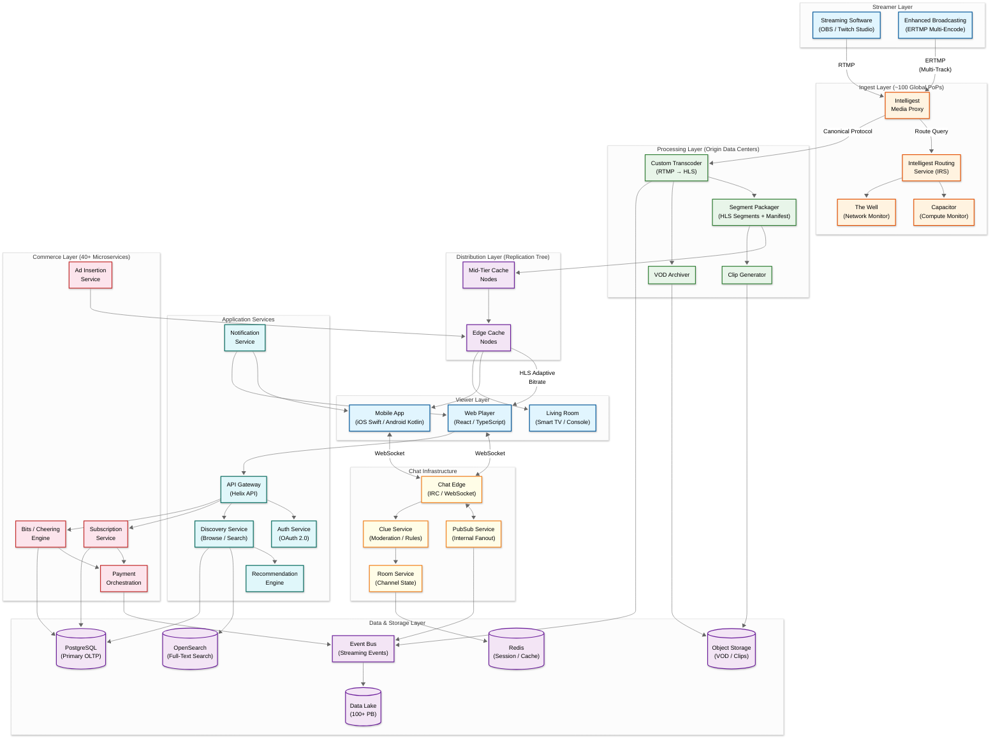
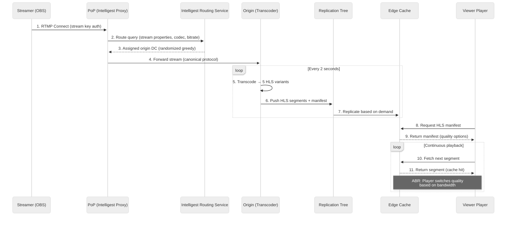
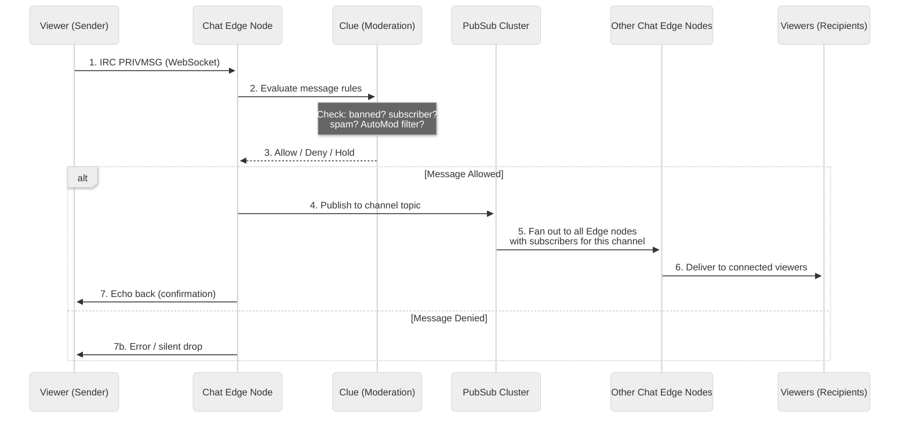
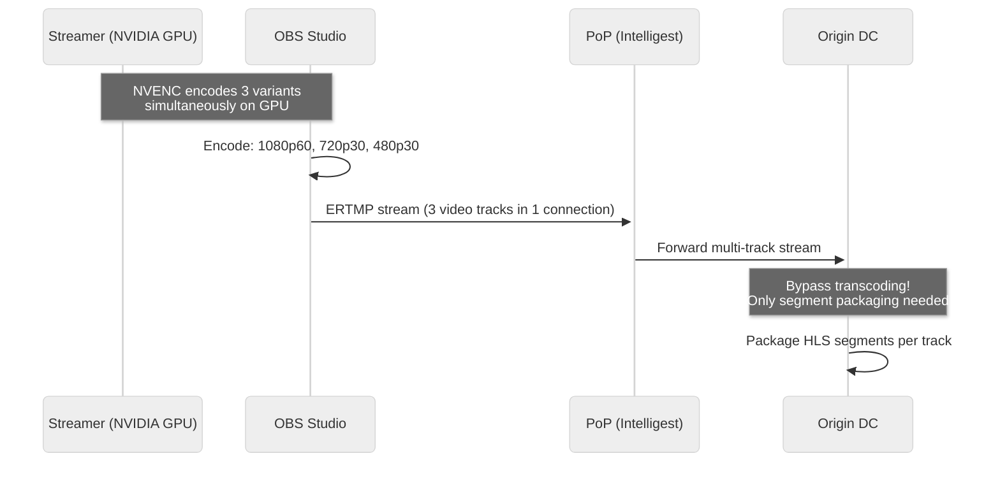

# High-Level Design

## 1. System Architecture Diagram



---

## 2. Data Flow

### 2.1 Live Video — Write Path (Streamer → Viewer)



### 2.2 Chat — Message Flow



### 2.3 Enhanced Broadcasting — Multi-Encode Path



---

## 3. Key Architectural Decisions

### 3.1 Architecture Pattern Checklist

| Decision | Choice | Justification |
|----------|--------|---------------|
| **Sync vs Async** | Async (video pipeline), Sync (API) | Video is a continuous pipeline; user-facing APIs need immediate response |
| **Event-driven vs Request-response** | Event-driven (video, chat, commerce events) | Decouples producers/consumers; enables analytics pipeline |
| **Push vs Pull** | Push (chat), Pull (HLS segments) | Chat needs real-time push; HLS is client-pull by design |
| **Stateless vs Stateful** | Stateful (chat edges, ingest proxies), Stateless (API services) | Chat and ingest require persistent connections; API services scale horizontally |
| **Read-heavy vs Write-heavy** | Read-heavy (25:1 viewer:streamer) | CDN caching is critical; edge nodes serve cached segments |
| **Real-time vs Batch** | Real-time (video, chat), Batch (analytics, VOD processing) | Core experience is live; analytics can be delayed |
| **Edge vs Origin** | Edge-heavy (CDN), Origin for transcoding | Segments cached at edge; compute-intensive transcoding stays at origin |

### 3.2 Microservices vs Monolith

**Choice: Microservices** (evolved from Ruby on Rails monolith)

Twitch's original Rails monolith became untenable as the platform scaled. The migration to microservices was driven by:

1. **Independent scaling** — Chat, video, and commerce have vastly different scaling profiles
2. **Technology diversity** — Go for chat (concurrency), custom C/C++ for transcoder, TypeScript for frontend
3. **Team autonomy** — 8 engineering organizations with independent deployment cycles
4. **Fault isolation** — Chat outage shouldn't affect video delivery

### 3.3 Database Choices (Polyglot Persistence)

| Database | Use Case | Justification |
|----------|----------|---------------|
| **PostgreSQL** (~94% of DB hosts) | User profiles, subscriptions, channel metadata, payments | ACID compliance, mature ecosystem, strong consistency |
| **Redis** | Chat room state, session cache, hot segment cache, rate limiting | Sub-millisecond reads, pub/sub support, TTL for ephemeral data |
| **OpenSearch** | Stream/channel search, content discovery | Full-text search with ML-based ranking |
| **Object Storage** | VODs, clips, thumbnails, emotes | Cost-effective for large binary blobs; 11-nines durability |
| **Time-Series Store** | Video quality metrics, viewer analytics | Efficient for append-only time-stamped data |
| **Data Lake (Redshift + S3)** | Historical analytics, ML training | 100+ PB of data; columnar for OLAP workloads |

### 3.4 Caching Strategy

```
┌─────────────────────────────────────────────┐
│ L1: In-Process Cache (per service instance) │
│  - Stream metadata, user sessions           │
│  - TTL: 10-30 seconds                       │
├─────────────────────────────────────────────┤
│ L2: Distributed Cache (Redis Cluster)       │
│  - Chat room state, subscriber lists        │
│  - Viewer counts, emote metadata            │
│  - TTL: 1-5 minutes                         │
├─────────────────────────────────────────────┤
│ L3: Edge Cache (Replication Tree Nodes)     │
│  - HLS segments (2-second segments)         │
│  - Manifest files (very short TTL)          │
│  - TTL: segment duration (~2s for live)     │
├─────────────────────────────────────────────┤
│ L4: Client-Side Cache (Player Buffer)       │
│  - Pre-fetched segments (2-6 seconds ahead) │
│  - Adaptive bitrate history                 │
└─────────────────────────────────────────────┘
```

### 3.5 Message Queue / Event Bus Usage

| Queue/Topic | Producer | Consumer | Pattern |
|-------------|----------|----------|---------|
| `stream.go-live` | Ingest Service | Notification, Discovery, Analytics | Fan-out |
| `stream.offline` | Ingest Service | VOD Archiver, Cleanup | Fan-out |
| `chat.message` | Chat Edge | Analytics, Moderation ML | Streaming |
| `commerce.purchase` | Payment Service | Fulfillment, Ledger, Analytics | Exactly-once |
| `commerce.subscription` | Sub Service | Entitlement, Notification | Exactly-once |
| `video.segment` | Transcoder | Replication Tree, Clip Service | Streaming |
| `user.action` | All Services | Data Lake (3M events/s) | Streaming |

---

## 4. Technology Stack Summary

| Layer | Technology | Notes |
|-------|-----------|-------|
| **Frontend (Web)** | TypeScript, React (Twilight) | ~80 pages, ~140 monthly contributors |
| **Frontend (Mobile)** | Swift (iOS), Kotlin (Android) | Custom native UI libraries |
| **Frontend (TV)** | Starshot Platform | Samsung, LG, Nintendo Switch |
| **Backend Services** | Go (primary) | Migrated from Ruby; chosen for concurrency |
| **Video Transcoder** | Custom C/C++ | Purpose-built, not FFmpeg |
| **API** | REST (Helix API) | 25K+ third-party apps |
| **Chat Protocol** | IRC over WebSocket | Backward-compatible with IRC clients |
| **Event Streaming** | Event Bus (Kafka-like) | 3M events/second to data lake |
| **Primary Database** | PostgreSQL | ~125 DB hosts, 300K+ TPS on largest cluster |
| **Search** | OpenSearch | ML-based ranking since 2019 rebuild |
| **Caching** | Redis | Session, state, hot data |
| **Object Storage** | Cloud Object Storage | VODs, clips, assets |
| **Data Warehouse** | Redshift + S3 | 100+ self-serve clusters |
| **Infrastructure** | Cloud-hosted | 2,000+ cloud accounts |
