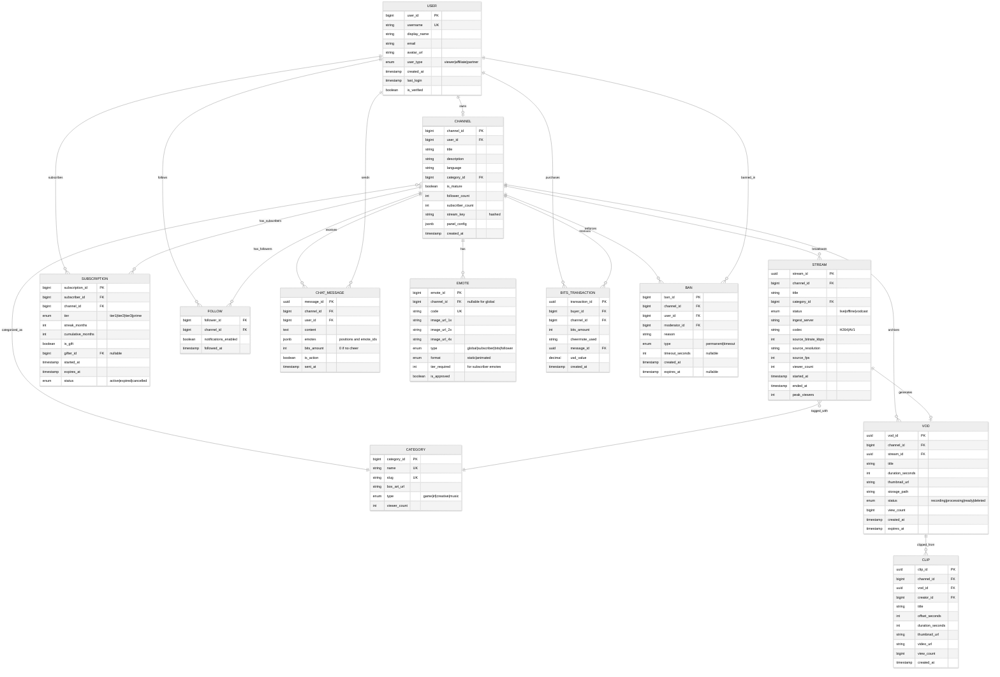

# Low-Level Design

## 1. Data Model

### 1.1 Entity-Relationship Diagram



### 1.2 Indexing Strategy

| Table | Index | Type | Purpose |
|-------|-------|------|---------|
| `stream` | `(status, viewer_count DESC)` | B-tree | Browse page: sort live streams by viewers |
| `stream` | `(channel_id, started_at DESC)` | B-tree | Channel's stream history |
| `stream` | `(category_id, status, viewer_count DESC)` | B-tree | Category page: live streams in a game |
| `subscription` | `(subscriber_id, channel_id, status)` | B-tree unique | Check if user is subscribed |
| `subscription` | `(channel_id, status, tier)` | B-tree | Channel's subscriber list |
| `follow` | `(follower_id, channel_id)` | B-tree unique (PK) | Check follow status |
| `follow` | `(channel_id, followed_at DESC)` | B-tree | Channel's follower list |
| `chat_message` | `(channel_id, sent_at DESC)` | B-tree | Recent messages (partitioned by time) |
| `vod` | `(channel_id, created_at DESC)` | B-tree | Channel's VOD library |
| `clip` | `(channel_id, view_count DESC)` | B-tree | Popular clips for a channel |
| `category` | `(name)` | GIN trigram | Fuzzy search on category names |
| `channel` | `(username)` | GIN trigram | Fuzzy search on channel names |

### 1.3 Partitioning / Sharding Strategy

| Table | Strategy | Key | Rationale |
|-------|----------|-----|-----------|
| `chat_message` | Time-based partitioning | `sent_at` (monthly) | High write volume; old messages rarely accessed; easy TTL |
| `stream` | Range partitioning | `started_at` (quarterly) | Historical streams rarely queried; archival-friendly |
| `subscription` | Hash sharding | `channel_id` | Even distribution; queries mostly channel-scoped |
| `bits_transaction` | Time-based partitioning | `created_at` (monthly) | Financial audit trail; recent data queried most |
| `follow` | Hash sharding | `channel_id` | Follower lists are channel-scoped |
| `vod` | Hash sharding | `channel_id` | VODs accessed per-channel |

### 1.4 Data Retention Policy

| Data Type | Retention | Notes |
|-----------|-----------|-------|
| Live stream metadata | Indefinite | Lightweight, useful for analytics |
| Chat messages | 14 days (hot), 90 days (cold) | Compliance hold extends retention |
| VODs (non-highlight) | 14 days (Affiliates), 60 days (Partners) | Configurable per partner agreement |
| Highlights | Indefinite | Creator-selected permanent clips |
| Clips | Indefinite | Community-created |
| Subscription records | 7 years | Financial/tax compliance |
| Bits transactions | 7 years | Financial/tax compliance |
| User accounts | Until deletion request + 30 day grace | GDPR/CCPA compliance |

---

## 2. API Design

### 2.1 REST API (Helix API)

#### Stream Management

```
# Start streaming (done via RTMP, not API — stream key auth)
# The API provides stream metadata management

GET /helix/streams
  Query: game_id, user_id, user_login, language, first, after
  Response: {
    data: [{
      id: "stream_id",
      user_id: "12345",
      user_login: "ninja",
      game_id: "33214",
      type: "live",
      title: "Playing Fortnite!",
      viewer_count: 45232,
      started_at: "2026-03-08T12:00:00Z",
      language: "en",
      thumbnail_url: "https://...",
      tag_ids: ["tag1", "tag2"],
      is_mature: false
    }],
    pagination: { cursor: "eyJiI..." }
  }
  Rate Limit: 800 req/min

PATCH /helix/channels
  Headers: Authorization: Bearer {oauth_token}
  Body: {
    game_id: "33214",
    title: "New stream title",
    broadcaster_language: "en",
    tags: ["English", "FPS"]
  }
  Rate Limit: 800 req/min
```

#### Subscription Management

```
GET /helix/subscriptions
  Query: broadcaster_id, user_id, first, after
  Headers: Authorization: Bearer {broadcaster_token}
  Response: {
    data: [{
      broadcaster_id: "12345",
      broadcaster_login: "streamer",
      user_id: "67890",
      user_login: "viewer",
      tier: "1000",   // 1000=Tier1, 2000=Tier2, 3000=Tier3
      is_gift: false,
      gifter_id: null
    }],
    total: 15420,
    points: 16890,
    pagination: { cursor: "..." }
  }

POST /helix/subscriptions/user
  // Check if specific user is subscribed
  Query: broadcaster_id, user_id
  Response: {
    data: [{
      broadcaster_id: "12345",
      tier: "1000",
      is_gift: false
    }]
  }
```

#### Chat

```
POST /helix/chat/messages
  Headers: Authorization: Bearer {user_token}
  Body: {
    broadcaster_id: "12345",
    sender_id: "67890",
    message: "Hello World!"
  }
  Response: {
    data: [{
      message_id: "uuid",
      is_sent: true
    }]
  }

DELETE /helix/moderation/chat
  // Delete specific message
  Query: broadcaster_id, moderator_id, message_id
  Rate Limit: 800 req/min

POST /helix/moderation/bans
  Body: {
    broadcaster_id: "12345",
    moderator_id: "67890",
    data: {
      user_id: "11111",
      reason: "Spam",
      duration: 600  // seconds, omit for permanent
    }
  }
```

#### Clips

```
POST /helix/clips
  Headers: Authorization: Bearer {user_token}
  Body: { broadcaster_id: "12345" }
  Response: {
    data: [{
      id: "clip_id",
      edit_url: "https://clips.twitch.tv/edit/..."
    }]
  }
  // Clip is created from the last 60 seconds of the stream

GET /helix/clips
  Query: broadcaster_id, game_id, id, first, started_at, ended_at
  Response: {
    data: [{
      id: "clip_id",
      url: "https://clips.twitch.tv/...",
      broadcaster_id: "12345",
      creator_id: "67890",
      video_id: "vod_id",
      game_id: "33214",
      title: "Amazing play!",
      view_count: 12503,
      created_at: "2026-03-08T14:30:00Z",
      thumbnail_url: "https://...",
      duration: 30.0,
      vod_offset: 3600
    }]
  }
```

### 2.2 EventSub (Webhooks / WebSocket)

```
# Subscribe to events via WebSocket or Webhooks
POST /helix/eventsub/subscriptions
  Body: {
    type: "stream.online",
    version: "1",
    condition: { broadcaster_user_id: "12345" },
    transport: {
      method: "websocket",  // or "webhook"
      session_id: "ws_session_id"
    }
  }

# Event types:
# stream.online / stream.offline
# channel.subscribe / channel.subscription.gift
# channel.cheer (Bits)
# channel.raid
# channel.follow
# channel.ban / channel.unban
# channel.update (title/category change)
```

### 2.3 IRC Chat Protocol

```
# Connection (WebSocket)
ws://irc-ws.chat.twitch.tv:80

# Authentication
PASS oauth:{access_token}
NICK {username}

# Join Channel
JOIN #{channel_name}

# Send Message
PRIVMSG #{channel_name} :Hello, World!

# Receive Message
:{user}!{user}@{user}.tmi.twitch.tv PRIVMSG #{channel} :message text

# Tags (extended metadata)
@badge-info=subscriber/24;badges=subscriber/24;color=#FF0000;
display-name=User;emotes=;id=msg-uuid;mod=0;subscriber=1;
tmi-sent-ts=1709913600000;user-id=12345
PRIVMSG #{channel} :message with metadata

# Moderation
/ban {username} {reason}
/timeout {username} {duration} {reason}
/clear
```

### 2.4 Idempotency Handling

| Operation | Strategy | Key |
|-----------|----------|-----|
| Subscription purchase | Idempotency key in header | `Idempotency-Key: {client_uuid}` |
| Bits purchase | Transaction ID | `transaction_id` deduplicated server-side |
| Clip creation | Rate limit + dedup | 1 clip per user per channel per 60s |
| Chat message | Message ID assignment | Server assigns UUID; client retries ignored |
| Follow/Unfollow | Upsert semantics | `(follower_id, channel_id)` unique constraint |

### 2.5 Rate Limiting

| Endpoint Category | Limit | Window |
|-------------------|-------|--------|
| General API (authenticated) | 800 requests | per minute |
| General API (unauthenticated) | 30 requests | per minute |
| Chat messages (per user) | 20 messages | per 30 seconds |
| Chat messages (moderator) | 100 messages | per 30 seconds |
| Clip creation | 1 clip | per 60 seconds per channel |
| EventSub subscriptions | 10,000 | total per application |
| Whispers (DMs) | 3 per second | per user, 100 per minute |

### 2.6 API Versioning

- Current: Helix API (v6+) — RESTful
- Deprecated: Kraken API (v5) — Fully retired
- Strategy: URL path versioning is not used; `version` field in EventSub subscriptions
- Breaking changes communicated via deprecation timeline (minimum 12 months)

---

## 3. Core Algorithms

### 3.1 Intelligest Routing Algorithm

The IRS uses a **randomized greedy algorithm** to route ingest streams from PoPs to origin data centers, balancing compute and network capacity.

```
FUNCTION route_stream(stream_properties, pop_location):
    // Step 1: Get candidate origins
    candidates = get_origins_with_capacity(stream_properties.codec,
                                           stream_properties.resolution)

    // Step 2: Score each candidate
    FOR EACH origin IN candidates:
        compute_score = capacitor.get_available_compute(origin)
        network_score = well.get_bandwidth_available(pop_location, origin)
        latency_score = get_network_latency(pop_location, origin)

        // Weighted scoring
        origin.score = (w1 * compute_score) +
                       (w2 * network_score) -
                       (w3 * latency_score)

    // Step 3: Randomized selection (avoid herding)
    top_k = SELECT_TOP_K(candidates, k=3)
    selected = WEIGHTED_RANDOM_CHOICE(top_k, weights=top_k.scores)

    // Step 4: Reserve capacity
    capacitor.reserve(selected, stream_properties.estimated_compute)
    well.reserve(pop_location, selected, stream_properties.estimated_bandwidth)

    RETURN selected.origin_address

// Time Complexity: O(N) where N = number of origin DCs (~10-20)
// Space Complexity: O(N) for candidate scoring
```

### 3.2 Adaptive Bitrate (ABR) Selection — Client-Side

```
FUNCTION select_quality(available_variants, network_conditions):
    // Measure recent throughput
    recent_throughput = moving_average(
        last_5_segment_download_speeds
    )

    // Buffer health check
    buffer_level = player.get_buffer_seconds()

    FOR EACH variant IN available_variants SORTED BY bitrate DESC:
        // Safety margin: only select if throughput > 1.5x bitrate
        IF recent_throughput > (variant.bitrate * 1.5):
            IF buffer_level > MINIMUM_BUFFER (2 seconds):
                RETURN variant
            ELSE:
                // Low buffer: be more conservative
                IF recent_throughput > (variant.bitrate * 2.0):
                    RETURN variant

    // Fallback: lowest quality
    RETURN available_variants.lowest_bitrate()

// Variants typically: 1080p60 (6Mbps), 720p60 (4.5Mbps),
//   720p30 (2.5Mbps), 480p30 (1.5Mbps), 160p30 (0.4Mbps)
```

### 3.3 Chat Message Fanout Algorithm

```
FUNCTION handle_chat_message(message, channel_id):
    // Step 1: Moderation pipeline
    user = get_user(message.sender_id)
    channel = get_channel(channel_id)

    // Check bans
    IF is_banned(user, channel):
        RETURN DENIED("User is banned")

    // Rate limit check
    IF NOT rate_limiter.allow(user.id, channel_id):
        RETURN DENIED("Rate limited")

    // Content moderation (Clue service)
    moderation_result = clue.evaluate(message, user, channel)
    IF moderation_result == BLOCKED:
        RETURN DENIED("Message blocked by AutoMod")
    IF moderation_result == HELD:
        queue_for_moderator_review(message)
        RETURN HELD("Message held for review")

    // Step 2: Enrich message
    message.badges = compute_badges(user, channel)
    message.emotes = resolve_emotes(message.content, user, channel)
    message.bits_info = parse_cheermotes(message.content)
    message.id = generate_uuid()
    message.timestamp = now()

    // Step 3: Hierarchical fanout
    // Edge node publishes to PubSub cluster
    pubsub.publish(
        topic = "chat.channel." + channel_id,
        payload = serialize(message)
    )

    // PubSub fans out to all Edge nodes with active viewers
    // Each Edge node then delivers to its connected clients
    // Total fanout = N_viewers (but distributed across Edge nodes)

    RETURN SENT(message.id)

// Time Complexity: O(1) for publish; O(N/E) for delivery per Edge
//   where N = viewers, E = Edge nodes
// Space Complexity: O(1) per message at PubSub level
```

### 3.4 Stream Discovery Ranking

```
FUNCTION rank_streams(category_id, user_context):
    // Step 1: Retrieve candidate streams
    candidates = query_live_streams(
        category_id = category_id,
        status = "live",
        ORDER BY viewer_count DESC,
        LIMIT 1000
    )

    // Step 2: ML-based personalization scoring
    FOR EACH stream IN candidates:
        // Feature vector
        features = {
            viewer_count_log: log10(stream.viewer_count),
            language_match: (stream.language == user.preferred_language),
            followed: user.follows(stream.channel_id),
            similar_to_watched: cosine_similarity(
                stream.category_embedding,
                user.watch_history_embedding
            ),
            stream_duration_hours: hours_since(stream.started_at),
            is_partner: stream.channel.is_partner,
            chat_activity_rate: stream.messages_per_minute / stream.viewer_count
        }

        stream.relevance_score = ml_ranker.predict(features)

    // Step 3: Blend popularity with relevance
    FOR EACH stream IN candidates:
        stream.final_score = (0.4 * normalize(stream.viewer_count)) +
                             (0.6 * stream.relevance_score)

    // Step 4: Diversify results (avoid all same-language/same-type)
    result = diversity_rerank(candidates, max_same_language=0.7)

    RETURN result[:100]  // Top 100 for initial page load

// Time Complexity: O(N log N) for sorting, O(N * F) for ML scoring
// Space Complexity: O(N) for candidate list
```

### 3.5 HLS Segment Generation Pipeline

```
FUNCTION transcode_stream(rtmp_input):
    // Quality ladder definition
    variants = [
        {resolution: "1920x1080", fps: 60, bitrate: 6000, profile: "high"},
        {resolution: "1280x720",  fps: 60, bitrate: 4500, profile: "main"},
        {resolution: "1280x720",  fps: 30, bitrate: 2500, profile: "main"},
        {resolution: "852x480",   fps: 30, bitrate: 1500, profile: "main"},
        {resolution: "284x160",   fps: 30, bitrate: 400,  profile: "baseline"}
    ]

    // Shared decoder (unlike FFmpeg which decodes per variant)
    decoded_frames = decoder.decode(rtmp_input)

    // IDR-aligned encoding across all variants
    segment_boundary = align_idr_frames(decoded_frames, SEGMENT_DURATION=2s)

    FOR EACH variant IN variants:
        scaled_frames = scaler.resize(decoded_frames, variant.resolution)

        IF variant.fps < source_fps:
            // Intelligent frame dropping (not naive 1-in-N)
            scaled_frames = frame_rate_convert(scaled_frames,
                                                source_fps, variant.fps)

        encoded = encoder.encode(scaled_frames, variant)

        // Inject Twitch-specific metadata
        encoded = inject_metadata(encoded, {
            stream_id: rtmp_input.stream_id,
            variant_id: variant.id,
            timestamp: now(),
            twitch_specific: get_custom_metadata()
        })

        // Package as HLS segment
        segment = package_hls_segment(encoded, segment_boundary)
        manifest = update_manifest(variant, segment)

        // Push to Replication Tree
        publish_segment(segment, manifest)

// Optimizations vs FFmpeg:
// 1. Single shared decoder (not N decoders)
// 2. IDR frame alignment across variants (critical for ABR switching)
// 3. Intelligent frame rate conversion (not naive frame dropping)
// 4. Custom metadata injection for Twitch player features
```
