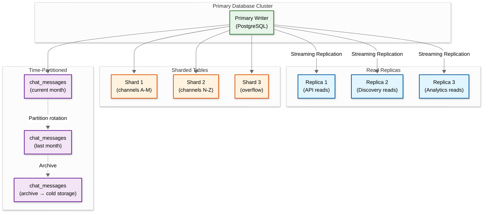
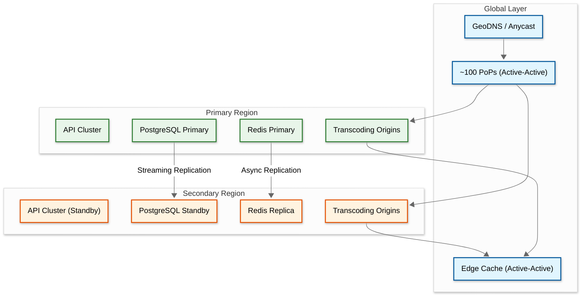
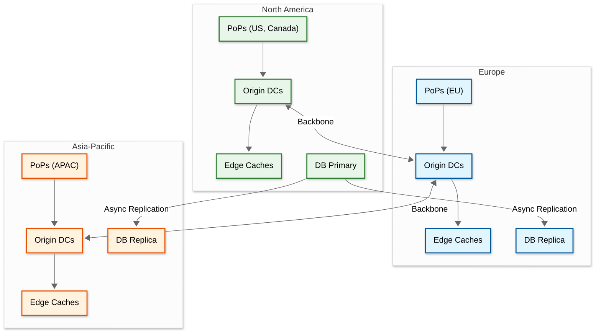

# Scalability & Reliability

## 1. Scalability

### 1.1 Horizontal vs Vertical Scaling Decisions

| Component | Strategy | Rationale |
|-----------|----------|-----------|
| **Chat Edge Nodes** | Horizontal | Each node handles ~50K connections; add nodes linearly with viewer count |
| **PubSub Cluster** | Horizontal | Shard by channel hash; add nodes as channel count grows |
| **API Gateway** | Horizontal | Stateless; scale behind load balancer |
| **Transcoding** | Horizontal + Vertical | Horizontal (more origin servers) + Vertical (ASIC hardware for 10x density) |
| **PostgreSQL** | Vertical first, then horizontal | Vertical for OLTP (300K+ TPS on single cluster); shard when limits hit |
| **Redis** | Horizontal (cluster mode) | Shard by key prefix (channel_id, user_id) |
| **Ingest PoPs** | Horizontal (geographic) | Deploy new PoPs in underserved regions |

### 1.2 Auto-Scaling Triggers

| Component | Metric | Scale-Up Trigger | Scale-Down Trigger | Cooldown |
|-----------|--------|-----------------|-------------------|----------|
| Chat Edge | Active connections / node | > 40K connections | < 15K connections | 5 min |
| API Services | CPU utilization | > 65% for 3 min | < 30% for 10 min | 5 min |
| Transcoding | Queue depth | > 10 pending streams | < 2 pending streams | 10 min |
| Search (OpenSearch) | Query latency p99 | > 500ms for 2 min | < 100ms for 15 min | 10 min |
| Replication Tree | Cache miss rate | > 5% for 5 min | < 1% for 15 min | 5 min |

### 1.3 Database Scaling Strategy



**Key Decisions:**
- **PostgreSQL** is the primary OLTP database (~94% of 125+ DB hosts)
- Largest cluster handles 300K+ TPS
- Read replicas serve API and Discovery queries
- Chat messages are time-partitioned (monthly) for efficient retention and archival
- Subscriptions and follows are hash-sharded by `channel_id`

### 1.4 Caching Layers

| Layer | Technology | Hit Rate | Data | TTL |
|-------|-----------|----------|------|-----|
| **L1: In-Process** | Local memory | ~95% for hot keys | Stream metadata, user sessions | 10-30s |
| **L2: Distributed** | Redis Cluster | ~90% | Subscriber lists, viewer counts, emote data | 1-5 min |
| **L3: CDN Edge** | Replication Tree | ~85-95% | HLS segments, manifests, thumbnails | Segment duration (~2s) |
| **L4: Client** | Player buffer | N/A | Pre-fetched segments | 2-6s |

### 1.5 Hot Spot Mitigation

| Hot Spot | Problem | Solution |
|----------|---------|----------|
| **Mega-streamer ingest** | Single stream consuming disproportionate origin resources | Dedicated origin capacity; ASIC transcoding for top channels |
| **Trending category** | All browse traffic hits same category index | Cache category listings at API layer; stagger refresh |
| **Chat in viral channel** | Single channel PubSub topic overloaded | Shard PubSub topic by viewer segment; message sampling |
| **Go-live surge** | Popular streamer goes live → 500K simultaneous manifest requests | Pre-warm edge caches when stream starts; stagger viewer notification delivery |
| **Drops campaign** | Game drops event causes 5-10x traffic spike | Dedicated capacity reservation; CDN pre-positioning |

---

## 2. Reliability & Fault Tolerance

### 2.1 Single Points of Failure (SPOF) Identification

| Component | SPOF Risk | Mitigation |
|-----------|-----------|------------|
| Intelligest Routing Service | High — all routing decisions flow through IRS | Multi-AZ deployment; PoP fallback to cached routes |
| Transcoding Origin | Medium — stream assigned to single origin | IRS can re-route to alternate origin; stream restarts in <5s |
| PubSub Cluster | Medium — chat delivery depends on it | Cluster with replicas; channels redistributed on node failure |
| PostgreSQL Primary | High — single writer for transactional data | Synchronous standby; automatic failover (< 30s) |
| Payment Gateway | High — all financial transactions | Multi-provider (redundant payment processors); queue-based retry |
| DNS | High — all client resolution | Multiple DNS providers; anycast |

### 2.2 Redundancy Strategy



**Redundancy by Component:**

| Component | Redundancy Level | Strategy |
|-----------|-----------------|----------|
| PoPs | N+2 per region | Active-active; anycast DNS |
| Origin DCs | N+1 globally | Active-active; IRS distributes load |
| Chat Edge | N+1 per cluster | Rolling deployment; connection draining |
| Database | 1 primary + 3+ replicas | Synchronous standby for failover |
| Redis | Cluster mode (3 masters + 3 replicas) | Automatic slot redistribution |
| Event Bus | 3x replication factor | Partition reassignment on broker failure |

### 2.3 Failover Mechanisms

| Scenario | Detection | Failover Action | Recovery Time |
|----------|-----------|----------------|---------------|
| Origin DC failure | Capacitor health check fails (5s) | IRS stops routing to DC; in-flight streams re-routed | 5-10s (stream restart) |
| Chat Edge node crash | TCP keepalive timeout (30s) | Viewers auto-reconnect to different Edge | 3-5s (reconnect) |
| PostgreSQL primary failure | Streaming replication lag > threshold | Promote synchronous standby | < 30s |
| Redis node failure | Cluster PING timeout (3s) | Cluster redistributes hash slots | < 5s |
| Payment processor down | Health check failures | Switch to backup payment processor | < 2s (transparent) |
| DNS provider failure | Synthetic monitoring | Remove provider from NS delegation | 30-60s (TTL-dependent) |

### 2.4 Circuit Breaker Patterns

```
Chat Moderation (Clue) Circuit Breaker:
  CLOSED: Normal operation — all messages evaluated
    → If error rate > 50% over 10s window → OPEN

  OPEN: Clue is bypassed
    → Messages pass through with async moderation
    → Potentially harmful messages deleted retroactively
    → After 30 seconds → HALF-OPEN

  HALF-OPEN: Send 10% of messages to Clue
    → If success rate > 90% → CLOSED
    → If error rate > 50% → OPEN

Similar patterns for:
  - Payment processing (fallback to queue-based)
  - Recommendation engine (fallback to popularity-based)
  - Search service (fallback to cached results)
  - Notification service (fallback to best-effort delivery)
```

### 2.5 Retry Strategies

| Operation | Strategy | Max Retries | Backoff |
|-----------|----------|-------------|---------|
| HLS segment fetch (viewer) | Exponential backoff | 3 | 100ms, 500ms, 2s |
| Chat message send | Immediate retry once | 1 | 0ms (same Edge node) |
| Subscription purchase | Idempotent retry | 5 | 1s, 2s, 4s, 8s, 16s |
| Origin routing query | Retry with fallback | 2 | 500ms, then cached route |
| Event bus publish | Retry with DLQ | 5 | 100ms exponential, then dead-letter |
| VOD upload to object storage | Chunked retry | 10 per chunk | 1s exponential |

### 2.6 Graceful Degradation

| Degradation Level | Trigger | What's Affected | User Experience |
|-------------------|---------|----------------|-----------------|
| **Level 1: Cosmetic** | Search service slow | Discovery page | Cached results shown; slight staleness |
| **Level 2: Feature** | Recommendation engine down | Personalization | Fall back to popularity-based browse |
| **Level 3: Quality** | Transcoding capacity saturated | Stream quality | Reduce quality ladder (3 variants instead of 5) |
| **Level 4: Chat** | Chat infrastructure overloaded | Chat features | Slow mode enforced globally; message sampling |
| **Level 5: Video** | CDN capacity critical | Video delivery | Reduce bitrate caps; disable lowest-latency mode |
| **Level 6: Commerce** | Payment system issues | Purchases | Queue purchases for later processing; disable gift subs |

### 2.7 Bulkhead Pattern

```
Separate resource pools (bulkheads) for:

┌──────────────────────────────────────────────┐
│ Video Pipeline Bulkhead                       │
│  - Dedicated origin compute                  │
│  - Separate network paths                    │
│  - Independent scaling group                 │
├──────────────────────────────────────────────┤
│ Chat Bulkhead                                │
│  - Dedicated Edge node fleet                 │
│  - Separate PubSub cluster                   │
│  - Independent connection pools              │
├──────────────────────────────────────────────┤
│ Commerce Bulkhead                            │
│  - Isolated database cluster                 │
│  - Dedicated payment processing threads      │
│  - Separate rate limiting                    │
├──────────────────────────────────────────────┤
│ API Bulkhead                                 │
│  - Separate service fleet for 3rd-party API  │
│  - Independent rate limiting and quota        │
│  - Throttle without affecting core experience│
└──────────────────────────────────────────────┘

Key principle: A Bits purchase surge should never
affect video transcoding or chat delivery.
```

---

## 3. Disaster Recovery

### 3.1 Recovery Objectives

| Component | RTO (Recovery Time) | RPO (Recovery Point) | Strategy |
|-----------|--------------------|--------------------|----------|
| Live video delivery | 10 seconds | N/A (live) | Automatic origin failover via IRS |
| Chat service | 30 seconds | 0 (stateless messages) | Auto-reconnect to alternate Edge |
| User database | 5 minutes | < 1 second | Synchronous standby promotion |
| Payment ledger | 15 minutes | 0 (synchronous replication) | Cross-region standby |
| VOD storage | 4 hours | < 1 hour | Cross-region object replication |
| Analytics/Data Lake | 24 hours | < 6 hours | Batch re-processing from event log |

### 3.2 Backup Strategy

| Data | Method | Frequency | Retention | Location |
|------|--------|-----------|-----------|----------|
| PostgreSQL | WAL archiving + base backup | Continuous WAL + daily base | 30 days | Cross-region object storage |
| Redis | RDB snapshots + AOF | RDB every 6 hours; AOF continuous | 7 days | Cross-AZ |
| Event Bus | Log retention | Continuous (replicated) | 7 days | 3x replication |
| Object Storage (VODs) | Cross-region replication | Continuous | Per retention policy | Multi-region |
| Configuration | Git-based + secrets vault | On change | Indefinite | Multi-region |

### 3.3 Multi-Region Considerations



**Multi-Region Strategy:**
- **Video ingest**: Active-active across all regions (PoPs in ~100 locations)
- **Transcoding**: Active-active (IRS routes to nearest origin with capacity)
- **Video delivery**: Active-active (Replication Tree spans all regions)
- **Chat**: Active-active per region (Edge nodes regional; PubSub cross-region for shared channels)
- **Database**: Primary in NA; read replicas in EU/APAC; writes always routed to primary
- **Payments**: NA primary with synchronous standby; failover requires manual promotion for financial safety
