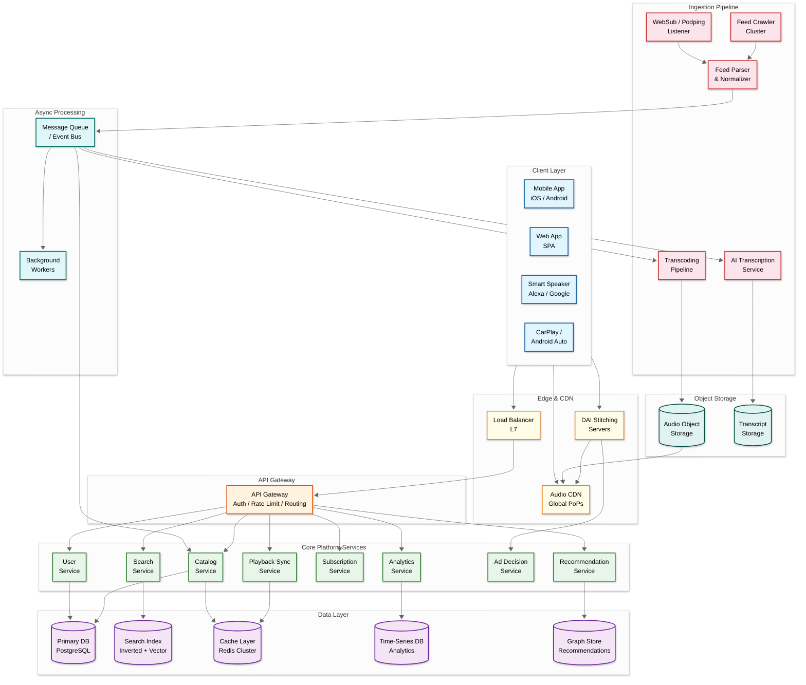
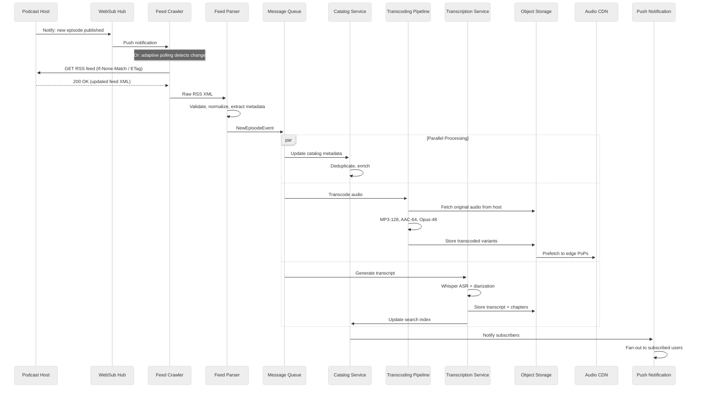
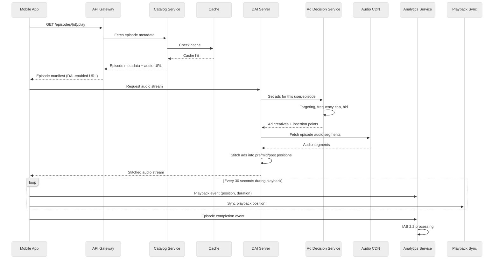
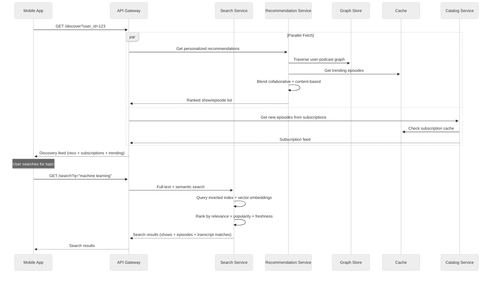

# 02 - High-Level Design

## System Architecture



---

## Data Flow: Key Paths

### Path 1: New Episode Published (Write Path)



### Path 2: Listener Streams Episode (Read Path)



### Path 3: Episode Discovery (Search + Recommendation)



---

## Key Architectural Decisions

### 1. Monolith vs Microservices

**Decision: Microservices** with domain-oriented ownership.

| Justification | Detail |
|--------------|--------|
| Independent scaling | Feed ingestion scales differently from streaming |
| Team autonomy | Separate teams for ingestion, streaming, ads, ML |
| Failure isolation | Feed crawler outage shouldn't affect playback |
| Technology diversity | Graph DB for reco, time-series for analytics, search index for discovery |

### 2. Synchronous vs Asynchronous Communication

| Communication | Pattern | Where |
|---------------|---------|-------|
| Synchronous (gRPC) | Request-response | Client → API Gateway → Services |
| Asynchronous (events) | Event-driven | Feed ingestion → transcoding → indexing |
| Hybrid | Request + async processing | Playback → sync event fire-and-forget |

**Decision:** Event-driven for the ingestion pipeline (RSS → parse → transcode → index). Synchronous gRPC for real-time client-facing APIs. Fire-and-forget for analytics events.

### 3. Database Choices (Polyglot Persistence)

| Data | Store | Justification |
|------|-------|---------------|
| Podcast/Episode catalog | PostgreSQL (sharded) | Relational integrity, complex queries |
| User profiles & subscriptions | PostgreSQL | Transactional consistency |
| Playback positions | Redis Cluster | Low-latency read/write, ephemeral |
| Search index | Search engine (inverted + vector) | Full-text + semantic search |
| Recommendations graph | Graph database | Traversal for collaborative filtering |
| Analytics events | Time-series DB + data warehouse | High-write throughput, aggregations |
| Audio files | Object storage | Durable, cheap, CDN-integrated |
| Transcripts | Object storage + search index | Large text, searchable |

### 4. Caching Strategy

```
┌─────────────┐    ┌──────────────┐    ┌──────────────┐    ┌──────────────┐
│  Client      │    │  CDN Edge    │    │  Redis       │    │  Database    │
│  Cache       │ →  │  Cache       │ →  │  Cache       │ →  │  (Origin)    │
│  (episodes)  │    │  (audio)     │    │  (metadata)  │    │              │
└─────────────┘    └──────────────┘    └──────────────┘    └──────────────┘
   L1: Device         L2: Edge           L3: App            L4: Persistent
   TTL: ∞ offline     TTL: 24h           TTL: 15 min        Source of truth
```

| Layer | What's Cached | TTL | Eviction |
|-------|---------------|-----|----------|
| L1 (Client) | Downloaded episodes, metadata | Until deleted | User-managed + auto-cleanup |
| L2 (CDN Edge) | Audio files, cover art | 24 hours | LRU per PoP |
| L3 (Redis) | Episode metadata, user subs, playback pos | 15 min (metadata), 24h (subs) | LRU |
| L4 (DB) | Full catalog, user data | Persistent | N/A |

### 5. Message Queue Usage

| Queue/Topic | Producer | Consumer | Purpose |
|-------------|----------|----------|---------|
| `feed.updated` | Feed Crawler | Feed Parser | Raw feed XML for parsing |
| `episode.new` | Feed Parser | Catalog, Transcoder, Transcription | Fan-out new episode processing |
| `episode.transcoded` | Transcoder | Catalog, CDN Prefetch | Audio ready for delivery |
| `playback.events` | Client SDK | Analytics Service | IAB 2.2 event processing |
| `ad.impressions` | DAI Server | Analytics, Billing | Ad delivery confirmation |
| `subscription.changed` | User Service | Notification, Feed Priority | Update feed polling priority |

### 6. RSS Ingestion: Poll vs Push

**Decision: Hybrid approach** — Push-first (WebSub/Podping) with adaptive polling fallback.

| Method | Coverage | Latency | Complexity |
|--------|----------|---------|------------|
| WebSub | ~30% of feeds | Real-time (seconds) | Medium (hub management) |
| Podping | ~15% of feeds (growing) | Near-real-time | Low (subscribe to bus) |
| Adaptive Polling | 100% of feeds | 2 min – 6 hours | High (scheduler) |

The adaptive polling interval is based on:
- **Update frequency** — Feeds that update daily get polled every 30 min; weekly feeds every 6 hours
- **Popularity** — Top 10K shows polled every 2-3 minutes
- **Last-Modified / ETag** — Skip full download if unchanged (HTTP 304)
- **WebSub registered** — Reduce polling for push-enabled feeds

---

## Architecture Pattern Checklist

- [x] **Sync vs Async:** Sync for client APIs, async for ingestion pipeline
- [x] **Event-driven vs Request-response:** Event-driven ingestion, request-response for streaming
- [x] **Push vs Pull:** Hybrid RSS ingestion (WebSub push + adaptive polling)
- [x] **Stateless vs Stateful:** All services stateless; state in Redis/DB
- [x] **Read-heavy optimization:** Multi-layer caching, CDN, read replicas
- [x] **Real-time vs Batch:** Real-time streaming + batch analytics aggregation
- [x] **Edge vs Origin:** Audio served from CDN edge; DAI at edge or regional PoPs

---

## Component Responsibilities

| Component | Responsibility | Scale Factor |
|-----------|---------------|--------------|
| **Feed Crawler** | Poll RSS feeds, detect changes, respect robots.txt | # of feeds × poll frequency |
| **Feed Parser** | Parse XML, normalize metadata, detect duplicates | # of feed updates/day |
| **Catalog Service** | Source of truth for shows/episodes, CRUD | # of episodes × read QPS |
| **Transcoding Pipeline** | Convert audio to multi-format (MP3, AAC, Opus) | # of new episodes/day |
| **Transcription Service** | Speech-to-text, chapter detection, keyword extraction | # of new episodes/day |
| **Search Service** | Inverted index + vector search for discovery | Search QPS |
| **Recommendation Service** | Graph-based collaborative + content-based filtering | DAU × page loads |
| **Playback Sync** | Cross-device position persistence | DAU × 3 syncs/session |
| **DAI Server** | Ad stitching into audio stream | Streaming QPS |
| **Ad Decision Service** | Targeting, bidding, frequency capping | Streaming QPS |
| **Analytics Service** | IAB 2.2 event processing, bot filtering | Events/day (500M+) |
| **Audio CDN** | Edge caching and delivery of audio files | Egress bandwidth |
