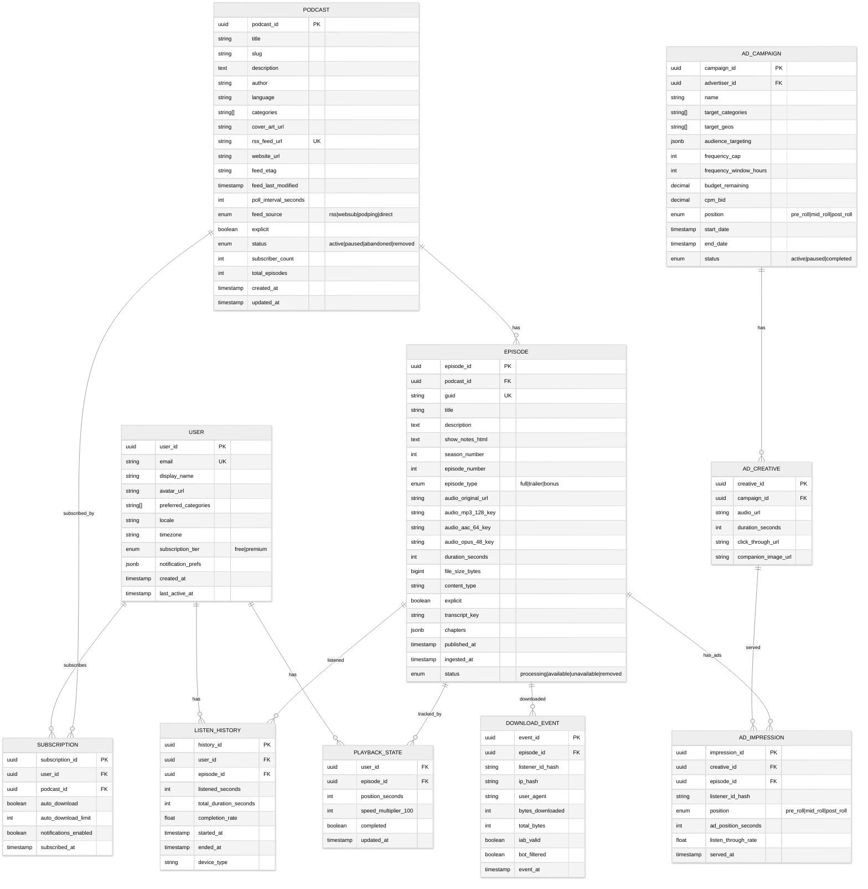
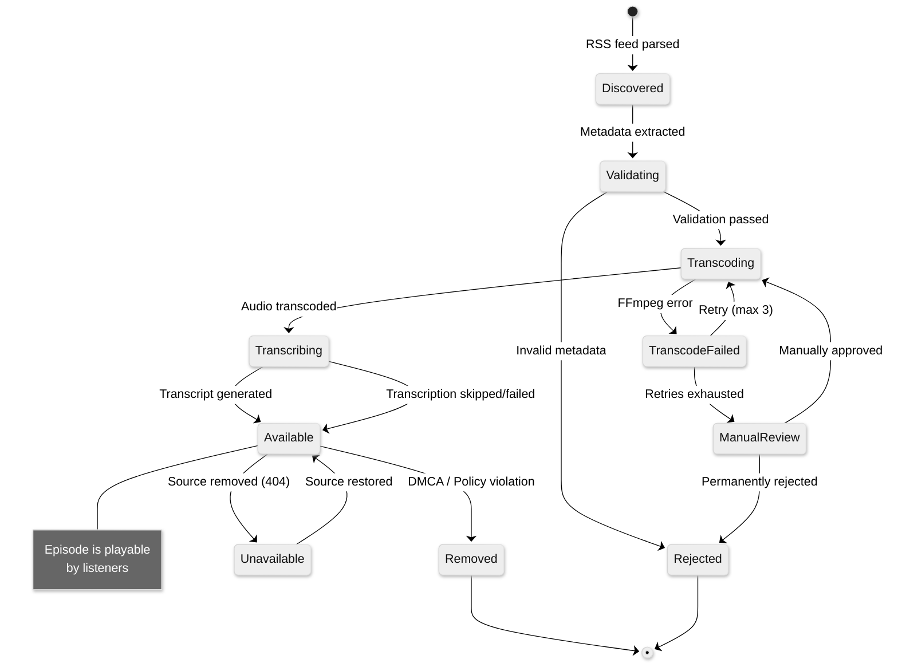
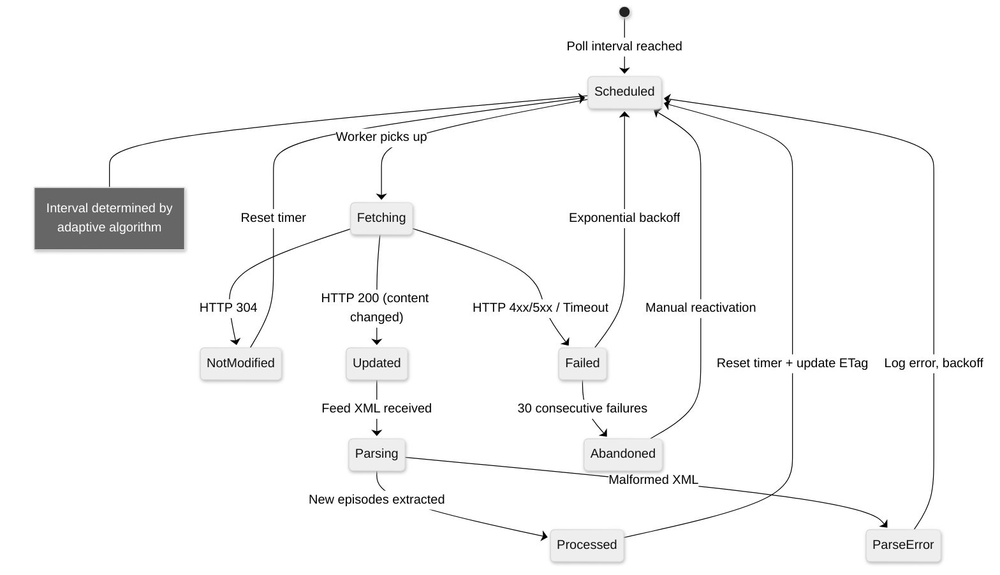

# 03 - Low-Level Design

## Data Model

### Entity-Relationship Diagram



### Indexing Strategy

| Table | Index | Type | Purpose |
|-------|-------|------|---------|
| `PODCAST` | `(rss_feed_url)` | Unique B-tree | Feed deduplication |
| `PODCAST` | `(status, poll_interval_seconds)` | B-tree | Crawler scheduling |
| `PODCAST` | `(subscriber_count DESC)` | B-tree | Popular shows |
| `PODCAST` | `(categories)` | GIN (array) | Category browsing |
| `EPISODE` | `(podcast_id, published_at DESC)` | B-tree | Latest episodes per show |
| `EPISODE` | `(guid)` | Unique B-tree | RSS dedup |
| `EPISODE` | `(status, published_at DESC)` | B-tree | New episode feed |
| `SUBSCRIPTION` | `(user_id, podcast_id)` | Unique B-tree | Subscription lookup |
| `SUBSCRIPTION` | `(podcast_id)` | B-tree | Subscriber count |
| `PLAYBACK_STATE` | `(user_id, episode_id)` | Primary composite | Position lookup |
| `LISTEN_HISTORY` | `(user_id, started_at DESC)` | B-tree | History feed |
| `DOWNLOAD_EVENT` | `(episode_id, event_at)` | B-tree, partitioned | IAB analytics |
| `DOWNLOAD_EVENT` | `(ip_hash, user_agent, event_at)` | B-tree | Bot/duplicate filtering |

### Partitioning / Sharding Strategy

| Table | Strategy | Key | Rationale |
|-------|----------|-----|-----------|
| `EPISODE` | Range partition by `published_at` (monthly) | Month | Hot data (recent episodes) accessed most |
| `DOWNLOAD_EVENT` | Range partition by `event_at` (daily) | Day | High write volume, time-range queries |
| `LISTEN_HISTORY` | Hash shard by `user_id` | User ID | Even distribution, user-scoped queries |
| `PLAYBACK_STATE` | Hash shard by `user_id` | User ID | Per-user lookup pattern |
| `AD_IMPRESSION` | Range partition by `served_at` (daily) | Day | Billing aggregation by time window |

### Data Retention Policy

| Data | Retention | Archive Strategy |
|------|-----------|-----------------|
| Audio files | Indefinite (while show active) | Tier to cold storage after 2 years no access |
| Episode metadata | Indefinite | N/A |
| Transcripts | Indefinite | Compressed in object storage |
| Playback state | 90 days after last update | Delete stale positions |
| Listen history | 2 years | Aggregate then purge |
| Download events | 90 days raw, 2 years aggregated | Roll up to hourly/daily aggregates |
| Ad impressions | 2 years | Required for billing reconciliation |

---

## API Design

### RESTful API (External-facing)

#### Episode Playback

```
GET /api/v1/episodes/{episode_id}
  → 200: Episode metadata + playback URL

GET /api/v1/episodes/{episode_id}/stream
  → 302: Redirect to DAI-enabled audio URL
  Headers: Range (byte-range for resume)
  Query: format=mp3|aac|opus, quality=high|medium|low

POST /api/v1/episodes/{episode_id}/playback
  Body: { position_seconds, speed, device_id }
  → 204: Playback position saved

GET /api/v1/episodes/{episode_id}/playback
  → 200: { position_seconds, speed, updated_at }

GET /api/v1/episodes/{episode_id}/transcript
  → 200: { segments: [{ start, end, text, speaker }], chapters: [...] }
```

#### Podcast & Subscription Management

```
GET /api/v1/podcasts/{podcast_id}
  → 200: Podcast details + recent episodes

GET /api/v1/podcasts/{podcast_id}/episodes?page=1&limit=20&sort=newest
  → 200: Paginated episode list

POST /api/v1/subscriptions
  Body: { podcast_id, auto_download: true, notify: true }
  → 201: Subscription created

DELETE /api/v1/subscriptions/{subscription_id}
  → 204: Unsubscribed

GET /api/v1/users/me/subscriptions?page=1&limit=50
  → 200: User's subscribed podcasts with latest episode info
```

#### Discovery & Search

```
GET /api/v1/search?q={query}&type=shows|episodes|transcripts&page=1&limit=20
  → 200: Search results with relevance scores

GET /api/v1/discover
  Query: section=for_you|trending|new_releases|categories
  → 200: Personalized discovery feed

GET /api/v1/categories
  → 200: List of podcast categories with counts

GET /api/v1/charts?category={cat}&region={geo}&period=daily|weekly
  → 200: Top charts
```

#### Creator APIs

```
POST /api/v1/creator/podcasts
  Body: { title, description, categories, cover_art (multipart) }
  → 201: Podcast created

POST /api/v1/creator/podcasts/{id}/episodes
  Body: { title, description, audio (multipart), season, episode_number }
  → 202: Episode accepted for processing

GET /api/v1/creator/podcasts/{id}/analytics
  Query: period=7d|30d|90d, metrics=downloads|listens|completion
  → 200: IAB 2.2 compliant analytics
```

### Internal gRPC APIs

```protobuf
service CatalogService {
  rpc GetEpisode(EpisodeRequest) returns (Episode);
  rpc ListEpisodes(ListEpisodesRequest) returns (EpisodeList);
  rpc UpsertEpisodeFromFeed(FeedEpisode) returns (Episode);
  rpc GetPodcastByFeedUrl(FeedUrlRequest) returns (Podcast);
}

service FeedIngestionService {
  rpc SchedulePoll(PollRequest) returns (PollResponse);
  rpc HandleWebSubNotification(WebSubEvent) returns (Ack);
  rpc HandlePodpingEvent(PodpingEvent) returns (Ack);
}

service AdDecisionService {
  rpc GetAds(AdRequest) returns (AdResponse);
  // AdRequest: { episode_id, listener_context, positions[] }
  // AdResponse: { ads: [{ creative_url, position, duration }] }
}

service PlaybackSyncService {
  rpc SavePosition(PositionUpdate) returns (Ack);
  rpc GetPosition(PositionRequest) returns (PlaybackState);
  rpc GetBatchPositions(BatchRequest) returns (BatchPlaybackState);
}

service AnalyticsService {
  rpc IngestEvent(PlaybackEvent) returns (Ack);
  // Fire-and-forget via async queue preferred
}
```

### Idempotency Handling

| Operation | Idempotency Key | Strategy |
|-----------|-----------------|----------|
| Episode ingestion | RSS `<guid>` per podcast | Deduplicate by guid + podcast_id |
| Playback position save | `user_id + episode_id` | Last-write-wins (upsert) |
| Subscription create | `user_id + podcast_id` | Unique constraint |
| Download event | `event_id` (UUID) | Client-generated UUID |
| Ad impression | `impression_id` | Server-generated UUID, deduplicated |

### Rate Limiting

| Endpoint | Limit | Window | Scope |
|----------|-------|--------|-------|
| Search | 30 req | 1 min | Per user |
| Stream | 100 req | 1 min | Per user |
| Playback sync | 60 req | 1 min | Per user |
| Creator upload | 10 req | 1 hour | Per creator |
| Discovery | 60 req | 1 min | Per user |
| Public API | 1000 req | 1 hour | Per API key |

### Versioning Strategy

URL-based versioning (`/api/v1/`, `/api/v2/`) for external APIs. Internal gRPC uses protobuf evolution with backward-compatible field additions.

---

## Core Algorithms

### 1. Adaptive Feed Polling Scheduler

```
FUNCTION CalculatePollInterval(podcast):
    base_interval = 3600  // 1 hour in seconds

    // Factor 1: Update frequency (exponential moving average)
    avg_hours_between_episodes = podcast.ema_update_interval
    IF avg_hours_between_episodes < 24:
        frequency_factor = 0.25   // Poll every 15 min for daily shows
    ELSE IF avg_hours_between_episodes < 168:  // weekly
        frequency_factor = 1.0    // Poll every hour
    ELSE:
        frequency_factor = 6.0    // Poll every 6 hours for infrequent

    // Factor 2: Popularity (subscriber count)
    IF podcast.subscriber_count > 100000:
        popularity_factor = 0.1   // Top shows: every 6 min
    ELSE IF podcast.subscriber_count > 10000:
        popularity_factor = 0.5
    ELSE IF podcast.subscriber_count > 1000:
        popularity_factor = 1.0
    ELSE:
        popularity_factor = 2.0   // Long tail: less frequent

    // Factor 3: Push-enabled (WebSub or Podping)
    IF podcast.has_websub OR podcast.has_podping:
        push_factor = 4.0   // Rely on push, poll less
    ELSE:
        push_factor = 1.0

    // Factor 4: Consecutive no-change polls (backoff)
    backoff = MIN(podcast.consecutive_no_change * 0.5, 5.0)

    interval = base_interval * frequency_factor * popularity_factor * push_factor
    interval = interval * (1 + backoff)
    interval = CLAMP(interval, 120, 86400)  // 2 min to 24 hours

    // Add jitter to prevent thundering herd
    jitter = RANDOM(0, interval * 0.1)
    RETURN interval + jitter

// Time complexity: O(1) per podcast
// Space complexity: O(1) — stored in podcast metadata
```

### 2. IAB 2.2 Download Deduplication

```
FUNCTION ProcessDownloadEvent(event):
    // Step 1: Bot filtering (user-agent classification)
    IF IsKnownBot(event.user_agent):
        event.iab_valid = false
        RETURN DiscardAsBot(event)

    // Step 2: Build dedup key
    // IAB 2.2: Same IP + User-Agent + Episode within 24 hours = 1 download
    dedup_key = HASH(event.ip_address + event.user_agent + event.episode_id)
    window_key = dedup_key + DATE(event.timestamp)

    IF EXISTS_IN_CACHE(window_key):
        existing = GET_FROM_CACHE(window_key)

        // Step 3: Byte-range accumulation
        // Only count if enough of the file was downloaded
        existing.bytes_received += event.bytes_downloaded
        UPDATE_CACHE(window_key, existing)

        IF existing.bytes_received >= episode.file_size_bytes * 0.01:
            // At least 1% downloaded — count as valid
            IF NOT existing.counted:
                existing.counted = true
                IncrementDownloadCount(event.episode_id)
        RETURN  // Deduplicated — don't double-count

    ELSE:
        // First request from this IP+UA+Episode today
        new_record = {
            bytes_received: event.bytes_downloaded,
            counted: false,
            first_seen: event.timestamp
        }
        SET_IN_CACHE(window_key, new_record, TTL=86400)

        IF event.bytes_downloaded >= episode.file_size_bytes * 0.01:
            new_record.counted = true
            IncrementDownloadCount(event.episode_id)

FUNCTION IsKnownBot(user_agent):
    // Match against IAB/ABC International Spiders & Bots list
    RETURN MATCHES_PATTERN(user_agent, BOT_PATTERNS) OR
           IS_DATACENTER_IP(ip) OR
           IS_KNOWN_PREFETCH_SERVICE(user_agent)

// Time: O(1) per event (hash lookup + cache ops)
// Space: O(unique_listeners_per_day × active_episodes)
```

### 3. Dynamic Ad Insertion Stitching

```
FUNCTION StitchAdsIntoEpisode(episode, listener_context):
    // Step 1: Determine insertion points
    insertion_points = GetInsertionPoints(episode)
    // Pre-roll: 0s, Mid-roll: marked in RSS or at chapter boundaries, Post-roll: end

    // Step 2: Request ads from Ad Decision Service
    ad_request = {
        episode_id: episode.id,
        podcast_categories: episode.podcast.categories,
        listener_geo: listener_context.geo,
        listener_demographics: listener_context.demographics,
        device_type: listener_context.device,
        positions: insertion_points,
        frequency_caps: GetFrequencyCaps(listener_context.id)
    }
    ads = AdDecisionService.GetAds(ad_request)

    // Step 3: Build stitched manifest
    manifest = []
    content_segments = SplitAtInsertionPoints(episode.audio_url, insertion_points)

    FOR i, segment IN content_segments:
        manifest.APPEND({
            type: "content",
            url: segment.url,
            byte_range: segment.range,
            duration: segment.duration
        })

        // Insert ads between segments
        IF i < LEN(insertion_points):
            position_ads = ads.ForPosition(insertion_points[i])
            FOR ad IN position_ads:
                manifest.APPEND({
                    type: "ad",
                    url: ad.creative_url,
                    duration: ad.duration,
                    tracking_urls: ad.impression_trackers,
                    click_through: ad.click_url
                })

    // Step 4: Return stitched response
    // Option A: Server-side audio concatenation (SSAI)
    // Option B: Client-side manifest with segment URLs (HLS-like)
    RETURN BuildStitchedStream(manifest)

// Time: O(n) where n = number of insertion points + ads
// Latency budget: < 100ms for ad decision, < 200ms for stitching
```

### 4. Episode Recommendation Scoring

```
FUNCTION ScoreRecommendations(user_id, candidate_episodes, limit):
    user = GetUserProfile(user_id)
    listen_history = GetRecentHistory(user_id, days=90)
    subscriptions = GetSubscriptions(user_id)

    scored_candidates = []

    FOR episode IN candidate_episodes:
        score = 0.0

        // Signal 1: Collaborative filtering (users like you listened)
        cf_score = CollaborativeFilteringScore(user_id, episode.podcast_id)
        score += cf_score * 0.30

        // Signal 2: Content similarity (topic/embedding distance)
        user_embedding = GetUserTopicEmbedding(user_id)
        episode_embedding = GetEpisodeEmbedding(episode.id)
        content_sim = CosineSimilarity(user_embedding, episode_embedding)
        score += content_sim * 0.25

        // Signal 3: Category affinity
        category_overlap = Overlap(user.preferred_categories, episode.categories)
        score += category_overlap * 0.15

        // Signal 4: Freshness decay
        hours_since_publish = HoursSince(episode.published_at)
        freshness = EXP(-hours_since_publish / 168)  // Half-life: 1 week
        score += freshness * 0.10

        // Signal 5: Popularity (normalized)
        popularity = LOG(episode.download_count + 1) / LOG(MAX_DOWNLOADS + 1)
        score += popularity * 0.10

        // Signal 6: Completion rate signal (quality proxy)
        avg_completion = episode.avg_completion_rate
        score += avg_completion * 0.10

        // Penalty: Already listened
        IF episode.id IN listen_history.episode_ids:
            score *= 0.1  // Heavily demote

        // Penalty: Same podcast over-representation (diversity)
        same_podcast_count = COUNT(scored_candidates WHERE podcast_id = episode.podcast_id)
        IF same_podcast_count >= 3:
            score *= 0.5

        scored_candidates.APPEND((episode, score))

    // Sort and return top-K with diversity interleaving
    RETURN DiversityInterleavedTopK(scored_candidates, limit)

// Time: O(n log k) with top-K heap
// Space: O(n) for candidate scoring
```

---

## State Diagrams

### Episode Processing State Machine



### Feed Crawler State Machine


