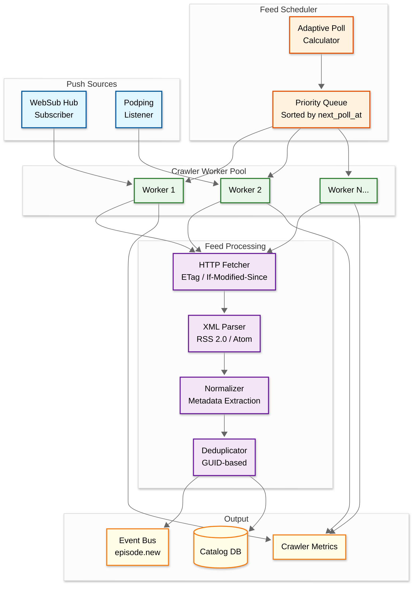
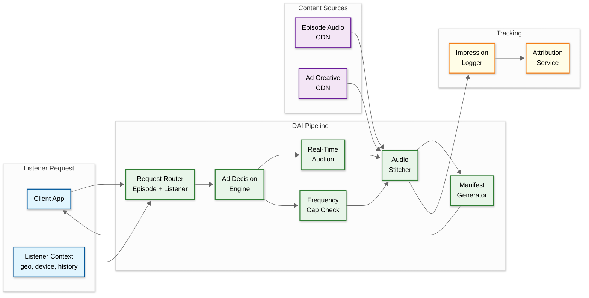
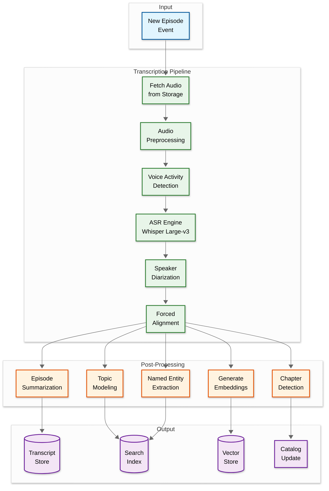

# 04 - Deep Dive & Bottlenecks

## Critical Component 1: RSS Feed Ingestion Engine

### Why This Is Critical

The feed ingestion engine is the foundation of a podcast platform — it's how content enters the system. With 4.5M+ active feeds to poll, the crawler must balance **freshness** (detecting new episodes within minutes) against **efficiency** (not overwhelming podcast hosts or wasting resources polling feeds that rarely change). A misconfigured crawler can miss new episodes for hours, DDoS small podcast hosts, or consume excessive bandwidth on unchanged feeds.

### How It Works Internally



#### Three-Tier Ingestion Strategy

| Tier | Feeds | Poll Interval | Push-Enabled | Examples |
|------|-------|---------------|--------------|----------|
| **Tier 1 (Hot)** | Top 10K shows | 2-5 min | Yes (WebSub/Podping) | Joe Rogan, Serial, This American Life |
| **Tier 2 (Warm)** | Top 100K shows | 15-60 min | Some | Mid-tier shows with regular schedules |
| **Tier 3 (Long Tail)** | 4.4M+ remaining | 2-24 hours | Rarely | Personal podcasts, inactive feeds |

#### Crawler Politeness

- **Respect `robots.txt`** — Check and cache robots.txt for each host
- **Per-host rate limiting** — Max 1 request per 5 seconds per domain
- **Conditional requests** — Always send `If-None-Match` (ETag) and `If-Modified-Since`
- **Connection pooling** — Reuse connections for hosts with many feeds
- **Backoff on errors** — Exponential backoff on 429, 5xx responses
- **DNS caching** — Cache DNS resolutions for 5 minutes to reduce lookup overhead

### Failure Modes & Handling

| Failure | Impact | Handling |
|---------|--------|----------|
| Feed returns 404/410 | Show appears to be gone | Mark as `gone` after 7 consecutive days; don't remove immediately (host hiccups) |
| Feed returns 5xx | Temporary host issue | Exponential backoff: 5 min → 15 min → 1 hour → 6 hours; max 30 retries |
| Malformed XML | Can't parse episodes | Log parse error, try lenient parser (handle common XML issues); skip feed if consistently broken |
| Feed URL redirect chain | Feed moved | Follow up to 5 redirects; permanently update stored URL on 301 |
| Feed XML bomb (DoS) | Memory exhaustion | Limit max feed size to 10MB; streaming XML parser with depth limits |
| Thundering herd | All feeds polled at once | Jitter in scheduling; consistent hashing assigns feeds to workers |
| Worker crash | Missed polls | Health checks; unprocessed feeds re-queued via dead-letter |

---

## Critical Component 2: Dynamic Ad Insertion (DAI) Pipeline

### Why This Is Critical

DAI is the primary monetization mechanism — 80%+ of top podcasts use it, and it drives ~$4.5B in annual ad revenue. The DAI server sits in the **critical playback path**: every stream request flows through it. Latency must be under 200ms, ad decisions must respect frequency caps, and the stitching must be seamless (no audio glitches at join points). Failure here means either lost revenue (no ads) or degraded user experience (playback delays, audio artifacts).

### How It Works Internally



#### DAI Approaches: SSAI vs CSAI

| Approach | How | Pros | Cons |
|----------|-----|------|------|
| **SSAI (Server-Side)** | Server stitches ads into audio stream before delivery | Ad-blocker resistant; seamless audio; simpler client | Higher server cost; server in critical path |
| **CSAI (Client-Side)** | Client receives manifest with separate ad URLs | Lower server cost; client has more control | Ad-blockable; can cause audio gaps; complex client |
| **Hybrid** | SSAI for pre-roll, CSAI for mid/post-roll | Balance of benefits | More complexity |

**Decision: SSAI (Server-Side)** — Ad blockers increasingly target CSAI; SSAI provides better user experience and ad delivery guarantees.

#### Audio Stitching Challenges

| Challenge | Solution |
|-----------|----------|
| **Loudness mismatch** | Normalize all ads to -16 LUFS (EBU R128 standard) before stitching |
| **Codec mismatch** | Pre-transcode ad creatives to all supported formats (MP3-128, AAC-64, Opus-48) |
| **Join artifacts** | Apply 50ms cross-fade at stitch points; ensure frame-aligned cuts |
| **Latency** | Pre-compute stitching manifests; cache ad decisions for 15 min per user+episode |
| **Byte-range resume** | Map stitched byte offsets back to original segments; maintain offset table |

### Failure Modes & Handling

| Failure | Impact | Handling |
|---------|--------|----------|
| Ad Decision timeout | No ads, lost revenue | Fall back to house ads or no ads; serve content immediately (never block playback) |
| Ad creative unavailable | Broken ad audio | Skip ad, serve next in queue; alert advertiser |
| Frequency cap service down | Over-serving ads | Fail-open with conservative cap from local cache |
| Stitcher crash | Playback failure | Fall back to direct CDN delivery (no ads) — availability > revenue |
| Impression tracking failure | Under-counted impressions | Buffer impressions locally, retry with at-least-once delivery |

---

## Critical Component 3: AI-Powered Transcription & Discovery Pipeline

### Why This Is Critical

Transcription transforms audio (opaque to search) into text (searchable, indexable, navigable). This powers episode-level search, auto-generated chapters, accessibility features, and SEO. With 50K new episodes/day, the transcription pipeline must process at scale while maintaining accuracy across languages, accents, and audio quality levels. The output directly feeds the recommendation engine and search index.

### How It Works Internally



#### Processing Budget

| Stage | Time per Episode (40 min audio) | GPU Required |
|-------|--------------------------------|--------------|
| Audio preprocessing | 10s | No |
| VAD (Voice Activity Detection) | 15s | Optional |
| ASR (Whisper Large-v3) | 2-4 min | Yes (GPU) |
| Speaker diarization | 30-60s | Yes (GPU) |
| Forced alignment | 15s | No |
| Chapter detection | 5s | No |
| Topic modeling | 10s | Optional |
| Embedding generation | 5s | Yes (GPU) |
| **Total** | **~5-6 min per episode** | |

At 50K episodes/day: Need ~175 GPU-hours/day of processing capacity.

#### Chapter Detection Algorithm

```
FUNCTION DetectChapters(transcript_segments):
    // Use topic shift detection on transcript
    chapters = []
    window_size = 60  // seconds
    min_chapter_length = 120  // 2 minutes minimum

    embeddings = []
    FOR segment IN transcript_segments:
        emb = GetSentenceEmbedding(segment.text)
        embeddings.APPEND((segment.start_time, emb))

    // Sliding window cosine similarity
    topic_shifts = []
    FOR i IN RANGE(window_size, LEN(embeddings) - window_size):
        left_emb = MEAN(embeddings[i-window_size:i])
        right_emb = MEAN(embeddings[i:i+window_size])
        similarity = CosineSimilarity(left_emb, right_emb)

        IF similarity < THRESHOLD(0.5):
            topic_shifts.APPEND(embeddings[i].start_time)

    // Merge nearby shifts and enforce minimum length
    FOR shift IN topic_shifts:
        IF LEN(chapters) == 0 OR shift - chapters[-1].start > min_chapter_length:
            chapter_text = SummarizeSegments(
                GetSegmentsBetween(shift, shift + 30)
            )
            chapters.APPEND({
                start: shift,
                title: GenerateChapterTitle(chapter_text)
            })

    RETURN chapters
```

### Failure Modes & Handling

| Failure | Impact | Handling |
|---------|--------|----------|
| GPU quota exhausted | Transcription backlog grows | Priority queue (popular episodes first); auto-scale GPU pool |
| ASR accuracy degradation | Bad transcripts | Quality scoring; reject transcripts below threshold; flag for review |
| Language detection wrong | Transcript in wrong language | Multi-model routing; language detection as pre-step |
| Very long episode (5+ hours) | Timeout / OOM | Chunk processing: split into 30-min segments, process independently, merge |
| Noisy audio (low quality) | Poor transcription | Preprocessing: noise reduction, normalization; lower confidence flag |

---

## Concurrency & Race Conditions

### Race Condition 1: Duplicate Episode Ingestion

**Scenario:** WebSub notification and polling both detect the same new episode simultaneously.

```
Timeline:
  T0: WebSub notification arrives → Worker A starts processing
  T1: Scheduled poll runs → Worker B fetches same feed
  T2: Worker A inserts episode (guid=abc-123)
  T3: Worker B tries to insert same episode (guid=abc-123) → CONFLICT
```

**Solution:** Optimistic concurrency with GUID-based deduplication.

```
// Use UPSERT with conflict on (podcast_id, guid)
INSERT INTO episodes (podcast_id, guid, title, ...)
VALUES ($1, $2, $3, ...)
ON CONFLICT (podcast_id, guid) DO UPDATE
SET updated_at = NOW()
WHERE episodes.updated_at < EXCLUDED.updated_at;
// Only update if the new version is newer
```

### Race Condition 2: Playback Position Sync

**Scenario:** User pauses on phone (pos=1200s), then immediately resumes on tablet (pos=1180s from stale cache).

```
Timeline:
  T0: Phone sends position=1200s
  T1: Tablet reads position (gets 1200s)
  T2: User seeks on tablet to 1180s
  T3: Tablet sends position=1180s (appears to go backward)
```

**Solution:** Last-write-wins with timestamp comparison.

```
// Client includes local timestamp
FUNCTION SavePlaybackPosition(user_id, episode_id, position, client_timestamp):
    current = GET_POSITION(user_id, episode_id)
    IF current IS NULL OR client_timestamp > current.timestamp:
        SET_POSITION(user_id, episode_id, position, client_timestamp)
    // Else: discard stale update
```

### Race Condition 3: Concurrent Ad Frequency Cap Updates

**Scenario:** User opens two episodes simultaneously; both request ads → frequency cap check races.

**Solution:** Atomic increment with Redis `INCR` + `EXPIRE`:

```
FUNCTION CheckAndIncrementFrequencyCap(listener_id, campaign_id, cap, window_hours):
    key = "freq:" + listener_id + ":" + campaign_id
    count = REDIS.INCR(key)
    IF count == 1:
        REDIS.EXPIRE(key, window_hours * 3600)
    IF count > cap:
        REDIS.DECR(key)  // Roll back
        RETURN false     // Cap exceeded
    RETURN true
```

---

## Bottleneck Analysis

### Bottleneck 1: Feed Crawler Throughput

**Problem:** Polling 4.5M feeds with variable intervals requires sustained ~520 req/s outbound HTTP, with bursts up to 2,000 req/s. DNS resolution, TCP connection setup, and SSL handshake add latency.

**Mitigation:**
- **Connection pooling** per host — reuse connections for hosts with multiple feeds
- **DNS cache** — cache resolutions for 5 minutes (most feeds don't change DNS frequently)
- **Distributed worker pool** — horizontally scale crawler workers across regions
- **Priority queue partitioning** — shard priority queue by hash(feed_url) to avoid contention
- **Conditional requests** — ETag/If-Modified-Since reduces 70-80% of bandwidth (feeds usually haven't changed)

### Bottleneck 2: DAI Stitching Latency

**Problem:** SSAI adds latency to every playback request. Ad decision (auction + frequency cap) + audio fetch + stitching must complete in < 200ms.

**Mitigation:**
- **Pre-compute ad manifests** — For popular episodes, pre-compute ad placements; cache for 15 minutes
- **Edge DAI servers** — Deploy stitching at CDN edge PoPs to minimize round-trip
- **Ad creative pre-caching** — Pre-fetch top ad creatives to stitching servers
- **Parallel ad fetch** — Fetch content segments and ad segments concurrently
- **Graceful fallback** — If ad decision exceeds 100ms, serve without ads (availability > monetization)

### Bottleneck 3: Search Index Update Latency

**Problem:** With 50K new episodes/day plus transcripts, the search index must ingest continuously without affecting query performance.

**Mitigation:**
- **Dual-index pattern** — Write to a staging index, then swap atomically (blue-green indexing)
- **Near-real-time indexing** — Buffer updates for 5 seconds, then batch flush to index
- **Separate read/write paths** — Read replicas for queries; write leader for ingestion
- **Tiered indexing** — Full index rebuild nightly; incremental updates during the day
- **Query routing** — Route complex transcript searches to dedicated search nodes
