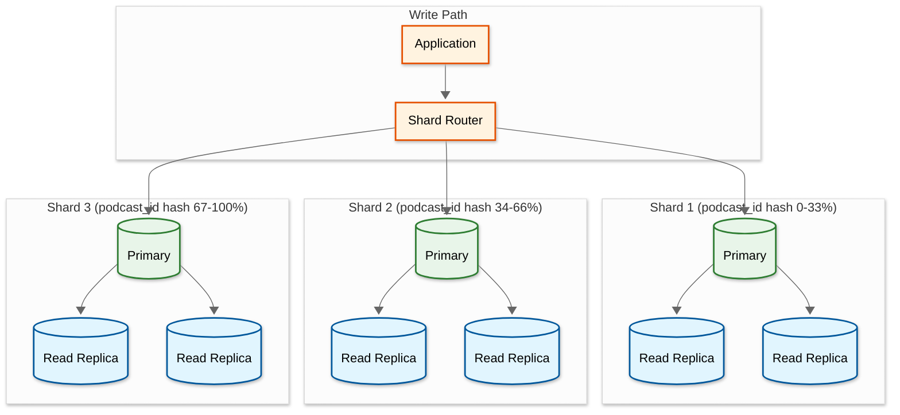
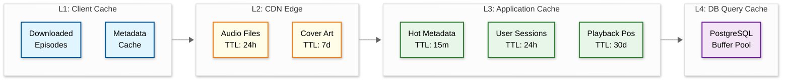
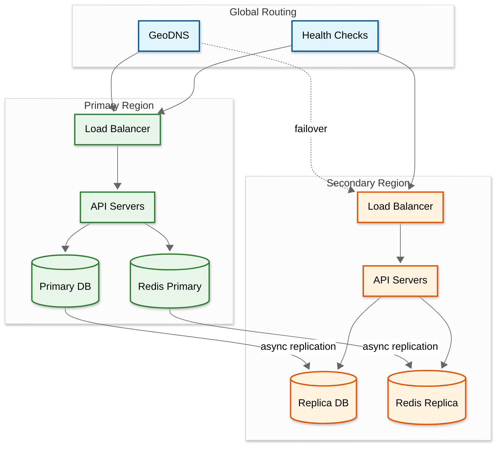

# 05 - Scalability & Reliability

## Scalability

### Horizontal vs Vertical Scaling

| Component | Scaling Type | Strategy |
|-----------|-------------|----------|
| Feed Crawler | Horizontal | Add workers; shard feeds by hash(feed_url) |
| API Gateway | Horizontal | Stateless; auto-scale behind LB |
| Catalog Service | Horizontal | Read replicas + cache; shard by podcast_id |
| Search Service | Horizontal | Index sharding + replicas per shard |
| Recommendation | Horizontal | Pre-compute scores; serve from cache |
| DAI Servers | Horizontal | Stateless stitching; deploy at edge PoPs |
| Transcription Pipeline | Horizontal | GPU worker pool; queue-based scaling |
| Playback Sync | Horizontal | Redis Cluster; shard by user_id |
| Analytics Ingestion | Horizontal | Partition by time; append-only writes |
| Audio CDN | Horizontal | Add PoPs; content pre-positioning |
| PostgreSQL | Vertical + Horizontal | Vertical for write leader; read replicas + sharding |

### Auto-Scaling Triggers

| Component | Scale-Up Trigger | Scale-Down Trigger | Min/Max |
|-----------|-----------------|-------------------|---------|
| API Servers | CPU > 60% or p99 latency > 500ms | CPU < 30% for 10 min | 10 / 200 |
| Feed Crawlers | Queue depth > 50K pending | Queue depth < 5K for 15 min | 5 / 100 |
| Transcription Workers | GPU queue wait > 10 min | Queue empty for 30 min | 2 / 50 |
| DAI Servers | CPU > 50% or p99 > 150ms | CPU < 25% for 10 min | 20 / 500 |
| Search Replicas | Query p99 > 800ms | Query p99 < 200ms for 30 min | 3 / 20 |

### Database Scaling Strategy

#### PostgreSQL (Catalog + Users)



**Sharding strategy:**
- **Podcast + Episode tables:** Shard by `hash(podcast_id)` — episodes always co-located with their podcast
- **User tables:** Shard by `hash(user_id)` — subscriptions, history co-located with user
- **Cross-shard queries** (e.g., "all subscribers of podcast X"): Scatter-gather or materialized view

#### Redis Cluster (Playback Sync + Cache)

- **6-node cluster** minimum (3 primaries + 3 replicas)
- Hash slots distributed across primaries
- Playback positions: `playback:{user_id}:{episode_id}` → hash tag on `{user_id}`
- Session cache: `session:{user_id}` → co-located with playback data

#### Analytics (Time-Series DB + Data Warehouse)

- **Hot path (0-7 days):** Time-series DB with hourly partitions
- **Warm path (7-90 days):** Columnar store with daily partitions
- **Cold path (90+ days):** Object storage in Parquet format
- **Roll-up schedule:** Raw events → hourly aggregates (after 7 days) → daily aggregates (after 90 days)

### Caching Layers



### Hot Spot Mitigation

| Hot Spot | Cause | Mitigation |
|----------|-------|------------|
| Viral episode launch | Millions stream same episode within hours | CDN pre-warming; replicate to all edge PoPs in advance |
| Top 100 podcasts | Disproportionate traffic | Dedicated cache partition; longer TTLs; origin shield |
| Morning commute spike | 3× traffic in 7-9 AM per timezone | Rolling auto-scale with timezone-aware prediction |
| New subscriber rush | Popular show promotion drives subscriptions | Rate-limit subscription writes; async processing |
| Feed crawler thundering herd | Many feeds have same poll interval | Jitter scheduling; shard by feed hash |

---

## Reliability & Fault Tolerance

### Single Points of Failure (SPOF) Identification

| Component | SPOF Risk | Mitigation |
|-----------|-----------|------------|
| Database primary | High | Multi-AZ deployment; automatic failover; WAL-based replication |
| Redis primary | Medium | Redis Cluster with replicas; automatic promotion |
| Feed scheduler | Medium | Active-passive with leader election; state in DB |
| DAI server | High (revenue) | Multiple instances per region; graceful fallback to ad-free |
| Search index | Medium | Replicated shards; fallback to basic metadata search |
| Message queue | High | Clustered deployment; persistent messaging; dead-letter queues |
| DNS | High | Multiple providers; failover DNS |

### Redundancy Strategy

| Layer | Strategy | RPO | RTO |
|-------|----------|-----|-----|
| Compute | Multi-AZ deployment, N+2 capacity | N/A | < 1 min (auto-scale) |
| Database | Synchronous replica in same region + async cross-region | 0 (in-region), < 5s (cross-region) | < 30s (in-region), < 5 min (cross-region) |
| Cache | Redis Cluster with replicas | Best-effort (cache is rebuildable) | < 10s (automatic promotion) |
| Object Storage | Cross-region replication (built-in) | < 15 min | < 1 min (automatic) |
| CDN | Multi-CDN with failover | N/A (cached content) | < 30s (DNS failover) |
| Message Queue | Clustered, persistent, replicated | 0 (synchronous replication) | < 30s |

### Failover Mechanisms



### Circuit Breaker Patterns

| Service | Circuit Breaker Config | Fallback |
|---------|----------------------|----------|
| Ad Decision Service | Open after 5 failures in 10s; half-open after 30s | Serve episode without ads |
| Recommendation Service | Open after 10 failures in 30s | Return trending/popular fallback list |
| Transcription Service | Open after 3 failures in 60s | Queue for later; episode available without transcript |
| Search Service | Open after 5 failures in 15s | Fall back to basic metadata search (DB query) |
| External RSS Feeds | Per-host: open after 3 consecutive failures | Use cached version of feed |
| Playback Sync | Open after 10 failures in 30s | Store locally on device; sync when service recovers |

### Retry Strategies

| Operation | Strategy | Max Retries | Backoff |
|-----------|----------|-------------|---------|
| Feed fetch (HTTP) | Exponential backoff with jitter | 5 | 5s, 15s, 60s, 300s, 1800s |
| Episode transcoding | Fixed retry | 3 | 60s between retries |
| Ad creative fetch | Immediate retry | 2 | No delay (latency-sensitive) |
| Analytics event ingest | Buffered retry | ∞ (persistent queue) | Batch retry every 30s |
| Playback position save | At-most-once (fire-and-forget) | 0 | Client retries on next heartbeat |
| Database write | Immediate retry on transient error | 3 | 100ms, 500ms, 2s |

### Graceful Degradation

| Scenario | Degraded Behavior | User Impact |
|----------|-------------------|-------------|
| Search service down | Disable search; show only browse/subscriptions | Users can't search but can play subscribed content |
| Recommendation engine down | Show trending + editorial picks | Less personalized discovery |
| Ad service down | Serve episodes ad-free | No interruption; revenue loss |
| Transcription pipeline down | Episodes available without transcript/chapters | No search by transcript content |
| Feed crawler backlog | Delayed new episode discovery | Subscribers notified late (minutes to hours) |
| Analytics pipeline lag | Dashboard data stale | Creators see delayed stats |
| Cross-region replication lag | Playback position slightly stale on second device | Minor UX issue (seconds behind) |

### Bulkhead Pattern

| Bulkhead | Isolation | Rationale |
|----------|-----------|-----------|
| Feed ingestion ↔ Streaming | Separate compute pools, separate DB connections | Crawler issues shouldn't affect playback |
| Free tier ↔ Premium tier | Separate API rate limits, priority queues | Premium users get guaranteed resources |
| Creator upload ↔ Listener APIs | Separate upload workers | Large upload burst shouldn't slow reads |
| Ad serving ↔ Content serving | Separate thread pools/containers | Ad service latency doesn't block content |
| Real-time APIs ↔ Analytics | Separate write paths | Analytics burst doesn't affect real-time |

---

## Disaster Recovery

### Recovery Objectives

| Metric | Target | Justification |
|--------|--------|---------------|
| RTO (streaming) | 5 minutes | Streaming is core function; failover to secondary region |
| RTO (creator dashboard) | 30 minutes | Not real-time critical |
| RTO (feed ingestion) | 1 hour | Feeds can catch up; RSS is eventually consistent |
| RPO (user data) | < 5 seconds | Synchronous replication within region |
| RPO (analytics) | < 5 minutes | Async replication; events buffered on client |
| RPO (audio content) | 0 | Cross-region object storage replication |

### Backup Strategy

| Data | Backup Method | Frequency | Retention |
|------|---------------|-----------|-----------|
| PostgreSQL | Continuous WAL archival + daily base backup | Continuous + daily | 30 days (daily), 1 year (weekly) |
| Redis | RDB snapshot + AOF | Hourly RDB, continuous AOF | 7 days |
| Search index | Configuration + rebuild from source | Daily snapshot | 7 days (rebuild from DB if needed) |
| Object storage | Cross-region replication (built-in) | Continuous | Indefinite |
| Message queue | Persistent + replicated | Continuous | 7 days retention |

### Multi-Region Architecture

| Region | Role | Services |
|--------|------|----------|
| US-East | Primary (US listeners) | Full stack + primary DB write |
| US-West | Secondary US | Full stack + read replica |
| EU-West | Primary (EU listeners, GDPR) | Full stack + EU data residency |
| AP-South | CDN PoP + read replica | Edge delivery + popular content cache |

### Failover Runbook

```
1. DETECT: Health check failures for > 60 seconds in primary region
2. CONFIRM: Automated alert → on-call engineer validates (avoid false positive)
3. PROMOTE: Promote read replica to primary in secondary region
4. REDIRECT: Update GeoDNS to route traffic to secondary
5. VERIFY: Confirm streaming, search, playback sync operational
6. BACKFILL: Once primary recovers, re-sync data; do NOT failback automatically
7. POSTMORTEM: Document incident; update runbook if needed
```
