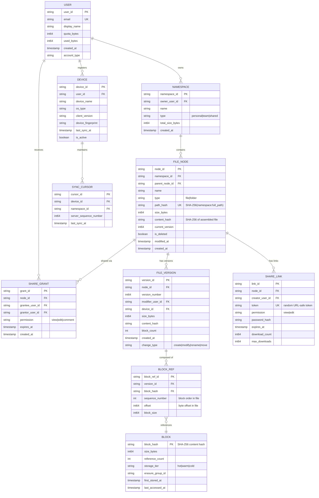
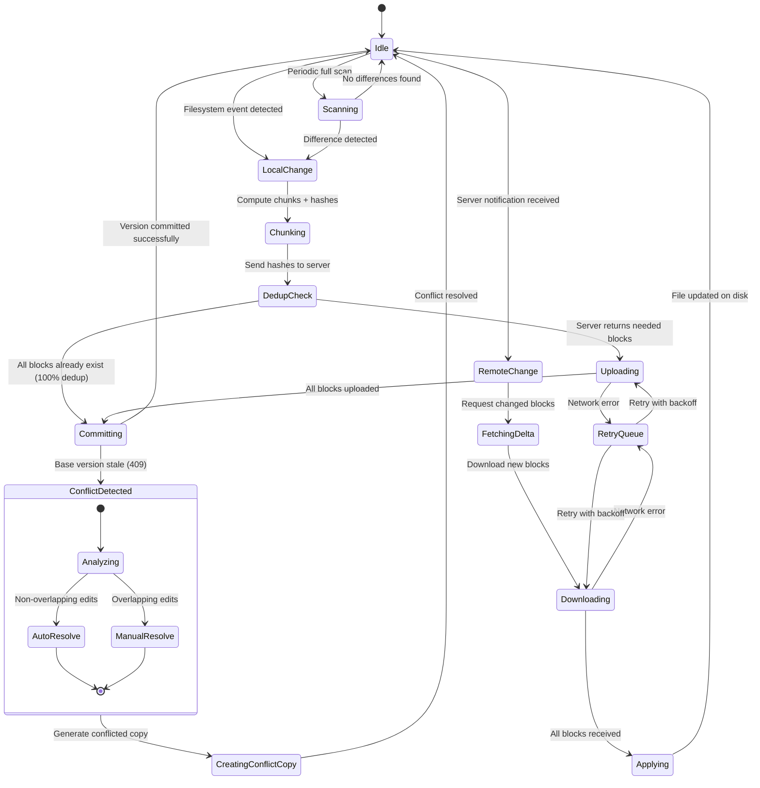
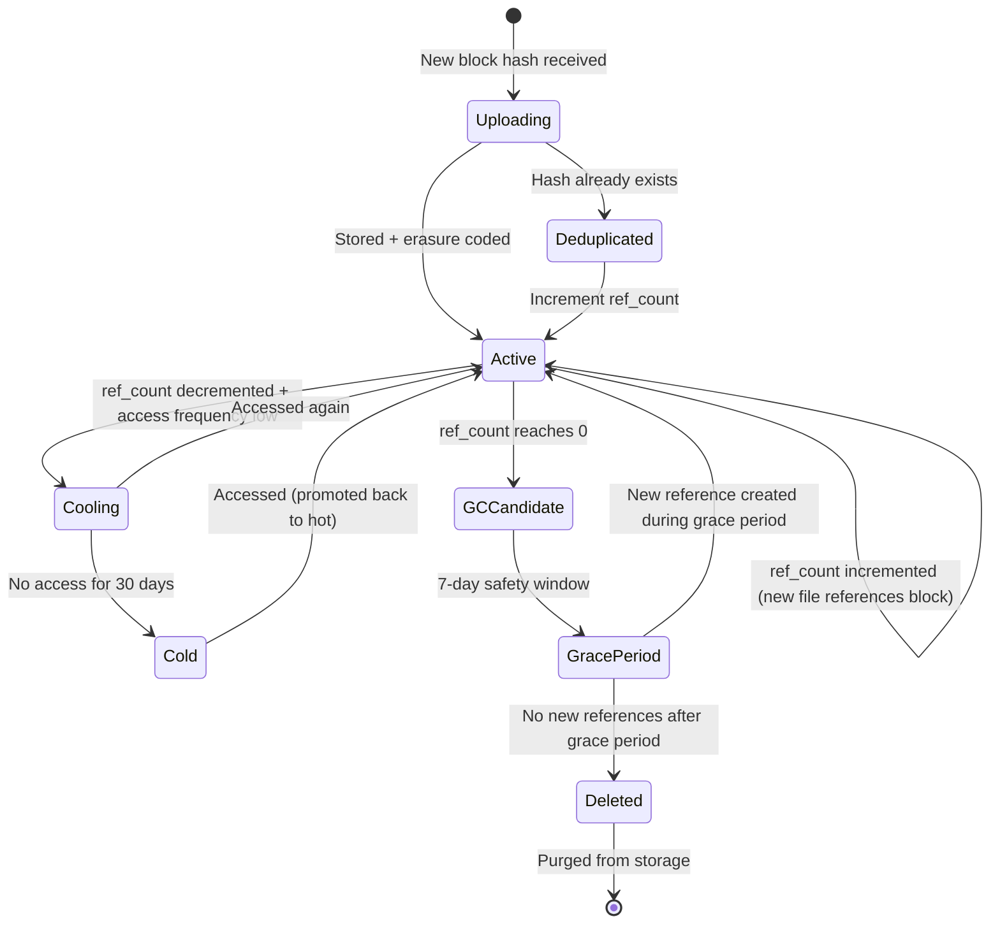

# Low-Level Design

## 1. Data Model

### 1.1 Entity Relationship Diagram



### 1.2 Indexing Strategy

| Table | Index | Type | Purpose |
|-------|-------|------|---------|
| `FILE_NODE` | `(namespace_id, parent_node_id, name)` | Unique composite | Directory listing, duplicate name check |
| `FILE_NODE` | `(path_hash)` | Unique | O(1) path-to-node lookup |
| `FILE_NODE` | `(namespace_id, modified_at)` | Composite | Recent changes query |
| `FILE_NODE` | `(namespace_id, is_deleted, modified_at)` | Composite | Trash listing |
| `FILE_VERSION` | `(node_id, version_number)` | Unique composite | Version lookup |
| `FILE_VERSION` | `(created_at)` | B-tree | Version cleanup (TTL-based) |
| `BLOCK_REF` | `(version_id, sequence_number)` | Unique composite | File reconstruction |
| `BLOCK_REF` | `(block_hash)` | B-tree | Block reference counting |
| `BLOCK` | `(block_hash)` | Primary (hash key) | Content-addressable lookup |
| `BLOCK` | `(storage_tier, last_accessed_at)` | Composite | Cold storage tiering |
| `SYNC_CURSOR` | `(device_id, namespace_id)` | Unique composite | Sync state per device |
| `SHARE_GRANT` | `(grantee_user_id, node_id)` | Unique composite | Permission check |
| `SHARE_LINK` | `(token)` | Unique | Link resolution |

### 1.3 Sharding Strategy

| Data | Shard Key | Reasoning |
|------|-----------|-----------|
| **File metadata** | `namespace_id` | All files in a namespace are co-located; enables single-shard directory listing and tree operations |
| **File versions** | `node_id` | Version history co-located with the file node |
| **Blocks** | `block_hash` (consistent hashing) | Uniform distribution; content-addressable blocks are shared across users |
| **User data** | `user_id` | User profile and quota isolated per shard |
| **Sync cursors** | `device_id` | Each device manages its own cursor independently |
| **Share grants** | `node_id` | Permission checks are file-centric |

### 1.4 Data Retention Policy

| Data Type | Retention | Action |
|-----------|-----------|--------|
| Current file versions | Indefinite | Always available |
| Version history | 30 days (free), 180 days (paid), 365 days (enterprise) | Soft delete, then purge |
| Trashed files | 30 days | Auto-purge after retention window |
| Orphaned blocks (ref_count=0) | 7 days grace period | Garbage collected by background job |
| Audit logs | 1 year (standard), 7 years (compliance) | Archive to cold storage |
| Sync cursors | 90 days of inactivity | Remove stale device cursors |

---

## 2. API Design

### 2.1 API Style: RESTful with gRPC for Internal Services

- **External API**: REST over HTTPS (broad client compatibility)
- **Internal service-to-service**: gRPC (low latency, strong typing, streaming)
- **Real-time notifications**: WebSocket with long-poll fallback
- **File transfers**: HTTP/2 with chunked transfer encoding

### 2.2 Core APIs

#### File Operations

```
# List files in a folder
GET /v2/files/list
  Query: namespace_id, parent_id, cursor?, limit=100
  Response: {entries: [{node_id, name, type, size, modified_at, content_hash}], cursor, has_more}

# Get file metadata
GET /v2/files/{node_id}/metadata
  Response: {node_id, name, path, size, content_hash, version, modified_at, sharing_info}

# Create folder
POST /v2/folders/create
  Body: {namespace_id, parent_id, name}
  Response: {node_id, name, path, created_at}

# Move/Rename file or folder
POST /v2/files/{node_id}/move
  Body: {new_parent_id?, new_name?}
  Headers: If-Match: {version}  // Optimistic concurrency
  Response: {node_id, name, new_path, version}

# Delete file (soft delete)
POST /v2/files/{node_id}/delete
  Headers: If-Match: {version}
  Response: {node_id, deleted_at, restore_deadline}

# Restore from trash
POST /v2/files/{node_id}/restore
  Response: {node_id, name, path, restored_at}
```

#### Block Operations

```
# Check which blocks need uploading (dedup check)
POST /v2/sync/check_blocks
  Body: {block_hashes: ["sha256_hash1", "sha256_hash2", ...]}
  Response: {needed: ["sha256_hash3", "sha256_hash7"], existing: ["sha256_hash1", ...]}

# Upload a block
PUT /v2/blocks/{block_hash}
  Headers: Content-Type: application/octet-stream
           Content-Length: {size}
  Body: <raw block data>
  Response: {block_hash, size, stored_at}
  Note: Server verifies SHA-256(body) == block_hash; rejects on mismatch

# Download a block
GET /v2/blocks/{block_hash}
  Headers: Range: bytes=0-4194303  (optional, for partial reads)
  Response: <raw block data>
  Headers: ETag: {block_hash}

# Commit file version (after all blocks uploaded)
POST /v2/files/{node_id}/commit
  Body: {
    base_version: 3,
    block_list: [{hash, sequence, offset, size}, ...],
    content_hash: "sha256_of_assembled_file",
    modified_at: "2026-03-08T10:30:00Z"
  }
  Headers: If-Match: {base_version}  // Optimistic concurrency
  Response: {version_id, version_number: 4, committed_at}
  Error 409: Conflict (base_version stale) → client must resolve
```

#### Sync Operations

```
# Get sync cursor (initial)
POST /v2/sync/get_cursor
  Body: {namespace_id, device_id}
  Response: {cursor: "encoded_sequence_number", server_state_hash}

# Long-poll for changes
POST /v2/sync/longpoll
  Body: {cursor}
  Timeout: 90 seconds
  Response: {changes: true} or timeout with {changes: false}

# Fetch changes since cursor
POST /v2/sync/list_changes
  Body: {cursor, limit: 1000}
  Response: {
    entries: [{node_id, change_type, name, path, version, content_hash, ...}],
    cursor: "new_cursor",
    has_more: false
  }
```

#### Sharing Operations

```
# Share file/folder with user
POST /v2/sharing/grant
  Body: {node_id, grantee_email, permission: "edit"}
  Response: {grant_id, grantee, permission, created_at}

# Create shared link
POST /v2/sharing/create_link
  Body: {node_id, permission: "view", expires_in: "7d", password?}
  Response: {link_id, url, permission, expires_at}

# List shared content
GET /v2/sharing/list
  Query: type=shared_with_me|shared_by_me, cursor?, limit=100
  Response: {entries: [{node_id, name, owner, permission, shared_at}], cursor}

# Revoke access
DELETE /v2/sharing/grants/{grant_id}
  Response: 204 No Content
```

### 2.3 Idempotency

| Operation | Idempotency Key | Strategy |
|-----------|----------------|----------|
| Block upload | `block_hash` | Content-addressable --- uploading same content is naturally idempotent |
| File commit | `(node_id, base_version)` | Optimistic concurrency; same commit retried yields same version or 409 |
| Create folder | `(namespace_id, parent_id, name)` | Unique constraint; retry returns existing folder |
| Share grant | `(node_id, grantee_user_id)` | Unique constraint; retry updates permission |
| Delete file | `node_id + If-Match` | Already-deleted returns 404 gracefully |
| API mutations | `Idempotency-Key` header | Server stores result keyed by client-provided UUID for 24 hours |

### 2.4 Rate Limiting

| Endpoint Category | Limit (per user) | Burst |
|-------------------|-------------------|-------|
| Metadata reads | 1,000 req/min | 100 req/s |
| Metadata writes | 300 req/min | 30 req/s |
| Block uploads | 100 req/min | 20 req/s |
| Block downloads | 500 req/min | 50 req/s |
| Search queries | 60 req/min | 10 req/s |
| Share operations | 100 req/min | 20 req/s |
| Long-poll connections | 1 per device | N/A |

### 2.5 Versioning Strategy

- **URL path versioning**: `/v2/files/...`
- Breaking changes increment version; non-breaking changes add fields
- Old versions supported for 12 months after deprecation notice
- Dropbox uses this approach: `/2/files/list_folder`

---

## 3. Core Algorithms

### 3.1 Content-Defined Chunking (FastCDC)

Splits a file into variable-size blocks with shift-resistant boundaries, maximizing deduplication effectiveness.

```
ALGORITHM FastCDC(file_data, min_size=2KB, max_size=8MB, avg_size=4MB)
  INPUT: file_data (byte array), min/max/avg chunk sizes
  OUTPUT: list of (offset, length) chunk boundaries

  gear_table ← PRECOMPUTE_GEAR_TABLE()  // 256 random 64-bit values
  mask_s ← COMPUTE_MASK(avg_size * 2)   // stricter mask for small chunks
  mask_l ← COMPUTE_MASK(avg_size / 2)   // relaxed mask for large chunks

  chunks ← []
  offset ← 0

  WHILE offset < LENGTH(file_data):
    chunk_start ← offset
    // Skip minimum chunk size (no boundary can be closer than min_size)
    offset ← MIN(offset + min_size, LENGTH(file_data))
    fingerprint ← 0

    // Phase 1: Use strict mask until average size
    WHILE offset < MIN(chunk_start + avg_size, LENGTH(file_data)):
      fingerprint ← (fingerprint << 1) + gear_table[file_data[offset]]
      IF (fingerprint & mask_s) == 0:
        APPEND chunks, (chunk_start, offset - chunk_start + 1)
        offset ← offset + 1
        GOTO next_chunk
      offset ← offset + 1

    // Phase 2: Use relaxed mask until max size
    WHILE offset < MIN(chunk_start + max_size, LENGTH(file_data)):
      fingerprint ← (fingerprint << 1) + gear_table[file_data[offset]]
      IF (fingerprint & mask_l) == 0:
        APPEND chunks, (chunk_start, offset - chunk_start + 1)
        offset ← offset + 1
        GOTO next_chunk
      offset ← offset + 1

    // Hit max size without finding boundary
    APPEND chunks, (chunk_start, offset - chunk_start)
    next_chunk:

  RETURN chunks

// Complexity: O(n) where n = file size
// FastCDC is 3-12x faster than Rabin-based CDC
// Deduplication ratio nearly identical to Rabin fingerprinting
```

**Why FastCDC over Fixed-Size Chunking?**

```
Fixed-size (4 MB blocks):                Content-defined (variable blocks):
┌──────┬──────┬──────┬──────┐           ┌────┬───────┬──────┬─────┐
│ BLK1 │ BLK2 │ BLK3 │ BLK4 │           │ C1 │  C2   │  C3  │ C4  │
└──────┴──────┴──────┴──────┘           └────┴───────┴──────┴─────┘

Insert 10 bytes at position 100:        Insert 10 bytes at position 100:
┌──────┬──────┬──────┬──────┐           ┌─────┬───────┬──────┬─────┐
│BBLK1'│BBLK2'│BBLK3'│BBLK4'│           │ C1' │  C2   │  C3  │ C4  │
└──────┴──────┴──────┴──────┘           └─────┴───────┴──────┴─────┘
 ↑ ALL blocks shifted = 0% dedup         ↑ Only C1 changed = 75% dedup
```

### 3.2 Block-Level Deduplication

```
ALGORITHM DeduplicateUpload(file, user_id)
  INPUT: file content, user identifier
  OUTPUT: list of blocks to upload, file metadata

  // Step 1: Chunk the file
  chunks ← FastCDC(file.data)
  block_hashes ← []

  FOR EACH chunk IN chunks:
    hash ← SHA256(chunk.data)
    APPEND block_hashes, {hash: hash, offset: chunk.offset, size: chunk.length}

  // Step 2: Batch dedup check against block registry
  existing_hashes ← QUERY block_registry WHERE hash IN block_hashes.map(b → b.hash)
  needed_blocks ← FILTER block_hashes WHERE hash NOT IN existing_hashes

  // Step 3: Upload only new blocks
  FOR EACH block IN needed_blocks:
    // Verify hash on server side (defense against hash collision attacks)
    server_hash ← SHA256(block.data)
    ASSERT server_hash == block.hash

    // Store with erasure coding
    STORE_BLOCK(block.hash, block.data, erasure_scheme="6+3")

    // Register in block registry
    INSERT INTO block_registry (hash, size, ref_count=1, tier="hot")

  // Step 4: Increment ref_count for reused blocks
  FOR EACH hash IN (block_hashes - needed_blocks):
    UPDATE block_registry SET ref_count = ref_count + 1 WHERE hash = hash

  // Step 5: Create file version with block manifest
  version ← CREATE_VERSION(
    node_id = file.node_id,
    blocks = block_hashes,  // ordered list
    content_hash = SHA256(CONCAT(block_hashes.map(b → b.hash)))
  )

  RETURN {
    uploaded_blocks: LENGTH(needed_blocks),
    deduplicated_blocks: LENGTH(block_hashes) - LENGTH(needed_blocks),
    dedup_ratio: 1 - (LENGTH(needed_blocks) / LENGTH(block_hashes)),
    version: version
  }

// Typical dedup ratio: 50-70% for enterprise workloads
// Storage savings: 3:1 (every 3 logical blocks → ~1 unique physical block)
```

### 3.3 Delta Sync Algorithm

```
ALGORITHM DeltaSync(local_file, remote_block_list)
  INPUT: local file content, remote file's block hash list
  OUTPUT: minimal set of blocks to transfer

  // Step 1: Chunk local file
  local_chunks ← FastCDC(local_file.data)
  local_hashes ← SET(local_chunks.map(c → SHA256(c.data)))

  // Step 2: Determine remote-only and local-only blocks
  remote_hashes ← SET(remote_block_list.map(b → b.hash))

  blocks_to_download ← remote_hashes - local_hashes   // new on server
  blocks_to_upload ← local_hashes - remote_hashes     // new locally
  common_blocks ← local_hashes ∩ remote_hashes        // already synced

  // Step 3: Apply changes
  IF DIRECTION == "download":
    FOR EACH hash IN blocks_to_download:
      block_data ← DOWNLOAD_BLOCK(hash)
      STORE_LOCAL_CACHE(hash, block_data)

    // Reconstruct file from remote block list order
    assembled ← REASSEMBLE(remote_block_list, local_cache)
    WRITE_FILE(local_file.path, assembled)

  ELSE IF DIRECTION == "upload":
    // Check which blocks server already has
    needed ← SERVER_DEDUP_CHECK(blocks_to_upload)
    FOR EACH hash IN needed:
      UPLOAD_BLOCK(hash, local_cache[hash])
    COMMIT_VERSION(file_id, local_chunks_ordered)

  RETURN {
    transferred: LENGTH(blocks_to_download) + LENGTH(blocks_to_upload),
    skipped: LENGTH(common_blocks),
    savings_pct: LENGTH(common_blocks) / LENGTH(local_hashes ∪ remote_hashes) * 100
  }

// For a 100 MB file with 1 MB edit: ~96% bandwidth savings
// (only 1-2 chunks of ~4MB transfer instead of 100 MB)
```

### 3.4 Conflict Detection and Resolution

```
ALGORITHM DetectAndResolveConflict(commit_request)
  INPUT: {node_id, base_version, new_blocks, device_id, timestamp}
  OUTPUT: commit result or conflict resolution

  // Step 1: Acquire optimistic lock on file node
  current ← SELECT * FROM file_nodes WHERE node_id = commit_request.node_id

  // Step 2: Check for conflict
  IF current.version != commit_request.base_version:
    // Another device committed since our base version
    conflict ← TRUE
  ELSE:
    conflict ← FALSE

  IF NOT conflict:
    // Happy path: no conflict, commit normally
    new_version ← current.version + 1
    INSERT file_version(node_id, new_version, commit_request.new_blocks)
    UPDATE file_nodes SET version = new_version WHERE node_id = commit_request.node_id
    RETURN {status: "committed", version: new_version}

  ELSE:
    // Conflict path: create conflicted copy
    conflict_name ← GENERATE_CONFLICT_NAME(
      original_name = current.name,
      editor_name = LOOKUP_USER(commit_request.device_id).display_name,
      timestamp = commit_request.timestamp
    )
    // Example: "report.docx" → "report (Niraj's conflicted copy 2026-03-08).docx"

    // Create new file node for conflicted copy
    conflict_node ← CREATE_FILE_NODE(
      namespace_id = current.namespace_id,
      parent_id = current.parent_node_id,
      name = conflict_name,
      blocks = commit_request.new_blocks
    )

    // Notify both devices
    NOTIFY(commit_request.device_id, "conflict_created", conflict_node)
    NOTIFY(ALL_DEVICES(current.node_id), "conflicted_copy", conflict_node)

    RETURN {status: "conflict", conflict_node: conflict_node}

// Strategy: Dropbox-style "conflicted copy" preserves both versions
// Alternative strategies: last-write-wins (data loss risk), auto-merge (complex)
```

### 3.5 Garbage Collection for Unreferenced Blocks

```
ALGORITHM GarbageCollectBlocks()
  // Runs as periodic background job (e.g., daily)
  INPUT: none
  OUTPUT: number of blocks reclaimed

  reclaimed ← 0

  // Step 1: Find candidate blocks (ref_count = 0)
  candidates ← SELECT block_hash, first_stored_at
    FROM blocks
    WHERE reference_count = 0
    AND last_accessed_at < NOW() - 7 DAYS  // grace period

  // Step 2: Double-check references (防 race condition)
  FOR EACH candidate IN candidates:
    // Scan block_ref table to confirm no references exist
    actual_refs ← COUNT(*) FROM block_refs WHERE block_hash = candidate.block_hash

    IF actual_refs > 0:
      // Reference was restored during grace period
      UPDATE blocks SET reference_count = actual_refs
        WHERE block_hash = candidate.block_hash
      CONTINUE

    // Step 3: Mark as pending deletion (tombstone)
    UPDATE blocks SET status = 'pending_delete'
      WHERE block_hash = candidate.block_hash
      AND reference_count = 0  // double-check with CAS

    // Step 4: Delete from block storage
    DELETE_FROM_STORAGE(candidate.block_hash)

    // Step 5: Remove block registry entry
    DELETE FROM blocks WHERE block_hash = candidate.block_hash
    reclaimed ← reclaimed + 1

  RETURN reclaimed

// Safety: 7-day grace period prevents deleting blocks from in-flight uploads
// Consistency: CAS (compare-and-swap) prevents TOCTOU race conditions
```

---

## 4. State Diagrams

### 4.1 File Sync State Machine (Per Device)



### 4.2 Block Lifecycle State Machine


