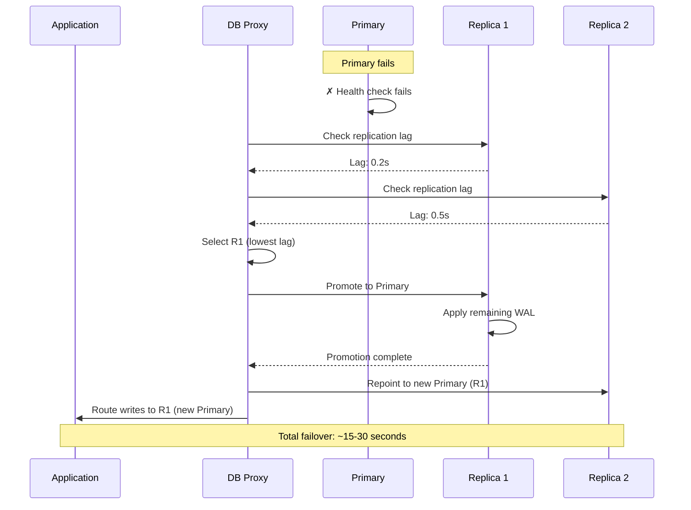
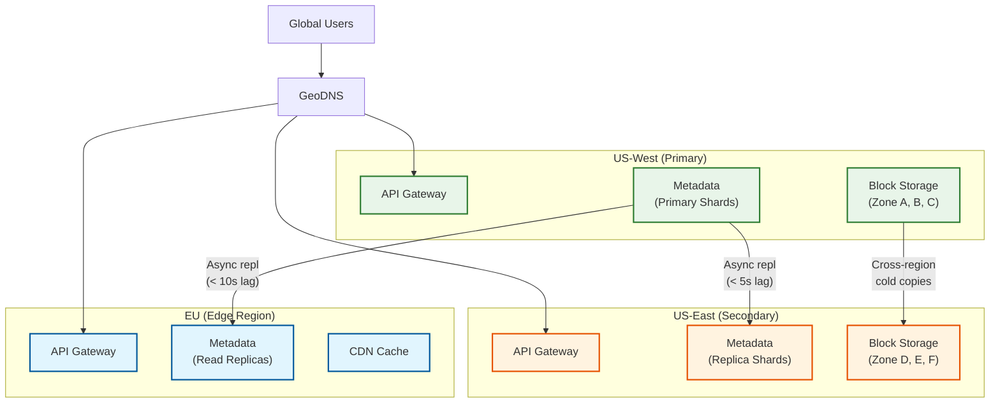

# Scalability & Reliability

## 1. Scalability

### 1.1 Horizontal vs Vertical Scaling

| Component | Scaling Strategy | Justification |
|-----------|-----------------|---------------|
| **API Gateway** | Horizontal | Stateless; scale by adding instances behind load balancer |
| **Sync Service** | Horizontal (with sticky sessions) | WebSocket connections are stateful; use consistent hashing for device-to-instance affinity |
| **Metadata Service** | Horizontal (shard-based) | Shard by namespace_id; each shard is an independent unit |
| **Block Service** | Horizontal | Stateless request routing; consistent hashing maps block_hash to storage nodes |
| **Block Storage** | Horizontal (add storage nodes) | Consistent hashing ring; new nodes absorb proportional data via rebalancing |
| **Metadata Database** | Horizontal (sharding) + Vertical (per shard) | Shard by namespace_id; scale individual shards vertically for hot namespaces |
| **Search Index** | Horizontal (index sharding) | Partition by namespace; replicate for read throughput |
| **Notification Service** | Horizontal | Each instance manages a pool of WebSocket connections |

### 1.2 Auto-Scaling Triggers

| Component | Metric | Scale-Up Threshold | Scale-Down Threshold | Cooldown |
|-----------|--------|-------------------|---------------------|----------|
| API Gateway | Request rate | >80% capacity | <30% capacity | 3 min |
| Sync Service | Active connections | >70% per instance | <20% per instance | 5 min |
| Block Service | Network bandwidth | >75% NIC utilization | <25% NIC utilization | 5 min |
| Metadata Service | p99 latency | >50ms | <10ms | 5 min |
| Block Upload Workers | Upload queue depth | >1,000 pending | <100 pending | 3 min |
| Search Indexers | Index lag | >30 seconds behind | <5 seconds behind | 10 min |
| Notification Service | Connection count | >50K per instance | <10K per instance | 5 min |

### 1.3 Database Scaling Strategy

#### Metadata Database (Sharded SQL)

```
                    ┌─────────────────────┐
                    │   Routing Layer     │
                    │ (namespace_id mod N)│
                    └──────────┬──────────┘
           ┌───────────────────┼───────────────────┐
           ▼                   ▼                   ▼
    ┌──────────────┐   ┌──────────────┐   ┌──────────────┐
    │  Shard 0     │   │  Shard 1     │   │  Shard N     │
    │  Primary     │   │  Primary     │   │  Primary     │
    │  ┌────────┐  │   │  ┌────────┐  │   │  ┌────────┐  │
    │  │Replica │  │   │  │Replica │  │   │  │Replica │  │
    │  │Replica │  │   │  │Replica │  │   │  │Replica │  │
    │  └────────┘  │   │  └────────┘  │   │  └────────┘  │
    └──────────────┘   └──────────────┘   └──────────────┘
```

**Scaling operations:**

| Operation | Approach | Impact |
|-----------|----------|--------|
| **Read scaling** | Add read replicas per shard | Near-zero downtime; replicas serve read traffic |
| **Write scaling** | Shard splitting (split hot shard into 2) | Online migration using dual-write + backfill pattern |
| **Cross-shard queries** | Scatter-gather through routing layer | Higher latency; minimize by co-locating related data |
| **Shard rebalancing** | Virtual shards (1024 logical → N physical) | Move virtual shards between physical nodes without resharding |

#### Block Storage Scaling

- **Consistent hashing ring** with virtual nodes (100-200 vnodes per physical node)
- New storage nodes join ring → automatic rebalancing transfers proportional data
- Storage nodes hold ~1 PB raw capacity each (Dropbox 7th-gen servers)
- Capacity expansion: add racks with 6 PB enclosures

#### Cold Metadata Scaling (Alki)

- LSM-tree on object storage: scales to petabytes at 5.5x lower cost per GB
- Hot index in wide-column store; cold data in object storage
- Dropbox serves ~350 TB of cold metadata through this architecture

### 1.4 Caching Layers

```
Layer    │ Technology        │ Hit Rate │ Latency │ Capacity
─────────┼───────────────────┼──────────┼─────────┼──────────
L1 Client│ Local disk/memory │ 95%      │ <1ms    │ Per device
L2 CDN   │ Edge cache        │ 80%      │ <20ms   │ Distributed
L3 App   │ Consistent cache  │ 90%      │ <5ms    │ ~500 TB
L4 DB    │ Buffer pool       │ 70%      │ <2ms    │ Per shard
```

**L3 Consistent Cache (Chrono) details:**
- Sits between routing layer and data mastering engines
- Write-through invalidation: every write invalidates relevant cache entries
- Supports **linearizable reads** (stronger than eventual consistency)
- Absorbs 90%+ of read traffic, reducing backend load by 10-100x
- Panda followers serve linearizable reads through Chrono

### 1.5 Hot Spot Mitigation

| Hot Spot Type | Detection | Mitigation |
|---------------|-----------|------------|
| **Popular shared folder** | QPS per namespace exceeds threshold | Request coalescing, aggressive caching, shard splitting |
| **Viral shared link** | Download count spike | CDN absorbs reads; rate limit per link |
| **Large team sync burst** | Monday morning spike pattern | Jittered sync start times per device (random 0-60s delay) |
| **Storage node hot spot** | Block hash clustering on ring segment | Virtual nodes with 200+ vnodes per physical node |
| **Single large file upload** | Bandwidth saturation | Spread blocks across multiple upload endpoints |

---

## 2. Reliability & Fault Tolerance

### 2.1 Single Points of Failure (SPOF) Identification

| Potential SPOF | Mitigation |
|---------------|------------|
| **Metadata database primary** | Primary-replica with automatic failover (< 30s); cross-region standby |
| **Block storage zone** | Erasure coding (6+3) spans 3+ zones; survives complete zone loss |
| **Sync service** | Stateless instances behind load balancer; sticky sessions with re-hash on failure |
| **Notification service** | Multiple instances; client reconnects with exponential backoff |
| **DNS** | GeoDNS with multiple providers; DNS TTL = 60s for fast failover |
| **API Gateway** | Active-active across zones; health-checked by load balancer |
| **Message queue** | Replicated brokers; consumer groups with rebalancing |
| **Block index (registry)** | Replicated across zones; cache absorbs reads during recovery |

### 2.2 Redundancy Strategy

| Component | Redundancy Model | RPO | RTO |
|-----------|-----------------|-----|-----|
| Metadata DB | Primary + 2 replicas per shard + cross-region async replica | <1s (in-region), <5s (cross-region) | <30s (in-region), <5 min (cross-region) |
| Block Storage | Erasure coding across 3 zones + cross-region cold copy | 0 (synchronous EC) | <1 min (fragment rebuild) |
| API/Service tier | N+2 instances per zone | N/A (stateless) | <10s (health check interval) |
| Message Queue | 3-way replication, ISR (in-sync replicas) | 0 (sync replication) | <30s (leader election) |
| Search Index | 1 primary + 1 replica per shard | <30s | <2 min |

### 2.3 Failover Mechanisms

#### Metadata Database Failover



#### Block Storage Fragment Repair

```
ALGORITHM RepairLostFragment(block_hash, lost_fragment_id)
  // Triggered when scrubbing detects missing/corrupt fragment

  fragment_map ← LOOKUP_FRAGMENTS(block_hash)
  available ← FILTER fragment_map WHERE status = "healthy"

  IF LENGTH(available) >= 6:  // Need 6 of 9 for reconstruction
    // Reconstruct lost fragment using Reed-Solomon decode
    data_fragments ← READ_FRAGMENTS(available, count=6)
    reconstructed ← REED_SOLOMON_RECONSTRUCT(data_fragments, lost_fragment_id)

    // Store reconstructed fragment on a new healthy node
    new_node ← SELECT_HEALTHY_NODE(excluding=fragment_map.nodes)
    STORE_FRAGMENT(new_node, block_hash, lost_fragment_id, reconstructed)

    // Update fragment map
    UPDATE fragment_map SET node = new_node WHERE fragment_id = lost_fragment_id
    LOG("Fragment repaired", block_hash, lost_fragment_id, new_node)

  ELSE:
    ALERT("CRITICAL: Block {block_hash} has <6 healthy fragments, data at risk")
    ESCALATE_TO_ONCALL()
```

### 2.4 Circuit Breaker Patterns

| Service | Circuit Breaker Config | Fallback |
|---------|----------------------|----------|
| Metadata Service → DB | Open after 5 failures in 10s; half-open after 30s | Serve from cache (stale reads acceptable for non-write operations) |
| Sync Service → Block Service | Open after 10 failures in 30s | Queue uploads for retry; notify client of delay |
| Notification Service → Message Queue | Open after 3 failures in 10s | Buffer notifications in-memory; flush when circuit closes |
| Search Service → Search Index | Open after 5 failures in 10s | Return metadata-only results (filename match, no content search) |
| Client → API | Exponential backoff: 1s, 2s, 4s, 8s, max 60s | Offline mode with local-first operations |

### 2.5 Retry Strategies

| Operation | Strategy | Max Retries | Backoff |
|-----------|----------|-------------|---------|
| Block upload | Retry with exponential backoff + jitter | 5 | 1s, 2s, 4s, 8s, 16s ± random(0-1s) |
| Metadata write | Retry only on transient errors (5xx, timeout) | 3 | 500ms, 1s, 2s |
| Block download | Retry from different CDN PoP on failure | 3 | 1s, 2s, 4s |
| Sync notification | At-least-once delivery with dedup on receiver | Infinite (with backoff) | 5s, 10s, 30s, 60s |
| Commit (409 Conflict) | No retry --- client must re-fetch and re-merge | 0 | N/A |

### 2.6 Graceful Degradation

| Failure Scenario | Degraded Behavior |
|-----------------|-------------------|
| **Metadata DB partial outage** (some shards down) | Users on healthy shards unaffected; affected users get "temporarily unavailable" for write operations; cached reads may still work |
| **Block storage zone loss** | Reads served from remaining fragments (erasure coding); writes redirected to healthy zones |
| **Search index down** | File browsing and sync continue normally; search returns "service temporarily unavailable" |
| **Notification service down** | Clients fall back to polling every 60s; sync still works but with higher latency |
| **CDN outage** | Downloads fall back to origin; higher latency but still functional |
| **Full datacenter loss** | Cross-region failover; RPO < 5 seconds for metadata, RPO = 0 for block data |

### 2.7 Bulkhead Pattern

```
┌─────────────────────────────────────────────────────┐
│ API Gateway                                          │
│ ┌──────────┐ ┌──────────┐ ┌──────────┐ ┌──────────┐│
│ │ Sync     │ │ Upload   │ │ Download │ │ Sharing  ││
│ │ Pool     │ │ Pool     │ │ Pool     │ │ Pool     ││
│ │ 200 conn │ │ 300 conn │ │ 500 conn │ │ 100 conn ││
│ └──────────┘ └──────────┘ └──────────┘ └──────────┘│
│ Total: 1100 connections max                          │
│ Overflow → 503 Service Unavailable                   │
└─────────────────────────────────────────────────────┘

Isolation: Upload traffic surge cannot exhaust download capacity
```

Each service tier maintains **separate connection pools** and **separate thread pools** for different operation types. A burst of uploads cannot starve download requests.

---

## 3. Disaster Recovery

### 3.1 Recovery Objectives

| Metric | Target | Strategy |
|--------|--------|----------|
| **RTO** (Recovery Time Objective) | <15 minutes | Automated cross-region failover with pre-warmed standby |
| **RPO** (Recovery Point Objective) | <1 minute for metadata; 0 for blocks | Async replication for metadata; synchronous erasure coding for blocks |
| **MTTR** (Mean Time to Repair) | <30 minutes | Automated detection + runbook-driven recovery |

### 3.2 Backup Strategy

| Data Type | Backup Method | Frequency | Retention | Storage |
|-----------|--------------|-----------|-----------|---------|
| Metadata DB | Continuous WAL shipping + daily snapshots | Continuous | 30 days | Cross-region object storage |
| Block data | Erasure coding is the backup (6+3 across zones) | Real-time | Permanent (until GC) | Multi-zone block storage |
| Configuration | Version-controlled in Git + encrypted snapshots | On change | 1 year | Separate availability zone |
| Audit logs | Append-only log shipping | Continuous | 7 years (compliance) | Immutable archival storage |

### 3.3 Multi-Region Architecture



**Failover procedure:**

1. **Detection** (0-2 min): Health checks fail across multiple monitors
2. **Decision** (1-2 min): Automated system or on-call engineer confirms regional outage
3. **DNS update** (1-3 min): GeoDNS shifts traffic to secondary region
4. **Metadata promotion** (2-5 min): Secondary replicas promoted to primary; accept writes
5. **Verification** (1-3 min): Synthetic probes confirm service restoration

**Total RTO: ~5-15 minutes**

### 3.4 LAN Sync (Bandwidth Optimization)

For enterprise environments with many devices on the same network:

```
ALGORITHM LanSync(file_change)
  // Step 1: Discover peers on local network
  peers ← UDP_BROADCAST(port=17500, payload={device_id, version})

  // Step 2: Check if any peer already has the needed blocks
  FOR EACH peer IN peers:
    IF peer.has_blocks(file_change.block_hashes):
      // Direct HTTPS transfer between clients on LAN
      blocks ← HTTPS_GET(peer.ip, "/blocks/{hash}")
      // ~100x faster than cloud roundtrip (Gigabit LAN vs WAN)
      RETURN blocks

  // Step 3: Fall back to cloud download
  RETURN CLOUD_DOWNLOAD(file_change.block_hashes)
```

- Dropbox LAN sync uses UDP broadcast on port 17500 for peer discovery
- Direct HTTPS transfer between clients (encrypted, authenticated)
- Reduces WAN bandwidth for offices with many Dropbox users
- IPv4 only; limited to broadcast domain (same subnet)
