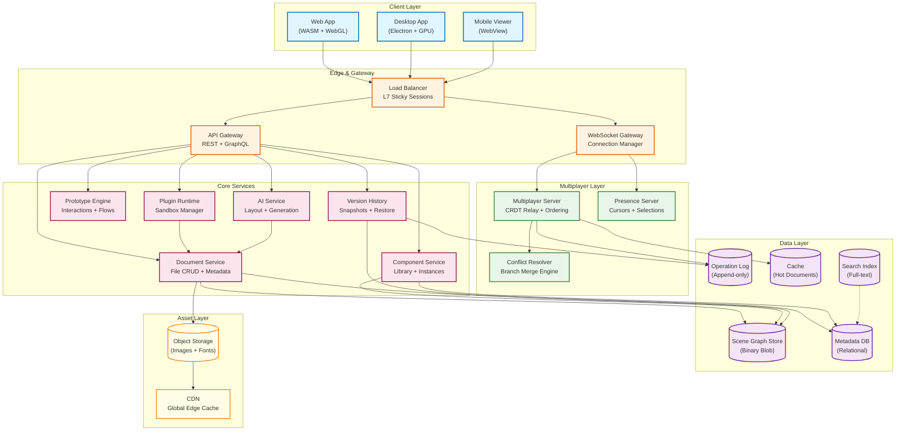
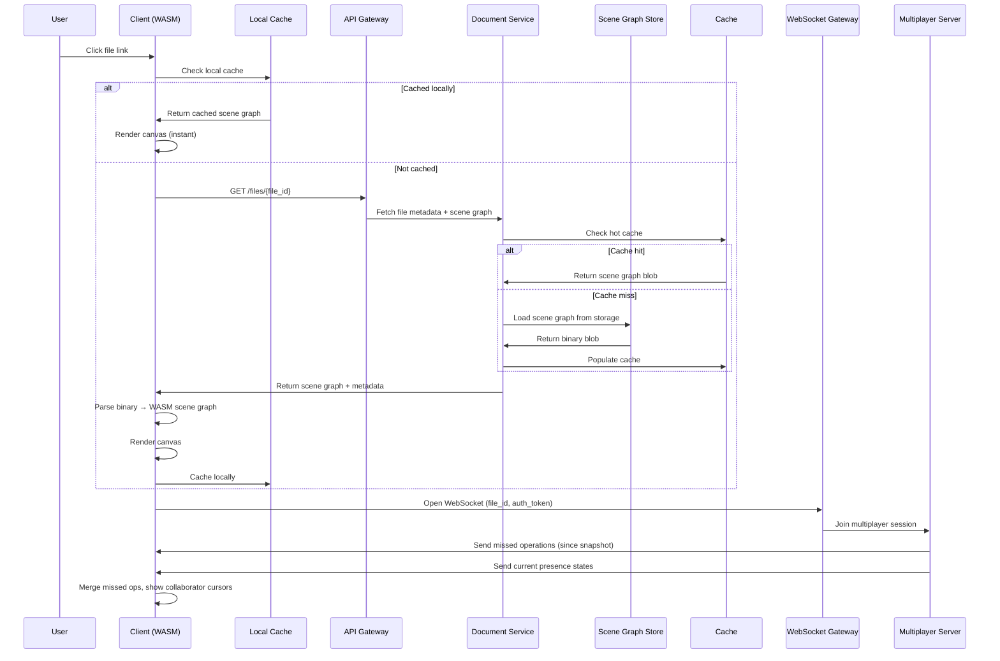
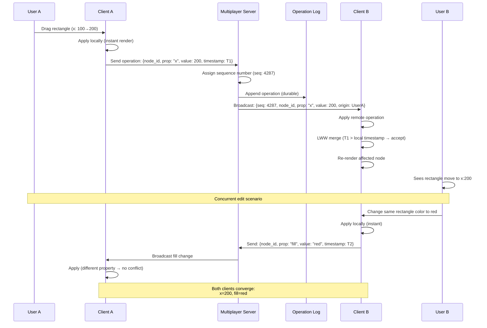
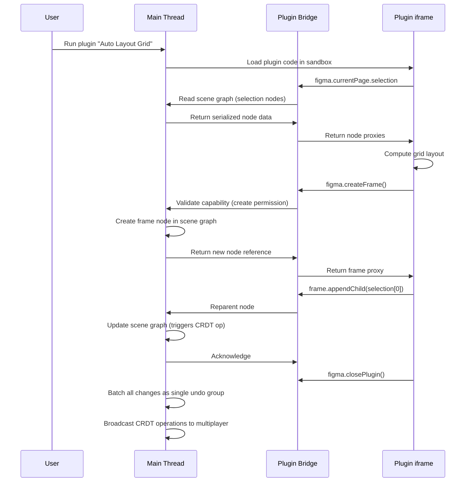

# High-Level Design

## System Architecture



---

## Key Architectural Decisions

### 1. CRDTs (Not OT) for Conflict Resolution

**Decision: LWW Register Map CRDTs with fractional indexing**

| Factor | OT Approach | CRDT Approach (Chosen) |
|--------|-------------|------------------------|
| Offline editing | Requires server rebase on reconnect | Native—merge on reconnect |
| Property conflicts | Transform functions per property pair | LWW per property—simple, correct |
| Layer ordering | Sequence transforms (complex) | Fractional indexing (single property write) |
| Server role | Central transform authority | Relay + ordering (no transformation) |
| Memory overhead | Minimal | ~16 bytes per property per node (acceptable) |
| Convergence proof | Must verify per property type | Mathematical guarantee (LWW + causal ordering) |

**Rationale**: Design tool operations are predominantly property overwrites (change color, move position, resize). Unlike text editors where character ordering is critical, design tools need property-level conflict resolution. LWW registers are the simplest correct solution—when two users change the same property, the last write wins. When they change different properties of the same node, both writes are preserved. This dramatically simplifies the CRDT model compared to text editors.

### 2. WebGL + WebAssembly (Not DOM-Based Rendering)

**Decision: Custom C++ rendering engine compiled to WebAssembly**

| Factor | DOM/SVG Rendering | WebGL + WASM (Chosen) |
|--------|-------------------|------------------------|
| Performance ceiling | ~1,000 DOM elements before jank | 500,000+ objects at 60 FPS |
| Cross-platform consistency | Browser-dependent text rendering | Pixel-perfect across all platforms |
| Vector operations | Limited to SVG path spec | Custom boolean ops, gradients, blur |
| Memory layout | JS heap, GC pauses | Linear WASM memory, no GC |
| GPU utilization | Indirect via compositor | Direct WebGL draw calls |
| Development cost | Low (standard web APIs) | Very High (custom engine) |

**Rationale**: A professional design tool requires rendering hundreds of thousands of vector objects with effects (shadows, blur, gradients, blend modes) at interactive frame rates. The DOM was designed for document layout, not 2D graphics rendering. By compiling a C++ vector engine to WASM and rendering via WebGL, Figma achieves native-app performance in the browser while guaranteeing that the same file looks identical on every platform—critical for design handoff.

### 3. Scene Graph (Not Flat Object List)

**Decision: Hierarchical scene graph tree**

```
File
├── Page 1
│   ├── Frame "Header" (auto-layout)
│   │   ├── Text "Logo"
│   │   ├── Frame "Nav" (auto-layout)
│   │   │   ├── Text "Home"
│   │   │   ├── Text "About"
│   │   │   └── Text "Contact"
│   │   └── Component Instance "Avatar"
│   ├── Frame "Hero Section"
│   │   ├── Rectangle "Background"
│   │   ├── Text "Headline"
│   │   └── Component Instance "CTA Button"
│   └── ...
└── Page 2
    └── ...
```

**Why a tree, not a flat list**:
- **Parent-child relationships** enable auto-layout, constraints, clipping, and masking
- **Frame nesting** models real UI hierarchy (components contain sub-components)
- **Spatial queries** are efficient via tree traversal (only traverse visible subtrees)
- **Component instances** inherit from main components via tree structure
- **Permissions** can inherit down the tree (page-level access control)

### 4. Multiplayer: Server as Authoritative Relay

**Decision: Central relay server per document, not peer-to-peer**

```
Client A ──WebSocket──> Multiplayer Server ──WebSocket──> Client B
   │                          │                              │
   │                          ├── Assign sequence numbers    │
   │                          ├── Persist to operation log   │
   │                          └── Broadcast to all peers     │
   │                                                         │
   └── Apply locally first ──────────────────────── Apply locally
       (optimistic)                                 (remote merge)
```

- **Server assigns global ordering** (sequence numbers) to all operations
- **Server does NOT transform operations**—CRDTs converge regardless of order
- **Server persists operations** to the operation log for durability
- **Clients apply operations optimistically** before server acknowledgment
- **Server routes to the correct document's session**—sticky routing by file ID

### 5. Presence: Ephemeral Channel, Separate from Document State

**Decision: Cursor/selection data uses a separate, non-persistent broadcast channel**

| Aspect | Document Operations | Presence Data |
|--------|---------------------|---------------|
| Persistence | Durable (operation log) | Ephemeral (in-memory only) |
| Consistency | Strong eventual (CRDT) | Best-effort (last value wins) |
| Update frequency | 1-5 ops/sec per user | 10-30 updates/sec per user |
| Failure mode | Must not lose data | Stale cursor is acceptable |
| Bandwidth | Priority delivery | Throttled, sampled |
| Scope | All operations to all clients | Viewport-filtered |

**Rationale**: Cursor movements generate 10-30x more messages than actual document edits. Mixing them into the operation log would waste 97% of storage on data with zero historical value. Separate channels allow independent throttling, quality-of-service, and failure handling.

### 6. Storage: Binary Scene Graph + Operation Log

**Decision: Dual storage—binary blob for current state, append-only log for history**

```
Time ──────────────────────────────────────────────>
│ Snapshot S1 │ op op op op │ Snapshot S2 │ op op  │
│ (full scene │ (incremental│ (full scene │ (delta)│
│  graph blob)│  deltas)    │  graph blob)│        │
```

- **Scene graph blob**: Complete binary-encoded scene graph for fast file loading
- **Operation log**: Append-only stream of CRDT operations for sync, history, and undo
- **Snapshot cadence**: Every 500 operations or 10 minutes (whichever comes first)
- **Loading**: Fetch latest snapshot → replay subsequent operations → ready
- **Version history**: Browse operation log; restore by replaying to a specific point

### 7. Plugin Sandbox: iframe Isolation

**Decision: Run plugins in sandboxed iframes with message-passing API**

```
┌─────────────────────────────────┐
│ Main Thread (WASM Renderer)     │
│  ├── Scene Graph (WASM heap)    │
│  ├── Plugin Bridge              │
│  │    ├── postMessage() ←──┐    │
│  │    └── onMessage()  ────┤    │
│  └── Capability Checker    │    │
└────────────────────────────┤────┘
                             │
┌────────────────────────────┤────┐
│ Plugin iframe (sandboxed)  │    │
│  ├── Plugin Code           │    │
│  ├── Figma Plugin API      │    │
│  │    ├── figma.root       │    │
│  │    ├── figma.currentPage│    │
│  │    └── figma.createXxx()│    │
│  └── postMessage() ────────┘    │
└─────────────────────────────────┘
```

- **Full isolation**: Plugin code cannot access the main thread's memory, DOM, or network
- **Capability-based API**: Plugins declare required permissions in manifest (read-only, read-write, network access)
- **Message passing**: All plugin operations go through an async message bridge
- **Resource limits**: CPU time limits, memory caps, rate limiting on API calls

---

## Data Flow

### Opening a File



### Making an Edit (Real-Time Collaboration)



### Plugin Execution Flow



---

## Architecture Pattern Checklist

- [x] **Sync vs Async**: WebSocket for real-time multiplayer (async push); REST/GraphQL for file metadata (sync request-response)
- [x] **Event-driven vs Request-response**: Event-driven for canvas edits (operation stream); request-response for file CRUD, exports
- [x] **Push vs Pull**: Push for real-time edits and presence; pull for file load, version history, search
- [x] **Stateful vs Stateless**: Multiplayer servers are stateful (hold active document sessions in memory); API servers are stateless
- [x] **Read-heavy vs Write-heavy**: Write-heavy during editing (2+ ops/sec per user); read-heavy for viewing/inspection/handoff
- [x] **Real-time vs Batch**: Real-time for edits and presence; batch for export rendering, search indexing, thumbnail generation
- [x] **Edge vs Origin**: Client-side WASM rendering for zero-latency visual updates; server for persistence, sync, and collaboration
- [x] **Thick client vs Thin client**: Thick client—all rendering, CRDT merge, and interaction logic runs in the browser's WASM engine

---

## Component Responsibilities

| Component | Responsibility | Scaling Strategy |
|-----------|---------------|-----------------|
| **WebSocket Gateway** | Connection management, auth, routing to correct multiplayer server | Horizontal (L7 load balancer, sticky by file ID) |
| **Multiplayer Server** | CRDT operation relay, sequence assignment, broadcast to peers | Horizontal (sharded by file ID, 1 server per active file) |
| **Presence Server** | Cursor positions, selections, viewport awareness, follow mode | Horizontal (pub/sub, ephemeral state) |
| **Document Service** | File CRUD, metadata, permissions, sharing settings | Stateless, horizontally scaled |
| **Component Service** | Team libraries, component publishing, instance tracking | Stateless, cache-heavy |
| **Version History** | Snapshot management, operation log browsing, restore | Background workers, scaled by queue depth |
| **Plugin Runtime** | Sandbox lifecycle, capability enforcement, resource limits | Per-client (plugins run in user's browser) |
| **Rendering Engine** | Vector rasterization, text layout, effects | Client-side only (WASM + WebGL) |
| **Scene Graph Store** | Binary scene graph blob storage and retrieval | Object storage with tiered caching |
| **Operation Log** | Append-only operation persistence, replay | Partitioned by file ID |
| **CDN** | Static assets, WASM binary, images, fonts | Global edge network |
| **AI Service** | Layout suggestions, content generation, image generation | GPU-backed inference servers |
