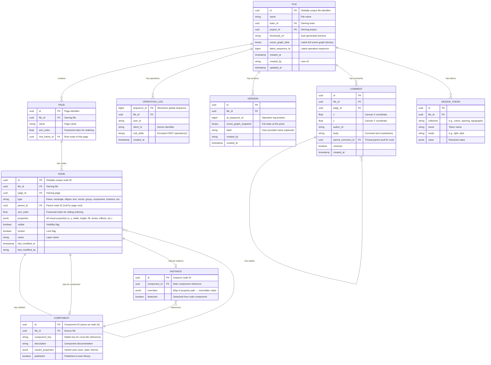

# Low-Level Design

## Data Model

### Scene Graph Entity (Core)

Every visual element in a Figma file is a **node** in a hierarchical scene graph. The node's `type` field determines how its properties are rendered.



### Node Types & Properties

| Node Type | Key Properties | Children |
|-----------|---------------|----------|
| `FRAME` | `x, y, width, height, fills[], strokes[], effects[], cornerRadius, clipsContent, layoutMode, paddingLeft/Right/Top/Bottom, itemSpacing, counterAxisAlignItems, primaryAxisAlignItems` | Yes (primary container) |
| `GROUP` | `x, y, width, height` (computed from children) | Yes (computed bounds) |
| `RECTANGLE` | `x, y, width, height, fills[], strokes[], effects[], cornerRadius[4]` | No |
| `ELLIPSE` | `x, y, width, height, fills[], strokes[], effects[], arcData` | No |
| `VECTOR` | `x, y, width, height, fills[], strokes[], vectorPaths[], vectorNetwork` | No |
| `TEXT` | `x, y, width, height, characters, fontSize, fontFamily, fontWeight, lineHeight, letterSpacing, textAlignHorizontal, textAlignVertical, fills[], textStyleOverrides[]` | No |
| `COMPONENT` | Same as FRAME + `componentKey, description, variantProperties` | Yes |
| `INSTANCE` | Same as FRAME + `componentId, overrides{}, scaleFactor` | Yes (mirror of component children, with overrides) |
| `BOOLEAN_OPERATION` | `booleanOperation: "union"|"subtract"|"intersect"|"exclude"` | Yes (operand shapes) |
| `SLICE` | `x, y, width, height, exportSettings[]` | No |
| `CONNECTOR` | `startNode, endNode, connectorStart, connectorEnd, strokeCap` | No |

### Property CRDT Structure (Per Node)

Each node's properties are managed as a **map of LWW (Last-Writer-Wins) registers**:

```
Node CRDT State (node_id: "abc-123")
├── Property Map (LWW Register per key)
│   ├── "x"      → { value: 200, timestamp: T47, replica: "client-A" }
│   ├── "y"      → { value: 150, timestamp: T46, replica: "client-B" }
│   ├── "width"  → { value: 300, timestamp: T44, replica: "client-A" }
│   ├── "height" → { value: 200, timestamp: T44, replica: "client-A" }
│   ├── "fills"  → { value: [{type:"SOLID", color:{r:1,g:0,b:0,a:1}}], timestamp: T48, replica: "client-B" }
│   └── "name"   → { value: "Header BG", timestamp: T30, replica: "client-A" }
│
├── Sort Order (Fractional Index)
│   └── "sort_order" → { value: 0.375, timestamp: T45, replica: "client-A" }
│
└── Parent Reference (LWW Register)
    └── "parent_id" → { value: "frame-xyz", timestamp: T40, replica: "client-A" }
```

**Key design choices**:
- Each property is an **independent LWW register**: two users changing different properties of the same node never conflict
- When two users change the **same property**, the write with the latest Lamport timestamp wins
- **Fills and strokes** are stored as atomic values (the entire array is one LWW value), not individual array elements—this avoids complex array CRDT semantics for arrays that are typically set as a whole

### Fractional Indexing for Layer Ordering

Instead of a sequence CRDT for child ordering (expensive for reorder operations), Figma uses **fractional indexing**:

```
PSEUDOCODE: Fractional Indexing for Layer Order

// Each node has a sort_order: a rational number between 0 and 1
// Siblings are rendered in ascending sort_order (bottom to top in layers panel)

INITIAL STATE:
  Layer A: sort_order = 0.25
  Layer B: sort_order = 0.50
  Layer C: sort_order = 0.75

INSERT between A and B:
  Layer D: sort_order = 0.375   // midpoint(0.25, 0.50)

MOVE C to bottom (before A):
  Layer C: sort_order = 0.125   // midpoint(0, 0.25)

RESULT ORDER: C(0.125), A(0.25), D(0.375), B(0.50)

EDGE CASE - Precision exhaustion:
  After many insertions between the same pair, fractional values get very long.
  Solution: Periodic rebalancing (assign evenly spaced values to all siblings)
  Rebalancing is a batch operation that generates new sort_order writes for all siblings.
```

**Advantages over sequence CRDTs**:
- Reordering is a **single property write** (change sort_order), not a delete + insert
- No tombstones accumulate from reorder operations
- Concurrent reorders of different layers never conflict (different nodes, different LWW registers)
- Same-layer concurrent reorders resolve via LWW (last move wins)

### Indexing Strategy

| Index | Table | Columns | Purpose |
|-------|-------|---------|---------|
| `idx_node_file_page` | NODE | `(file_id, page_id)` | Load all nodes for a page |
| `idx_node_parent_sort` | NODE | `(parent_id, sort_order)` | Ordered children of any node |
| `idx_oplog_file_seq` | OPERATION_LOG | `(file_id, sequence_id)` | Replay operations from a point |
| `idx_version_file` | VERSION | `(file_id, at_sequence_id DESC)` | Latest version lookup |
| `idx_component_key` | COMPONENT | `(component_key)` | Cross-file component resolution |
| `idx_instance_component` | INSTANCE | `(component_id)` | Find all instances of a component |
| `idx_comment_file_page` | COMMENT | `(file_id, page_id, resolved)` | Load comments for a page |
| `idx_file_team` | FILE | `(team_id, updated_at DESC)` | Recent files in team |
| `idx_token_file_collection` | DESIGN_TOKEN | `(file_id, collection, mode)` | Load tokens by collection |

### Sharding Strategy

| Data | Shard Key | Strategy |
|------|-----------|----------|
| Scene graph nodes | `file_id` | All nodes for a file on same shard |
| Operation log | `file_id` | Partitioned, append-only per file |
| Version snapshots | `file_id` | Co-located with operation log |
| Comments | `file_id` | Co-located with file data |
| Components (library) | `team_id` | Team-level component search |
| User data | `user_id` | Separate user service shard |
| Assets (images) | Content hash | Content-addressable, deduplication |

---

## API Design

### REST API (File Management)

#### Get File

```
GET /api/v1/files/{file_id}
Accept: application/octet-stream

Response: 200 OK
Content-Type: application/octet-stream
X-Sequence-Id: 428571
X-Snapshot-At: 428000
X-Page-Count: 3

Body: Binary-encoded scene graph (all pages)
```

#### Create File

```
POST /api/v1/teams/{team_id}/projects/{project_id}/files
Content-Type: application/json

Request:
{
  "name": "Mobile App Redesign",
  "duplicate_from": "file-id-optional",
  "template_id": "template-id-optional"
}

Response: 201 Created
{
  "id": "file-uuid",
  "name": "Mobile App Redesign",
  "thumbnail_url": null,
  "pages": [{ "id": "page-1-uuid", "name": "Page 1" }],
  "websocket_url": "wss://multiplayer.example.com/files/file-uuid",
  "created_at": "2026-03-08T10:00:00Z"
}
```

#### List File Versions

```
GET /api/v1/files/{file_id}/versions?limit=20&before=cursor

Response: 200 OK
{
  "versions": [
    {
      "id": "version-uuid",
      "sequence_id": 428000,
      "label": "After client review",
      "created_by": { "id": "user-uuid", "name": "Alice" },
      "created_at": "2026-03-08T09:55:00Z",
      "thumbnail_url": "https://cdn.example.com/thumbnails/..."
    }
  ],
  "cursor": "next-page-cursor"
}
```

#### Restore Version

```
POST /api/v1/files/{file_id}/versions/{version_id}/restore

Response: 200 OK
{
  "file_id": "file-uuid",
  "restored_to_sequence": 428000,
  "new_sequence_id": 428572,
  "message": "File restored. A new version was created with the current state before restore."
}
```

#### Create Branch

```
POST /api/v1/files/{file_id}/branches
Content-Type: application/json

Request:
{
  "name": "Experiment: New Nav",
  "description": "Exploring a sidebar navigation pattern"
}

Response: 201 Created
{
  "branch_id": "branch-uuid",
  "file_id": "file-uuid",
  "name": "Experiment: New Nav",
  "branched_at_sequence": 428571,
  "created_at": "2026-03-08T10:30:00Z"
}
```

#### Merge Branch

```
POST /api/v1/files/{file_id}/branches/{branch_id}/merge
Content-Type: application/json

Request:
{
  "strategy": "three-way",
  "conflict_resolution": "branch-wins" | "main-wins" | "manual"
}

Response: 200 OK
{
  "merged": true,
  "conflicts": [],
  "new_sequence_id": 429000,
  "changes_summary": {
    "nodes_added": 15,
    "nodes_modified": 42,
    "nodes_deleted": 3
  }
}
```

#### Export

```
POST /api/v1/files/{file_id}/exports
Content-Type: application/json

Request:
{
  "node_ids": ["node-uuid-1", "node-uuid-2"],
  "format": "png" | "svg" | "pdf",
  "scale": 2,
  "constraint": { "type": "width", "value": 1200 }
}

Response: 202 Accepted
{
  "export_id": "export-uuid",
  "status_url": "/api/v1/exports/export-uuid",
  "estimated_seconds": 5
}
```

### GraphQL API (Inspecting Design Data)

```graphql
query GetFileNodes($fileId: ID!, $nodeIds: [ID!]) {
  file(id: $fileId) {
    name
    lastModified
    nodes(ids: $nodeIds) {
      id
      name
      type
      absoluteBoundingBox { x y width height }
      fills { type color { r g b a } opacity }
      strokes { type color { r g b a } weight }
      effects { type radius offset { x y } color { r g b a } }
      children { id name type }
      componentProperties { key type value }
    }
  }
}
```

### WebSocket Protocol (Multiplayer)

#### Connection Handshake

```
Client -> Server: WebSocket upgrade to wss://multiplayer.example.com/files/{file_id}
                  Headers: Authorization: Bearer {token}
                           X-Client-Id: {device-uuid}

Server -> Client: {
  type: "session_init",
  session_id: "session-uuid",
  your_client_id: 7,
  latest_sequence_id: 428571,
  active_users: [
    { client_id: 3, user: { id: "...", name: "Alice", avatar: "..." }, color: "#e91e63" },
    { client_id: 5, user: { id: "...", name: "Bob", avatar: "..." }, color: "#2196f3" }
  ]
}
```

#### Sync (Catch-Up on Open)

```
Client -> Server: {
  type: "sync_request",
  last_known_sequence_id: 428200
}

Server -> Client: {
  type: "sync_response",
  operations: [ ... ],    // Operations from 428201 to 428571
  truncated: false         // If true, client should reload full file
}
```

#### Edit Operations

```
Client -> Server: {
  type: "operation",
  ops: [
    {
      op: "set_property",
      node_id: "node-abc",
      property: "x",
      value: 200,
      timestamp: { counter: 47, replica: "client-7" }
    },
    {
      op: "set_property",
      node_id: "node-abc",
      property: "y",
      value: 150,
      timestamp: { counter: 48, replica: "client-7" }
    }
  ],
  local_seq: 142    // Client-local sequence for ack
}

Server -> Client (ack): {
  type: "ack",
  local_seq: 142,
  server_seq: 428572
}

Server -> All Other Clients: {
  type: "remote_operations",
  ops: [ ... ],           // Same operations
  server_seq: 428572,
  origin_client_id: 7
}
```

#### Node Creation

```
Client -> Server: {
  type: "operation",
  ops: [
    {
      op: "create_node",
      node_id: "new-node-uuid",     // Client generates UUID
      type: "RECTANGLE",
      parent_id: "parent-frame-uuid",
      sort_order: 0.625,
      properties: {
        x: 100, y: 100,
        width: 200, height: 100,
        fills: [{ type: "SOLID", color: { r: 0.2, g: 0.4, b: 0.9, a: 1 } }],
        cornerRadius: 8
      }
    }
  ]
}
```

#### Node Deletion

```
Client -> Server: {
  type: "operation",
  ops: [
    {
      op: "delete_node",
      node_id: "node-to-delete",
      timestamp: { counter: 52, replica: "client-7" }
    }
  ]
}
```

#### Reparent / Reorder

```
Client -> Server: {
  type: "operation",
  ops: [
    {
      op: "set_property",
      node_id: "moved-node",
      property: "parent_id",
      value: "new-parent-frame",
      timestamp: { counter: 53, replica: "client-7" }
    },
    {
      op: "set_property",
      node_id: "moved-node",
      property: "sort_order",
      value: 0.4375,
      timestamp: { counter: 54, replica: "client-7" }
    }
  ]
}
```

#### Presence / Awareness

```
Client -> Server: {
  type: "cursor_update",
  position: { x: 423.5, y: 891.2 },
  viewport: { x: 0, y: 0, width: 1920, height: 1080, zoom: 1.5 },
  selection: ["node-abc", "node-def"],
  page_id: "page-1-uuid"
}

Server -> Other Clients: {
  type: "cursor_update",
  client_id: 7,
  user: { id: "...", name: "Alice", color: "#e91e63" },
  position: { x: 423.5, y: 891.2 },
  selection: ["node-abc", "node-def"],
  page_id: "page-1-uuid"
}
```

### Rate Limiting

| Endpoint / Channel | Limit | Window | Strategy |
|--------------------|-------|--------|----------|
| REST API (authenticated) | 100 req/min per user | Sliding window | 429 with Retry-After |
| WebSocket operations | 120 messages/sec per connection | Token bucket | Drop + warn |
| Cursor updates | 30 messages/sec per connection | Client-side throttle | Sampled on server |
| File loads | 30 req/min per user | Sliding window | 429 |
| Exports | 10 req/min per user | Sliding window | 429 |
| Plugin API calls | 1000 calls/sec per plugin instance | Token bucket | Error to plugin |
| Branch merge | 5 req/min per file | Sliding window | 429 |

---

## Core Algorithms

### 1. LWW Register CRDT for Property Resolution

```
PSEUDOCODE: Last-Writer-Wins Register

STRUCTURE LWWRegister:
    value: Any
    timestamp: LamportTimestamp    // (counter, replica_id)

FUNCTION write(register, new_value, current_time, replica_id):
    new_ts = LamportTimestamp(counter=current_time, replica=replica_id)
    IF new_ts > register.timestamp:
        register.value = new_value
        register.timestamp = new_ts
    // If new_ts < register.timestamp, the write is silently discarded (stale)
    // If counters are equal, break ties by replica_id (deterministic total order)

FUNCTION merge(local_register, remote_register):
    IF remote_register.timestamp > local_register.timestamp:
        local_register.value = remote_register.value
        local_register.timestamp = remote_register.timestamp
    // Commutative and idempotent: merge(A,B) = merge(B,A)

// Per-node property map
STRUCTURE NodeCRDT:
    properties: Map<String, LWWRegister>

FUNCTION set_property(node, property_name, value, time, replica):
    IF property_name NOT IN node.properties:
        node.properties[property_name] = LWWRegister(value=null, timestamp=0)
    write(node.properties[property_name], value, time, replica)

FUNCTION merge_node(local_node, remote_node):
    FOR (key, remote_reg) IN remote_node.properties:
        IF key NOT IN local_node.properties:
            local_node.properties[key] = remote_reg
        ELSE:
            merge(local_node.properties[key], remote_reg)
```

### 2. Fractional Indexing Algorithm

```
PSEUDOCODE: Fractional Indexing for Sibling Ordering

// Using string-based fractional indices for arbitrary precision
// Characters: 'A' < 'B' < ... < 'Z' < 'a' < ... < 'z'

FUNCTION generate_between(before, after):
    // Generate a key that sorts between `before` and `after`
    // Both can be null (meaning start/end of list)

    IF before IS null AND after IS null:
        RETURN "N"   // Midpoint of alphabet

    IF before IS null:
        // Insert at beginning: generate key less than `after`
        RETURN decrement(after)

    IF after IS null:
        // Insert at end: generate key greater than `before`
        RETURN increment(before)

    // General case: find midpoint
    RETURN midpoint(before, after)

FUNCTION midpoint(a, b):
    // Compute string that sorts between a and b
    // Pad shorter string with 'A' (minimum character)
    max_len = max(len(a), len(b)) + 1
    a_padded = pad_right(a, max_len, 'A')
    b_padded = pad_right(b, max_len, 'A')

    result = ""
    FOR i IN range(max_len):
        a_val = char_to_int(a_padded[i])
        b_val = char_to_int(b_padded[i])
        mid = (a_val + b_val) / 2

        IF mid > a_val:
            result = result + int_to_char(mid)
            RETURN result
        ELSE:
            result = result + a_padded[i]
            // Continue to next position for more precision

    // Append midpoint character if all positions exhausted
    RETURN result + "N"

// Example usage:
// Layers: [A=0.25, B=0.50, C=0.75]
// Insert between A and B:
//   generate_between("D", "N") → "I"   (D < I < N)
// Move C before A:
//   generate_between(null, "D") → "B"  (B < D)
```

### 3. Component/Instance Override Resolution

```
PSEUDOCODE: Component-Instance Override Propagation

STRUCTURE ComponentNode:
    id: NodeID
    properties: Map<String, Any>     // Source-of-truth properties
    children: List<NodeID>           // Source-of-truth children

STRUCTURE InstanceNode:
    id: NodeID
    component_id: NodeID             // Reference to main component
    overrides: Map<PropertyPath, Any> // User overrides
    // PropertyPath: "node_id/property_name" for nested overrides

FUNCTION resolve_instance_properties(instance, component_registry):
    component = component_registry[instance.component_id]
    resolved = deep_clone(component.properties)

    // Apply overrides
    FOR (path, value) IN instance.overrides:
        set_at_path(resolved, path, value)

    RETURN resolved

FUNCTION on_component_change(component, changed_property, new_value):
    // Propagate to all instances
    instances = find_all_instances(component.id)

    FOR instance IN instances:
        override_path = component.id + "/" + changed_property

        IF override_path IN instance.overrides:
            // Instance has a local override → DO NOT propagate
            CONTINUE
        ELSE:
            // Instance inherits this property → propagate change
            update_instance_render(instance, changed_property, new_value)

FUNCTION reset_override(instance, property_path):
    // Remove override, reverting to component value
    DELETE instance.overrides[property_path]
    // Re-resolve from component

FUNCTION detach_instance(instance):
    // Break the component link—instance becomes a regular frame
    component = component_registry[instance.component_id]
    resolved = resolve_instance_properties(instance, component_registry)

    // Convert to a frame with all properties resolved
    frame = convert_to_frame(instance, resolved)
    frame.detached = true
    RETURN frame

// Nested component handling:
// Component A contains Instance of Component B
// When B changes, update B's instances inside A,
// then propagate A's changes to A's instances (cascading)

FUNCTION cascade_component_update(changed_component_id):
    direct_instances = find_all_instances(changed_component_id)

    FOR instance IN direct_instances:
        update_instance_render(instance)

        // If this instance lives inside another component,
        // that component's instances also need updating
        parent_component = find_parent_component(instance)
        IF parent_component IS NOT null:
            cascade_component_update(parent_component.id)
```

### 4. Scene Graph Operations (Create, Delete, Reparent)

```
PSEUDOCODE: Scene Graph Mutation Operations

STRUCTURE SceneGraph:
    nodes: Map<NodeID, NodeCRDT>
    // Hierarchy is encoded via parent_id and sort_order properties

FUNCTION create_node(graph, type, parent_id, properties, between_siblings):
    node_id = generate_uuid_v4()

    // Determine sort order
    sort_order = generate_between(
        between_siblings.before,  // sort_order of node above
        between_siblings.after    // sort_order of node below
    )

    // Create CRDT node with all properties
    node = NodeCRDT()
    node.set("type", type)
    node.set("parent_id", parent_id)
    node.set("sort_order", sort_order)
    FOR (key, value) IN properties:
        node.set(key, value)

    graph.nodes[node_id] = node

    // Generate CRDT operations for multiplayer
    RETURN [
        { op: "create_node", node_id, type, parent_id, sort_order, properties }
    ]

FUNCTION delete_node(graph, node_id):
    node = graph.nodes[node_id]

    // Recursively collect descendants
    descendants = collect_descendants(graph, node_id)

    // Mark node and all descendants as deleted (tombstone)
    FOR desc_id IN descendants + [node_id]:
        graph.nodes[desc_id].set("deleted", true)

    RETURN [
        { op: "delete_node", node_id, timestamp: now() }
    ]

FUNCTION reparent_node(graph, node_id, new_parent_id, between_siblings):
    // Cycle detection
    IF is_ancestor_of(graph, node_id, new_parent_id):
        RETURN ERROR "Cannot move a node into its own descendant"

    new_sort_order = generate_between(
        between_siblings.before,
        between_siblings.after
    )

    // Update parent and sort order (two LWW writes)
    graph.nodes[node_id].set("parent_id", new_parent_id)
    graph.nodes[node_id].set("sort_order", new_sort_order)

    RETURN [
        { op: "set_property", node_id, property: "parent_id", value: new_parent_id },
        { op: "set_property", node_id, property: "sort_order", value: new_sort_order }
    ]

FUNCTION is_ancestor_of(graph, potential_ancestor, node_id):
    current = node_id
    WHILE current IS NOT null:
        IF current == potential_ancestor:
            RETURN true
        current = graph.nodes[current].get("parent_id")
    RETURN false
```

### 5. Multiplayer Undo/Redo (Per-User)

```
PSEUDOCODE: Per-User Undo in CRDT-Based Design Tool

STRUCTURE UndoManager:
    user_id: String
    undo_stack: Stack<UndoGroup>
    redo_stack: Stack<UndoGroup>

STRUCTURE UndoGroup:
    // A group of operations that should undo/redo together
    // (e.g., a single drag moves x and y together)
    operations: List<UndoOperation>

STRUCTURE UndoOperation:
    node_id: NodeID
    property: String
    old_value: Any
    new_value: Any

FUNCTION record_operation(undo_manager, node_id, property, old_value, new_value):
    // Only record operations from this user
    current_group = get_or_create_current_group(undo_manager)
    current_group.operations.append(
        UndoOperation(node_id, property, old_value, new_value)
    )

FUNCTION commit_group(undo_manager):
    // Called after a logical user action completes (e.g., mouse up after drag)
    IF current_group IS NOT empty:
        undo_manager.undo_stack.push(current_group)
        undo_manager.redo_stack.clear()  // New action invalidates redo history

FUNCTION undo(undo_manager, scene_graph):
    IF undo_manager.undo_stack.empty():
        RETURN

    group = undo_manager.undo_stack.pop()
    redo_group = UndoGroup()

    FOR op IN reversed(group.operations):
        // Read current value (may have been changed by other users since)
        current_value = scene_graph.nodes[op.node_id].get(op.property)

        // Restore old value
        scene_graph.nodes[op.node_id].set(op.property, op.old_value)

        // Record for redo (using current value, not new_value, because other users may have modified)
        redo_group.operations.append(
            UndoOperation(op.node_id, op.property, current_value, op.old_value)
        )

    undo_manager.redo_stack.push(redo_group)

    // These property changes are broadcast as normal CRDT operations
    // Other users see the undo as a regular set of property changes
```

---

## Complexity Analysis

| Operation | Time Complexity | Space Complexity |
|-----------|----------------|-----------------|
| Set property on node | O(1) | O(1) per property |
| Create node | O(1) + O(k) for k initial properties | O(k) |
| Delete node | O(d) where d = descendants | O(d) tombstones |
| Reparent node | O(h) cycle check, h = tree height | O(1) |
| Fractional index generation | O(L) where L = key length | O(L) |
| Resolve instance properties | O(p + o) where p = properties, o = overrides | O(p) |
| Component change propagation | O(n × p) where n = instances, p = properties | O(1) per instance |
| Merge remote operations | O(k) where k = operations in delta | O(k) |
| Sync (catch-up) | O(k) where k = missed operations | O(k) |
| File load (snapshot + replay) | O(N + k) where N = nodes, k = pending ops | O(N) |
| Undo/redo | O(g) where g = operations in undo group | O(g) |
| Cycle detection | O(h) where h = tree height | O(h) stack |

Where: N = total nodes, k = operations to replay, p = properties per node, h = tree height, d = descendant count, L = fractional key length, g = undo group size
