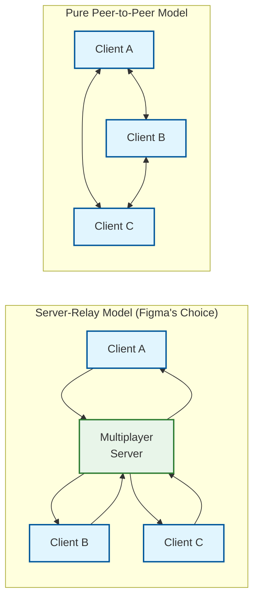
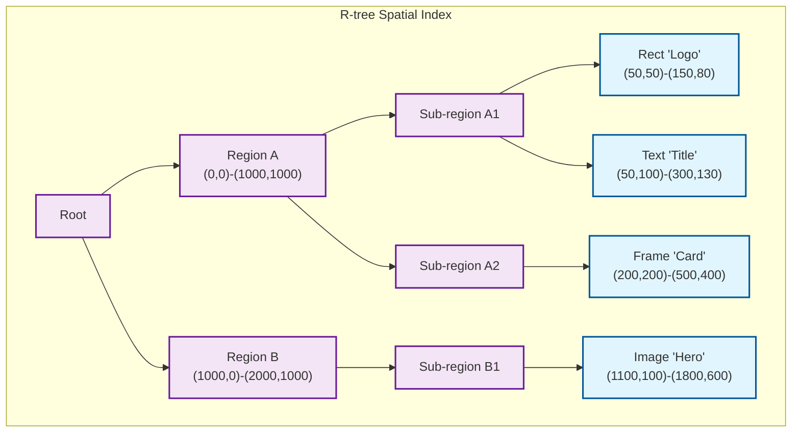
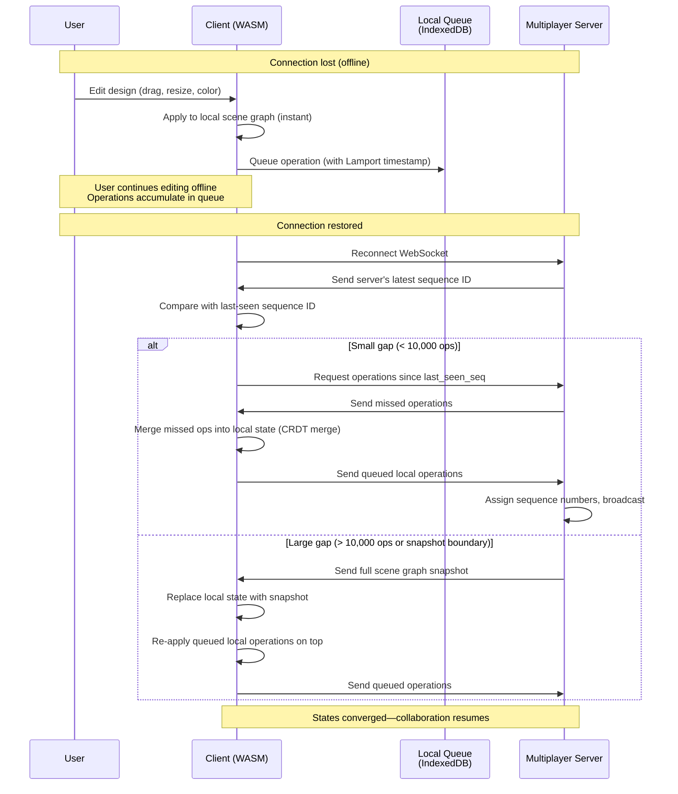

# Deep Dive & Bottlenecks

## 1. WebSocket Multiplayer: Server-Relay vs Pure P2P

### Architecture Comparison



| Factor | Server-Relay | Pure P2P |
|--------|-------------|----------|
| **Latency** | 1 hop through server (~50ms) | Direct (~20ms) |
| **Connection count** | N connections (1 per client) | N×(N-1)/2 mesh connections |
| **NAT traversal** | Not needed (server has public IP) | Required (STUN/TURN, 10-30% failure rate) |
| **Ordering** | Server assigns global sequence numbers | Requires vector clocks / Lamport timestamps |
| **Permission enforcement** | Server validates every operation | Must trust all peers |
| **Persistence** | Server writes to operation log in real-time | Requires separate persistence layer |
| **500 users** | 500 WebSocket connections to server | 124,750 peer connections (infeasible) |
| **Offline reconnect** | Client reconnects to server, catches up | Must discover peers, exchange state vectors |

**Why Figma chose server-relay**: With up to 500 concurrent editors, a mesh P2P topology is impractical (O(N²) connections). The server provides centralized ordering, permission validation, operation persistence, and acts as the rendezvous point for reconnecting clients. The latency cost (one extra hop) is acceptable for design tools where 50ms propagation is imperceptible during visual editing.

### Multiplayer Server Internal Architecture

```
Multiplayer Server (per active file)
├── WebSocket Connection Pool
│   ├── Client 1 (ws connection, auth context, last_ack_seq)
│   ├── Client 2 (...)
│   └── Client N (...)
│
├── Operation Processor
│   ├── Receive operation from client
│   ├── Assign monotonic sequence number
│   ├── Validate operation (permission, schema)
│   ├── Write to operation log (async, batched)
│   └── Fan out to all other connected clients
│
├── Document State Cache
│   ├── In-memory scene graph CRDT state (for validation)
│   ├── Latest sequence number
│   └── Periodic snapshot trigger
│
└── Presence Aggregator
    ├── Cursor positions (per client)
    ├── Selections (per client)
    ├── Viewport bounds (per client, for filtering)
    └── Broadcast scheduler (10-30 Hz)
```

### Fan-Out Optimization

With 500 users, each operation generates 499 outbound messages. Optimizations:

1. **Operation batching**: Collect operations for 16ms (one frame), send as a single batch
2. **Delta compression**: Binary-encode operations; compress with LZ4 for large batches
3. **Viewport filtering** (for cursor updates): Only send cursor positions to clients whose viewports overlap the cursor's position
4. **Page filtering**: Only send operations for the page a client is viewing (multi-page files)
5. **Read-only optimization**: Viewers receive operation batches at lower frequency (100ms vs 16ms)

---

## 2. Cursor Sync: Ephemeral State Design

### Why Cursors Use a Separate Channel

| Dimension | Document Operations | Cursor/Presence |
|-----------|---------------------|-----------------|
| **Volume** | 1-5 ops/sec per user | 10-30 updates/sec per user (mouse movement) |
| **Durability** | Must persist (operation log) | Must NOT persist (waste of storage) |
| **Consistency** | Strong eventual (CRDT) | Best-effort (stale cursor is fine) |
| **Failure impact** | Data loss | Temporarily invisible cursor |
| **Delivery guarantee** | At-least-once | At-most-once (latest value only) |
| **Bandwidth** | Priority | Throttled, sampled |

### Cursor Data Model

```
STRUCTURE CursorState:
    user_id: String
    client_id: Int
    user_name: String
    user_color: String          // Assigned per session (#e91e63, #2196f3, etc.)
    position: { x: Float, y: Float }    // Canvas coordinates
    page_id: PageID             // Which page the user is on
    selection: List<NodeID>     // Selected node IDs
    viewport: {
        x: Float, y: Float,
        width: Float, height: Float,
        zoom: Float
    }
    last_active: Timestamp      // For timeout detection
```

### Cursor Broadcasting Strategy

```
PSEUDOCODE: Viewport-Aware Cursor Broadcasting

FUNCTION broadcast_cursor(server, sender_client_id, cursor_state):
    sender_viewport = cursor_state.viewport
    sender_page = cursor_state.page_id

    FOR client IN server.connected_clients:
        IF client.id == sender_client_id:
            CONTINUE    // Don't echo back to sender

        // Filter 1: Same page?
        IF client.current_page != sender_page:
            CONTINUE    // Don't send cross-page cursors

        // Filter 2: Viewport overlap?
        IF NOT viewports_overlap(client.viewport, sender_viewport):
            // Cursor is off-screen for this client
            // Send at reduced rate (1 Hz) for minimap/presence list
            IF should_send_reduced_rate(client, sender_client_id):
                send_cursor_update(client, cursor_state, reduced=true)
            CONTINUE

        // Full rate: send cursor position
        send_cursor_update(client, cursor_state, reduced=false)

FUNCTION viewports_overlap(v1, v2):
    // Expand viewports by 20% margin for smooth entry/exit
    margin = 0.2
    expanded_v1 = expand(v1, margin)
    expanded_v2 = expand(v2, margin)
    RETURN rectangles_intersect(expanded_v1, expanded_v2)
```

### Cursor Rendering (Client-Side)

Unlike text editors where cursors map to character positions, design tool cursors are rendered at (x, y) canvas coordinates:

```
PSEUDOCODE: Cursor Rendering

FUNCTION render_cursors(canvas_context, remote_cursors, local_viewport):
    FOR cursor IN remote_cursors:
        // Transform canvas coordinates to screen coordinates
        screen_x = (cursor.position.x - local_viewport.x) * local_viewport.zoom
        screen_y = (cursor.position.y - local_viewport.y) * local_viewport.zoom

        // Skip if off-screen
        IF screen_x < -50 OR screen_x > viewport_width + 50:
            CONTINUE
        IF screen_y < -50 OR screen_y > viewport_height + 50:
            CONTINUE

        // Draw cursor arrow
        draw_cursor_arrow(canvas_context, screen_x, screen_y, cursor.user_color)

        // Draw name label
        draw_label(canvas_context, screen_x + 16, screen_y + 20,
                   cursor.user_name, cursor.user_color)

        // Draw selection outlines
        FOR node_id IN cursor.selection:
            node = scene_graph.get(node_id)
            IF node IS visible IN local_viewport:
                draw_selection_outline(canvas_context, node.bounds, cursor.user_color)
```

---

## 3. Large Canvas Performance: Viewport Culling and Spatial Indexing

### The Performance Problem

A Figma file can contain 500,000+ nodes, but the screen displays at most a few hundred at any zoom level. Rendering all nodes every frame wastes GPU bandwidth.

### Spatial Index: R-tree for Viewport Queries



```
PSEUDOCODE: Viewport Culling with R-tree

STRUCTURE RTree:
    root: RTreeNode

STRUCTURE RTreeNode:
    bounding_box: Rectangle
    children: List<RTreeNode>    // Internal node
    leaf_nodes: List<SceneNode>  // Leaf node

FUNCTION query_viewport(rtree, viewport_rect):
    visible_nodes = []
    _query_recursive(rtree.root, viewport_rect, visible_nodes)
    RETURN visible_nodes

FUNCTION _query_recursive(node, viewport, results):
    IF NOT rectangles_intersect(node.bounding_box, viewport):
        RETURN    // Entire subtree is off-screen, skip

    IF node IS leaf:
        FOR scene_node IN node.leaf_nodes:
            IF rectangles_intersect(scene_node.bounds, viewport):
                results.append(scene_node)
    ELSE:
        FOR child IN node.children:
            _query_recursive(child, viewport, results)

// R-tree update on node move/resize:
FUNCTION on_node_bounds_change(rtree, node_id, new_bounds):
    remove(rtree, node_id)
    insert(rtree, node_id, new_bounds)
    // Amortized O(log N) for balanced R-tree
```

### Level of Detail (LOD) Rendering

```
PSEUDOCODE: Level of Detail Based on Zoom

FUNCTION determine_render_quality(node, zoom_level):
    screen_size = node.bounds.size * zoom_level

    IF screen_size < 2 pixels:
        RETURN SKIP          // Too small to see

    IF screen_size < 10 pixels:
        RETURN BOUNDING_BOX  // Draw colored rectangle only

    IF screen_size < 50 pixels AND node.type == TEXT:
        RETURN PLACEHOLDER   // Gray lines instead of text rendering

    IF screen_size < 100 pixels AND node.has_complex_effects:
        RETURN SIMPLIFIED    // Skip blur, shadows

    RETURN FULL              // Full vector rendering with all effects

// At zoom 0.1x: A 1000px frame is 100px on screen → FULL
// At zoom 0.01x: A 1000px frame is 10px on screen → BOUNDING_BOX
// At zoom 1x: Everything visible is FULL quality
```

### Rendering Pipeline Overview

```
Scene Graph (WASM Memory)
    │
    ├── 1. Viewport Culling (R-tree query)
    │   └── Only nodes intersecting current viewport
    │
    ├── 2. LOD Classification
    │   └── Skip/BoundingBox/Simplified/Full per node
    │
    ├── 3. Sort by Z-order (fractional index)
    │   └── Bottom-to-top rendering order
    │
    ├── 4. Clip Stack Management
    │   └── Push/pop clip regions for frames with clipsContent=true
    │
    ├── 5. Vector Path Tessellation
    │   └── Convert cubic beziers → triangle strips for GPU
    │
    ├── 6. Fill/Stroke Rendering
    │   └── Solid colors, gradients, images → shader programs
    │
    ├── 7. Effects Pass
    │   └── Blur, shadow, blend modes → multi-pass rendering
    │
    ├── 8. Text Rendering
    │   └── Glyph atlas lookup → instanced rendering
    │
    └── 9. Overlay Rendering
        └── Selection handles, cursors, guides, comments
```

---

## 4. Vector Rendering Pipeline: Path to Pixels

### Why Not SVG/DOM?

| Capability | SVG/DOM | Custom WebGL Engine |
|-----------|---------|---------------------|
| Node count before jank | ~1,000 | 500,000+ |
| Boolean operations | Clip-path only (limited) | Full union/subtract/intersect/exclude |
| Blur effects | CSS filter (per-element) | Fragment shader (batched) |
| Gradient types | Linear, radial | Linear, radial, angular, diamond |
| Text rendering | Platform-dependent | Custom glyph rasterizer (consistent) |
| Memory layout | DOM objects (GC'd) | Linear WASM heap (predictable) |
| Frame independence | Layout recalculation | Direct GPU draw calls |

### Tessellation: Paths to Triangles

Vector paths (cubic Bezier curves) must be converted to triangles for GPU rendering:

```
PSEUDOCODE: Path Tessellation for WebGL

FUNCTION tessellate_path(path_commands):
    // Input: SVG-like path commands (M, L, C, Q, Z)
    // Output: Triangle list for GPU

    // Step 1: Flatten curves to polylines
    polyline = []
    FOR cmd IN path_commands:
        IF cmd.type == MOVE_TO:
            polyline.append(cmd.point)
        ELSE IF cmd.type == LINE_TO:
            polyline.append(cmd.point)
        ELSE IF cmd.type == CUBIC_BEZIER:
            // Adaptive subdivision based on curvature
            subdivided = adaptive_flatten_cubic(
                cmd.p0, cmd.p1, cmd.p2, cmd.p3,
                tolerance=0.5  // pixels
            )
            polyline.extend(subdivided)
        ELSE IF cmd.type == CLOSE:
            polyline.append(polyline[0])

    // Step 2: Triangulate the polygon
    // Using ear-clipping or constrained Delaunay triangulation
    triangles = triangulate_polygon(polyline)

    // Step 3: Generate stroke geometry (if stroked)
    IF path.has_stroke:
        stroke_triangles = generate_stroke_geometry(
            polyline, path.stroke_width, path.stroke_cap, path.stroke_join
        )
        triangles.extend(stroke_triangles)

    RETURN triangles

FUNCTION adaptive_flatten_cubic(p0, p1, p2, p3, tolerance):
    // Subdivide cubic bezier until segments are flat enough
    flatness = compute_flatness(p0, p1, p2, p3)
    IF flatness < tolerance:
        RETURN [p3]  // Flat enough, approximate with line
    ELSE:
        // De Casteljau subdivision at t=0.5
        (left, right) = split_cubic_at_half(p0, p1, p2, p3)
        RETURN adaptive_flatten_cubic(left..., tolerance)
             + adaptive_flatten_cubic(right..., tolerance)
```

### Glyph Atlas for Text Rendering

Text rendering in a design tool must be pixel-perfect across platforms. Figma uses a **glyph atlas** approach:

```
PSEUDOCODE: Glyph Atlas Text Rendering

STRUCTURE GlyphAtlas:
    texture: GPUTexture       // Large texture atlas (e.g., 4096x4096)
    entries: Map<GlyphKey, AtlasEntry>

STRUCTURE GlyphKey:
    font_family: String
    font_weight: Int
    glyph_id: Int
    size_bucket: Int          // Quantized size (12, 14, 16, 18, 20, 24, ...)

STRUCTURE AtlasEntry:
    uv_rect: { x, y, width, height }   // Position in atlas texture
    bearing: { x, y }                   // Glyph offset from baseline
    advance: Float                       // Horizontal advance width

FUNCTION render_text_node(text_node, atlas):
    glyphs = shape_text(text_node.characters, text_node.font, text_node.fontSize)

    cursor_x = text_node.x
    cursor_y = text_node.y + text_node.baseline_offset

    FOR glyph IN glyphs:
        key = GlyphKey(text_node.fontFamily, text_node.fontWeight,
                       glyph.id, quantize_size(text_node.fontSize))

        IF key NOT IN atlas.entries:
            // Rasterize glyph and add to atlas
            bitmap = rasterize_glyph(key)
            entry = atlas.add(key, bitmap)
        ELSE:
            entry = atlas.entries[key]

        // Draw textured quad at correct position
        draw_textured_quad(
            position: (cursor_x + entry.bearing.x, cursor_y - entry.bearing.y),
            size: (entry.uv_rect.width, entry.uv_rect.height),
            texture: atlas.texture,
            uv: entry.uv_rect,
            color: text_node.fill_color
        )

        cursor_x += entry.advance * (text_node.letterSpacing_factor)

    // Line wrapping, paragraph alignment handled by text layout engine
```

---

## 5. Font Rendering Consistency

### The Cross-Platform Problem

Different operating systems render fonts differently (hinting, subpixel rendering, line spacing). For a design tool, pixel-perfect consistency is critical because designers hand off exact measurements to developers.

### Figma's Solution

1. **Custom font rasterizer in WASM**: Does not use the browser's native text rendering. Instead, loads font files directly and rasterizes glyphs using a consistent algorithm compiled into the WASM binary.

2. **Font subsetting on upload**: When a user uses a custom font, only the required glyph subset is uploaded and distributed to collaborators—not the entire font file.

3. **Glyph metrics computed server-side**: To ensure all clients agree on text layout (line breaks, wrapping), glyph metrics (advance widths, kerning pairs, line heights) are computed from the font file once and cached, not derived from browser APIs.

4. **Fallback font handling**: When a font is unavailable, a deterministic fallback chain ensures all clients render the same fallback glyphs.

---

## 6. Component Override Propagation

### The Challenge

A design system may have a "Button" component used in 500+ instances across a file. When the main Button component changes:
- Properties **not overridden** in an instance must update
- Properties **overridden** in an instance must stay as the user set them
- **Nested components** (Button contains an Icon, which is also a component) cascade updates

### Override Resolution Matrix

| Main Component Change | Instance Has Override? | Result |
|----------------------|----------------------|--------|
| Change fill color | No override on fill | Instance updates to new color |
| Change fill color | Override on fill | Instance keeps overridden color |
| Add new child node | No override | Instance gains new child |
| Delete child node | No override on deleted child | Instance loses child |
| Delete child node | Override exists on deleted child | Instance keeps child (orphan rescue) |
| Change text content | Override on text | Instance keeps overridden text |
| Add new property | No override | Instance inherits new property |
| Rename child node | Override references old name | Override path remapped |

### Variant System

```
PSEUDOCODE: Variant Component Resolution

// A component set has variant axes:
// Button: { size: "small" | "medium" | "large", state: "default" | "hover" | "pressed" }

STRUCTURE ComponentSet:
    id: ComponentSetID
    variant_axes: Map<String, List<String>>    // { "size": ["small","medium","large"], "state": [...] }
    variants: Map<VariantKey, ComponentNode>   // { "size=medium,state=hover": ComponentNode }

FUNCTION resolve_variant(instance, component_set):
    // Instance stores its variant selections
    variant_key = build_key(instance.variant_selections)

    IF variant_key IN component_set.variants:
        RETURN component_set.variants[variant_key]
    ELSE:
        // Fallback to default variant
        RETURN component_set.variants[component_set.default_key]

FUNCTION swap_variant(instance, axis, new_value):
    old_variant = resolve_variant(instance, component_set)
    instance.variant_selections[axis] = new_value
    new_variant = resolve_variant(instance, component_set)

    // Preserve overrides that apply to both variants
    // Remove overrides that reference nodes only in old variant
    instance.overrides = remap_overrides(
        instance.overrides,
        old_variant.children,
        new_variant.children
    )
```

---

## 7. CRDTs vs OT for Design Documents

### Why Figma's CRDT Model Is Simpler Than Text Editor CRDTs

| Aspect | Text Editor CRDT | Design Tool CRDT (Figma) |
|--------|-----------------|--------------------------|
| **Primary operation** | Insert/delete characters in a sequence | Set property on a node (LWW register) |
| **Ordering requirement** | Critical—character order defines content | Minimal—layer order uses fractional indexing |
| **Conflict frequency** | High—two users typing in same paragraph | Low—two users editing same property of same node is rare |
| **Conflict resolution** | Complex (interleaving, intention preservation) | Simple (last-writer-wins per property) |
| **Tombstones** | Grow with every deletion | Minimal—node deletion is a single tombstone per node, not per character |
| **Memory overhead** | 4-32 bytes per character | 8-16 bytes per property per node (far fewer entries) |
| **Undo complexity** | Must inverse character-level operations | Snapshot property values per undo group |

### Why LWW Works for Design (and Fails for Text)

In a text editor, LWW would mean "if two users type at the same position, one user's text disappears." This is unacceptable—both users' text must be preserved.

In a design tool, LWW is acceptable and even desirable:
- If two users change the same rectangle's color simultaneously, there's no meaningful "merge" of two colors—one must win
- If two users drag the same object to different positions, the object can only be in one place—last move wins
- The granularity (property-level, not character-level) means conflicts are rare in practice

### Figma's Specific CRDT Approach

```
PSEUDOCODE: Figma-Style CRDT Resolution

// Each property has: (value, lamport_timestamp, replica_id)
// Lamport timestamp ensures causal ordering
// Replica ID breaks ties deterministically

FUNCTION resolve_conflict(local, remote):
    IF remote.timestamp > local.timestamp:
        RETURN remote    // Remote is newer
    ELSE IF remote.timestamp == local.timestamp:
        IF remote.replica_id > local.replica_id:
            RETURN remote    // Tie-break by replica ID
        ELSE:
            RETURN local
    ELSE:
        RETURN local     // Local is newer

// This resolution is:
// - Commutative: resolve(A,B) same winner as resolve(B,A)
// - Associative: resolve(resolve(A,B),C) = resolve(A,resolve(B,C))
// - Idempotent: resolve(A,A) = A
// Therefore: all clients converge to same state regardless of operation order
```

---

## 8. Offline Mode: Local Queue and Reconnect

### Offline Architecture



### Offline Queue Management

```
PSEUDOCODE: Offline Operation Queue

STRUCTURE OfflineQueue:
    operations: List<Operation>      // Ordered by local timestamp
    last_server_seq: Int             // Last acknowledged server sequence
    max_queue_size: 10000            // Safety limit

FUNCTION enqueue(queue, operation):
    IF queue.operations.length >= queue.max_queue_size:
        // Force user to reconnect or save locally
        WARN "Offline queue full—please reconnect to sync"
        RETURN

    queue.operations.append(operation)
    persist_to_indexeddb(queue)

FUNCTION on_reconnect(queue, server):
    server_seq = server.get_latest_sequence()

    IF server_seq - queue.last_server_seq > SNAPSHOT_THRESHOLD:
        // Too many missed operations—request full state
        full_state = server.get_full_scene_graph()
        local_state.replace(full_state)
    ELSE:
        // Incremental catch-up
        missed_ops = server.get_operations_since(queue.last_server_seq)
        FOR op IN missed_ops:
            local_state.merge(op)    // CRDT merge always succeeds

    // Send local queued operations
    FOR op IN queue.operations:
        server.send(op)

    queue.operations.clear()
    queue.last_server_seq = server.get_latest_sequence()
```

---

## 9. Branching and Merge for Design Files

### Three-Way Merge for Design Branches

When a designer creates a branch, the system forks the scene graph at the current sequence number. Merging uses three-way comparison:

```
PSEUDOCODE: Three-Way Design Merge

FUNCTION three_way_merge(base, main, branch):
    // base: state at branch point
    // main: current state of main file
    // branch: current state of branch

    merged = deep_clone(main)
    conflicts = []

    // Compare each node in branch against base
    FOR node_id IN all_node_ids(base, main, branch):
        base_node = base.get(node_id)
        main_node = main.get(node_id)
        branch_node = branch.get(node_id)

        IF base_node IS null AND branch_node IS NOT null:
            // Node added in branch → add to merged
            merged.add(node_id, branch_node)

        ELSE IF branch_node IS null AND base_node IS NOT null:
            IF main_node == base_node:
                // Deleted in branch, unchanged in main → delete
                merged.remove(node_id)
            ELSE:
                // Deleted in branch, changed in main → CONFLICT
                conflicts.append(DeleteVsModifyConflict(node_id))

        ELSE IF base_node IS NOT null AND branch_node IS NOT null AND main_node IS NOT null:
            // Node exists in all three—merge properties
            FOR property IN all_properties(base_node, main_node, branch_node):
                base_val = base_node.get(property)
                main_val = main_node.get(property)
                branch_val = branch_node.get(property)

                IF branch_val != base_val AND main_val == base_val:
                    // Changed in branch only → accept branch change
                    merged.set(node_id, property, branch_val)
                ELSE IF branch_val != base_val AND main_val != base_val:
                    IF branch_val == main_val:
                        // Both made same change → no conflict
                        CONTINUE
                    ELSE:
                        // Both changed differently → CONFLICT
                        conflicts.append(PropertyConflict(
                            node_id, property, main_val, branch_val
                        ))

    RETURN (merged, conflicts)
```

### Visual Diff for Merge Review

Before merging, the system generates a visual diff:
- **Added nodes**: Highlighted in green on the canvas
- **Deleted nodes**: Shown as ghosts with red overlay
- **Modified nodes**: Side-by-side comparison with changed properties listed
- **Conflicts**: Interactive resolution UI—choose main, branch, or manual edit

---

## Key Bottleneck Summary

| Bottleneck | Impact | Mitigation |
|-----------|--------|------------|
| **500-user fan-out** | 499 messages per operation | Batch operations (16ms windows), delta compression, page/viewport filtering |
| **Large scene graphs (500K nodes)** | Slow file open, high memory | Lazy page loading, R-tree viewport culling, LOD rendering |
| **Font consistency** | Different platforms render text differently | Custom WASM font rasterizer, glyph atlas, server-side metrics |
| **Component cascade** | Single component change updates 500+ instances | Batch instance updates, background propagation, dirty flag optimization |
| **Offline divergence** | Long offline sessions create large operation queues | Queue size limits, forced snapshot reload for large gaps |
| **Plugin performance** | Plugins can read/modify thousands of nodes | Message-passing overhead, batched reads, capability limits |
| **Branch merge** | Three-way merge on complex scene graphs | Visual diff UI, property-level granularity, conflict resolution UX |
| **WebGL context limits** | Browser limits GPU memory per tab | Texture atlas management, geometry LOD, progressive loading |
| **R-tree update cost** | Every node move/resize updates spatial index | Batch updates during drag (update on mouse-up), lazy rebuilds |
