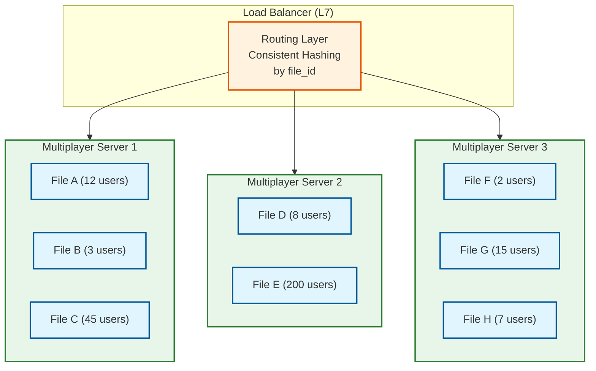

# Scalability & Reliability

## Multiplayer Server Sharding

### Sharding Strategy: By Document ID (Sticky Routing)

Each active file is assigned to exactly one multiplayer server instance. All WebSocket connections for a file route to the same server, which holds the document's active session state in memory.



### Routing Mechanism

```
PSEUDOCODE: File-to-Server Routing

FUNCTION route_connection(file_id, server_pool):
    // Step 1: Check if file has an active session
    active_server = session_registry.get(file_id)
    IF active_server IS NOT null AND active_server.is_healthy():
        RETURN active_server

    // Step 2: Assign via consistent hashing (new session)
    target_server = consistent_hash(file_id, server_pool)

    // Step 3: Register the session
    session_registry.set(file_id, target_server, ttl=SESSION_TIMEOUT)

    // Step 4: Server loads document state into memory
    target_server.initialize_session(file_id)

    RETURN target_server

// Session registry: distributed key-value store (e.g., Redis)
// TTL: session expires after all users disconnect (+ grace period)
```

### Session Lifecycle

```
Session States:
  INACTIVE → LOADING → ACTIVE → DRAINING → INACTIVE

INACTIVE:   No users connected, no memory allocated
LOADING:    First user connected, loading scene graph from storage
ACTIVE:     1+ users connected, processing operations
DRAINING:   Last user disconnected, grace period before shutdown
            (60-second grace to handle reconnects)
INACTIVE:   Grace period expired, flush final state, free memory
```

### Hot Document Handling

Some files (shared design systems, community templates) attract hundreds of simultaneous users:

| Strategy | Description |
|----------|-------------|
| **Dedicated server** | Files with > 200 connections get a dedicated server instance |
| **Read replica** | Viewers connect to read-only replicas; editors connect to primary |
| **Operation batching** | At high user counts, batch operations into 32ms windows (vs 16ms default) |
| **Cursor downsampling** | At > 50 users, cursor updates sent at 10 Hz instead of 30 Hz |
| **Page partitioning** | Users on different pages route to different servers (if file has 10+ pages) |

---

## Document Storage Architecture

### Dual Storage Model

```
┌─────────────────────────────────────────────┐
│              Access Patterns                 │
│                                             │
│  "Open file"  ──→  Scene Graph Blob Store   │
│  "Sync edits" ──→  Operation Log            │
│  "View history"──→  Version Snapshots       │
│  "Load asset" ──→  Asset Storage + CDN      │
│                                             │
└─────────────────────────────────────────────┘
```

### Scene Graph Storage

| Storage Tier | Data | Access Pattern | Storage Type |
|-------------|------|----------------|--------------|
| **Hot (in-memory)** | Active sessions (currently open files) | Random access, sub-ms | Multiplayer server RAM |
| **Warm (SSD cache)** | Recently accessed files (last 7 days) | Sequential read, < 50ms | Distributed cache (e.g., Redis cluster) |
| **Cold (object store)** | All files | Sequential read, < 500ms | Object storage (replicated) |
| **Archive** | Deleted files (30-day retention) | Rare access | Cold object storage |

### Binary Scene Graph Format

```
Scene Graph Binary Format (custom, not JSON):

Header (32 bytes):
  [4B] Magic number ("FGSG")
  [4B] Format version
  [8B] File ID
  [4B] Node count
  [4B] Page count
  [8B] Checksum (CRC-64)

Page Table:
  FOR each page:
    [16B] Page ID
    [4B]  Node count in page
    [4B]  Offset to page data

Node Data (per page):
  FOR each node:
    [16B] Node ID
    [1B]  Node type (enum)
    [16B] Parent ID
    [8B]  Sort order (double)
    [2B]  Property count
    FOR each property:
      [1B]  Property key (enum, compacted)
      [1B]  Value type (int, float, string, color, array, ...)
      [VB]  Value (variable length, type-dependent)

Advantages over JSON:
  - 5-10x smaller (no key strings, no whitespace, compact types)
  - Direct memory mapping (no parsing step in WASM)
  - Streaming decode (render first page while loading others)
```

### Scene Graph as Binary Blob vs Structured Format

| Approach | Binary Blob (Figma's Choice) | Structured (Relational) |
|----------|------------------------------|------------------------|
| **Load time** | Single read, memory-map | Multiple queries across tables |
| **Size** | Compact (5-10x smaller than JSON) | Row overhead, indexes, normalization |
| **Partial load** | Page-level granularity | Row-level granularity |
| **Atomic update** | Write full blob (or binary patch) | Row-level updates |
| **Queryability** | Cannot query node properties via SQL | Full SQL queries on nodes |
| **Search** | Requires separate search index | Can query directly |
| **Versioning** | Store entire blobs as snapshots | Need change-tracking per row |

**Why binary blob wins**: File open is the #1 latency-sensitive operation. A single sequential read of a compact binary format is 10-50x faster than joining relational tables to reconstruct a scene graph. The queryability trade-off is acceptable because search is handled by a separate index.

---

## Asset Storage and CDN Strategy

### Asset Pipeline

```
Upload Flow:
  Client → API Gateway → Asset Service → Object Storage → CDN Warm

  1. Client uploads image/font
  2. Asset Service computes content hash (SHA-256)
  3. Check for duplicate (same hash = same content)
  4. Store with content-addressable key: assets/{hash_prefix}/{full_hash}
  5. Generate thumbnails (multiple sizes) asynchronously
  6. Store reference in file metadata: { node_id → asset_hash }

Download Flow:
  Client → CDN → (cache miss) → Object Storage → CDN → Client

  1. Client requests asset by hash: cdn.example.com/assets/{hash}
  2. CDN checks edge cache (90%+ hit rate for popular assets)
  3. On cache miss, CDN fetches from origin object storage
  4. Immutable caching: assets never change (content-addressable)
  5. Cache-Control: public, max-age=31536000, immutable
```

### Content-Addressable Storage Benefits

| Benefit | Description |
|---------|-------------|
| **Deduplication** | Same image used in 100 files stored once |
| **Immutable caching** | Hash-based URLs enable infinite cache TTL |
| **Integrity verification** | Hash serves as checksum |
| **Garbage collection** | Remove assets when no file references remain |
| **CDN efficiency** | Same URL across all users = maximum cache reuse |

### Image Processing Pipeline

```
Original Upload (10 MB JPEG)
├── Full resolution: assets/{hash}/original
├── Preview (2048px max): assets/{hash}/preview
├── Thumbnail (512px): assets/{hash}/thumb
├── Tiny (64px, blur placeholder): assets/{hash}/tiny
└── WebP variants: assets/{hash}/original.webp, .../preview.webp
```

### Font Distribution

```
Font Upload Flow:
  1. User activates custom font
  2. Client requests font file from Font Service
  3. Font Service subsets font (only glyphs used in file)
  4. Subset cached per file × font combination
  5. Other collaborators download same subset

Font Subset Sizing:
  Full font: ~500 KB
  English subset: ~50 KB
  File-specific subset: ~10-30 KB
  Savings: 90-95% bandwidth reduction
```

---

## Autoscaling Multiplayer Servers

### Scaling Dimensions

| Dimension | Metric | Scale Action |
|-----------|--------|-------------|
| **Connection count** | WebSocket connections per server | Add servers, rebalance files |
| **CPU utilization** | Operation processing, CRDT merge | Add servers, migrate sessions |
| **Memory usage** | Scene graph state in RAM | Add servers with more RAM, or offload cold sessions |
| **Network I/O** | Fan-out bandwidth per server | Reduce batch window, add servers |

### Autoscaling Policy

```
PSEUDOCODE: Multiplayer Server Autoscaler

FUNCTION evaluate_scaling():
    metrics = collect_cluster_metrics()

    // Scale-up triggers (any one triggers)
    IF metrics.avg_cpu > 70%:
        scale_up(1)
    IF metrics.avg_connections_per_server > 8000:
        scale_up(ceil(metrics.total_connections / 8000) - metrics.server_count)
    IF metrics.avg_memory > 80%:
        scale_up(1)
    IF metrics.p99_operation_latency > 100ms:
        scale_up(2)    // Urgent: latency degradation

    // Scale-down triggers (all must be true)
    IF metrics.avg_cpu < 30%
       AND metrics.avg_connections_per_server < 3000
       AND metrics.avg_memory < 40%
       AND no_recent_scale_up(cooldown=10min):
        scale_down(1)

FUNCTION scale_up(count):
    new_servers = provision(count)
    // New files will be routed to new servers
    // Existing files stay on current servers (no live migration)
    update_consistent_hash_ring(add=new_servers)

FUNCTION scale_down(count):
    // Select servers with fewest active sessions
    candidates = sort_by_session_count(servers, ascending=true)
    FOR server IN candidates[:count]:
        // Drain: stop accepting new sessions
        server.set_draining()
        // Wait for all sessions to end naturally (or timeout after 1 hour)
        // Then remove from pool
```

### Session Migration (Planned Maintenance)

```
PSEUDOCODE: Graceful Session Migration

FUNCTION migrate_session(file_id, from_server, to_server):
    // Step 1: Pause incoming operations briefly (~100ms)
    from_server.pause_session(file_id)

    // Step 2: Serialize session state
    state = from_server.serialize_session(file_id)
    // Includes: scene graph CRDT, connected clients, pending operations

    // Step 3: Transfer to new server
    to_server.restore_session(file_id, state)

    // Step 4: Update routing
    session_registry.set(file_id, to_server)

    // Step 5: Redirect clients
    from_server.redirect_clients(file_id, to_server.websocket_url)
    // Clients reconnect to new server (< 200ms disruption)

    // Step 6: Clean up old session
    from_server.destroy_session(file_id)
```

---

## Disaster Recovery

### Point-in-Time Restore

```
Recovery Architecture:

  Scene Graph Blob (current state)
  +
  Operation Log (30-day rolling window, partitioned by file_id)
  +
  Version Snapshots (periodic, named by user)
  =
  Any point-in-time state recoverable

Restore Process:
  1. Load nearest snapshot before target time
  2. Replay operations from snapshot to target time
  3. Present restored state to user
  4. User confirms → new version created with restored state
```

### Failure Scenarios and Recovery

| Failure | Impact | Recovery | RTO | RPO |
|---------|--------|----------|-----|-----|
| **Single multiplayer server crash** | Users on that server disconnect | Clients reconnect, routed to new server; load from last checkpoint | < 30s | 0 (operations flushed every 1s) |
| **All multiplayer servers down** | No real-time collaboration | Clients fall back to offline mode; edits queued locally | < 5min | 0 (client has full state) |
| **Scene graph storage failure** | Cannot open files not already loaded | Failover to replica; restore from backup | < 5min | < 1s |
| **Operation log loss** | Version history gaps | Reconstruct from scene graph snapshots; lose fine-grained history | < 1hr | < 10min (snapshot interval) |
| **CDN failure** | Cannot load images/fonts | Fallback to origin storage; reduced performance | < 2min | 0 (origin is source of truth) |
| **Full data center failure** | All services down in region | Failover to secondary region; DNS failover | < 10min | < 1min |
| **Catastrophic data loss** | Server-side data destroyed | Clients hold full scene graph → reconstruct from client state | Hours | Varies (depends on which clients are online) |

### Multi-Region Architecture

```
Primary Region (e.g., US-West):
  ├── Multiplayer servers (active)
  ├── Scene graph storage (primary)
  ├── Operation log (primary)
  └── Asset storage (primary)

Secondary Region (e.g., EU-West):
  ├── Multiplayer servers (standby, warm)
  ├── Scene graph storage (async replica, < 30s lag)
  ├── Operation log (async replica)
  └── Asset storage (async replica)

Failover:
  1. Health checks detect primary region failure
  2. DNS failover to secondary region (< 5 min)
  3. Secondary multiplayer servers activate
  4. Clients reconnect to secondary region
  5. Async replication gap: clients may re-send recent operations (CRDT handles duplicates)
```

---

## Graceful Degradation

### Degradation Levels

| Level | Condition | User Experience |
|-------|-----------|-----------------|
| **Full service** | All systems healthy | Real-time collaboration, all features |
| **Degraded multiplayer** | Multiplayer servers overloaded | Increased latency (100-200ms), cursor updates reduced |
| **Single-player mode** | Multiplayer service down | Full editing capability, no collaboration; edits queued for sync |
| **Read-only mode** | Storage write failures | Can view files, cannot edit; clear error message |
| **Offline mode** | No network connectivity | Full editing locally; sync when reconnected |
| **Critical failure** | WASM engine crash | Reload page; local state preserved in IndexedDB |

### Circuit Breaker Pattern

```
PSEUDOCODE: Multiplayer Connection Circuit Breaker

STRUCTURE CircuitBreaker:
    state: CLOSED | OPEN | HALF_OPEN
    failure_count: Int
    last_failure_time: Timestamp
    threshold: 5              // failures before opening
    reset_timeout: 30s        // time before trying again

FUNCTION on_connection_attempt(circuit_breaker):
    IF circuit_breaker.state == OPEN:
        IF now() - circuit_breaker.last_failure_time > reset_timeout:
            circuit_breaker.state = HALF_OPEN
            RETURN TRY_CONNECT
        ELSE:
            RETURN USE_OFFLINE_MODE

    IF circuit_breaker.state == HALF_OPEN:
        RETURN TRY_CONNECT

    RETURN TRY_CONNECT

FUNCTION on_connection_success(circuit_breaker):
    circuit_breaker.state = CLOSED
    circuit_breaker.failure_count = 0

FUNCTION on_connection_failure(circuit_breaker):
    circuit_breaker.failure_count += 1
    circuit_breaker.last_failure_time = now()

    IF circuit_breaker.failure_count >= circuit_breaker.threshold:
        circuit_breaker.state = OPEN
        notify_user("Collaboration temporarily unavailable. Your edits are saved locally.")
```

---

## Rate Limiting and Abuse Prevention

### Per-User Rate Limits

| Action | Limit | Window | Enforcement Point |
|--------|-------|--------|-------------------|
| File opens | 30/min | Sliding window | API Gateway |
| REST API calls | 100/min | Sliding window | API Gateway |
| WebSocket operations | 120/sec | Token bucket | Multiplayer Server |
| Cursor updates | 30/sec | Client-side throttle + server cap | Client + Server |
| File exports | 10/min | Sliding window | Export Service |
| Comments | 20/min | Sliding window | API Gateway |
| Branch creation | 5/hour | Fixed window | API Gateway |

### Per-Plugin Rate Limits

| Action | Limit | Window | Enforcement |
|--------|-------|--------|-------------|
| Scene graph reads | 1000/sec | Token bucket | Plugin Bridge |
| Node creation | 100/sec | Token bucket | Plugin Bridge |
| Property modifications | 500/sec | Token bucket | Plugin Bridge |
| Network requests (if permitted) | 10/sec | Sliding window | Plugin Bridge |
| Memory usage | 256 MB max | Continuous | Plugin Sandbox |
| Execution time | 60 seconds max | Per invocation | Plugin Runtime |

### Abuse Detection

```
PSEUDOCODE: Detect Malicious Operation Patterns

FUNCTION monitor_operations(user_id, file_id, ops_per_second):
    // Pattern 1: Operation flood (possible script injection)
    IF ops_per_second > 200:
        throttle_user(user_id, file_id, max_rate=50)
        alert("High operation rate", user_id, file_id)

    // Pattern 2: Mass node creation (possible plugin abuse)
    IF count_creates_in_window(user_id, 60s) > 5000:
        block_creates(user_id, file_id, duration=300s)
        alert("Mass node creation", user_id, file_id)

    // Pattern 3: Rapid file switching (possible data scraping)
    IF count_file_opens(user_id, 300s) > 100:
        rate_limit_opens(user_id, max_rate=2/min)
        alert("Rapid file access", user_id)
```

---

## Data Lifecycle Management

### Retention Policies

| Data Type | Hot Retention | Warm Retention | Cold Retention | Archive |
|-----------|---------------|----------------|----------------|---------|
| Scene graph (current) | Indefinite (while file exists) | — | — | 30 days after file deletion |
| Operation log | 30 days | — | 90 days (compressed) | Purged after 90 days |
| Version snapshots | 30 days | 1 year | 3 years | Purged after 3 years |
| Named versions | Indefinite | — | — | 30 days after file deletion |
| Image assets | Indefinite (while referenced) | — | — | GC'd when unreferenced |
| Comments | Indefinite | — | — | 30 days after file deletion |
| Audit logs | 1 year | 3 years | 7 years | Per compliance requirement |

### Storage Cost Optimization

| Strategy | Savings | Trade-off |
|----------|---------|-----------|
| **Operation log compaction** | 60-80% | Lose per-keystroke granularity after 30 days |
| **Scene graph compression** (LZ4) | 70-85% | CPU cost on load/save (< 10ms for LZ4) |
| **Image deduplication** | 30-50% | Content hash computation on upload |
| **Cold storage tiering** | 80% cost reduction | Higher access latency (< 500ms) |
| **Font subsetting** | 90-95% per download | Subsetting computation on first access |
| **Thumbnail pre-generation** | Reduces re-renders | Storage for multiple sizes per frame |
