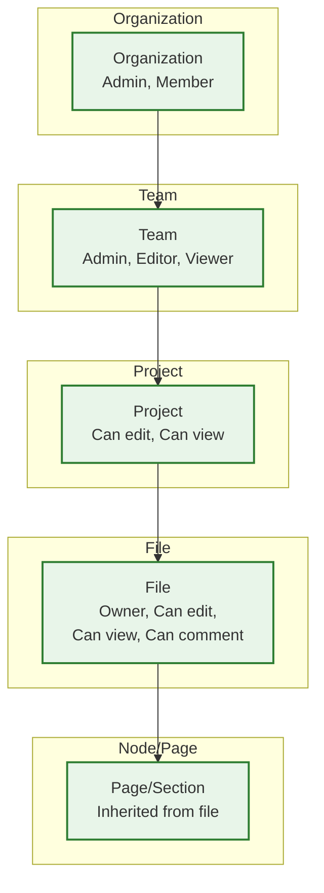

# Security & Compliance

## Authentication

### Authentication Methods

| Method | Use Case | Flow |
|--------|----------|------|
| **Email + Password** | Individual accounts | Argon2id password hashing, rate-limited login |
| **OAuth 2.0 (Google, GitHub)** | Social login | Authorization code flow with PKCE |
| **SSO / SAML 2.0** | Enterprise organizations | IdP-initiated or SP-initiated, assertion validation |
| **SCIM 2.0** | Enterprise user provisioning | Automated user create/update/deactivate from IdP |
| **API Tokens** | Plugin developers, CI/CD integrations | Scoped personal access tokens with expiry |

### Session Management

```
PSEUDOCODE: Session Architecture

STRUCTURE Session:
    session_id: String          // Opaque, random, 256-bit
    user_id: UserID
    device_id: String           // Fingerprint for device binding
    created_at: Timestamp
    expires_at: Timestamp       // Sliding expiry (30 days inactive)
    scopes: List<String>        // Permissions granted
    ip_address: String          // For audit logging
    mfa_verified: Boolean

// WebSocket authentication:
// 1. Client authenticates via REST → receives session token
// 2. Client opens WebSocket with session token in first message
// 3. Server validates token, binds WebSocket to authenticated user
// 4. Token refresh happens via REST; WebSocket stays connected

FUNCTION authenticate_websocket(ws_connection, token):
    session = validate_session_token(token)
    IF session IS null OR session.expired():
        ws_connection.close(4001, "Authentication required")
        RETURN

    file_id = extract_file_id(ws_connection.url)
    IF NOT has_file_access(session.user_id, file_id):
        ws_connection.close(4003, "Access denied")
        RETURN

    ws_connection.user = session.user_id
    ws_connection.permissions = get_file_permissions(session.user_id, file_id)
```

### Multi-Factor Authentication

| MFA Method | Support Level |
|------------|--------------|
| TOTP (Authenticator apps) | Full support |
| WebAuthn / Passkeys | Full support |
| SMS (fallback) | Discouraged, available |
| Hardware security keys | Supported via WebAuthn |

---

## Authorization

### Permission Model



### Permission Hierarchy

| Level | Roles | Inherits From |
|-------|-------|---------------|
| **Organization** | Owner, Admin, Member | — |
| **Team** | Admin, Editor, Viewer | Organization role |
| **Project** | Can edit, Can view | Team role |
| **File** | Owner, Can edit, Can view, Can comment | Project role (can be overridden) |
| **Branch** | Same as file | File role |

### File Permission Matrix

| Action | Owner | Can Edit | Can View | Can Comment | Public Link (View) |
|--------|-------|----------|----------|-------------|-------------------|
| View file | Yes | Yes | Yes | Yes | Yes |
| Edit canvas | Yes | Yes | No | No | No |
| Add comments | Yes | Yes | No | Yes | No |
| Export assets | Yes | Yes | Yes | No | Configurable |
| Invite users | Yes | Yes | No | No | No |
| Change permissions | Yes | No | No | No | No |
| Delete file | Yes | No | No | No | No |
| View version history | Yes | Yes | Yes | No | No |
| Restore version | Yes | Yes | No | No | No |
| Create branch | Yes | Yes | No | No | No |
| Run plugins | Yes | Yes | No | No | No |
| Copy file | Yes | Yes | Configurable | No | No |
| Use in library | Yes | Yes | No | No | No |

### Link Sharing

```
PSEUDOCODE: Link Sharing Permission Check

STRUCTURE ShareLink:
    link_id: String           // Random URL-safe token
    file_id: FileID
    permission: "view" | "edit" | "comment"
    password: String?         // Optional password protection
    expires_at: Timestamp?    // Optional expiry
    allow_copy: Boolean       // Can viewer duplicate file?
    allow_export: Boolean     // Can viewer export assets?
    created_by: UserID
    domain_restriction: String?  // Optional: only @company.com

FUNCTION check_link_access(link_token, user):
    link = links_db.get(link_token)

    IF link IS null:
        RETURN DENIED("Invalid link")

    IF link.expires_at IS NOT null AND now() > link.expires_at:
        RETURN DENIED("Link expired")

    IF link.password IS NOT null AND NOT user.verified_link_password:
        RETURN REQUIRE_PASSWORD

    IF link.domain_restriction IS NOT null:
        IF user.email_domain != link.domain_restriction:
            RETURN DENIED("Domain restricted")

    RETURN GRANTED(link.permission)
```

### Operation-Level Authorization

Every WebSocket operation is validated before processing:

```
PSEUDOCODE: Operation Authorization

FUNCTION authorize_operation(user_id, file_id, operation):
    permission = get_effective_permission(user_id, file_id)

    MATCH operation.type:
        CASE "set_property", "create_node", "delete_node":
            REQUIRE permission >= CAN_EDIT

        CASE "create_comment":
            REQUIRE permission >= CAN_COMMENT

        CASE "cursor_update":
            REQUIRE permission >= CAN_VIEW

        CASE "export":
            IF share_link.allow_export == false AND permission == CAN_VIEW:
                RETURN DENIED("Export not allowed for viewers")
            REQUIRE permission >= CAN_VIEW

    IF NOT authorized:
        log_security_event("unauthorized_operation", user_id, file_id, operation.type)
        RETURN REJECTED
```

---

## Plugin Security

### Sandbox Architecture

```
┌─────────────────────────────────────┐
│ Host Environment (Main Thread)       │
│                                     │
│  ┌───────────────────────────────┐  │
│  │ Plugin Bridge                  │  │
│  │  ├── Capability Enforcer       │  │
│  │  ├── Rate Limiter              │  │
│  │  ├── Input Sanitizer           │  │
│  │  └── Audit Logger              │  │
│  └────────────┬──────────────────┘  │
│               │ postMessage()        │
│  ─────────────┼───────────────────  │
│    Sandbox    │  Boundary            │
│  ─────────────┼───────────────────  │
│               │                      │
│  ┌────────────┴──────────────────┐  │
│  │ Plugin iframe (sandboxed)     │  │
│  │  ├── sandbox="allow-scripts"  │  │
│  │  ├── No DOM access            │  │
│  │  ├── No localStorage          │  │
│  │  ├── No cookies               │  │
│  │  ├── No top-level navigation  │  │
│  │  └── CSP: script-src 'self'   │  │
│  └───────────────────────────────┘  │
└─────────────────────────────────────┘
```

### Plugin Manifest (Capabilities Declaration)

```
STRUCTURE PluginManifest:
    id: String
    name: String
    version: String
    author: String
    capabilities:
        read_document: Boolean       // Can read scene graph
        write_document: Boolean      // Can modify scene graph
        read_selection: Boolean      // Can read user selection
        create_ui: Boolean           // Can show custom UI panel
        network_access: List<String> // Allowed domains (e.g., ["api.example.com"])
        store_data: Boolean          // Can persist per-file plugin data
    resource_limits:
        max_memory_mb: 256
        max_execution_seconds: 60
        max_nodes_read: 10000
        max_nodes_create: 1000
```

### Plugin API Security Boundaries

| Plugin Action | Validation |
|---------------|------------|
| Read node properties | Check `read_document` capability; redact sensitive data |
| Modify node properties | Check `write_document` capability; validate property types |
| Create nodes | Check `write_document`; enforce `max_nodes_create` |
| Delete nodes | Check `write_document`; prevent deletion of locked nodes |
| Network request | Check `network_access` allowlist; block private IPs |
| Show UI | Check `create_ui`; iframe sandboxed with CSP |
| Access user data | Limited to current user's display name and ID |
| Read comments | Not allowed (privacy boundary) |
| Access other files | Not allowed (file boundary) |

### Plugin Review Process

| Stage | Check |
|-------|-------|
| **Automated scan** | Static analysis for malicious patterns, dependency audit |
| **Capability review** | Verify requested capabilities match plugin description |
| **Network review** | Validate declared network domains are legitimate |
| **Manual review** | For plugins requesting sensitive capabilities |
| **Runtime monitoring** | Track resource usage, error rates, user reports |
| **Incident response** | Ability to disable any plugin globally within minutes |

---

## Data Encryption

### Encryption at Rest

| Data Type | Encryption Method | Key Management |
|-----------|-------------------|----------------|
| Scene graph blobs | AES-256-GCM | Per-file encryption key, wrapped by team key |
| Operation log | AES-256-GCM | Per-file key (same as scene graph) |
| User credentials | Argon2id (passwords); encrypted at rest (tokens) | Application-level key hierarchy |
| Image assets | AES-256-GCM | Per-file key or per-team key |
| Database fields (PII) | Column-level encryption (AES-256) | Dedicated PII key |
| Backups | AES-256-GCM | Backup-specific key, rotated quarterly |

### Encryption in Transit

| Channel | Protocol | Certificate |
|---------|----------|-------------|
| REST API | TLS 1.3 (minimum TLS 1.2) | RSA-2048 or ECDSA P-256 |
| WebSocket | WSS (TLS 1.3) | Same as REST |
| CDN | TLS 1.3 | Managed certificates |
| Internal service-to-service | mTLS | Internal CA |
| Database connections | TLS 1.2+ | Server certificates |

### Key Hierarchy

```
Root Key (HSM-protected, never exported)
├── Organization Master Key (per org)
│   ├── Team Key (per team)
│   │   ├── File Key (per file) → encrypts scene graph, operation log
│   │   └── Asset Key (per team) → encrypts uploaded images
│   └── User Key (per user) → encrypts personal settings, tokens
└── Service Keys
    ├── Backup Encryption Key
    ├── Audit Log Encryption Key
    └── Search Index Key
```

---

## Compliance

### SOC 2 Type II

| Control Area | Implementation |
|-------------|----------------|
| **Security** | Encryption at rest/transit, MFA, network segmentation, vulnerability scanning |
| **Availability** | Multi-region deployment, 99.99% SLA, disaster recovery tested quarterly |
| **Processing Integrity** | CRDT convergence guarantees, operation log immutability, data validation |
| **Confidentiality** | Per-file encryption, access controls, key management, data classification |
| **Privacy** | GDPR compliance, data minimization, user consent management |

### GDPR Compliance

| Requirement | Implementation |
|-------------|----------------|
| **Right to access** | Data export API: all user data, files, comments exportable as JSON/ZIP |
| **Right to erasure** | Account deletion triggers: remove user data, anonymize operation logs, reassign owned files |
| **Right to portability** | Export files as .fig, SVG, PNG; export metadata as JSON |
| **Data minimization** | Collect only necessary data; retention policies enforce deletion |
| **Consent management** | Explicit opt-in for analytics, marketing; granular preferences |
| **Data processing agreements** | DPAs with all sub-processors |
| **Breach notification** | Automated detection, 72-hour notification process |

### Enterprise Data Residency

```
PSEUDOCODE: Data Residency Enforcement

STRUCTURE DataResidencyConfig:
    org_id: OrgID
    allowed_regions: List<Region>     // e.g., ["eu-west-1", "eu-central-1"]
    storage_region: Region            // Primary storage region
    processing_region: Region         // Where multiplayer servers run

FUNCTION route_request(request, org_config):
    IF org_config.allowed_regions IS NOT empty:
        target_region = org_config.storage_region

        // Ensure file is stored in allowed region
        IF file.storage_region NOT IN org_config.allowed_regions:
            migrate_file(file, target_region)

        // Route multiplayer to allowed region
        server = get_multiplayer_server(file, target_region)
        RETURN server

    // Default: route to nearest available region
    RETURN get_nearest_server(request.geo_location)
```

---

## Audit Logging

### Audit Events

| Event Category | Events |
|---------------|--------|
| **Authentication** | Login, logout, MFA challenge, password change, SSO login |
| **Authorization** | Permission change, role assignment, link sharing, invite sent |
| **File access** | File open, file view (via link), file export, file copy |
| **File modification** | Edit session start/end, version restore, branch merge |
| **Team management** | Member add/remove, team create/delete, project restructure |
| **Plugin** | Plugin install, plugin run, plugin API calls (summarized) |
| **Admin** | Settings change, SSO config, SCIM provisioning, IP whitelist update |
| **Security** | Failed login, unauthorized access attempt, token revocation |

### Audit Log Schema

```
STRUCTURE AuditLogEntry:
    event_id: UUID
    timestamp: Timestamp          // Millisecond precision
    event_type: String            // "file.opened", "permission.changed", etc.
    actor_id: UserID              // Who performed the action
    actor_ip: String
    actor_user_agent: String
    org_id: OrgID
    resource_type: String         // "file", "team", "project", etc.
    resource_id: String
    action: String                // "read", "write", "delete", etc.
    details: JSON                 // Event-specific metadata
    result: "success" | "failure"
    failure_reason: String?
```

### Audit Log Retention and Access

| Tier | Retention | Access | Storage |
|------|-----------|--------|---------|
| **Real-time** | 7 days | Admin dashboard, live search | Hot storage (indexed) |
| **Short-term** | 90 days | Admin API queries | Warm storage (compressed, indexed) |
| **Long-term** | 1-7 years (per compliance) | Export on request | Cold storage (compressed, encrypted) |
| **Legal hold** | Indefinite | Legal team only | Immutable storage |

---

## Network Security

### IP Whitelisting (Enterprise)

```
PSEUDOCODE: IP-Based Access Control

FUNCTION check_ip_whitelist(request, org_config):
    IF org_config.ip_whitelist_enabled:
        client_ip = get_client_ip(request)

        IF client_ip NOT IN org_config.allowed_ip_ranges:
            // Check for VPN/proxy exceptions
            IF org_config.allow_mobile_without_vpn AND is_mobile_app(request):
                RETURN ALLOWED

            log_security_event("ip_blocked", client_ip, org_config.org_id)
            RETURN BLOCKED("Access restricted to approved IP ranges")

    RETURN ALLOWED
```

### SSO Enforcement

| Policy | Description |
|--------|-------------|
| **SSO required** | Org members must authenticate via IdP; password login disabled |
| **Session duration** | Configurable max session length (default: 12 hours) |
| **Re-authentication** | Required for sensitive actions (permission changes, exports) |
| **Device management** | Limit number of active devices per user |
| **Idle timeout** | Auto-lock after inactivity (configurable: 15 min - 8 hours) |

### Content Security Policy (for Plugin iframes)

```
Content-Security-Policy for Plugin Sandboxes:
  default-src 'none';
  script-src 'self';
  style-src 'self' 'unsafe-inline';
  img-src 'self' data: blob:;
  connect-src <plugin-declared-domains>;
  frame-src 'none';
  object-src 'none';
  base-uri 'none';
  form-action 'none';
```

---

## Threat Model

| Threat | Attack Vector | Mitigation |
|--------|---------------|------------|
| **Unauthorized file access** | Guessing file IDs, stolen session tokens | Random UUIDs (not sequential), session binding, short-lived tokens |
| **Malicious plugin** | Plugin reads sensitive data, exfiltrates via network | Sandbox isolation, capability system, network allowlist, code review |
| **Data exfiltration** | User exports entire file library programmatically | Rate limiting on exports, audit logging, download alerts |
| **CRDT injection** | Malformed CRDT operations crash other clients | Server-side operation validation, schema enforcement |
| **DoS via WebSocket** | Flood multiplayer server with operations | Per-connection rate limiting, circuit breakers, connection limits |
| **Cross-site scripting (XSS)** | Inject script via file name, comment, or plugin UI | Input sanitization, CSP headers, iframe sandboxing |
| **Privilege escalation** | Exploit permission check bugs | Server-side permission validation on every operation, not just UI |
| **Insider threat** | Employee accesses customer files | Role-based internal access, audit logs, SOC monitoring |
| **Supply chain attack** | Compromised dependency in WASM build | Dependency pinning, reproducible builds, SBOM tracking |
