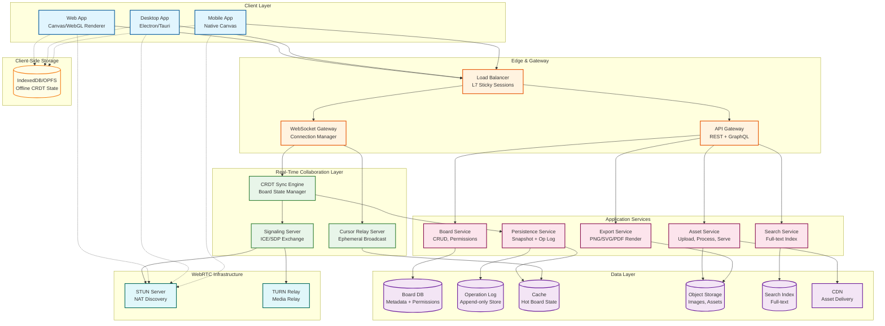
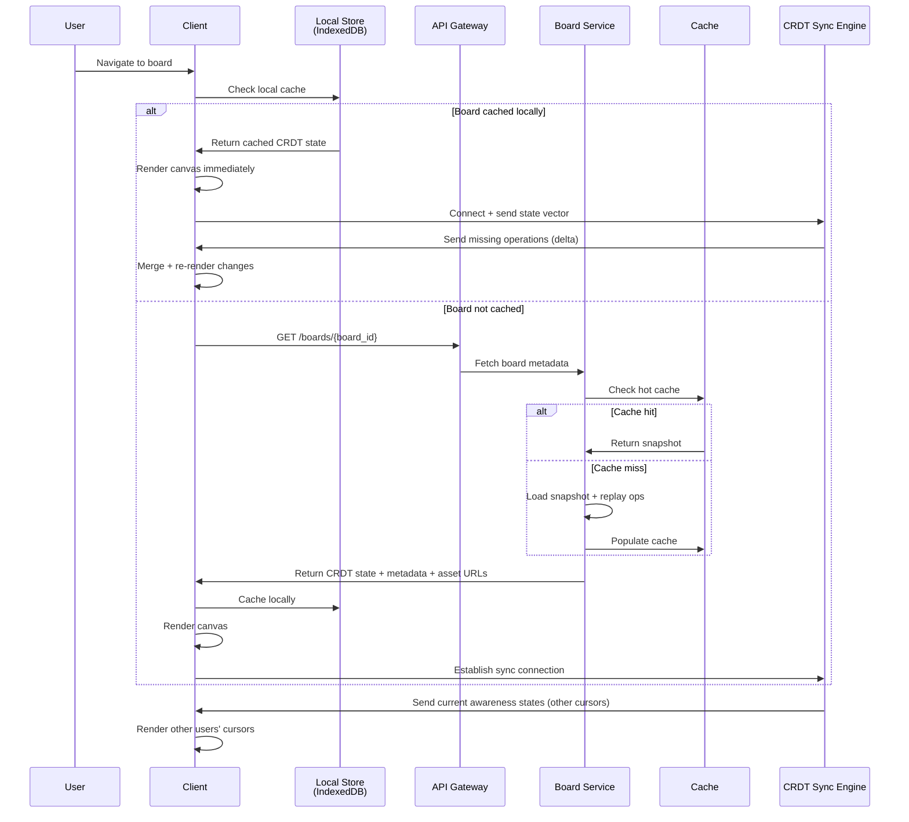
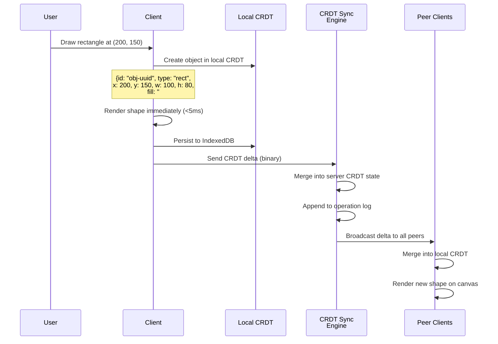
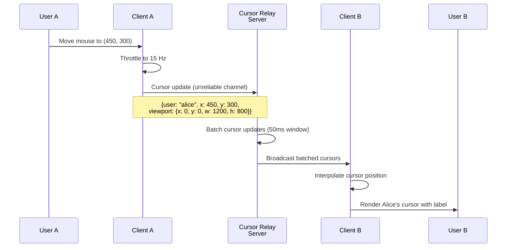
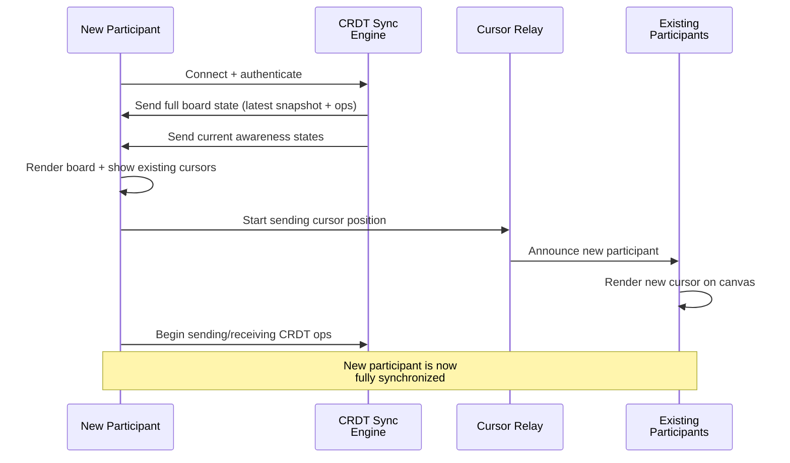
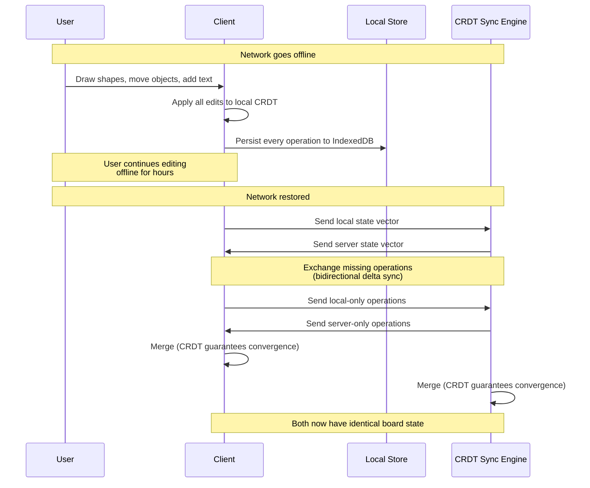

# High-Level Design

## System Architecture



---

## Key Architectural Decisions

### 1. WebRTC Topology: Server-Mediated (SFU-Style) Not Pure P2P

**Decision: Hybrid SFU relay for operations with WebSocket fallback**

| Factor | Pure P2P Mesh | SFU-Style Relay (Chosen) |
|--------|--------------|--------------------------|
| Connection count | O(n^2) per room | O(n) per room |
| NAT traversal | Each pair needs ICE; ~20% fail | Server handles all; 100% reachability |
| TURN cost | Each pair may need TURN | Single TURN hop to server |
| Permission enforcement | Cannot enforce server-side | Server validates every operation |
| Persistence | No central state; relies on peers | Server persists to operation log |
| Late joiners | Must sync from arbitrary peer | Server provides authoritative state |
| Scale limit | Practical max ~6-8 peers | Tested to 300+ peers |

**Rationale**: Pure WebRTC mesh fails at scale because connection count grows quadratically and NAT traversal is unreliable. For a canvas with 50+ editors, the server must mediate. However, we use WebRTC data channels between the client and the SFU relay for lower latency than WebSocket where possible, with WebSocket as a universal fallback.

**Architecture**:

```
Client A ──WebRTC DataChannel──> SFU Relay ──WebRTC DataChannel──> Client B
   │                                │
   │ (fallback)                     │
   └───WebSocket──────────────> WS Gateway ──WebSocket──────────> Client B
```

### 2. CRDT-Native for Canvas State

**Decision: CRDT with composable types for all canvas objects**

| Factor | Centralized Server State | CRDT (Chosen) |
|--------|-------------------------|---------------|
| Offline drawing | Read-only or queue operations | Full read/write; merge on reconnect |
| Concurrent moves | Server arbitrates; one wins immediately | Both apply; LWW resolves deterministically |
| Conflict resolution | Server decides; losers must retry | Automatic; all replicas converge |
| Server dependency | Required for every operation | Optional; aids persistence and fanout |
| Complexity | Lower | Higher (CRDT library + state management) |
| Convergence guarantee | N/A (server is authoritative) | Mathematically proven |

**Rationale**: Canvas workflows frequently involve offline scenarios (workshops on conference Wi-Fi, airplane editing, field work). OT-based approaches cannot support offline editing for spatial operations. CRDTs provide convergence guarantees that work naturally for the property-based canvas object model (each object is a map of independently mergeable properties).

### 3. Separation of Ephemeral vs Durable State

**Decision: Two distinct channels with different guarantees**

This is a foundational architectural pattern:

| State Category | Examples | Channel | Persistence | Consistency | Update Rate |
|---------------|----------|---------|-------------|-------------|-------------|
| **Durable** | Object positions, shapes, text, connectors, colors | Reliable (WebSocket/WebRTC ordered) | Operation log + snapshots | Strong eventual | 1-5 ops/sec/user |
| **Ephemeral** | Cursor positions, viewport bounds, selections, typing indicators | Unreliable (WebRTC unordered or UDP-like) | Not persisted | Best-effort | 15-30 updates/sec/user |

**Rationale**: Mixing cursor data (30 Hz, no historical value) with shape operations (1-5 Hz, must be durable) creates a 10-30x write amplification in the operation log with zero benefit. Ephemeral state tolerates packet loss (a 200ms-old cursor position is still useful), while durable state requires reliable delivery. Different transports for different guarantees.

### 4. Dual Data Channel Architecture

**Decision: Reliable + unreliable WebRTC data channels**

```
Client ──> SFU Relay
    ├── Reliable Data Channel (SCTP ordered)
    │   └── CRDT operations (shape create, move, delete, property changes)
    │
    └── Unreliable Data Channel (SCTP unordered, no retransmit)
        └── Cursor positions, viewport bounds, selection state
```

WebRTC data channels support configurable reliability. We use:

- **Reliable, ordered channel**: For CRDT operations that must be delivered exactly once and in order. Equivalent to TCP semantics.
- **Unreliable, unordered channel**: For cursor positions where the latest update supersedes all previous ones. Equivalent to UDP semantics. Reduces head-of-line blocking and latency.

### 5. Offline-First with Local CRDT State

**Decision: Full local CRDT replica with periodic sync**

```
Online:
  User Edit → Local CRDT → Render → Send to Server → Server Broadcasts

Offline:
  User Edit → Local CRDT → Render → Persist to IndexedDB
  (no network needed; full editing capability preserved)

Reconnect:
  Exchange state vectors → Send/receive missing operations → Converge
```

- Client maintains a complete CRDT replica of every open board in IndexedDB/OPFS
- All edits apply locally first (zero-latency rendering) then sync
- Offline edits accumulate in the local CRDT; merge is automatic on reconnect
- State vector exchange ensures only missing operations are transferred

### 6. Storage: Operation Log + Periodic Snapshots

**Decision: Event sourcing with compaction**

```
Time ────────────────────────────────────────────────>
│ Snapshot │ op op op op op │ Snapshot │ op op op │
│  (full   │ (CRDT deltas)  │  (full   │ (deltas) │
│  state)  │                │  state)  │          │
```

- Every CRDT operation is appended to an immutable log (partitioned by board_id)
- Periodic snapshots capture full CRDT state (every 200 operations or 10 minutes)
- Loading a board: load latest snapshot + replay subsequent operations
- Old operations retained for version history but compacted after 30 days
- Snapshots stored in object storage; hot snapshots cached in key-value store

---

## Data Flow

### Opening a Board



### Drawing a Shape



### Moving a Cursor



### New User Joining an Active Session



### Offline Edit and Reconnect



---

## Architecture Pattern Checklist

- [x] **Sync vs Async**: WebSocket/WebRTC for real-time sync (async push); REST for metadata (sync request-response)
- [x] **Event-driven vs Request-response**: Event-driven for canvas operations (operation stream); request-response for board CRUD
- [x] **Push vs Pull**: Push for real-time edits and cursor positions; pull for initial board load and asset fetch
- [x] **Stateless vs Stateful**: Sync engine is stateful (holds active board CRDT state in memory); API servers are stateless
- [x] **Read-heavy vs Write-heavy**: Write-heavy during collaboration sessions; optimized with local-first rendering
- [x] **Real-time vs Batch**: Real-time for operations and presence; batch for search indexing, snapshots, export
- [x] **Edge vs Origin**: Client-side CRDT processing for zero-latency editing; server for persistence and cross-client sync
- [x] **Reliable vs Unreliable**: Reliable channel for durable operations; unreliable channel for ephemeral state

---

## Component Responsibilities

| Component | Responsibility | Scaling Strategy |
|-----------|---------------|-----------------|
| **WebSocket Gateway** | Connection management, auth, transport upgrade | Horizontal (sticky sessions by board) |
| **CRDT Sync Engine** | CRDT merge, operation validation, broadcast | Horizontal (sharded by board_id) |
| **Signaling Server** | WebRTC ICE/SDP exchange, session setup | Stateless, horizontally scaled |
| **Cursor Relay Server** | Ephemeral cursor/viewport broadcast | Horizontal (pub/sub, stateless) |
| **Board Service** | Board metadata CRUD, permissions, sharing | Stateless, horizontally scaled |
| **Persistence Service** | Snapshot creation, operation log management | Background workers, queue-based |
| **Asset Service** | Image/PDF upload, processing, thumbnail generation | Horizontal, CDN-backed |
| **Export Service** | Rasterization, SVG/PDF generation | Queue-based, auto-scaled workers |
| **Search Service** | Full-text indexing across boards | Sharded search index |
| **STUN Server** | NAT type discovery for WebRTC | Lightweight, globally distributed |
| **TURN Relay** | WebRTC media relay for restricted NATs | Bandwidth-intensive, metered |

---

## Why Not Pure WebSocket (No WebRTC)?

Many production canvas systems (including Miro) use WebSocket-only architectures. Our hybrid approach provides optional WebRTC benefits:

| Aspect | WebSocket Only | Hybrid WebSocket + WebRTC |
|--------|---------------|---------------------------|
| Latency | Server hop always required | Direct P2P possible for same-network peers |
| Cursor smoothness | ~30-80ms (through server) | ~5-20ms (P2P) or ~30-80ms (relay) |
| NAT handling | Not an issue (client → server) | Requires STUN/TURN infrastructure |
| Complexity | Lower | Higher |
| Firewall compatibility | Near-universal (port 443) | Blocked by some corporate firewalls |
| Cost | Server bandwidth only | Server + TURN bandwidth |
| Fallback | N/A | Falls back to WebSocket |

**Our approach**: WebSocket as the **primary** transport (reliable, universal). WebRTC data channels as an **optional enhancement** for lower-latency cursor sync when P2P connectivity is achievable. The system works correctly with WebSocket alone; WebRTC is a progressive enhancement.
