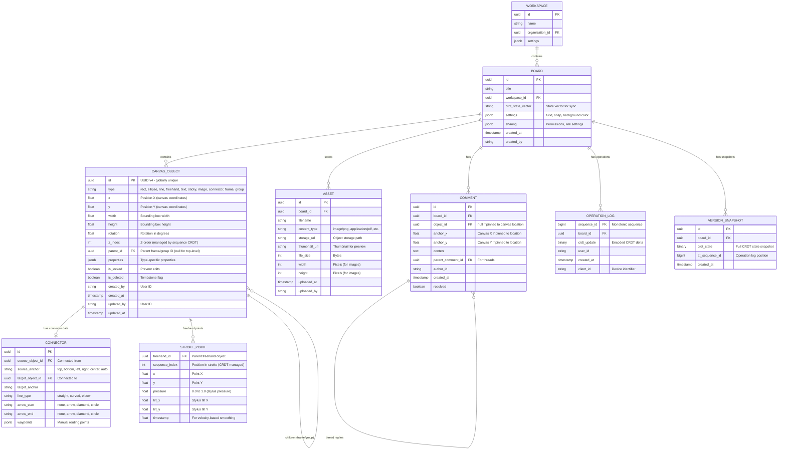

# Low-Level Design

## Canvas Object Model

### Object Entity (Core)

Every element on the canvas is an **object** with a globally unique ID, 2D spatial properties, and type-specific attributes. The object model is intentionally flat (not tree-based like a block editor) because canvas elements exist independently in 2D space.



### Object Types & Properties

| Object Type | Properties | Spatial Model |
|------------|------------|---------------|
| `rect` | `{ fill, stroke, strokeWidth, cornerRadius, opacity }` | Bounding box |
| `ellipse` | `{ fill, stroke, strokeWidth, opacity }` | Bounding box (inscribed ellipse) |
| `diamond` | `{ fill, stroke, strokeWidth, opacity }` | Bounding box (inscribed diamond) |
| `triangle` | `{ fill, stroke, strokeWidth, opacity }` | Bounding box (inscribed triangle) |
| `line` | `{ stroke, strokeWidth, startArrow, endArrow, points[] }` | Point-to-point |
| `freehand` | `{ stroke, strokeWidth, opacity, smoothing }` | Stroke point sequence |
| `text` | `{ fontSize, fontFamily, fontWeight, textAlign, color, content }` | Bounding box (auto-sized) |
| `sticky` | `{ fill (color), fontSize, content }` | Fixed-size card |
| `image` | `{ assetId, cropX, cropY, cropW, cropH, opacity }` | Bounding box |
| `connector` | `{ sourceId, targetId, lineType, arrows, label }` | Derived from endpoints |
| `frame` | `{ label, fill, clip }` | Bounding box (contains children) |
| `group` | `{}` | Computed from children bounds |
| `embed` | `{ url, embedType }` | Bounding box |

---

## CRDT Data Structures

### Per-Board CRDT Composition

A board's entire state is managed as a composition of CRDT types:

```
Board CRDT State
├── Object Registry (OR-Set CRDT)
│   ├── Object "obj-001" → present
│   ├── Object "obj-002" → present
│   ├── Object "obj-003" → tombstoned (deleted)
│   └── ...
│
├── Object Properties (LWW-Map CRDT per object)
│   ├── "obj-001": { x: 200, y: 150, width: 100, height: 80, type: "rect", fill: "#4a90d9" }
│   ├── "obj-002": { x: 500, y: 300, width: 200, height: 40, type: "text", content: "Hello" }
│   └── ...
│
├── Z-Order (Sequence CRDT - YATA/Fugue)
│   └── ["obj-002", "obj-001", "obj-005", ...]  // back-to-front rendering order
│
├── Freehand Strokes (Sequence CRDT per freehand object)
│   ├── "freehand-001": [(x1,y1,p1), (x2,y2,p2), ...]  // point sequence
│   └── ...
│
├── Text Content (Sequence CRDT per text/sticky object)
│   ├── "text-001": "Project Roadmap"
│   └── "sticky-003": "Action item: review by Friday"
│
├── Connector Registry (Map CRDT)
│   ├── "conn-001": { source: "obj-001", target: "obj-002", type: "elbow" }
│   └── ...
│
└── Group/Frame Membership (Map CRDT)
    ├── "obj-001" → parent: "frame-001"
    ├── "obj-002" → parent: null (top-level)
    └── ...
```

### CRDT Type Selection Rationale

| Canvas Operation | CRDT Type | Why |
|-----------------|-----------|-----|
| Add/remove objects | **OR-Set** | Add-wins semantics: if one user adds and another removes concurrently, add wins. Prevents accidental data loss. |
| Object position (x, y) | **LWW-Register** | Last mover wins. Concurrent drags resolve to the latest timestamp. Users see a brief "jump" but the state converges. |
| Object properties (fill, stroke, size) | **LWW-Map** | Each property is an independent LWW-Register. Concurrent changes to different properties (e.g., one user changes color while another resizes) merge without conflict. |
| Z-order (layering) | **Sequence CRDT** | Ordered list of object IDs. Concurrent "bring to front" operations insert at the end; sequence CRDT prevents interleaving. |
| Freehand stroke points | **Sequence CRDT** | Ordered point list. A freehand stroke is created atomically (single user), so concurrent inserts into the same stroke are rare. |
| Text within shapes | **Sequence CRDT** | Character-level CRDT for text in sticky notes and text boxes. Enables concurrent text editing within the same element. |
| Connectors | **LWW-Map** | Connector endpoints are LWW (last setter wins); route is derived from endpoint positions. |
| Group membership | **LWW-Register** | Each object's parent is an LWW-Register. Concurrent "group" operations resolve to the latest. |

---

## Operation Types

### Durable Operations (Persisted to Operation Log)

```
OPERATION TYPES:

1. ADD_OBJECT
   { op: "add", id: "uuid", type: "rect", properties: { x, y, width, height, fill, ... } }

2. DELETE_OBJECT
   { op: "delete", id: "uuid" }
   → Marks as tombstone in OR-Set; does not physically remove

3. UPDATE_PROPERTY
   { op: "update", id: "uuid", key: "x", value: 250, timestamp: lamport_clock }
   → Applies to LWW-Register for the specific property

4. BATCH_UPDATE (for drag operations)
   { op: "batch_update", id: "uuid", properties: { x: 250, y: 180 }, timestamp: lamport_clock }
   → Atomically updates multiple properties

5. MOVE_Z_ORDER
   { op: "z_reorder", id: "uuid", position: "front" | "back" | { after: "other-uuid" } }
   → Modifies position in z-order sequence CRDT

6. ADD_STROKE_POINTS
   { op: "stroke_append", id: "freehand-uuid", points: [{x, y, pressure, time}, ...] }
   → Appends to freehand stroke sequence CRDT

7. UPDATE_TEXT
   { op: "text_insert" | "text_delete", id: "uuid", position: N, content: "..." }
   → Character-level operations on text sequence CRDT

8. CONNECT
   { op: "connect", id: "conn-uuid", source: "obj-uuid", target: "obj-uuid", type: "elbow" }

9. DISCONNECT
   { op: "disconnect", id: "conn-uuid" }

10. GROUP
    { op: "group", group_id: "group-uuid", member_ids: ["obj-1", "obj-2", "obj-3"] }

11. UNGROUP
    { op: "ungroup", group_id: "group-uuid" }

12. LOCK / UNLOCK
    { op: "lock" | "unlock", id: "uuid" }
```

### Ephemeral Operations (Not Persisted)

```
EPHEMERAL OPERATIONS:

1. CURSOR_MOVE
   { type: "cursor", user_id: "uuid", x: 450.5, y: 300.2, timestamp: ms }

2. VIEWPORT_UPDATE
   { type: "viewport", user_id: "uuid", x: 0, y: 0, width: 1200, height: 800, zoom: 1.0 }

3. SELECTION_UPDATE
   { type: "selection", user_id: "uuid", selected_ids: ["obj-1", "obj-2"] }

4. DRAG_PREVIEW
   { type: "drag_preview", user_id: "uuid", object_id: "uuid", preview_x: 300, preview_y: 200 }

5. TYPING_INDICATOR
   { type: "typing", user_id: "uuid", object_id: "uuid", active: true }
```

---

## API Design

### REST API (Board Management)

#### Create Board

```
POST /api/v1/workspaces/{workspace_id}/boards
Content-Type: application/json

Request:
{
  "title": "Sprint Retrospective",
  "template_id": "retro-template-uuid",  // optional
  "settings": {
    "background": "#ffffff",
    "grid": { "enabled": true, "size": 20 },
    "snap_to_grid": false
  }
}

Response: 201 Created
{
  "id": "board-uuid",
  "title": "Sprint Retrospective",
  "websocket_url": "wss://sync.example.com/boards/board-uuid",
  "created_at": "2026-03-08T10:00:00Z",
  "object_count": 24,  // from template
  "thumbnail_url": "https://cdn.example.com/thumbnails/board-uuid.png"
}
```

#### Get Board (Initial Load)

```
GET /api/v1/boards/{board_id}
Accept: application/octet-stream

Response: 200 OK
Content-Type: application/octet-stream

Body: Binary-encoded CRDT state snapshot
Headers:
  X-State-Vector: base64-encoded-state-vector
  X-Sequence-Id: 12847
  X-Snapshot-At: 12800
  X-Object-Count: 342
  X-Asset-Manifest: base64-encoded-asset-list
```

#### Upload Asset

```
POST /api/v1/boards/{board_id}/assets
Content-Type: multipart/form-data

Form Data:
  file: (binary image/PDF data)
  object_id: "uuid"  // canvas object that references this asset

Response: 201 Created
{
  "id": "asset-uuid",
  "url": "https://cdn.example.com/assets/board-uuid/asset-uuid.png",
  "thumbnail_url": "https://cdn.example.com/assets/board-uuid/asset-uuid-thumb.png",
  "width": 1920,
  "height": 1080,
  "file_size": 245760
}
```

#### Export Board

```
POST /api/v1/boards/{board_id}/export
Content-Type: application/json

Request:
{
  "format": "png" | "svg" | "pdf",
  "scope": "full" | "viewport" | "frame",
  "frame_id": "frame-uuid",  // if scope is "frame"
  "viewport": { "x": 0, "y": 0, "width": 2000, "height": 1500 },  // if scope is "viewport"
  "scale": 2,  // DPI multiplier
  "background": true  // include background
}

Response: 202 Accepted
{
  "export_id": "export-uuid",
  "status_url": "/api/v1/exports/export-uuid",
  "estimated_seconds": 5
}

// Poll or WebSocket notification when complete:
GET /api/v1/exports/{export_id}
{
  "status": "completed",
  "download_url": "https://cdn.example.com/exports/export-uuid.png",
  "expires_at": "2026-03-08T11:00:00Z"
}
```

#### List Board Versions

```
GET /api/v1/boards/{board_id}/versions?limit=20&before=cursor

Response: 200 OK
{
  "versions": [
    {
      "id": "version-uuid",
      "sequence_id": 12800,
      "created_at": "2026-03-08T09:55:00Z",
      "created_by": "user-uuid",
      "summary": "12 objects added, 5 moved, 2 deleted",
      "thumbnail_url": "https://cdn.example.com/versions/version-uuid-thumb.png"
    }
  ],
  "cursor": "next-page-cursor"
}
```

### WebSocket Protocol (Real-Time Sync)

#### Connection Establishment

```
Client -> Server: WebSocket upgrade to wss://sync.example.com/boards/{board_id}
                  Headers: Authorization: Bearer {token}

Server -> Client: {
  type: "sync_init",
  server_state_vector: Uint8Array,
  participants: [
    { user_id: "uuid", name: "Alice", color: "#e91e63", cursor: {x, y} },
    { user_id: "uuid", name: "Bob", color: "#2196f3", cursor: {x, y} }
  ],
  board_settings: { grid: {...}, background: "#fff" }
}

Client -> Server: {
  type: "sync_step1",
  client_state_vector: Uint8Array
}

Server -> Client: {
  type: "sync_step2",
  update: Uint8Array  // Missing operations the client needs
}

Client -> Server: {
  type: "sync_step2",
  update: Uint8Array  // Missing operations the server needs (offline changes)
}
```

#### Operation Messages

```
Client -> Server: {
  type: "update",
  data: Uint8Array,       // Binary-encoded CRDT delta
  client_id: "device-123",
  local_seq: 47
}

Server -> All Other Clients: {
  type: "update",
  data: Uint8Array,
  origin: "user-uuid"
}
```

#### Awareness (Ephemeral)

```
Client -> Server: {
  type: "awareness",
  data: {
    user: { id: "uuid", name: "Alice", color: "#e91e63" },
    cursor: { x: 450.5, y: 300.2 },
    viewport: { x: -200, y: -100, w: 1600, h: 900, zoom: 0.8 },
    selection: ["obj-uuid-1", "obj-uuid-2"],
    active_tool: "rect"
  }
}

Server -> All Other Clients: {
  type: "awareness",
  client_id: 7,
  data: { ... }
}
```

### WebRTC Signaling Protocol

```
// ICE candidate exchange via WebSocket

Client A -> Server: {
  type: "rtc_offer",
  target_peer: "client-b-id",
  sdp: "v=0\r\no=..."
}

Server -> Client B: {
  type: "rtc_offer",
  source_peer: "client-a-id",
  sdp: "v=0\r\no=..."
}

Client B -> Server: {
  type: "rtc_answer",
  target_peer: "client-a-id",
  sdp: "v=0\r\no=..."
}

// ICE candidates
Client -> Server: {
  type: "rtc_ice",
  target_peer: "peer-id",
  candidate: { ... }
}
```

### Rate Limiting

| Endpoint | Limit | Window |
|----------|-------|--------|
| REST API | 100 req/min per user | Sliding window |
| WebSocket CRDT updates | 30 messages/sec per connection | Token bucket |
| Awareness updates | 20 messages/sec per connection | Throttled on client |
| Board loads | 30 req/min per user | Sliding window |
| Asset uploads | 10 req/min per user | Sliding window |
| Export requests | 5 req/min per user | Sliding window |

---

## Core Algorithms

### 1. Canvas Object CRDT: LWW-Map with OR-Set

```
PSEUDOCODE: Canvas Object CRDT

STRUCTURE CanvasCRDT:
    objects: ORSet<ObjectID>                    // Object presence (add/remove)
    properties: Map<ObjectID, LWWMap>           // Per-object property maps
    z_order: SequenceCRDT                       // Global z-ordering
    strokes: Map<ObjectID, SequenceCRDT>        // Freehand point sequences
    text: Map<ObjectID, SequenceCRDT>           // Text content per text object

STRUCTURE LWWMap:
    entries: Map<String, LWWRegister>           // key -> (value, timestamp, replica_id)

STRUCTURE LWWRegister:
    value: Any
    timestamp: LamportClock
    replica_id: String

FUNCTION add_object(type, x, y, width, height, properties):
    id = generate_uuid_v4()

    // Add to OR-Set (tracks object existence)
    objects.add(id)

    // Initialize property map
    clock = next_lamport_clock()
    props = new LWWMap()
    props.set("type", type, clock)
    props.set("x", x, clock)
    props.set("y", y, clock)
    props.set("width", width, clock)
    props.set("height", height, clock)
    FOR (key, value) IN properties:
        props.set(key, value, clock)
    properties[id] = props

    // Add to z-order (at front)
    z_order.append(id)

    RETURN id

FUNCTION update_property(object_id, key, value):
    IF object_id NOT IN objects:
        RETURN  // Object was deleted

    clock = next_lamport_clock()
    properties[object_id].set(key, value, clock)

FUNCTION move_object(object_id, new_x, new_y):
    // Batch update x and y with same timestamp for atomicity
    clock = next_lamport_clock()
    properties[object_id].set("x", new_x, clock)
    properties[object_id].set("y", new_y, clock)

FUNCTION delete_object(object_id):
    // Remove from OR-Set (tombstone)
    objects.remove(object_id)
    // Note: properties remain for undo/history but object is not rendered
    // Garbage collected after grace period

FUNCTION resolve_concurrent_property_update(key, local_reg, remote_reg):
    // LWW: highest Lamport timestamp wins
    // Tie-break: highest replica_id (lexicographic)
    IF remote_reg.timestamp > local_reg.timestamp:
        RETURN remote_reg
    ELSE IF remote_reg.timestamp == local_reg.timestamp:
        IF remote_reg.replica_id > local_reg.replica_id:
            RETURN remote_reg
    RETURN local_reg
```

### 2. Freehand Stroke CRDT

```
PSEUDOCODE: Freehand Stroke as Sequence CRDT

STRUCTURE FreehandStroke:
    object_id: UUID
    points: SequenceCRDT               // Ordered sequence of StrokePoints
    smoothed_path: CachedBezierPath     // Derived (not stored in CRDT)

STRUCTURE StrokePoint:
    x: Float
    y: Float
    pressure: Float                     // 0.0 to 1.0
    timestamp: Float                    // For velocity calculation

FUNCTION begin_stroke(start_x, start_y, pressure):
    id = generate_uuid_v4()
    objects.add(id)
    properties[id] = new LWWMap()
    properties[id].set("type", "freehand", next_clock())
    properties[id].set("stroke", "#000000", next_clock())
    properties[id].set("strokeWidth", 2, next_clock())

    strokes[id] = new SequenceCRDT()
    strokes[id].append(StrokePoint(start_x, start_y, pressure, now()))

    RETURN id

FUNCTION continue_stroke(stroke_id, x, y, pressure):
    point = StrokePoint(x, y, pressure, now())
    strokes[stroke_id].append(point)

    // Client-side: update smoothed path incrementally
    smoothed_path = compute_bezier_fit(strokes[stroke_id].to_list())
    render_stroke(stroke_id, smoothed_path)

FUNCTION end_stroke(stroke_id):
    // Final smoothing pass
    points = strokes[stroke_id].to_list()
    simplified = ramer_douglas_peucker(points, epsilon=1.5)
    // Replace raw points with simplified version
    // (Only if this is the original author; simplification is not a CRDT op)
    smoothed_path = compute_catmull_rom_to_bezier(simplified)
    cache_render_path(stroke_id, smoothed_path)

FUNCTION compute_bezier_fit(points):
    // Convert raw input points to smooth Bezier curves
    // Using Catmull-Rom spline → cubic Bezier conversion
    IF length(points) < 2:
        RETURN points

    bezier_segments = []
    FOR i FROM 1 TO length(points) - 2:
        p0 = points[i - 1]
        p1 = points[i]
        p2 = points[i + 1]
        p3 = points[min(i + 2, length(points) - 1)]

        // Catmull-Rom to cubic Bezier control points
        cp1_x = p1.x + (p2.x - p0.x) / 6
        cp1_y = p1.y + (p2.y - p0.y) / 6
        cp2_x = p2.x - (p3.x - p1.x) / 6
        cp2_y = p2.y - (p3.y - p1.y) / 6

        bezier_segments.append(CubicBezier(p1, (cp1_x, cp1_y), (cp2_x, cp2_y), p2))

    RETURN bezier_segments
```

### 3. Spatial Index (R-Tree)

```
PSEUDOCODE: R-Tree for Viewport Queries

STRUCTURE RTree:
    root: RTreeNode
    max_entries: 50                     // Maximum entries per node (fanout)
    min_entries: 20                     // Minimum entries per node

STRUCTURE RTreeNode:
    bounding_box: AABB                  // Axis-Aligned Bounding Box
    children: List<RTreeNode | ObjectEntry>
    is_leaf: Boolean

STRUCTURE AABB:
    min_x, min_y, max_x, max_y: Float

STRUCTURE ObjectEntry:
    object_id: UUID
    bounding_box: AABB

FUNCTION viewport_query(viewport_aabb):
    // Find all objects whose bounding box intersects the viewport
    results = []
    _search(root, viewport_aabb, results)
    RETURN results

FUNCTION _search(node, query_aabb, results):
    IF node.is_leaf:
        FOR entry IN node.children:
            IF intersects(entry.bounding_box, query_aabb):
                results.append(entry.object_id)
    ELSE:
        FOR child IN node.children:
            IF intersects(child.bounding_box, query_aabb):
                _search(child, query_aabb, results)

FUNCTION intersects(a, b):
    RETURN NOT (a.max_x < b.min_x OR a.min_x > b.max_x OR
                a.max_y < b.min_y OR a.min_y > b.max_y)

FUNCTION insert(object_id, bbox):
    entry = ObjectEntry(object_id, bbox)
    leaf = _choose_leaf(root, entry)
    leaf.children.append(entry)
    IF length(leaf.children) > max_entries:
        _split_node(leaf)
    _adjust_tree(leaf)

FUNCTION update_position(object_id, new_bbox):
    // Remove and re-insert (R-tree update strategy)
    remove(object_id)
    insert(object_id, new_bbox)

// Performance: O(log n + k) for viewport query
// where n = total objects, k = objects in viewport
// Typical: n = 10,000, k = 200, depth = 3, query < 0.1ms
```

### 4. Connector Auto-Routing

```
PSEUDOCODE: Connector Routing (Elbow/Orthogonal)

FUNCTION route_connector(source_obj, source_anchor, target_obj, target_anchor):
    // Get anchor points on source and target objects
    source_point = get_anchor_point(source_obj, source_anchor)
    target_point = get_anchor_point(target_obj, target_anchor)

    // Get exit direction from anchor
    source_dir = get_anchor_direction(source_anchor)  // UP, DOWN, LEFT, RIGHT
    target_dir = get_anchor_direction(target_anchor)

    IF connector_type == "straight":
        RETURN [source_point, target_point]

    ELSE IF connector_type == "elbow":
        RETURN route_elbow(source_point, source_dir, target_point, target_dir)

    ELSE IF connector_type == "curved":
        RETURN route_bezier(source_point, source_dir, target_point, target_dir)

FUNCTION route_elbow(start, start_dir, end, end_dir):
    // Generate orthogonal path with minimal bends
    MARGIN = 20  // Minimum distance from object before turning

    path = [start]

    // Step out from source in exit direction
    exit_point = offset_point(start, start_dir, MARGIN)
    path.append(exit_point)

    // Step in to target from entry direction
    entry_point = offset_point(end, end_dir, MARGIN)

    // Connect exit to entry with at most 2 intermediate segments
    IF start_dir IS horizontal AND end_dir IS horizontal:
        mid_x = (exit_point.x + entry_point.x) / 2
        path.append(Point(mid_x, exit_point.y))
        path.append(Point(mid_x, entry_point.y))
    ELSE IF start_dir IS vertical AND end_dir IS vertical:
        mid_y = (exit_point.y + entry_point.y) / 2
        path.append(Point(exit_point.x, mid_y))
        path.append(Point(entry_point.x, mid_y))
    ELSE:
        // One horizontal, one vertical: single bend
        IF start_dir IS horizontal:
            path.append(Point(entry_point.x, exit_point.y))
        ELSE:
            path.append(Point(exit_point.x, entry_point.y))

    path.append(entry_point)
    path.append(end)

    // Check for collisions with other objects and reroute if needed
    path = avoid_obstacles(path)

    RETURN path

FUNCTION avoid_obstacles(path):
    // Query R-tree for objects along the path segments
    FOR i FROM 0 TO length(path) - 2:
        segment_bbox = segment_to_aabb(path[i], path[i+1])
        obstacles = rtree.viewport_query(expand(segment_bbox, MARGIN))

        IF obstacles IS NOT empty:
            // Offset the segment to route around the obstacle
            path = reroute_around(path, i, obstacles)

    RETURN path
```

### 5. Cursor Interpolation

```
PSEUDOCODE: Client-Side Cursor Interpolation

STRUCTURE RemoteCursor:
    user_id: String
    current_x, current_y: Float         // Current rendered position
    target_x, target_y: Float           // Latest received position
    velocity_x, velocity_y: Float       // Estimated velocity
    last_update_time: Float             // When last network update received
    color: String
    name: String

FUNCTION on_cursor_update_received(user_id, x, y, timestamp):
    cursor = remote_cursors[user_id]

    // Calculate velocity from last known position
    dt = timestamp - cursor.last_update_time
    IF dt > 0:
        cursor.velocity_x = (x - cursor.target_x) / dt
        cursor.velocity_y = (y - cursor.target_y) / dt

    cursor.target_x = x
    cursor.target_y = y
    cursor.last_update_time = timestamp

FUNCTION interpolate_cursors(current_time):
    // Called every frame (60 Hz) for smooth cursor rendering
    FOR cursor IN remote_cursors.values():
        time_since_update = current_time - cursor.last_update_time

        IF time_since_update < 200:  // Recent update: interpolate toward target
            // Exponential smoothing (lerp factor based on time)
            t = min(1.0, time_since_update / 100)  // 100ms smoothing window
            cursor.current_x = lerp(cursor.current_x, cursor.target_x, t)
            cursor.current_y = lerp(cursor.current_y, cursor.target_y, t)
        ELSE IF time_since_update < 500:  // Stale: extrapolate from velocity
            cursor.current_x = cursor.target_x + cursor.velocity_x * (time_since_update - 200)
            cursor.current_y = cursor.target_y + cursor.velocity_y * (time_since_update - 200)
        ELSE:
            // Very stale: stop moving, show "idle" state
            cursor.idle = true

FUNCTION lerp(a, b, t):
    RETURN a + (b - a) * t
```

---

## Indexing Strategy

| Index | Table | Columns | Purpose |
|-------|-------|---------|---------|
| `idx_object_board` | CANVAS_OBJECT | `(board_id, z_index)` | Load all objects for a board in z-order |
| `idx_object_parent` | CANVAS_OBJECT | `(parent_id)` | Find children of frame/group |
| `idx_oplog_board_seq` | OPERATION_LOG | `(board_id, sequence_id)` | Replay operations from a point |
| `idx_snapshot_board` | VERSION_SNAPSHOT | `(board_id, at_sequence_id DESC)` | Latest snapshot lookup |
| `idx_asset_board` | ASSET | `(board_id)` | All assets for a board |
| `idx_comment_board` | COMMENT | `(board_id, created_at DESC)` | Comments listing |
| `idx_board_workspace` | BOARD | `(workspace_id, updated_at DESC)` | Recent boards listing |

### Partitioning / Sharding

| Data | Shard Key | Strategy |
|------|-----------|----------|
| Canvas objects | `board_id` | All objects for a board on same shard |
| Operation log | `board_id` | Partitioned, append-only per board |
| Snapshots | `board_id` | Co-located with operation log |
| Assets | `board_id` | Object storage with board-prefixed paths |
| Search index | `workspace_id` | Workspace-level search isolation |

---

## Complexity Analysis

| Operation | Time Complexity | Space Complexity |
|-----------|----------------|-----------------|
| Add object | O(1) amortized | O(1) per object + CRDT metadata |
| Delete object | O(1) | O(1) (tombstone) |
| Update property | O(1) | O(1) per property update |
| Move object (with R-tree update) | O(log n) | O(1) |
| Viewport query (R-tree) | O(log n + k) | O(k) results |
| Freehand stroke (append point) | O(1) amortized | O(1) per point |
| Bezier fitting (end stroke) | O(p) | O(p) where p = point count |
| Connector routing | O(m log n) | O(m) where m = route segments |
| Compute sync diff | O(k) | O(k) where k = missing ops |
| Merge remote update | O(k) | O(k) |
| Board load (snapshot + replay) | O(n + k) | O(n) |
| Z-order change | O(log n) | O(1) |

Where: n = total objects on board, k = operations to replay/sync, p = stroke points, m = connector route complexity
