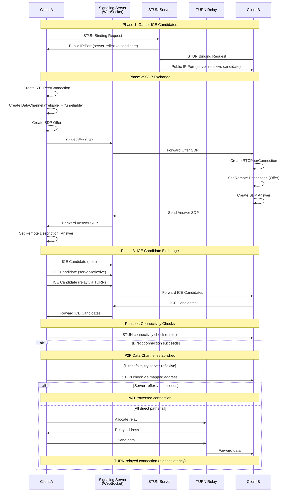
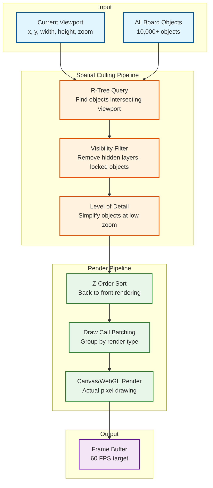

# Deep Dive & Bottlenecks

## 1. WebRTC Signaling and Connection Establishment

### ICE Negotiation Flow

WebRTC connection establishment is complex because it must navigate NATs, firewalls, and diverse network topologies. Understanding this flow is critical for diagnosing connection failures.



### NAT Traversal Success Rates

| NAT Type | % of Connections | Direct P2P Success | Needs TURN |
|----------|-----------------|-------------------|------------|
| Full Cone NAT | 30% | 95%+ | Rare |
| Restricted Cone NAT | 25% | 80%+ | Sometimes |
| Port Restricted NAT | 25% | 60%+ | Often |
| Symmetric NAT | 15% | <5% | Almost always |
| Corporate Firewall (no UDP) | 5% | 0% | Always (TCP TURN) |

**Key insight**: Approximately 18-22% of connections require TURN relay. For a canvas tool with 500K concurrent sessions, this means ~100K TURN sessions consuming significant bandwidth and cost.

### Why TURN Drives Architecture Decisions

TURN relay cost is a primary reason production canvas tools (Miro, Figma) prefer WebSocket over WebRTC for their primary transport:

```
Cost comparison for 100K relayed sessions:

TURN relay:
  - 100K sessions x 50 Kbps avg = 5 Gbps
  - Monthly egress: ~1.6 PB
  - Cost at $0.04/GB: ~$64,000/month

WebSocket relay (same server):
  - Already needed for non-WebRTC clients
  - Marginal cost of relaying through existing WS infra: ~$5,000/month
  - No separate TURN infrastructure needed
```

**Architectural decision**: Use WebSocket as the primary transport. Offer WebRTC data channels as an optional enhancement for clients that can establish direct P2P connections (reducing server load and latency for those sessions). Never depend on WebRTC being available.

---

## 2. CRDT Convergence for Spatial Data

### The Concurrent Move Problem

The most common conflict on a canvas is two users dragging the same shape simultaneously. Unlike text CRDTs where concurrent inserts can coexist, spatial moves are mutually exclusive---the shape can only be in one position.

```
Timeline:
  t=0: Shape at (100, 100)
  t=1: User A drags to (200, 150)  [Lamport clock: 42, replica: "A"]
  t=1: User B drags to (300, 400)  [Lamport clock: 43, replica: "B"]

Resolution (LWW-Register):
  Clock 43 > 42 → User B's position wins
  Shape ends up at (300, 400)

User experience:
  User A sees shape jump from (200, 150) to (300, 400) when B's update arrives
  User B sees no interruption (their update was the winner)
```

### Improving Concurrent Move UX

Raw LWW creates a jarring "jump" for the losing user. Mitigation strategies:

```
PSEUDOCODE: Smooth Concurrent Move Resolution

FUNCTION on_remote_position_update(object_id, remote_x, remote_y, remote_clock):
    local_entry = properties[object_id].get("x")

    IF remote_clock > local_entry.timestamp:
        // Remote wins (LWW)
        IF user_is_actively_dragging(object_id):
            // User is currently dragging this object
            // Option 1: Release the drag and animate to remote position
            release_drag(object_id)
            animate_to(object_id, remote_x, remote_y, duration=200ms)
            show_toast("Another user moved this object")

            // Option 2: Show "ghost" at remote position
            show_ghost(object_id, remote_x, remote_y)
            // Let user finish drag, then snap to their position
            // (Their next drag-end will generate a new update with higher clock)
        ELSE:
            // User is not dragging: apply immediately
            animate_to(object_id, remote_x, remote_y, duration=150ms)
    ELSE:
        // Local wins: no action needed
        RETURN
```

### Handling Network Partitions

When a network partition occurs, different clients may diverge significantly:

```
Partition scenario:
  Group A (3 users): Working on left side of canvas
  Group B (2 users): Working on right side of canvas
  Duration: 30 minutes

During partition:
  - Each group's CRDT evolves independently
  - No conflicts if groups work on different objects (common case)
  - Conflicts only if both groups modify the same object

On partition heal:
  - State vectors exchanged
  - Missing operations sent bidirectionally
  - CRDT merge resolves all conflicts automatically
  - For same-object conflicts: LWW per property
  - For add/delete conflicts: add wins (OR-Set)

Post-merge:
  - All clients converge to identical state
  - No data loss (both groups' additions preserved)
  - At most one property conflict per shared object (LWW resolved)
```

### Tombstone Management for Canvas Objects

```
PSEUDOCODE: Tombstone Garbage Collection

STRUCTURE TombstoneGC:
    gc_grace_period: Duration = 30 days
    gc_check_interval: Duration = 1 hour

FUNCTION should_gc_tombstone(tombstone):
    // A tombstone can be collected if:
    // 1. All known replicas have seen the delete operation
    // 2. OR the grace period has expired

    all_seen = true
    FOR replica IN known_replicas:
        IF NOT replica.has_seen(tombstone.delete_operation):
            all_seen = false
            BREAK

    IF all_seen:
        RETURN true

    IF now() - tombstone.deleted_at > gc_grace_period:
        RETURN true

    RETURN false

FUNCTION run_gc(board_id):
    board = load_board_crdt(board_id)
    tombstones = board.objects.get_tombstones()

    gc_count = 0
    FOR tombstone IN tombstones:
        IF should_gc_tombstone(tombstone):
            board.objects.hard_delete(tombstone.id)
            board.properties.remove(tombstone.id)
            gc_count += 1

    IF gc_count > 0:
        // Create new snapshot without GC'd tombstones
        create_snapshot(board_id, board.crdt_state)

    RETURN gc_count
```

---

## 3. Infinite Canvas Performance

### Virtual Viewport Rendering

The infinite canvas cannot render all objects---only those visible in the current viewport. This is the core rendering optimization.



```
PSEUDOCODE: Viewport Culling Pipeline

FUNCTION render_frame(viewport, zoom_level):
    // Step 1: Expand viewport slightly for smooth scrolling (overdraw margin)
    expanded_viewport = expand(viewport, margin=100 / zoom_level)

    // Step 2: Query R-tree for visible objects
    candidate_ids = rtree.viewport_query(expanded_viewport)
    // Typical: 50-200 objects out of 10,000+

    // Step 3: Filter by visibility
    visible_objects = []
    FOR id IN candidate_ids:
        obj = get_object(id)
        IF obj.is_deleted: CONTINUE
        IF NOT layer_visible(obj.layer): CONTINUE
        visible_objects.append(obj)

    // Step 4: Level of Detail
    IF zoom_level < 0.3:
        // At low zoom, simplify objects
        FOR obj IN visible_objects:
            IF obj.type == "text" AND obj.fontSize * zoom_level < 8:
                obj.render_mode = "placeholder"  // Gray box instead of text
            IF obj.type == "freehand" AND obj.point_count > 100:
                obj.render_mode = "simplified"  // Fewer control points
            IF obj.type == "image":
                obj.render_mode = "thumbnail"   // Low-res version

    // Step 5: Sort by z-order
    visible_objects.sort(key=lambda o: o.z_index)

    // Step 6: Batch render
    render_batch(visible_objects, viewport, zoom_level)

FUNCTION render_batch(objects, viewport, zoom):
    // Group objects by render type for efficient draw calls
    batches = group_by(objects, key=lambda o: o.render_type)

    // Render order: fills, then strokes, then text, then images
    FOR batch_type IN ["fill", "stroke", "text", "image"]:
        IF batch_type IN batches:
            begin_batch(batch_type)
            FOR obj IN batches[batch_type]:
                transform_to_viewport(obj, viewport, zoom)
                draw(obj)
            end_batch()
```

### Level of Detail (LOD) Strategy

| Zoom Level | Text | Freehand Strokes | Images | Shapes |
|-----------|------|------------------|--------|--------|
| > 1.0x | Full render | All points, anti-aliased | Full resolution | Full render |
| 0.5x - 1.0x | Full render | Simplified (50% points) | Medium resolution | Full render |
| 0.2x - 0.5x | Placeholder if < 8px | Simplified (25% points) | Thumbnail | Simplified (no rounded corners) |
| < 0.2x | All placeholder | Bounding box only | Colored rectangle | Colored rectangle |

### Progressive Loading for Large Boards

For boards with 10,000+ objects, loading everything at once is too slow. Progressive loading prioritizes what the user sees first.

```
PSEUDOCODE: Progressive Board Loading

FUNCTION load_board_progressive(board_id, initial_viewport):
    // Phase 1: Load board metadata + CRDT snapshot header (< 50ms)
    metadata = fetch_board_metadata(board_id)
    snapshot_header = fetch_snapshot_header(board_id)
    // Contains: total object count, spatial extent, layer list

    // Phase 2: Load objects in viewport (< 200ms)
    viewport_objects = fetch_objects_in_region(board_id, initial_viewport)
    render(viewport_objects)
    // User sees the canvas and can interact

    // Phase 3: Load CRDT state and establish sync (< 500ms, background)
    crdt_state = fetch_full_crdt_state(board_id)
    establish_sync_connection(board_id, crdt_state.state_vector)

    // Phase 4: Load remaining objects in expanding rings (background)
    loaded_region = initial_viewport
    WHILE NOT fully_loaded:
        next_ring = expand_region(loaded_region, ring_width=2000)
        ring_objects = fetch_objects_in_region(board_id, next_ring)
        merge_into_local_state(ring_objects)
        loaded_region = next_ring
        yield()  // Allow frame rendering between chunks

    // Phase 5: Load assets (images) lazily
    FOR obj IN all_objects:
        IF obj.type == "image" AND obj.in_viewport():
            fetch_asset_async(obj.asset_id)
```

---

## 4. Freehand Drawing Deep Dive

### Stroke Capture and Smoothing Pipeline

Raw pointer events from mouse/touch/stylus are noisy and arrive at irregular intervals. The smoothing pipeline transforms them into clean, visually appealing curves.

```
Raw Input (60-120 Hz)
  → Pointer Event Throttle (cap at 120 Hz)
  → Moving Average Filter (3-point window)
  → Distance Filter (skip if < 2px movement)
  → Catmull-Rom Spline Interpolation
  → Bezier Curve Fitting
  → Pressure-Based Stroke Width
  → Anti-Aliased Rendering
```

```
PSEUDOCODE: Stroke Smoothing Pipeline

STRUCTURE StrokeSmoothing:
    raw_points: List<PointerEvent>
    smoothed_points: List<Point>
    min_distance: Float = 2.0           // Minimum px between captured points
    smoothing_factor: Float = 0.3       // 0 = no smoothing, 1 = max smoothing
    window_size: Int = 3                // Moving average window

FUNCTION on_pointer_move(event):
    // Distance filter: skip if too close to last point
    IF length(raw_points) > 0:
        last = raw_points[last]
        dist = sqrt((event.x - last.x)^2 + (event.y - last.y)^2)
        IF dist < min_distance:
            RETURN

    raw_points.append(event)

    // Moving average smoothing
    IF length(raw_points) >= window_size:
        smoothed = moving_average(raw_points, window_size)
        smoothed_points.append(smoothed)

        // Incremental render: draw the new segment immediately
        render_incremental_segment(smoothed)

        // Send to CRDT (batched, not per-point)
        IF length(pending_points) >= 5 OR time_since_last_send > 50ms:
            send_stroke_points_to_crdt(pending_points)
            pending_points.clear()

FUNCTION moving_average(points, window):
    start = max(0, length(points) - window)
    subset = points[start:]
    avg_x = sum(p.x for p in subset) / length(subset)
    avg_y = sum(p.y for p in subset) / length(subset)
    avg_pressure = sum(p.pressure for p in subset) / length(subset)
    RETURN Point(avg_x, avg_y, avg_pressure)

FUNCTION pressure_to_width(base_width, pressure):
    // Simulate variable-width strokes from pressure data
    // pressure ranges from 0.0 (no pressure) to 1.0 (full pressure)
    min_width = base_width * 0.3
    max_width = base_width * 1.5
    RETURN min_width + (max_width - min_width) * pressure
```

### Ramer-Douglas-Peucker Simplification

After a stroke is completed, we simplify it to reduce storage and rendering cost while preserving visual fidelity.

```
PSEUDOCODE: Stroke Simplification

FUNCTION ramer_douglas_peucker(points, epsilon):
    // Find the point farthest from the line between first and last
    IF length(points) <= 2:
        RETURN points

    max_dist = 0
    max_index = 0
    start = points[0]
    end = points[last]

    FOR i FROM 1 TO length(points) - 2:
        dist = perpendicular_distance(points[i], start, end)
        IF dist > max_dist:
            max_dist = dist
            max_index = i

    IF max_dist > epsilon:
        // Recursively simplify both halves
        left = ramer_douglas_peucker(points[0..max_index], epsilon)
        right = ramer_douglas_peucker(points[max_index..last], epsilon)
        RETURN left[0..last-1] + right
    ELSE:
        // All intermediate points are within epsilon; keep only endpoints
        RETURN [start, end]

// Typical results:
// Raw stroke: 500 points → Simplified: 80 points (84% reduction)
// Visual difference: imperceptible at normal zoom
// Storage savings: 84% fewer CRDT entries
```

---

## 5. Large Board Challenges (10,000+ Objects)

### Memory Budget Analysis

```
Memory budget for a 10,000-object board:

Object CRDT state:
  10,000 objects x 300 bytes avg (ID + properties + metadata) = 3 MB

Tombstones (2x live objects):
  20,000 tombstones x 100 bytes = 2 MB

Z-order sequence CRDT:
  10,000 entries x 50 bytes = 500 KB

R-tree spatial index:
  10,000 entries, ~3 levels, ~500 nodes x 200 bytes = 100 KB

Freehand strokes (if 500 strokes, 100 points avg):
  50,000 points x 30 bytes = 1.5 MB

Text content:
  2,000 text objects x 200 chars avg x 20 bytes/char (CRDT) = 8 MB

Total CRDT state: ~15 MB
Canvas render buffers: ~50 MB (depends on resolution)
Total client memory: ~65 MB

Conclusion: 10,000 objects is manageable on modern devices.
At 50,000+ objects, memory becomes a concern on mobile devices.
```

### Chunked Board Sections

For very large boards (>50,000 objects), the board is divided into spatial chunks that load independently:

```
PSEUDOCODE: Spatial Chunking

STRUCTURE SpatialChunk:
    chunk_id: String                    // e.g., "chunk_-2_3" for grid position (-2, 3)
    bounds: AABB                        // Spatial bounds of this chunk
    object_ids: Set<ObjectID>           // Objects whose center falls in this chunk
    crdt_state: Bytes                   // CRDT state for this chunk's objects
    loaded: Boolean

CHUNK_SIZE = 5000                       // Canvas units per chunk side

FUNCTION get_chunk_id(x, y):
    chunk_x = floor(x / CHUNK_SIZE)
    chunk_y = floor(y / CHUNK_SIZE)
    RETURN "chunk_{chunk_x}_{chunk_y}"

FUNCTION load_chunks_for_viewport(viewport):
    // Determine which chunks overlap the viewport
    min_chunk_x = floor(viewport.x / CHUNK_SIZE)
    max_chunk_x = floor((viewport.x + viewport.width) / CHUNK_SIZE)
    min_chunk_y = floor(viewport.y / CHUNK_SIZE)
    max_chunk_y = floor((viewport.y + viewport.height) / CHUNK_SIZE)

    needed_chunks = []
    FOR cx FROM min_chunk_x TO max_chunk_x:
        FOR cy FROM min_chunk_y TO max_chunk_y:
            chunk_id = "chunk_{cx}_{cy}"
            IF NOT chunks[chunk_id].loaded:
                needed_chunks.append(chunk_id)

    // Fetch needed chunks in parallel
    fetch_chunks_parallel(needed_chunks)

    // Unload distant chunks to save memory
    FOR chunk IN loaded_chunks:
        IF distance_to_viewport(chunk, viewport) > 3 * CHUNK_SIZE:
            unload_chunk(chunk)
```

---

## 6. Connector Routing Deep Dive

### Automatic Path Finding Around Shapes

When a connector must route between two shapes on a crowded canvas, it needs to find an orthogonal path that avoids intersecting other shapes.

```
PSEUDOCODE: Obstacle-Aware Connector Routing

FUNCTION route_around_obstacles(source_point, source_dir, target_point, target_dir, obstacles):
    // Build a visibility graph from the source and target points
    // plus the corners of all obstacle bounding boxes

    MARGIN = 15  // Clearance from obstacles

    // Collect waypoint candidates: source/target exits + obstacle corners
    waypoints = [
        offset(source_point, source_dir, MARGIN),
        offset(target_point, target_dir, MARGIN)
    ]

    FOR obstacle IN obstacles:
        bbox = expand(obstacle.bounding_box, MARGIN)
        waypoints.extend([
            (bbox.min_x, bbox.min_y),
            (bbox.max_x, bbox.min_y),
            (bbox.min_x, bbox.max_y),
            (bbox.max_x, bbox.max_y)
        ])

    // Build orthogonal visibility graph
    graph = build_orthogonal_visibility_graph(waypoints, obstacles)

    // A* search for shortest orthogonal path
    path = a_star(
        graph,
        start=offset(source_point, source_dir, MARGIN),
        goal=offset(target_point, target_dir, MARGIN),
        heuristic=manhattan_distance
    )

    // Simplify path: merge collinear segments
    simplified = merge_collinear_segments(path)

    RETURN [source_point] + simplified + [target_point]

FUNCTION build_orthogonal_visibility_graph(waypoints, obstacles):
    graph = Graph()
    FOR p1 IN waypoints:
        FOR p2 IN waypoints:
            IF p1 == p2: CONTINUE
            // Only connect orthogonally aligned points
            IF p1.x == p2.x OR p1.y == p2.y:
                segment = Segment(p1, p2)
                IF NOT intersects_any_obstacle(segment, obstacles):
                    graph.add_edge(p1, p2, weight=manhattan_distance(p1, p2))
    RETURN graph
```

### Dynamic Connector Updates

When a connected shape moves, its connectors must re-route:

```
PSEUDOCODE: Dynamic Connector Update on Shape Move

FUNCTION on_shape_moved(object_id, new_x, new_y):
    // Find all connectors attached to this shape
    connected = get_connectors_for_object(object_id)

    FOR connector IN connected:
        // Recalculate route
        source_obj = get_object(connector.source_id)
        target_obj = get_object(connector.target_id)

        new_route = route_connector(
            source_obj, connector.source_anchor,
            target_obj, connector.target_anchor
        )

        // Update connector path (client-side only; not a CRDT operation)
        // The CRDT stores source_id and target_id; the route is derived
        connector.cached_path = new_route
        render_connector(connector)
```

**Key insight**: Connector routes are **derived state**, not stored state. The CRDT stores which objects are connected and the anchor points. The actual path is computed client-side from the current positions of the connected objects. This avoids CRDT conflicts on connector routes when shapes move.

---

## 7. Concurrent Shape Drag: Conflict Resolution

### The "Two People Drag Same Shape" Problem

This is the most visible and user-impactful conflict on a canvas. The resolution strategy must balance correctness with user experience.

```
PSEUDOCODE: Concurrent Drag Resolution Strategies

// Strategy 1: LWW with Animation (Default)
// Last drag position wins; losers see smooth animation to winner's position
FUNCTION resolve_concurrent_drag_lww(object_id, local_pos, remote_pos, remote_clock):
    IF remote_clock > local_clock:
        release_user_drag()
        animate_object(object_id, from=local_pos, to=remote_pos, duration=200ms)
        show_notification("Shape moved by {remote_user}")
    // Else: local wins, no action

// Strategy 2: Lock on Drag Start
// When a user starts dragging, acquire a soft lock
FUNCTION drag_start_with_lock(object_id):
    lock_result = try_acquire_lock(object_id, user_id, ttl=30s)
    IF lock_result.success:
        begin_drag(object_id)
    ELSE:
        show_message("Being moved by {lock_result.holder}")
        prevent_drag()

// Strategy 3: Ghost Preview
// Show both positions; let users resolve visually
FUNCTION resolve_with_ghost(object_id, local_pos, remote_pos):
    render_object(object_id, local_pos, opacity=1.0)  // User's version
    render_ghost(object_id, remote_pos, opacity=0.4)   // Remote version
    // CRDT will eventually converge; ghost disappears

// Production recommendation: Strategy 2 (lock on drag) for premium tiers;
// Strategy 1 (LWW with animation) for free tier
```

### Lock-Free vs Locked Editing

| Approach | Latency | Conflict Rate | User Experience | Complexity |
|----------|---------|---------------|-----------------|------------|
| Lock-free (LWW) | 0ms local | Higher (but rare) | Occasional jumps | Low |
| Soft lock on drag | Lock acquisition RTT (~50ms) | Near zero | Blocked if locked | Medium |
| Optimistic lock with undo | 0ms local, may revert | Lower | May see revert | High |
| Operational regions (area lock) | 0ms within region | Zero within region | Must claim regions | Medium |

---

## 8. Export at Scale

### Rasterization Pipeline

Exporting a large board to PNG requires rendering potentially thousands of objects to an off-screen canvas.

```
PSEUDOCODE: Board Export Pipeline

FUNCTION export_board(board_id, format, scope, scale):
    // Step 1: Determine export bounds
    IF scope == "full":
        bounds = compute_bounding_box(all_objects)
    ELSE IF scope == "frame":
        bounds = get_frame_bounds(frame_id)
    ELSE IF scope == "viewport":
        bounds = viewport

    // Step 2: Calculate output dimensions
    width = bounds.width * scale
    height = bounds.height * scale

    IF width * height > 100_000_000:  // > 100 megapixels
        RETURN error("Export too large. Select a smaller area or lower scale.")

    // Step 3: Create off-screen canvas (server-side, headless)
    canvas = create_offscreen_canvas(width, height)
    ctx = canvas.get_context("2d")
    ctx.scale(scale, scale)
    ctx.translate(-bounds.x, -bounds.y)

    // Step 4: Render objects in z-order
    objects = get_objects_in_bounds(board_id, bounds)
    objects.sort(key=lambda o: o.z_index)

    FOR obj IN objects:
        render_object_to_context(ctx, obj)
        // Load and render referenced assets (images)
        IF obj.type == "image":
            image_data = fetch_asset(obj.asset_id)
            ctx.drawImage(image_data, obj.x, obj.y, obj.width, obj.height)

    // Step 5: Encode output
    IF format == "png":
        result = canvas.to_png(compression_level=6)
    ELSE IF format == "svg":
        result = render_to_svg(objects, bounds)
    ELSE IF format == "pdf":
        result = render_to_pdf(objects, bounds, page_size="auto")

    // Step 6: Upload to temporary storage
    url = upload_to_temp_storage(result, expires_in=1h)
    RETURN url
```

### Export Performance Targets

| Board Size | PNG Export Time | SVG Export Time | PDF Export Time |
|-----------|---------------|-----------------|-----------------|
| 100 objects | <1s | <0.5s | <2s |
| 1,000 objects | <3s | <2s | <5s |
| 5,000 objects | <8s | <5s | <12s |
| 10,000 objects | <15s | <10s | <20s |
| 50,000 objects | Chunked export | <30s | Chunked export |

For boards exceeding the single-export limit, use tiled export: render in 4,096x4,096 pixel tiles and stitch together.

---

## Bottleneck Summary

| Bottleneck | Trigger | Impact | Mitigation |
|-----------|---------|--------|------------|
| **O(n^2) WebRTC connections** | >8 peers in mesh | Connection failures, browser memory | Use SFU/relay topology |
| **TURN bandwidth cost** | >18% of sessions need relay | $60K+/month at scale | Prefer WebSocket; use WebRTC as enhancement |
| **Cursor broadcast fanout** | 300 users x 15 Hz = 4,500 msgs/sec | Server CPU saturation | Batch (50ms), viewport filter, throttle |
| **Large board memory** | >50,000 objects | Client OOM on mobile | Spatial chunking, lazy loading |
| **R-tree update on drag** | High-frequency shape moves | Index thrash | Batch R-tree updates, defer to frame boundary |
| **Freehand point flood** | 120 Hz input on fast strokes | CRDT operation storm | Batch points, simplify on stroke end |
| **Tombstone accumulation** | Boards with heavy edit history | Memory bloat, slow load | GC with 30-day grace period |
| **Export rasterization** | 50,000+ objects, high DPI | Server CPU, memory spike | Tiled export, queue + workers |
| **Concurrent same-object drag** | 2+ users drag same shape | Visual jumps, user frustration | Soft lock on drag start |
| **Connector re-routing** | Moving shape with 10+ connectors | Frame drop during drag | Defer routing to drag-end, show straight lines during drag |
