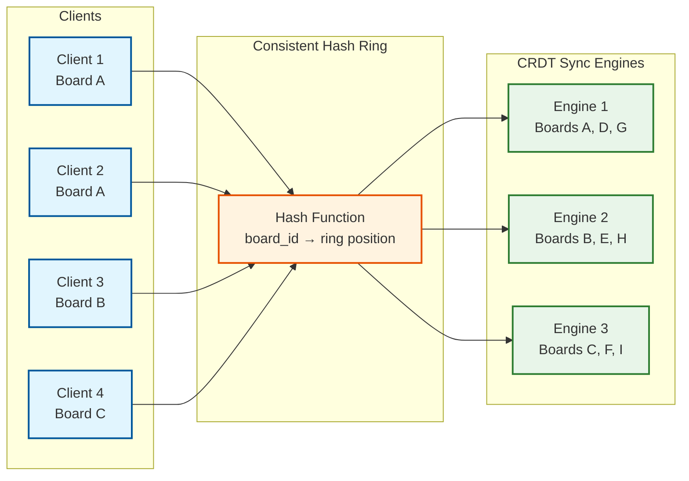
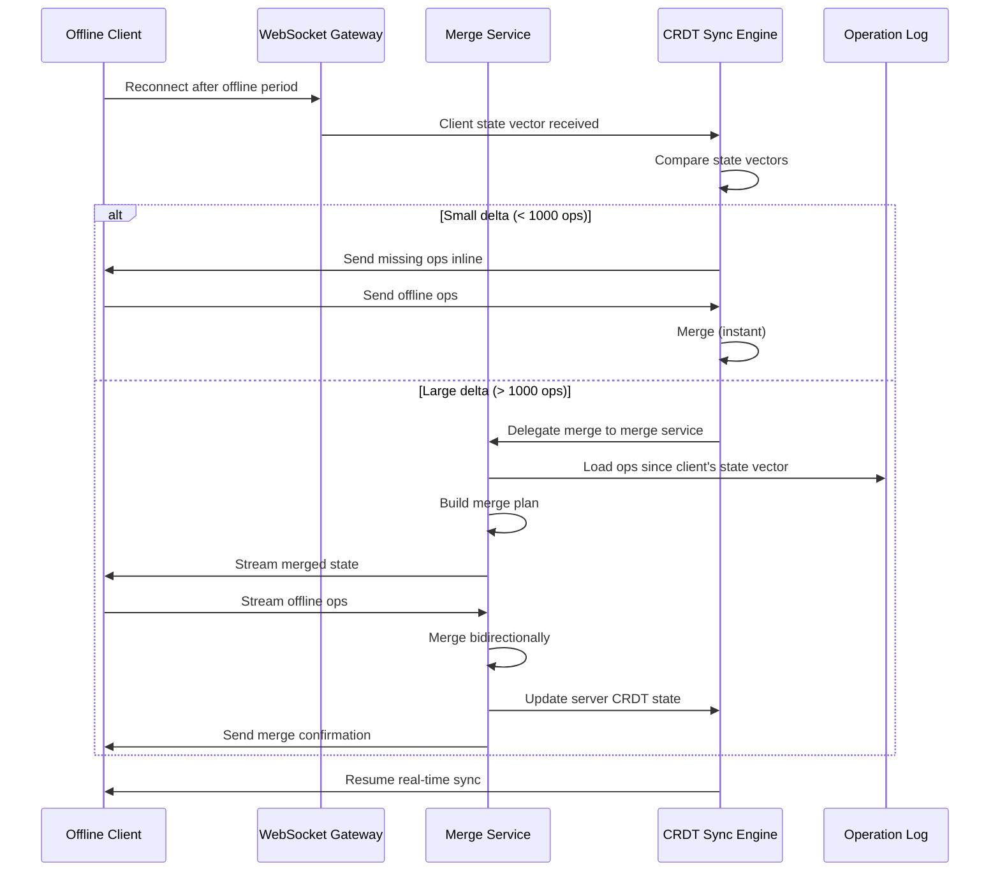
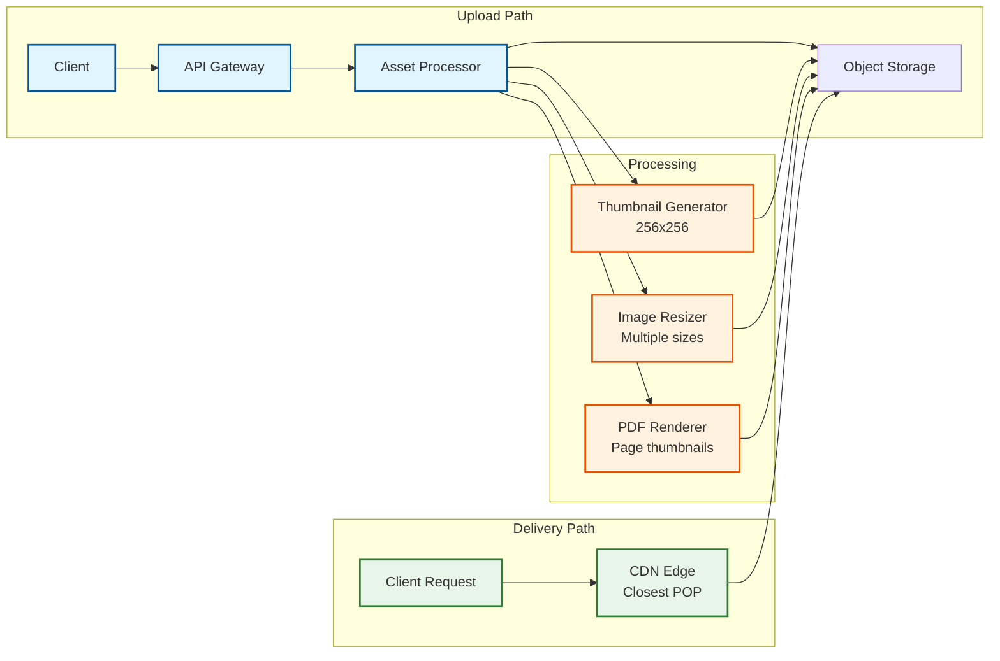
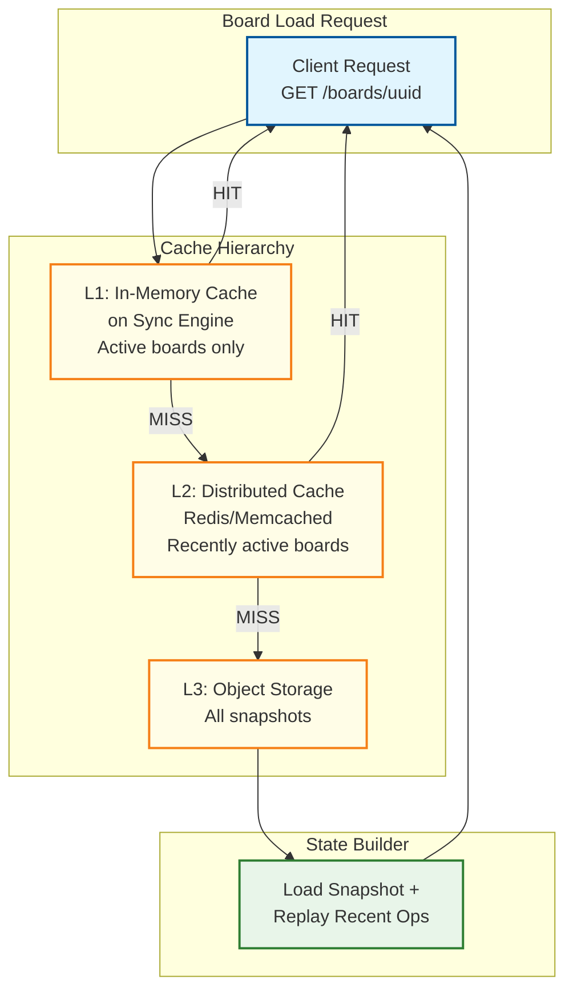
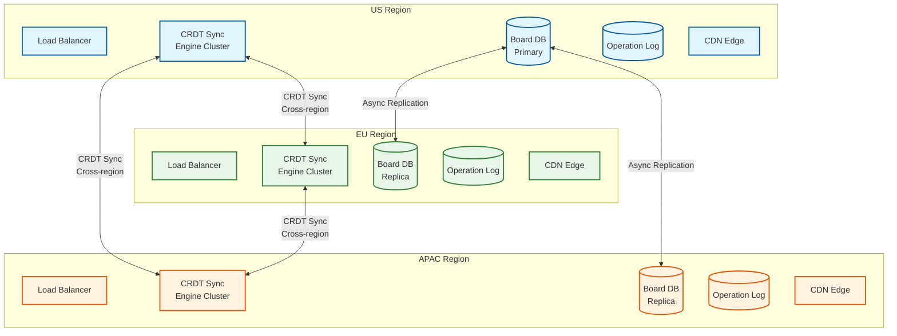

# Scalability & Reliability

## Board Sharding

### Sharding Strategy: Board-Level Consistent Hashing

Every board is assigned to a CRDT sync engine instance using consistent hashing on `board_id`. This ensures all operations for a single board are processed by the same server, maintaining a coherent in-memory CRDT state.



### Shard Migration

When a sync engine node is added or removed, boards must be migrated:

```
PSEUDOCODE: Board Shard Migration

FUNCTION migrate_board(board_id, old_engine, new_engine):
    // Step 1: Put board in "draining" state on old engine
    old_engine.set_draining(board_id)
    // Old engine still accepts operations but marks them for forwarding

    // Step 2: Transfer CRDT state to new engine
    crdt_state = old_engine.export_crdt_state(board_id)
    new_engine.import_crdt_state(board_id, crdt_state)

    // Step 3: Forward any operations that arrived during transfer
    pending_ops = old_engine.drain_pending(board_id)
    new_engine.apply_operations(board_id, pending_ops)

    // Step 4: Update routing table
    routing_table.update(board_id, new_engine.id)

    // Step 5: Redirect clients
    old_engine.send_redirect(board_id, new_engine.websocket_url)
    // Clients reconnect to new engine

    // Step 6: Cleanup old engine
    old_engine.release_board(board_id)
```

### Hot Board Handling

Viral boards (e.g., publicly shared templates) can have thousands of simultaneous participants. These are "hot shards" that require special handling.

```
PSEUDOCODE: Hot Board Detection and Mitigation

FUNCTION monitor_board_hotness():
    FOR board_id IN active_boards:
        participant_count = get_participant_count(board_id)
        ops_per_second = get_ops_rate(board_id)

        IF participant_count > HOT_THRESHOLD (100) OR ops_per_second > 500:
            escalate_to_hot_board(board_id)

FUNCTION escalate_to_hot_board(board_id):
    // Strategy 1: Dedicate an engine instance to this board alone
    dedicated_engine = provision_dedicated_engine()
    migrate_board(board_id, current_engine, dedicated_engine)

    // Strategy 2: Split participants into read-heavy and write-heavy
    // Read-only viewers get a cached snapshot (no real-time sync needed)
    // Active editors get full CRDT sync
    viewer_count = count_viewers(board_id)
    editor_count = count_editors(board_id)

    IF viewer_count > 500:
        enable_viewer_mode(board_id)
        // Viewers receive periodic snapshot broadcasts (1 Hz)
        // instead of individual operations

    // Strategy 3: Batch operation broadcasts
    set_broadcast_batch_window(board_id, 100ms)  // Instead of default 50ms

    // Strategy 4: Viewport-based operation filtering
    enable_viewport_filtering(board_id)
    // Only send operations relevant to each client's viewport
```

---

## CRDT Merge Service for Offline Reconciliation

### Merge Architecture



### Merge Conflict Report

After an offline merge, the system generates a conflict report for transparency:

```
PSEUDOCODE: Merge Conflict Report

STRUCTURE MergeReport:
    total_local_ops: Int
    total_remote_ops: Int
    auto_resolved_conflicts: List<Conflict>
    objects_added_locally: List<ObjectID>
    objects_added_remotely: List<ObjectID>
    objects_deleted: List<ObjectID>

STRUCTURE Conflict:
    object_id: ObjectID
    property: String
    local_value: Any
    remote_value: Any
    winner: "local" | "remote"
    resolution: "lww_timestamp"

FUNCTION generate_merge_report(local_ops, remote_ops):
    report = MergeReport()
    report.total_local_ops = length(local_ops)
    report.total_remote_ops = length(remote_ops)

    // Identify conflicts: same object + same property updated in both
    local_updates = group_by_object_and_property(local_ops)
    remote_updates = group_by_object_and_property(remote_ops)

    FOR (obj_id, prop) IN intersection(local_updates.keys(), remote_updates.keys()):
        conflict = Conflict(
            object_id=obj_id,
            property=prop,
            local_value=local_updates[(obj_id, prop)].value,
            remote_value=remote_updates[(obj_id, prop)].value,
            winner=lww_winner(local_updates[(obj_id, prop)], remote_updates[(obj_id, prop)]),
            resolution="lww_timestamp"
        )
        report.auto_resolved_conflicts.append(conflict)

    RETURN report
```

---

## Asset CDN Architecture

### Asset Upload and Delivery Pipeline



### Asset Variants

| Variant | Max Dimension | Use Case | Storage |
|---------|--------------|----------|---------|
| Original | Unlimited | Export, download | Object storage only |
| Large | 2048px | Full zoom on retina displays | Object storage + CDN |
| Medium | 1024px | Normal viewing | CDN-cached |
| Thumbnail | 256px | Board overview, minimap | CDN-cached, aggressive TTL |
| Placeholder | 32px (blurred) | Progressive loading (blur-up) | Inline base64 in board state |

---

## Board Snapshotting

### Snapshot Compaction

The operation log grows unboundedly. Snapshots allow us to compact old operations while maintaining the ability to load boards quickly.

```
PSEUDOCODE: Snapshot Management

STRUCTURE SnapshotPolicy:
    snapshot_interval_ops: Int = 200         // Snapshot every 200 operations
    snapshot_interval_time: Duration = 10min  // Or every 10 minutes
    retention_snapshots: Int = 100           // Keep last 100 snapshots
    operation_retention: Duration = 30days    // Keep ops for 30 days

FUNCTION maybe_create_snapshot(board_id, current_seq):
    last_snapshot_seq = get_last_snapshot_seq(board_id)
    last_snapshot_time = get_last_snapshot_time(board_id)

    should_snapshot = (
        current_seq - last_snapshot_seq >= snapshot_interval_ops OR
        now() - last_snapshot_time >= snapshot_interval_time
    )

    IF should_snapshot:
        create_snapshot(board_id, current_seq)

FUNCTION create_snapshot(board_id, at_sequence_id):
    // Export full CRDT state as binary blob
    crdt_state = sync_engine.export_state(board_id)

    snapshot = VersionSnapshot(
        id=generate_uuid(),
        board_id=board_id,
        crdt_state=crdt_state,
        at_sequence_id=at_sequence_id,
        created_at=now()
    )

    // Store in object storage
    store_snapshot(snapshot)

    // Cache latest snapshot in key-value store
    cache.set("snapshot:{board_id}:latest", snapshot, ttl=24h)

FUNCTION compact_old_operations(board_id):
    // Delete operations older than retention period
    // that are covered by a snapshot
    oldest_retained_snapshot = get_oldest_snapshot(board_id)
    delete_operations_before(
        board_id,
        sequence_id=oldest_retained_snapshot.at_sequence_id,
        older_than=operation_retention
    )
```

### Board Load Path

```
Fast path (hot board):
  1. Check cache for latest snapshot → HIT (< 1ms)
  2. Replay 0-200 operations since snapshot (< 10ms)
  3. Total: < 50ms

Warm path (recently active):
  1. Check cache for snapshot → MISS
  2. Fetch snapshot from object storage (50-200ms)
  3. Replay operations since snapshot (10-50ms)
  4. Populate cache
  5. Total: < 500ms

Cold path (inactive board):
  1. Fetch snapshot from object storage (100-500ms)
  2. Replay operations (50-200ms)
  3. Populate cache
  4. Total: < 1s
```

---

## Read Path Optimization

### Cached Board Snapshots for Fast Initial Load



### Cache Invalidation

Board cache is invalidated on:
- Every snapshot creation (cache is refreshed with new snapshot)
- Permission changes (cached metadata invalidated)
- Board deletion

For active boards, the CRDT sync engine already holds the board state in memory (L1 cache). The distributed cache (L2) serves boards that were recently active but whose sync engine has been rebalanced.

---

## Multi-Region Architecture

### Active-Active Replication

For global low-latency access, the system runs in multiple regions with active-active replication.



### Cross-Region Sync

CRDT's mathematical properties make cross-region replication straightforward:

```
PSEUDOCODE: Cross-Region CRDT Sync

FUNCTION cross_region_sync(local_engine, remote_engine):
    // Runs continuously with configurable batch interval

    LOOP:
        // Collect operations since last sync
        local_ops = local_engine.get_ops_since(last_sync_sequence)

        IF length(local_ops) > 0:
            // Send to remote region
            remote_engine.apply_operations(local_ops)
            // CRDT merge guarantees correctness regardless of ordering
            // or duplicate delivery

        // Receive operations from remote
        remote_ops = remote_engine.get_ops_since(remote_last_sync)
        IF length(remote_ops) > 0:
            local_engine.apply_operations(remote_ops)

        last_sync_sequence = local_engine.current_sequence()
        remote_last_sync = remote_engine.current_sequence()

        sleep(CROSS_REGION_SYNC_INTERVAL)  // 100ms - 500ms
```

### Region Failover

| Scenario | Detection | Recovery | Data Loss |
|----------|-----------|----------|-----------|
| Single engine node failure | Health check (5s) | Rehash boards to surviving nodes | None (clients have CRDT replicas) |
| Region network partition | Cross-region heartbeat (10s) | Each region operates independently | None (CRDT merge on heal) |
| Full region failure | DNS health check (30s) | Redirect traffic to surviving regions | At most: ops in-flight during failure |
| Database corruption | Checksum validation | Rebuild from operation log + client replicas | None (event-sourced) |

---

## Graceful Degradation

### Degradation Levels

```
Level 0: NORMAL
  All systems operational
  WebRTC + WebSocket available
  Full collaboration features

Level 1: WEBRTC_DEGRADED
  Trigger: TURN server overloaded or WebRTC failures > 10%
  Action: Disable WebRTC, use WebSocket-only
  User impact: Slightly higher cursor latency (30ms → 60ms)

Level 2: CURSOR_THROTTLED
  Trigger: Cursor relay servers at 80% capacity
  Action: Reduce cursor broadcast rate (15 Hz → 5 Hz)
  User impact: Slightly less smooth cursor movement

Level 3: SYNC_BATCHED
  Trigger: CRDT sync engines at 80% capacity
  Action: Increase operation batch window (50ms → 200ms)
  User impact: Operations feel slightly delayed

Level 4: VIEWERS_CACHED
  Trigger: Board has > 500 participants
  Action: Viewers receive cached snapshots (1 Hz), editors get real-time sync
  User impact: Viewers see 1-second-delayed updates

Level 5: READONLY_MODE
  Trigger: Persistence layer failure
  Action: Accept no new operations; serve cached board state
  User impact: View-only; local edits queued for later sync

Level 6: OFFLINE_MODE
  Trigger: Complete backend unavailability
  Action: Client operates on local CRDT state
  User impact: Full editing, no collaboration until reconnect
```

### Autoscaling Configuration

| Service | Scale Metric | Scale Up Threshold | Scale Down Threshold | Min Instances | Max Instances |
|---------|-------------|-------------------|---------------------|---------------|---------------|
| WebSocket Gateway | Connection count | > 2,000/instance | < 500/instance | 20 | 500 |
| CRDT Sync Engine | Active boards | > 200/instance | < 50/instance | 10 | 200 |
| Cursor Relay | Message throughput | > 50K msgs/sec | < 10K msgs/sec | 5 | 100 |
| TURN Relay | Bandwidth | > 1 Gbps/instance | < 200 Mbps/instance | 5 | 50 |
| Export Workers | Queue depth | > 10 pending | < 2 pending | 2 | 20 |
| Asset Processors | Queue depth | > 20 pending | < 5 pending | 3 | 30 |

---

## Disaster Recovery

### Recovery Objectives

| Metric | Target | Rationale |
|--------|--------|-----------|
| RPO (Recovery Point Objective) | < 1 second | Operation log is replicated synchronously within region |
| RTO (Recovery Time Objective) | < 5 minutes | Clients reconnect to healthy region; local CRDT state bridges gap |
| Data Durability | 99.999999% | Multi-region operation log replication + client replicas |

### CRDT's Unique DR Advantage

Unlike traditional architectures where the server is the single source of truth, CRDT-based canvas has a unique disaster recovery property: **every connected client holds a valid, complete replica of every board they have open**. In a catastrophic server failure:

1. Clients continue operating offline (local CRDT state)
2. When new infrastructure is provisioned, clients sync their state to the new server
3. The server rebuilds its state from the union of all client states
4. Any board open on at least one client is fully recoverable

This inverts the traditional DR model: the "backup" is distributed across thousands of client devices.

### Backup Strategy

| Data | Backup Frequency | Retention | Method |
|------|-----------------|-----------|--------|
| Operation log | Continuous (replicated) | 90 days | Cross-region replication |
| Snapshots | Every 10 min per active board | 1 year | Object storage versioning |
| Board metadata | Daily | 30 days | Database logical backup |
| Assets | On upload (multi-region) | Forever (until board deleted) | Object storage replication |
