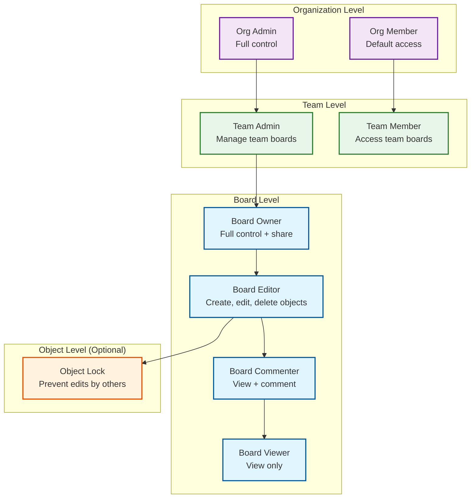

# Security & Compliance

## Authentication

### Authentication Methods

| Method | Use Case | Flow |
|--------|----------|------|
| **SSO / SAML** | Enterprise organizations | IdP-initiated or SP-initiated SAML flow; user authenticates via corporate IdP |
| **OAuth 2.0 / OIDC** | Standard login | OAuth flow with Google, Microsoft, GitHub as identity providers |
| **Email + Password** | Direct accounts | Bcrypt-hashed passwords; mandatory email verification |
| **Magic Link** | Passwordless login | Time-limited (15 min) single-use link sent to email |
| **Guest Token** | Anonymous board access | Short-lived JWT from shareable link; limited permissions |
| **API Key** | Programmatic access | Long-lived key for automation; scoped to workspace |

### Session Management

```
PSEUDOCODE: Session and Token Architecture

STRUCTURE AuthToken:
    access_token: JWT
        payload:
            user_id: UUID
            workspace_id: UUID
            organization_id: UUID
            roles: List<String>         // ["editor", "admin"]
            exp: Timestamp              // 15 minutes
            jti: UUID                   // Token ID for revocation
    refresh_token: Opaque
        stored_in: HttpOnly cookie + server-side store
        ttl: 30 days
        rotation: true                  // New refresh token on each use

FUNCTION authenticate_websocket(ws_connection):
    // WebSocket connections authenticate on upgrade
    token = extract_token(ws_connection.upgrade_request)
    claims = verify_jwt(token)

    IF claims.exp < now():
        // Token expired; client must refresh and reconnect
        ws_connection.close(4001, "Token expired")
        RETURN

    // Associate session with connection
    ws_connection.user_id = claims.user_id
    ws_connection.workspace_id = claims.workspace_id
    ws_connection.permissions = lookup_board_permissions(claims.user_id, board_id)

    // Periodic re-validation (every 5 minutes)
    schedule_revalidation(ws_connection, interval=5min)

FUNCTION on_revalidation(ws_connection):
    // Check if permissions have changed since connection established
    current_perms = lookup_board_permissions(ws_connection.user_id, board_id)
    IF current_perms != ws_connection.permissions:
        ws_connection.permissions = current_perms
        IF current_perms.level == "none":
            ws_connection.close(4003, "Access revoked")
        ELSE IF current_perms.level == "viewer":
            ws_connection.send({ type: "permission_change", level: "viewer" })
            // Client disables editing UI
```

---

## Authorization

### Permission Model



### Permission Matrix

| Action | Owner | Editor | Commenter | Viewer | Guest (View) | Guest (Edit) |
|--------|-------|--------|-----------|--------|---------------|--------------|
| View board | Yes | Yes | Yes | Yes | Yes | Yes |
| Pan / zoom | Yes | Yes | Yes | Yes | Yes | Yes |
| Add objects | Yes | Yes | No | No | No | Yes |
| Edit objects | Yes | Yes | No | No | No | Yes |
| Delete objects | Yes | Yes | No | No | No | Yes |
| Add comments | Yes | Yes | Yes | No | No | Yes |
| Resolve comments | Yes | Yes | No | No | No | No |
| Share board | Yes | No | No | No | No | No |
| Change permissions | Yes | No | No | No | No | No |
| Export board | Yes | Yes | Yes | Yes | Configurable | Configurable |
| View version history | Yes | Yes | Yes | Yes | No | No |
| Restore version | Yes | No | No | No | No | No |
| Delete board | Yes | No | No | No | No | No |
| Lock objects | Yes | Yes | No | No | No | No |

### Server-Side Operation Validation

Every CRDT operation received by the sync engine is validated against the user's permissions before being merged and broadcast:

```
PSEUDOCODE: Operation Permission Validation

FUNCTION validate_operation(user_id, board_id, operation):
    permissions = get_user_board_permissions(user_id, board_id)

    SWITCH operation.type:
        CASE "add_object":
            IF permissions.level NOT IN ["owner", "editor", "guest_editor"]:
                RETURN reject("Insufficient permissions to add objects")
            IF operation.object_type == "image" AND NOT permissions.can_upload:
                RETURN reject("Upload not permitted")

        CASE "update_property", "move_object", "batch_update":
            IF permissions.level NOT IN ["owner", "editor", "guest_editor"]:
                RETURN reject("Insufficient permissions to edit")
            object = get_object(operation.object_id)
            IF object.is_locked AND object.locked_by != user_id:
                RETURN reject("Object is locked by another user")

        CASE "delete_object":
            IF permissions.level NOT IN ["owner", "editor", "guest_editor"]:
                RETURN reject("Insufficient permissions to delete")
            object = get_object(operation.object_id)
            IF object.is_locked AND object.locked_by != user_id:
                RETURN reject("Cannot delete locked object")

        CASE "lock_object":
            IF permissions.level NOT IN ["owner", "editor"]:
                RETURN reject("Insufficient permissions to lock")

    RETURN accept()
```

---

## Guest Access

### Shareable Links

```
PSEUDOCODE: Guest Link Architecture

STRUCTURE ShareLink:
    token: String               // Cryptographically random, 32 bytes, base64url
    board_id: UUID
    permission_level: "viewer" | "editor" | "commenter"
    created_by: UUID
    expires_at: Timestamp       // null = never expires
    max_uses: Int               // null = unlimited
    use_count: Int
    password_hash: String       // Optional password protection
    allow_export: Boolean
    watermark_exports: Boolean

FUNCTION create_share_link(board_id, user_id, options):
    // Verify user is board owner
    IF NOT is_board_owner(user_id, board_id):
        RETURN error("Only board owners can create share links")

    token = generate_secure_token(32)
    link = ShareLink(
        token=token,
        board_id=board_id,
        permission_level=options.permission_level,
        created_by=user_id,
        expires_at=options.expires_at,
        max_uses=options.max_uses,
        password_hash=bcrypt(options.password) IF options.password ELSE null,
        allow_export=options.allow_export,
        watermark_exports=options.watermark_exports
    )
    store(link)
    RETURN "https://app.example.com/board/{token}"

FUNCTION access_via_share_link(token, password=null):
    link = lookup_share_link(token)

    IF link IS null:
        RETURN error(404, "Link not found")
    IF link.expires_at AND link.expires_at < now():
        RETURN error(410, "Link expired")
    IF link.max_uses AND link.use_count >= link.max_uses:
        RETURN error(410, "Link usage limit reached")
    IF link.password_hash AND NOT bcrypt_verify(password, link.password_hash):
        RETURN error(401, "Password required")

    // Create guest session
    guest_token = create_jwt(
        user_id="guest-" + generate_short_id(),
        board_id=link.board_id,
        permissions=link.permission_level,
        exp=now() + 24h,
        is_guest=true
    )

    link.use_count += 1
    RETURN { guest_token, board_id: link.board_id }
```

### Export Watermarking

For guest access, exports can be watermarked to trace leaks:

```
Watermark contains:
  - Guest session ID
  - Board name
  - Timestamp
  - Semi-transparent text overlay on exported images
  - Metadata embedded in PDF exports
```

---

## Data Isolation

### Per-Organization Encryption

| Layer | Encryption | Key Management |
|-------|-----------|----------------|
| Transport | TLS 1.3 (all connections) | Automated certificate rotation |
| WebSocket | WSS (TLS) | Same as transport |
| WebRTC | DTLS 1.2 + SRTP (mandatory in WebRTC) | Per-session ephemeral keys |
| At-rest (operation log) | AES-256-GCM | Per-organization key in HSM/KMS |
| At-rest (snapshots) | AES-256-GCM | Per-organization key |
| At-rest (assets) | AES-256-GCM | Per-organization key |
| Client-side (IndexedDB) | Web Crypto API | Per-user key derived from credentials |

### Tenant Isolation

```
PSEUDOCODE: Multi-Tenant Data Isolation

// Data isolation at every layer:

// 1. Database: Row-level security
POLICY board_isolation ON boards
    USING (organization_id = current_org_id())

// 2. Operation log: Partitioned by organization
PARTITION operation_log BY organization_id
    // Each org's data on separate storage partition
    // Cross-org queries are impossible

// 3. Object storage: Org-prefixed paths
ASSET_PATH = /{organization_id}/{board_id}/{asset_id}
    // Bucket policy prevents cross-org access

// 4. Cache: Org-namespaced keys
CACHE_KEY = "org:{org_id}:board:{board_id}:snapshot"

// 5. Search index: Per-org index
SEARCH_INDEX = "boards-{organization_id}"
    // Each org searches only their own content

// 6. Sync engine: Org-scoped board access
FUNCTION validate_board_access(user_id, board_id):
    board = get_board(board_id)
    user = get_user(user_id)
    IF board.organization_id != user.organization_id:
        IF NOT is_guest_link_access():
            RETURN deny("Cross-organization access denied")
```

---

## GDPR Compliance

### Data Subject Rights

| Right | Implementation |
|-------|---------------|
| **Right to Access** | Export all boards, objects, comments, and activity logs for a user |
| **Right to Erasure** | Delete user's personal data; anonymize their contributions on shared boards |
| **Right to Portability** | Export boards as JSON + assets as a downloadable archive |
| **Right to Rectification** | User can update profile data; corrections propagate to all references |
| **Right to Object** | Opt out of analytics and AI features processing |

### Data Deletion Process

```
PSEUDOCODE: User Data Deletion (Right to Erasure)

FUNCTION delete_user_data(user_id):
    // Phase 1: Identify all user data
    user_boards = get_boards_owned_by(user_id)
    user_comments = get_comments_by(user_id)
    user_assets = get_assets_uploaded_by(user_id)

    // Phase 2: Handle owned boards
    FOR board IN user_boards:
        IF board has no other editors:
            // Sole owner: schedule board for deletion
            schedule_board_deletion(board.id, grace_period=30days)
        ELSE:
            // Transfer ownership to next editor
            transfer_ownership(board.id, next_editor)

    // Phase 3: Anonymize contributions on shared boards
    FOR board IN boards_user_participated_in:
        anonymize_user_operations(board.id, user_id)
        // Replace user_id with "deleted-user" in operation log
        // Replace cursor color/name in historical data

    // Phase 4: Delete personal data
    delete_user_profile(user_id)
    delete_user_sessions(user_id)
    delete_user_api_keys(user_id)

    // Phase 5: Delete comments
    FOR comment IN user_comments:
        anonymize_comment(comment.id, author="Deleted User")

    // Phase 6: Purge from caches
    invalidate_all_caches_for_user(user_id)

    // Phase 7: Audit log
    log_deletion_event(user_id, timestamp=now())
```

### Data Residency

For organizations requiring data residency (e.g., EU-only storage):

| Data Type | Residency Enforcement |
|-----------|----------------------|
| Board metadata | Region-pinned database partition |
| Operation log | Region-pinned storage partition |
| Snapshots | Region-pinned object storage bucket |
| Assets | Region-pinned object storage bucket |
| CRDT sync | Region-pinned sync engine cluster |
| CDN cache | Geo-restricted CDN distribution |

---

## SOC 2 Type II Compliance

### Control Areas

| Control Area | Implementation |
|-------------|---------------|
| **Access Control** | RBAC with board/workspace/org granularity; MFA enforcement for enterprise |
| **Audit Logging** | All board access, permission changes, exports, and deletions logged |
| **Change Management** | Infrastructure as code; peer-reviewed changes; staged rollouts |
| **Incident Response** | Defined runbooks; 15-min paging SLA; post-incident reviews |
| **Data Protection** | Encryption at rest and in transit; per-org key management |
| **Availability** | 99.99% SLA; multi-region architecture; automated failover |
| **Monitoring** | 24/7 infrastructure monitoring; anomaly detection; capacity planning |

### Audit Trail

```
Every security-relevant action is logged:

{
  "timestamp": "2026-03-08T10:30:00Z",
  "actor": { "user_id": "uuid", "ip": "203.0.113.42", "user_agent": "..." },
  "action": "board.share_link.create",
  "resource": { "board_id": "uuid", "organization_id": "uuid" },
  "details": {
    "permission_level": "editor",
    "expires_at": "2026-03-15T10:30:00Z",
    "password_protected": true
  },
  "result": "success"
}

Logged actions include:
- Board create/delete/share/unshare
- Permission changes
- Share link creation/revocation
- User login/logout
- Export requests
- Admin operations (org settings, user management)
- API key creation/rotation/deletion
```

---

## Content Security

### Abuse Detection for Shared Boards

Publicly shared boards can contain inappropriate content. Detection runs asynchronously:

```
PSEUDOCODE: Content Moderation Pipeline

FUNCTION moderate_board(board_id, trigger):
    // Triggers: board shared publicly, reported, periodic scan

    // Step 1: Text content scan
    text_objects = get_text_content(board_id)
    text_issues = scan_text_for_policy_violations(text_objects)
    // Checks: hate speech, PII exposure, malicious URLs

    // Step 2: Image content scan
    images = get_image_assets(board_id)
    image_issues = scan_images_for_policy_violations(images)
    // Checks: CSAM, explicit content, violence

    // Step 3: Embedded content scan
    embeds = get_embedded_urls(board_id)
    embed_issues = check_urls_against_blocklist(embeds)
    // Checks: phishing, malware, known-bad domains

    // Step 4: Action based on severity
    IF any_high_severity(text_issues + image_issues + embed_issues):
        restrict_board(board_id)              // Remove public access
        notify_trust_safety_team(board_id)    // Human review
        log_moderation_action(board_id)

    RETURN moderation_report
```

### Input Validation

| Input | Validation | Limit |
|-------|-----------|-------|
| Board title | Sanitize HTML, max length | 200 characters |
| Text content in objects | Sanitize HTML entities | 10,000 characters per text object |
| Object count per board | Hard limit | 100,000 objects |
| Asset file size | Max per file | 25 MB |
| Asset total per board | Max aggregate | 500 MB |
| WebSocket message size | Max payload | 1 MB |
| CRDT update size | Max delta | 512 KB |
| Connector count per object | Max connections | 50 |
| Board dimensions | Canvas coordinate range | -1,000,000 to +1,000,000 |

---

## Threat Model

| Threat | Attack Vector | Mitigation |
|--------|--------------|------------|
| **Unauthorized board access** | Guessing board URLs/IDs | UUIDs (128-bit); authentication required; share links use 256-bit tokens |
| **CRDT injection** | Malicious CRDT operations | Server-side operation validation before merge; schema enforcement |
| **XSS via board content** | Injecting scripts in text/embed objects | Content sanitization; CSP headers; sandboxed iframe for embeds |
| **DoS via large operations** | Flooding with operations or creating massive objects | Rate limiting; message size limits; operation cost accounting |
| **Data exfiltration** | Scraping board content | Rate-limited export API; watermarking; access logging |
| **Replay attacks** | Replaying valid WebSocket messages | Sequence numbers on operations; idempotent CRDT operations |
| **Man-in-the-middle** | Intercepting WebSocket/WebRTC traffic | TLS 1.3 (WebSocket); DTLS (WebRTC); certificate pinning on mobile |
| **Guest link abuse** | Sharing guest links beyond intended audience | Expiry, max-use limits, password protection, IP allowlisting |
