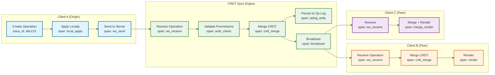

# Observability

## Key Metrics

### Collaboration Quality Metrics

These are the primary health indicators of the collaboration experience. They directly correlate with user satisfaction.

| Metric | Description | Target | Alert Threshold |
|--------|-------------|--------|-----------------|
| `crdt.operation.latency.p50` | Time from operation creation on Client A to render on Client B | <100ms | >200ms |
| `crdt.operation.latency.p99` | Same, 99th percentile | <500ms | >1s |
| `cursor.broadcast.latency.p50` | Time from cursor move to render on peers | <50ms | >100ms |
| `cursor.broadcast.latency.p99` | Same, 99th percentile | <100ms | >200ms |
| `crdt.convergence.time` | Time for all connected clients to reach identical state after an operation | <2s | >5s |
| `crdt.desync.events` | Number of detected state divergences per hour | 0 | >0 |
| `crdt.conflict.rate` | Concurrent operations on the same object per minute per board | <5 | >20 |
| `session.reconnect.count` | Number of WebSocket reconnections per session | <2 | >5 |
| `session.reconnect.success_rate` | Percentage of reconnections that restore full sync | 99.9% | <99% |
| `offline.sync.success_rate` | Offline edits successfully merged on reconnect | 99.9% | <99% |
| `offline.sync.duration.p50` | Time to complete offline-to-online sync | <500ms | >2s |

### Board Performance Metrics

| Metric | Description | Target | Alert Threshold |
|--------|-------------|--------|-----------------|
| `board.load.time.p50` | Time from navigation to interactive canvas | <1s | >2s |
| `board.load.time.p99` | Same, 99th percentile | <3s | >5s |
| `board.object.count` | Number of live objects on a board | (informational) | >50,000 |
| `board.crdt_state.size_bytes` | Size of board's CRDT state in memory | (informational) | >50 MB |
| `board.participants.active` | Current active editors per board | (informational) | >200 |
| `board.participants.viewers` | Current viewers per board | (informational) | >2,000 |
| `board.snapshot.age_seconds` | Time since last snapshot for active boards | <600s | >1,800s |
| `board.oplog.size_bytes` | Operation log size since last snapshot | (informational) | >10 MB |

### WebRTC Infrastructure Metrics

| Metric | Description | Target | Alert Threshold |
|--------|-------------|--------|-----------------|
| `webrtc.connection.success_rate` | ICE negotiation success rate | >85% | <75% |
| `webrtc.connection.setup_time.p50` | Time to establish WebRTC data channel | <2s | >5s |
| `webrtc.ice.candidate_types` | Distribution of ICE candidate types (host/srflx/relay) | (informational) | relay >25% |
| `turn.active_sessions` | Current TURN relay sessions | (informational) | >capacity x 0.8 |
| `turn.bandwidth.total_gbps` | Total TURN relay bandwidth | (informational) | >capacity x 0.8 |
| `turn.bandwidth.per_session_kbps` | Bandwidth per TURN session | <100 Kbps | >200 Kbps |
| `turn.cost.daily_usd` | Daily TURN infrastructure cost | (informational) | >$3,000/day |
| `stun.response_time.p99` | STUN server response latency | <50ms | >200ms |
| `webrtc.fallback_to_websocket` | % of sessions falling back to WebSocket | <20% | >30% |

### Client-Side Performance Metrics

These are collected from client browsers/apps and reported to the backend:

| Metric | Description | Target | Alert Threshold |
|--------|-------------|--------|-----------------|
| `client.canvas.fps` | Canvas rendering frames per second | >55 FPS (p95) | <30 FPS (p50) |
| `client.render.frame_time.p95` | Time to render a single frame | <16ms | >33ms |
| `client.viewport_query.time.p95` | R-tree viewport query time | <1ms | >5ms |
| `client.crdt.merge.time.p95` | Time to merge a received CRDT update | <5ms | >20ms |
| `client.memory.crdt_state_mb` | Memory used by CRDT state | <50 MB | >100 MB |
| `client.memory.render_buffers_mb` | Memory used by canvas rendering | <100 MB | >200 MB |
| `client.indexeddb.write.time.p95` | Time to persist CRDT update to IndexedDB | <10ms | >50ms |
| `client.asset.load.time.p50` | Time to load an image asset | <500ms | >2s |

### Infrastructure Metrics

| Metric | Description | Target | Alert Threshold |
|--------|-------------|--------|-----------------|
| `ws_gateway.connections.active` | Active WebSocket connections | (informational) | >capacity x 0.8 |
| `ws_gateway.messages.in_per_sec` | Inbound message rate | (informational) | >capacity x 0.8 |
| `ws_gateway.messages.out_per_sec` | Outbound message rate (fanout) | (informational) | >capacity x 0.8 |
| `sync_engine.boards.active` | Active boards in memory | (informational) | >capacity x 0.8 |
| `sync_engine.ops.merged_per_sec` | CRDT operations merged per second | (informational) | >capacity x 0.8 |
| `sync_engine.memory.used_pct` | Memory utilization | <70% | >85% |
| `cursor_relay.messages.per_sec` | Cursor messages relayed per second | (informational) | >capacity x 0.8 |
| `persistence.oplog.write.latency.p99` | Operation log write latency | <10ms | >50ms |
| `persistence.snapshot.write.latency.p99` | Snapshot write latency | <500ms | >2s |
| `export.queue.depth` | Pending export jobs | <10 | >50 |
| `export.duration.p95` | Export processing time | <10s | >30s |
| `asset_processor.queue.depth` | Pending asset processing jobs | <20 | >100 |

---

## Logging Strategy

### Log Levels by Component

| Component | Info Level | Debug Level | Error Level |
|-----------|-----------|-------------|-------------|
| **WebSocket Gateway** | Connection open/close, auth result | Message routing, heartbeat | Connection failures, auth errors |
| **CRDT Sync Engine** | Board join/leave, snapshot creation | Operation merge details, state vector exchanges | Merge failures, desync detection |
| **Cursor Relay** | Session start/end | (disabled in production---too verbose) | Delivery failures |
| **Signaling Server** | WebRTC session setup/teardown | ICE candidate exchange | Negotiation failures |
| **Board Service** | Board CRUD operations | Permission lookups | Authorization failures |
| **Export Service** | Export started/completed | Rendering progress | Export failures, timeout |

### Structured Log Format

```
{
  "timestamp": "2026-03-08T10:30:00.123Z",
  "level": "INFO",
  "service": "crdt-sync-engine",
  "instance_id": "sync-engine-us-east-42",
  "trace_id": "abc123def456",
  "span_id": "span789",
  "board_id": "board-uuid",
  "user_id": "user-uuid",
  "event": "operation_merged",
  "details": {
    "operation_type": "move_object",
    "object_id": "obj-uuid",
    "client_id": "device-123",
    "merge_time_ms": 0.4,
    "broadcast_peers": 12,
    "operation_size_bytes": 128
  }
}
```

### Log Sampling

| Event Type | Sampling Rate | Rationale |
|-----------|--------------|-----------|
| Board open/close | 100% | Low volume, high value |
| CRDT operation merge | 10% | High volume; sample for trends |
| Cursor updates | 0.1% | Extremely high volume |
| Auth events | 100% | Security-critical |
| Errors | 100% | Always log errors |
| WebRTC signaling | 100% | Low volume, diagnostic value |
| Snapshot creation | 100% | Low volume, operational value |

---

## Distributed Tracing

### Trace Context Propagation

Traces follow the path of an operation from creation on one client through the server to delivery on all peers.



### Key Trace Spans

| Span Name | Component | Duration Target | What It Measures |
|-----------|-----------|----------------|-----------------|
| `local_apply` | Client | <5ms | Time to apply operation to local CRDT |
| `indexeddb_write` | Client | <10ms | Time to persist to local storage |
| `ws_send` | Client | <2ms | Time to serialize and send via WebSocket |
| `ws_receive` | Server | <1ms | Time to deserialize incoming message |
| `auth_check` | Server | <2ms | Permission validation |
| `crdt_merge` | Server | <5ms | CRDT merge operation |
| `oplog_write` | Server | <10ms | Persist to operation log |
| `broadcast` | Server | <5ms | Enqueue for broadcast to all peers |
| `peer_receive` | Client (peer) | <1ms | Deserialize received operation |
| `peer_merge` | Client (peer) | <5ms | Merge into local CRDT state |
| `peer_render` | Client (peer) | <16ms | Re-render affected canvas objects |

### End-to-End Latency Breakdown

```
Total operation propagation latency budget: <100ms (p50)

Client A:
  local_apply:     2ms
  indexeddb_write:  5ms (async, not on critical path)
  ws_send:          1ms
  network_to_server: 15ms (avg)
  Subtotal client A: ~18ms

Server:
  ws_receive:       1ms
  auth_check:       1ms
  crdt_merge:       2ms
  oplog_write:      5ms (async, not on critical path)
  broadcast_enqueue: 1ms
  Subtotal server:  ~5ms

Server to Client B:
  network_to_client: 15ms (avg)

Client B:
  ws_receive:       1ms
  crdt_merge:       2ms
  render:           5ms
  Subtotal client B: ~8ms

Total: 18 + 5 + 15 + 8 = ~46ms (p50)
Budget remaining: 54ms
```

---

## Alerting

### Critical Alerts (Page Immediately)

| Alert | Condition | Impact | Action |
|-------|-----------|--------|--------|
| **CRDT Desync Detected** | `crdt.desync.events > 0` for any board | Users see different states; data inconsistency | Investigate merge engine; force re-sync affected clients |
| **Board Unavailable** | Board load failure rate > 1% for 2 min | Users cannot access boards | Check sync engine health, cache, persistence layer |
| **TURN Capacity Exhausted** | `turn.active_sessions > capacity * 0.95` | New WebRTC connections fail; degraded performance | Scale TURN servers; enable WebSocket-only degradation |
| **Operation Log Write Failure** | `persistence.oplog.write.error_rate > 0.1%` | Operations may be lost | Check persistence layer; operations are buffered in sync engine memory |
| **Sync Engine OOM** | `sync_engine.memory.used_pct > 90%` | Board sync failures, crashes | Rebalance boards across engines; evict cold boards |

### Warning Alerts (Notify On-Call)

| Alert | Condition | Impact | Action |
|-------|-----------|--------|--------|
| **High Operation Latency** | `crdt.operation.latency.p99 > 1s` for 5 min | Sluggish collaboration experience | Check sync engine load; increase batching |
| **High Cursor Latency** | `cursor.broadcast.latency.p99 > 200ms` for 5 min | Cursors feel laggy | Check cursor relay load; throttle update rate |
| **Hot Board Detected** | `board.participants.active > 200` | Potential performance degradation | Monitor; prepare to apply hot-board mitigations |
| **WebRTC Fallback Rate High** | `webrtc.fallback_to_websocket > 30%` for 30 min | Higher server bandwidth; slightly higher latency | Check STUN/TURN health; network changes |
| **Snapshot Backlog** | `board.snapshot.age_seconds > 1800` for active boards | Longer board load times; larger replay cost | Check persistence workers; increase snapshot frequency |
| **Export Queue Growing** | `export.queue.depth > 50` | Users waiting for exports | Scale export workers |
| **Client FPS Degradation** | `client.canvas.fps < 30 (p50)` | Poor user experience | Investigate heavy boards; check for rendering regression |

### Informational Alerts (Dashboard Only)

| Alert | Condition | Purpose |
|-------|-----------|---------|
| **Tombstone Growth** | `crdt.tombstones > live_objects * 2` for any board | May need GC; monitor for boards with excessive edit history |
| **Large Board Warning** | `board.object.count > 20000` | Monitor performance; may need chunked loading |
| **High TURN Cost Day** | `turn.cost.daily_usd > $2000` | Budget monitoring |
| **Cross-Region Sync Lag** | `cross_region.sync.lag > 500ms` | May affect multi-region users |

---

## Dashboards

### Collaboration Health Dashboard

```
┌─────────────────────────────────────────────────────────────────┐
│  COLLABORATION HEALTH                                   [Live]  │
├───────────────────────┬─────────────────────────────────────────┤
│ Operation Latency     │  ████████░░ p50: 46ms  p99: 180ms      │
│ Cursor Latency        │  ██████░░░░ p50: 28ms  p99: 85ms       │
│ Desync Events (24h)   │  0 ✓                                    │
│ Active Sessions       │  312,456                                │
│ Active Boards         │  89,234                                 │
│ Reconnect Rate        │  0.3% ✓                                 │
├───────────────────────┴─────────────────────────────────────────┤
│  OPERATION LATENCY OVER TIME (24h)                              │
│  200ms ┤                                                        │
│  150ms ┤      ╭─╮                                               │
│  100ms ┤  ╭───╯ ╰───╮                ╭──╮                       │
│   50ms ┤──╯         ╰────────────────╯  ╰───────────           │
│    0ms ┤────────────────────────────────────────────            │
│        └──────────────────────────────────────────────          │
│         00:00   04:00   08:00   12:00   16:00   20:00           │
├─────────────────────────────────────────────────────────────────┤
│  TOP 10 HOTTEST BOARDS                                          │
│  Board ID          Editors  Viewers  Ops/sec  State Size         │
│  board-a1b2...     287      1,245    156      12.3 MB            │
│  board-c3d4...     134        567     82       8.7 MB            │
│  board-e5f6...      89        234     45       4.2 MB            │
└─────────────────────────────────────────────────────────────────┘
```

### WebRTC Infrastructure Dashboard

```
┌─────────────────────────────────────────────────────────────────┐
│  WEBRTC INFRASTRUCTURE                                  [Live]  │
├───────────────────────┬─────────────────────────────────────────┤
│ Connection Success    │  87.3%                                  │
│ WebSocket Fallback    │  18.2%                                  │
│ TURN Sessions Active  │  78,432                                 │
│ TURN Bandwidth        │  3.2 Gbps                               │
│ Est. Daily TURN Cost  │  $1,847                                 │
├───────────────────────┴─────────────────────────────────────────┤
│  ICE CANDIDATE TYPE DISTRIBUTION                                │
│  ┌────────────────────────────────────────────┐                 │
│  │ ████████████████░░░░░░░░░░░░░░░░░░░░░░░░ │ Host: 42%       │
│  │ ████████████████████░░░░░░░░░░░░░░░░░░░░ │ Server-Refl: 28%│
│  │ ████████████░░░░░░░░░░░░░░░░░░░░░░░░░░░░ │ Relay: 18%      │
│  │ ████████░░░░░░░░░░░░░░░░░░░░░░░░░░░░░░░░ │ Prflx: 12%      │
│  └────────────────────────────────────────────┘                 │
└─────────────────────────────────────────────────────────────────┘
```

---

## Anomaly Detection

### CRDT Divergence Detection

The most dangerous failure mode is clients silently diverging---showing different board states while believing they are in sync.

```
PSEUDOCODE: Divergence Detection

FUNCTION periodic_convergence_check(board_id):
    // Runs every 30 seconds for active boards

    // Step 1: Collect state hashes from all connected clients
    client_hashes = {}
    FOR client IN get_connected_clients(board_id):
        hash_request = { type: "state_hash_request", nonce: random() }
        client.send(hash_request)
        // Client computes SHA-256 of their CRDT state and responds

    // Step 2: Wait for responses (timeout: 5s)
    wait_for_responses(timeout=5s)

    // Step 3: Compare
    unique_hashes = set(client_hashes.values())

    IF length(unique_hashes) == 1:
        // All clients agree: healthy
        RETURN CONVERGED

    ELSE IF length(unique_hashes) == 2:
        // One outlier: likely a client that missed an update
        outlier = find_minority_hash(client_hashes)
        trigger_resync(outlier.client_id, board_id)
        emit_metric("crdt.desync.events", 1, board_id=board_id)
        RETURN RESYNC_TRIGGERED

    ELSE:
        // Multiple disagreements: serious issue
        alert_critical("CRDT divergence detected", board_id=board_id,
                       unique_states=length(unique_hashes))
        // Force full resync for all clients from server state
        force_full_resync(board_id)
        RETURN DIVERGENCE_DETECTED
```

### Performance Anomaly Detection

```
PSEUDOCODE: Client Performance Monitoring

FUNCTION detect_client_performance_issues(client_metrics):
    issues = []

    // Frame rate degradation
    IF client_metrics.fps < 30 AND client_metrics.fps_was > 50:
        issues.append({
            type: "fps_degradation",
            current: client_metrics.fps,
            previous: client_metrics.fps_was,
            possible_cause: infer_fps_cause(client_metrics)
        })

    // Memory leak detection
    IF client_metrics.memory_mb > 200 AND
       client_metrics.memory_growth_rate > 1mb_per_minute:
        issues.append({
            type: "memory_leak_suspected",
            current_mb: client_metrics.memory_mb,
            growth_rate: client_metrics.memory_growth_rate
        })

    // CRDT state bloat
    IF client_metrics.crdt_state_mb > 50:
        issues.append({
            type: "crdt_state_bloat",
            size_mb: client_metrics.crdt_state_mb,
            recommendation: "trigger_gc_or_snapshot"
        })

    RETURN issues

FUNCTION infer_fps_cause(metrics):
    IF metrics.visible_objects > 5000:
        RETURN "too_many_visible_objects"
    IF metrics.render_time > 16:
        RETURN "render_bottleneck"
    IF metrics.crdt_merge_time > 10:
        RETURN "crdt_merge_bottleneck"
    RETURN "unknown"
```
