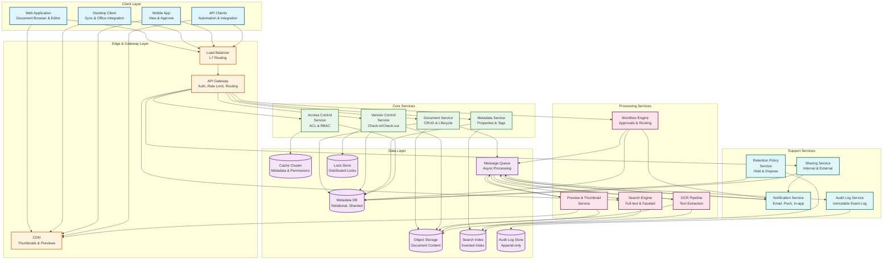
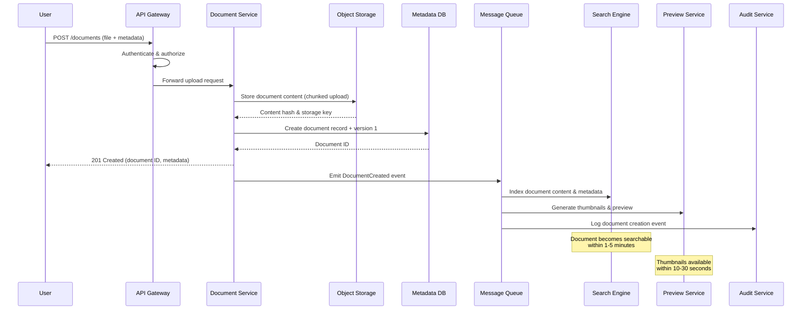
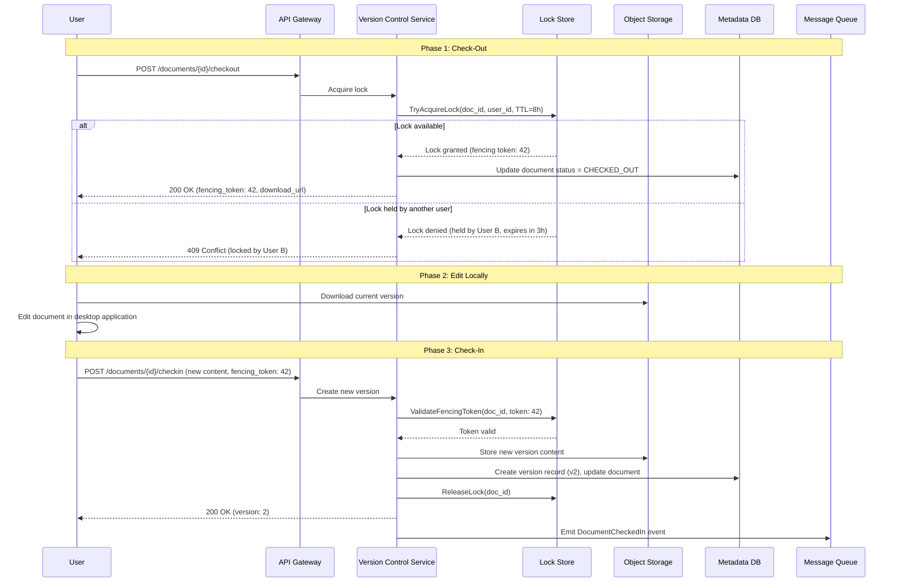
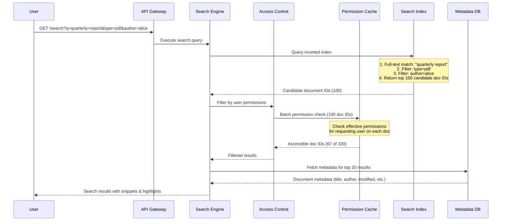
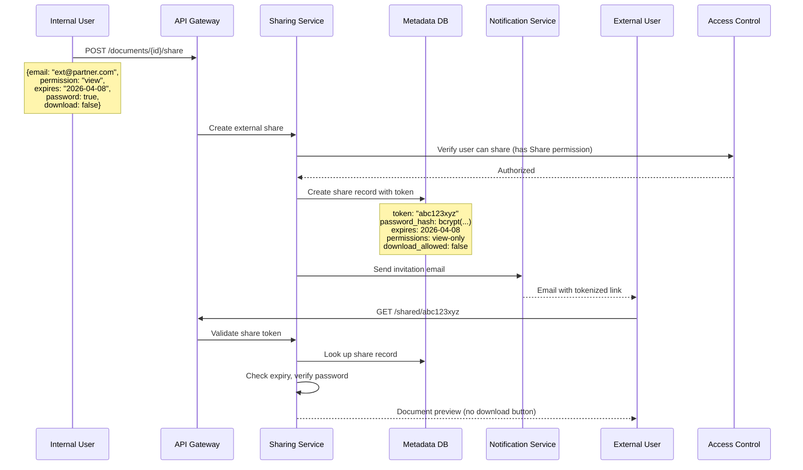
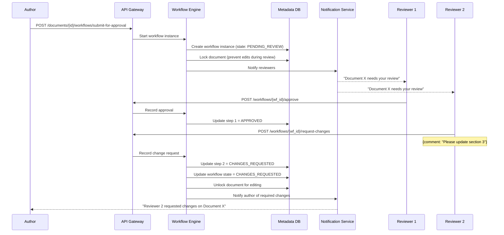

# High-Level Design

## System Architecture



---

## Key Architectural Decisions

### 1. Blob Storage for Content, Relational DB for Metadata

**Decision: Separate content from metadata storage**

| Factor | Combined (Content in DB) | Separated (Chosen) |
|--------|--------------------------|---------------------|
| Storage cost | Extremely expensive at PB scale | Object storage is 10-50x cheaper than DB storage |
| Query performance | Bloated tables degrade query performance | Metadata queries stay fast on smaller dataset |
| Backup/restore | Full backups include multi-PB content | Metadata backups are small; content has built-in durability |
| Scalability | DB scaling for PB is impractical | Object storage scales to exabytes natively |
| Content processing | Must stream from DB for thumbnails/OCR | Direct object storage access for processing pipelines |

**Rationale**: Document content (PDFs, Office docs, images) is write-once, read-sometimes data that maps perfectly to object storage's cost model. Metadata (names, properties, permissions, versions) is small, frequently queried, and requires ACID transactions --- ideal for a relational database. The content-metadata separation allows each to scale independently.

### 2. Pessimistic Locking as Default, Optimistic as Option

**Decision: Hybrid lock model with pessimistic default**

```
User A checks out document → Lock acquired (pessimistic)
├── Other users see "Checked out by User A"
├── Other users can still read the document
├── Lock has configurable TTL (default: 8 hours)
├── Admin can break lock if user is unavailable
└── User A checks in → New version created, lock released

Alternative: Optimistic mode (configurable per library)
├── Multiple users can edit simultaneously
├── Last save creates a new version
├── Conflict detection at check-in time
└── User chooses: overwrite, save-as, or merge
```

**Rationale**: Enterprise document management prioritizes preventing conflicts over enabling concurrent editing. Legal, financial, and compliance documents cannot have conflicting versions. Pessimistic locking is the industry standard (SharePoint, Box) for formal document workflows. Optimistic locking is available for collaborative workspaces where speed matters more than formal control.

### 3. Inverted Index for Search with Format-Specific Extractors

**Decision: Dedicated search cluster with content extraction pipeline**

```
Document Upload → Message Queue → Content Extractor
                                   ├── PDF Extractor (embedded text + OCR fallback)
                                   ├── Office Extractor (XML parsing for DOCX/XLSX/PPTX)
                                   ├── Image Extractor (OCR pipeline)
                                   ├── Email Extractor (headers + body + attachments)
                                   └── Plain Text (direct indexing)
                                        │
                                        ▼
                                   Search Index
                                   ├── Full-text inverted index (document content)
                                   ├── Metadata index (properties, tags, dates)
                                   └── Faceted index (type, author, date ranges)
```

**Rationale**: Relational DB full-text search cannot scale to billions of documents or handle binary format extraction. A dedicated search cluster provides inverted index performance, relevance ranking, faceted navigation, and horizontal scaling. The extraction pipeline is async --- documents are available immediately but become searchable within minutes.

### 4. Event-Driven Processing for Async Operations

**Decision: Message queue for all non-blocking operations**

| Operation | Sync (in request) | Async (via queue) |
|-----------|-------------------|-------------------|
| Document metadata save | Yes | |
| Lock acquire/release | Yes | |
| Permission check | Yes | |
| Content storage | Yes | |
| Thumbnail generation | | Yes |
| OCR processing | | Yes |
| Search indexing | | Yes |
| Notification dispatch | | Yes |
| Audit log writing | | Yes |
| Workflow step execution | | Yes |
| Retention policy evaluation | | Yes |

**Rationale**: Async processing keeps upload/checkin latency low (<2s) by deferring heavy operations. The message queue provides durability (no lost events), retry logic, and backpressure. Processing workers scale independently based on queue depth.

### 5. Distributed Lock Service for Check-Out

**Decision: Dedicated lock service with consensus protocol**

| Factor | DB-Based Locks | Dedicated Lock Service (Chosen) |
|--------|---------------|---------------------------------|
| Latency | 10-50ms (DB round-trip) | 1-5ms (in-memory) |
| Availability | Tied to DB availability | Independent, highly available |
| TTL management | Requires sweeper process | Built-in TTL with automatic expiry |
| Fencing tokens | Manual implementation | Native support |
| Scalability | Limited by DB connections | Horizontally scalable |

**Rationale**: Check-out locks are on the critical path for every document edit. A dedicated lock service (built on a consensus protocol like Raft) provides sub-5ms lock acquisition, automatic TTL-based expiry, and fencing tokens to prevent stale lock holders from writing. The lock service is small (millions of active locks fit in memory) but must be highly available.

### 6. ACL Inheritance with Permission Cache

**Decision: Database-stored ACLs with in-memory permission graph cache**

```
Folder A (ACL: Team=Read, Admin=Full)
├── Folder B (inherits from A)
│   ├── Doc 1 (inherits from B → effective: Team=Read, Admin=Full)
│   └── Doc 2 (explicit: User X=Full, breaks inheritance for User X only)
└── Folder C (breaks inheritance, own ACL: Team=None, Dept Y=Read)
    └── Doc 3 (inherits from C → effective: Dept Y=Read only)
```

**Rationale**: Permission evaluation happens on every single API call (500M+/day). Computing effective permissions by traversing the folder hierarchy on each request is too slow. Instead, we maintain an in-memory permission cache that pre-computes effective permissions for hot documents/folders. The cache is invalidated on ACL changes and rebuilt lazily. For cache misses, we walk the hierarchy and cache the result.

---

## Data Flow

### Flow 1: Upload Document



### Flow 2: Check-Out, Edit, Check-In



### Flow 3: Full-Text Search



### Flow 4: External Sharing



### Flow 5: Workflow Execution (Approval)



---

## Architecture Pattern Checklist

- [x] **Sync vs Async**: Sync for document CRUD, lock ops, permission checks; Async for indexing, OCR, thumbnails, notifications
- [x] **Event-driven vs Request-response**: Event-driven for processing pipelines; request-response for user-facing operations
- [x] **Push vs Pull**: Push for notifications and workflow alerts; pull for search and document listing
- [x] **Stateless vs Stateful**: All services stateless except lock service (stateful with consensus)
- [x] **Read-heavy vs Write-heavy**: Read-heavy (80/20); optimized with caching, CDN, and read replicas
- [x] **Real-time vs Batch**: Real-time for locks and permissions; near-real-time for search; batch for retention enforcement and analytics
- [x] **Edge vs Origin**: Edge for thumbnails and previews (CDN); origin for document content and metadata operations

---

## Component Responsibilities

| Component | Responsibility | Scaling Strategy |
|-----------|---------------|-----------------|
| **API Gateway** | Authentication, rate limiting, request routing | Horizontal, stateless |
| **Document Service** | Document CRUD, file upload/download coordination | Horizontal, stateless |
| **Version Control Service** | Check-in/check-out, version creation, lock management | Horizontal + dedicated lock service |
| **Metadata Service** | Custom properties, system metadata, tagging | Horizontal, stateless |
| **Access Control Service** | ACL evaluation, RBAC, permission inheritance | Horizontal + permission cache |
| **Search Engine** | Full-text search, faceted navigation, relevance ranking | Sharded search index, replicated |
| **Workflow Engine** | Approval flows, state machine execution, escalation | Horizontal, event-driven |
| **Preview/Thumbnail Service** | Document rendering, image conversion, CDN population | Auto-scaled workers by queue depth |
| **OCR Pipeline** | Text extraction from images/scanned PDFs | GPU-accelerated workers, auto-scaled |
| **Notification Service** | Email, push, in-app notifications | Horizontal, queue-based |
| **Audit Log Service** | Immutable event logging, compliance reporting | Append-only store, high write throughput |
| **Retention Policy Service** | Policy evaluation, legal hold enforcement, disposition | Background sweeper, periodic batch |
| **Sharing Service** | Internal/external sharing, tokenized links | Horizontal, stateless |

---

## Integration Points

### Office Application Integration

```
Desktop Office App (Word, Excel, etc.)
    │
    ├── WOPI Protocol (Web Application Open Platform Interface)
    │   ├── Lock: POST /wopi/files/{id}/lock
    │   ├── GetFile: GET /wopi/files/{id}/contents
    │   ├── PutFile: POST /wopi/files/{id}/contents
    │   └── Unlock: POST /wopi/files/{id}/unlock
    │
    └── WebDAV Protocol (fallback for older clients)
        ├── LOCK /webdav/files/{id}
        ├── GET /webdav/files/{id}
        ├── PUT /webdav/files/{id}
        └── UNLOCK /webdav/files/{id}
```

### Email Integration

```
Incoming Email with Attachments
    │
    ├── Email Connector Service
    │   ├── Parse MIME content
    │   ├── Extract attachments
    │   ├── Create documents in DMS
    │   └── Link back to email thread
    │
    └── Outbound: Share as Link
        ├── Generate tokenized link
        ├── Apply access permissions
        └── Embed in email body
```

### SSO / Identity Provider Integration

```
User Authentication Flow
    │
    ├── SAML 2.0 / OpenID Connect
    │   ├── Redirect to IdP
    │   ├── Receive assertion/token
    │   ├── Map groups to DMS roles
    │   └── Provision user on first login
    │
    └── SCIM 2.0 (User Provisioning)
        ├── Sync users from corporate directory
        ├── Sync groups/teams
        ├── Handle deprovisioning (disable account)
        └── Map organizational hierarchy
```
