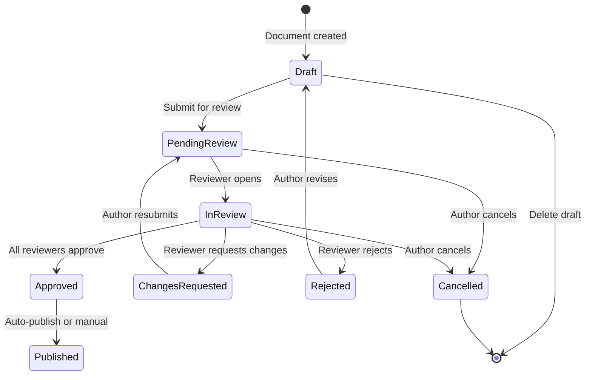

# Low-Level Design

## Data Model

### Core Entity Relationships

```mermaid
erDiagram
    TENANT {
        uuid id PK "Organization/company"
        string name
        jsonb settings "Storage quota, policies"
        timestamp created_at
    }

    FOLDER {
        uuid id PK
        uuid tenant_id FK
        uuid parent_folder_id FK "Null for root folder"
        string name
        string materialized_path "e.g., /root/dept/project/"
        int depth "Tree depth from root"
        uuid created_by FK
        timestamp created_at
        timestamp updated_at
        boolean inherit_permissions "Default true"
    }

    DOCUMENT {
        uuid id PK
        uuid tenant_id FK
        uuid folder_id FK
        string name "Display name with extension"
        string slug "URL-safe identifier"
        string content_type "MIME type"
        string status "ACTIVE, ARCHIVED, DELETED, HELD"
        uuid current_version_id FK
        int version_count
        bigint size_bytes "Current version size"
        uuid created_by FK
        uuid modified_by FK
        timestamp created_at
        timestamp updated_at
        timestamp deleted_at "Soft delete timestamp"
    }

    VERSION {
        uuid id PK
        uuid document_id FK
        int version_number "1, 2, 3... (major)"
        int minor_version "0, 1, 2... (minor)"
        string storage_key "Object storage key"
        string content_hash "SHA-256 of content"
        bigint size_bytes
        string change_description "User-provided comment"
        string storage_type "FULL, DELTA, CHUNKED"
        uuid base_version_id FK "For delta: the base version"
        uuid created_by FK
        timestamp created_at
    }

    LOCK_RECORD {
        uuid id PK
        uuid document_id FK "Unique constraint"
        uuid user_id FK "Lock holder"
        string lock_type "EXCLUSIVE, SHARED"
        bigint fencing_token "Monotonic counter"
        timestamp acquired_at
        timestamp expires_at "TTL-based expiry"
        string client_info "Device/app identifier"
    }

    ACL_ENTRY {
        uuid id PK
        uuid resource_id FK "Folder or document ID"
        string resource_type "FOLDER, DOCUMENT"
        uuid principal_id FK "User or group ID"
        string principal_type "USER, GROUP, ROLE"
        string permission "READ, WRITE, DELETE, SHARE, FULL_CONTROL"
        string effect "ALLOW, DENY"
        boolean inherited "Whether this was inherited"
        uuid source_folder_id FK "Where inheritance started"
        timestamp created_at
        uuid granted_by FK
    }

    METADATA_DEFINITION {
        uuid id PK
        uuid tenant_id FK
        string field_name "e.g., project_code, department"
        string field_type "STRING, NUMBER, DATE, CHOICE, MULTI_CHOICE"
        jsonb field_options "For CHOICE: list of values"
        boolean required
        boolean searchable
        string scope "GLOBAL, FOLDER, CONTENT_TYPE"
        uuid scope_id FK "Folder or content type ID"
    }

    METADATA_VALUE {
        uuid id PK
        uuid document_id FK
        uuid definition_id FK
        string string_value
        numeric numeric_value
        timestamp date_value
        jsonb multi_value "For multi-choice fields"
        uuid set_by FK
        timestamp updated_at
    }

    WORKFLOW_INSTANCE {
        uuid id PK
        uuid document_id FK
        uuid workflow_template_id FK
        string status "PENDING, IN_PROGRESS, APPROVED, REJECTED, CANCELLED"
        jsonb current_state "State machine position"
        uuid initiated_by FK
        timestamp started_at
        timestamp completed_at
        jsonb step_history "Array of completed steps"
    }

    SHARE_LINK {
        uuid id PK
        uuid document_id FK "Or folder_id"
        string resource_type "DOCUMENT, FOLDER"
        string token "Unique, URL-safe token"
        string permission "VIEW, DOWNLOAD, EDIT"
        string password_hash "Optional bcrypt hash"
        timestamp expires_at "Optional expiry"
        boolean allow_download
        int access_count "Number of times accessed"
        int max_access_count "Optional limit"
        uuid created_by FK
        timestamp created_at
    }

    AUDIT_EVENT {
        uuid id PK
        uuid tenant_id FK
        uuid document_id FK "Nullable"
        uuid user_id FK
        string event_type "DOCUMENT_CREATED, VERSION_CREATED, etc."
        string resource_type "DOCUMENT, FOLDER, VERSION, etc."
        uuid resource_id FK
        jsonb event_data "Additional context"
        string ip_address
        string user_agent
        timestamp occurred_at
    }

    RETENTION_POLICY {
        uuid id PK
        uuid tenant_id FK
        string name
        string scope "TENANT, FOLDER, CONTENT_TYPE"
        uuid scope_id FK
        int retention_days "Days to retain"
        string action "DELETE, ARCHIVE"
        boolean active
    }

    LEGAL_HOLD {
        uuid id PK
        uuid tenant_id FK
        string name "Matter name"
        string description
        uuid custodian_id FK "Legal team member"
        timestamp created_at
        timestamp released_at "Null if active"
    }

    LEGAL_HOLD_ITEM {
        uuid id PK
        uuid legal_hold_id FK
        uuid document_id FK
        timestamp held_at
    }

    TENANT ||--o{ FOLDER : "has folders"
    TENANT ||--o{ DOCUMENT : "has documents"
    FOLDER ||--o{ FOLDER : "has subfolders"
    FOLDER ||--o{ DOCUMENT : "contains"
    DOCUMENT ||--o{ VERSION : "has versions"
    DOCUMENT ||--o| LOCK_RECORD : "may have lock"
    DOCUMENT ||--o{ ACL_ENTRY : "has permissions"
    FOLDER ||--o{ ACL_ENTRY : "has permissions"
    DOCUMENT ||--o{ METADATA_VALUE : "has metadata"
    METADATA_DEFINITION ||--o{ METADATA_VALUE : "defines"
    DOCUMENT ||--o{ WORKFLOW_INSTANCE : "has workflows"
    DOCUMENT ||--o{ SHARE_LINK : "has shares"
    DOCUMENT ||--o{ AUDIT_EVENT : "generates events"
    DOCUMENT ||--o{ LEGAL_HOLD_ITEM : "may be held"
    LEGAL_HOLD ||--o{ LEGAL_HOLD_ITEM : "contains items"
    TENANT ||--o{ RETENTION_POLICY : "has policies"
```



### Block Properties Detail

#### Document States

```
                  ┌─────────────┐
                  │   DRAFT     │
                  └──────┬──────┘
                         │ publish
                         ▼
              ┌─────────────────────┐
         ┌────│      ACTIVE         │────┐
         │    └─────────────────────┘    │
    archive│         ↑    │              │ delete
         │    restore│    │ check-out    │
         ▼           │    ▼              ▼
┌──────────────┐  ┌──────────────┐  ┌──────────────┐
│  ARCHIVED    │  │ CHECKED_OUT  │  │   DELETED    │
└──────────────┘  └──────────────┘  │ (soft, 30d)  │
                       │             └──────┬───────┘
                       │ check-in           │ purge (after 30d
                       ▼                    │  or admin action)
                  ┌──────────────┐          ▼
                  │   ACTIVE     │  ┌──────────────┐
                  │  (new ver.)  │  │   PURGED     │
                  └──────────────┘  │  (permanent) │
                                    └──────────────┘

Note: Documents under LEGAL HOLD cannot transition to DELETED or PURGED
regardless of retention policy or user action.
```

### Indexing Strategy

| Index | Table | Columns | Purpose |
|-------|-------|---------|---------|
| `idx_doc_folder` | DOCUMENT | `(tenant_id, folder_id, status)` | List documents in a folder |
| `idx_doc_name` | DOCUMENT | `(tenant_id, name)` | Name-based lookup |
| `idx_doc_modified` | DOCUMENT | `(tenant_id, updated_at DESC)` | Recent documents |
| `idx_doc_status` | DOCUMENT | `(tenant_id, status, deleted_at)` | Retention sweeper |
| `idx_version_doc` | VERSION | `(document_id, version_number DESC)` | Version history |
| `idx_version_hash` | VERSION | `(content_hash)` | Deduplication lookup |
| `idx_lock_doc` | LOCK_RECORD | `(document_id) UNIQUE` | Lock existence check |
| `idx_lock_expiry` | LOCK_RECORD | `(expires_at)` | Expired lock cleanup |
| `idx_acl_resource` | ACL_ENTRY | `(resource_id, resource_type)` | Resource permission lookup |
| `idx_acl_principal` | ACL_ENTRY | `(principal_id, principal_type)` | User permission listing |
| `idx_metadata_doc` | METADATA_VALUE | `(document_id)` | Document metadata fetch |
| `idx_metadata_search` | METADATA_VALUE | `(definition_id, string_value)` | Metadata search |
| `idx_folder_path` | FOLDER | `(tenant_id, materialized_path)` | Path-based lookup |
| `idx_folder_parent` | FOLDER | `(parent_folder_id)` | Children listing |
| `idx_audit_doc` | AUDIT_EVENT | `(document_id, occurred_at DESC)` | Document audit trail |
| `idx_audit_user` | AUDIT_EVENT | `(user_id, occurred_at DESC)` | User activity log |
| `idx_hold_doc` | LEGAL_HOLD_ITEM | `(document_id)` | Legal hold check |
| `idx_share_token` | SHARE_LINK | `(token) UNIQUE` | Token lookup |
| `idx_workflow_doc` | WORKFLOW_INSTANCE | `(document_id, status)` | Active workflows |

### Partitioning / Sharding Strategy

| Data | Shard Key | Strategy | Rationale |
|------|-----------|----------|-----------|
| Documents | `tenant_id` | Hash partitioning | Tenant isolation, even distribution |
| Versions | `document_id` | Co-located with parent document | Version queries always scoped to document |
| ACL Entries | `resource_id` | Co-located with resource | Permission checks always scoped to resource |
| Metadata Values | `document_id` | Co-located with document | Metadata fetched with document |
| Audit Events | `tenant_id + month` | Time-based partitioning within tenant | Enables efficient retention and archival |
| Folders | `tenant_id` | Same shard as tenant's documents | Folder operations need document co-location |
| Search Index | `tenant_id` | Tenant-level sharding | Tenant isolation for search |

---

## API Design

### REST API

#### Document Operations

```
POST   /api/v1/documents                          # Create document (upload)
GET    /api/v1/documents/{id}                      # Get document metadata
GET    /api/v1/documents/{id}/content              # Download document content
PUT    /api/v1/documents/{id}                      # Update document metadata
DELETE /api/v1/documents/{id}                      # Soft delete document
POST   /api/v1/documents/{id}/restore              # Restore soft-deleted document
```

#### Version Control

```
POST   /api/v1/documents/{id}/checkout             # Check out (acquire lock)
POST   /api/v1/documents/{id}/checkin              # Check in (upload new version + release lock)
POST   /api/v1/documents/{id}/cancel-checkout      # Cancel check-out (release lock, discard changes)
GET    /api/v1/documents/{id}/versions              # List version history
GET    /api/v1/documents/{id}/versions/{ver}        # Get specific version metadata
GET    /api/v1/documents/{id}/versions/{ver}/content # Download specific version
POST   /api/v1/documents/{id}/versions/{ver}/restore # Restore to a previous version
GET    /api/v1/documents/{id}/lock                  # Get lock status
DELETE /api/v1/documents/{id}/lock                  # Break lock (admin only)
```

#### Folder Operations

```
POST   /api/v1/folders                             # Create folder
GET    /api/v1/folders/{id}                        # Get folder metadata & contents
PUT    /api/v1/folders/{id}                        # Update folder (rename, move)
DELETE /api/v1/folders/{id}                        # Delete folder (must be empty or recursive)
GET    /api/v1/folders/{id}/children               # List immediate children (paged)
GET    /api/v1/folders/{id}/tree                   # Get folder subtree (limited depth)
```

#### Search

```
POST   /api/v1/search                              # Full-text search with filters
GET    /api/v1/search/suggest?q=prefix             # Autocomplete suggestions
GET    /api/v1/search/facets                       # Available facets for current scope
```

#### Metadata

```
GET    /api/v1/documents/{id}/metadata             # Get all metadata for document
PUT    /api/v1/documents/{id}/metadata             # Set metadata values
GET    /api/v1/metadata-definitions                # List custom metadata fields
POST   /api/v1/metadata-definitions                # Create custom metadata field
```

#### Permissions

```
GET    /api/v1/documents/{id}/permissions           # Get effective permissions
PUT    /api/v1/documents/{id}/permissions           # Set permissions
GET    /api/v1/folders/{id}/permissions             # Get folder permissions
PUT    /api/v1/folders/{id}/permissions             # Set folder permissions
POST   /api/v1/folders/{id}/break-inheritance       # Break permission inheritance
POST   /api/v1/folders/{id}/restore-inheritance     # Restore permission inheritance
```

#### Sharing

```
POST   /api/v1/documents/{id}/share                # Create share link
GET    /api/v1/documents/{id}/shares               # List active shares
DELETE /api/v1/shares/{share_id}                   # Revoke share
GET    /api/v1/shared/{token}                      # Access shared document (public endpoint)
```

#### Workflows

```
POST   /api/v1/documents/{id}/workflows             # Start workflow
GET    /api/v1/workflows/{wf_id}                    # Get workflow status
POST   /api/v1/workflows/{wf_id}/steps/{step}/approve   # Approve step
POST   /api/v1/workflows/{wf_id}/steps/{step}/reject    # Reject step
POST   /api/v1/workflows/{wf_id}/cancel                 # Cancel workflow
GET    /api/v1/workflows/pending                    # List workflows awaiting my action
```

### Detailed API Examples

#### Check-Out Document

```
POST /api/v1/documents/{id}/checkout
Authorization: Bearer {token}

Request:
{
  "lock_duration_hours": 8,
  "client_info": "Microsoft Word 16.0, Windows 11"
}

Response: 200 OK
{
  "document_id": "doc-uuid",
  "lock": {
    "id": "lock-uuid",
    "fencing_token": 42,
    "acquired_at": "2026-03-08T10:00:00Z",
    "expires_at": "2026-03-08T18:00:00Z",
    "holder": {
      "user_id": "user-uuid",
      "display_name": "Alice Johnson"
    }
  },
  "download_url": "https://content.example.com/docs/doc-uuid/v3?token=signed-url",
  "current_version": 3
}

Error: 409 Conflict
{
  "error": "DOCUMENT_LOCKED",
  "message": "Document is checked out by Bob Smith",
  "lock": {
    "holder": {
      "user_id": "user-bob",
      "display_name": "Bob Smith"
    },
    "acquired_at": "2026-03-08T08:00:00Z",
    "expires_at": "2026-03-08T16:00:00Z"
  }
}
```

#### Check-In Document (Create New Version)

```
POST /api/v1/documents/{id}/checkin
Authorization: Bearer {token}
Content-Type: multipart/form-data

Fields:
  - file: (binary content)
  - fencing_token: 42
  - version_type: "major" | "minor"
  - change_description: "Updated quarterly figures"

Response: 201 Created
{
  "document_id": "doc-uuid",
  "version": {
    "id": "ver-uuid",
    "version_number": 4,
    "minor_version": 0,
    "size_bytes": 245760,
    "content_hash": "sha256:abc123...",
    "created_at": "2026-03-08T14:30:00Z",
    "created_by": "user-uuid"
  },
  "lock_released": true
}
```

#### Full-Text Search

```
POST /api/v1/search
Authorization: Bearer {token}

Request:
{
  "query": "quarterly revenue report",
  "filters": {
    "content_type": ["application/pdf", "application/vnd.openxmlformats-officedocument.wordprocessingml.document"],
    "created_after": "2025-01-01T00:00:00Z",
    "created_by": ["user-alice", "user-bob"],
    "folder_id": "folder-finance",
    "metadata": {
      "department": "Finance",
      "fiscal_year": "2025"
    }
  },
  "facets": ["content_type", "created_by", "department"],
  "sort": { "field": "relevance" },
  "page": 1,
  "page_size": 20,
  "highlight": true
}

Response: 200 OK
{
  "total_results": 47,
  "page": 1,
  "results": [
    {
      "document_id": "doc-uuid-1",
      "name": "Q3 2025 Revenue Report.pdf",
      "folder_path": "/Finance/Reports/2025/",
      "content_type": "application/pdf",
      "size_bytes": 524288,
      "created_by": { "id": "user-alice", "name": "Alice Johnson" },
      "updated_at": "2025-10-15T09:00:00Z",
      "version": 3,
      "relevance_score": 0.94,
      "highlights": [
        "...the <em>quarterly revenue report</em> shows a 15% increase...",
        "...total <em>revenue</em> for Q3 reached $42M..."
      ],
      "metadata": {
        "department": "Finance",
        "fiscal_year": "2025"
      }
    }
  ],
  "facets": {
    "content_type": [
      { "value": "application/pdf", "count": 28 },
      { "value": "application/vnd.openxmlformats-officedocument.wordprocessingml.document", "count": 19 }
    ],
    "created_by": [
      { "value": "Alice Johnson", "count": 23 },
      { "value": "Bob Smith", "count": 24 }
    ],
    "department": [
      { "value": "Finance", "count": 35 },
      { "value": "Sales", "count": 12 }
    ]
  }
}
```

### Rate Limiting

| Endpoint Category | Limit | Window | Scope |
|-------------------|-------|--------|-------|
| Document CRUD | 100 req/min | Sliding window | Per user |
| Upload/Download | 50 req/min | Sliding window | Per user |
| Search | 30 req/min | Sliding window | Per user |
| Lock Operations | 20 req/min | Sliding window | Per user |
| Metadata Updates | 200 req/min | Sliding window | Per user |
| Workflow Actions | 50 req/min | Sliding window | Per user |
| Share Operations | 20 req/min | Sliding window | Per user |
| Admin Operations | 100 req/min | Sliding window | Per tenant |

---

## Versioning Strategies

### Strategy 1: Full Copy

```
Version 1: [Full File A - 10MB]
Version 2: [Full File A' - 10.2MB]
Version 3: [Full File A'' - 10.1MB]
Total Storage: 30.3 MB
```

- **Pros**: Simplest; instant access to any version; no reconstruction needed
- **Cons**: Storage cost scales linearly with version count
- **Best for**: Small documents (<1MB), few versions

### Strategy 2: Delta / Patch (Chosen as Default)

```
Version 1: [Full File A - 10MB] (base snapshot)
Version 2: [Delta 1→2 - 200KB] (binary diff)
Version 3: [Delta 2→3 - 150KB] (binary diff)
...
Version 10: [Full File A''' - 10.5MB] (periodic re-snapshot)
Version 11: [Delta 10→11 - 180KB]
Total Storage: ~21 MB (vs 100+ MB for full copies)
```

```
PSEUDOCODE: Delta Versioning

FUNCTION create_version(document_id, new_content, user_id):
    current_version = get_current_version(document_id)

    // Compute binary delta
    delta = compute_binary_diff(current_version.content, new_content)

    // If delta is larger than 50% of full file, store full copy instead
    IF delta.size > new_content.size * 0.5:
        storage_type = FULL
        stored_content = new_content
    ELSE:
        storage_type = DELTA
        stored_content = delta

    // Periodic re-snapshot for fast reconstruction
    versions_since_snapshot = count_versions_since_last_full(document_id)
    IF versions_since_snapshot >= SNAPSHOT_INTERVAL (default: 10):
        storage_type = FULL
        stored_content = new_content

    // Store version
    storage_key = upload_to_object_storage(stored_content)
    version = create_version_record(
        document_id = document_id,
        version_number = current_version.number + 1,
        storage_key = storage_key,
        content_hash = sha256(new_content),
        storage_type = storage_type,
        base_version_id = current_version.id IF storage_type == DELTA ELSE null,
        created_by = user_id
    )
    RETURN version

FUNCTION reconstruct_version(document_id, target_version_number):
    // Find the nearest full snapshot at or before target version
    snapshot = find_nearest_snapshot(document_id, target_version_number)
    content = download_from_object_storage(snapshot.storage_key)

    // Apply deltas forward
    deltas = get_deltas_between(document_id, snapshot.version_number, target_version_number)
    FOR delta IN deltas:
        delta_content = download_from_object_storage(delta.storage_key)
        content = apply_binary_patch(content, delta_content)

    RETURN content
```

### Strategy 3: Chunked Deduplication

```
Document is split into content-defined chunks:

Version 1: [Chunk A][Chunk B][Chunk C][Chunk D]
Version 2: [Chunk A][Chunk B'][Chunk C][Chunk D][Chunk E]  (B changed, E added)
Version 3: [Chunk A][Chunk B'][Chunk C'][Chunk D][Chunk E]  (C changed)

Unique chunks stored: A, B, B', C, C', D, E = 7 chunks
Without dedup: 4 + 5 + 5 = 14 chunks
Savings: 50%
```

- **Pros**: Maximizes deduplication; works across documents too
- **Cons**: Complex chunk management; reconstruction requires assembling chunks
- **Best for**: Very large documents, many similar documents across users

---

## Check-Out Lock Protocol

### Lock Lifecycle

```
PSEUDOCODE: Check-Out Lock Protocol

STRUCTURE Lock:
    document_id: UUID
    user_id: UUID
    fencing_token: BigInt    // Monotonically increasing
    acquired_at: Timestamp
    expires_at: Timestamp
    client_info: String

FUNCTION checkout(document_id, user_id, duration_hours):
    // Atomic lock acquisition
    lock = ATOMIC:
        existing = get_lock(document_id)
        IF existing IS NOT NULL:
            IF existing.expires_at < NOW():
                // Expired lock: automatically break it
                delete_lock(document_id)
                log_event(LOCK_EXPIRED, existing)
            ELSE:
                THROW ConflictError(
                    "Document locked by " + existing.user_id,
                    lock_info = existing
                )

        // Generate fencing token (must be monotonically increasing)
        fencing_token = increment_global_counter(document_id)

        new_lock = Lock(
            document_id = document_id,
            user_id = user_id,
            fencing_token = fencing_token,
            acquired_at = NOW(),
            expires_at = NOW() + duration_hours * HOURS,
            client_info = get_client_info()
        )
        insert_lock(new_lock)
        RETURN new_lock

    // Update document status
    update_document_status(document_id, CHECKED_OUT)
    log_event(DOCUMENT_CHECKED_OUT, lock)
    RETURN lock

FUNCTION checkin(document_id, user_id, new_content, fencing_token):
    lock = get_lock(document_id)

    // Validate lock ownership and fencing token
    IF lock IS NULL:
        THROW BadRequestError("Document is not checked out")
    IF lock.user_id != user_id:
        THROW ForbiddenError("Document is checked out by another user")
    IF lock.fencing_token != fencing_token:
        THROW ConflictError("Stale fencing token - lock was broken and re-acquired")

    // Create new version
    version = create_version(document_id, new_content, user_id)

    // Release lock
    delete_lock(document_id)
    update_document_status(document_id, ACTIVE)
    log_event(DOCUMENT_CHECKED_IN, version)
    RETURN version

FUNCTION break_lock(document_id, admin_user_id):
    lock = get_lock(document_id)
    IF lock IS NULL:
        RETURN  // No lock to break

    // Only admins or lock holder can break lock
    IF NOT is_admin(admin_user_id) AND admin_user_id != lock.user_id:
        THROW ForbiddenError("Only administrators can break locks")

    delete_lock(document_id)
    update_document_status(document_id, ACTIVE)
    log_event(LOCK_BROKEN, {
        broken_by: admin_user_id,
        original_holder: lock.user_id,
        held_since: lock.acquired_at
    })
    notify_user(lock.user_id, "Your lock on {document.name} was broken by an administrator")
```

### Fencing Token: Preventing Stale Writes

```
Scenario without fencing token (UNSAFE):

1. User A checks out document (lock acquired)
2. User A's session crashes, lock expires
3. User B checks out document (new lock)
4. User A's session recovers, attempts check-in
5. User A's check-in overwrites User B's work!

Scenario with fencing token (SAFE):

1. User A checks out document (fencing_token = 42)
2. User A's session crashes, lock expires
3. User B checks out document (fencing_token = 43)
4. User A's session recovers, attempts check-in with token 42
5. System rejects: token 42 < current token 43
6. User A is notified: "Your lock expired. Document was checked out by User B."
```

---

## Metadata Schema Design

### Three Categories of Metadata

```
Document Metadata
├── System Metadata (auto-managed)
│   ├── id, name, content_type, size_bytes
│   ├── created_at, created_by, updated_at, modified_by
│   ├── version_count, current_version
│   ├── folder_path, status
│   └── content_hash (SHA-256)
│
├── User-Defined Metadata (custom properties)
│   ├── Defined per tenant, folder, or content type
│   ├── Typed fields: string, number, date, choice, multi-choice
│   ├── Validation rules, required flag, default values
│   └── Examples: project_code, department, contract_number
│
└── Content-Extracted Metadata (auto-extracted)
    ├── OCR text (for scanned documents)
    ├── Language detected
    ├── Page count, word count
    ├── Author (from document properties)
    ├── Title (from document properties)
    ├── Named entities (people, organizations, dates)
    └── Image dimensions, EXIF data
```

### Metadata Cascade

```
PSEUDOCODE: Metadata Cascade (auto-apply metadata to documents in a folder)

FUNCTION apply_metadata_cascade(folder_id, metadata_values):
    // Set default metadata values for all documents in folder and subfolders
    cascade = create_cascade_rule(
        folder_id = folder_id,
        metadata_values = metadata_values,
        apply_to_existing = true,
        apply_to_new = true
    )

    IF cascade.apply_to_existing:
        // Async: update all existing documents
        documents = get_all_documents_recursive(folder_id)
        FOR doc IN documents:
            FOR (field, value) IN metadata_values:
                IF NOT has_explicit_value(doc.id, field):
                    set_metadata(doc.id, field, value, source="CASCADE")

    // New documents in this folder automatically inherit cascade values
    RETURN cascade
```

---

## Search Index Design

### Index Architecture

```
Search Cluster
├── Full-Text Index (inverted index)
│   ├── Term → [doc_id, position, field, tf-idf score]
│   ├── Analyzers: standard, language-specific, phonetic
│   ├── Tokenizers: whitespace, edge-ngram (for autocomplete)
│   └── Filters: lowercase, stemming, stopwords, synonyms
│
├── Metadata Index (structured fields)
│   ├── Keyword fields: content_type, status, created_by
│   ├── Date fields: created_at, updated_at (for range queries)
│   ├── Numeric fields: size_bytes, version_count
│   └── Custom fields: indexed user-defined metadata
│
├── Faceted Index (aggregation-optimized)
│   ├── Doc values for fast aggregation (column-oriented)
│   ├── Pre-computed facet counts per field
│   └── Hierarchical facets for folder paths
│
└── Vector Index (for semantic search, optional)
    ├── Document embeddings (dense vectors, 768-dim)
    ├── HNSW or IVF index for approximate nearest neighbors
    └── Used for "find similar documents" queries
```

### Content Extraction Pipeline

```
PSEUDOCODE: Content Extraction for Search Indexing

FUNCTION extract_and_index(document_id, storage_key, content_type):
    raw_content = download_from_object_storage(storage_key)

    // Format-specific extraction
    SWITCH content_type:
        CASE "application/pdf":
            text = extract_pdf_text(raw_content)
            IF text IS EMPTY OR text.confidence < 0.5:
                // Scanned PDF: fall back to OCR
                text = ocr_extract(raw_content)
            metadata = extract_pdf_metadata(raw_content)  // Author, title, subject

        CASE "application/vnd.openxmlformats-officedocument.wordprocessingml.document":
            // DOCX: unzip and parse XML
            text = extract_docx_text(raw_content)  // Parse document.xml
            metadata = extract_office_metadata(raw_content)  // Parse docProps/core.xml

        CASE "application/vnd.openxmlformats-officedocument.spreadsheetml.sheet":
            // XLSX: extract cell values from all sheets
            text = extract_xlsx_text(raw_content)
            metadata = extract_office_metadata(raw_content)

        CASE "image/jpeg", "image/png", "image/tiff":
            text = ocr_extract(raw_content)
            metadata = extract_image_metadata(raw_content)  // EXIF data

        CASE "text/plain", "text/csv", "text/html":
            text = decode_text(raw_content)
            metadata = {}

        DEFAULT:
            text = attempt_generic_extraction(raw_content)
            metadata = {}

    // Build search document
    search_doc = {
        "document_id": document_id,
        "content": text,                    // Full-text indexed
        "content_type": content_type,       // Keyword
        "extracted_title": metadata.title,  // Text + keyword
        "extracted_author": metadata.author,// Keyword
        "page_count": metadata.page_count,  // Numeric
        "word_count": count_words(text),    // Numeric
        "language": detect_language(text),  // Keyword
        "indexed_at": NOW()
    }

    // Upsert to search index
    index_document(search_doc)
```

### Search Query Processing

```
PSEUDOCODE: Query Execution with Permission Filtering

FUNCTION execute_search(user_id, query, filters, facets, page, page_size):
    // Step 1: Build search query
    search_query = build_query(query, filters)
    // Adds: full-text match on content, title fields
    // Adds: term filters for content_type, created_by, etc.
    // Adds: range filters for dates, sizes
    // Adds: boost for title matches (2x), recent documents (1.5x)

    // Step 2: Tenant isolation
    search_query.add_filter("tenant_id", user.tenant_id)

    // Step 3: Execute against search index (get more than needed for permission filtering)
    oversample_factor = 3  // Request 3x results to account for permission filtering
    raw_results = search_index.query(search_query,
        size = page_size * oversample_factor,
        offset = 0,
        include_facets = facets
    )

    // Step 4: Permission filtering (batch for efficiency)
    document_ids = raw_results.map(r => r.document_id)
    accessible_ids = batch_permission_check(user_id, document_ids, "READ")

    // Step 5: Filter and paginate
    filtered_results = raw_results.filter(r => r.document_id IN accessible_ids)
    paged_results = filtered_results[page * page_size : (page + 1) * page_size]

    // Step 6: Enrich with metadata
    enriched = enrich_with_metadata(paged_results)

    RETURN {
        total_results: filtered_results.length,
        results: enriched,
        facets: adjust_facet_counts(raw_results.facets, accessible_ids)
    }
```

---

## Workflow Engine Design

### State Machine Model



### Approval DAG (Directed Acyclic Graph)

```
PSEUDOCODE: Workflow Execution Engine

STRUCTURE WorkflowTemplate:
    id: UUID
    name: String
    steps: List<WorkflowStep>

STRUCTURE WorkflowStep:
    id: UUID
    name: String
    type: "APPROVAL" | "REVIEW" | "NOTIFICATION" | "CONDITION"
    assignees: List<UserOrGroup>
    approval_mode: "ALL" | "ANY" | "MAJORITY"
    timeout_hours: Int
    escalation_to: UserOrGroup
    next_steps: List<UUID>          // DAG edges
    condition: Expression           // For CONDITION type

STRUCTURE WorkflowInstance:
    id: UUID
    template_id: UUID
    document_id: UUID
    status: String
    current_steps: List<UUID>       // Active step IDs (can be parallel)
    step_states: Map<UUID, StepState>
    initiated_by: UUID
    started_at: Timestamp

FUNCTION execute_workflow(instance):
    WHILE instance.status == "IN_PROGRESS":
        active_steps = get_active_steps(instance)

        FOR step IN active_steps:
            IF step.type == "APPROVAL":
                result = wait_for_approval(step, instance)
                IF result == APPROVED:
                    advance_to_next(instance, step)
                ELSE IF result == REJECTED:
                    instance.status = "REJECTED"
                    BREAK
                ELSE IF result == TIMEOUT:
                    escalate(step, instance)

            ELSE IF step.type == "CONDITION":
                IF evaluate_condition(step.condition, instance):
                    advance_to_next(instance, step, branch="TRUE")
                ELSE:
                    advance_to_next(instance, step, branch="FALSE")

            ELSE IF step.type == "NOTIFICATION":
                send_notification(step.assignees, instance)
                advance_to_next(instance, step)

        IF all_steps_complete(instance):
            instance.status = "COMPLETED"

FUNCTION escalate(step, instance):
    IF step.escalation_to IS NOT NULL:
        // Reassign to escalation target
        step.assignees = [step.escalation_to]
        notify(step.escalation_to, "Workflow escalated: " + instance.document.name)
    ELSE:
        // No escalation: auto-approve or notify admin
        log_event(WORKFLOW_TIMEOUT, step, instance)
        notify_admin("Workflow step timed out: " + step.name)
```

---

## Retention and Legal Hold

### Policy Evaluation Engine

```
PSEUDOCODE: Retention and Legal Hold

FUNCTION evaluate_retention(document):
    // Check legal hold first (always overrides retention)
    IF is_under_legal_hold(document.id):
        RETURN HOLD  // Cannot delete, archive, or modify

    // Find applicable retention policies (most specific wins)
    policies = find_applicable_policies(document)
    // Priority: document-level > folder-level > content-type > tenant-level

    IF policies IS EMPTY:
        RETURN NO_POLICY  // No retention requirement

    policy = policies[0]  // Most specific

    age_days = days_between(document.created_at, NOW())

    IF age_days >= policy.retention_days:
        IF policy.action == "DELETE":
            RETURN READY_FOR_DELETION
        ELSE IF policy.action == "ARCHIVE":
            RETURN READY_FOR_ARCHIVE
    ELSE:
        RETURN RETAINED  // Keep document, retention period not yet met

FUNCTION run_retention_sweeper():
    // Background job, runs daily
    FOR tenant IN all_tenants:
        documents = get_documents_past_retention(tenant.id)
        FOR doc IN documents:
            IF is_under_legal_hold(doc.id):
                log_event(RETENTION_BLOCKED_BY_HOLD, doc)
                CONTINUE

            result = evaluate_retention(doc)
            IF result == READY_FOR_DELETION:
                soft_delete_document(doc.id)
                log_event(RETENTION_DELETION, doc)
            ELSE IF result == READY_FOR_ARCHIVE:
                move_to_archive_storage(doc.id)
                log_event(RETENTION_ARCHIVE, doc)

FUNCTION place_legal_hold(hold_id, document_ids):
    FOR doc_id IN document_ids:
        // Create immutable hold marker
        create_hold_item(hold_id, doc_id)

        // Prevent all deletion paths
        set_document_status(doc_id, HELD)
        disable_retention_for(doc_id)

        log_event(LEGAL_HOLD_PLACED, doc_id, hold_id)

    // Legal holds are immutable - only release, never modify
    RETURN hold_id

FUNCTION release_legal_hold(hold_id, custodian_id):
    hold = get_legal_hold(hold_id)

    // Mark hold as released
    hold.released_at = NOW()
    hold.released_by = custodian_id

    // Release individual documents
    FOR item IN hold.items:
        // Check if document is under any OTHER active hold
        other_holds = get_active_holds(item.document_id)
                     .filter(h => h.id != hold_id)
        IF other_holds IS EMPTY:
            // No other holds: restore normal retention processing
            set_document_status(item.document_id, ACTIVE)
            enable_retention_for(item.document_id)

    log_event(LEGAL_HOLD_RELEASED, hold_id, custodian_id)
```

---

## Thumbnail and Preview Pipeline

### Processing Architecture

```
Document Upload Event
    │
    ▼
┌──────────────────────────────────┐
│         Format Detector           │
│  (identify file type, page count) │
└──────────────┬───────────────────┘
               │
    ┌──────────┴──────────┐
    │                     │
    ▼                     ▼
┌──────────┐      ┌──────────────┐
│  Office  │      │  Image/PDF   │
│ Renderer │      │  Renderer    │
│(headless │      │ (page-based  │
│ convert) │      │  rasterize)  │
└────┬─────┘      └──────┬───────┘
     │                    │
     ▼                    ▼
┌────────────────────────────────┐
│       Image Post-Processor      │
│  - Resize to thumbnail (200px)  │
│  - Resize to preview (1200px)   │
│  - Generate PDF preview (first  │
│    5 pages)                      │
│  - WebP conversion for web      │
└──────────────┬─────────────────┘
               │
               ▼
┌──────────────────────────────────┐
│          CDN Upload               │
│  - Upload thumbnails and previews │
│  - Set cache headers (30 days)    │
│  - Invalidate old versions        │
└──────────────────────────────────┘
```

```
PSEUDOCODE: Preview Generation

FUNCTION generate_previews(document_id, storage_key, content_type):
    content = download_from_object_storage(storage_key)

    // Generate based on content type
    SWITCH content_type:
        CASE "application/pdf":
            thumbnail = rasterize_page(content, page=1, width=200)
            preview_pages = []
            FOR page IN range(1, min(page_count(content), 5)):
                preview_pages.append(rasterize_page(content, page, width=1200))

        CASE OFFICE_FORMATS:
            // Convert to PDF first, then rasterize
            pdf_content = convert_to_pdf(content, content_type)
            thumbnail = rasterize_page(pdf_content, page=1, width=200)
            preview_pages = [rasterize_page(pdf_content, page=1, width=1200)]

        CASE IMAGE_FORMATS:
            thumbnail = resize_image(content, width=200, maintain_aspect=true)
            preview_pages = [resize_image(content, width=1200, maintain_aspect=true)]

        DEFAULT:
            thumbnail = generate_icon_thumbnail(content_type)
            preview_pages = []

    // Upload to CDN-backed storage
    thumbnail_url = upload_preview(document_id, "thumb", thumbnail, "image/webp")
    preview_urls = []
    FOR i, page IN enumerate(preview_pages):
        url = upload_preview(document_id, "preview_" + i, page, "image/webp")
        preview_urls.append(url)

    // Update document metadata
    update_document_previews(document_id, thumbnail_url, preview_urls)
```

---

## Folder Hierarchy: Materialized Path

### Materialized Path Strategy

The folder hierarchy uses **materialized paths** --- each folder stores its full path from root as a string. This enables efficient subtree queries, path-based access control, and breadcrumb generation.

```
Materialized Path Examples:
/                           (root)
/Engineering/               (depth 1)
/Engineering/Frontend/      (depth 2)
/Engineering/Frontend/Docs/ (depth 3)
/Finance/                   (depth 1)
/Finance/Reports/           (depth 2)
/Finance/Reports/Q3-2025/   (depth 3)
```

```
PSEUDOCODE: Folder Operations with Materialized Path

FUNCTION create_folder(parent_id, name, tenant_id):
    parent = get_folder(parent_id)
    new_path = parent.materialized_path + name + "/"
    new_depth = parent.depth + 1

    // Check for duplicate names at same level
    IF folder_exists(tenant_id, parent_id, name):
        THROW ConflictError("Folder already exists")

    folder = insert_folder(
        tenant_id = tenant_id,
        parent_folder_id = parent_id,
        name = name,
        materialized_path = new_path,
        depth = new_depth,
        inherit_permissions = true
    )
    RETURN folder

FUNCTION move_folder(folder_id, new_parent_id):
    folder = get_folder(folder_id)
    new_parent = get_folder(new_parent_id)

    // Cycle detection
    IF new_parent.materialized_path.starts_with(folder.materialized_path):
        THROW BadRequestError("Cannot move folder into its own subtree")

    old_path = folder.materialized_path
    new_path = new_parent.materialized_path + folder.name + "/"

    // Update all descendant paths atomically
    UPDATE folders
    SET materialized_path = REPLACE(materialized_path, old_path, new_path),
        depth = depth + (new_parent.depth + 1 - folder.depth)
    WHERE materialized_path LIKE old_path + '%'
    AND tenant_id = folder.tenant_id

    // Update folder itself
    folder.parent_folder_id = new_parent_id
    folder.materialized_path = new_path
    folder.depth = new_parent.depth + 1

FUNCTION get_subtree(folder_id):
    folder = get_folder(folder_id)
    // Efficient prefix query on materialized path
    RETURN SELECT * FROM folders
           WHERE materialized_path LIKE folder.materialized_path + '%'
           AND tenant_id = folder.tenant_id
           ORDER BY materialized_path

FUNCTION get_ancestors(folder_id):
    folder = get_folder(folder_id)
    // Parse path to get ancestor paths
    path_parts = folder.materialized_path.split("/").filter(non_empty)
    ancestor_paths = []
    current = "/"
    FOR part IN path_parts:
        current = current + part + "/"
        ancestor_paths.append(current)

    RETURN SELECT * FROM folders
           WHERE materialized_path IN ancestor_paths
           AND tenant_id = folder.tenant_id
           ORDER BY depth
```

### Materialized Path vs Alternatives

| Approach | Subtree Query | Move Operation | Depth Query | Ancestor Query |
|----------|--------------|----------------|-------------|----------------|
| **Materialized Path** (chosen) | O(log n) LIKE prefix | O(k) update descendants | O(1) stored | O(d) parse path |
| **Closure Table** | O(1) join | O(k^2) update pairs | O(1) join | O(1) join |
| **Nested Sets** | O(1) range | O(n) renumber | O(1) computed | O(log n) range |
| **Adjacency List** | O(n) recursive | O(1) update parent | O(n) recursive | O(d) recursive |

**Materialized path chosen because**: folder moves are infrequent, subtree queries are frequent (listing folder contents), and the path string is directly useful for breadcrumbs and ACL inheritance evaluation. The O(k) move cost is acceptable given that folder restructuring is a rare admin operation.

---

## Complexity Analysis

| Operation | Time Complexity | Notes |
|-----------|----------------|-------|
| Document upload | O(n) where n = file size | Linear scan for chunking + storage |
| Check-out (lock acquire) | O(1) | Single lock operation |
| Check-in (new version) | O(n) for delta + O(1) for metadata | Delta computation is linear in file size |
| Version reconstruction | O(k * m) | k = deltas to apply, m = avg delta size |
| Permission evaluation | O(d) worst case, O(1) cached | d = folder depth |
| Full-text search | O(log n + k) | n = index size, k = result count |
| Metadata update | O(1) | Direct key-value update |
| Folder subtree query | O(log n + k) | Index prefix scan, k = results |
| Folder move | O(k) | k = descendants to update |
| Workflow step execution | O(1) | State machine transition |
| Retention sweep | O(n) per tenant | Full scan of documents past retention |
| ACL inheritance computation | O(d * p) | d = depth, p = permissions per level |
