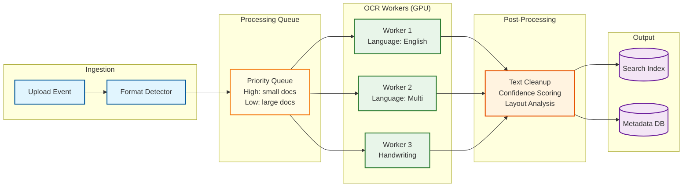

# Deep Dive and Bottlenecks

## 1. Versioning Deep Dive: Delta Compression for Large Documents

### The Problem

Enterprise documents are large and frequently revised. A 5MB Word document that goes through 50 versions would consume 250MB with full-copy versioning. With delta compression, the same 50 versions might consume only 15MB --- an 94% reduction. But delta compression introduces complexity in reconstruction, chain management, and corruption resilience.

### Delta Compression for Office XML Formats

Modern Office documents (DOCX, XLSX, PPTX) are ZIP archives containing XML files. This structure enables smarter delta computation than raw binary diff.

```
PSEUDOCODE: Office Format Delta Optimization

FUNCTION compute_office_delta(old_content, new_content):
    // Office documents are ZIP archives of XML files
    old_zip = unzip(old_content)
    new_zip = unzip(new_content)

    delta = {}
    FOR file IN union(old_zip.files, new_zip.files):
        IF file NOT IN old_zip:
            delta[file] = { action: "ADD", content: new_zip[file] }
        ELSE IF file NOT IN new_zip:
            delta[file] = { action: "DELETE" }
        ELSE IF old_zip[file] != new_zip[file]:
            IF is_xml(file):
                // XML-aware diff: much smaller deltas for text edits
                xml_diff = compute_xml_diff(old_zip[file], new_zip[file])
                delta[file] = { action: "PATCH", diff: xml_diff }
            ELSE:
                // Binary diff for embedded media (images, charts)
                binary_diff = compute_binary_diff(old_zip[file], new_zip[file])
                IF binary_diff.size < new_zip[file].size * 0.5:
                    delta[file] = { action: "PATCH", diff: binary_diff }
                ELSE:
                    delta[file] = { action: "REPLACE", content: new_zip[file] }
        // Else: file unchanged, no entry in delta

    RETURN serialize(delta)
```

### Delta Chain Management

```
Delta Chain:
  [Full v1] → [Δ1→2] → [Δ2→3] → [Δ3→4] → ... → [Δ9→10] → [Full v10] → [Δ10→11] → ...

Problems with long chains:
1. Reconstruction latency: v9 requires loading v1 + applying 8 deltas
2. Corruption propagation: corrupted Δ3→4 makes v4-v9 unrecoverable
3. Storage fragmentation: many small delta objects

Solution: Periodic re-snapshots with configurable interval
```

```
PSEUDOCODE: Delta Chain Optimization

CONSTANTS:
    MAX_CHAIN_LENGTH = 10          // Max deltas before re-snapshot
    DELTA_SIZE_THRESHOLD = 0.5     // If delta > 50% of full, store full
    RECONSTRUCTION_LATENCY_MS = 500 // Max acceptable reconstruction time

FUNCTION decide_storage_strategy(document_id, new_content):
    chain = get_delta_chain_since_last_snapshot(document_id)

    // Rule 1: Chain length limit
    IF chain.length >= MAX_CHAIN_LENGTH:
        RETURN FULL_SNAPSHOT

    // Rule 2: Delta too large (document substantially changed)
    latest_version = get_latest_version(document_id)
    delta = compute_delta(latest_version.content, new_content)
    IF delta.size > new_content.size * DELTA_SIZE_THRESHOLD:
        RETURN FULL_SNAPSHOT

    // Rule 3: Estimated reconstruction time too high
    estimated_time = estimate_reconstruction_time(chain.length + 1, chain.avg_delta_size)
    IF estimated_time > RECONSTRUCTION_LATENCY_MS:
        RETURN FULL_SNAPSHOT

    // Rule 4: Content format change (e.g., PDF → DOCX conversion)
    IF latest_version.content_type != detect_content_type(new_content):
        RETURN FULL_SNAPSHOT

    RETURN DELTA
```

### Cross-Version Deduplication

When multiple users upload similar documents (e.g., the same template with minor changes), content-defined chunking enables deduplication across documents, not just across versions.

```
PSEUDOCODE: Content-Defined Chunking for Deduplication

FUNCTION chunk_document(content):
    chunks = []
    offset = 0
    MIN_CHUNK = 4 * KB
    MAX_CHUNK = 64 * KB
    TARGET_CHUNK = 16 * KB

    WHILE offset < content.length:
        // Use Rabin fingerprint to find chunk boundary
        window_hash = rabin_fingerprint(content, offset, WINDOW_SIZE)

        IF (window_hash % TARGET_CHUNK == 0) OR (offset - chunk_start >= MAX_CHUNK):
            chunk_data = content[chunk_start : offset]
            chunk_hash = sha256(chunk_data)
            chunks.append({
                hash: chunk_hash,
                offset: chunk_start,
                size: offset - chunk_start
            })
            chunk_start = offset

        offset += 1

    // Handle final chunk
    IF chunk_start < content.length:
        chunk_data = content[chunk_start : content.length]
        chunks.append({ hash: sha256(chunk_data), offset: chunk_start, size: chunk_data.length })

    RETURN chunks

FUNCTION store_deduplicated(document_id, version_number, content):
    chunks = chunk_document(content)
    chunk_manifest = []

    FOR chunk IN chunks:
        IF NOT chunk_exists_in_storage(chunk.hash):
            upload_chunk(chunk.hash, content[chunk.offset : chunk.offset + chunk.size])
        // Else: chunk already stored, skip upload (dedup!)

        chunk_manifest.append({
            hash: chunk.hash,
            offset: chunk.offset,
            size: chunk.size
        })

    store_version_manifest(document_id, version_number, chunk_manifest)
    RETURN { total_chunks: chunks.length, new_chunks: count_new, dedup_savings: savings }
```

---

## 2. Concurrent Edit Conflict Resolution

### Check-Out Lock Expiry Scenarios

```
Scenario 1: Normal Flow
  User A checks out → edits → checks in
  Duration: 2 hours, within 8-hour TTL
  Result: New version created, lock released

Scenario 2: Lock Expires (user forgot)
  User A checks out at 9:00 AM (TTL: 8h)
  Lock expires at 5:00 PM
  User B checks out at 5:30 PM
  User A tries to check in at 6:00 PM
  Result: Rejected (fencing token mismatch)
  User A's changes saved as "conflicted copy"

Scenario 3: Lock Break by Admin
  User A checks out, then goes on vacation
  Admin breaks lock after 24 hours
  User B checks out with new fencing token
  Result: User A notified, their work preserved as draft

Scenario 4: Optimistic Mode (no locks)
  User A opens document, starts editing
  User B opens same document, starts editing
  User A saves (version 2 created)
  User B saves → conflict detected!
  Result: System offers: overwrite, save-as-new, or view diff
```

### Conflict Resolution UI Flow

```
PSEUDOCODE: Optimistic Mode Conflict Detection

FUNCTION save_document_optimistic(document_id, user_id, new_content, base_version):
    current_version = get_current_version(document_id)

    IF current_version.version_number == base_version:
        // No conflict: create new version
        create_version(document_id, new_content, user_id)
        RETURN { status: "SUCCESS", version: current_version.version_number + 1 }

    ELSE:
        // Conflict: another user saved since we started editing
        conflicting_version = current_version
        RETURN {
            status: "CONFLICT",
            your_base_version: base_version,
            current_version: conflicting_version.version_number,
            modified_by: conflicting_version.created_by,
            modified_at: conflicting_version.created_at,
            options: [
                "OVERWRITE",     // Replace their version with yours
                "SAVE_AS_NEW",   // Save as separate document
                "VIEW_DIFF",     // Show three-way diff
                "DISCARD"        // Discard your changes
            ]
        }

FUNCTION resolve_conflict(document_id, user_id, resolution, user_content):
    SWITCH resolution:
        CASE "OVERWRITE":
            // User explicitly chooses to overwrite
            create_version(document_id, user_content, user_id,
                          comment="Resolved conflict: overwrite")
            log_event(CONFLICT_RESOLVED_OVERWRITE, document_id)

        CASE "SAVE_AS_NEW":
            new_doc = create_document(
                name = original.name + " (conflict copy)",
                content = user_content,
                folder = original.folder,
                metadata = { conflict_source: document_id }
            )
            RETURN new_doc.id

        CASE "VIEW_DIFF":
            base_content = get_version_content(document_id, base_version)
            their_content = get_current_content(document_id)
            diff = three_way_diff(base_content, their_content, user_content)
            RETURN diff
```

---

## 3. Large Document Handling

### Chunked Upload/Download

```
PSEUDOCODE: Chunked Upload for Large Documents

CONSTANTS:
    CHUNK_SIZE = 10 * MB
    MAX_CONCURRENT_CHUNKS = 5
    UPLOAD_TIMEOUT = 60 * MINUTES

FUNCTION initiate_chunked_upload(document_id, file_name, total_size, content_type):
    // Calculate chunk plan
    total_chunks = ceil(total_size / CHUNK_SIZE)

    upload_session = create_upload_session(
        document_id = document_id,
        file_name = file_name,
        total_size = total_size,
        total_chunks = total_chunks,
        expires_at = NOW() + UPLOAD_TIMEOUT
    )

    RETURN {
        session_id: upload_session.id,
        chunk_size: CHUNK_SIZE,
        total_chunks: total_chunks,
        upload_urls: generate_presigned_urls(upload_session, total_chunks)
    }

FUNCTION upload_chunk(session_id, chunk_number, chunk_data, chunk_hash):
    session = get_upload_session(session_id)

    // Validate
    IF session.expires_at < NOW():
        THROW TimeoutError("Upload session expired")
    IF sha256(chunk_data) != chunk_hash:
        THROW IntegrityError("Chunk hash mismatch")

    // Store chunk
    store_chunk(session_id, chunk_number, chunk_data)
    mark_chunk_complete(session_id, chunk_number)

    // Check if all chunks received
    IF all_chunks_complete(session_id):
        // Assemble final document
        assembled = assemble_chunks(session_id)
        final_hash = sha256(assembled)

        // Store assembled document
        storage_key = upload_to_object_storage(assembled)
        create_version(session.document_id, storage_key, final_hash)

        // Cleanup
        delete_upload_session(session_id)
        RETURN { status: "COMPLETE", version: new_version }
    ELSE:
        RETURN { status: "IN_PROGRESS", chunks_remaining: remaining_count }
```

### Streaming Preview for Large Documents

```
PSEUDOCODE: Lazy Page Rendering for Large PDFs

FUNCTION get_document_preview(document_id, page_number):
    // Check preview cache first
    cache_key = "preview:" + document_id + ":page:" + page_number
    cached = cache.get(cache_key)
    IF cached:
        RETURN cached

    // Generate page on demand (first request only)
    document = get_document(document_id)
    content = download_from_object_storage(document.storage_key)

    // Render only the requested page
    page_image = rasterize_page(content, page_number, width=1200, format="webp")

    // Cache for future requests (TTL: 24 hours)
    cache.set(cache_key, page_image, ttl=24*HOURS)

    // Pre-fetch adjacent pages in background
    FOR adj_page IN [page_number - 1, page_number + 1]:
        IF adj_page >= 1 AND adj_page <= document.page_count:
            enqueue_preview_generation(document_id, adj_page)

    RETURN page_image
```

---

## 4. Search at Scale

### Index Freshness vs Query Latency Trade-Off

```
Option A: Synchronous Indexing
  Upload → Index → Return 201
  Pros: Document immediately searchable
  Cons: Upload latency increases by 200-500ms; index write amplification

Option B: Near-Real-Time (NRT) Indexing (Chosen)
  Upload → Return 201 → Queue → Index (within 1-5 min)
  Pros: Low upload latency; batched indexing is more efficient
  Cons: Documents not immediately searchable

Option C: Batch Indexing
  Upload → Return 201 → Batch job every hour → Index
  Pros: Most efficient; simplest to implement
  Cons: Up to 1 hour before document is searchable

Decision: NRT for metadata (searchable within 30s), NRT for content
(searchable within 5 min). Metadata is small and fast to index; content
requires extraction first.
```

### Search Index Sharding

```
Search Cluster Architecture:

Shard 1 (Tenant A-D)     Shard 2 (Tenant E-K)     Shard 3 (Tenant L-R)
┌─────────────────┐      ┌─────────────────┐      ┌─────────────────┐
│  Primary Node   │      │  Primary Node   │      │  Primary Node   │
│  Index Shard 1  │      │  Index Shard 2  │      │  Index Shard 3  │
├─────────────────┤      ├─────────────────┤      ├─────────────────┤
│  Replica Node   │      │  Replica Node   │      │  Replica Node   │
│  Index Shard 1' │      │  Index Shard 2' │      │  Index Shard 3' │
└─────────────────┘      └─────────────────┘      └─────────────────┘

Search Coordinator
├── Routes query to correct shard(s) based on tenant_id
├── Merges results from multiple shards if needed
├── Applies permission filtering post-query
└── Manages result cache (TTL: 60s for frequently searched terms)
```

### Search Result Caching

```
PSEUDOCODE: Multi-Layer Search Cache

FUNCTION execute_search_with_cache(user_id, query, filters):
    // Layer 1: User-specific result cache (includes permission filtering)
    user_cache_key = hash(user_id, query, filters)
    cached_result = cache.get("search:user:" + user_cache_key)
    IF cached_result AND cached_result.age < 60s:
        RETURN cached_result

    // Layer 2: Tenant-level query cache (before permission filtering)
    tenant_cache_key = hash(tenant_id, query, filters)
    cached_query = cache.get("search:tenant:" + tenant_cache_key)
    IF cached_query AND cached_query.age < 30s:
        // Apply permission filtering to cached results
        filtered = apply_permission_filter(user_id, cached_query.results)
        cache.set("search:user:" + user_cache_key, filtered, ttl=60s)
        RETURN filtered

    // Layer 3: Cache miss - execute against search index
    raw_results = search_index.query(query, filters, size=200)
    cache.set("search:tenant:" + tenant_cache_key, raw_results, ttl=30s)

    filtered = apply_permission_filter(user_id, raw_results)
    cache.set("search:user:" + user_cache_key, filtered, ttl=60s)
    RETURN filtered
```

---

## 5. OCR Pipeline

### Async Processing Architecture



```
PSEUDOCODE: OCR Processing Pipeline

FUNCTION process_document_for_ocr(document_id, storage_key, content_type):
    content = download_from_object_storage(storage_key)

    // Determine if OCR is needed
    SWITCH content_type:
        CASE "application/pdf":
            text = try_extract_embedded_text(content)
            IF text.confidence > 0.8 AND text.length > 100:
                // Text-based PDF: no OCR needed
                RETURN { text: text, method: "EMBEDDED" }
            ELSE:
                // Scanned PDF or mixed: OCR needed
                pages = pdf_to_images(content)

        CASE "image/jpeg", "image/png", "image/tiff":
            pages = [content]

        DEFAULT:
            RETURN { text: null, method: "NOT_APPLICABLE" }

    // Language detection from existing metadata or first-page sample
    detected_language = detect_language_from_sample(pages[0])
    ocr_model = select_ocr_model(detected_language)

    // Process each page
    full_text = []
    page_results = []
    FOR i, page_image IN enumerate(pages):
        // Pre-process: deskew, denoise, binarize
        processed = preprocess_image(page_image)

        // OCR with selected model
        result = ocr_model.recognize(processed)
        full_text.append(result.text)
        page_results.append({
            page: i + 1,
            text: result.text,
            confidence: result.confidence,
            bounding_boxes: result.boxes  // For highlighting search results
        })

    // Post-process
    combined_text = join(full_text, "\n\n--- Page Break ---\n\n")
    avg_confidence = mean(page_results.map(r => r.confidence))

    // Store OCR results
    store_ocr_results(document_id, {
        text: combined_text,
        confidence: avg_confidence,
        language: detected_language,
        page_count: pages.length,
        page_results: page_results,
        processed_at: NOW()
    })

    // Index for search
    index_document_content(document_id, combined_text, {
        ocr_confidence: avg_confidence,
        source: "OCR",
        language: detected_language
    })

    RETURN { text: combined_text, confidence: avg_confidence, method: "OCR" }
```

---

## 6. External Sharing Security

### Tokenized Link Architecture

```
Share Link Anatomy:
https://share.example.com/s/abc123xyz789def456

Components:
├── Domain: dedicated sharing subdomain (isolated from main app)
├── Token: 24-character URL-safe random string
├── No document ID visible (prevents enumeration)
└── Token maps to: document_id, permissions, expiry, password_hash
```

```
PSEUDOCODE: Secure External Sharing

FUNCTION create_share_link(document_id, creator_id, options):
    // Validate creator has share permission
    IF NOT has_permission(creator_id, document_id, "SHARE"):
        THROW ForbiddenError("You don't have permission to share this document")

    // Check DLP policies
    dlp_result = check_dlp_policy(document_id, options)
    IF dlp_result.blocked:
        THROW PolicyError("Sharing blocked: " + dlp_result.reason)

    // Generate secure token
    token = generate_secure_token(24)  // 144 bits of entropy

    share = create_share_record(
        document_id = document_id,
        token = token,
        permission = options.permission,           // VIEW or DOWNLOAD
        password_hash = bcrypt(options.password) IF options.password ELSE null,
        expires_at = options.expiry,                // Optional
        allow_download = options.allow_download,    // Default: false for VIEW
        max_access_count = options.max_accesses,    // Optional
        watermark = options.watermark,              // Overlay user identity on preview
        created_by = creator_id
    )

    log_event(SHARE_CREATED, { document_id, share_id: share.id, creator_id })
    RETURN share

FUNCTION access_shared_document(token, password=null, ip_address, user_agent):
    share = get_share_by_token(token)
    IF share IS NULL:
        THROW NotFoundError("Share link not found or expired")

    // Validate expiry
    IF share.expires_at AND share.expires_at < NOW():
        THROW GoneError("This share link has expired")

    // Validate access count
    IF share.max_access_count AND share.access_count >= share.max_access_count:
        THROW GoneError("This share link has reached its access limit")

    // Validate password
    IF share.password_hash:
        IF password IS NULL:
            RETURN { requires_password: true }
        IF NOT bcrypt_verify(password, share.password_hash):
            log_event(SHARE_ACCESS_FAILED, { token, reason: "wrong_password", ip_address })
            THROW UnauthorizedError("Incorrect password")

    // Access granted
    increment_access_count(share.id)
    log_event(SHARE_ACCESSED, {
        share_id: share.id,
        document_id: share.document_id,
        ip_address: ip_address,
        user_agent: user_agent
    })

    document = get_document(share.document_id)

    IF share.watermark:
        // Overlay watermark with accessor info
        preview = generate_watermarked_preview(document, {
            text: "Shared via " + share.created_by.email,
            timestamp: NOW(),
            ip: ip_address
        })
        RETURN { preview: preview, allow_download: false }
    ELSE:
        RETURN {
            document: document.metadata,
            preview_url: get_preview_url(document.id),
            allow_download: share.allow_download,
            download_url: get_download_url(document.id) IF share.allow_download ELSE null
        }
```

---

## 7. Retention Policy Enforcement

### Background Sweeper Architecture

```
Retention Sweeper (runs daily per tenant):

1. Enumerate retention policies for tenant
2. For each policy:
   a. Find documents matching policy scope
   b. Filter by age >= retention_days
   c. Exclude documents under legal hold
   d. Execute disposition action (delete or archive)
   e. Log all actions to audit trail

Timing:
- Runs during off-peak hours (configurable per tenant timezone)
- Rate-limited to prevent storage I/O spikes
- Checkpoint-based: can resume if interrupted
```

```
PSEUDOCODE: Retention Sweeper

FUNCTION run_retention_sweep(tenant_id):
    policies = get_active_retention_policies(tenant_id)
    sweep_report = { processed: 0, deleted: 0, archived: 0, held: 0, errors: 0 }

    FOR policy IN policies:
        // Find candidates based on policy scope
        SWITCH policy.scope:
            CASE "FOLDER":
                candidates = get_documents_in_folder_recursive(policy.scope_id)
            CASE "CONTENT_TYPE":
                candidates = get_documents_by_type(tenant_id, policy.scope_id)
            CASE "TENANT":
                candidates = get_all_documents(tenant_id)

        // Filter by retention period
        retention_cutoff = NOW() - policy.retention_days * DAYS
        eligible = candidates.filter(d => d.created_at < retention_cutoff)

        FOR doc IN eligible:
            sweep_report.processed += 1

            // Legal hold check (absolute priority)
            IF is_under_legal_hold(doc.id):
                sweep_report.held += 1
                log_event(RETENTION_BLOCKED_BY_HOLD, doc.id, policy.id)
                CONTINUE

            // Execute disposition
            TRY:
                IF policy.action == "DELETE":
                    soft_delete_document(doc.id, reason="RETENTION_POLICY:" + policy.id)
                    sweep_report.deleted += 1
                ELSE IF policy.action == "ARCHIVE":
                    move_to_cold_storage(doc.id)
                    sweep_report.archived += 1

                log_event(RETENTION_DISPOSITION, {
                    document_id: doc.id,
                    policy_id: policy.id,
                    action: policy.action,
                    document_age_days: days_since(doc.created_at)
                })
            CATCH error:
                sweep_report.errors += 1
                log_error(RETENTION_ERROR, doc.id, error)

            // Rate limit: process at most 100 documents per second
            rate_limit(100)

    log_event(RETENTION_SWEEP_COMPLETE, sweep_report)
    RETURN sweep_report
```

### Legal Hold Override Logic

```
Priority Hierarchy:

1. Legal Hold (HIGHEST) — Cannot be overridden by any policy
   └── Only released by authorized custodian
2. Retention Policy — Enforces minimum retention period
   └── Cannot delete before retention period ends
3. User Deletion — User-initiated soft delete
   └── Blocked by both legal hold and active retention
4. Admin Deletion — Admin-initiated permanent delete
   └── Blocked by legal hold; can override retention

Immutability Guarantee:
- Legal hold items are stored in an append-only table
- No UPDATE or DELETE operations on legal_hold_items (only INSERT)
- Release is recorded as a new record, not a delete
- Audit trail captures all hold operations with cryptographic hash chain
```

---

## 8. Folder Hierarchy Performance

### Deep Hierarchy Challenges

```
Enterprise folder structures can be 15-20 levels deep:

/Company
  /Division A
    /Department X
      /Team Alpha
        /Project Falcon
          /Phase 3
            /Design
              /Reviews
                /2025
                  /Q3
                    /Draft Documents
                      /Bob's Work
                        /Revisions
                          /Final
                            /Actually Final
                              /document.docx  ← 15 levels deep!

Performance Issues:
1. Permission evaluation: must check ACL at every level (15 lookups)
2. Breadcrumb generation: must fetch all ancestors (15 queries)
3. Move operations: must update paths for entire subtree
4. Full-path search: LIKE '%/Design/%' is slow on large tables
```

### Optimizations

```
PSEUDOCODE: Permission Evaluation Cache

STRUCTURE PermissionCacheEntry:
    resource_id: UUID
    user_id: UUID
    effective_permissions: Set<Permission>
    computed_at: Timestamp
    invalidation_key: String  // Hash of all ACLs in inheritance chain

FUNCTION get_effective_permissions(user_id, document_id):
    // Check cache first
    cache_key = "perm:" + user_id + ":" + document_id
    cached = permission_cache.get(cache_key)
    IF cached AND NOT is_invalidated(cached):
        RETURN cached.effective_permissions

    // Walk the hierarchy bottom-up
    document = get_document(document_id)
    folder_chain = get_ancestor_chain(document.folder_id)
    // folder_chain = [root, div, dept, team, ..., parent_folder]

    effective = {}
    inheritance_broken = false

    // Process from root down (top-down evaluation)
    FOR folder IN folder_chain:
        IF folder.inherit_permissions == false:
            // Inheritance broken: reset effective permissions
            effective = {}
            inheritance_broken = true

        // Apply ACL entries at this level
        acl_entries = get_acl_entries(folder.id, user_id)
        FOR entry IN acl_entries:
            IF entry.effect == "DENY":
                effective.remove(entry.permission)  // Explicit deny wins
            ELSE IF entry.effect == "ALLOW":
                effective.add(entry.permission)

    // Apply document-level ACL entries (if any)
    doc_acl = get_acl_entries(document_id, user_id)
    FOR entry IN doc_acl:
        IF entry.effect == "DENY":
            effective.remove(entry.permission)
        ELSE:
            effective.add(entry.permission)

    // Cache result (TTL: 5 minutes, invalidated on ACL change)
    permission_cache.set(cache_key, {
        effective_permissions: effective,
        computed_at: NOW(),
        invalidation_key: hash(folder_chain.acl_versions)
    }, ttl = 5 * MINUTES)

    RETURN effective
```

### Batch Permission Check (for Search Results)

```
PSEUDOCODE: Batch Permission Filtering

FUNCTION batch_permission_check(user_id, document_ids, required_permission):
    // Group documents by folder for efficient evaluation
    folder_groups = group_by_folder(document_ids)

    accessible = []
    FOR (folder_id, docs) IN folder_groups:
        // Evaluate folder-level permission once, apply to all documents in folder
        folder_perms = get_effective_permissions(user_id, folder_id)
        IF required_permission IN folder_perms:
            // All documents in this folder are accessible
            accessible.extend(docs)
        ELSE:
            // Check document-level overrides
            FOR doc_id IN docs:
                doc_perms = get_document_level_acl(user_id, doc_id)
                IF required_permission IN doc_perms:
                    accessible.append(doc_id)

    RETURN accessible
```

---

## Bottleneck Summary

| Bottleneck | Impact | Mitigation |
|-----------|--------|------------|
| **Delta chain reconstruction** | Slow version access for old versions | Periodic re-snapshots, chain length limit |
| **Permission evaluation on deep hierarchies** | Slow document access and search filtering | Permission cache, batch evaluation |
| **Search index freshness** | New documents not immediately findable | NRT indexing, metadata indexed faster than content |
| **OCR queue backlog** | Large document ingestion delays search availability | Auto-scaling GPU workers, priority queue |
| **Concurrent lock contention** | Blocked users during high-collaboration periods | Lock TTL, break-lock admin feature, optimistic mode |
| **Large file upload/download** | Network timeouts, failed transfers | Chunked transfer, resume support, pre-signed URLs |
| **Folder move on large subtrees** | Slow materialized path updates | Async path update for large subtrees, background job |
| **Retention sweeper I/O** | Storage system contention during sweep | Off-peak scheduling, rate limiting, checkpointing |
| **External share token validation** | Additional DB lookup on every shared access | Token cache, distributed cache layer |
| **Audit log write volume** | 100M+ events/day can overwhelm storage | Batched writes, append-only log, tiered retention |
