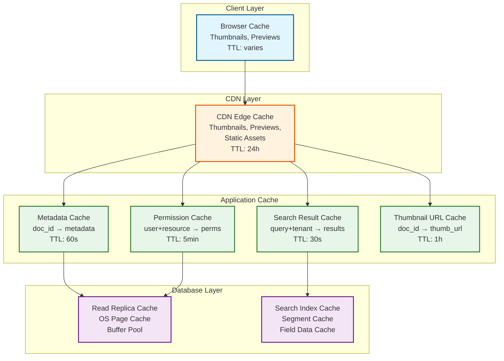

# Scalability and Reliability

## Document Storage Sharding

### Multi-Tenant Isolation Strategy

```
Tier 1: Large Enterprise Tenants (>1M documents)
├── Dedicated shard per tenant
├── Dedicated search index
├── Isolated object storage namespace
├── Custom retention and compliance policies
└── Dedicated compute pool (optional)

Tier 2: Medium Tenants (10K-1M documents)
├── Shared shard, tenant_id partition key
├── Shared search index with tenant_id filter
├── Shared object storage with tenant prefix
└── Shared compute pool

Tier 3: Small Tenants (<10K documents)
├── Packed into shared shards (many tenants per shard)
├── Shared search index with tenant_id filter
├── Shared object storage with tenant prefix
└── Shared compute pool
```

### Metadata DB Sharding

```
Sharding Strategy: tenant_id-based hash partitioning

Shard Key: tenant_id (hash)
├── All data for a tenant co-located on same shard
├── Enables single-shard queries for all tenant operations
├── Cross-tenant queries (admin/analytics) use scatter-gather
└── Rebalancing: move entire tenant to new shard

Shard Layout:
┌──────────────┐  ┌──────────────┐  ┌──────────────┐  ┌──────────────┐
│   Shard 1    │  │   Shard 2    │  │   Shard 3    │  │   Shard 4    │
│ hash(tid)%4=0│  │ hash(tid)%4=1│  │ hash(tid)%4=2│  │ hash(tid)%4=3│
├──────────────┤  ├──────────────┤  ├──────────────┤  ├──────────────┤
│ Primary      │  │ Primary      │  │ Primary      │  │ Primary      │
│ Replica 1    │  │ Replica 1    │  │ Replica 1    │  │ Replica 1    │
│ Replica 2    │  │ Replica 2    │  │ Replica 2    │  │ Replica 2    │
└──────────────┘  └──────────────┘  └──────────────┘  └──────────────┘

Within each shard:
├── DOCUMENTS table: partitioned by folder_id for locality
├── VERSIONS table: partitioned by document_id for co-location
├── ACL_ENTRIES table: partitioned by resource_id
├── METADATA_VALUES table: partitioned by document_id
├── FOLDERS table: partitioned by materialized_path prefix
└── AUDIT_EVENTS table: time-partitioned (monthly)
```

### Read Replica Strategy

```
Write Path:
  API → Primary Shard → Synchronous Replica 1 (same AZ) → Ack to client
                      → Async Replica 2 (different AZ) → Eventual consistency

Read Path (by consistency requirement):
  Strong reads (permissions, locks) → Primary shard
  Read-your-writes (metadata after update) → Primary or session-affine replica
  Eventual reads (search, listing, audit) → Any replica
```

---

## Search Cluster Scaling

### Index Sharding Strategy

```
Search Index Topology:

Index Shards (by tenant_id hash):
┌────────────────────────────────────────────────────┐
│                  Search Coordinator                  │
│  - Routes queries to correct shards                  │
│  - Merges results from multiple shards               │
│  - Manages index lifecycle (rollover, merge)         │
└──────────────┬──────────────┬──────────────┬────────┘
               │              │              │
    ┌──────────▼───┐  ┌──────▼───────┐  ┌──▼──────────┐
    │   Shard 1    │  │   Shard 2    │  │   Shard 3    │
    │ Tenants A-G  │  │ Tenants H-P  │  │ Tenants Q-Z  │
    ├──────────────┤  ├──────────────┤  ├──────────────┤
    │ Primary      │  │ Primary      │  │ Primary      │
    │ Replica A    │  │ Replica A    │  │ Replica A    │
    │ Replica B    │  │ Replica B    │  │ Replica B    │
    └──────────────┘  └──────────────┘  └──────────────┘

Query Routing:
  Single-tenant query → Route to single shard → Fast
  Cross-tenant query (admin) → Scatter-gather all shards → Slower
```

### Index Lifecycle Management

```
PSEUDOCODE: Index Rollover and Optimization

FUNCTION manage_search_index_lifecycle():
    // Index rollover when size exceeds threshold
    FOR shard IN search_shards:
        IF shard.index_size > MAX_INDEX_SIZE (500GB):
            new_index = create_new_index(shard.next_name)
            alias_swap(shard.write_alias, new_index)
            // Old index becomes read-only
            set_read_only(shard.current_index)

    // Force-merge old indices for query performance
    FOR index IN read_only_indices:
        IF index.segment_count > 1:
            force_merge(index, max_segments=1)
            // Single segment = fastest queries

    // Delete expired indices (beyond retention)
    FOR index IN all_indices:
        IF index.created_at < NOW() - INDEX_RETENTION_DAYS:
            delete_index(index)
```

### Search Result Cache Layer

```
Cache Architecture:

Layer 1: Client-Side Cache (Browser)
├── Autocomplete suggestions: 5-minute TTL
├── Recent search queries: session-scoped
└── Facet counts for current view: 60s TTL

Layer 2: CDN/Edge Cache
├── Popular shared document previews
├── Thumbnail images
└── Static search assets (facet definitions)

Layer 3: Application Cache (In-Memory)
├── Search result cache: tenant + query → results (30s TTL)
├── Permission cache: user + resource → permissions (5min TTL)
├── Metadata cache: document_id → metadata (60s TTL)
└── Facet count cache: tenant + field → counts (5min TTL)

Layer 4: Search Index Segment Cache
├── OS-level page cache for index segments
├── Search engine field data cache for sorting/aggregations
└── Query result cache in search engine (10s TTL)
```

---

## Workflow Engine Reliability

### Distributed State Machine

```
PSEUDOCODE: Reliable Workflow Step Execution

FUNCTION execute_workflow_step(step_id, instance_id):
    // Idempotent execution with at-least-once delivery
    execution_key = "workflow:" + instance_id + ":step:" + step_id
    IF already_executed(execution_key):
        RETURN get_cached_result(execution_key)

    // Acquire step-level lock to prevent double execution
    lock = acquire_lock(execution_key, ttl=5*MINUTES)
    IF lock IS NULL:
        RETURN RETRY_LATER  // Another worker is executing this step

    TRY:
        step = get_workflow_step(step_id)
        instance = get_workflow_instance(instance_id)

        // Execute step logic
        result = SWITCH step.type:
            CASE "APPROVAL":
                wait_for_human_action(step, instance)
            CASE "NOTIFICATION":
                send_notifications(step.assignees, instance)
                RETURN COMPLETED
            CASE "CONDITION":
                evaluate_condition(step.condition, instance.context)
            CASE "AUTO_ACTION":
                execute_auto_action(step.action, instance)

        // Record result
        record_step_completion(execution_key, result)

        // Advance workflow
        IF result == COMPLETED OR result == APPROVED:
            next_steps = get_next_steps(step)
            FOR next IN next_steps:
                enqueue_step_execution(next.id, instance_id)

    CATCH error:
        log_error(WORKFLOW_STEP_ERROR, step_id, error)
        IF is_retryable(error):
            enqueue_retry(step_id, instance_id, backoff=exponential)
        ELSE:
            mark_step_failed(step_id, instance_id, error)
            notify_admin(WORKFLOW_FAILURE, instance_id)
    FINALLY:
        release_lock(lock)
```

### Workflow Timeout and Escalation

```
PSEUDOCODE: Timeout Monitor

FUNCTION monitor_workflow_timeouts():
    // Runs every 5 minutes
    active_steps = get_all_active_workflow_steps()

    FOR step IN active_steps:
        IF step.type != "APPROVAL":
            CONTINUE  // Only approval steps have timeouts

        elapsed = NOW() - step.activated_at

        // Warning threshold (80% of timeout)
        IF elapsed > step.timeout_hours * 0.8 * HOURS:
            IF NOT step.warning_sent:
                send_reminder(step.assignees, step)
                step.warning_sent = true

        // Timeout threshold
        IF elapsed > step.timeout_hours * HOURS:
            IF step.escalation_to IS NOT NULL:
                // Escalate to manager/backup approver
                reassign_step(step, step.escalation_to)
                notify(step.escalation_to, "Escalated: " + step.name)
                log_event(WORKFLOW_ESCALATED, step)
            ELSE:
                // No escalation target: auto-action based on policy
                SWITCH step.timeout_action:
                    CASE "AUTO_APPROVE":
                        approve_step(step, actor="SYSTEM")
                    CASE "AUTO_REJECT":
                        reject_step(step, actor="SYSTEM")
                    CASE "NOTIFY_ADMIN":
                        notify_admin("Workflow step timed out: " + step.name)
```

---

## Geo-Replication for Global Teams

### Active-Active vs Active-Passive

```
Option A: Active-Active (multi-region writes)

Region US-East                  Region EU-West
┌────────────────┐              ┌────────────────┐
│  Full Service  │◄────────────►│  Full Service  │
│  Stack         │  Bi-dir      │  Stack         │
│                │  replication  │                │
│  Users write   │              │  Users write   │
│  locally       │              │  locally       │
└────────────────┘              └────────────────┘

Pros: Lowest latency for all regions; region-level fault tolerance
Cons: Conflict resolution for concurrent writes; complex consistency model
Best for: Metadata updates (idempotent), document uploads (no conflict)

Challenges:
- Lock conflicts: user in US and EU check out same document simultaneously
- Solution: Lock service runs in a single designated region (lock-home)
            with cross-region TTL allowance (+500ms for network latency)


Option B: Active-Passive (single write region) — Chosen for locks and permissions

Region US-East (Primary)        Region EU-West (Standby)
┌────────────────┐              ┌────────────────┐
│  Full Service  │─────────────►│  Read Replicas │
│  Stack         │  Async       │  + Local Cache  │
│                │  replication  │                │
│  All writes    │              │  Reads served  │
│  processed     │              │  locally       │
│  here          │              │                │
└────────────────┘              └────────────────┘

Pros: Simple consistency model; no write conflicts
Cons: Write latency for non-primary regions; failover complexity
Best for: Lock management, permission changes
```

### Hybrid Strategy (Chosen)

```
Per-Operation Region Strategy:

Operation          | Strategy       | Rationale
─────────────────────────────────────────────────────────
Document upload    | Write-local    | Content stored in nearest region
Metadata update    | Write-local    | Replicated async; idempotent
Lock acquire       | Single-leader  | Must be globally serialized
Permission change  | Single-leader  | Must be immediately consistent
Search query       | Read-local     | Each region has search replica
Workflow step      | Single-leader  | State machine must be serialized
Audit log write    | Write-local    | Append-only, merge later
Thumbnail serve    | Read-local     | CDN-cached in each region

Content Replication:
- Documents replicated to all regions async (5-30 min lag)
- User's "home region" serves latest; other regions may have slight lag
- Explicit cross-region sync for time-sensitive documents
```

---

## Disaster Recovery

### RPO/RTO Targets

| Component | RPO (Recovery Point) | RTO (Recovery Time) | Strategy |
|-----------|---------------------|---------------------|----------|
| **Document Content** | 0 (no data loss) | <1 hour | Cross-AZ replication in object storage |
| **Metadata DB** | <1 minute | <15 minutes | Synchronous replica + async cross-region |
| **Search Index** | <1 hour | <4 hours | Rebuild from content store; replicas for faster recovery |
| **Lock State** | 0 (no data loss) | <5 minutes | Consensus-based replication (Raft) |
| **Audit Log** | <5 minutes | <1 hour | Append-only with cross-region replication |
| **Workflow State** | <1 minute | <15 minutes | DB-backed with transaction log |
| **Cache** | N/A (ephemeral) | <1 minute | Warm-up from DB on restart |
| **OCR Queue** | <5 minutes | <30 minutes | Durable message queue with replication |

### Failure Scenarios and Recovery

```
Scenario 1: Single Node Failure
  Impact: Reduced capacity for affected service
  Detection: Health check failure within 10s
  Recovery: Auto-scaling replaces node within 2-5 minutes
  Data impact: None (replicated data)

Scenario 2: Availability Zone Failure
  Impact: ~33% capacity loss
  Detection: Multiple health check failures within 30s
  Recovery: Traffic shifts to healthy AZs within 1 minute
  Data impact: None (cross-AZ replication)

Scenario 3: Region Failure
  Impact: All users in affected region
  Detection: Cross-region monitoring within 1 minute
  Recovery: DNS failover to standby region within 5-15 minutes
  Data impact: Up to 1 minute of metadata updates (RPO)

Scenario 4: Object Storage Corruption
  Impact: Document content inaccessible
  Detection: Checksum verification on read
  Recovery: Restore from cross-AZ replicas (automatic)
  Data impact: None (11-nines durability)

Scenario 5: Search Index Corruption
  Impact: Search unavailable, all other operations unaffected
  Detection: Search health check failure
  Recovery: Rebuild from content store (4-8 hours for full rebuild)
  Mitigation: Replica serves queries during rebuild

Scenario 6: Lock Service Failure
  Impact: Cannot check-out/check-in documents
  Detection: Consensus health check within 5s
  Recovery: Raft leader election within 10s; quorum maintained
  Data impact: None (replicated via consensus)
```

### Backup Strategy

```
PSEUDOCODE: Tiered Backup Strategy

Backup Tiers:

Tier 1: Real-Time Replication (RPO: 0)
├── Object storage: cross-AZ replication (built-in)
├── Metadata DB: synchronous replica in second AZ
├── Lock store: Raft consensus (3 or 5 nodes)
└── Audit log: synchronous append to two stores

Tier 2: Near-Real-Time Backup (RPO: <5 minutes)
├── Metadata DB: async replication to cross-region standby
├── Search index: async replica updates
├── Message queue: mirrored queue in second AZ
└── Workflow state: transaction log shipping

Tier 3: Periodic Backup (RPO: <24 hours)
├── Full metadata DB dump: daily, encrypted, cross-region
├── Object storage inventory: daily manifest for reconciliation
├── Search index snapshot: daily, for fast rebuild
├── Configuration backup: hourly, version-controlled
└── Audit log archive: daily export to cold storage

Retention:
├── Tier 1: Continuous, oldest replica pruned by retention policy
├── Tier 2: 7 days of continuous replication lag
├── Tier 3: 30 days of daily backups, 12 months of monthly, 7 years of yearly
```

---

## Caching Layers

### Cache Architecture



### Cache Invalidation Strategy

```
PSEUDOCODE: Event-Driven Cache Invalidation

FUNCTION on_document_event(event):
    SWITCH event.type:
        CASE DOCUMENT_UPDATED, VERSION_CREATED:
            // Invalidate document metadata cache
            cache.delete("metadata:" + event.document_id)
            // Invalidate thumbnail cache (new version may have new content)
            cache.delete("thumbnail:" + event.document_id)
            // Invalidate search result caches for this tenant
            cache.delete_pattern("search:" + event.tenant_id + ":*")
            // CDN invalidation for previews
            cdn.invalidate("/previews/" + event.document_id + "/*")

        CASE ACL_CHANGED:
            // Invalidate permission cache for affected resource and descendants
            affected_resources = get_resource_and_descendants(event.resource_id)
            FOR resource_id IN affected_resources:
                cache.delete_pattern("perm:*:" + resource_id)
            // Invalidate all search caches (permissions affect search results)
            cache.delete_pattern("search:" + event.tenant_id + ":*")

        CASE DOCUMENT_DELETED:
            // Invalidate all caches for this document
            cache.delete("metadata:" + event.document_id)
            cache.delete("thumbnail:" + event.document_id)
            cache.delete_pattern("perm:*:" + event.document_id)
            cache.delete_pattern("search:" + event.tenant_id + ":*")

        CASE FOLDER_MOVED:
            // Invalidate permission cache for entire subtree
            subtree_resources = get_subtree_resources(event.folder_id)
            FOR resource_id IN subtree_resources:
                cache.delete_pattern("perm:*:" + resource_id)
```

---

## Autoscaling OCR Workers

### Queue-Depth-Based Autoscaling

```
PSEUDOCODE: OCR Worker Autoscaling

CONSTANTS:
    MIN_WORKERS = 2
    MAX_WORKERS = 50
    TARGET_QUEUE_DEPTH_PER_WORKER = 10
    SCALE_UP_THRESHOLD = 20      // Queue items per worker
    SCALE_DOWN_THRESHOLD = 5     // Queue items per worker
    SCALE_UP_COOLDOWN = 2 * MINUTES
    SCALE_DOWN_COOLDOWN = 10 * MINUTES
    SCALE_INCREMENT = 2           // Add/remove 2 workers at a time

FUNCTION autoscale_ocr_workers():
    current_workers = get_active_worker_count()
    queue_depth = get_ocr_queue_depth()
    items_per_worker = queue_depth / max(current_workers, 1)

    IF items_per_worker > SCALE_UP_THRESHOLD:
        IF time_since_last_scale > SCALE_UP_COOLDOWN:
            desired = min(
                current_workers + SCALE_INCREMENT,
                MAX_WORKERS,
                ceil(queue_depth / TARGET_QUEUE_DEPTH_PER_WORKER)
            )
            scale_to(desired)
            log_event(OCR_SCALE_UP, { from: current_workers, to: desired, queue_depth })

    ELSE IF items_per_worker < SCALE_DOWN_THRESHOLD:
        IF time_since_last_scale > SCALE_DOWN_COOLDOWN:
            desired = max(
                current_workers - SCALE_INCREMENT,
                MIN_WORKERS,
                ceil(queue_depth / TARGET_QUEUE_DEPTH_PER_WORKER)
            )
            scale_to(desired)
            log_event(OCR_SCALE_DOWN, { from: current_workers, to: desired, queue_depth })

    // Predictive scaling: scale up before known ingestion spikes
    IF is_business_hours_start() AND current_workers < MIN_WORKERS * 3:
        scale_to(MIN_WORKERS * 3)
        log_event(OCR_PREDICTIVE_SCALE, { reason: "business_hours_start" })
```

---

## Storage Tiering

### Lifecycle Management

```
Document Age & Access Pattern → Storage Tier

Hot Tier (First 30 days or frequently accessed):
├── Object Storage: Standard tier
├── Low-latency access (<100ms)
├── Cost: $$$$
└── Use: Active documents, recent uploads

Warm Tier (30-180 days, occasional access):
├── Object Storage: Infrequent Access tier
├── Medium latency (<500ms)
├── Cost: $$
└── Use: Older documents still in use

Cold Tier (180+ days, rarely accessed):
├── Object Storage: Archive tier
├── Higher latency (<12 hours for retrieval)
├── Cost: $
└── Use: Archived documents, old versions

Compliance Tier (legal hold or regulatory):
├── Object Storage: Compliance/WORM tier
├── Write Once Read Many (immutable)
├── Cannot be deleted until hold is released
├── Cost: $$ (WORM premium)
└── Use: Legal hold documents, regulatory archives
```

```
PSEUDOCODE: Storage Tiering Lifecycle

FUNCTION evaluate_storage_tier(document_id):
    doc = get_document(document_id)
    access_history = get_access_history(document_id, last_90_days)

    // Legal hold override: always compliance tier
    IF is_under_legal_hold(document_id):
        RETURN COMPLIANCE_TIER

    // Access-based tiering
    access_count_30d = access_history.filter(a => a.age < 30).count
    access_count_90d = access_history.count
    document_age = days_since(doc.created_at)

    IF access_count_30d > 5 OR document_age < 30:
        RETURN HOT_TIER
    ELSE IF access_count_90d > 2 OR document_age < 180:
        RETURN WARM_TIER
    ELSE:
        RETURN COLD_TIER

FUNCTION migrate_storage_tier(document_id, target_tier):
    doc = get_document(document_id)
    current_tier = get_current_tier(doc.storage_key)

    IF current_tier == target_tier:
        RETURN  // Already in correct tier

    // Initiate tier transition (async for cold/archive)
    IF target_tier IN [HOT_TIER, WARM_TIER]:
        // Immediate transition
        move_object(doc.storage_key, target_tier)
    ELSE IF target_tier == COLD_TIER:
        // Async transition (can take hours)
        enqueue_tier_transition(doc.storage_key, target_tier)

    update_document_tier(document_id, target_tier)
    log_event(STORAGE_TIER_CHANGE, { document_id, from: current_tier, to: target_tier })
```

---

## Capacity Planning

### Growth Projection Model

```
Current State (Year 0):
├── Documents: 1B
├── Total Storage: 7.5 PB
├── DAU: 10M
├── Search Index: 500 TB
└── Audit Log: 127 TB

Year 1 Projection (40% growth):
├── Documents: 1.4B (+400M)
├── Total Storage: 10.5 PB (+3 PB)
├── DAU: 14M (+4M)
├── Search Index: 700 TB (+200 TB)
└── Audit Log: 254 TB (+127 TB)

Year 3 Projection:
├── Documents: 2.7B
├── Total Storage: 20+ PB
├── DAU: 27M
├── Search Index: 1.4 PB
└── Audit Log: 760+ TB (pre-archival)

Scaling Actions:
├── Year 1: Add 2 metadata DB shards, expand search cluster 40%
├── Year 2: Add object storage region, add 4 metadata DB shards
├── Year 3: Re-shard metadata DB (8→16 shards), search cluster federation
```
