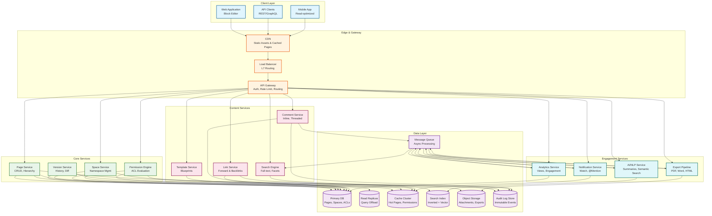
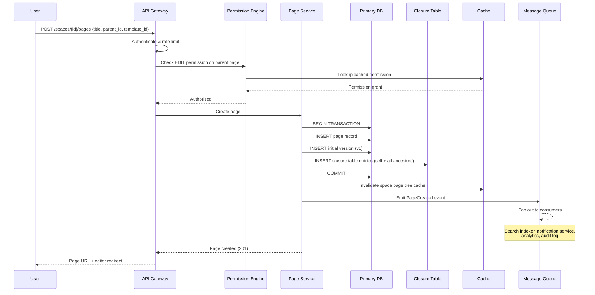
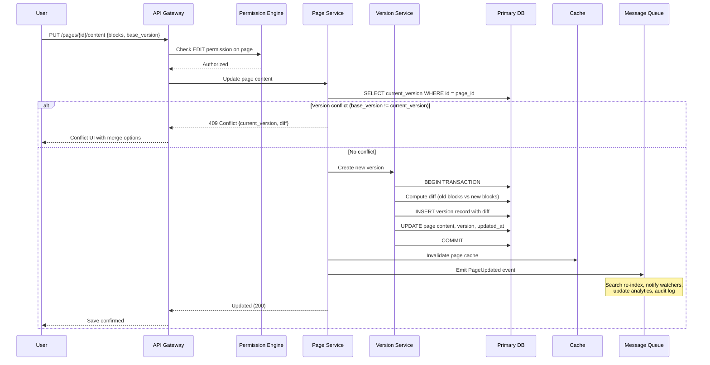
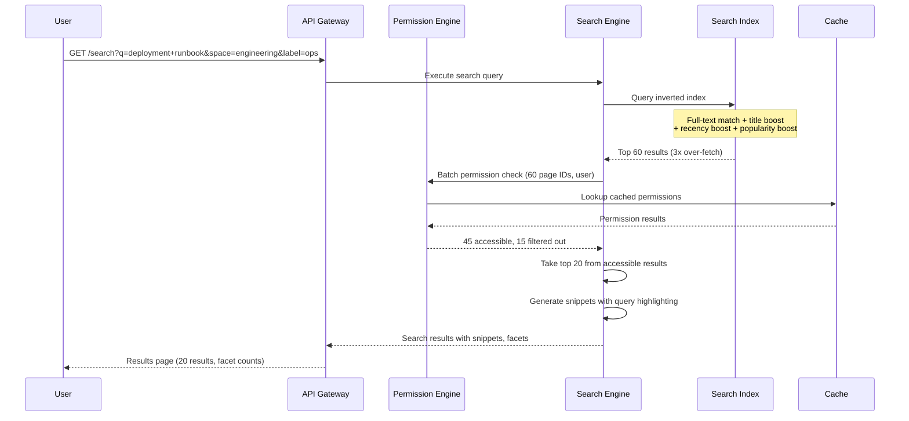
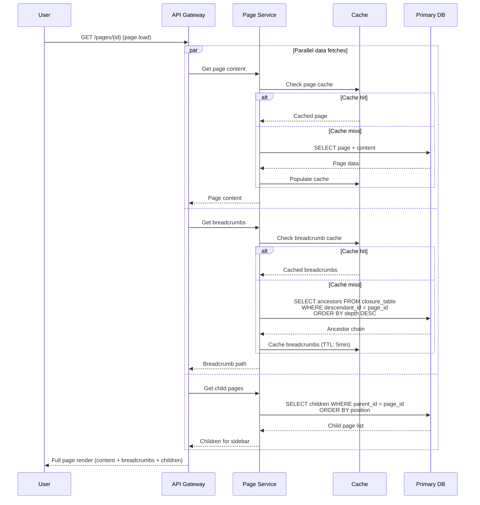
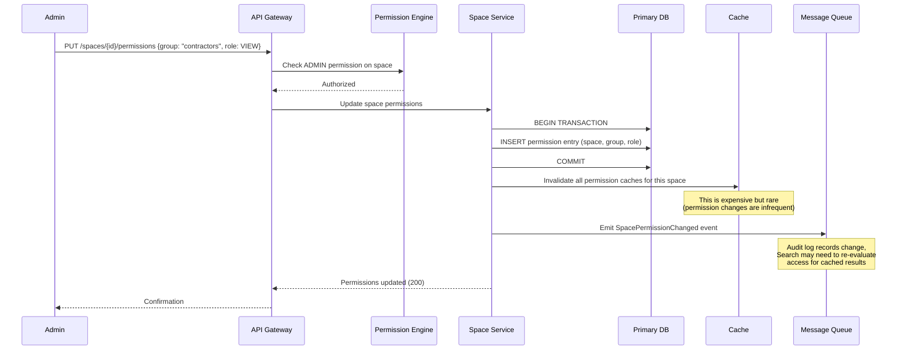

# High-Level Design

## System Architecture



---

## Key Architectural Decisions

### 1. Block-Based Content Storage vs Raw HTML vs Markdown

**Decision: Block-based JSON storage with rendering at read time**

| Factor | Raw HTML | Markdown | Block-Based JSON (Chosen) |
|--------|----------|----------|--------------------------|
| Rich content support | Full (but messy) | Limited (no tables, macros) | Full (structured, extensible) |
| Search indexing | Requires HTML stripping | Direct indexing | Structured extraction per block |
| Version diffing | Character-level on HTML (noisy) | Line-level (reasonable) | Block-level (semantic diffs) |
| Macro/embed support | Inline scripts (security risk) | Not supported | First-class typed blocks |
| Migration/export | Direct to browser | Render to HTML | Render to HTML/PDF/Markdown |
| Editing UX | WYSIWYG with contentEditable | Plain text with preview | Structured block editor |

**Rationale**: Block-based storage treats each content element (paragraph, heading, table, code block, macro) as a typed JSON object with properties. This enables block-level versioning (identify exactly which block changed), block-level permissions (restrict editing of certain sections), structured search indexing (boost headings, extract table data), and a clean separation between content and presentation. Confluence Cloud migrated from raw HTML (wiki markup rendered to HTML) to a block-based model (ADF---Atlassian Document Format) for exactly these reasons.

### 2. Page Hierarchy Storage: Closure Table + Adjacency List

**Decision: Hybrid approach with adjacency list for parent-child and closure table for ancestor queries**

| Factor | Adjacency Only | Materialized Path | Closure Table (Chosen) |
|--------|---------------|-------------------|----------------------|
| Find all ancestors | O(depth) recursive queries | O(1) string parse | O(1) single query |
| Find all descendants | O(n) recursive queries | O(n) LIKE query | O(1) single query |
| Insert page | O(1) | O(1) | O(depth) closure rows |
| Move subtree | O(1) parent update | O(subtree) path updates | O(subtree) closure updates |
| Permission inheritance | Recursive walk (slow) | String prefix match | Direct ancestor query (fast) |
| Breadcrumb generation | O(depth) queries or recursive CTE | O(1) string split | O(1) single query |

**Rationale**: Permission inheritance is the dominant read-path operation in a KMS. Every page load requires answering "what are this user's effective permissions?"---which requires knowing all ancestors. The closure table answers this in a single indexed query. The adjacency list (`parent_id` on each page) handles direct parent-child relationships and page tree rendering. Together, they optimize for the two most common hierarchy queries. The write overhead of maintaining closure table entries on insert/move is acceptable given the 10:1+ read-to-write ratio.

### 3. Permission Inheritance Strategy

**Decision: Space defaults + page-level overrides with deny-takes-precedence**

```
Space Level:
  "Engineering" space → Group "engineers" = EDIT, Group "all-staff" = VIEW

Page Level (override):
  "Salary Bands" page → Restrict to Group "hr-managers" = VIEW, others = NONE

Inheritance Rule:
  Child pages inherit parent's effective permissions unless explicitly overridden.
  Deny (NONE/RESTRICT) takes precedence over Allow at the same level.
  Space admins always have full access regardless of page restrictions.
```

**Rationale**: Permissive-by-default (inherit from space) with restrictive overrides (lock down specific pages) matches how organizations actually use wikis: most pages are open to the space's audience, with sensitive pages locked down. The alternative---restrictive-by-default with explicit grants---creates permission management overhead that kills adoption.

### 4. Search Architecture

**Decision: Dedicated search engine with permission-filtered results**

Search must be permission-aware: users should never see pages they cannot access. Two approaches:

| Approach | Description | Pros | Cons |
|----------|-------------|------|------|
| **Pre-filtered index** | Separate index per permission set | Fast queries | Index explosion; stale on permission changes |
| **Post-filtered results** (Chosen) | Query full index, filter results by permission check | Single index; always fresh | Permission check per result; may need over-fetching |

**Rationale**: Post-filtering with a permission cache is the practical choice. Pre-filtered indexes would require rebuilding indexes whenever permissions change---which happens frequently (new team members, role changes, space restructuring). Post-filtering requires checking permissions for each search result, but with a cached permission engine (see [04 - Deep Dive](./04-deep-dive-and-bottlenecks.md)), this adds <5ms per query. Over-fetching (requesting 3x results to account for filtered-out pages) handles the common case efficiently.

### 5. Concurrent Editing Strategy

**Decision: Last-write-wins with conflict detection and merge assist**

| Approach | Complexity | UX | Best For |
|----------|-----------|-----|----------|
| Pessimistic locking | Low | Poor (only one editor) | Document management systems |
| Last-write-wins (Chosen) | Low | Acceptable with warnings | Wiki systems (infrequent conflicts) |
| Real-time co-editing (OT/CRDT) | Very High | Excellent | Collaborative editors |

**Rationale**: Wiki pages have low edit concurrency (typically 1-3 editors per page). Last-write-wins with conflict detection provides a good balance: if two users edit simultaneously, the second saver is warned of conflicts and shown a three-way merge UI. This avoids the immense complexity of real-time co-editing (CRDT/OT) for a use case where it rarely matters. Optional real-time co-editing can be added as a premium feature for high-collaboration teams.

### 6. Database Choices

| Data Type | Storage | Rationale |
|-----------|---------|-----------|
| Pages, spaces, permissions, users | Relational DB (managed) | ACID for permission changes; rich queries for hierarchy |
| Page content (blocks) | JSONB column in relational DB | Co-located with metadata; transactional consistency |
| Version history (diffs) | Relational DB + object storage | Small diffs in DB; full snapshots in object storage |
| Search index | Dedicated search cluster | Inverted index, relevance scoring, facets |
| Attachments | Object storage (CDN-backed) | Cost-effective, scalable binary storage |
| Cache (permissions, pages, trees) | In-memory cache cluster | Sub-ms reads for hot data |
| Audit log | Append-only log store | Immutable, time-series optimized |
| Notification queue | Message queue | Async fan-out, retry semantics |
| AI embeddings | Vector store (in search cluster) | Co-located with keyword index for hybrid search |

---

## Data Flow

### Creating a Page



### Editing Page Content



### Searching for Content



### Navigating Page Hierarchy



### Sharing a Space



---

## Architecture Pattern Checklist

- [x] **Sync vs Async**: Sync for page reads and saves; async for search indexing, notifications, exports, AI processing
- [x] **Event-driven vs Request-response**: Event-driven for side effects (index, notify, audit); request-response for page CRUD
- [x] **Push vs Pull**: Pull for page content; push for notifications and real-time updates to open pages
- [x] **Stateless vs Stateful**: All application services are stateless; state lives in DB, cache, and search index
- [x] **Read-heavy vs Write-heavy**: Strongly read-heavy (10:1+); optimized with CDN, cache, read replicas
- [x] **Real-time vs Batch**: Near-real-time for search indexing (<30s); batch for analytics aggregation, AI summarization
- [x] **Edge vs Origin**: CDN for static assets and cached rendered pages; origin for dynamic content and search

---

## Component Responsibilities

| Component | Responsibility | Scaling Strategy |
|-----------|---------------|-----------------|
| **API Gateway** | Authentication, rate limiting, request routing | Horizontal, stateless |
| **Page Service** | Page CRUD, hierarchy management, content storage | Horizontal, stateless; DB sharded by space |
| **Space Service** | Space lifecycle, space settings, space-level operations | Horizontal, stateless |
| **Permission Engine** | ACL evaluation, permission inheritance computation | Horizontal with aggressive caching |
| **Version Service** | Version creation, diff computation, version restore | Horizontal; heavy reads from object storage |
| **Search Engine** | Query parsing, search execution, result ranking | Sharded search index; horizontal query nodes |
| **Link Service** | Forward/backlink index, broken link detection | Horizontal; link graph in DB |
| **Template Service** | Template CRUD, variable substitution, instantiation | Horizontal, stateless |
| **Comment Service** | Inline comments, threaded replies, resolution | Horizontal, stateless |
| **Notification Service** | Fan-out to watchers, delivery (email, in-app, webhook) | Queue-based, auto-scaled workers |
| **Analytics Service** | View tracking, engagement metrics, dashboards | Queue-based ingestion; batch aggregation |
| **AI/NLP Service** | Summarization, semantic search, recommendations | GPU-backed workers; queue-based |
| **Export Pipeline** | PDF/Word/HTML generation from page trees | Queue-based, auto-scaled workers |
| **Audit Log** | Immutable event recording, compliance queries | Append-only store; time-partitioned |

---

## Integration Points

| Integration | Protocol | Purpose |
|-------------|----------|---------|
| **SSO/Identity Provider** | SAML 2.0 / OIDC | Enterprise authentication; group sync |
| **Issue Tracker** | REST API webhooks | Embed issue status in pages; link pages to issues |
| **Code Repository** | REST API / webhooks | Embed code snippets; link pages to repos/PRs |
| **Communication Tools** | REST API / webhooks | Share page links with previews; notify channels on page changes |
| **File Storage** | Object storage API | Attachment upload/download; export storage |
| **Email Service** | SMTP / API | Notification delivery; page-by-email creation |
| **Analytics Platform** | Event streaming | Business intelligence; content engagement analysis |
| **AI/ML Platform** | gRPC / REST | Text summarization; embedding generation; recommendations |
