# Low-Level Design

## Data Model

### Core Entity Relationships

```mermaid
erDiagram
    SPACE {
        uuid id PK "Space identifier"
        string key UK "URL-friendly key (e.g., 'ENG')"
        string name "Display name"
        string description "Space description"
        uuid creator_id FK "User who created the space"
        string status "active, archived, deleted"
        jsonb settings "Theme, default permissions, features"
        string homepage_id FK "Root page of the space"
        timestamp created_at
        timestamp updated_at
    }

    PAGE {
        uuid id PK "Page identifier"
        uuid space_id FK "Owning space"
        uuid parent_id FK "Parent page (null for root)"
        string title "Page title"
        string slug "URL-friendly slug"
        int position "Sort order among siblings"
        string status "draft, published, archived, deleted"
        uuid current_version_id FK "Latest version"
        int version_number "Current version counter"
        uuid creator_id FK "Original author"
        uuid last_editor_id FK "Last person to edit"
        jsonb metadata "Custom page metadata"
        timestamp created_at
        timestamp updated_at
        timestamp published_at
    }

    PAGE_CONTENT {
        uuid page_id PK "One-to-one with PAGE"
        jsonb blocks "Block-based content (ADF-style)"
        text plain_text "Extracted plain text for search"
        int word_count "Computed word count"
        timestamp updated_at
    }

    PAGE_VERSION {
        uuid id PK "Version identifier"
        uuid page_id FK "Parent page"
        int version_number "Sequential version number"
        jsonb content_diff "JSON diff from previous version"
        string change_summary "Auto-generated or user-provided"
        uuid author_id FK "Who made this edit"
        timestamp created_at
        boolean is_snapshot "Full content snapshot (vs diff)"
    }

    PAGE_CLOSURE {
        uuid ancestor_id FK "Ancestor page"
        uuid descendant_id FK "Descendant page"
        int depth "Distance (0 = self)"
    }

    LABEL {
        uuid id PK
        string name UK "Label name (lowercase, normalized)"
        string color "Display color hex"
    }

    PAGE_LABEL {
        uuid page_id FK
        uuid label_id FK
    }

    COMMENT {
        uuid id PK
        uuid page_id FK "Page containing the comment"
        uuid parent_comment_id FK "Thread parent (null for root)"
        uuid author_id FK
        text body "Comment content (markdown)"
        jsonb anchor "Block ID + offset for inline comments"
        string status "open, resolved, deleted"
        timestamp created_at
        timestamp updated_at
    }

    PERMISSION_ENTRY {
        uuid id PK
        uuid target_id "Space ID or Page ID"
        string target_type "space or page"
        uuid principal_id "User ID or Group ID"
        string principal_type "user or group"
        string role "admin, editor, viewer, none"
        boolean is_inherited "Computed flag"
        uuid granted_by FK "Who granted this permission"
        timestamp created_at
    }

    WATCH_SUBSCRIPTION {
        uuid id PK
        uuid user_id FK
        uuid target_id "Page ID or Space ID"
        string target_type "page or space"
        string channel "email, in_app, webhook"
        boolean muted "Temporarily muted"
        timestamp created_at
    }

    PAGE_LINK {
        uuid source_page_id FK "Page containing the link"
        uuid target_page_id FK "Page being linked to"
        string link_text "Anchor text"
        string block_id "Block containing the link"
    }

    ATTACHMENT {
        uuid id PK
        uuid page_id FK
        string filename "Original filename"
        string content_type "MIME type"
        bigint size_bytes "File size"
        string storage_key "Object storage path"
        uuid uploader_id FK
        timestamp created_at
    }

    TEMPLATE {
        uuid id PK
        uuid space_id FK "Null for global templates"
        string name "Template name"
        string description "What this template is for"
        jsonb blocks "Template content with variables"
        jsonb variables "Variable definitions and defaults"
        uuid creator_id FK
        timestamp created_at
        timestamp updated_at
    }

    AUDIT_EVENT {
        uuid id PK
        string event_type "page.created, page.edited, permission.changed, etc."
        uuid actor_id FK "Who performed the action"
        uuid target_id "ID of affected entity"
        string target_type "page, space, permission, etc."
        jsonb details "Event-specific data"
        string ip_address "Client IP"
        string user_agent "Client user agent"
        timestamp created_at
    }

    SPACE ||--o{ PAGE : "contains"
    SPACE ||--o{ TEMPLATE : "has templates"
    SPACE ||--o{ PERMISSION_ENTRY : "has permissions"
    PAGE ||--|| PAGE_CONTENT : "has content"
    PAGE ||--o{ PAGE_VERSION : "has versions"
    PAGE ||--o{ PAGE : "has children"
    PAGE ||--o{ PAGE_CLOSURE : "is ancestor"
    PAGE ||--o{ PAGE_CLOSURE : "is descendant"
    PAGE ||--o{ COMMENT : "has comments"
    PAGE ||--o{ PAGE_LABEL : "has labels"
    PAGE ||--o{ PERMISSION_ENTRY : "has permissions"
    PAGE ||--o{ WATCH_SUBSCRIPTION : "watched by"
    PAGE ||--o{ PAGE_LINK : "links from"
    PAGE ||--o{ PAGE_LINK : "links to"
    PAGE ||--o{ ATTACHMENT : "has attachments"
    LABEL ||--o{ PAGE_LABEL : "applied to"
```



---

## Page Content: Block-Based Storage

### Block Schema (JSON/JSONB)

A page's content is stored as an ordered array of blocks, where each block has a type, properties, and optional children (for nested content like lists, tables, expandable sections).

```
BLOCK SCHEMA (per block in the blocks array):

{
  "id": "block-uuid-v4",
  "type": "paragraph | heading | bulletList | numberedList | table |
           codeBlock | blockquote | expand | image | embed |
           macro | divider | panel | status | mention |
           taskList | taskItem | mediaGroup",
  "attrs": {
    // Type-specific attributes
    // heading: { "level": 1|2|3|4|5|6 }
    // codeBlock: { "language": "python" }
    // panel: { "panelType": "info|note|warning|error|success" }
    // image: { "src": "attachment-id", "width": 600, "alt": "..." }
    // macro: { "macroId": "toc|include|jira|status", "params": {...} }
  },
  "content": [
    // Inline content (for text-containing blocks):
    {
      "type": "text",
      "text": "Hello world",
      "marks": [
        { "type": "bold" },
        { "type": "link", "attrs": { "href": "/pages/page-id" } },
        { "type": "code" },
        { "type": "textColor", "attrs": { "color": "#ff0000" } }
      ]
    },
    {
      "type": "mention",
      "attrs": { "id": "user-uuid", "text": "@Alice" }
    },
    // OR nested blocks (for container blocks):
    {
      "type": "listItem",
      "content": [{ "type": "paragraph", "content": [...] }]
    }
  ]
}
```

### Content Storage Trade-offs

| Approach | Storage Size | Query Flexibility | Diff Quality | Rendering Speed |
|----------|-------------|-------------------|-------------|-----------------|
| **JSONB in relational DB** (Chosen) | Compact | JSONPath queries; index on specific keys | Block-level JSON diff | Parse + render |
| **Separate block table (normalized)** | Larger (row overhead) | Full SQL on each block | Row-level diff | JOIN-heavy reads |
| **Raw HTML** | Compact | Limited (regex/XPath) | Character-level (noisy) | Direct render (fast) |
| **Markdown source** | Most compact | Limited | Line-level diff | Parse + render |

**Chosen approach**: JSONB column in `PAGE_CONTENT` table. The entire block tree for a page is stored as a single JSONB document. This enables:
- Atomic page saves (single row update)
- Block-level JSON diff for version history
- JSONPath queries for search content extraction
- No JOIN overhead for page reads

**Trade-off**: Large pages (>1MB of JSONB) may need pagination or block-level lazy loading. In practice, 99% of wiki pages are <100KB of block content.

---

## Page Hierarchy: Closure Table Implementation

### Why Closure Table

The closure table stores all ancestor-descendant relationships explicitly. For a KMS, this is critical because:

1. **Permission inheritance**: "What permissions does User X have on Page P?" requires knowing all ancestors of P to check for inherited permissions. With a closure table: single query.

2. **Breadcrumb generation**: "Show the path from space root to current page." With a closure table: single query sorted by depth.

3. **Subtree operations**: "Export all pages under this section." With a closure table: single query.

### Closure Table Operations (Pseudocode)

```
PSEUDOCODE: Closure Table Maintenance

FUNCTION create_page(page_id, parent_id, space_id):
    // Insert the page record
    INSERT INTO pages (id, parent_id, space_id, ...) VALUES (page_id, parent_id, space_id, ...)

    // Self-referencing closure entry (every page is its own ancestor at depth 0)
    INSERT INTO page_closure (ancestor_id, descendant_id, depth)
    VALUES (page_id, page_id, 0)

    // Copy all ancestor entries from parent, incrementing depth by 1
    INSERT INTO page_closure (ancestor_id, descendant_id, depth)
    SELECT ancestor_id, page_id, depth + 1
    FROM page_closure
    WHERE descendant_id = parent_id


FUNCTION move_page(page_id, new_parent_id):
    // Step 1: Validate no cycle (new_parent must not be a descendant of page_id)
    IF EXISTS (SELECT 1 FROM page_closure
               WHERE ancestor_id = page_id AND descendant_id = new_parent_id):
        RAISE "Cannot move page under its own descendant (cycle)"

    // Step 2: Get all descendants of the page being moved (including self)
    subtree_ids = SELECT descendant_id FROM page_closure WHERE ancestor_id = page_id

    // Step 3: Delete old ancestor relationships for the entire subtree
    // (keep internal subtree relationships intact)
    DELETE FROM page_closure
    WHERE descendant_id IN (subtree_ids)
      AND ancestor_id NOT IN (subtree_ids)

    // Step 4: Insert new ancestor relationships
    // For each node in the subtree, create closure entries to all ancestors of new_parent
    INSERT INTO page_closure (ancestor_id, descendant_id, depth)
    SELECT new_ancestors.ancestor_id,
           subtree.descendant_id,
           new_ancestors.depth + subtree.depth + 1
    FROM page_closure AS new_ancestors
    CROSS JOIN page_closure AS subtree
    WHERE new_ancestors.descendant_id = new_parent_id
      AND subtree.ancestor_id = page_id

    // Step 5: Update the page's parent_id
    UPDATE pages SET parent_id = new_parent_id WHERE id = page_id


FUNCTION delete_page(page_id, strategy):
    IF strategy == "cascade":
        // Delete page and all descendants
        subtree_ids = SELECT descendant_id FROM page_closure WHERE ancestor_id = page_id
        DELETE FROM page_closure WHERE descendant_id IN (subtree_ids) OR ancestor_id IN (subtree_ids)
        UPDATE pages SET status = 'deleted' WHERE id IN (subtree_ids)

    ELSE IF strategy == "reparent":
        // Move children to deleted page's parent
        parent_id = SELECT parent_id FROM pages WHERE id = page_id
        children = SELECT id FROM pages WHERE parent_id = page_id
        FOR child_id IN children:
            move_page(child_id, parent_id)

        // Now delete the page itself
        DELETE FROM page_closure WHERE descendant_id = page_id OR ancestor_id = page_id
        UPDATE pages SET status = 'deleted' WHERE id = page_id


FUNCTION get_breadcrumbs(page_id):
    RETURN SELECT p.id, p.title, p.slug, pc.depth
           FROM page_closure pc
           JOIN pages p ON p.id = pc.ancestor_id
           WHERE pc.descendant_id = page_id
           ORDER BY pc.depth DESC  // Root first, current page last


FUNCTION get_subtree(page_id, max_depth):
    RETURN SELECT p.id, p.title, p.parent_id, pc.depth
           FROM page_closure pc
           JOIN pages p ON p.id = pc.descendant_id
           WHERE pc.ancestor_id = page_id
             AND pc.depth <= max_depth
             AND pc.depth > 0  // Exclude self
           ORDER BY pc.depth, p.position
```

### Complexity Analysis

| Operation | Closure Table | Adjacency List | Materialized Path |
|-----------|--------------|----------------|-------------------|
| Get ancestors (breadcrumbs) | O(1) query, O(depth) rows | O(depth) recursive queries | O(1) query, string parse |
| Get all descendants | O(1) query, O(subtree) rows | O(n) recursive queries | O(n) LIKE query |
| Insert page | O(depth) rows inserted | O(1) | O(1) |
| Move subtree (size s, depth d) | O(s * d) delete + insert | O(1) parent update | O(s) path updates |
| Check if A is ancestor of B | O(1) single row lookup | O(depth) walk | O(1) string prefix |
| Space: closure table rows | O(n * avg_depth) | N/A | N/A |

For a space with 10,000 pages and average depth 5: ~50,000 closure table rows. At ~50 bytes per row, that is ~2.5MB---trivially cached.

---

## Version Storage: Diff-Based with Periodic Snapshots

### Version Strategy

```
PSEUDOCODE: Version Management

STRUCTURE PageVersion:
    id: UUID
    page_id: UUID
    version_number: int
    content_diff: JSON       // Block-level diff from previous version
    full_snapshot: JSON      // Full content (only for snapshot versions)
    is_snapshot: boolean
    author_id: UUID
    change_summary: string
    created_at: timestamp

FUNCTION save_page(page_id, new_blocks, author_id, base_version):
    current = GET_CURRENT_VERSION(page_id)

    // Optimistic concurrency check
    IF current.version_number != base_version:
        RAISE ConflictError(current_version=current.version_number)

    // Compute block-level diff
    diff = compute_block_diff(current.blocks, new_blocks)

    IF diff.is_empty():
        RETURN  // No changes

    new_version_number = current.version_number + 1
    is_snapshot = (new_version_number % 10 == 0)  // Snapshot every 10 versions

    version = PageVersion(
        id = new_uuid(),
        page_id = page_id,
        version_number = new_version_number,
        content_diff = diff,
        full_snapshot = new_blocks IF is_snapshot ELSE null,
        is_snapshot = is_snapshot,
        author_id = author_id,
        change_summary = generate_summary(diff),
        created_at = now()
    )

    // Atomic: update page content + insert version
    BEGIN TRANSACTION
        UPDATE page_content SET blocks = new_blocks WHERE page_id = page_id
        INSERT version
        UPDATE pages SET version_number = new_version_number,
                        current_version_id = version.id,
                        last_editor_id = author_id,
                        updated_at = now()
               WHERE id = page_id
    COMMIT


FUNCTION compute_block_diff(old_blocks, new_blocks):
    diff = {added: [], removed: [], modified: [], moved: []}

    old_map = {block.id: block FOR block IN flatten(old_blocks)}
    new_map = {block.id: block FOR block IN flatten(new_blocks)}

    FOR block_id IN old_map:
        IF block_id NOT IN new_map:
            diff.removed.append(block_id)
        ELSE IF old_map[block_id] != new_map[block_id]:
            diff.modified.append({
                id: block_id,
                old: old_map[block_id],
                new: new_map[block_id]
            })

    FOR block_id IN new_map:
        IF block_id NOT IN old_map:
            diff.added.append(new_map[block_id])

    // Detect position changes (moves)
    // Compare block order in parent containers
    diff.moved = detect_position_changes(old_blocks, new_blocks)

    RETURN diff


FUNCTION restore_version(page_id, target_version_number):
    // Reconstruct content at target version
    content = reconstruct_at_version(page_id, target_version_number)

    // Save as a new version (restore is an edit, not a rollback)
    save_page(page_id, content, current_user_id, current_version_number)


FUNCTION reconstruct_at_version(page_id, target_version):
    // Find nearest snapshot at or before target version
    snapshot = SELECT * FROM page_versions
               WHERE page_id = page_id
                 AND is_snapshot = true
                 AND version_number <= target_version
               ORDER BY version_number DESC
               LIMIT 1

    content = snapshot.full_snapshot

    // Apply diffs from snapshot to target version
    diffs = SELECT * FROM page_versions
            WHERE page_id = page_id
              AND version_number > snapshot.version_number
              AND version_number <= target_version
            ORDER BY version_number ASC

    FOR diff IN diffs:
        content = apply_diff(content, diff.content_diff)

    RETURN content
```

### Full-Copy vs Diff Trade-offs

| Approach | Storage per Version | Restore Speed | Diff Display | Best For |
|----------|-------------------|---------------|-------------|----------|
| **Full copy** | 20KB per version | O(1) instant | Compute diff on demand | Few versions, large pages |
| **Diff only** | 1-5KB per version | O(n) replay from start | Stored directly | Many versions, small changes |
| **Diff + snapshots** (Chosen) | 2KB avg (snapshot every 10) | O(k) replay from nearest snapshot | Stored directly | Production: best of both |

---

## Permission Model

### Permission Hierarchy

```
PSEUDOCODE: Permission Evaluation

ENUM Role:
    ADMIN = 4    // Full control: edit, manage permissions, delete
    EDITOR = 3   // Create and edit pages
    VIEWER = 2   // Read pages
    NONE = 0     // No access (explicit deny)

FUNCTION evaluate_permission(user_id, page_id):
    // Step 1: Check page-level explicit permissions
    page_perm = get_explicit_permission(user_id, page_id, "page")
    IF page_perm IS NOT NULL:
        RETURN page_perm  // Page-level override takes precedence

    // Step 2: Walk up the page tree for inherited page-level overrides
    ancestors = get_ancestors_ordered_by_depth(page_id)  // Nearest first
    FOR ancestor_id IN ancestors:
        ancestor_perm = get_explicit_permission(user_id, ancestor_id, "page")
        IF ancestor_perm IS NOT NULL:
            RETURN ancestor_perm  // Nearest ancestor override wins

    // Step 3: Fall back to space-level permission
    space_id = get_space_id(page_id)
    space_perm = get_explicit_permission(user_id, space_id, "space")
    IF space_perm IS NOT NULL:
        RETURN space_perm

    // Step 4: Check if space allows anonymous access
    IF space_has_anonymous_access(space_id):
        RETURN Role.VIEWER

    // Step 5: No permission found
    RETURN Role.NONE


FUNCTION get_explicit_permission(user_id, target_id, target_type):
    // Check direct user permissions
    direct = SELECT role FROM permission_entries
             WHERE target_id = target_id
               AND target_type = target_type
               AND principal_id = user_id
               AND principal_type = 'user'

    IF direct IS NOT NULL:
        RETURN direct

    // Check group permissions (user may be in multiple groups)
    groups = get_user_groups(user_id)
    group_perms = SELECT role FROM permission_entries
                  WHERE target_id = target_id
                    AND target_type = target_type
                    AND principal_id IN (groups)
                    AND principal_type = 'group'

    IF group_perms IS NOT EMPTY:
        // If multiple groups grant different roles:
        // Most restrictive NONE overrides others (deny-takes-precedence)
        IF Role.NONE IN group_perms:
            RETURN Role.NONE
        // Otherwise, most permissive role wins
        RETURN MAX(group_perms)

    RETURN NULL  // No explicit permission at this level


FUNCTION batch_permission_check(user_id, page_ids):
    // Optimized for search result filtering
    // Pre-load user's groups once
    groups = get_user_groups(user_id)

    // Check cache for each page
    results = {}
    cache_misses = []

    FOR page_id IN page_ids:
        cached = cache.get(f"perm:{user_id}:{page_id}")
        IF cached IS NOT NULL:
            results[page_id] = cached
        ELSE:
            cache_misses.append(page_id)

    // Batch evaluate cache misses
    IF cache_misses:
        // Get all space memberships at once
        space_perms = batch_get_space_permissions(user_id, groups, cache_misses)

        // Get all page-level overrides at once
        page_overrides = batch_get_page_permissions(user_id, groups, cache_misses)

        // Get ancestor overrides for pages that need inheritance walk
        ancestor_overrides = batch_get_ancestor_permissions(user_id, groups, cache_misses)

        FOR page_id IN cache_misses:
            perm = resolve_from_batched(page_id, space_perms, page_overrides, ancestor_overrides)
            results[page_id] = perm
            cache.set(f"perm:{user_id}:{page_id}", perm, ttl=300)

    RETURN results
```

### Permission Inheritance Rules

| Rule | Behavior | Example |
|------|----------|---------|
| **Space default** | All pages in space inherit space-level permissions | Space "ENG" grants `engineers` group EDIT |
| **Page restrict** | Page sets NONE for a group, overriding space grant | "Salary" page restricts to `hr` group only |
| **Page extend** | Page grants additional access beyond space default | "Public API Docs" page grants anonymous VIEW |
| **Inheritance** | Child pages inherit nearest ancestor's override | Pages under "Salary" also restricted |
| **Admin bypass** | Space admins always have full access | Space admin can access restricted pages |
| **Deny precedence** | Explicit NONE at any level overrides grants at same level | NONE for `contractors` group on page beats EDIT for `all-staff` group |

---

## Full-Text Search Index

### Index Architecture

```
PSEUDOCODE: Search Indexing

STRUCTURE SearchDocument:
    page_id: string                    // Primary key
    space_id: string                   // For space-scoped search
    title: string                      // Boosted field (3x weight)
    content: string                    // Extracted plain text from blocks
    headings: list[string]            // Extracted headings (2x weight)
    labels: list[string]             // For faceted search
    author_id: string                 // For author filter
    last_editor_id: string
    created_at: timestamp
    updated_at: timestamp
    view_count: int                    // For popularity boost
    comment_count: int
    content_type: string              // "page", "blog_post", "template"
    attachment_text: string           // Extracted text from attachments (OCR/parsing)
    embedding: vector[768]            // Semantic embedding for AI search

FUNCTION index_page(page):
    doc = SearchDocument(
        page_id = page.id,
        space_id = page.space_id,
        title = page.title,
        content = extract_plain_text(page.content.blocks),
        headings = extract_headings(page.content.blocks),
        labels = get_page_labels(page.id),
        author_id = page.creator_id,
        last_editor_id = page.last_editor_id,
        created_at = page.created_at,
        updated_at = page.updated_at,
        view_count = get_view_count(page.id),
        comment_count = get_comment_count(page.id),
        attachment_text = extract_attachment_text(page.attachments),
        embedding = generate_embedding(page.title + " " + extract_plain_text(page.content.blocks))
    )

    search_index.upsert(doc)


FUNCTION execute_search(query, user_id, filters):
    // Build search query
    search_query = {
        must: [
            multi_match(query, fields=["title^3", "headings^2", "content", "labels"]),
        ],
        filter: [],
        should: [
            recency_boost(field="updated_at", decay="exp", scale="30d"),
            popularity_boost(field="view_count", modifier="log1p"),
        ]
    }

    // Apply filters
    IF filters.space_id:
        search_query.filter.append(term("space_id", filters.space_id))
    IF filters.labels:
        search_query.filter.append(terms("labels", filters.labels))
    IF filters.author:
        search_query.filter.append(term("author_id", filters.author))
    IF filters.date_range:
        search_query.filter.append(range("updated_at", filters.date_range))

    // Over-fetch for post-permission filtering (3x requested count)
    raw_results = search_index.query(search_query, size=filters.limit * 3)

    // Permission filter
    page_ids = [r.page_id FOR r IN raw_results]
    permitted = batch_permission_check(user_id, page_ids)

    filtered = [r FOR r IN raw_results IF permitted[r.page_id] >= Role.VIEWER]

    // Generate snippets with highlighting
    results = []
    FOR r IN filtered[:filters.limit]:
        snippet = generate_snippet(r.content, query, max_length=200)
        results.append({
            page_id: r.page_id,
            title: highlight(r.title, query),
            snippet: snippet,
            space_id: r.space_id,
            updated_at: r.updated_at,
            score: r.score
        })

    // Compute facets
    facets = {
        spaces: count_by_field(filtered, "space_id"),
        labels: count_by_field(filtered, "labels"),
        authors: count_by_field(filtered, "author_id"),
    }

    RETURN {results: results, facets: facets, total: len(filtered)}
```

### Index Configuration

| Field | Type | Analyzer | Boost | Purpose |
|-------|------|----------|-------|---------|
| `title` | text | Standard + edge n-gram | 3.0 | Title matches ranked highest |
| `headings` | text | Standard | 2.0 | Section heading matches |
| `content` | text | Standard + stemming | 1.0 | Full-text body search |
| `labels` | keyword | Exact match | N/A | Faceted filtering |
| `space_id` | keyword | Exact match | N/A | Space scoping |
| `author_id` | keyword | Exact match | N/A | Author filtering |
| `updated_at` | date | N/A | Decay function | Recency boost |
| `view_count` | integer | N/A | Log function | Popularity boost |
| `embedding` | dense_vector | N/A | Cosine similarity | Semantic search |

---

## @Mention Resolution

```
PSEUDOCODE: Mention System

FUNCTION resolve_mention(mention_text, context_space_id):
    // mention_text is the text after "@" (e.g., "Alice", "API Design", "ENG")

    // 1. Search users (name, email prefix)
    user_matches = search_users(mention_text, limit=5)

    // 2. Search pages in current space, then all accessible spaces
    page_matches = search_pages(mention_text, space_id=context_space_id, limit=5)

    // 3. Search spaces
    space_matches = search_spaces(mention_text, limit=3)

    RETURN {
        users: user_matches,
        pages: page_matches,
        spaces: space_matches
    }

FUNCTION on_mention_saved(page_id, mentioned_entity_id, entity_type):
    IF entity_type == "user":
        // Notify mentioned user
        create_notification(
            recipient = mentioned_entity_id,
            type = "mentioned_in_page",
            page_id = page_id,
            actor = current_user_id
        )

    IF entity_type == "page":
        // Create cross-page link
        create_page_link(source=page_id, target=mentioned_entity_id)
```

---

## Template Engine

```
PSEUDOCODE: Template System

STRUCTURE Template:
    id: UUID
    name: string
    description: string
    blocks: list[Block]          // Template content
    variables: list[Variable]    // Substitution points
    space_id: UUID               // Null for global templates

STRUCTURE Variable:
    key: string                  // e.g., "project_name"
    label: string                // "Project Name"
    type: "text" | "date" | "user" | "select"
    default_value: any
    required: boolean
    options: list[string]        // For select type

FUNCTION instantiate_template(template_id, variable_values, parent_page_id):
    template = get_template(template_id)

    // Deep clone template blocks
    blocks = deep_clone(template.blocks)

    // Substitute variables
    FOR variable IN template.variables:
        value = variable_values.get(variable.key, variable.default_value)
        IF variable.required AND value IS NULL:
            RAISE "Required variable missing: " + variable.key

        // Replace {{variable.key}} in all text content
        blocks = substitute_in_blocks(blocks, "{{" + variable.key + "}}", value)

    // Generate new block IDs (template blocks share IDs across instances)
    blocks = regenerate_block_ids(blocks)

    // Derive page title from template name + key variable
    title = derive_title(template.name, variable_values)

    // Create the page
    page = create_page(
        title = title,
        parent_id = parent_page_id,
        content = blocks,
        source_template_id = template_id
    )

    RETURN page


FUNCTION substitute_in_blocks(blocks, placeholder, value):
    FOR block IN blocks:
        IF block.content:
            FOR inline IN block.content:
                IF inline.type == "text":
                    inline.text = inline.text.replace(placeholder, str(value))
        IF block.children:
            substitute_in_blocks(block.children, placeholder, value)
    RETURN blocks
```

---

## Cross-Page Link Index

```
PSEUDOCODE: Bidirectional Link Management

FUNCTION extract_and_index_links(page_id, blocks):
    // Extract all page links from content
    new_links = extract_page_links(blocks)

    // Get existing links
    old_links = SELECT target_page_id FROM page_links WHERE source_page_id = page_id

    // Compute diff
    added = new_links - old_links
    removed = old_links - new_links

    // Update link index
    FOR link IN added:
        INSERT INTO page_links (source_page_id, target_page_id, link_text, block_id)
        VALUES (page_id, link.target_id, link.text, link.block_id)

    FOR link IN removed:
        DELETE FROM page_links
        WHERE source_page_id = page_id AND target_page_id = link.target_id

    // Check for broken links (targets that don't exist or are deleted)
    FOR link IN new_links:
        IF NOT page_exists(link.target_id):
            mark_link_broken(page_id, link.target_id)


FUNCTION get_backlinks(page_id):
    // All pages that link TO this page
    RETURN SELECT p.id, p.title, p.space_id, pl.link_text
           FROM page_links pl
           JOIN pages p ON p.id = pl.source_page_id
           WHERE pl.target_page_id = page_id
             AND p.status = 'published'
           ORDER BY p.updated_at DESC


FUNCTION on_page_delete(page_id):
    // Mark all inbound links as broken
    UPDATE page_links SET is_broken = true WHERE target_page_id = page_id

    // Optionally notify authors of linking pages
    linkers = SELECT DISTINCT source_page_id FROM page_links WHERE target_page_id = page_id
    FOR source_id IN linkers:
        notify_broken_link(source_id, page_id)


FUNCTION on_page_move(page_id, old_slug, new_slug):
    // Page links use page_id (not slug), so links remain valid after move
    // But human-readable references in content may use slug
    // Update any slug-based references if needed
    IF slug_changed:
        create_slug_redirect(old_slug, new_slug)
```

---

## API Design

### REST API

#### Space Operations

```
POST   /api/v1/spaces                              Create space
GET    /api/v1/spaces                              List spaces (user has access to)
GET    /api/v1/spaces/{space_key}                   Get space details
PUT    /api/v1/spaces/{space_key}                   Update space settings
DELETE /api/v1/spaces/{space_key}                   Archive space
GET    /api/v1/spaces/{space_key}/pages             Get space page tree
PUT    /api/v1/spaces/{space_key}/permissions       Update space permissions
```

#### Page Operations

```
POST   /api/v1/spaces/{space_key}/pages             Create page
GET    /api/v1/pages/{page_id}                      Get page (content + metadata)
PUT    /api/v1/pages/{page_id}                      Update page metadata
PUT    /api/v1/pages/{page_id}/content              Update page content
DELETE /api/v1/pages/{page_id}                      Delete/archive page
POST   /api/v1/pages/{page_id}/move                 Move page to new parent
GET    /api/v1/pages/{page_id}/children             Get child pages
GET    /api/v1/pages/{page_id}/ancestors             Get breadcrumb path
GET    /api/v1/pages/{page_id}/backlinks            Get pages linking to this page
```

#### Version Operations

```
GET    /api/v1/pages/{page_id}/versions              List versions
GET    /api/v1/pages/{page_id}/versions/{version}    Get specific version content
GET    /api/v1/pages/{page_id}/versions/diff?v1=3&v2=7  Compare two versions
POST   /api/v1/pages/{page_id}/versions/{version}/restore  Restore version
```

#### Search

```
GET    /api/v1/search?q={query}&space={key}&label={label}&author={id}&from={date}&to={date}&limit=20&offset=0
```

#### Comments

```
POST   /api/v1/pages/{page_id}/comments              Add comment
GET    /api/v1/pages/{page_id}/comments              List comments
PUT    /api/v1/comments/{comment_id}                 Update comment
DELETE /api/v1/comments/{comment_id}                 Delete comment
POST   /api/v1/comments/{comment_id}/resolve         Resolve inline comment
```

#### Templates

```
POST   /api/v1/spaces/{space_key}/templates          Create template
GET    /api/v1/spaces/{space_key}/templates          List templates
POST   /api/v1/templates/{template_id}/instantiate   Create page from template
```

### Rate Limiting

| Endpoint Category | Limit | Window | Strategy |
|------------------|-------|--------|----------|
| Page reads | 300 req/min | Sliding window | Per user |
| Page writes | 60 req/min | Sliding window | Per user |
| Search | 60 req/min | Sliding window | Per user |
| Export | 10 req/hour | Fixed window | Per user |
| API keys (integration) | 1000 req/min | Sliding window | Per API key |
| Bulk operations | 100 req/hour | Fixed window | Per user |

---

## Indexing Strategy

| Index | Table | Columns | Purpose |
|-------|-------|---------|---------|
| `idx_page_space_parent` | PAGE | `(space_id, parent_id, position)` | Page tree rendering |
| `idx_page_space_updated` | PAGE | `(space_id, updated_at DESC)` | Recently updated pages |
| `idx_page_slug` | PAGE | `(space_id, slug)` UNIQUE | URL resolution |
| `idx_closure_descendant` | PAGE_CLOSURE | `(descendant_id, depth)` | Ancestor lookup (breadcrumbs) |
| `idx_closure_ancestor` | PAGE_CLOSURE | `(ancestor_id, depth)` | Descendant lookup (subtree) |
| `idx_version_page` | PAGE_VERSION | `(page_id, version_number DESC)` | Version history listing |
| `idx_perm_target` | PERMISSION_ENTRY | `(target_id, target_type, principal_id)` | Permission lookup |
| `idx_perm_principal` | PERMISSION_ENTRY | `(principal_id, principal_type)` | User's permissions listing |
| `idx_link_source` | PAGE_LINK | `(source_page_id)` | Outbound links for a page |
| `idx_link_target` | PAGE_LINK | `(target_page_id)` | Backlinks for a page |
| `idx_watch_user` | WATCH_SUBSCRIPTION | `(user_id, target_type)` | User's watched items |
| `idx_watch_target` | WATCH_SUBSCRIPTION | `(target_id, target_type)` | Page/space watchers |
| `idx_comment_page` | COMMENT | `(page_id, created_at)` | Comments on a page |
| `idx_label_name` | LABEL | `(name)` UNIQUE | Label lookup |
| `idx_page_label` | PAGE_LABEL | `(page_id)`, `(label_id)` | Label associations |
| `idx_audit_target` | AUDIT_EVENT | `(target_id, target_type, created_at)` | Audit trail for entity |
| `idx_audit_actor` | AUDIT_EVENT | `(actor_id, created_at)` | Audit trail for user |

### Partitioning / Sharding

| Data | Shard Key | Strategy |
|------|-----------|----------|
| Pages + Content | `space_id` | Pages in same space on same shard (locality for tree queries) |
| Page Closure | `descendant_id` | Co-located with page data |
| Versions | `page_id` | Co-located with page data |
| Permissions | `target_id` | Co-located with page/space data |
| Search Index | `space_id` | Space-level search isolation |
| Audit Log | `created_at` (time-based) | Time-partitioned for efficient retention |
| Attachments | Object storage path | Distributed by hash |
