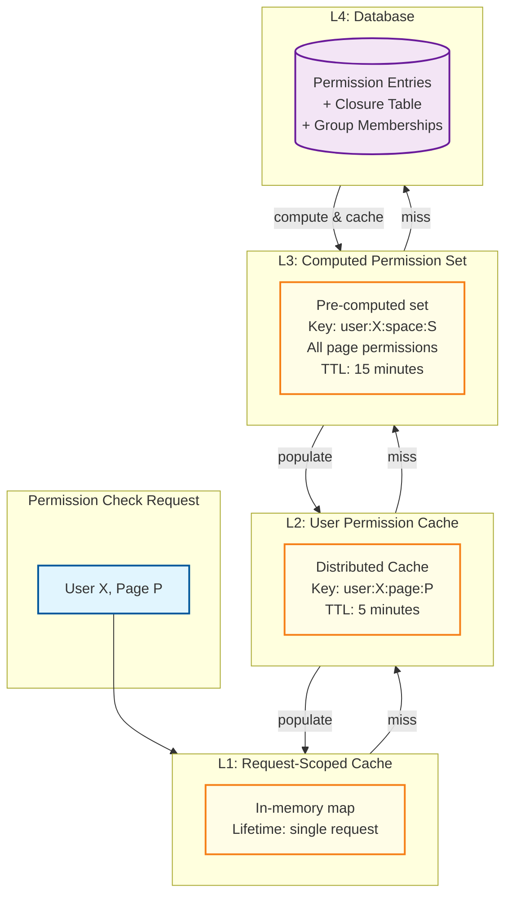
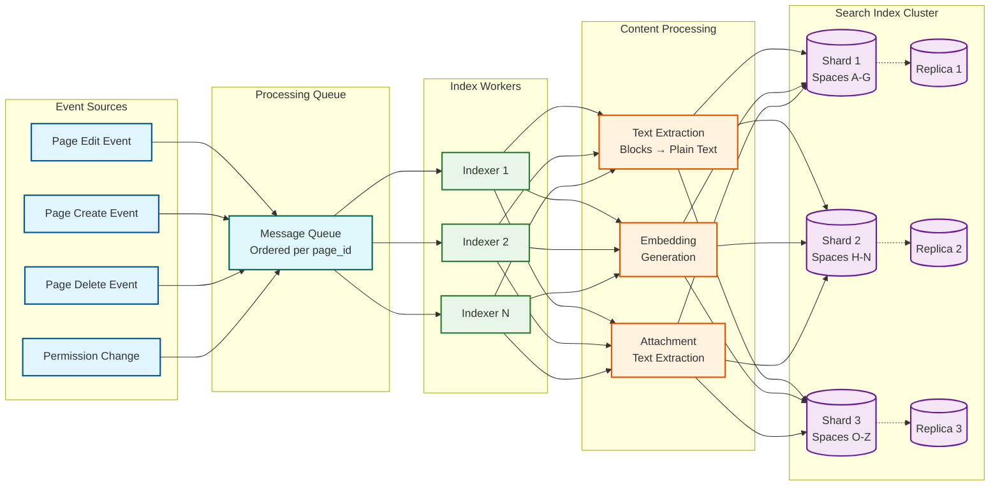
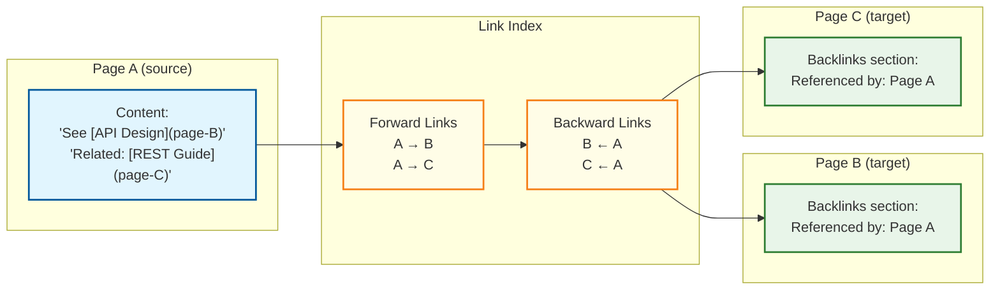
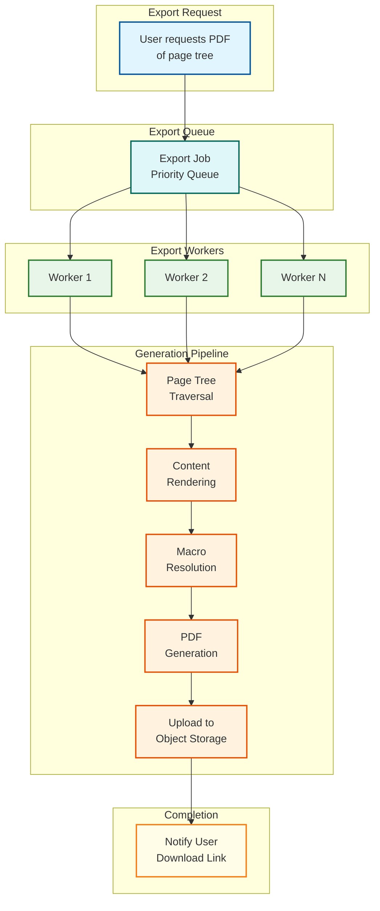

# Deep Dive & Bottlenecks

## 1. Hierarchy Operations at Scale

### Subtree Move

Moving a page (and its entire subtree) to a new parent is the most expensive hierarchy operation. It requires updating the closure table, invalidating caches, updating search index entries, and re-evaluating permissions for every page in the subtree.

```
PSEUDOCODE: Subtree Move with Full Side-Effect Handling

FUNCTION move_subtree(page_id, new_parent_id, new_position):
    // Phase 1: Validation
    IF page_id == new_parent_id:
        RAISE "Cannot move page under itself"

    IF is_descendant(new_parent_id, page_id):
        RAISE "Cannot create cycle: target is a descendant of source"

    old_parent_id = get_parent(page_id)
    IF old_parent_id == new_parent_id:
        // Just a reorder within same parent
        reorder_siblings(page_id, new_parent_id, new_position)
        RETURN

    // Phase 2: Get subtree metadata before move
    subtree_ids = get_all_descendants(page_id)  // Includes page_id itself
    subtree_size = len(subtree_ids)
    old_space_id = get_space_id(page_id)
    new_space_id = get_space_id(new_parent_id)
    cross_space = (old_space_id != new_space_id)

    // Phase 3: Execute move in transaction
    BEGIN TRANSACTION
        // Update closure table (see LLD for algorithm)
        update_closure_table(page_id, new_parent_id)

        // Update adjacency
        UPDATE pages SET parent_id = new_parent_id,
                        position = new_position
               WHERE id = page_id

        // If cross-space move, update space_id for entire subtree
        IF cross_space:
            UPDATE pages SET space_id = new_space_id WHERE id IN (subtree_ids)

        // Reorder siblings at both old and new parent
        recompact_positions(old_parent_id)
        recompact_positions(new_parent_id)
    COMMIT

    // Phase 4: Cascade side effects (async via message queue)
    emit_event("subtree_moved", {
        page_id: page_id,
        subtree_ids: subtree_ids,
        old_parent: old_parent_id,
        new_parent: new_parent_id,
        cross_space: cross_space
    })

    // Side effects handled by event consumers:
    // 1. Invalidate permission cache for all subtree pages
    // 2. Re-index all subtree pages in search (space_id changed, breadcrumbs changed)
    // 3. Invalidate breadcrumb cache for all subtree pages
    // 4. Update page tree cache for both old and new space
    // 5. Create audit log entries
    // 6. Notify watchers of moved pages
    // 7. If cross-space: re-evaluate permissions under new space defaults
```

**Bottleneck analysis**: For a subtree of 1,000 pages at average depth 5:
- Closure table: ~5,000 rows deleted, ~5,000 rows inserted
- Permission cache: 1,000 invalidations
- Search re-index: 1,000 documents updated
- Total time: 2-10 seconds (acceptable as background task; UI shows immediate move with eventual consistency for side effects)

### Delete with Orphan Handling

```
PSEUDOCODE: Page Deletion Strategies

FUNCTION delete_page(page_id, strategy, user_id):
    page = get_page(page_id)
    children = get_children(page_id)

    SWITCH strategy:
        CASE "soft_delete":
            // Mark as deleted; keep in DB for recovery
            UPDATE pages SET status = 'deleted', deleted_at = now(), deleted_by = user_id
            WHERE id = page_id
            // Children become orphans → reparent to grandparent
            FOR child IN children:
                move_page(child.id, page.parent_id)
            // Remove from search index
            search_index.delete(page_id)
            // Mark inbound links as broken
            mark_inbound_links_broken(page_id)

        CASE "cascade_delete":
            // Delete page and all descendants
            subtree = get_all_descendants(page_id)
            FOR sub_page_id IN subtree:
                UPDATE pages SET status = 'deleted', deleted_at = now()
                WHERE id = sub_page_id
                search_index.delete(sub_page_id)
                mark_inbound_links_broken(sub_page_id)

        CASE "archive":
            // Move to archive space (preserves content, removes from active tree)
            archive_space = get_or_create_archive_space(page.space_id)
            move_subtree(page_id, archive_space.root_page_id)
            UPDATE pages SET status = 'archived' WHERE id = page_id

    // All strategies: emit event for audit, notification, cleanup
    emit_event("page_deleted", {
        page_id: page_id,
        strategy: strategy,
        actor: user_id
    })
```

### Deep Nesting Limits

**Problem**: Unlimited nesting depth creates performance issues:
- Closure table grows as O(n * depth), so a tree with depth 50 has massive closure overhead
- Permission inheritance walks up to 50 levels (though cached, cold cache is expensive)
- Breadcrumbs become unwieldy in UI

**Solution**: Enforce a practical depth limit.

| Limit | Rationale |
|-------|-----------|
| Hard limit: 15 levels | Beyond 15 levels, information architecture is broken---pages should be reorganized |
| Soft warning: 8 levels | UI warns that content may be hard to discover |
| Performance budget: <10ms for breadcrumb computation at any depth | Closure table guarantees this |

---

## 2. Permission Computation: The Cache Challenge

### The Problem

Every page load, every search result, and every API call requires a permission check. At 3,500 page views/sec (peak), the permission engine must evaluate permissions at >3,500 checks/sec. Each check potentially involves:
- User → group membership lookup (user may be in 20+ groups)
- Page → ancestor chain lookup (page may be 10+ levels deep)
- Multiple permission entries at each level

Without caching, this is ~10 DB queries per permission check = 35,000 queries/sec just for permissions.

### Cache Architecture



### Cache Invalidation Strategy

```
PSEUDOCODE: Permission Cache Invalidation

FUNCTION on_permission_change(target_id, target_type):
    IF target_type == "space":
        // Space permission changed → invalidate all users' caches for this space
        // This is the nuclear option but space permissions change rarely
        space_id = target_id
        cache.delete_pattern(f"perm:*:space:{space_id}:*")

        // Incrementally: only invalidate affected principal's cache
        affected_principals = get_changed_principals(target_id)
        FOR principal_id IN affected_principals:
            users = expand_principal_to_users(principal_id)
            FOR user_id IN users:
                cache.delete_pattern(f"perm:{user_id}:space:{space_id}:*")

    ELSE IF target_type == "page":
        // Page permission changed → invalidate this page + all descendants
        page_id = target_id
        space_id = get_space_id(page_id)
        descendants = get_all_descendants(page_id)

        affected_principals = get_changed_principals(target_id)
        FOR principal_id IN affected_principals:
            users = expand_principal_to_users(principal_id)
            FOR user_id IN users:
                FOR desc_id IN descendants:
                    cache.delete(f"perm:{user_id}:page:{desc_id}")


FUNCTION on_group_membership_change(group_id, user_id, action):
    // User added/removed from group → invalidate all their permission caches
    cache.delete_pattern(f"perm:{user_id}:*")
    // This is safe (just causes re-computation) and correct
```

### Permission Cache Trade-offs

| Strategy | Cache Hit Rate | Invalidation Cost | Correctness Risk |
|----------|---------------|-------------------|-----------------|
| **No cache** | N/A | N/A | Perfect | Too slow (10ms+ per check) |
| **Short TTL (1 min)** | ~80% | Low (TTL-based) | 1-min stale window | Good for most cases |
| **Event-driven invalidation** (Chosen) | ~95% | Medium (targeted) | Momentary staleness | Best balance |
| **Pre-computed permission sets** | ~99% | High (recompute on change) | Risk of stale sets | Best for read perf |

**Chosen**: Event-driven invalidation with 5-minute TTL as safety net. Permission changes emit events that invalidate specific cache entries. The TTL ensures any missed invalidation self-corrects within 5 minutes.

---

## 3. Concurrent Editing: Conflict Resolution

### Last-Write-Wins with Block-Level Merge

```
PSEUDOCODE: Concurrent Edit Handling

FUNCTION save_page_with_conflict_resolution(page_id, new_blocks, base_version, user_id):
    current = get_current_version(page_id)

    IF current.version_number == base_version:
        // No conflict: save directly
        save_page(page_id, new_blocks, user_id, base_version)
        RETURN {status: "saved"}

    // Conflict detected: base_version is stale
    // Attempt automatic block-level merge
    base_content = reconstruct_at_version(page_id, base_version)
    current_content = current.blocks
    user_content = new_blocks

    merge_result = three_way_block_merge(base_content, current_content, user_content)

    IF merge_result.has_conflicts:
        // Cannot auto-merge: return conflict to user
        RETURN {
            status: "conflict",
            base: base_content,
            theirs: current_content,
            yours: user_content,
            auto_merged: merge_result.merged_blocks,
            conflicts: merge_result.conflict_blocks
        }
    ELSE:
        // Auto-merge successful
        save_page(page_id, merge_result.merged_blocks, user_id, current.version_number)
        RETURN {status: "auto_merged"}


FUNCTION three_way_block_merge(base, theirs, ours):
    result = {merged_blocks: [], conflict_blocks: [], has_conflicts: false}

    base_map = {block.id: block FOR block IN flatten(base)}
    their_map = {block.id: block FOR block IN flatten(theirs)}
    our_map = {block.id: block FOR block IN flatten(ours)}

    all_block_ids = union(base_map.keys(), their_map.keys(), our_map.keys())

    FOR block_id IN all_block_ids:
        base_block = base_map.get(block_id)
        their_block = their_map.get(block_id)
        our_block = our_map.get(block_id)

        IF base_block == their_block:
            // They didn't change it: take our version
            result.merged_blocks.append(our_block OR base_block)
        ELSE IF base_block == our_block:
            // We didn't change it: take their version
            result.merged_blocks.append(their_block OR base_block)
        ELSE IF their_block == our_block:
            // Both made the same change: take either
            result.merged_blocks.append(their_block)
        ELSE IF base_block IS NULL:
            // New block: both added different blocks (no conflict, add both)
            result.merged_blocks.append(their_block)
            result.merged_blocks.append(our_block)
        ELSE:
            // Both modified the same block differently: CONFLICT
            result.conflict_blocks.append({
                block_id: block_id,
                base: base_block,
                theirs: their_block,
                ours: our_block
            })
            result.has_conflicts = true

    RETURN result
```

### When to Upgrade to Real-Time Co-Editing

| Signal | Threshold | Action |
|--------|-----------|--------|
| Conflict rate | >5% of saves result in conflicts | Consider CRDT/OT for affected spaces |
| Concurrent editors | >3 simultaneous editors per page regularly | Enable real-time mode |
| User feedback | Frequent complaints about lost edits | Prioritize co-editing feature |
| Page type | Meeting notes, incident response | Enable co-editing by default for these templates |

---

## 4. Search at Scale: 500M+ Pages

### Indexing Pipeline



### Search Ranking: Multi-Signal Scoring

```
PSEUDOCODE: Search Relevance Scoring

FUNCTION compute_score(query, document):
    // 1. Text relevance (BM25-based)
    title_score = bm25(query, document.title) * 3.0        // Title boost
    heading_score = bm25(query, document.headings) * 2.0   // Heading boost
    content_score = bm25(query, document.content) * 1.0    // Body match
    text_score = max(title_score, heading_score, content_score)

    // 2. Recency boost (exponential decay)
    days_since_update = (now() - document.updated_at).days
    recency_score = exp(-0.01 * days_since_update)  // Half-life ~70 days

    // 3. Popularity boost (logarithmic)
    popularity_score = log(1 + document.view_count) / 10.0

    // 4. Semantic similarity (if AI search enabled)
    query_embedding = get_or_compute_embedding(query)
    semantic_score = cosine_similarity(query_embedding, document.embedding)

    // 5. Personalization (user's space affinity)
    space_affinity = get_user_space_affinity(current_user, document.space_id)

    // Weighted combination
    final_score = (
        0.50 * text_score +
        0.15 * recency_score +
        0.10 * popularity_score +
        0.15 * semantic_score +
        0.10 * space_affinity
    )

    RETURN final_score
```

### Real-Time vs Near-Real-Time Index Updates

| Approach | Index Lag | Throughput | Resource Cost | Chosen For |
|----------|----------|-----------|---------------|-----------|
| **Synchronous** (index on save) | 0s | Low (blocks save path) | High (every save waits) | Never for KMS scale |
| **Near-real-time** (queue + batch) | 5-30s | High | Moderate | Default mode |
| **Scheduled refresh** | 1-60 min | Very high | Low | Bulk re-indexing |

**Decision**: Near-real-time with a target of <30 seconds. Page save emits an event; indexer workers process events in batches (every 5 seconds) for throughput efficiency.

### Search Cluster Sizing

```
500M pages x 20KB avg content = 10 TB raw content
Inverted index overhead: 1.5x = 15 TB index size
Vector embeddings: 500M x 768 dimensions x 4 bytes = 1.5 TB

Total index size: ~17 TB
Per shard (12 shards): ~1.4 TB
With 1 replica: 24 shard instances x 1.4 TB = ~34 TB total storage

Query throughput: 1,050 queries/sec peak
Per shard: ~88 queries/sec (easily handled by SSD-backed nodes)
```

---

## 5. Content at Scale: Macro Rendering

### The Macro Problem

Wiki pages embed dynamic content (macros) that must render at view time:

| Macro Type | Rendering Cost | Cacheability | Example |
|-----------|---------------|-------------|---------|
| Table of Contents | O(page blocks) | Cacheable (invalidate on page edit) | Auto-generated from headings |
| Include Page | O(included page size) | Cacheable (invalidate on source edit) | Embed another page inline |
| Status Badge | O(1) external API call | Short TTL cache | Show Jira ticket status |
| Recently Updated | O(n log n) DB query | Cacheable (30s TTL) | List of recent pages in space |
| User Profile | O(1) lookup | Cacheable | Show user card on hover |
| Code Snippet | O(1) syntax highlighting | Cacheable (immutable after save) | Highlighted code block |

### Macro Rendering Strategy

```
PSEUDOCODE: Lazy Macro Evaluation

FUNCTION render_page(page_id, user_id):
    page = get_page_content(page_id)  // Cached
    rendered_blocks = []

    FOR block IN page.blocks:
        IF block.type == "macro":
            // Check macro render cache
            cache_key = f"macro:{block.attrs.macroId}:{hash(block.attrs.params)}:{page_id}"
            cached = cache.get(cache_key)

            IF cached AND NOT is_stale(cached, block.attrs.macroId):
                rendered_blocks.append(cached)
            ELSE:
                // Evaluate macro
                rendered = evaluate_macro(block, page_id, user_id)
                ttl = get_macro_ttl(block.attrs.macroId)
                cache.set(cache_key, rendered, ttl=ttl)
                rendered_blocks.append(rendered)
        ELSE:
            rendered_blocks.append(block)

    RETURN rendered_blocks


FUNCTION evaluate_macro(macro_block, page_id, user_id):
    SWITCH macro_block.attrs.macroId:
        CASE "toc":
            headings = extract_headings(get_page_content(page_id).blocks)
            RETURN generate_toc_block(headings)

        CASE "include":
            included_page_id = macro_block.attrs.params.page_id
            // Permission check: user must have VIEW on included page
            IF NOT has_permission(user_id, included_page_id, VIEWER):
                RETURN permission_denied_placeholder()
            RETURN get_page_content(included_page_id).blocks

        CASE "children":
            children = get_children(page_id)
            RETURN generate_children_list(children)

        CASE "recently_updated":
            space_id = macro_block.attrs.params.space_id OR get_space_id(page_id)
            pages = get_recently_updated(space_id, limit=10)
            RETURN generate_page_list(pages)

        CASE "status":
            // External integration
            issue_key = macro_block.attrs.params.issue_key
            status = external_api.get_issue_status(issue_key)  // Cached externally
            RETURN generate_status_badge(status)
```

**Key insight**: Macros are rendered lazily at view time, not at save time. This means:
- The saved page content contains macro definitions (type + params), not rendered output
- Search indexes the macro parameters but not the rendered output (unless explicitly configured)
- Each user may see a different rendering (e.g., permission-filtered includes)
- Macro rendering adds 10-50ms to page load (cached) or 100-500ms (uncached)

---

## 6. Backlink Graph: Consistency Challenges

### Forward/Backward Link Maintenance



### Broken Link Detection

```
PSEUDOCODE: Broken Link Management

FUNCTION detect_broken_links(page_id):
    outbound_links = get_forward_links(page_id)
    broken = []

    FOR link IN outbound_links:
        target = get_page_status(link.target_page_id)
        IF target IS NULL OR target.status == 'deleted':
            broken.append({
                source_page: page_id,
                target_page: link.target_page_id,
                link_text: link.link_text,
                block_id: link.block_id
            })

    RETURN broken


FUNCTION on_page_rename(page_id, old_title, new_title):
    // Links use page_id internally, so they don't break on rename
    // But update the link_text for display purposes
    UPDATE page_links
    SET link_text = new_title
    WHERE target_page_id = page_id
      AND link_text = old_title  // Only update auto-generated link text


FUNCTION periodic_broken_link_scan():
    // Batch job: scan all links for broken targets
    broken_links = SELECT pl.source_page_id, pl.target_page_id, pl.link_text
                   FROM page_links pl
                   LEFT JOIN pages p ON p.id = pl.target_page_id
                   WHERE p.id IS NULL OR p.status = 'deleted'

    // Notify page authors
    FOR link IN broken_links:
        author = get_page_author(link.source_page_id)
        notify(author, "Page '{link.link_text}' linked from your page no longer exists")

    // Update link status
    UPDATE page_links SET is_broken = true
    WHERE (source_page_id, target_page_id) IN (broken_links)
```

---

## 7. AI-Powered Features

### Page Summarization

```
PSEUDOCODE: AI Summary Generation

FUNCTION generate_page_summary(page_id):
    content = get_page_content(page_id)
    plain_text = extract_plain_text(content.blocks)

    // Check cache
    cache_key = f"summary:{page_id}:{content.updated_at}"
    cached = cache.get(cache_key)
    IF cached:
        RETURN cached

    // Truncate to model context window
    IF len(plain_text) > 8000:
        // Use headings + first paragraphs for structure-aware truncation
        plain_text = structure_aware_truncate(content.blocks, max_chars=8000)

    summary = llm.generate(
        prompt = "Summarize this wiki page in 2-3 sentences: " + plain_text,
        max_tokens = 150,
        temperature = 0.3
    )

    cache.set(cache_key, summary, ttl=3600)  // Cache for 1 hour
    RETURN summary
```

### Related Page Recommendations

```
PSEUDOCODE: Content-Based Page Recommendations

FUNCTION get_related_pages(page_id, user_id, limit=5):
    // Get page embedding
    page_embedding = get_or_compute_embedding(page_id)

    // Find nearest neighbors in vector space
    candidates = vector_search(
        embedding = page_embedding,
        space_filter = get_user_accessible_spaces(user_id),
        exclude = [page_id],
        limit = limit * 3  // Over-fetch for permission filtering
    )

    // Permission filter
    permitted = batch_permission_check(user_id, [c.page_id FOR c IN candidates])
    accessible = [c FOR c IN candidates IF permitted[c.page_id] >= VIEWER]

    // Diversify: avoid too many results from same space
    diversified = diversify_by_space(accessible, max_per_space=2)

    RETURN diversified[:limit]
```

### Semantic Search Integration

```
PSEUDOCODE: Hybrid Keyword + Semantic Search

FUNCTION hybrid_search(query, user_id, filters):
    // Run keyword and semantic search in parallel
    PARALLEL:
        keyword_results = keyword_search(query, filters, limit=30)
        semantic_results = semantic_search(query, filters, limit=30)

    // Reciprocal Rank Fusion to combine results
    combined = reciprocal_rank_fusion(
        result_lists = [keyword_results, semantic_results],
        weights = [0.6, 0.4],  // Keyword slightly preferred for exact matches
        k = 60  // RRF constant
    )

    // Permission filter
    permitted = batch_permission_check(user_id, [r.page_id FOR r IN combined])
    filtered = [r FOR r IN combined IF permitted[r.page_id] >= VIEWER]

    RETURN filtered[:20]
```

---

## 8. Export at Scale

### PDF Generation Pipeline



### Export Bottlenecks and Mitigations

| Bottleneck | Impact | Mitigation |
|-----------|--------|-----------|
| Large page tree (1000+ pages) | Memory + CPU for PDF generation | Stream pages; generate per-page PDFs then merge |
| Macro resolution | External API calls per macro | Pre-cache macro outputs; timeout per macro |
| Image embedding | Large attachments inline in PDF | Compress images; limit resolution |
| Concurrent exports | Worker pool exhaustion | Queue with priority; limit concurrent exports per user |
| Cross-page links in PDF | Internal links must map to PDF page numbers | Two-pass: collect links first, resolve on second pass |

---

## Summary: Bottleneck Severity Matrix

| Bottleneck | Frequency | Impact | Mitigation Complexity | Priority |
|-----------|-----------|--------|----------------------|----------|
| Permission computation at scale | Every request | High (correctness + latency) | High (cache invalidation is hard) | P0 |
| Search across 500M pages | Every search query | High (relevance + latency) | Medium (well-understood scaling) | P0 |
| Subtree move operations | Rare (weekly per space) | Medium (brief inconsistency) | Medium (async side effects) | P1 |
| Concurrent edit conflicts | ~5% of edits | Medium (user frustration) | Low (3-way merge) | P1 |
| Macro rendering chain | Popular pages | Medium (latency spike) | Low (aggressive caching) | P2 |
| Broken link accumulation | Gradual | Low (informational) | Low (batch scan) | P2 |
| AI feature latency | AI-enabled searches | Medium (perceived slowness) | Medium (async + cache) | P2 |
| Export at scale | Infrequent | Low (async/queued) | Low (worker pool) | P3 |
