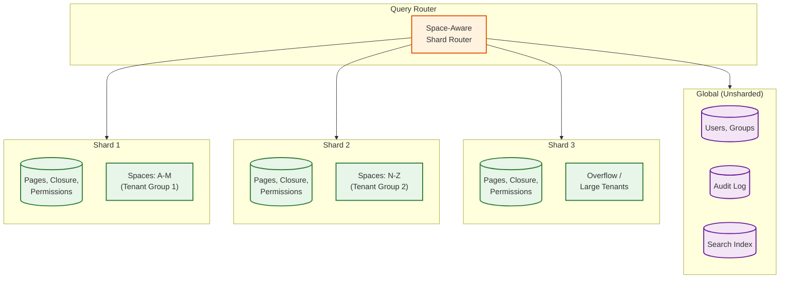
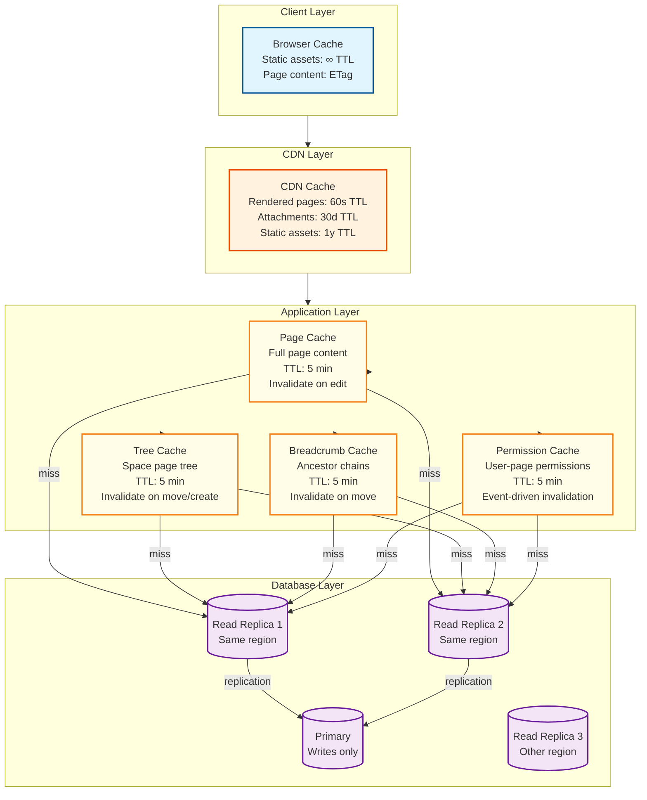
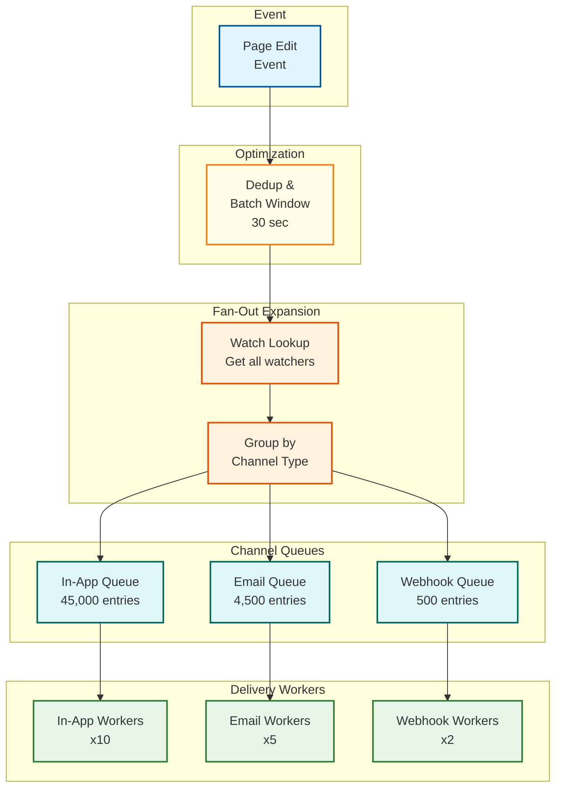
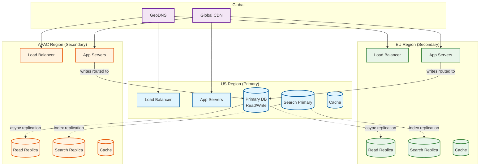

# Scalability & Reliability

## Scaling Strategy Overview

A KMS is fundamentally a **read-heavy** system with a 10:1 to 50:1 read-to-write ratio. The scaling strategy must optimize for:
1. Fast page reads (content + permissions + breadcrumbs in <200ms)
2. Fast search (sub-second across 500M+ pages)
3. Reliable permission enforcement (correct + fast on every request)
4. Graceful handling of write-side complexity (hierarchy operations, version management)

---

## 1. Space-Based Sharding

### Data Locality Principle

Pages within a space are almost always accessed together (page tree navigation, space-scoped search, permission evaluation within a space). Sharding by `space_id` co-locates related data.



### Sharding Decisions

| Data | Shard Key | Rationale |
|------|-----------|-----------|
| Pages + Content | `space_id` | Tree operations are space-local |
| Page Closure | Co-located with pages | Ancestor queries need page data |
| Permissions | Co-located with target entity | Permission checks are space-scoped |
| Versions | Co-located with pages | Version access follows page access |
| Links | `source_page_id` (co-located) | Forward links accessed with source page |
| Search Index | `space_id` (shard per space group) | Space-scoped search is most common |
| Users + Groups | Global (unsharded) | Cross-space entity; relatively small |
| Audit Log | Time-partitioned (not space-sharded) | Compliance queries span all spaces |

### Hotspot Prevention

| Scenario | Problem | Solution |
|----------|---------|----------|
| Very large space (100K+ pages) | Single shard overloaded | Dedicated shard for large tenants; sub-space sharding |
| Viral page (company announcement) | Read thundering herd | CDN + cache + read replicas absorb reads |
| Bulk import (migration) | Write spike on one shard | Rate-limited import queue; off-peak scheduling |
| Cross-space search | Fan-out to all shards | Global search index (separate from page DB shards) |

---

## 2. Read-Heavy Workload Optimization

### Multi-Layer Caching



### Cache Effectiveness Projections

| Cache Layer | Expected Hit Rate | Latency (Hit) | Latency (Miss) |
|------------|-------------------|---------------|-----------------|
| Browser cache (ETag) | 30% (return visits) | 0ms (304 response) | N/A |
| CDN | 60% (popular pages) | 5-10ms | Falls through to app |
| Page content cache | 90% (hot pages) | 1-2ms | Falls through to DB |
| Permission cache | 95% (user-space pair) | 0.5ms | 5-10ms (compute) |
| Breadcrumb cache | 95% (space tree) | 0.5ms | 2-5ms (closure query) |

### Cache Warming Strategy

```
PSEUDOCODE: Proactive Cache Warming

FUNCTION warm_caches_on_startup():
    // Warm permission caches for most active users
    active_users = get_most_active_users(limit=10000)
    FOR user IN active_users:
        spaces = get_user_spaces(user.id)
        FOR space IN spaces:
            precompute_permission_set(user.id, space.id)

    // Warm page tree caches for most accessed spaces
    popular_spaces = get_most_accessed_spaces(limit=1000)
    FOR space IN popular_spaces:
        compute_and_cache_page_tree(space.id)

    // Warm page content caches for most viewed pages
    popular_pages = get_most_viewed_pages(limit=50000)
    FOR page IN popular_pages:
        cache_page_content(page.id)


FUNCTION warm_cache_on_login(user_id):
    // When user logs in, pre-warm their permission cache
    spaces = get_user_spaces(user_id)
    FOR space IN spaces:
        // Async: don't block login
        async precompute_permission_set(user_id, space.id)
```

---

## 3. Search Cluster Scaling

### Horizontal Sharding

```
Search Index: 15 TB total
12 primary shards + 12 replica shards = 24 shard instances
Each shard: ~1.25 TB

Query routing:
- Space-scoped search → route to specific shard(s)
- Global search → fan out to all shards, merge results

Shard allocation:
- Shards assigned by space_id hash
- Large spaces may span multiple shards
- Small spaces grouped on shared shards
```

### Search Scaling Mechanisms

| Mechanism | Purpose | Impact |
|-----------|---------|--------|
| **Shard replicas** | Read throughput + fault tolerance | 2x read capacity per replica |
| **Query caching** | Repeated searches return instantly | 30-50% of searches are repeats |
| **Field data caching** | Facet computation cached in memory | Reduces facet overhead by 90% |
| **Index warming** | New replica warmed before serving traffic | Zero cold-start latency |
| **Segment merging** | Compact index segments | Reduce I/O, improve query speed |
| **Tiered storage** | Hot segments on SSD, cold on HDD | Cost-efficient for old content |

### Search Degradation Strategy

Under heavy load, gracefully degrade search quality:

| Load Level | Response | User Impact |
|-----------|----------|-------------|
| Normal (<70% capacity) | Full ranking, facets, snippets, semantic | Full experience |
| High (70-85%) | Disable semantic search, reduce snippet length | Slightly less relevant results |
| Critical (85-95%) | Disable facets, reduce result count | Faster but basic results |
| Emergency (>95%) | Cache-only results, reject new queries with retry-after | Stale results or temporary unavailability |

---

## 4. Notification Fan-Out

### The Problem

A popular space (e.g., "Company Announcements") may have 50,000 watchers. When a page is edited, all watchers need notifications. Generating 50,000 notifications synchronously would take minutes and block the write path.

### Fan-Out Architecture



### Notification Optimization

| Optimization | Description | Impact |
|-------------|-------------|--------|
| **Batch window** | Aggregate multiple edits within 30s into single notification | 70% reduction in notification volume during active editing |
| **Channel dedup** | User watches page AND space → one notification, not two | 20% reduction |
| **Rate limiting** | Max 1 notification per page per user per 5 minutes | Prevents spam during bulk edits |
| **Mute hours** | User-configured quiet hours → queue and deliver later | Better user experience |
| **Priority levels** | @mentions = high priority; page edits = normal; space activity = low | Ensures important notifications aren't lost |

---

## 5. Page Hierarchy Cache

### Pre-Computed Structures

| Structure | Computation | Cache Size | Invalidation Trigger |
|-----------|------------|-----------|---------------------|
| **Space page tree** | Full tree of all pages in space with title, status, depth | 50KB-5MB per space | Page create, delete, move, rename |
| **Breadcrumb paths** | Ancestor chain for each page | 200 bytes per page | Page move, rename, delete |
| **Sibling order** | Ordered list of children per parent | 1KB per parent | Page create, delete, move, reorder |

### Space Tree Cache Strategy

```
PSEUDOCODE: Space Page Tree Cache

FUNCTION get_space_tree(space_id):
    cache_key = f"space_tree:{space_id}"
    cached = cache.get(cache_key)

    IF cached:
        RETURN cached

    // Build tree from database
    pages = SELECT id, title, parent_id, position, status, updated_at
            FROM pages
            WHERE space_id = space_id AND status = 'published'
            ORDER BY parent_id, position

    tree = build_tree_structure(pages)

    cache.set(cache_key, tree, ttl=300)  // 5-minute TTL
    RETURN tree


FUNCTION invalidate_space_tree(space_id):
    cache.delete(f"space_tree:{space_id}")
    // Also invalidate all breadcrumb caches in this space
    cache.delete_pattern(f"breadcrumb:*:space:{space_id}")


FUNCTION build_tree_structure(pages):
    // Build in-memory tree from flat page list
    root = null
    nodes = {}

    FOR page IN pages:
        nodes[page.id] = {
            id: page.id,
            title: page.title,
            children: [],
            depth: 0
        }

    FOR page IN pages:
        IF page.parent_id IS NULL:
            root = nodes[page.id]
        ELSE:
            parent = nodes.get(page.parent_id)
            IF parent:
                parent.children.append(nodes[page.id])
                nodes[page.id].depth = parent.depth + 1

    RETURN root
```

---

## 6. Multi-Region Deployment

### Architecture



### Multi-Region Trade-offs

| Concern | Approach | Trade-off |
|---------|----------|-----------|
| **Read latency** | Read from local region replica | 10ms local vs 200ms cross-region |
| **Write latency** | Route writes to primary region | 200ms for non-primary region users |
| **Consistency** | Async replication (100-500ms lag) | Reads may be slightly stale after write |
| **Data residency** | Tenant-level region pinning | Reduces multi-region read benefit for pinned tenants |
| **Failover** | Promote replica to primary | 30-60 seconds of write unavailability |

### Read-After-Write Consistency

For non-primary regions, a user who saves a page needs to see their own changes immediately, even if the read replica hasn't caught up yet:

```
PSEUDOCODE: Read-After-Write for Multi-Region

FUNCTION read_page(page_id, user_id):
    // Check if user recently wrote to this page
    last_write = cache.get(f"recent_write:{user_id}:{page_id}")

    IF last_write AND last_write.timestamp > (now() - 5_seconds):
        // Route to primary to guarantee seeing own write
        RETURN read_from_primary(page_id)
    ELSE:
        // Safe to read from local replica
        RETURN read_from_local_replica(page_id)

FUNCTION write_page(page_id, user_id, content):
    result = write_to_primary(page_id, content)
    cache.set(f"recent_write:{user_id}:{page_id}", {timestamp: now()}, ttl=10)
    RETURN result
```

---

## 7. Disaster Recovery

### Backup Strategy

| Data | Backup Method | Frequency | Retention | RTO | RPO |
|------|-------------|-----------|-----------|-----|-----|
| Primary DB | Continuous WAL archival + daily snapshots | Continuous | 30 days | 1 hour | 0 (point-in-time) |
| Search Index | Snapshot to object storage | Daily | 7 days | 4 hours (rebuild) | 24 hours |
| Object Storage | Cross-region replication | Continuous | Indefinite | 0 (multi-region) | 0 |
| Audit Log | Cross-region replication | Continuous | Per compliance (3-7 years) | 1 hour | 0 |
| Cache | No backup (ephemeral) | N/A | N/A | Minutes (cold start) | N/A |

### Search Index Rebuild Strategy

If the search index is lost, it can be rebuilt from the primary database:

```
PSEUDOCODE: Search Index Rebuild

FUNCTION rebuild_search_index():
    // Phase 1: Create new empty index with current mapping
    new_index = create_index("pages_v2", mapping=current_schema)

    // Phase 2: Stream all pages from DB to index
    batch_size = 1000
    offset = 0

    WHILE true:
        pages = SELECT p.id, p.title, p.space_id, pc.blocks, pc.plain_text,
                       p.creator_id, p.updated_at
                FROM pages p
                JOIN page_content pc ON pc.page_id = p.id
                WHERE p.status = 'published'
                ORDER BY p.id
                LIMIT batch_size OFFSET offset

        IF pages IS EMPTY:
            BREAK

        batch = []
        FOR page IN pages:
            doc = build_search_document(page)
            batch.append(doc)

        new_index.bulk_index(batch)
        offset += batch_size

    // Phase 3: Generate embeddings (can be done async / in parallel)
    generate_embeddings_batch(new_index)

    // Phase 4: Atomic swap
    swap_index_alias("pages", old="pages_v1", new="pages_v2")

    // Phase 5: Delete old index
    delete_index("pages_v1")

// Estimated time for 500M pages:
// 500M / 1000 batch = 500K batches
// At 100 batches/sec = ~83 minutes
// With 10 parallel workers = ~8 minutes for indexing
// Embedding generation: 500M pages at 100/sec = ~58 days (use pre-computed)
// Total: 1-4 hours (without re-computing embeddings)
```

### Failure Scenarios and Recovery

| Scenario | Detection | Automated Response | Manual Escalation |
|----------|-----------|-------------------|-------------------|
| Single DB node failure | Health check (5s) | Failover to replica (30s) | N/A |
| Full primary region outage | GeoDNS health (30s) | Promote secondary region | Confirm data consistency |
| Search cluster degradation | Latency alarm | Add nodes, shed load | Trigger index rebuild |
| Cache cluster failure | Connection errors | Fall through to DB; auto-warm | Scale up DB read replicas |
| Object storage partial failure | 5xx errors on attachments | Retry from replica region | Provider escalation |
| Corruption in page data | Integrity checks (hourly) | Restore from WAL/snapshot | Identify blast radius |

---

## 8. Autoscaling

### Scaling Triggers

| Component | Scale-Up Signal | Scale-Down Signal | Min/Max Instances |
|-----------|----------------|-------------------|-------------------|
| Page Service | CPU > 70% for 3 min | CPU < 30% for 10 min | 10 / 100 |
| Search Query Nodes | Query latency p99 > 500ms | Latency p99 < 100ms for 15 min | 6 / 50 |
| Export Workers | Queue depth > 100 | Queue empty for 5 min | 2 / 30 |
| AI Processing | Queue depth > 50 | Queue empty for 10 min | 2 / 20 |
| Notification Workers | Queue depth > 10,000 | Queue depth < 100 for 5 min | 3 / 20 |
| Search Indexers | Index lag > 60s | Index lag < 5s for 5 min | 3 / 15 |

### Predictive Scaling

```
PSEUDOCODE: Time-Based Predictive Scaling

FUNCTION predict_required_capacity(service, time):
    // Use historical patterns for workday scaling
    day_of_week = time.weekday()
    hour = time.hour
    timezone_peak = is_business_hours(time, primary_timezone)

    // Historical baseline
    baseline = get_historical_capacity(service, day_of_week, hour)

    // Scale factor based on user growth
    growth_factor = get_monthly_growth_rate(service)

    // Special events (all-hands, product launch, fiscal year end)
    event_factor = get_known_event_multiplier(time)

    target = baseline * (1 + growth_factor) * event_factor

    // Pre-scale 15 minutes before predicted peak
    IF approaching_peak(time, service):
        target = target * 1.2  // 20% buffer

    RETURN ceil(target)
```

---

## Reliability Engineering

### Health Check Hierarchy

| Level | Check | Interval | Failure Action |
|-------|-------|----------|----------------|
| L1: Process | HTTP /health returns 200 | 5s | Restart container |
| L2: Dependencies | DB + Cache + Queue connectivity | 15s | Remove from load balancer |
| L3: Functional | Can read/write a test page | 60s | Alert on-call; investigate |
| L4: Business | Search results relevant; permissions correct | 5 min | Alert engineering team |

### Circuit Breaker Configuration

| Dependency | Failure Threshold | Reset Timeout | Fallback |
|-----------|-------------------|---------------|----------|
| Primary DB | 5 failures in 10s | 30s | Read from replica; queue writes |
| Search Cluster | 3 failures in 10s | 15s | Serve cached results; basic DB search |
| AI Service | 2 failures in 10s | 60s | Skip AI features; serve without summaries |
| Email Service | 10 failures in 60s | 120s | Queue for retry; in-app notification only |
| Export Service | 5 failures in 30s | 60s | Queue export for later; notify user |
