# Security & Compliance

## Authentication

### Authentication Architecture

```mermaid
flowchart LR
    subgraph Client["Client"]
        U[User Browser]
    end

    subgraph IdP["Identity Provider"]
        direction TB
        AD[Active Directory /<br/>LDAP]
        SAML[SAML 2.0<br/>Provider]
        OIDC[OIDC Provider<br/>OAuth 2.0]
    end

    subgraph Gateway["API Gateway"]
        direction TB
        TK[Token Validation<br/>JWT / Session]
        MFA[MFA Enforcement<br/>TOTP / WebAuthn]
        RL[Rate Limiter]
    end

    subgraph App["Application"]
        SS[Session Store<br/>Distributed Cache]
        AU[Auth Service<br/>User Resolution]
    end

    U -->|1. Login redirect| IdP
    IdP -->|2. SAML assertion / OIDC token| U
    U -->|3. Token exchange| Gateway
    Gateway -->|4. Validate token| IdP
    Gateway -->|5. Create session| App
    U -->|6. API calls with session| Gateway
    Gateway --> TK --> MFA --> RL --> AU
    AU --> SS

    classDef client fill:#e1f5fe,stroke:#01579b,stroke-width:2px
    classDef idp fill:#fff3e0,stroke:#e65100,stroke-width:2px
    classDef gateway fill:#e8f5e9,stroke:#2e7d32,stroke-width:2px
    classDef app fill:#f3e5f5,stroke:#6a1b9a,stroke-width:2px

    class U client
    class AD,SAML,OIDC idp
    class TK,MFA,RL gateway
    class SS,AU app
```



### Authentication Methods

| Method | Use Case | Configuration |
|--------|----------|---------------|
| **SAML 2.0** | Enterprise SSO (primary) | IdP metadata URL, SP assertion consumer URL, certificate |
| **OIDC / OAuth 2.0** | Cloud identity providers, social login | Client ID, secret, authorization/token endpoints |
| **LDAP / Active Directory** | On-premise directory integration | LDAP URL, bind DN, search base, group filter |
| **API Keys** | Service-to-service, automation | Key generation, scope restrictions, rotation policy |
| **Personal Access Tokens** | Developer API access | Token generation, scope, expiry |

### MFA Enforcement

| Policy | Trigger | Methods |
|--------|---------|---------|
| Required for all users | Org-wide policy | TOTP, WebAuthn, SMS (fallback) |
| Required for admins only | Role-based policy | TOTP, WebAuthn |
| Required for sensitive spaces | Space-level policy | Any configured method |
| Step-up for permission changes | Action-based | Re-authentication within 5 min |

### Session Management

| Property | Value | Rationale |
|----------|-------|-----------|
| Session duration | 8 hours (configurable) | Business day coverage |
| Idle timeout | 30 minutes (configurable) | Security vs convenience |
| Absolute timeout | 24 hours | Force re-authentication daily |
| Concurrent sessions | Unlimited (configurable) | Support multiple devices |
| Session revocation | Immediate via session store | Admin can kill any session |

---

## Authorization

### Role Hierarchy

```
SYSTEM ADMIN
    └── Can manage all spaces, users, global settings
        └── Audit log access, user management

SPACE ADMIN
    └── Full control within a space
        └── Manage space permissions, space settings, page tree

EDITOR (Space or Page level)
    └── Create and edit pages
        └── Manage own pages, create children, edit content

VIEWER (Space or Page level)
    └── Read-only access
        └── View pages, search, export

ANONYMOUS (Optional per space)
    └── Read-only without authentication
        └── View published pages only (no comments, no drafts)

NONE (Explicit deny)
    └── No access, overrides any grants at the same level
```

### Authorization Decision Flow

```
PSEUDOCODE: Authorization Decision

FUNCTION authorize(user, action, resource):
    // Step 1: System admin bypass
    IF is_system_admin(user):
        audit_log("admin_bypass", user, action, resource)
        RETURN ALLOW

    // Step 2: Space admin bypass (within their space)
    IF action != "delete_space" AND is_space_admin(user, resource.space_id):
        audit_log("space_admin_bypass", user, action, resource)
        RETURN ALLOW

    // Step 3: Evaluate permission (see LLD permission model)
    role = evaluate_permission(user.id, resource.id)

    // Step 4: Check if role allows action
    required_role = action_to_required_role(action)
    // action_to_required_role mapping:
    //   "view"           → VIEWER
    //   "edit"           → EDITOR
    //   "create_child"   → EDITOR
    //   "delete"         → EDITOR (own pages) or ADMIN (others' pages)
    //   "manage_perms"   → ADMIN
    //   "move"           → EDITOR (source and target)

    IF role >= required_role:
        RETURN ALLOW
    ELSE:
        audit_log("access_denied", user, action, resource)
        RETURN DENY


FUNCTION check_ip_restriction(user, request_ip, space_id):
    restrictions = get_ip_restrictions(space_id)
    IF restrictions IS EMPTY:
        RETURN ALLOW

    FOR rule IN restrictions:
        IF ip_in_cidr(request_ip, rule.cidr):
            RETURN ALLOW

    audit_log("ip_restricted", user, request_ip, space_id)
    RETURN DENY
```

### Permission Scenarios

| Scenario | Resolution | Rationale |
|----------|-----------|-----------|
| User in two groups: Group A = EDITOR on space, Group B = NONE on page | NONE (deny wins at page level) | Explicit deny overrides grants at same level |
| User = VIEWER on space, page has no override | VIEWER (inherited) | Space default propagates through tree |
| User = VIEWER on space, page grants EDITOR to user | EDITOR (override wins) | Page-level override takes precedence |
| User = EDITOR on parent page, child page restricts to group X (user not in X) | NONE (child restriction applies) | Nearest restriction in ancestor chain |
| Space admin, page restricted to group Y | ADMIN (bypass) | Space admins always have access within their space |
| Anonymous access on, user not logged in | VIEWER (if space allows) | Anonymous toggle is space-level setting |

---

## Permission Inheritance Model

### Inheritance Rules (Formal)

```
PSEUDOCODE: Permission Inheritance Computation

FUNCTION compute_effective_permission(user, page):
    // Walk from page up to space, collecting permission entries
    permission_chain = []

    // 1. Page-level permissions
    page_perms = get_permissions(page.id, "page", user)
    IF page_perms:
        permission_chain.append(("page", page.id, page_perms))

    // 2. Ancestor page permissions (nearest first)
    ancestors = get_ancestors(page.id)  // Nearest to farthest
    FOR ancestor IN ancestors:
        ancestor_perms = get_permissions(ancestor.id, "page", user)
        IF ancestor_perms:
            permission_chain.append(("page", ancestor.id, ancestor_perms))

    // 3. Space-level permissions
    space_perms = get_permissions(page.space_id, "space", user)
    IF space_perms:
        permission_chain.append(("space", page.space_id, space_perms))

    // Resolution: nearest explicit permission wins
    // If no explicit permission at any level → NONE
    IF permission_chain:
        RETURN permission_chain[0].role  // Nearest to page
    ELSE:
        RETURN NONE
```

### Audit of Permission Changes

Every permission change generates an immutable audit entry:

```
{
    "event_type": "permission.changed",
    "timestamp": "2026-03-08T14:30:00Z",
    "actor": {
        "id": "user-123",
        "name": "Admin Alice",
        "ip": "10.0.1.42"
    },
    "target": {
        "type": "page",
        "id": "page-456",
        "title": "Salary Bands 2026"
    },
    "changes": [
        {
            "action": "grant",
            "principal": {"type": "group", "id": "group-hr", "name": "HR Managers"},
            "old_role": null,
            "new_role": "EDITOR"
        },
        {
            "action": "restrict",
            "principal": {"type": "group", "id": "group-all", "name": "All Staff"},
            "old_role": "VIEWER",
            "new_role": "NONE"
        }
    ]
}
```

---

## Data Residency

### Tenant Data Isolation

| Tier | Isolation Level | Implementation | Use Case |
|------|----------------|----------------|----------|
| **Standard** | Logical isolation (shared infrastructure) | Space-level tenant ID; query filtering | Most tenants |
| **Dedicated** | Dedicated database instances | Separate DB cluster per tenant | Large enterprise |
| **Regional** | Data pinned to specific region | Region-aware routing; no cross-region replication | EU data residency |

### Regional Data Controls

```
PSEUDOCODE: Data Residency Enforcement

FUNCTION route_request(tenant_id, request):
    residency = get_tenant_residency(tenant_id)

    IF residency.region IS NOT NULL:
        // Enforce: all data operations for this tenant go to specific region
        IF request.type == "write":
            route_to(residency.region, request)
        ELSE IF request.type == "read":
            // Read from local region only if data is replicated there
            IF residency.allows_read_replica(request.region):
                route_to(request.region, request)
            ELSE:
                route_to(residency.region, request)  // Must read from home region

    // Attachment storage: bucket-per-region
    IF request.involves_attachment:
        use_storage_bucket(residency.region)


FUNCTION validate_data_residency(tenant_id, operation):
    residency = get_tenant_residency(tenant_id)

    // Prevent cross-region data movement
    IF operation == "export" AND residency.prevents_export:
        RAISE "Export not permitted under data residency policy"

    IF operation == "share_external" AND residency.prevents_external_sharing:
        RAISE "External sharing not permitted under data residency policy"
```

---

## Compliance

### GDPR: Right to Erasure

```
PSEUDOCODE: GDPR Data Erasure

FUNCTION process_erasure_request(user_id):
    // Phase 1: Identify all data associated with user
    user_data = {
        pages_authored: get_pages_by_author(user_id),
        pages_edited: get_pages_edited_by(user_id),
        comments: get_comments_by(user_id),
        mentions: get_mentions_of(user_id),
        watch_subscriptions: get_watches(user_id),
        audit_events: get_audit_events_by_actor(user_id),
        sessions: get_sessions(user_id),
    }

    // Phase 2: Anonymize content (don't delete pages—they belong to the org)
    FOR page IN user_data.pages_authored:
        UPDATE page SET creator_id = ANONYMIZED_USER_ID

    FOR version IN user_data.pages_edited:
        UPDATE version SET author_id = ANONYMIZED_USER_ID

    FOR comment IN user_data.comments:
        IF comment.is_personal:
            DELETE comment
        ELSE:
            UPDATE comment SET author_id = ANONYMIZED_USER_ID

    // Phase 3: Remove from search index
    reindex_pages_with_anonymized_author(user_data.pages_authored)

    // Phase 4: Remove personal data
    DELETE watch_subscriptions WHERE user_id = user_id
    DELETE sessions WHERE user_id = user_id

    // Phase 5: Anonymize audit log (keep events, remove PII)
    UPDATE audit_events
    SET actor_id = ANONYMIZED_USER_ID,
        details = remove_pii(details),
        ip_address = null
    WHERE actor_id = user_id

    // Phase 6: Delete user profile
    DELETE FROM users WHERE id = user_id

    // Phase 7: Emit completion event for compliance tracking
    emit_event("gdpr_erasure_complete", {
        user_id: user_id,
        completed_at: now(),
        data_categories_processed: list(user_data.keys())
    })
```

### Compliance Matrix

| Requirement | GDPR | SOC 2 | HIPAA | Implementation |
|------------|------|-------|-------|----------------|
| Data encryption at rest | Required | Required | Required | AES-256 on DB, object storage |
| Data encryption in transit | Required | Required | Required | TLS 1.3 everywhere |
| Access logging | Required | Required | Required | Audit log on all access |
| Right to erasure | Required | N/A | N/A | Anonymization pipeline |
| Data retention limits | Required | Required | 6 years | Configurable per tenant |
| Access controls | Required | Required | Required | RBAC + space/page permissions |
| Breach notification | 72 hours | Varies | 60 days | Incident response plan |
| Data processing agreement | Required | N/A | BAA Required | Legal contracts per tenant |
| Minimum necessary access | Principle | Principle | Required | Page-level permissions |

---

## Content Security

### XSS Prevention in User-Generated Content

```
PSEUDOCODE: Content Sanitization

FUNCTION sanitize_page_content(blocks):
    FOR block IN blocks:
        SWITCH block.type:
            CASE "paragraph", "heading", "quote":
                // Sanitize inline content
                FOR inline IN block.content:
                    IF inline.type == "text":
                        inline.text = html_escape(inline.text)
                    IF inline.marks:
                        FOR mark IN inline.marks:
                            IF mark.type == "link":
                                mark.attrs.href = sanitize_url(mark.attrs.href)

            CASE "codeBlock":
                // Code blocks: escape HTML but preserve code
                block.content[0].text = html_escape(block.content[0].text)

            CASE "embed":
                // Allowlist embed domains
                IF NOT is_allowed_embed_domain(block.attrs.url):
                    block.type = "paragraph"
                    block.content = [{"type": "text", "text": "[Blocked embed: " + block.attrs.url + "]"}]

            CASE "macro":
                // Validate macro ID against registered macros
                IF block.attrs.macroId NOT IN registered_macros:
                    RAISE "Unknown macro type"
                // Validate macro parameters
                validate_macro_params(block.attrs.macroId, block.attrs.params)

    RETURN blocks


FUNCTION sanitize_url(url):
    parsed = parse_url(url)

    // Block javascript: and data: URLs
    IF parsed.scheme IN ["javascript", "data", "vbscript"]:
        RETURN "#blocked"

    // Allow internal page links, http/https, mailto
    IF parsed.scheme IN ["http", "https", "mailto", ""]:
        RETURN url

    RETURN "#blocked"
```

### Content Security Policy

| Header | Value | Purpose |
|--------|-------|---------|
| `Content-Security-Policy` | `default-src 'self'; script-src 'self'; style-src 'self' 'unsafe-inline'; img-src 'self' blob: data: *.cdn.example.com; frame-src 'self' *.trusted-embeds.com` | Prevent XSS, limit resource loading |
| `X-Content-Type-Options` | `nosniff` | Prevent MIME type sniffing |
| `X-Frame-Options` | `DENY` (or `SAMEORIGIN` for embedding) | Prevent clickjacking |
| `Strict-Transport-Security` | `max-age=31536000; includeSubDomains` | Force HTTPS |
| `Referrer-Policy` | `strict-origin-when-cross-origin` | Limit referrer leakage |

### Script Injection Prevention

| Vector | Risk | Mitigation |
|--------|------|-----------|
| HTML in page content | XSS via stored content | Block-based storage prevents raw HTML injection |
| Macro parameters | Injection via macro args | Strict parameter validation per macro type |
| Embed URLs | Malicious iframe content | Domain allowlist for embeds |
| Attachment filenames | Path traversal | Sanitize filenames; use UUID-based storage keys |
| Comment content | XSS via comments | Markdown-only rendering with sanitization |
| API responses | Injection via JSON fields | Escape HTML entities in all string outputs |
| Search snippets | XSS via search highlighting | Server-side snippet generation with escaped HTML |

---

## Audit Log

### Audit Event Categories

| Category | Events | Retention | Queryable By |
|----------|--------|-----------|-------------|
| **Authentication** | Login, logout, MFA challenge, failed login | 2 years | User, IP, time |
| **Authorization** | Permission grant, revoke, deny | 7 years | User, target, time |
| **Content** | Page create, edit, delete, move, restore | 3 years | User, page, space, time |
| **Access** (optional) | Page view | 90 days | User, page, time |
| **Administration** | Space create/delete, user management, settings change | 7 years | Admin, target, time |
| **Integration** | API key creation, webhook events, SSO config | 3 years | Admin, integration, time |
| **Compliance** | Data export, erasure request, retention policy change | Indefinite | Compliance officer, time |

### Audit Log Properties

| Property | Requirement | Implementation |
|----------|------------|----------------|
| **Immutability** | Events cannot be modified or deleted | Append-only store; no UPDATE/DELETE operations |
| **Integrity** | Detect tampering | Hash chain (each event includes hash of previous) |
| **Availability** | Always writable, even under load | Async write via message queue; buffer on failure |
| **Exportability** | Compliance teams can export | CSV/JSON export API; scheduled reports |
| **Searchability** | Query by actor, target, time range | Indexed on actor_id, target_id, event_type, created_at |
| **Non-repudiation** | Prove who did what | Captures actor ID, IP, user agent, session ID |

### Audit Log Integrity Chain

```
PSEUDOCODE: Hash Chain for Audit Integrity

FUNCTION append_audit_event(event):
    // Get hash of last event (chain link)
    last_hash = get_last_event_hash()

    // Compute hash of current event
    event.previous_hash = last_hash
    event_data = serialize(event)
    event.hash = sha256(event_data + last_hash)

    // Append to audit log
    INSERT INTO audit_events (event)

    RETURN event.hash


FUNCTION verify_audit_chain(start_time, end_time):
    events = SELECT * FROM audit_events
             WHERE created_at BETWEEN start_time AND end_time
             ORDER BY created_at ASC

    previous_hash = events[0].previous_hash

    FOR event IN events:
        expected_hash = sha256(serialize_without_hash(event) + previous_hash)
        IF event.hash != expected_hash:
            RAISE "Audit chain integrity violation at event " + event.id
        previous_hash = event.hash

    RETURN "Chain verified: " + len(events) + " events"
```

---

## External Sharing

### Public Page Links

```
PSEUDOCODE: External Sharing

FUNCTION create_public_link(page_id, user_id, options):
    // Verify user has ADMIN permission on page
    IF NOT has_permission(user_id, page_id, ADMIN):
        RAISE "Only page admins can create public links"

    token = generate_secure_token(32)  // 256-bit random token

    link = {
        id: new_uuid(),
        page_id: page_id,
        token: hash(token),  // Store hashed token
        created_by: user_id,
        expires_at: options.expiry OR (now() + 30_days),
        allow_comments: options.allow_comments OR false,
        password_hash: hash(options.password) IF options.password ELSE null,
        max_views: options.max_views OR null,
        view_count: 0,
        is_active: true
    }

    INSERT link
    audit_log("public_link_created", user_id, page_id, {expires: link.expires_at})

    RETURN {
        url: f"https://wiki.example.com/public/{token}",
        expires_at: link.expires_at
    }


FUNCTION access_public_page(token, password):
    link = SELECT * FROM public_links WHERE token_hash = hash(token) AND is_active = true

    IF link IS NULL:
        RETURN 404

    IF link.expires_at < now():
        RETURN 410 "Link expired"

    IF link.max_views AND link.view_count >= link.max_views:
        RETURN 410 "Link view limit reached"

    IF link.password_hash AND hash(password) != link.password_hash:
        RETURN 401 "Password required"

    // Increment view count
    UPDATE public_links SET view_count = view_count + 1 WHERE id = link.id

    // Return page content (read-only, no auth context)
    page = get_page_content(link.page_id)
    RETURN render_public_view(page, allow_comments=link.allow_comments)
```

### External Sharing Controls

| Control | Scope | Options |
|---------|-------|---------|
| **Enable/disable sharing** | Org-wide or per-space | Toggle by system/space admin |
| **Link expiration** | Per link | 1 day, 7 days, 30 days, custom, never |
| **Password protection** | Per link | Optional password |
| **View limit** | Per link | Max number of views before expiry |
| **Download/export** | Per link | Allow or prohibit export from shared view |
| **Watermarking** | Per space | Auto-add viewer info watermark to exports |
| **IP restriction** | Per link or per space | Restrict access to specific IP ranges |

---

## Encryption

### Data Encryption

| Layer | Method | Key Management |
|-------|--------|---------------|
| **In transit** | TLS 1.3 (all connections) | Managed certificates; auto-renewal |
| **At rest (DB)** | AES-256 transparent data encryption | Managed KMS; automatic key rotation |
| **At rest (Object Storage)** | AES-256 server-side encryption | Provider-managed or customer-managed keys |
| **At rest (Search Index)** | AES-256 encryption at rest | Managed KMS |
| **Application-level** | AES-256-GCM for sensitive fields | Per-tenant keys for dedicated tier |
| **Backup** | AES-256 encryption | Separate backup encryption keys |

### Sensitive Data Handling

| Data Category | Storage | Access Control | Encryption Level |
|--------------|---------|----------------|-----------------|
| Page content | Primary DB | Permission engine | DB-level encryption |
| User credentials | Auth service | Auth service only | Application-level + hashing (bcrypt) |
| API keys/tokens | Auth service | Owner + admin | Application-level encryption |
| Audit log | Audit store | Compliance roles | DB-level; hash chain integrity |
| Session data | Cache cluster | Session owner | In-memory only; no disk persistence |
| Search index | Search cluster | Permission-filtered queries | Cluster-level encryption |
