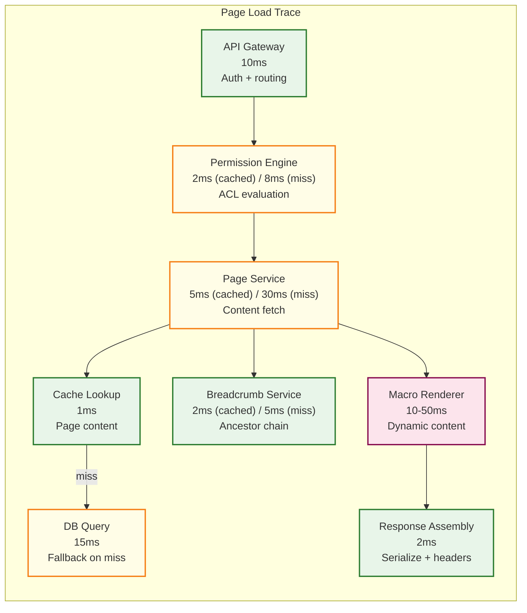

# Observability

## Key Performance Metrics

### Service-Level Indicators (SLIs)

| Metric | Measurement | Target | Alert Threshold |
|--------|-------------|--------|-----------------|
| **Page load latency (p50)** | Time from request to content returned | < 100ms | > 150ms for 5 min |
| **Page load latency (p99)** | Time from request to content returned | < 200ms | > 500ms for 2 min |
| **Search query latency (p50)** | Time from query to results returned | < 200ms | > 300ms for 5 min |
| **Search query latency (p99)** | Time from query to results returned | < 1s | > 2s for 2 min |
| **Page save latency (p50)** | Time from save click to confirmation | < 500ms | > 1s for 5 min |
| **Page save latency (p99)** | Time from save click to confirmation | < 2s | > 5s for 2 min |
| **Permission check latency (p99)** | Time to compute effective permission | < 10ms | > 20ms for 5 min |
| **Search index freshness** | Lag between page edit and search availability | < 30s | > 60s for 5 min |
| **Notification delivery lag (p99)** | Time from event to notification delivery | < 60s | > 120s for 10 min |
| **Error rate** | 5xx responses / total responses | < 0.1% | > 0.5% for 2 min |
| **Availability** | Successful requests / total requests | 99.99% | < 99.95% (rolling 1h) |

### Component-Level Metrics

#### Page Service

```
# Request metrics
page_service_request_duration_seconds{method, endpoint, status}
page_service_requests_total{method, endpoint, status}

# Page operations
pages_created_total{space_id}
pages_edited_total{space_id}
pages_deleted_total{space_id, strategy}
pages_moved_total{cross_space}

# Content metrics
page_content_size_bytes{quantile}
page_block_count{quantile}
page_version_count{page_id}  -- gauge for pages with most versions

# Hierarchy metrics
page_tree_depth{space_id, quantile}
closure_table_rows{space_id}  -- gauge
subtree_move_duration_seconds{subtree_size, quantile}
```

#### Permission Engine

```
# Permission check metrics
permission_check_duration_seconds{cache_hit, quantile}
permission_checks_total{result}  -- ALLOW, DENY
permission_cache_hit_ratio  -- gauge (target: >95%)
permission_cache_size  -- gauge
permission_cache_evictions_total

# Permission changes
permission_changes_total{target_type, action}  -- grant, revoke, restrict
permission_cache_invalidations_total{scope}  -- page, subtree, space, user

# Batch permission checks (search filtering)
permission_batch_check_duration_seconds{batch_size, quantile}
permission_batch_check_size{quantile}
```

#### Search Engine

```
# Query metrics
search_query_duration_seconds{query_type, quantile}
search_queries_total{query_type, result_count_bucket}
search_query_result_count{quantile}

# Index metrics
search_index_size_bytes  -- gauge
search_index_document_count  -- gauge
search_index_lag_seconds  -- gauge (time since last indexed event)

# Indexing pipeline
search_index_operations_total{operation}  -- index, update, delete
search_index_batch_duration_seconds{quantile}
search_index_queue_depth  -- gauge
search_index_errors_total{error_type}

# Search quality
search_zero_result_ratio  -- gauge (queries returning 0 results)
search_permission_filter_ratio  -- gauge (% results filtered by permissions)
search_click_through_rate  -- gauge (% searches that lead to page view)

# Semantic search
search_embedding_generation_duration_seconds{quantile}
search_semantic_score_distribution{quantile}
```

#### Notification Service

```
# Delivery metrics
notifications_sent_total{channel, priority}
notification_delivery_duration_seconds{channel, quantile}
notification_delivery_failures_total{channel, error_type}

# Fan-out metrics
notification_fanout_size{quantile}  -- watchers per event
notification_queue_depth  -- gauge
notification_batch_size{quantile}
notification_dedup_ratio  -- gauge (% notifications deduped)
```

#### Version Service

```
# Version operations
versions_created_total{is_snapshot}
version_diff_computation_duration_seconds{quantile}
version_restore_duration_seconds{quantile}
version_storage_bytes{space_id}  -- gauge

# Version reconstruction
version_reconstruction_steps{quantile}  -- diffs applied to reach target
version_reconstruction_duration_seconds{quantile}
```

---

## Business Metrics

### Content Health

| Metric | Description | Measurement | Significance |
|--------|-------------|-------------|-------------|
| **Pages created per day** | Rate of knowledge creation | Count of page.created events | Content growth health |
| **Active pages (edited in 30d)** | Content freshness | Count of pages with recent edits | Stale content detection |
| **Orphan pages** | Pages with no inbound links and no children | Periodic scan | Content discoverability issues |
| **Average page depth** | How deep pages are nested | Avg depth from closure table | Information architecture health |
| **Broken links count** | Links pointing to deleted pages | Periodic scan | Content maintenance debt |
| **Space count (active)** | Number of spaces with activity in 30 days | Count | Org adoption |

### User Engagement

| Metric | Description | Target |
|--------|-------------|--------|
| **DAU / MAU ratio** | Daily active / monthly active users | > 40% (healthy engagement) |
| **Pages viewed per session** | Average page views per user session | > 5 |
| **Search success rate** | % of searches followed by a page click | > 60% |
| **Edit contribution rate** | % of DAU who edit at least one page | > 15% |
| **Time to first edit** | Time for new users to make first page edit | < 7 days |
| **Return rate after search** | % of users who search again (didn't find answer) | < 30% (lower is better) |

### Space Health Dashboard

```
PER SPACE METRICS:

  Content:
    - Total pages
    - Pages created (7d / 30d)
    - Pages updated (7d / 30d)
    - Stale pages (not edited in 90d)
    - Broken links count
    - Average page views per page

  Collaboration:
    - Unique editors (7d / 30d)
    - Unique viewers (7d / 30d)
    - Comments created (7d / 30d)
    - Most active contributors

  Search:
    - Searches within this space (7d)
    - Zero-result queries (list top queries with no results)
    - Top searched queries

  Structure:
    - Page tree depth (max / avg)
    - Pages per level distribution
    - Most linked pages (highest backlink count)
    - Orphan pages (no links, no children)
```

---

## Alerting

### Critical Alerts (Page On-Call)

| Alert | Condition | Action |
|-------|-----------|--------|
| **High error rate** | 5xx rate > 1% for 2 minutes | Investigate failing service; check DB/cache health |
| **Page load degradation** | p99 > 500ms for 5 minutes | Check cache hit rates; check DB query performance |
| **Search unavailable** | Search error rate > 5% for 2 minutes | Check search cluster health; activate degraded mode |
| **Permission engine failure** | Permission check errors > 0.1% | Check cache cluster; check DB connectivity |
| **DB replication lag** | Lag > 30 seconds | Check primary DB load; network between regions |
| **Authentication failures spike** | Failed logins > 10x baseline | Potential credential stuffing; activate rate limiting |

### Warning Alerts (Monitor During Business Hours)

| Alert | Condition | Action |
|-------|-----------|--------|
| **Search index lag** | Index freshness > 60 seconds for 10 minutes | Check indexer worker health; queue depth |
| **Notification queue backup** | Queue depth > 50,000 for 15 minutes | Scale notification workers; check delivery failures |
| **Permission cache hit rate drop** | Cache hit rate < 80% for 15 minutes | Investigate invalidation storm; cache sizing |
| **Page hierarchy query timeout** | Closure table queries > 100ms p99 | Check for very deep trees; index health |
| **Export worker saturation** | All export workers busy for 30 minutes | Scale export workers; check for stuck jobs |
| **Disk space (search index)** | > 80% disk usage | Compact index; add storage; archive old data |
| **Audit log write failures** | Any write failure | Investigate immediately (compliance risk) |

### Informational Alerts (Daily Review)

| Alert | Condition | Action |
|-------|-----------|--------|
| **Stale content growth** | Pages not edited in 90d increasing > 5%/week | Prompt space admins to review |
| **Broken link accumulation** | Broken links > 1000 new per week | Run broken link notification campaign |
| **Search zero-result trend** | Zero-result ratio increasing week over week | Review search tuning; add missing content |
| **Large page growth** | Pages > 1MB content increasing | Monitor for performance impact |
| **Version history growth** | Version storage growing faster than content | Review snapshot frequency; retention policy |

---

## Distributed Tracing

### Trace Topology: Page Load



### Key Trace Spans

| Span | Parent | Attributes |
|------|--------|-----------|
| `http.request` | (root) | method, url, status_code, user_id |
| `auth.validate` | http.request | auth_method, token_type |
| `permission.check` | http.request | page_id, user_id, result, cache_hit |
| `page.fetch` | http.request | page_id, cache_hit, content_size |
| `db.query` | page.fetch | query_type, table, duration |
| `cache.get` | page.fetch | key, hit, ttl_remaining |
| `breadcrumb.compute` | http.request | page_id, depth, cache_hit |
| `macro.render` | page.fetch | macro_type, cache_hit, external_call |
| `search.query` | http.request | query_text, result_count, shards_queried |
| `search.permission_filter` | search.query | input_count, output_count, cache_hit_ratio |

### Trace-Based Debugging

```
COMMON INVESTIGATION PATTERNS:

1. "Page load is slow"
   → Check trace: which span dominates?
   → If permission.check: cache miss? invalidation storm?
   → If page.fetch: cache miss? large page?
   → If macro.render: which macro? external API slow?

2. "Search is slow"
   → Check trace: query parsing, index query, or permission filter?
   → If index query: specific shard slow? query too broad?
   → If permission filter: large result set? cache miss rate?

3. "Page save is slow"
   → Check trace: version diff? closure table update? search re-index?
   → If closure table: page move? deep tree?
   → If search re-index: synchronous? should be async.

4. "Notifications delayed"
   → Check trace: fan-out size? queue depth? delivery failures?
   → If queue depth: worker scaling? stuck workers?
   → If delivery failures: email service down? webhook timeouts?
```

---

## Dashboards

### Operations Dashboard

```
ROW 1: Health Overview
  [Availability %] [Error Rate %] [Active Users] [Active Spaces]

ROW 2: Latency
  [Page Load p50/p99 timeseries]
  [Search Query p50/p99 timeseries]
  [Page Save p50/p99 timeseries]
  [Permission Check p99 timeseries]

ROW 3: Throughput
  [Page Views/sec] [Page Edits/sec] [Search Queries/sec] [API Requests/sec]

ROW 4: Infrastructure
  [DB CPU / Connections] [Cache Hit Rate / Memory]
  [Search Cluster CPU / Disk] [Queue Depth (all queues)]

ROW 5: Background Processing
  [Search Index Lag] [Notification Queue Depth]
  [Export Job Queue] [AI Processing Queue]
```

### Content Growth Dashboard

```
ROW 1: Volume
  [Total Pages (gauge)] [Pages Created Today] [Pages Edited Today]
  [Total Spaces (gauge)] [Active Spaces (30d)]

ROW 2: Trends
  [Pages Created/Day (30d trend)] [Pages Edited/Day (30d trend)]
  [Unique Editors/Day] [Unique Viewers/Day]

ROW 3: Health
  [Stale Pages %] [Broken Links Count] [Orphan Pages Count]
  [Average Page Depth] [Largest Spaces by Page Count]

ROW 4: Search Effectiveness
  [Search Queries/Day] [Zero Result Rate %]
  [Search Click-Through Rate %] [Top Queries with No Results]
```

### Security Dashboard

```
ROW 1: Authentication
  [Login Success/Failure Rate] [MFA Challenge Rate]
  [Active Sessions] [Failed Login Attempts (geographic map)]

ROW 2: Authorization
  [Permission Denials/Day] [Permission Changes/Day]
  [Public Links Created] [External Access Attempts]

ROW 3: Audit
  [Audit Events/Day by Category] [Sensitive Page Accesses]
  [Admin Actions] [Data Export Requests]

ROW 4: Compliance
  [GDPR Erasure Requests] [Audit Chain Integrity Status]
  [Data Residency Violations] [Encryption Key Rotation Status]
```

---

## AI Service Monitoring

| Metric | Description | Alert Threshold |
|--------|-------------|-----------------|
| **Summarization latency (p99)** | Time to generate page summary | > 5s for 10 min |
| **Summarization error rate** | Failed summary generations | > 5% for 5 min |
| **Embedding generation latency (p99)** | Time to generate page embedding | > 2s for 10 min |
| **Embedding freshness** | % of pages with stale embeddings (>7d old) | > 20% |
| **Semantic search latency overhead** | Additional latency vs keyword-only search | > 200ms p99 |
| **Recommendation accuracy** | Click-through rate on recommended pages | < 10% (review model) |
| **AI queue depth** | Pending AI processing jobs | > 1000 for 15 min |
| **Model inference cost** | Cost per 1000 summaries/embeddings | Budget threshold |

---

## Logging Strategy

### Structured Log Format

```
{
    "timestamp": "2026-03-08T14:30:22.456Z",
    "level": "INFO",
    "service": "page-service",
    "trace_id": "abc123def456",
    "span_id": "span789",
    "user_id": "user-123",
    "space_id": "space-eng",
    "message": "Page saved successfully",
    "attributes": {
        "page_id": "page-456",
        "version": 47,
        "content_size_bytes": 15234,
        "block_count": 42,
        "diff_size_bytes": 834,
        "save_duration_ms": 127,
        "cache_invalidated": ["page_content", "breadcrumb", "space_tree"]
    }
}
```

### Log Levels by Component

| Component | DEBUG | INFO | WARN | ERROR |
|-----------|-------|------|------|-------|
| Page Service | Block-level changes | Page CRUD operations | Conflict detected | Save failure |
| Permission Engine | Cache lookup details | Permission changes | Cache miss spike | Evaluation failure |
| Search Engine | Query parsing details | Search queries (sampled) | Slow queries | Index errors |
| Notification Service | Individual delivery | Batch sent | Delivery retry | Delivery failure |
| Audit Logger | N/A (always logs) | All events | Chain gap detected | Write failure |
| Export Pipeline | Render steps | Job start/complete | Slow render | Generation failure |

### Log Retention

| Level | Retention | Storage |
|-------|-----------|---------|
| ERROR | 90 days | Hot (indexed, searchable) |
| WARN | 30 days | Hot (indexed) |
| INFO | 14 days | Warm (compressed, searchable) |
| DEBUG | 3 days | Cold (compressed, manual access) |
| Audit | Per compliance (3-7 years) | Dedicated store (immutable) |
