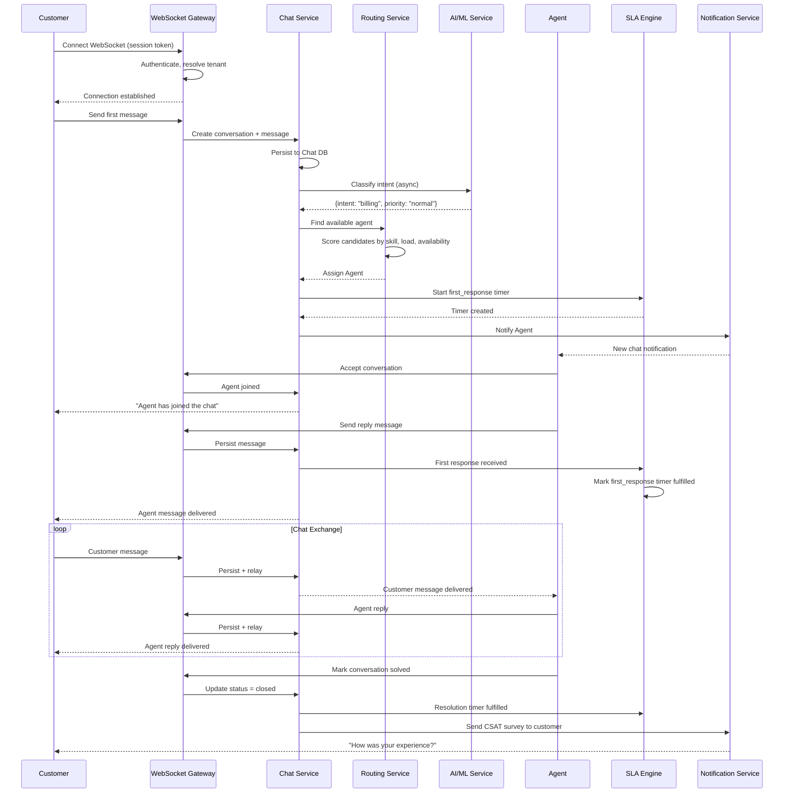

# Low-Level Design

## Data Model

### Core Entity Relationships

```mermaid
erDiagram
    TENANT {
        uuid id PK "Tenant organization identifier"
        string subdomain UK "URL-friendly subdomain"
        string name "Organization display name"
        string plan "free, team, professional, enterprise"
        jsonb settings "Timezone, locale, branding, features"
        jsonb business_hours "Per-day schedule with timezone"
        string status "active, suspended, churned"
        timestamp created_at
        timestamp updated_at
    }

    AGENT {
        uuid id PK "Agent identifier"
        uuid tenant_id FK "Owning tenant"
        string email UK "Agent email"
        string name "Display name"
        string role "admin, supervisor, agent"
        jsonb skills "Array of skill tags with proficiency levels"
        int max_concurrent_chats "Chat capacity limit"
        string status "online, away, offline"
        uuid group_id FK "Primary agent group"
        timestamp last_active_at
        timestamp created_at
    }

    AGENT_GROUP {
        uuid id PK
        uuid tenant_id FK
        string name "Group name (e.g., Billing, Technical)"
        string description
        jsonb routing_config "Round-robin, skill-based, load-balanced"
        boolean is_default "Default group for unrouted tickets"
        timestamp created_at
    }

    CUSTOMER {
        uuid id PK "Customer identifier"
        uuid tenant_id FK "Tenant this customer belongs to"
        string email "Customer email"
        string name "Customer name"
        string phone "Phone number"
        jsonb custom_fields "Tenant-defined custom attributes"
        jsonb tags "Array of tags"
        string locale "Preferred language"
        string timezone "Customer timezone"
        timestamp created_at
        timestamp updated_at
    }

    TICKET {
        uuid id PK "Ticket identifier"
        uuid tenant_id FK "Owning tenant"
        bigint ticket_number "Tenant-scoped sequential number"
        string subject "Ticket subject line"
        string status "new, open, pending, on_hold, solved, closed"
        string priority "low, normal, high, urgent"
        string channel "email, chat, web, api, social"
        uuid requester_id FK "Customer who raised the ticket"
        uuid assignee_id FK "Assigned agent (nullable)"
        uuid group_id FK "Assigned group (nullable)"
        jsonb tags "Array of string tags"
        jsonb custom_fields "Tenant-defined custom fields"
        string intent "AI-classified intent (nullable)"
        float intent_confidence "Classification confidence 0-1"
        string locale "Detected language"
        int satisfaction_score "CSAT rating 1-5 (nullable)"
        uuid merged_into_id FK "If merged, points to surviving ticket"
        timestamp first_response_at "When agent first replied"
        timestamp solved_at "When marked solved"
        timestamp created_at
        timestamp updated_at
    }

    TICKET_EVENT {
        uuid id PK "Event identifier"
        uuid tenant_id FK
        uuid ticket_id FK "Parent ticket"
        string event_type "comment, status_change, assignment, tag_change, field_change, note, merge, sla_breach"
        uuid actor_id FK "Agent or system that caused event"
        string actor_type "agent, customer, system, automation"
        jsonb data "Event-specific payload"
        boolean is_public "Visible to customer?"
        timestamp created_at
    }

    CONVERSATION {
        uuid id PK "Chat conversation identifier"
        uuid tenant_id FK
        uuid ticket_id FK "Associated ticket (nullable)"
        uuid customer_id FK "Customer participant"
        uuid assignee_id FK "Assigned agent"
        string channel "live_chat, messenger, whatsapp"
        string status "queued, active, waiting, closed"
        int message_count "Total messages"
        jsonb metadata "Browser info, page URL, referrer"
        timestamp started_at
        timestamp first_response_at
        timestamp ended_at
    }

    MESSAGE {
        uuid id PK "Message identifier"
        uuid tenant_id FK
        uuid conversation_id FK "Parent conversation"
        uuid sender_id FK "Agent or customer ID"
        string sender_type "agent, customer, bot"
        string content_type "text, rich_text, attachment, system"
        text body "Message content"
        jsonb attachments "Array of attachment references"
        jsonb metadata "Delivery status, read receipts"
        boolean is_internal "Internal note (agent-only)"
        timestamp created_at
    }

    ARTICLE {
        uuid id PK "Article identifier"
        uuid tenant_id FK
        uuid category_id FK "Parent category"
        uuid section_id FK "Parent section"
        string title "Article title"
        string slug UK "URL-friendly slug"
        text body "Article content (markdown or HTML)"
        string status "draft, published, archived"
        string locale "Article language"
        uuid author_id FK "Agent who wrote it"
        int view_count "Total views"
        int helpful_count "Helpful votes"
        int not_helpful_count "Not helpful votes"
        int version_number "Current version"
        jsonb labels "Array of labels"
        timestamp published_at
        timestamp created_at
        timestamp updated_at
    }

    SLA_POLICY {
        uuid id PK
        uuid tenant_id FK
        string name "Policy name (e.g., Premium Support)"
        int priority_order "Evaluation order (lower = first)"
        jsonb conditions "When this policy applies (e.g., priority=urgent AND tag=enterprise)"
        jsonb targets "Response and resolution targets per priority"
        uuid business_calendar_id FK "Business hours calendar"
        boolean is_default "Fallback policy if no conditions match"
        timestamp created_at
        timestamp updated_at
    }

    SLA_TIMER {
        uuid id PK
        uuid tenant_id FK
        uuid ticket_id FK
        string timer_type "first_response, next_reply, resolution"
        string status "active, paused, fulfilled, breached"
        timestamp target_at "Absolute deadline (adjusted for business hours)"
        bigint remaining_business_seconds "Remaining seconds in business time"
        uuid policy_id FK "SLA policy that created this timer"
        timestamp paused_at "When timer was paused (nullable)"
        timestamp breached_at "When breach occurred (nullable)"
        timestamp fulfilled_at "When requirement was met (nullable)"
        timestamp created_at
        timestamp updated_at
    }

    AI_ROUTING_RULE {
        uuid id PK
        uuid tenant_id FK
        string name "Rule name"
        int priority_order "Evaluation order"
        jsonb conditions "Match conditions (intent, priority, tags, channel)"
        jsonb actions "Route to group, assign to agent, set priority"
        boolean is_active
        timestamp created_at
    }

    AUTOMATION_RULE {
        uuid id PK
        uuid tenant_id FK
        string name "Rule name"
        string trigger_type "ticket_created, ticket_updated, time_based"
        jsonb conditions "When to fire (status, priority, hours since update)"
        jsonb actions "What to do (assign, tag, notify, close)"
        boolean is_active
        int execution_count "Times fired"
        timestamp created_at
        timestamp updated_at
    }

    BUSINESS_CALENDAR {
        uuid id PK
        uuid tenant_id FK
        string name "Calendar name"
        string timezone "IANA timezone"
        jsonb schedule "Per-day business hours (e.g., mon: 09:00-17:00)"
        jsonb holidays "Array of holiday dates"
        timestamp created_at
    }

    WEBHOOK_SUBSCRIPTION {
        uuid id PK
        uuid tenant_id FK
        string target_url "Delivery URL"
        jsonb events "Array of event types to subscribe to"
        string secret "HMAC signing secret"
        string status "active, disabled, failing"
        int failure_count "Consecutive failures"
        timestamp last_delivery_at
        timestamp created_at
    }

    TENANT ||--o{ AGENT : "employs"
    TENANT ||--o{ AGENT_GROUP : "has groups"
    TENANT ||--o{ CUSTOMER : "serves"
    TENANT ||--o{ TICKET : "contains"
    TENANT ||--o{ CONVERSATION : "contains"
    TENANT ||--o{ ARTICLE : "publishes"
    TENANT ||--o{ SLA_POLICY : "defines"
    TENANT ||--o{ AI_ROUTING_RULE : "configures"
    TENANT ||--o{ AUTOMATION_RULE : "configures"
    TENANT ||--o{ BUSINESS_CALENDAR : "defines"
    TENANT ||--o{ WEBHOOK_SUBSCRIPTION : "subscribes"
    AGENT_GROUP ||--o{ AGENT : "contains"
    CUSTOMER ||--o{ TICKET : "creates"
    TICKET ||--o{ TICKET_EVENT : "has events"
    TICKET ||--o{ SLA_TIMER : "tracked by"
    TICKET ||--o| CONVERSATION : "linked to"
    CONVERSATION ||--o{ MESSAGE : "contains"
    SLA_POLICY ||--o{ SLA_TIMER : "creates"
    SLA_POLICY }o--|| BUSINESS_CALENDAR : "uses"
    ARTICLE }o--|| AGENT : "authored by"
```



---

## Ticket Number Generation

Each tenant has its own sequential ticket number space (e.g., Ticket #1, #2, #3...). This is separate from the UUID primary key.

```
PSEUDOCODE: Tenant-Scoped Ticket Number

FUNCTION generate_ticket_number(tenant_id):
    // Use an atomic counter per tenant
    // Option 1: Database sequence per tenant (not scalable at 150K tenants)
    // Option 2: Distributed counter in cache with periodic DB sync

    // Chosen approach: Cache-based counter with DB backup
    counter_key = "ticket_counter:" + tenant_id

    // Atomic increment in distributed cache
    next_number = cache.increment(counter_key)

    IF next_number == NULL:
        // Cache miss: load from DB and initialize
        current_max = SELECT MAX(ticket_number) FROM tickets
                      WHERE tenant_id = tenant_id
        next_number = (current_max OR 0) + 1
        cache.set(counter_key, next_number)

    RETURN next_number

    // Note: Small gaps are acceptable (e.g., if a ticket creation fails
    // after incrementing the counter). Uniqueness is enforced by
    // UNIQUE(tenant_id, ticket_number) in the database.
```

---

## SLA Timer Computation

### Business Hours Calculation

```
PSEUDOCODE: SLA Timer Engine

STRUCTURE BusinessCalendar:
    timezone: string              // "America/New_York"
    schedule: map[day_of_week → list[TimeRange]]  // e.g., MON: [{09:00, 17:00}]
    holidays: set[date]           // Dates with no business hours

STRUCTURE TimeRange:
    start: time    // e.g., 09:00
    end: time      // e.g., 17:00

FUNCTION compute_target_time(start_time, sla_minutes, calendar):
    // Convert start_time to calendar timezone
    local_start = convert_to_timezone(start_time, calendar.timezone)
    remaining = sla_minutes * 60  // Convert to seconds

    current = local_start

    WHILE remaining > 0:
        // Skip if current day is a holiday or non-business day
        IF current.date IN calendar.holidays
           OR current.day_of_week NOT IN calendar.schedule:
            current = start_of_next_business_day(current, calendar)
            CONTINUE

        // Get today's business hours
        ranges = calendar.schedule[current.day_of_week]

        FOR range IN ranges:
            IF current.time >= range.end:
                CONTINUE  // Past this range, check next

            effective_start = MAX(current.time, range.start)
            available_seconds = (range.end - effective_start).total_seconds()

            IF remaining <= available_seconds:
                // SLA target falls within this range
                target = current.date + effective_start + remaining seconds
                RETURN convert_to_utc(target, calendar.timezone)

            remaining -= available_seconds

        // Move to next business day
        current = start_of_next_business_day(current, calendar)

    // Should not reach here if calendar has valid business hours
    RAISE "No business hours available in calendar"


FUNCTION start_of_next_business_day(current, calendar):
    next_day = current.date + 1 day

    WHILE next_day IN calendar.holidays
          OR next_day.day_of_week NOT IN calendar.schedule:
        next_day += 1 day

    first_range = calendar.schedule[next_day.day_of_week][0]
    RETURN datetime(next_day, first_range.start)


FUNCTION compute_elapsed_business_time(start, end, calendar):
    // Calculate business seconds between two timestamps
    // Used for: "How much SLA time has been consumed?"
    elapsed = 0
    current = convert_to_timezone(start, calendar.timezone)
    end_local = convert_to_timezone(end, calendar.timezone)

    WHILE current < end_local:
        IF current.date IN calendar.holidays
           OR current.day_of_week NOT IN calendar.schedule:
            current = start_of_next_business_day(current, calendar)
            CONTINUE

        ranges = calendar.schedule[current.day_of_week]
        FOR range IN ranges:
            IF current.time >= range.end:
                CONTINUE

            effective_start = MAX(current.time, range.start)
            effective_end = MIN(end_local.time, range.end) IF same_day ELSE range.end
            elapsed += (effective_end - effective_start).total_seconds()

        current = start_of_next_business_day(current, calendar)

    RETURN elapsed


FUNCTION on_ticket_event(ticket_id, event_type, timestamp):
    timers = get_active_timers(ticket_id)

    FOR timer IN timers:
        SWITCH event_type:
            CASE "agent_reply":
                IF timer.timer_type == "first_response":
                    timer.status = "fulfilled"
                    timer.fulfilled_at = timestamp
                ELSE IF timer.timer_type == "next_reply":
                    timer.status = "fulfilled"
                    timer.fulfilled_at = timestamp

            CASE "status_change_to_pending":
                // Customer is expected to respond; pause SLA timers
                IF timer.status == "active":
                    timer.status = "paused"
                    timer.paused_at = timestamp

            CASE "status_change_to_open":
                // Customer responded; resume timers
                IF timer.status == "paused":
                    // Recalculate target_at excluding paused duration
                    paused_business_time = compute_elapsed_business_time(
                        timer.paused_at, timestamp, get_calendar(timer)
                    )
                    // Extend target by paused duration (business time was not ticking)
                    timer.target_at = extend_by_business_time(
                        timer.target_at, paused_business_time, get_calendar(timer)
                    )
                    timer.status = "active"
                    timer.paused_at = NULL

                // Start next_reply timer
                create_next_reply_timer(ticket_id, timestamp)

            CASE "status_change_to_solved":
                IF timer.timer_type == "resolution":
                    timer.status = "fulfilled"
                    timer.fulfilled_at = timestamp

        persist_timer(timer)
```

---

## AI Routing Algorithm

```
PSEUDOCODE: AI-Powered Ticket Routing

STRUCTURE RoutingDecision:
    agent_id: uuid
    group_id: uuid
    confidence: float
    reason: string
    factors: map[string, float]

FUNCTION route_ticket(ticket, tenant_id):
    // Phase 1: Rule-based overrides (tenant-configured rules take precedence)
    rule_match = evaluate_routing_rules(ticket, tenant_id)
    IF rule_match IS NOT NULL:
        RETURN apply_rule(rule_match, ticket)

    // Phase 2: AI classification
    classification = classify_ticket(ticket)

    // Phase 3: Find eligible agents
    candidates = get_eligible_agents(tenant_id, classification)

    IF candidates IS EMPTY:
        // No matching agents online; route to default group queue
        RETURN RoutingDecision(
            agent_id = NULL,
            group_id = get_default_group(tenant_id),
            confidence = 0,
            reason = "no_eligible_agents"
        )

    // Phase 4: Score and rank candidates
    scored = []
    FOR agent IN candidates:
        score = compute_agent_score(agent, classification, ticket)
        scored.append((agent, score))

    scored.sort(by=score, descending=True)
    best_agent, best_score = scored[0]

    RETURN RoutingDecision(
        agent_id = best_agent.id,
        group_id = best_agent.group_id,
        confidence = classification.confidence * best_score.normalized,
        reason = "ai_routed",
        factors = best_score.breakdown
    )


FUNCTION classify_ticket(ticket):
    // Prepare input features
    text = ticket.subject + " " + ticket.description
    features = {
        text_embedding: embed(text),
        channel: one_hot(ticket.channel),
        customer_tier: ticket.requester.tier,
        has_attachment: len(ticket.attachments) > 0,
        hour_of_day: ticket.created_at.hour,
        day_of_week: ticket.created_at.day_of_week
    }

    // Intent classification (multi-label)
    intent_scores = intent_model.predict(features)
    top_intent = argmax(intent_scores)
    intent_confidence = intent_scores[top_intent]

    // Priority prediction
    priority_scores = priority_model.predict(features)
    predicted_priority = argmax(priority_scores)
    priority_confidence = priority_scores[predicted_priority]

    // Sentiment analysis
    sentiment = sentiment_model.predict(features.text_embedding)

    RETURN {
        intent: top_intent,
        intent_confidence: intent_confidence,
        priority: predicted_priority,
        priority_confidence: priority_confidence,
        sentiment: sentiment,  // negative, neutral, positive
        requires_triage: intent_confidence < 0.6 OR priority_confidence < 0.5
    }


FUNCTION compute_agent_score(agent, classification, ticket):
    // Skill match: does the agent have the required skill?
    skill_score = 0.0
    IF classification.intent IN agent.skills:
        skill_score = agent.skills[classification.intent].proficiency  // 0-1

    // Availability: how busy is the agent?
    current_load = get_agent_current_load(agent.id)
    max_load = agent.max_concurrent_chats IF ticket.channel == "chat"
               ELSE agent.max_concurrent_tickets
    availability_score = 1.0 - (current_load / max_load)

    // Recency: has the agent helped this customer before? (affinity)
    affinity_score = 0.0
    IF has_previous_interaction(agent.id, ticket.requester_id):
        affinity_score = 0.3  // Bonus for continuity

    // Load balance: distribute evenly across agents
    group_avg_load = get_group_average_load(agent.group_id)
    balance_score = 1.0 - (current_load / MAX(group_avg_load * 2, 1))

    // Weighted combination
    total = (skill_score * 0.35 +
             availability_score * 0.25 +
             affinity_score * 0.15 +
             balance_score * 0.25)

    RETURN {
        total: total,
        normalized: CLAMP(total, 0, 1),
        breakdown: {
            skill: skill_score,
            availability: availability_score,
            affinity: affinity_score,
            balance: balance_score
        }
    }
```

---

## Knowledge Base Search and Deflection

```
PSEUDOCODE: Knowledge Base Deflection Engine

FUNCTION suggest_articles_for_deflection(query_text, tenant_id, context):
    // Called when customer starts typing a ticket or enters chat
    // Goal: find articles that might answer the question before a ticket is created

    // Step 1: Keyword search with BM25
    keyword_results = search_index.query(
        query = query_text,
        filter = {tenant_id: tenant_id, status: "published"},
        fields = ["title^3", "body", "labels"],
        size = 20
    )

    // Step 2: Semantic search with embeddings
    query_embedding = embed(query_text)
    semantic_results = vector_index.nearest_neighbors(
        vector = query_embedding,
        filter = {tenant_id: tenant_id, status: "published"},
        k = 20
    )

    // Step 3: Reciprocal Rank Fusion to merge results
    fused = reciprocal_rank_fusion(keyword_results, semantic_results, k=60)

    // Step 4: Re-rank by contextual signals
    ranked = []
    FOR article IN fused[:10]:
        context_score = compute_context_score(article, context)
        final_score = article.fusion_score * 0.7 + context_score * 0.3
        ranked.append((article, final_score))

    ranked.sort(by=score, descending=True)

    // Step 5: Return top 3-5 suggestions
    suggestions = ranked[:5]

    // Step 6: Log deflection attempt for analytics
    log_deflection_attempt(tenant_id, query_text, suggestions)

    RETURN suggestions


FUNCTION compute_context_score(article, context):
    score = 0.0

    // Boost recently updated articles
    days_since_update = (now() - article.updated_at).days
    recency_boost = 1.0 / (1.0 + days_since_update / 30)
    score += recency_boost * 0.3

    // Boost articles with high helpful ratio
    IF article.helpful_count + article.not_helpful_count > 10:
        helpful_ratio = article.helpful_count / (article.helpful_count + article.not_helpful_count)
        score += helpful_ratio * 0.4

    // Boost if article matches customer's product/plan
    IF context.customer_tags INTERSECTS article.labels:
        score += 0.3

    RETURN CLAMP(score, 0, 1)


FUNCTION on_deflection_result(tenant_id, attempt_id, outcome):
    // Called when customer either:
    // (a) clicks an article and does NOT create a ticket (successful deflection)
    // (b) creates a ticket anyway (failed deflection)

    IF outcome == "deflected":
        increment_metric("kb_deflection_success", tenant_id)
        update_article_stats(attempt.articles, "deflection_success")
    ELSE:
        increment_metric("kb_deflection_failure", tenant_id)
        update_article_stats(attempt.articles, "deflection_failure")
        // Feed into ML: what queries are NOT being answered by KB?
        log_deflection_gap(tenant_id, attempt.query, attempt.articles)
```

---

## Live Chat Sequence Diagram



---

## API Design

### Ticket Operations

```
POST   /api/v2/tickets                              Create ticket
GET    /api/v2/tickets                              List tickets (filtered, paginated)
GET    /api/v2/tickets/{ticket_id}                   Get ticket details
PUT    /api/v2/tickets/{ticket_id}                   Update ticket fields
DELETE /api/v2/tickets/{ticket_id}                   Soft-delete ticket

POST   /api/v2/tickets/{ticket_id}/comments          Add comment (public or internal)
GET    /api/v2/tickets/{ticket_id}/comments          List comments
GET    /api/v2/tickets/{ticket_id}/events            List ticket events (audit trail)
POST   /api/v2/tickets/{ticket_id}/merge             Merge another ticket into this one
POST   /api/v2/tickets/{ticket_id}/tags              Add tags
DELETE /api/v2/tickets/{ticket_id}/tags/{tag}        Remove tag

GET    /api/v2/tickets/{ticket_id}/sla               Get SLA status for ticket
```

#### Create Ticket Request

```
POST /api/v2/tickets
Content-Type: application/json
Authorization: Bearer {agent_or_api_token}

{
    "subject": "Cannot access billing dashboard",
    "description": "When I click on Billing, I get a 500 error...",
    "requester": {
        "email": "customer@example.com",
        "name": "Jane Doe"
    },
    "priority": "high",           // Optional: AI will predict if omitted
    "channel": "web",
    "tags": ["billing", "error"],
    "custom_fields": {
        "product": "enterprise",
        "account_id": "acct_12345"
    }
}

Response: 201 Created
{
    "ticket": {
        "id": "tkt_abc123",
        "ticket_number": 4521,
        "subject": "Cannot access billing dashboard",
        "status": "new",
        "priority": "high",
        "intent": "billing_access_issue",
        "intent_confidence": 0.91,
        "assignee_id": null,
        "group_id": "grp_billing",
        "sla": {
            "first_response": {
                "target_at": "2026-03-08T15:30:00Z",
                "status": "active"
            },
            "resolution": {
                "target_at": "2026-03-09T17:00:00Z",
                "status": "active"
            }
        },
        "suggested_articles": [
            {"id": "art_789", "title": "Troubleshooting Billing Dashboard", "score": 0.87}
        ],
        "created_at": "2026-03-08T14:30:00Z"
    }
}
```

### Chat Operations (WebSocket)

```
// WebSocket endpoint
WSS /api/v2/chat/ws?token={session_token}

// Client → Server messages:
{
    "type": "message.send",
    "conversation_id": "conv_xyz",
    "body": "I need help with my order",
    "content_type": "text"
}

{
    "type": "typing.start",
    "conversation_id": "conv_xyz"
}

{
    "type": "typing.stop",
    "conversation_id": "conv_xyz"
}

// Server → Client messages:
{
    "type": "message.received",
    "conversation_id": "conv_xyz",
    "message": {
        "id": "msg_456",
        "sender_type": "agent",
        "sender_name": "Alice",
        "body": "Hi! Let me look into that for you.",
        "created_at": "2026-03-08T14:31:00Z"
    }
}

{
    "type": "conversation.assigned",
    "conversation_id": "conv_xyz",
    "agent": {"id": "agt_42", "name": "Alice"}
}

{
    "type": "sla.warning",
    "conversation_id": "conv_xyz",
    "timer_type": "first_response",
    "remaining_seconds": 120
}
```

### Knowledge Base Operations

```
POST   /api/v2/help_center/articles                  Create article
GET    /api/v2/help_center/articles                  List articles (filtered)
GET    /api/v2/help_center/articles/{article_id}      Get article
PUT    /api/v2/help_center/articles/{article_id}      Update article
DELETE /api/v2/help_center/articles/{article_id}      Archive article

GET    /api/v2/help_center/search?q={query}           Search articles
POST   /api/v2/help_center/articles/{id}/vote         Vote helpful/not helpful

GET    /api/v2/help_center/categories                 List categories
GET    /api/v2/help_center/sections                   List sections
```

### AI/Routing Operations

```
POST   /api/v2/ai/classify                           Classify ticket text (intent + priority)
GET    /api/v2/routing/rules                          List routing rules
POST   /api/v2/routing/rules                          Create routing rule
GET    /api/v2/routing/suggestions/{ticket_id}        Get routing suggestion for ticket
```

### Rate Limiting

| Endpoint Category | Limit | Window | Strategy |
|------------------|-------|--------|----------|
| Ticket reads | 400 req/min | Sliding window | Per agent |
| Ticket writes | 100 req/min | Sliding window | Per agent |
| Chat messages | 60 msg/min | Sliding window | Per conversation |
| KB search | 100 req/min | Sliding window | Per user |
| API (external) | 700 req/min | Sliding window | Per API key |
| Webhooks (inbound) | 200 req/min | Sliding window | Per tenant |
| Bulk operations | 50 req/hour | Fixed window | Per tenant |

---

## Indexing Strategy

| Index | Table | Columns | Purpose |
|-------|-------|---------|---------|
| `idx_ticket_tenant_status` | TICKET | `(tenant_id, status, updated_at DESC)` | Agent queue: open tickets per tenant |
| `idx_ticket_tenant_assignee` | TICKET | `(tenant_id, assignee_id, status)` | My assigned tickets |
| `idx_ticket_tenant_group` | TICKET | `(tenant_id, group_id, status)` | Group queue |
| `idx_ticket_tenant_number` | TICKET | `(tenant_id, ticket_number)` UNIQUE | Ticket number lookup |
| `idx_ticket_requester` | TICKET | `(tenant_id, requester_id, created_at DESC)` | Customer's ticket history |
| `idx_event_ticket` | TICKET_EVENT | `(ticket_id, created_at)` | Ticket timeline |
| `idx_event_actor` | TICKET_EVENT | `(tenant_id, actor_id, created_at)` | Agent activity |
| `idx_conv_tenant_status` | CONVERSATION | `(tenant_id, status, started_at DESC)` | Active chats |
| `idx_conv_assignee` | CONVERSATION | `(tenant_id, assignee_id, status)` | Agent's active chats |
| `idx_message_conv` | MESSAGE | `(conversation_id, created_at)` | Chat history |
| `idx_article_tenant_status` | ARTICLE | `(tenant_id, status, updated_at DESC)` | Published articles |
| `idx_article_category` | ARTICLE | `(tenant_id, category_id, section_id)` | Category browsing |
| `idx_sla_timer_active` | SLA_TIMER | `(status, target_at)` WHERE status='active' | Timer worker: find due timers |
| `idx_sla_timer_ticket` | SLA_TIMER | `(ticket_id, timer_type)` | Get timers for a ticket |
| `idx_agent_tenant_status` | AGENT | `(tenant_id, status)` | Online agents per tenant |
| `idx_customer_tenant_email` | CUSTOMER | `(tenant_id, email)` | Customer lookup by email |

### Partitioning / Sharding

| Data | Shard Key | Strategy |
|------|-----------|----------|
| Tickets + Events | `tenant_id` | Co-locate all of a tenant's tickets on same shard |
| Conversations + Messages | `tenant_id` | Co-locate with tickets for cross-reference |
| Articles | `tenant_id` | Co-locate with tenant data |
| SLA Timers | `tenant_id` | Co-locate with tickets |
| Search Index | `tenant_id` prefix | Tenant-scoped search isolation |
| Audit Log | `created_at` (time-partitioned) | Time-based retention |
| Analytics | `tenant_id` + `date` | Per-tenant time-partitioned aggregation |
