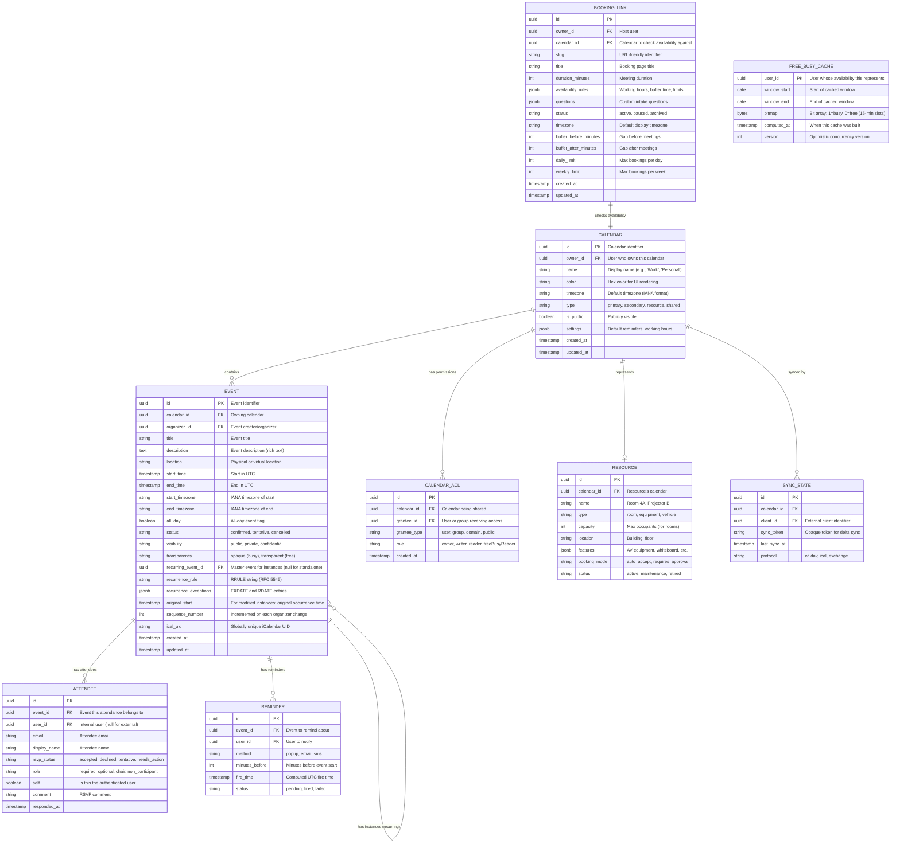
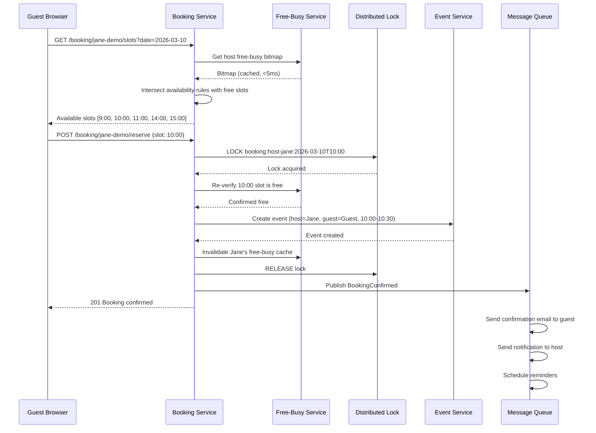

# Low-Level Design

## Data Model

### Core Entity Relationships



---

## Recurring Event Storage Detail

### Master Event vs Instance

```
STRUCTURE MasterEvent:
    id: UUID
    calendar_id: UUID
    title: string
    rrule: string              // "FREQ=WEEKLY;BYDAY=MO,WE,FR;UNTIL=20261231T235959Z"
    exdates: list[timestamp]   // Deleted occurrences
    rdates: list[timestamp]    // Added extra occurrences
    start_time: timestamp      // First occurrence start (UTC)
    end_time: timestamp        // First occurrence end (UTC)
    start_timezone: string     // "America/New_York"
    duration: interval         // Computed from first occurrence

STRUCTURE EventInstance:
    id: UUID
    master_event_id: UUID      // Links to master
    original_start: timestamp  // What this instance's start WOULD be per the rule
    start_time: timestamp      // Actual start (may differ if modified)
    end_time: timestamp        // Actual end
    is_modified: boolean       // True if this instance deviates from master
    is_cancelled: boolean      // True if this instance was deleted
    overrides: jsonb           // Fields that differ from master (title, location, etc.)
```

### Storage Rules

1. **Unmodified instances** within the materialization window are stored with `is_modified = false` and no overrides. They inherit all properties from the master event.
2. **Modified instances** ("change just this one") are stored with `is_modified = true` and an `overrides` object containing only the changed fields.
3. **Cancelled instances** are stored with `is_cancelled = true` (equivalent to EXDATE in RFC 5545).
4. **"This and following" changes** split the series: the original master's RRULE gets an UNTIL added at the split point, and a new master event is created for the remainder.

---

## API Design

### Event Operations

```
POST   /api/v1/calendars/{calendar_id}/events              Create event (single or recurring)
GET    /api/v1/calendars/{calendar_id}/events               List events in time range
GET    /api/v1/events/{event_id}                            Get event details
PUT    /api/v1/events/{event_id}                            Update event (all instances)
PUT    /api/v1/events/{event_id}/instances/{instance_id}    Update single instance
DELETE /api/v1/events/{event_id}                            Delete event (all instances)
DELETE /api/v1/events/{event_id}?scope=this                 Delete single instance
DELETE /api/v1/events/{event_id}?scope=this_and_following   Delete this and future instances
GET    /api/v1/events/{event_id}/instances                  List instances of recurring event
```

### Calendar Operations

```
POST   /api/v1/calendars                                   Create calendar
GET    /api/v1/calendars                                   List user's calendars
GET    /api/v1/calendars/{calendar_id}                     Get calendar details
PUT    /api/v1/calendars/{calendar_id}                     Update calendar settings
DELETE /api/v1/calendars/{calendar_id}                     Delete calendar
PUT    /api/v1/calendars/{calendar_id}/acl                 Update sharing permissions
GET    /api/v1/calendars/{calendar_id}/acl                 List sharing permissions
```

### Free-Busy Query

```
POST   /api/v1/freebusy
  Request:
    {
      "time_min": "2026-03-09T00:00:00Z",
      "time_max": "2026-03-15T23:59:59Z",
      "items": [
        {"id": "user-alice"},
        {"id": "user-bob"},
        {"id": "room-4a"}
      ],
      "group_expansion_max": 100
    }
  Response:
    {
      "calendars": {
        "user-alice": {
          "busy": [
            {"start": "2026-03-09T14:00:00Z", "end": "2026-03-09T15:00:00Z"},
            {"start": "2026-03-10T09:00:00Z", "end": "2026-03-10T10:00:00Z"}
          ]
        },
        ...
      }
    }
```

### Booking API

```
GET    /api/v1/booking/{slug}/slots?date=2026-03-10&timezone=America/New_York
  Response:
    {
      "slots": [
        {"start": "2026-03-10T09:00:00-05:00", "end": "2026-03-10T09:30:00-05:00"},
        {"start": "2026-03-10T10:00:00-05:00", "end": "2026-03-10T10:30:00-05:00"},
        ...
      ]
    }

POST   /api/v1/booking/{slug}/reserve
  Request:
    {
      "slot_start": "2026-03-10T09:00:00-05:00",
      "guest_name": "Jane Doe",
      "guest_email": "jane@example.com",
      "answers": {"purpose": "Product demo"}
    }
  Response:
    {
      "booking_id": "...",
      "event_id": "...",
      "confirmed": true,
      "calendar_link": "..."
    }
```

### CalDAV/iCal Sync

```
PROPFIND  /caldav/calendars/{user_id}/                     Discover calendars
REPORT    /caldav/calendars/{calendar_id}/                  Sync collection (delta sync)
GET       /caldav/calendars/{calendar_id}/{event_uid}.ics   Get event in iCal format
PUT       /caldav/calendars/{calendar_id}/{event_uid}.ics   Create/update event
DELETE    /caldav/calendars/{calendar_id}/{event_uid}.ics   Delete event
```

---

## Key Algorithms

### Algorithm 1: RRULE Expansion (Recurrence Instance Generation)

```
PSEUDOCODE: RRULE Expansion Engine

FUNCTION expand_rrule(master_event, window_start, window_end):
    rule = parse_rrule(master_event.rrule)
    timezone = master_event.start_timezone
    duration = master_event.end_time - master_event.start_time
    instances = []

    // Generate candidate dates from the rule
    current = master_event.start_time
    count = 0

    WHILE current <= window_end:
        IF rule.until AND current > rule.until:
            BREAK
        IF rule.count AND count >= rule.count:
            BREAK

        // Convert to wall-clock time in event's timezone
        local_time = to_local(current, timezone)

        // Apply BYDAY, BYMONTH, BYMONTHDAY, BYSETPOS filters
        IF matches_rule_filters(local_time, rule):
            IF current >= window_start:
                // Check if this instance is excluded (EXDATE)
                IF current NOT IN master_event.exdates:
                    instance_start_utc = to_utc(local_time, timezone)
                    instance_end_utc = instance_start_utc + duration

                    instances.append(EventInstance(
                        master_event_id = master_event.id,
                        original_start = instance_start_utc,
                        start_time = instance_start_utc,
                        end_time = instance_end_utc,
                        is_modified = false
                    ))
            count += 1

        current = next_occurrence(current, rule, timezone)

    // Add RDATE extra occurrences
    FOR rdate IN master_event.rdates:
        IF window_start <= rdate <= window_end:
            instances.append(EventInstance(
                master_event_id = master_event.id,
                original_start = rdate,
                start_time = rdate,
                end_time = rdate + duration,
                is_modified = false
            ))

    // Overlay modified instances from database
    stored_overrides = QUERY event_instances
                       WHERE master_event_id = master_event.id
                         AND is_modified = true
                         AND original_start BETWEEN window_start AND window_end

    FOR override IN stored_overrides:
        // Replace the generated instance with the stored override
        instances = replace_instance(instances, override.original_start, override)

    RETURN sort_by(instances, "start_time")


FUNCTION next_occurrence(current, rule, timezone):
    local = to_local(current, timezone)

    SWITCH rule.freq:
        CASE DAILY:
            next_local = local + rule.interval DAYS
        CASE WEEKLY:
            next_local = next_matching_weekday(local, rule.byday, rule.interval)
        CASE MONTHLY:
            IF rule.bymonthday:
                next_local = next_month_day(local, rule.bymonthday, rule.interval)
            ELSE IF rule.byday:
                // e.g., "second Tuesday"
                next_local = next_month_weekday(local, rule.byday, rule.bysetpos, rule.interval)
        CASE YEARLY:
            next_local = local + rule.interval YEARS
            IF rule.bymonth:
                next_local = set_month(next_local, rule.bymonth)

    // CRITICAL: Convert back to UTC using the timezone rules for the NEW date
    // This handles DST transitions correctly
    RETURN to_utc(next_local, timezone)
```

### Algorithm 2: Free-Busy Aggregation

```
PSEUDOCODE: Free-Busy Bitmap Computation

CONSTANT SLOT_MINUTES = 15
CONSTANT SLOTS_PER_DAY = 96  // 24 * 60 / 15

FUNCTION compute_free_busy_bitmap(user_id, window_start, window_end):
    days = (window_end - window_start).days
    total_slots = days * SLOTS_PER_DAY
    bitmap = BitArray(total_slots, default=0)  // 0 = free, 1 = busy

    // Get all calendars the user owns or is subscribed to
    calendars = get_user_calendars(user_id)

    FOR calendar IN calendars:
        // Skip calendars the user has hidden from free-busy
        IF calendar.settings.hide_from_freebusy:
            CONTINUE

        // Query events in the window (including expanded recurring instances)
        events = get_events_in_range(calendar.id, window_start, window_end)

        FOR event IN events:
            // Skip transparent events (marked as "free")
            IF event.transparency == "transparent":
                CONTINUE

            // Skip events the user has declined
            IF get_user_rsvp(event, user_id) == "declined":
                CONTINUE

            // Mark slots as busy
            start_slot = time_to_slot(event.start_time, window_start)
            end_slot = time_to_slot(event.end_time, window_start)

            FOR slot IN range(start_slot, end_slot):
                IF 0 <= slot < total_slots:
                    bitmap.set(slot, 1)

    RETURN bitmap


FUNCTION find_common_free_slots(user_ids, window_start, window_end, duration_minutes):
    // Load or compute bitmaps for all users
    bitmaps = []
    FOR user_id IN user_ids:
        bm = cache.get(f"freebusy:{user_id}")
        IF bm IS NULL:
            bm = compute_free_busy_bitmap(user_id, window_start, window_end)
            cache.set(f"freebusy:{user_id}", bm, ttl=300)
        bitmaps.append(bm)

    // AND all bitmaps → any 1 bit means someone is busy
    combined_busy = bitwise_OR(bitmaps)

    // Find contiguous free (0) runs of sufficient length
    required_slots = duration_minutes / SLOT_MINUTES
    free_slots = []
    run_start = NULL
    run_length = 0

    FOR i IN range(len(combined_busy)):
        IF combined_busy[i] == 0:
            IF run_start IS NULL:
                run_start = i
            run_length += 1
            IF run_length >= required_slots:
                slot_start_time = slot_to_time(run_start, window_start)
                slot_end_time = slot_start_time + duration_minutes MINUTES
                free_slots.append({start: slot_start_time, end: slot_end_time})
                // Slide window by 1 slot for overlapping suggestions
                run_start += 1
                run_length -= 1
        ELSE:
            run_start = NULL
            run_length = 0

    RETURN free_slots


FUNCTION time_to_slot(time, window_start):
    minutes_from_start = (time - window_start).total_minutes()
    RETURN floor(minutes_from_start / SLOT_MINUTES)

FUNCTION slot_to_time(slot_index, window_start):
    RETURN window_start + (slot_index * SLOT_MINUTES) MINUTES
```

### Algorithm 3: Booking Slot Computation with Double-Booking Prevention

```
PSEUDOCODE: Booking Service

FUNCTION compute_available_slots(booking_link, date, viewer_timezone):
    host = get_user(booking_link.owner_id)
    rules = booking_link.availability_rules

    // Step 1: Generate candidate slots from availability rules
    working_hours = get_working_hours(rules, date, booking_link.timezone)
    duration = booking_link.duration_minutes
    buffer_before = booking_link.buffer_before_minutes
    buffer_after = booking_link.buffer_after_minutes

    candidates = []
    FOR window IN working_hours:
        slot_start = window.start
        WHILE slot_start + duration MINUTES <= window.end:
            candidates.append({
                start: slot_start,
                end: slot_start + duration MINUTES,
                // Buffered range for conflict checking
                buffered_start: slot_start - buffer_before MINUTES,
                buffered_end: slot_start + duration MINUTES + buffer_after MINUTES
            })
            slot_start += SLOT_MINUTES MINUTES  // 15-min increments

    // Step 2: Remove slots that conflict with existing events
    free_busy = get_free_busy_bitmap(host.id, date, date + 1 DAY)
    available = []
    FOR slot IN candidates:
        IF is_range_free(free_busy, slot.buffered_start, slot.buffered_end):
            available.append(slot)

    // Step 3: Apply booking limits
    todays_bookings = count_bookings(booking_link.id, date)
    weeks_bookings = count_bookings(booking_link.id, week_of(date))

    IF booking_link.daily_limit AND todays_bookings >= booking_link.daily_limit:
        RETURN []
    IF booking_link.weekly_limit AND weeks_bookings >= booking_link.weekly_limit:
        RETURN []

    remaining_daily = booking_link.daily_limit - todays_bookings IF booking_link.daily_limit ELSE INF
    available = available[:remaining_daily]

    // Step 4: Convert to viewer's timezone
    FOR slot IN available:
        slot.start = convert_timezone(slot.start, booking_link.timezone, viewer_timezone)
        slot.end = convert_timezone(slot.end, booking_link.timezone, viewer_timezone)

    RETURN available


FUNCTION reserve_booking_slot(booking_link_id, slot_start, guest_info):
    booking_link = get_booking_link(booking_link_id)
    host = get_user(booking_link.owner_id)

    // Idempotency check
    existing = find_booking(booking_link_id, guest_info.email, slot_start)
    IF existing:
        RETURN existing  // Idempotent retry

    // Distributed lock on host + time slot
    lock_key = f"booking:{host.id}:{slot_start.floor_to_15min()}"
    lock = acquire_distributed_lock(lock_key, ttl=10s)

    IF NOT lock:
        RAISE "Slot temporarily unavailable, please retry"

    TRY:
        // Re-verify availability (inside lock)
        free_busy = get_free_busy_bitmap(host.id, slot_start.date, slot_start.date + 1 DAY)
        buffered_start = slot_start - booking_link.buffer_before_minutes MINUTES
        buffered_end = slot_start + booking_link.duration_minutes MINUTES + booking_link.buffer_after_minutes MINUTES

        IF NOT is_range_free(free_busy, buffered_start, buffered_end):
            RAISE ConflictError("Slot no longer available")

        // Re-verify booking limits
        IF exceeds_limits(booking_link, slot_start):
            RAISE ConflictError("Booking limit reached")

        // Create the event
        event = create_event(
            calendar_id = booking_link.calendar_id,
            title = f"{booking_link.title} with {guest_info.name}",
            start_time = slot_start,
            end_time = slot_start + booking_link.duration_minutes MINUTES,
            timezone = booking_link.timezone,
            attendees = [host.email, guest_info.email],
            source = "booking",
            booking_link_id = booking_link_id
        )

        // Update free-busy immediately
        invalidate_free_busy_cache(host.id)

        // Publish confirmation event
        publish("BookingConfirmed", {
            booking_link_id, event_id: event.id,
            host: host.email, guest: guest_info.email
        })

        RETURN {booking_id: new_uuid(), event_id: event.id, confirmed: true}

    FINALLY:
        release_lock(lock)
```

---

## Sequence Diagram: Calendly-Style Booking Flow



---

## Rate Limiting

| Endpoint Category | Limit | Window | Strategy |
|------------------|-------|--------|----------|
| Calendar/event reads | 500 req/min | Sliding window | Per user |
| Event writes | 100 req/min | Sliding window | Per user |
| Free-busy queries | 200 req/min | Sliding window | Per user |
| Booking slot queries | 60 req/min | Sliding window | Per booking link |
| Booking reservations | 10 req/min | Sliding window | Per guest email |
| CalDAV sync | 30 req/min | Sliding window | Per client |
| Bulk operations | 20 req/hour | Fixed window | Per user |

---

## Indexing Strategy

| Index | Table | Columns | Purpose |
|-------|-------|---------|---------|
| `idx_event_calendar_time` | EVENT | `(calendar_id, start_time, end_time)` | Calendar view rendering |
| `idx_event_recurring` | EVENT | `(recurring_event_id, original_start)` | Instance lookup for master |
| `idx_event_ical_uid` | EVENT | `(ical_uid)` UNIQUE | CalDAV sync by UID |
| `idx_event_organizer` | EVENT | `(organizer_id, start_time)` | "My organized events" view |
| `idx_attendee_user_event` | ATTENDEE | `(user_id, event_id)` | User's event participation |
| `idx_attendee_event` | ATTENDEE | `(event_id, rsvp_status)` | Event attendee list |
| `idx_reminder_fire` | REMINDER | `(fire_time, status)` | Timer queue processing |
| `idx_reminder_event` | REMINDER | `(event_id)` | Reminder cleanup on event delete |
| `idx_acl_calendar` | CALENDAR_ACL | `(calendar_id, grantee_id)` | Permission check |
| `idx_acl_grantee` | CALENDAR_ACL | `(grantee_id, grantee_type)` | "Calendars shared with me" |
| `idx_booking_slug` | BOOKING_LINK | `(slug)` UNIQUE | Booking page URL resolution |
| `idx_booking_owner` | BOOKING_LINK | `(owner_id, status)` | Host's booking links |
| `idx_resource_type` | RESOURCE | `(type, status)` | Resource search by type |
| `idx_sync_calendar` | SYNC_STATE | `(calendar_id, client_id)` | Sync state lookup |

### Partitioning / Sharding

| Data | Shard Key | Strategy |
|------|-----------|----------|
| Events | `calendar_id` | Events in same calendar on same shard (locality for range queries) |
| Attendees | `event_id` | Co-located with event data |
| Reminders | `fire_time` (time-partitioned) | Workers claim time partitions |
| Free-busy cache | `user_id` | Even distribution across cache nodes |
| Booking links | `owner_id` | Co-located with owner's calendar data |
| Sync state | `calendar_id` | Co-located with calendar data |
| Audit log | `created_at` (time-partitioned) | Time-based retention and archival |
