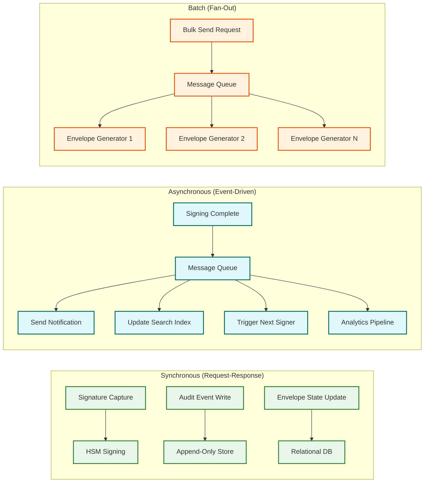

# High-Level Design

## System Architecture

```mermaid
flowchart TB
    subgraph Clients["Client Layer"]
        WEB[Web Application]
        MOB[Mobile App]
        API_CLIENT[API Integrations]
        EMBED[Embedded Signing iFrame]
    end

    subgraph Gateway["API Gateway Layer"]
        GW[API Gateway]
        AUTH[Auth Service]
        RL[Rate Limiter]
    end

    subgraph CoreServices["Core Services"]
        ENV[Envelope Service]
        SIGNER[Signer Workflow Service]
        DOC[Document Processing Service]
        SIG[Signature Capture Service]
        CERT[Certificate Service]
        SEAL[Document Sealing Service]
        TMPL[Template Service]
        BULK[Bulk Send Service]
    end

    subgraph SupportServices["Support Services"]
        AUDIT[Audit Service]
        NOTIF[Notification Service]
        FIELD[Field Detection Service]
        RENDER[PDF Rendering Service]
    end

    subgraph Security["Security Layer"]
        HSM[HSM Cluster]
        KMS_SVC[Key Management Service]
        IDP[Identity Provider]
    end

    subgraph DataLayer["Data Layer"]
        PG[(Relational DB<br/>Envelope State)]
        OBJSTORE[(Object Storage<br/>Documents)]
        AUDITLOG[(Append-Only Store<br/>Audit Trail)]
        CACHE[(Distributed Cache)]
        SEARCH[(Search Index)]
    end

    subgraph Messaging["Event Bus"]
        MQ[Message Queue]
        STREAM[Event Stream]
    end

    WEB --> GW
    MOB --> GW
    API_CLIENT --> GW
    EMBED --> GW

    GW --> AUTH
    GW --> RL
    GW --> ENV
    GW --> SIGNER
    GW --> SIG
    GW --> TMPL
    GW --> BULK

    ENV --> DOC
    ENV --> FIELD
    ENV --> PG
    ENV --> OBJSTORE

    SIGNER --> PG
    SIGNER --> NOTIF
    SIGNER --> MQ

    SIG --> HSM
    SIG --> CERT
    SIG --> AUDIT
    SIG --> PG

    CERT --> HSM
    CERT --> KMS_SVC

    SEAL --> DOC
    SEAL --> HSM
    SEAL --> OBJSTORE
    SEAL --> AUDIT

    DOC --> OBJSTORE
    DOC --> RENDER

    TMPL --> PG
    TMPL --> OBJSTORE

    BULK --> TMPL
    BULK --> ENV
    BULK --> MQ

    AUDIT --> AUDITLOG
    AUDIT --> STREAM

    NOTIF --> MQ

    AUTH --> IDP
    AUTH --> CACHE

    ENV --> CACHE
    SIGNER --> CACHE

    ENV --> SEARCH

    classDef client fill:#e1f5fe,stroke:#01579b,stroke-width:2px
    classDef gateway fill:#fff3e0,stroke:#e65100,stroke-width:2px
    classDef service fill:#e8f5e9,stroke:#2e7d32,stroke-width:2px
    classDef support fill:#e8eaf6,stroke:#283593,stroke-width:2px
    classDef security fill:#fce4ec,stroke:#880e4f,stroke-width:2px
    classDef data fill:#f3e5f5,stroke:#6a1b9a,stroke-width:2px
    classDef cache fill:#fffde7,stroke:#f57f17,stroke-width:2px
    classDef queue fill:#e0f7fa,stroke:#00695c,stroke-width:2px

    class WEB,MOB,API_CLIENT,EMBED client
    class GW,AUTH,RL gateway
    class ENV,SIGNER,DOC,SIG,CERT,SEAL,TMPL,BULK service
    class AUDIT,NOTIF,FIELD,RENDER support
    class HSM,KMS_SVC,IDP security
    class PG,OBJSTORE,AUDITLOG data
    class CACHE cache
    class MQ,STREAM,SEARCH queue
```



---

## Service Responsibilities

| Service | Responsibility | Stateful? | Critical Path? |
|---------|---------------|-----------|---------------|
| **Envelope Service** | Envelope lifecycle (create, update state, track progress) | Stateless (state in DB) | Yes |
| **Signer Workflow Service** | Signer routing order, turn management, reminder scheduling | Stateless | Yes |
| **Document Processing Service** | PDF conversion, page extraction, document storage/retrieval | Stateless | Yes |
| **Signature Capture Service** | Validate signature input, invoke HSM for digital signatures, record signature | Stateless | Yes |
| **Certificate Service** | X.509 certificate issuance, validation, revocation checking | Stateless | Yes (for AES/QES) |
| **Document Sealing Service** | Embed signatures into PDF, generate certificate of completion | Stateless | Yes (post-signing) |
| **Template Service** | Template CRUD, field inheritance, version management | Stateless | No |
| **Bulk Send Service** | Fan-out template to N recipients, envelope generation, progress tracking | Stateless | No |
| **Audit Service** | Hash-chain event recording, audit log queries, audit certificate generation | Stateless | Yes |
| **Notification Service** | Email, SMS, webhook delivery for all lifecycle events | Stateless | No (async) |
| **Field Detection Service** | Auto-detect signature placement from anchor text in PDFs | Stateless | No |
| **PDF Rendering Service** | Convert PDF pages to images for signing UI, overlay fields | Stateless | Yes (signing UX) |

---

## Data Flow: Complete Signing Lifecycle

### Phase 1: Envelope Creation

```
Sender → API Gateway → Envelope Service
    1. Create envelope record (status: DRAFT)
    2. Upload documents → Document Processing Service → Object Storage
    3. Convert to PDF if needed
    4. Place fields → Field Detection Service (auto) or manual placement
    5. Define signer routing order
    6. Envelope status → SENT
    7. Audit: "envelope.created", "envelope.sent"
    8. Signer Workflow Service → determine first signer(s)
    9. Notification Service → email first signer(s) with signing link
```

### Phase 2: Signer Authentication & Viewing

```
Signer clicks email link → API Gateway → Signer Workflow Service
    1. Validate signer token (time-limited, single-use per session)
    2. Authenticate signer (email verification, OTP, KBA as configured)
    3. Audit: "signer.authenticated" with IP, user agent, geolocation
    4. Load envelope → Envelope Service
    5. Render document → PDF Rendering Service → return page images with field overlays
    6. Audit: "envelope.viewed" by signer
```

### Phase 3: Signature Capture

```
Signer fills fields and signs → API Gateway → Signature Capture Service
    1. Validate all required fields are completed
    2. Capture signature input (drawn image, typed text, click-to-sign)
    3. For SES: Store signature image + metadata
    4. For AES/QES: Invoke HSM via Certificate Service
        a. Generate document hash (SHA-256)
        b. HSM signs hash with signer's private key
        c. Return PKCS#7 signature block
    5. Record signature → Relational DB
    6. Audit: "signature.captured" with signature metadata
    7. Signer Workflow Service → advance routing
        a. If more signers in current parallel group: wait
        b. If current group complete: activate next sequential group
        c. If all signers complete: trigger sealing
    8. Notification Service → notify next signer(s) or completion
```

### Phase 4: Document Sealing

```
All signatures captured → Document Sealing Service
    1. Load original documents from Object Storage
    2. For each signature:
        a. Embed signature image at field coordinates
        b. Embed PKCS#7/CAdES signature block into PDF
    3. Compute final document hash (SHA-256 over entire sealed PDF)
    4. HSM signs final hash → platform seal
    5. Generate Certificate of Completion:
        a. Signer names, emails, IP addresses, timestamps
        b. Document hashes (before and after signing)
        c. Hash chain summary from audit trail
    6. Store sealed PDF + certificate → Object Storage (immutable)
    7. Update envelope status → COMPLETED
    8. Audit: "envelope.completed", "document.sealed"
    9. Notification Service → email all parties with download links
```

### Phase 5: Retrieval & Verification

```
Any party requests document → API Gateway → Envelope Service
    1. Verify requester authorization (sender, signer, CC recipient)
    2. Retrieve sealed PDF from Object Storage
    3. Optionally: verify document integrity
        a. Recompute document hash
        b. Verify against stored hash and HSM signature
        c. Verify hash chain integrity in audit trail
    4. Return sealed PDF + certificate of completion + audit trail
    5. Audit: "document.downloaded" by requester
```

---

## Key Architectural Decisions

### 1. Envelope-Centric Data Model

**Decision**: Model the system around the "envelope" as the primary entity, containing documents, signers, fields, and audit events.

**Rationale**: An envelope is the atomic unit of a signing transaction. All signers, documents, and fields are scoped to a single envelope. This enables:
- Sharding by `envelope_id` for horizontal scaling
- Complete envelope retrieval in a single query path
- Clear lifecycle management (DRAFT → SENT → COMPLETED → SEALED)

**Trade-off**: Cross-envelope queries (e.g., "all envelopes signed by user X") require secondary indexes.

### 2. Append-Only Audit Trail with Hash Chaining

**Decision**: Store audit events in an append-only log with each event's hash computed over the event data + previous event's hash, forming a hash chain.

**Rationale**: Legal non-repudiation requires proving that audit records have not been tampered with. A hash chain makes any modification (insertion, deletion, reordering) mathematically detectable. A simple audit table with auto-increment IDs and timestamps is trivially modifiable by anyone with database access.

**Trade-off**: Hash chains create sequential write dependencies within an envelope's audit trail. Mitigated by per-envelope hash chains (not a global chain).

### 3. HSM for All Digital Signature Operations

**Decision**: All cryptographic signing operations (AES/QES level) must go through Hardware Security Modules. No private keys exist in application memory.

**Rationale**: Legal and compliance requirement. eIDAS Qualified signatures require keys on FIPS 140-2 Level 3 certified devices. Even for Advanced signatures, HSM-backed keys provide stronger non-repudiation defense.

**Trade-off**: HSM operations are slower (~50ms per sign) and capacity-limited. Mitigated by HSM cluster scaling and routing SES signatures (click-to-sign) through software path.

### 4. Event-Driven Architecture for Non-Critical Paths

**Decision**: Signature capture and audit recording are synchronous. Notifications, search indexing, analytics, and bulk send fan-out are asynchronous via message queue.

**Rationale**: Signing latency must be <500ms. Sending an email to the next signer can take 5-30 seconds. Decoupling non-critical paths from the signing critical path keeps the user experience responsive.

**Trade-off**: Notifications may be delayed by seconds to minutes. Acceptable because signers do not need to sign within seconds of being notified.

### 5. Immutable Document Storage

**Decision**: Once a document is sealed (all signatures embedded), the PDF is stored as an immutable blob in object storage with content-addressed addressing (hash of content = storage key).

**Rationale**: Immutability is a legal requirement for signed documents. Content-addressed storage provides built-in tamper detection---if the content changes, the hash changes, and the original is still retrievable.

**Trade-off**: Storage costs are higher (no in-place updates, old versions retained). Mitigated by object storage tier management (hot → warm → cold based on age).

### 6. Separate Signing Session Authentication

**Decision**: Signers authenticate via time-limited, single-use tokens sent via email, not via the sender's account credentials. Additional authentication (OTP, KBA) is layered on top.

**Rationale**: Signers may not be users of the platform. A signer could be a customer, vendor, or counterparty who has never registered. The signing session must be self-contained and not require platform registration.

**Trade-off**: Token-based authentication is vulnerable to email interception. Mitigated by short token expiry (24-72 hours), single-use sessions, and optional multi-factor authentication.

---

## Architecture Pattern Checklist

| Pattern | Decision | Justification |
|---------|----------|---------------|
| Sync vs Async | Sync for signing + audit; Async for notifications, search, analytics | Signing must be immediate; notifications can be delayed |
| Event-Driven vs Request-Response | Event-driven for post-signing workflows; request-response for signing flow | Event-driven enables decoupled scaling of downstream consumers |
| Push vs Pull | Push for signer notifications; pull for document retrieval | Signers need proactive notification; document download is on-demand |
| Stateless vs Stateful | Stateless services; state in relational DB and object storage | Enables horizontal scaling; state durability via database |
| Write-Heavy vs Read-Heavy | Write-heavy during signing; read-heavy for audit queries and document retrieval | Optimize write path for signing latency; cache for read path |
| Real-Time vs Batch | Real-time for signing; batch for bulk send fan-out and analytics | Signing is interactive; bulk operations are background |
| Edge vs Origin | Edge for PDF rendering/caching; origin for signing operations | Reduce latency for document viewing; centralize cryptographic operations |

---

## Communication Patterns


