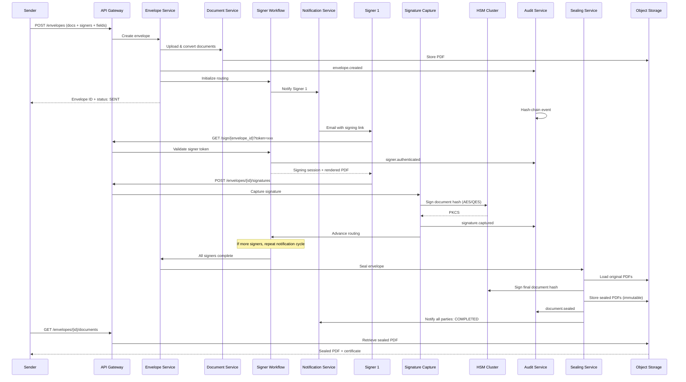

# Low-Level Design

## Data Model

### Core Entity Relationships

```mermaid
erDiagram
    ORGANIZATION {
        uuid id PK "Organization identifier"
        string name "Organization name"
        string plan "free, standard, business, enterprise"
        jsonb settings "Branding, default auth level, retention policy"
        string data_region "us, eu, apac --- data residency"
        timestamp created_at
    }

    ENVELOPE {
        uuid id PK "Envelope identifier"
        uuid org_id FK "Owning organization"
        uuid sender_id FK "User who created the envelope"
        string status "draft, sent, signing, completed, declined, voided, expired"
        string subject "Envelope subject line"
        string message "Message to signers"
        uuid template_id FK "Source template (null if ad-hoc)"
        uuid bulk_send_id FK "Bulk send batch (null if individual)"
        string routing_type "sequential, parallel, hybrid"
        jsonb routing_order "Ordered groups of signer IDs"
        int current_routing_step "Active step in routing"
        timestamp created_at
        timestamp sent_at
        timestamp completed_at
        timestamp expires_at
        string completion_certificate_key "Object storage key for cert of completion"
    }

    DOCUMENT {
        uuid id PK "Document identifier"
        uuid envelope_id FK "Parent envelope"
        string filename "Original filename"
        string content_type "application/pdf, image/png, etc."
        bigint size_bytes "File size"
        string original_storage_key "Object storage key for uploaded file"
        string pdf_storage_key "Object storage key for converted PDF"
        string sealed_storage_key "Object storage key for sealed PDF (post-signing)"
        string document_hash_sha256 "SHA-256 hash of original PDF content"
        string sealed_hash_sha256 "SHA-256 hash of sealed PDF"
        int page_count "Number of pages"
        int sort_order "Order within envelope"
        timestamp created_at
    }

    SIGNER {
        uuid id PK "Signer record identifier"
        uuid envelope_id FK "Parent envelope"
        string name "Signer full name"
        string email "Signer email address"
        string role "signer, cc, in_person_signer, witness, approver"
        int routing_group "Which group in routing order (0-indexed)"
        int group_order "Order within routing group"
        string status "pending, active, completed, declined, voided"
        string auth_method "email, email_otp, sms_otp, kba, id_verification"
        string signature_level "ses, aes, qes"
        uuid signing_token "Time-limited token for signing session"
        timestamp token_expires_at "Token expiration"
        timestamp viewed_at "When signer first viewed"
        timestamp signed_at "When signer completed signing"
        timestamp declined_at "When signer declined"
        string decline_reason "Reason for declining"
        string ip_address "IP at time of signing"
        string user_agent "Browser user agent at signing"
        timestamp created_at
    }

    SIGNATURE_FIELD {
        uuid id PK "Field identifier"
        uuid envelope_id FK "Parent envelope"
        uuid document_id FK "Which document"
        uuid signer_id FK "Assigned signer"
        string field_type "signature, initials, date_signed, text, checkbox, dropdown"
        int page_number "PDF page (1-indexed)"
        float x_position "X coordinate (points from left)"
        float y_position "Y coordinate (points from bottom)"
        float width "Field width in points"
        float height "Field height in points"
        boolean required "Is this field required"
        string default_value "Pre-filled value"
        jsonb validation_rules "Min/max length, regex pattern, allowed values"
        string anchor_text "Text anchor for auto-placement"
        timestamp created_at
    }

    SIGNATURE_RECORD {
        uuid id PK "Signature record identifier"
        uuid envelope_id FK "Parent envelope"
        uuid signer_id FK "Who signed"
        uuid field_id FK "Which signature field"
        string signature_type "click_to_sign, drawn, typed, uploaded, certificate"
        string signature_image_key "Object storage key for signature image"
        string typed_name "Name if typed signature"
        string font_family "Font if typed signature"
        string certificate_serial "X.509 certificate serial number (AES/QES)"
        string pkcs7_signature "Base64 PKCS#7 signature block"
        string document_hash "SHA-256 hash of document at time of signing"
        string ip_address "IP at time of signature"
        string user_agent "Browser user agent"
        timestamp signed_at
    }

    AUDIT_EVENT {
        uuid id PK "Event identifier"
        uuid envelope_id FK "Parent envelope"
        string event_type "envelope.created, envelope.sent, signer.viewed, signature.captured, envelope.completed, document.sealed, document.downloaded"
        uuid actor_id "User or signer who performed action"
        string actor_type "sender, signer, system, admin"
        string actor_email "Actor email for display"
        jsonb event_data "Event-specific data"
        string ip_address "Client IP"
        string user_agent "Client user agent"
        string geolocation "Approximate location from IP"
        string event_hash "SHA-256 hash of this event"
        string previous_hash "Hash of previous event in chain"
        int sequence_number "Monotonic sequence within envelope"
        timestamp created_at
    }

    CERTIFICATE {
        uuid id PK "Certificate identifier"
        uuid org_id FK "Owning organization"
        string serial_number "X.509 serial number"
        string subject_dn "Distinguished name"
        string issuer_dn "Issuer distinguished name"
        string public_key_pem "Public key (PEM encoded)"
        string hsm_key_id "Reference to private key in HSM"
        string key_algorithm "RSA-2048, ECDSA-P256"
        string status "active, revoked, expired"
        string certificate_level "aes, qes"
        uuid qtsp_id "Qualified Trust Service Provider (for QES)"
        timestamp valid_from
        timestamp valid_until
        timestamp revoked_at
    }

    TEMPLATE {
        uuid id PK "Template identifier"
        uuid org_id FK "Owning organization"
        string name "Template name"
        string description "Template description"
        int version "Template version number"
        jsonb signer_roles "Default signer role definitions"
        jsonb routing_order "Default routing configuration"
        jsonb field_definitions "Default field placements"
        uuid document_id FK "Template document"
        string status "active, archived"
        uuid creator_id FK "Who created"
        timestamp created_at
        timestamp updated_at
    }

    BULK_SEND {
        uuid id PK "Bulk send batch identifier"
        uuid org_id FK "Owning organization"
        uuid template_id FK "Source template"
        uuid sender_id FK "Who initiated"
        int total_recipients "Total envelopes to generate"
        int envelopes_created "Envelopes generated so far"
        int envelopes_completed "Envelopes fully signed"
        int envelopes_failed "Envelopes that failed"
        string status "queued, processing, completed, failed, cancelled"
        jsonb recipient_data_key "Object storage key for recipient CSV/JSON"
        timestamp created_at
        timestamp completed_at
    }

    COMPLETION_PACKAGE {
        uuid id PK "Package identifier"
        uuid envelope_id FK "Parent envelope"
        string sealed_pdf_key "Object storage key for sealed PDF"
        string certificate_pdf_key "Object storage key for certificate of completion"
        string audit_trail_pdf_key "Object storage key for audit trail PDF"
        string combined_hash "SHA-256 hash of entire package"
        string platform_signature "Platform HSM signature over combined hash"
        timestamp generated_at
    }

    ORGANIZATION ||--o{ ENVELOPE : "owns"
    ORGANIZATION ||--o{ TEMPLATE : "has templates"
    ORGANIZATION ||--o{ CERTIFICATE : "has certificates"
    ENVELOPE ||--o{ DOCUMENT : "contains"
    ENVELOPE ||--o{ SIGNER : "has signers"
    ENVELOPE ||--o{ SIGNATURE_FIELD : "has fields"
    ENVELOPE ||--o{ SIGNATURE_RECORD : "has signatures"
    ENVELOPE ||--o{ AUDIT_EVENT : "has audit events"
    ENVELOPE ||--|| COMPLETION_PACKAGE : "produces"
    TEMPLATE ||--o{ ENVELOPE : "instantiates"
    BULK_SEND ||--o{ ENVELOPE : "generates"
    SIGNER ||--o{ SIGNATURE_FIELD : "assigned to"
    SIGNER ||--o{ SIGNATURE_RECORD : "signs"
    DOCUMENT ||--o{ SIGNATURE_FIELD : "contains fields"
```



---

## Key Algorithms

### Hash-Chained Audit Trail

```
PSEUDOCODE: Tamper-Evident Audit Event Recording

FUNCTION record_audit_event(envelope_id, event_type, actor, event_data, request_context):
    // Step 1: Acquire envelope-level lock for sequential hash chaining
    ACQUIRE_LOCK("audit:" + envelope_id)

    TRY:
        // Step 2: Get the previous event in this envelope's chain
        previous_event = SELECT * FROM audit_events
                         WHERE envelope_id = envelope_id
                         ORDER BY sequence_number DESC
                         LIMIT 1

        IF previous_event IS NULL:
            previous_hash = SHA256("GENESIS:" + envelope_id)
            sequence_number = 0
        ELSE:
            previous_hash = previous_event.event_hash
            sequence_number = previous_event.sequence_number + 1

        // Step 3: Construct the canonical event representation
        canonical = CANONICAL_JSON({
            envelope_id: envelope_id,
            event_type: event_type,
            actor_id: actor.id,
            actor_type: actor.type,
            event_data: event_data,
            ip_address: request_context.ip,
            user_agent: request_context.user_agent,
            sequence_number: sequence_number,
            previous_hash: previous_hash,
            timestamp: NOW_UTC()
        })

        // Step 4: Compute event hash
        event_hash = SHA256(canonical)

        // Step 5: Insert event (append-only --- no updates, no deletes)
        INSERT INTO audit_events (
            id, envelope_id, event_type, actor_id, actor_type,
            actor_email, event_data, ip_address, user_agent,
            geolocation, event_hash, previous_hash,
            sequence_number, created_at
        ) VALUES (
            NEW_UUID(), envelope_id, event_type, actor.id, actor.type,
            actor.email, event_data, request_context.ip, request_context.user_agent,
            geolocate(request_context.ip), event_hash, previous_hash,
            sequence_number, NOW_UTC()
        )

        RETURN event_hash

    FINALLY:
        RELEASE_LOCK("audit:" + envelope_id)


FUNCTION verify_audit_chain(envelope_id):
    events = SELECT * FROM audit_events
             WHERE envelope_id = envelope_id
             ORDER BY sequence_number ASC

    expected_previous = SHA256("GENESIS:" + envelope_id)

    FOR event IN events:
        // Verify chain linkage
        IF event.previous_hash != expected_previous:
            RETURN {valid: false, broken_at: event.sequence_number,
                    reason: "Previous hash mismatch"}

        // Recompute event hash from canonical fields
        recomputed = SHA256(CANONICAL_JSON({
            envelope_id: event.envelope_id,
            event_type: event.event_type,
            actor_id: event.actor_id,
            actor_type: event.actor_type,
            event_data: event.event_data,
            ip_address: event.ip_address,
            user_agent: event.user_agent,
            sequence_number: event.sequence_number,
            previous_hash: event.previous_hash,
            timestamp: event.created_at
        }))

        IF recomputed != event.event_hash:
            RETURN {valid: false, broken_at: event.sequence_number,
                    reason: "Event hash mismatch --- data tampered"}

        expected_previous = event.event_hash

    RETURN {valid: true, event_count: LEN(events),
            chain_head: events[LAST].event_hash}
```

### Signer Routing State Machine

```
PSEUDOCODE: Multi-Party Routing Engine

STRUCTURE RoutingOrder:
    groups: list[RoutingGroup]    // Ordered list of groups

STRUCTURE RoutingGroup:
    group_index: int
    signers: list[SignerRef]
    mode: "all_must_sign" | "any_one_signs" | "minimum_n"
    minimum_count: int           // For minimum_n mode
    status: "pending" | "active" | "completed" | "declined"

FUNCTION advance_routing(envelope_id, completed_signer_id):
    envelope = GET_ENVELOPE(envelope_id)
    routing = PARSE_ROUTING(envelope.routing_order)

    // Mark signer as completed
    UPDATE signers SET status = 'completed', signed_at = NOW()
    WHERE id = completed_signer_id

    // Check if current group is complete
    current_group = routing.groups[envelope.current_routing_step]
    group_signers = GET_SIGNERS_IN_GROUP(envelope_id, current_group.group_index)

    group_complete = FALSE

    SWITCH current_group.mode:
        CASE "all_must_sign":
            completed_count = COUNT(s FOR s IN group_signers WHERE s.status == 'completed')
            group_complete = (completed_count == LEN(group_signers))

        CASE "any_one_signs":
            group_complete = TRUE  // One signer completed, group is done
            // Mark remaining signers as voided
            FOR s IN group_signers WHERE s.status == 'pending' OR s.status == 'active':
                UPDATE signers SET status = 'voided' WHERE id = s.id

        CASE "minimum_n":
            completed_count = COUNT(s FOR s IN group_signers WHERE s.status == 'completed')
            group_complete = (completed_count >= current_group.minimum_count)

    IF NOT group_complete:
        RETURN  // Wait for more signers in current group

    // Advance to next group
    next_step = envelope.current_routing_step + 1

    IF next_step >= LEN(routing.groups):
        // All groups complete --- trigger sealing
        UPDATE envelopes SET status = 'completed', completed_at = NOW()
        WHERE id = envelope_id
        EMIT_EVENT("envelope.all_signed", envelope_id)
        RETURN

    // Activate next group
    UPDATE envelopes SET current_routing_step = next_step WHERE id = envelope_id
    next_group = routing.groups[next_step]

    FOR signer IN GET_SIGNERS_IN_GROUP(envelope_id, next_group.group_index):
        UPDATE signers SET status = 'active',
                          signing_token = GENERATE_SECURE_TOKEN(),
                          token_expires_at = NOW() + CONFIGURED_EXPIRY
        WHERE id = signer.id

        EMIT_EVENT("signer.activated", {signer_id: signer.id, envelope_id: envelope_id})


FUNCTION handle_decline(envelope_id, signer_id, decline_reason):
    signer = GET_SIGNER(signer_id)
    envelope = GET_ENVELOPE(envelope_id)

    UPDATE signers SET status = 'declined',
                      declined_at = NOW(),
                      decline_reason = decline_reason
    WHERE id = signer_id

    record_audit_event(envelope_id, "signer.declined", signer,
                       {reason: decline_reason}, request_context)

    // Check for conditional routing (alternate signer)
    alternate = GET_ALTERNATE_SIGNER(envelope_id, signer_id)

    IF alternate IS NOT NULL:
        // Route to alternate signer
        UPDATE signers SET status = 'active',
                          signing_token = GENERATE_SECURE_TOKEN(),
                          token_expires_at = NOW() + CONFIGURED_EXPIRY
        WHERE id = alternate.id
        EMIT_EVENT("signer.activated", {signer_id: alternate.id})
    ELSE:
        // No alternate --- void the envelope
        UPDATE envelopes SET status = 'declined' WHERE id = envelope_id
        // Notify all parties
        EMIT_EVENT("envelope.declined", {envelope_id: envelope_id, declined_by: signer_id})
```

### Document Sealing Algorithm

```
PSEUDOCODE: PDF Signature Embedding and Sealing

FUNCTION seal_envelope(envelope_id):
    envelope = GET_ENVELOPE(envelope_id)
    documents = GET_DOCUMENTS(envelope_id)
    signatures = GET_ALL_SIGNATURES(envelope_id)

    sealed_documents = []

    FOR document IN documents:
        pdf_bytes = LOAD_FROM_OBJECT_STORAGE(document.pdf_storage_key)
        doc_signatures = FILTER(signatures, WHERE document_id == document.id)

        sealed_pdf = embed_signatures_in_pdf(pdf_bytes, doc_signatures)
        sealed_documents.append(sealed_pdf)

    // Generate certificate of completion
    certificate = generate_completion_certificate(envelope, sealed_documents)

    // Generate audit trail PDF
    audit_pdf = generate_audit_trail_pdf(envelope_id)

    // Create completion package
    combined_bytes = CONCATENATE(
        [doc.bytes FOR doc IN sealed_documents],
        certificate.bytes,
        audit_pdf.bytes
    )
    combined_hash = SHA256(combined_bytes)

    // Platform signs the package
    platform_signature = HSM_SIGN(combined_hash, PLATFORM_SIGNING_KEY)

    // Store everything immutably
    FOR doc IN sealed_documents:
        key = "sealed/" + envelope_id + "/" + doc.document_id + ".pdf"
        STORE_IMMUTABLE(key, doc.bytes)
        UPDATE documents SET sealed_storage_key = key,
                            sealed_hash_sha256 = SHA256(doc.bytes)
        WHERE id = doc.document_id

    cert_key = "sealed/" + envelope_id + "/certificate.pdf"
    audit_key = "sealed/" + envelope_id + "/audit_trail.pdf"
    STORE_IMMUTABLE(cert_key, certificate.bytes)
    STORE_IMMUTABLE(audit_key, audit_pdf.bytes)

    INSERT INTO completion_packages (
        id, envelope_id, sealed_pdf_key, certificate_pdf_key,
        audit_trail_pdf_key, combined_hash, platform_signature, generated_at
    ) VALUES (NEW_UUID(), envelope_id, ..., combined_hash, platform_signature, NOW())

    UPDATE envelopes SET status = 'sealed',
                        completion_certificate_key = cert_key
    WHERE id = envelope_id

    record_audit_event(envelope_id, "document.sealed", SYSTEM_ACTOR,
                       {combined_hash: combined_hash}, SYSTEM_CONTEXT)


FUNCTION embed_signatures_in_pdf(pdf_bytes, signatures):
    pdf = PARSE_PDF(pdf_bytes)

    FOR sig IN signatures:
        field = GET_FIELD(sig.field_id)

        IF field.field_type == "signature":
            // Embed signature appearance (image) at field coordinates
            sig_image = LOAD_FROM_OBJECT_STORAGE(sig.signature_image_key)
            pdf.add_image_annotation(
                page = field.page_number,
                x = field.x_position,
                y = field.y_position,
                width = field.width,
                height = field.height,
                image = sig_image
            )

        IF sig.pkcs7_signature IS NOT NULL:
            // Embed PKCS#7 digital signature into PDF signature dictionary
            pdf.add_digital_signature(
                page = field.page_number,
                x = field.x_position,
                y = field.y_position,
                pkcs7_block = DECODE_BASE64(sig.pkcs7_signature),
                signer_name = sig.signer.name,
                signing_time = sig.signed_at,
                reason = "Document signed via Digital Signature Platform",
                location = sig.signer.geolocation
            )

    // Finalize PDF with incremental save (preserves original content)
    sealed_bytes = pdf.save_incremental()

    RETURN {document_id: ..., bytes: sealed_bytes}


FUNCTION generate_completion_certificate(envelope, sealed_documents):
    signers = GET_SIGNERS(envelope.id)

    certificate_data = {
        envelope_id: envelope.id,
        subject: envelope.subject,
        created_at: envelope.created_at,
        completed_at: envelope.completed_at,
        documents: [
            {
                filename: doc.filename,
                page_count: doc.page_count,
                original_hash: doc.document_hash_sha256,
                sealed_hash: SHA256(doc.bytes)
            }
            FOR doc IN sealed_documents
        ],
        signers: [
            {
                name: signer.name,
                email: signer.email,
                status: signer.status,
                signed_at: signer.signed_at,
                ip_address: signer.ip_address,
                auth_method: signer.auth_method,
                signature_level: signer.signature_level
            }
            FOR signer IN signers
        ],
        audit_chain_head: GET_CHAIN_HEAD_HASH(envelope.id),
        audit_event_count: GET_AUDIT_EVENT_COUNT(envelope.id),
        platform_version: PLATFORM_VERSION,
        generated_at: NOW_UTC()
    }

    // Render as a formatted PDF
    pdf = RENDER_CERTIFICATE_PDF(certificate_data)

    RETURN {bytes: pdf, data: certificate_data}
```

### Signer Token Generation and Validation

```
PSEUDOCODE: Signer Session Security

FUNCTION generate_signer_token(signer_id, envelope_id):
    // Generate cryptographically random token
    token = SECURE_RANDOM_BYTES(32)
    token_hash = SHA256(token)  // Store hash, not plaintext

    // Set expiry based on org configuration (default: 72 hours)
    org = GET_ORG_FOR_ENVELOPE(envelope_id)
    expiry_hours = org.settings.signer_token_expiry_hours OR 72

    UPDATE signers SET signing_token = token_hash,
                      token_expires_at = NOW() + HOURS(expiry_hours)
    WHERE id = signer_id

    // Build signing URL: includes token + envelope ID
    signing_url = PLATFORM_BASE_URL + "/sign/" + envelope_id + "?token=" + BASE64URL(token)

    RETURN signing_url


FUNCTION validate_signer_session(envelope_id, token, request_context):
    token_hash = SHA256(DECODE_BASE64URL(token))

    signer = SELECT * FROM signers
             WHERE envelope_id = envelope_id
               AND signing_token = token_hash
               AND status IN ('active', 'pending')

    IF signer IS NULL:
        RETURN {valid: false, reason: "Invalid or expired token"}

    IF signer.token_expires_at < NOW():
        RETURN {valid: false, reason: "Token expired"}

    // Check envelope is still in a signable state
    envelope = GET_ENVELOPE(envelope_id)
    IF envelope.status NOT IN ('sent', 'signing'):
        RETURN {valid: false, reason: "Envelope no longer available for signing"}

    // Additional authentication if configured
    IF signer.auth_method != 'email':
        IF NOT session_has_completed_auth(signer.id, signer.auth_method):
            RETURN {valid: false, reason: "Additional authentication required",
                    auth_required: signer.auth_method}

    // Record session
    record_audit_event(envelope_id, "signer.session_started", signer,
                       {auth_method: signer.auth_method}, request_context)

    RETURN {valid: true, signer: signer, envelope: envelope}
```

---

## Sequence Diagram: Full Signing Flow



---

## API Design

### Envelope Operations

```
POST   /api/v1/envelopes                                Create envelope (with docs, signers, fields)
GET    /api/v1/envelopes                                List envelopes (filtered by status, date range)
GET    /api/v1/envelopes/{envelope_id}                   Get envelope details + status
PUT    /api/v1/envelopes/{envelope_id}                   Update draft envelope
DELETE /api/v1/envelopes/{envelope_id}                   Void/delete envelope
POST   /api/v1/envelopes/{envelope_id}/send              Send envelope (transition DRAFT → SENT)
POST   /api/v1/envelopes/{envelope_id}/void              Void an in-progress envelope
POST   /api/v1/envelopes/{envelope_id}/resend            Resend notification to pending signers
```

### Document Operations

```
POST   /api/v1/envelopes/{envelope_id}/documents         Upload document to envelope
GET    /api/v1/envelopes/{envelope_id}/documents          List documents in envelope
GET    /api/v1/envelopes/{envelope_id}/documents/{doc_id} Download document (original or sealed)
GET    /api/v1/envelopes/{envelope_id}/documents/{doc_id}/pages/{page}  Get rendered page image
```

### Signer & Field Operations

```
POST   /api/v1/envelopes/{envelope_id}/signers            Add signer to envelope
PUT    /api/v1/envelopes/{envelope_id}/signers/{signer_id} Update signer details
DELETE /api/v1/envelopes/{envelope_id}/signers/{signer_id} Remove signer

POST   /api/v1/envelopes/{envelope_id}/fields              Place fields on documents
PUT    /api/v1/envelopes/{envelope_id}/fields/{field_id}    Update field position/properties
DELETE /api/v1/envelopes/{envelope_id}/fields/{field_id}    Remove field
```

### Signing Session (Signer-Facing)

```
GET    /api/v1/signing/{envelope_id}?token={token}         Initialize signing session
POST   /api/v1/signing/{envelope_id}/auth                  Complete additional authentication (OTP, KBA)
GET    /api/v1/signing/{envelope_id}/documents              Get documents for signing (rendered pages + fields)
POST   /api/v1/signing/{envelope_id}/fields/{field_id}      Fill a field value
POST   /api/v1/signing/{envelope_id}/signatures             Submit signature(s)
POST   /api/v1/signing/{envelope_id}/decline                Decline to sign
GET    /api/v1/signing/{envelope_id}/complete               Get completion status
```

### Completion & Audit

```
GET    /api/v1/envelopes/{envelope_id}/certificate          Download certificate of completion
GET    /api/v1/envelopes/{envelope_id}/audit                Get audit trail (JSON or PDF)
POST   /api/v1/envelopes/{envelope_id}/verify               Verify document integrity and hash chain
```

### Templates & Bulk Send

```
POST   /api/v1/templates                                    Create template
GET    /api/v1/templates                                    List templates
GET    /api/v1/templates/{template_id}                       Get template details
PUT    /api/v1/templates/{template_id}                       Update template (creates new version)
DELETE /api/v1/templates/{template_id}                       Archive template

POST   /api/v1/bulk-send                                    Initiate bulk send (template + recipient list)
GET    /api/v1/bulk-send/{batch_id}                          Get bulk send progress
GET    /api/v1/bulk-send/{batch_id}/envelopes                List generated envelopes
POST   /api/v1/bulk-send/{batch_id}/cancel                   Cancel remaining unsent envelopes
```

### Rate Limiting

| Endpoint Category | Limit | Window | Strategy |
|------------------|-------|--------|----------|
| Envelope creation | 100 req/min | Sliding window | Per org |
| Signature submission | 60 req/min | Sliding window | Per signer session |
| Document upload | 30 req/min | Sliding window | Per user |
| Document download | 300 req/min | Sliding window | Per user |
| Audit trail queries | 60 req/min | Sliding window | Per user |
| Bulk send initiation | 10 req/hour | Fixed window | Per org |
| Template operations | 120 req/min | Sliding window | Per org |
| Signing session | 120 req/min | Sliding window | Per token |

---

## Indexing Strategy

| Index | Table | Columns | Purpose |
|-------|-------|---------|---------|
| `idx_envelope_org_status` | ENVELOPE | `(org_id, status, created_at DESC)` | List envelopes by org and status |
| `idx_envelope_sender` | ENVELOPE | `(sender_id, created_at DESC)` | Sender's envelope history |
| `idx_envelope_bulk` | ENVELOPE | `(bulk_send_id)` | Bulk send batch tracking |
| `idx_signer_envelope` | SIGNER | `(envelope_id, routing_group, group_order)` | Routing order lookup |
| `idx_signer_email` | SIGNER | `(email, status)` | Find envelopes for a signer by email |
| `idx_signer_token` | SIGNER | `(signing_token)` UNIQUE | Token validation during signing |
| `idx_field_envelope_doc` | SIGNATURE_FIELD | `(envelope_id, document_id, page_number)` | Field rendering per page |
| `idx_field_signer` | SIGNATURE_FIELD | `(signer_id)` | Fields assigned to a signer |
| `idx_signature_envelope` | SIGNATURE_RECORD | `(envelope_id)` | All signatures in an envelope |
| `idx_audit_envelope_seq` | AUDIT_EVENT | `(envelope_id, sequence_number)` | Hash chain traversal |
| `idx_audit_actor` | AUDIT_EVENT | `(actor_id, created_at DESC)` | User activity audit |
| `idx_document_envelope` | DOCUMENT | `(envelope_id, sort_order)` | Documents in envelope order |
| `idx_certificate_org` | CERTIFICATE | `(org_id, status)` | Active certificates per org |
| `idx_template_org` | TEMPLATE | `(org_id, status)` | Templates per org |
| `idx_bulk_org` | BULK_SEND | `(org_id, created_at DESC)` | Bulk send history per org |

### Partitioning / Sharding

| Data | Shard Key | Strategy |
|------|-----------|----------|
| Envelopes + Signers + Fields | `envelope_id` | All envelope data co-located on same shard |
| Audit Events | `envelope_id` | Co-located with envelope for atomic hash chain writes |
| Documents (metadata) | `envelope_id` | Co-located with envelope |
| Document blobs (object storage) | Content-addressed hash | Distributed by hash across object storage nodes |
| Templates | `org_id` | Templates co-located per org |
| Certificates | `org_id` | Certificates co-located per org |
| Bulk Send | `org_id` | Bulk operations scoped per org |
