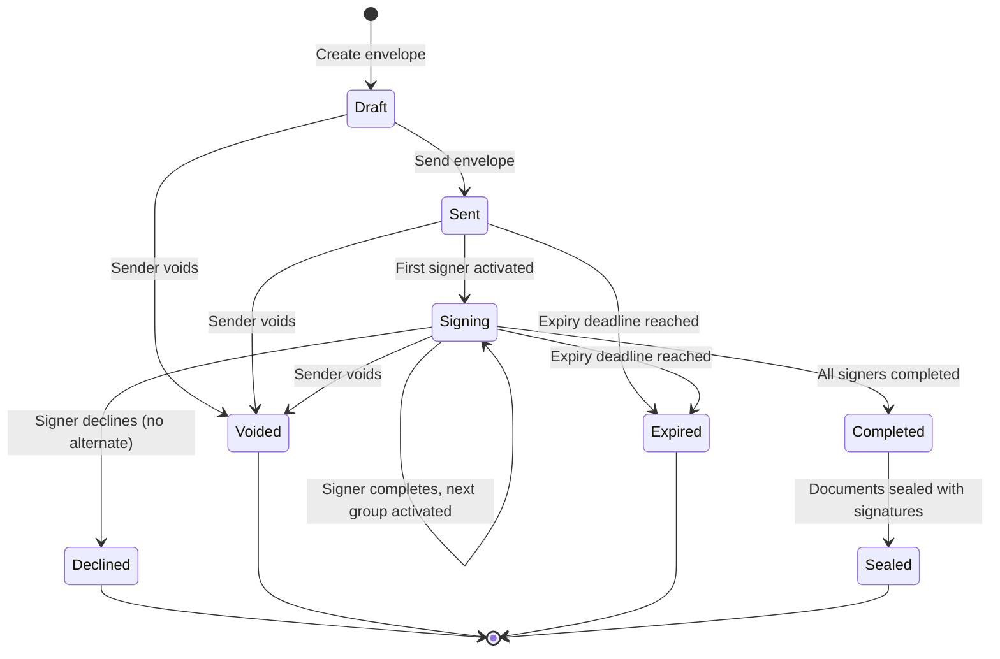

# Deep Dive & Bottlenecks

## Deep Dive 1: Cryptographic Audit Trail

### Why This Is Critical

The audit trail is not just a log---it is the legal foundation of every signed document. In court, the question is not "did they click a button?" but "can you mathematically prove that this specific person performed this specific action at this specific time, and that this record has not been modified since?" A simple database table with `id`, `timestamp`, `action`, and `user_id` fails this test because anyone with database access can insert, modify, or delete rows without detection.

### How Hash Chaining Works

Each audit event within an envelope forms a chain:

```
Event 0 (Genesis):
    hash_0 = SHA256("GENESIS:" + envelope_id)

Event 1 (envelope.created):
    canonical_1 = {envelope_id, "envelope.created", sender, timestamp_1, hash_0, ...}
    hash_1 = SHA256(canonical_1)

Event 2 (envelope.sent):
    canonical_2 = {envelope_id, "envelope.sent", sender, timestamp_2, hash_1, ...}
    hash_2 = SHA256(canonical_2)

Event 3 (signer.viewed):
    canonical_3 = {envelope_id, "signer.viewed", signer_1, timestamp_3, hash_2, ...}
    hash_3 = SHA256(canonical_3)

...and so on
```

**Tamper detection**: If an attacker modifies Event 2 (e.g., changes the timestamp), the hash of Event 2 changes. But Event 3 includes Event 2's original hash in its computation. Recomputing Event 3's hash will produce a different value than what is stored. The chain is broken, and the tampering is mathematically provable.

### What Makes It Tamper-Evident

| Attack | Detection Mechanism |
|--------|-------------------|
| **Modify an event's data** | Recomputed hash differs from stored hash |
| **Delete an event** | Next event's `previous_hash` points to a non-existent event |
| **Insert a fake event** | Sequence number gap or hash chain breaks at insertion point |
| **Reorder events** | Sequence numbers and hash chain both detect reordering |
| **Modify the entire chain** | External timestamping service holds periodic snapshots of chain head hash |

### Public Timestamping for External Anchoring

Hash chains prove internal consistency, but cannot prove when events occurred if the entire database is compromised. To anchor the chain to real-world time:

1. **Periodic anchoring**: Every N events (or every hour), the chain head hash is submitted to a public timestamping service (RFC 3161 Time Stamping Authority).
2. The TSA returns a signed timestamp token proving that the hash existed at that time.
3. Even if the platform's database is completely compromised, the TSA timestamps prove the chain state at specific points in time.
4. Between anchor points, the hash chain proves the relative ordering and integrity of events.

### Supporting Legal Non-Repudiation

Non-repudiation means a signer cannot later deny signing. The audit trail provides:

1. **Identity binding**: The signer authenticated (email token + optional OTP/KBA), and the authentication event is recorded with IP, user agent, and geolocation.
2. **Action binding**: The exact signature action (which fields, what document hash, what timestamp) is recorded.
3. **Integrity binding**: The hash chain proves no events were added, removed, or modified after the fact.
4. **Temporal binding**: TSA anchoring proves when events occurred.
5. **Platform non-participation**: Because the hash chain is mathematically verifiable by any party (not just the platform), the platform cannot collude with one party to modify records.

---

## Deep Dive 2: Multi-Party Sequential Routing

### State Machine



### Routing Complexity

The routing engine must support three modes:

**Sequential**: Signer 1 → Signer 2 → Signer 3 (each signs after the previous completes)

```
routing_order: [
    {group: 0, signers: [signer_1], mode: "all_must_sign"},
    {group: 1, signers: [signer_2], mode: "all_must_sign"},
    {group: 2, signers: [signer_3], mode: "all_must_sign"}
]
```

**Parallel**: Signers 1, 2, 3 all sign simultaneously

```
routing_order: [
    {group: 0, signers: [signer_1, signer_2, signer_3], mode: "all_must_sign"}
]
```

**Hybrid**: Signer 1 first, then Signers 2 and 3 in parallel, then Signer 4

```
routing_order: [
    {group: 0, signers: [signer_1], mode: "all_must_sign"},
    {group: 1, signers: [signer_2, signer_3], mode: "all_must_sign"},
    {group: 2, signers: [signer_4], mode: "all_must_sign"}
]
```

### Decline and Void Handling

| Scenario | Behavior |
|----------|----------|
| **Signer declines, alternate exists** | Activate alternate signer; original signer marked as declined |
| **Signer declines, no alternate** | Envelope status → DECLINED; all parties notified |
| **Sender voids envelope** | All active signing sessions invalidated; all parties notified |
| **Envelope expires** | Status → EXPIRED; no further signing allowed; sender can resend |
| **Signer token expires** | Signer can request new token (resend); existing session invalidated |

### Reminder Scheduling

```
PSEUDOCODE: Reminder Engine

FUNCTION schedule_reminders(envelope_id, signer_id):
    org_config = GET_ORG_REMINDER_CONFIG(envelope_id)
    // Default: reminders at 1 day, 3 days, 7 days after activation

    FOR interval IN org_config.reminder_intervals:
        SCHEDULE_JOB(
            job_type = "signer_reminder",
            execute_at = NOW() + interval,
            payload = {envelope_id, signer_id},
            idempotency_key = "reminder:" + signer_id + ":" + interval
        )

FUNCTION execute_reminder(envelope_id, signer_id):
    signer = GET_SIGNER(signer_id)

    // Don't send if signer already completed or envelope is done
    IF signer.status NOT IN ('active', 'pending'):
        RETURN  // Signer already acted

    envelope = GET_ENVELOPE(envelope_id)
    IF envelope.status NOT IN ('sent', 'signing'):
        RETURN  // Envelope no longer active

    EMIT_EVENT("signer.reminder", {signer_id, envelope_id})
    record_audit_event(envelope_id, "reminder.sent", SYSTEM_ACTOR,
                       {signer_id, reminder_number: ...}, SYSTEM_CONTEXT)
```

### Race Conditions in Parallel Signing

When multiple signers in the same group sign simultaneously:

1. **Concurrent completion check**: Two signers complete at the same time. Both check if the group is complete. Without coordination, both may try to advance the routing.
2. **Solution**: Use optimistic concurrency control on the envelope's `current_routing_step` field. The `advance_routing` function uses `UPDATE ... WHERE current_routing_step = expected_step` and checks affected rows. If 0 rows affected, another signer already advanced the routing.
3. **Alternative**: Use a distributed lock per envelope for routing advancement, but this adds latency. Optimistic concurrency is preferred because contention is rare (parallel groups typically have 2-5 signers, not hundreds).

---

## Deep Dive 3: Document Sealing

### Why Embedding Signatures Matters

Sealing a document means embedding the cryptographic signatures directly into the PDF file so that:
1. Any standard PDF reader (Adobe Acrobat, Preview) can verify the signatures
2. Post-signing modifications are detected without needing the platform
3. The signed document is self-contained---it does not require platform availability to verify

### PDF Signature Architecture

A PDF digital signature uses the PDF specification's signature dictionary and PKCS#7/CAdES format:

```
PDF Structure (after signing):
┌──────────────────────────────────┐
│ Original PDF Content             │
│ (pages, text, images, fonts)     │
│                                  │
│ Signature Field Dictionary:      │
│   /Type /Sig                     │
│   /Filter /Adobe.PPKLite         │
│   /SubFilter /adbe.pkcs7.detached│
│   /ByteRange [0 offset1          │
│               offset2 end]       │
│   /Contents <PKCS#7 DER bytes>   │
│   /Name (Signer Name)            │
│   /M (D:20260308120000Z)         │
│   /Reason (Signed via Platform)  │
│                                  │
│ Incremental Save Section:        │
│ (preserves original bytes)       │
└──────────────────────────────────┘
```

**Key concept: ByteRange**. The signature covers specific byte ranges of the PDF. The `/ByteRange` array specifies which bytes are signed---everything except the signature value itself. This means:
- The signature covers the original document content
- It covers the signature dictionary (metadata about who signed, when)
- It does NOT cover the signature value bytes (because those are what we are computing)

### Why Post-Signing Modification Is Detectable

1. After signing, the PDF is saved with an incremental update (new content appended, original bytes unchanged).
2. If someone modifies the document after signing (even changing a single character), the byte ranges covered by the signature change.
3. When a PDF reader verifies the signature, it recomputes the hash over the ByteRange and compares it to the hash in the PKCS#7 block. A mismatch → "Document has been modified after signing."

### Certificate of Completion as Standalone Package

The certificate of completion is a separate PDF that:
- Lists all signers with their authentication details, IP addresses, and timestamps
- Includes the document hash (both original and sealed)
- Includes the audit trail chain head hash
- Is itself signed by the platform's HSM key
- Can be independently verified without platform access

This serves as a **portable proof** that the signing ceremony occurred as described.

### Multi-Signature Document Challenges

When a document has multiple signers, each signer's signature must cover the previous signers' signatures:

```
Signer 1 signs: Hash covers original document
Signer 2 signs: Hash covers original document + Signer 1's signature (incremental save)
Signer 3 signs: Hash covers original + Signer 1 + Signer 2 (incremental save)
```

Each incremental save preserves all previous content. The final document contains all signatures, each verifiable independently, and each covering all previous content.

---

## Deep Dive 4: HSM-Based Key Management

### Why Software Key Storage Is Insufficient

For legally binding digital signatures (especially eIDAS Advanced and Qualified levels), private keys must never exist in plaintext in application memory:

| Key Storage | Legal Acceptance | Tamper Resistance | Key Extraction | Suitable For |
|------------|-----------------|-------------------|---------------|-------------|
| **Software (file on disk)** | SES only | None---anyone with file access can copy | Trivial | Low-value signatures |
| **Software (encrypted file)** | SES only | Password/key needed, but extractable in memory | Possible with memory dump | Development, testing |
| **HSM (FIPS 140-2 Level 2)** | AES | Tamper-evident | Difficult | Advanced signatures |
| **HSM (FIPS 140-2 Level 3)** | QES | Tamper-resistant, key zeroization on tamper | Near-impossible | Qualified signatures, legal compliance |

### Key Hierarchy

```
Root CA Key (offline, air-gapped HSM)
├── Intermediate CA Key (online HSM, rarely used)
│   ├── Platform Signing Key (online HSM, used for document sealing)
│   ├── Org Signing Keys (per-organization, online HSM)
│   │   ├── User Certificate 1 (issued per signer for AES/QES)
│   │   ├── User Certificate 2
│   │   └── ...
│   └── Timestamp Signing Key (for RFC 3161 timestamps)
└── Disaster Recovery Key (offline, geographically separated)
```

### Key Rotation Without Invalidating Past Signatures

Key rotation is necessary (keys expire, algorithms strengthen), but past signatures must remain valid:

1. **New key generation**: Generate new intermediate/signing key in HSM
2. **Cross-certification**: Old intermediate CA signs new intermediate CA's certificate, and vice versa
3. **Certificate chain**: Old signatures verify via: Document → User Cert → Old Intermediate → Root CA. New signatures verify via: Document → User Cert → New Intermediate → Root CA. Both chains lead to the same Root CA.
4. **CRL/OCSP**: Old keys are marked as "superseded" (not "revoked"), so old signatures remain valid
5. **Transition period**: Both old and new keys are active simultaneously for a configured overlap period

### HSM Cluster Architecture

```
PSEUDOCODE: HSM Request Routing

FUNCTION hsm_sign(data_hash, key_id):
    // Step 1: Determine which HSM holds the key
    key_location = KEY_REGISTRY.get(key_id)

    // Step 2: Route to available HSM in the key's cluster
    available_hsms = key_location.hsm_cluster.get_healthy_nodes()

    IF LEN(available_hsms) == 0:
        // Failover to secondary HSM cluster (geo-replicated)
        available_hsms = key_location.secondary_cluster.get_healthy_nodes()
        IF LEN(available_hsms) == 0:
            RAISE HSMUnavailableError("No HSM nodes available")

    // Step 3: Round-robin across available HSMs for load balancing
    hsm = available_hsms[ROUND_ROBIN_INDEX % LEN(available_hsms)]

    // Step 4: Execute signing operation
    signature = hsm.sign(
        algorithm = key_location.algorithm,  // RSA-2048 or ECDSA-P256
        key_handle = key_location.handle,
        data = data_hash,
        padding = PKCS1_V1_5 or PSS
    )

    RETURN signature
```

### HSM Failure Modes

| Failure | Impact | Mitigation |
|---------|--------|------------|
| **Single HSM node down** | Reduced capacity | Cluster with N+1 redundancy; automatic failover |
| **Entire HSM cluster down** | AES/QES signatures blocked | Geo-replicated secondary cluster; SES signatures continue (software path) |
| **HSM key corruption** | Specific org's signatures blocked | Key backup in escrow HSM; restore from backup |
| **HSM latency spike** | Signing operations slow | Circuit breaker; queue signing requests; alert on p99 > 200ms |

---

## Deep Dive 5: Large-Scale Template Management and Bulk Send

### Template System Architecture

Templates are the reusable building blocks for high-volume signing:

```
Template contains:
- Base document (PDF stored in object storage)
- Field definitions (positions, types, assigned roles)
- Signer role definitions (not specific people, but roles like "Employee", "Manager")
- Default routing order
- Custom field variables (merge fields for per-recipient data)
- Notification settings
```

### Bulk Send: Fan-Out Architecture

When a sender initiates a bulk send (1 template → 10,000 recipients):

```
PSEUDOCODE: Bulk Send Fan-Out

FUNCTION initiate_bulk_send(template_id, recipient_data, sender_id):
    template = GET_TEMPLATE(template_id)

    // Validate recipient data
    FOR recipient IN recipient_data:
        validate_required_fields(recipient, template.signer_roles)
        validate_email(recipient.email)

    // Create bulk send batch record
    batch = INSERT INTO bulk_sends (
        id: NEW_UUID(),
        org_id: sender.org_id,
        template_id: template_id,
        sender_id: sender_id,
        total_recipients: LEN(recipient_data),
        status: 'queued'
    )

    // Store recipient data in object storage (could be large)
    recipient_key = "bulk/" + batch.id + "/recipients.json"
    STORE(recipient_key, SERIALIZE(recipient_data))

    // Enqueue fan-out messages in batches of 100
    FOR chunk IN CHUNK(recipient_data, size=100):
        ENQUEUE("bulk_send_fanout", {
            batch_id: batch.id,
            template_id: template_id,
            sender_id: sender_id,
            recipients: chunk,
            idempotency_key: batch.id + ":" + chunk.start_index
        })

    RETURN batch.id


FUNCTION process_bulk_send_chunk(message):
    batch = GET_BULK_SEND(message.batch_id)
    IF batch.status == 'cancelled':
        RETURN  // Batch was cancelled

    template = GET_TEMPLATE(message.template_id)

    FOR recipient IN message.recipients:
        TRY:
            // Create individual envelope from template
            envelope = create_envelope_from_template(
                template = template,
                sender_id = message.sender_id,
                recipient_data = recipient,
                bulk_send_id = message.batch_id,
                idempotency_key = message.batch_id + ":" + recipient.email
            )

            // Immediately send the envelope
            send_envelope(envelope.id)

            // Update batch progress (atomic increment)
            ATOMIC_INCREMENT(bulk_sends, batch.id, 'envelopes_created', 1)

        CATCH error:
            LOG_ERROR("Bulk send envelope creation failed", {
                batch_id: message.batch_id,
                recipient: recipient.email,
                error: error
            })
            ATOMIC_INCREMENT(bulk_sends, batch.id, 'envelopes_failed', 1)

    // Check if batch is complete
    batch = GET_BULK_SEND(message.batch_id)
    IF batch.envelopes_created + batch.envelopes_failed >= batch.total_recipients:
        UPDATE bulk_sends SET status = 'completed', completed_at = NOW()
        WHERE id = batch.id
```

### Why Idempotent Envelope Generation Matters

In a distributed fan-out system, messages can be delivered more than once. Without idempotency:
- A retry could create duplicate envelopes for the same recipient
- The recipient receives multiple signing requests for the same document
- The organization is charged for duplicate envelopes

**Idempotency implementation**: Each envelope creation includes an idempotency key (`batch_id:recipient_email`). Before creating an envelope, the system checks if one already exists with that key. If so, it skips creation.

### Progress Tracking

For a bulk send of 10,000 envelopes:
- Atomic counters track `envelopes_created`, `envelopes_completed`, `envelopes_failed`
- Sender can poll `GET /bulk-send/{batch_id}` for progress
- WebSocket or server-sent events provide real-time progress updates
- Email notification when batch is complete

### Throttling Considerations

| Constraint | Limit | Mitigation |
|-----------|-------|------------|
| Email provider rate limits | 500-1,000 emails/minute per sending domain | Distribute across multiple sending domains; queue with rate limiter |
| Database write throughput | 10,000 inserts/second | Batch inserts; async commit |
| Object storage write throughput | 5,000 PUTs/second per prefix | Hash-based prefix distribution |
| HSM throughput (if AES/QES) | 100 ops/second per HSM | Pre-generate certificates in batch; queue signing operations |

---

## Bottleneck Analysis

### Bottleneck 1: HSM Throughput

**Problem**: HSM operations are inherently slower than software operations (50-200ms per signing operation). At 90 peak signing operations/second, a single HSM is saturated.

**Mitigation**:
- HSM cluster with horizontal scaling (4-8 HSMs per region)
- Route SES signatures (80% of volume) through software path---no HSM needed
- Pre-compute document hashes in parallel; batch HSM requests
- Circuit breaker: if HSM latency exceeds threshold, queue AES/QES requests with exponential backoff

### Bottleneck 2: PDF Processing Pipeline

**Problem**: Converting uploaded documents to PDF, rendering pages as images for the signing UI, and embedding signatures into PDFs are all CPU-intensive. At peak, this is 23 envelopes/second × 2.5 documents × (conversion + rendering + sealing) = 170+ document operations/second.

**Mitigation**:
- Stateless PDF workers with horizontal auto-scaling
- Render pages lazily (only the pages the signer is currently viewing)
- Cache rendered page images (most envelopes have the same document rendered for multiple signers)
- Use incremental PDF saves for signature embedding (avoid rewriting entire PDF)

### Bottleneck 3: Audit Trail Sequential Writes

**Problem**: Hash chaining requires sequential writes within an envelope (each event depends on the previous hash). This creates a serialization point.

**Mitigation**:
- Hash chains are per-envelope, not global. Different envelopes have independent chains and can be written in parallel.
- Within an envelope, events are infrequent (average 15 events over the entire lifecycle, spanning hours or days). Sequential writes within one envelope are not a throughput concern.
- Use lightweight distributed locks per envelope (not global locks).
- For bulk send, each generated envelope has its own independent hash chain.
