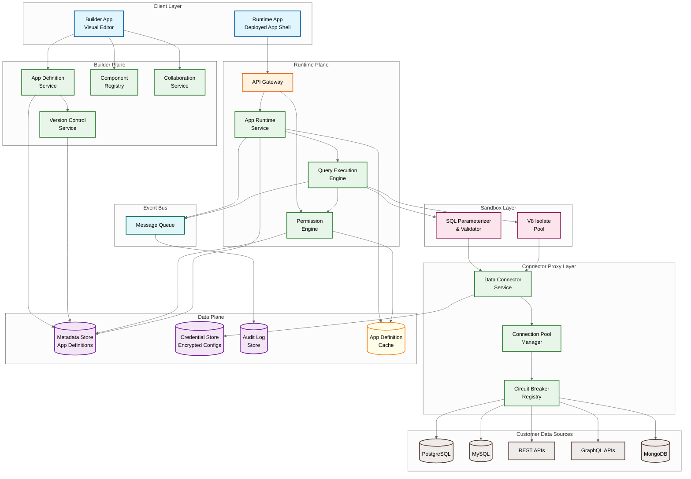
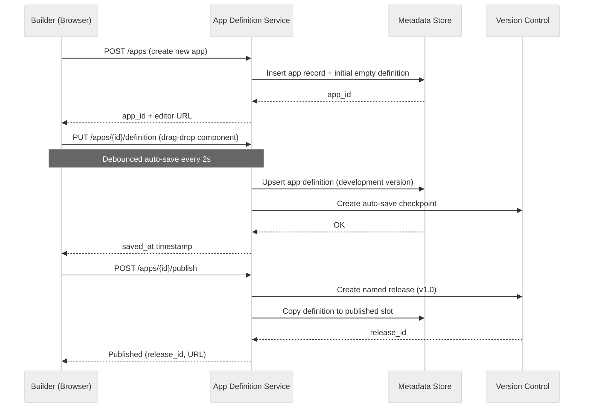
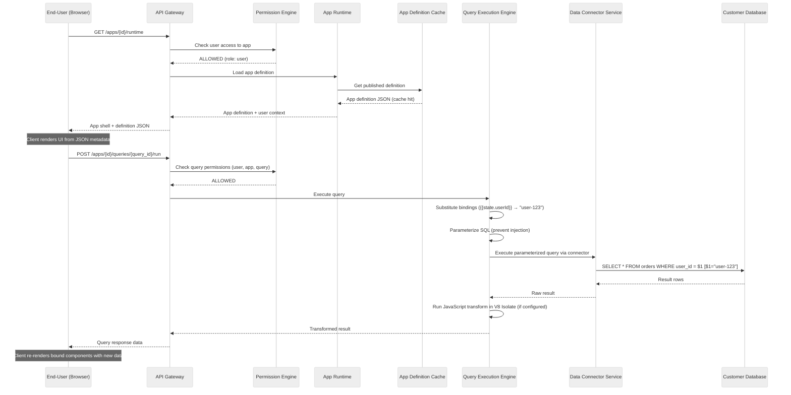
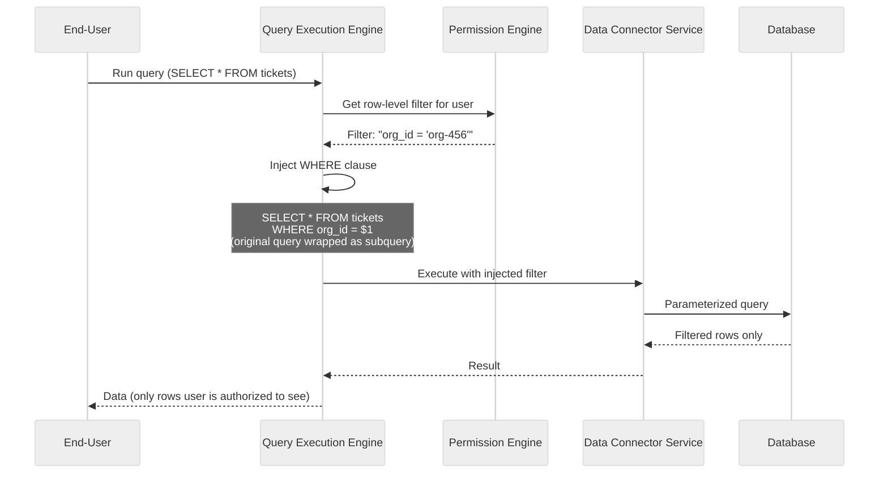

# High-Level Design

## System Architecture

The platform is split into two distinct planes: the **Builder Plane** (used by developers to create and edit apps) and the **Runtime Plane** (used by end-users interacting with deployed apps). Both planes share the Data Plane for metadata and credentials, but have separate scaling and availability requirements.

---

## Data Flow: Building and Deploying an App

### Flow 1: Builder Creates an App

### Flow 2: End-User Loads a Deployed App

### Flow 3: Query Execution with Row-Level Security

---

## Key Architectural Decisions

### Decision 1: Metadata-Driven Runtime vs. Code Generation

| Aspect | Metadata-Driven (Chosen) | Code Generation |
|--------|-------------------------|-----------------|
| **How it works** | Client renders from JSON definition at runtime | Platform emits JavaScript/HTML; user deploys generated code |
| **Publish speed** | Instant (toggle flag) | Minutes (build + deploy) |
| **Debugging** | Inspect JSON definition directly | Inspect generated code (often unreadable) |
| **Security** | Platform controls execution; no arbitrary code in production | Generated code runs anywhere; harder to audit |
| **Portability** | Locked to platform runtime | Potentially portable (but practically not) |
| **Flexibility** | Limited to component library + custom components | Theoretically unlimited |
| **Performance** | JSON parsing + rendering overhead | Compiled, potentially faster |
| **Version rollback** | Swap JSON document pointer | Redeploy previous build |

**Decision**: Metadata-driven runtime. The instant publish, built-in security boundary, and simpler debugging model outweigh the flexibility of code generation. Retool, Appsmith, and ToolJet all use this approach.

### Decision 2: Sandboxed Execution Model

| Approach | Isolation | Latency | Security | Cost |
|----------|-----------|---------|----------|------|
| **V8 Isolates (Chosen for JS)** | Memory-isolated, shared process | <5ms warm start | High (no FS/network) | Low (shared process) |
| **Container per query** | OS-level | 100-500ms cold start | Very high | High (per-container) |
| **In-process eval** | None | <1ms | Very low (dangerous) | Very low |

**Decision**: V8 Isolates for JavaScript transformations. SQL queries are never "executed in a sandbox"---they are parameterized by the platform and proxied to the customer's database. The sandbox is only for user-written JavaScript transformation code.

### Decision 3: Connector Proxy Architecture

All data connector calls are proxied through the platform's server-side Data Connector Service. The client (browser) never connects directly to customer databases or APIs.

**Why server-side proxy is non-negotiable**:
- **Credential security**: Database passwords and API keys are stored encrypted server-side; never sent to the browser
- **SSRF prevention**: All outbound network calls originate from the proxy with allowlisted destinations
- **Connection pooling**: Managed server-side to avoid overwhelming customer databases
- **Audit logging**: Every query is logged with user context before it reaches the database
- **Network access**: Customer databases are often in private networks; the platform's agent/proxy connects from a known IP range

### Decision 4: App Definition Storage

| Option | Pros | Cons |
|--------|------|------|
| **Document store (MongoDB)** | Natural fit for JSON documents | Weaker transactions, harder joins for cross-app queries |
| **Relational DB with JSONB (Chosen)** | ACID transactions, rich querying, JSONB indexing | Slightly more complex schema |
| **Git-backed storage** | Built-in versioning, branching, merging | Complex for non-git operations; slow for frequent saves |

**Decision**: Relational database with JSONB column for the app definition. The app metadata (id, org, owner, status, timestamps) is stored in relational columns; the full component tree + queries + bindings is a JSONB document. This gives us ACID transactions for publishes, relational queries for admin operations, and schema flexibility for the definition itself.

### Decision 5: Real-Time Collaboration Strategy

| Approach | Complexity | Conflict Quality | Best For |
|----------|-----------|-----------------|----------|
| **Full CRDT/OT** | Very high | Perfect merge | Google Docs (character-level editing) |
| **Component-level locking** | Low | No conflicts (locked) | Simple co-editing |
| **Presence + last-write-wins (Chosen)** | Medium | Acceptable (component-level) | Visual builders (Retool, Figma) |

**Decision**: Presence-based collaboration with last-write-wins at the component level. When two builders edit the same component simultaneously, the last save wins. Presence indicators show who is selecting which component, enabling social conflict avoidance. This is sufficient because visual builder edits are coarser-grained than text editing---users rarely modify the exact same component property at the same time.

---

## Architecture Pattern Checklist

| Pattern | Decision | Rationale |
|---------|----------|-----------|
| **Sync vs. Async** | Sync for query execution, async for audit/analytics | End-users need immediate query results |
| **Event-driven vs. Request-response** | Request-response for queries; event-driven for side effects | Queries are synchronous; audit/notifications are fire-and-forget |
| **Push vs. Pull** | Pull for data (query on demand); push for presence/collaboration | End-users fetch data; builders receive real-time presence updates |
| **Stateless vs. Stateful** | Stateless query execution; stateful collaboration sessions | Query engine scales horizontally; collaboration needs WebSocket state |
| **Read vs. Write optimization** | Read-optimized runtime (cached definitions); write-optimized builder (fast saves) | Runtime traffic is 100x builder traffic |
| **Real-time vs. Batch** | Real-time for queries and UI; batch for analytics/audit aggregation | User-facing is real-time; operational data is batched |
