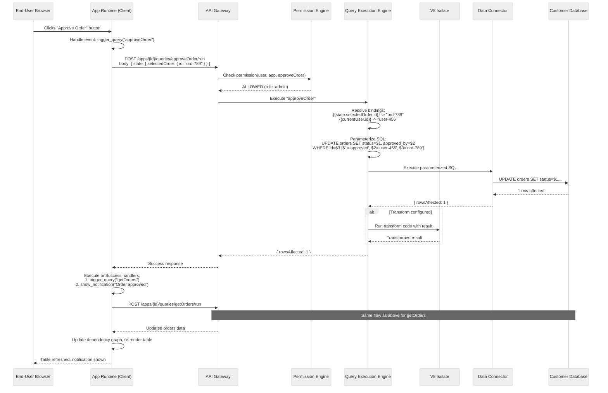

# Low-Level Design

## Data Model

### Core Entity Relationships

```mermaid
erDiagram
    ORGANIZATION {
        uuid id PK "Organization identifier"
        string name "Display name"
        string slug UK "URL-friendly slug"
        string plan "free, team, business, enterprise"
        jsonb settings "Org-level settings, feature flags"
        jsonb sso_config "SAML/OIDC configuration (encrypted)"
        timestamp created_at
        timestamp updated_at
    }

    APP {
        uuid id PK "App identifier"
        uuid org_id FK "Owning organization"
        string name "App display name"
        string slug UK "URL-friendly slug (within org)"
        string status "draft, published, archived, deleted"
        uuid current_dev_version_id FK "Latest development version"
        uuid published_version_id FK "Currently deployed version"
        uuid creator_id FK "User who created the app"
        string app_type "app, workflow, module"
        jsonb settings "App-level config (theme, custom domain)"
        timestamp created_at
        timestamp updated_at
        timestamp published_at
    }

    APP_VERSION {
        uuid id PK "Version identifier"
        uuid app_id FK "Parent app"
        int version_number "Sequential version counter"
        jsonb definition "Full app definition (component tree, queries, bindings)"
        string label "Optional human-readable label (v1.0, 'Q4 release')"
        uuid author_id FK "Who created this version"
        string change_summary "Description of changes"
        boolean is_published "Whether this version was ever published"
        timestamp created_at
    }

    COMPONENT {
        string type "table, form, chart, button, textInput, modal, container, etc."
        string id "Unique within app definition"
        jsonb props "Type-specific properties"
        jsonb bindings "Expression bindings (e.g., data: query1.data)"
        jsonb visibility "Conditional visibility rules"
        jsonb events "Event handlers (onClick, onChange)"
        jsonb layout "Grid position (x, y, width, height)"
        string parent_id "Parent container component"
    }

    QUERY {
        uuid id PK "Query identifier (within app)"
        uuid app_id FK "Owning app"
        string name UK "Query name (within app, e.g., 'getUsers')"
        string type "sql, rest, graphql, javascript, workflow"
        uuid connector_id FK "Data connector to use"
        jsonb config "Query-specific config (SQL text, URL, headers, body)"
        jsonb transform "Post-query JavaScript transformation"
        jsonb trigger "Trigger config (onPageLoad, manual, interval, event)"
        jsonb bindings "Parameter bindings from state/other queries"
        int timeout_ms "Custom timeout (default 10000)"
        boolean run_on_page_load "Auto-execute on page load"
    }

    DATA_CONNECTOR {
        uuid id PK "Connector identifier"
        uuid org_id FK "Owning organization"
        string name "Human-readable name (e.g., 'Production DB')"
        string type "postgresql, mysql, mongodb, rest_api, graphql, etc."
        blob encrypted_config "Encrypted connection config (host, port, credentials)"
        string environment "production, staging, development"
        jsonb pool_config "Connection pool settings (min, max, idle timeout)"
        jsonb health_status "Last health check result and timestamp"
        uuid created_by FK
        timestamp created_at
        timestamp updated_at
    }

    PERMISSION {
        uuid id PK
        uuid target_id "App ID or Org ID"
        string target_type "app, org"
        uuid principal_id "User ID or Group ID"
        string principal_type "user, group"
        string role "owner, admin, editor, viewer, user"
        jsonb component_overrides "Per-component visibility/disable rules"
        jsonb row_filters "Row-level security expressions"
        uuid granted_by FK
        timestamp created_at
    }

    USER_GROUP {
        uuid id PK
        uuid org_id FK
        string name UK "Group name within org"
        string description
        jsonb metadata "SCIM attributes, external group mappings"
        timestamp created_at
    }

    COMPONENT_EVENT {
        string event_type "onClick, onChange, onSubmit, onRowSelect"
        string action_type "trigger_query, set_state, navigate, open_modal, custom_js"
        jsonb action_config "Action-specific parameters"
    }

    AUDIT_EVENT {
        uuid id PK
        uuid org_id FK
        string event_type "query.executed, app.published, permission.changed, connector.created"
        uuid actor_id FK "User who performed the action"
        uuid app_id FK "Affected app (if applicable)"
        uuid query_id "Affected query (if applicable)"
        uuid connector_id "Affected connector (if applicable)"
        jsonb details "Event-specific data (query text, duration, row count)"
        string ip_address
        string user_agent
        int duration_ms "Execution duration (for queries)"
        timestamp created_at
    }

    CUSTOM_COMPONENT {
        uuid id PK
        uuid org_id FK
        string name UK "Component name within org"
        string description
        string source_type "iframe, sdk"
        text source_url "URL for iframe components"
        jsonb prop_definitions "Expected props schema"
        jsonb event_definitions "Events the component can emit"
        uuid creator_id FK
        timestamp created_at
        timestamp updated_at
    }

    ORGANIZATION ||--o{ APP : "owns"
    ORGANIZATION ||--o{ DATA_CONNECTOR : "has connectors"
    ORGANIZATION ||--o{ USER_GROUP : "has groups"
    ORGANIZATION ||--o{ CUSTOM_COMPONENT : "has custom components"
    ORGANIZATION ||--o{ PERMISSION : "has org permissions"
    APP ||--o{ APP_VERSION : "has versions"
    APP ||--o{ QUERY : "contains queries"
    APP ||--o{ PERMISSION : "has app permissions"
    APP ||--o{ AUDIT_EVENT : "generates events"
    QUERY }o--|| DATA_CONNECTOR : "uses"
```



**Note**: `COMPONENT` and `COMPONENT_EVENT` are not separate database tables---they exist within the `APP_VERSION.definition` JSONB document. They are shown here to illustrate the schema of the app definition.

---

## App Definition Schema

The app definition is a single JSON document that fully describes a deployable application. The runtime client renders entirely from this schema.

```
APP DEFINITION SCHEMA (stored in APP_VERSION.definition):

{
  "schema_version": 2,
  "pages": [
    {
      "id": "page-1",
      "name": "Orders Dashboard",
      "route": "/orders",
      "components": [
        {
          "id": "comp-header-1",
          "type": "text",
          "props": {
            "value": "Order Management",
            "fontSize": 24,
            "fontWeight": "bold"
          },
          "layout": { "x": 0, "y": 0, "w": 12, "h": 2 },
          "visibility": { "rule": "always" },
          "bindings": {},
          "events": {}
        },
        {
          "id": "comp-table-1",
          "type": "table",
          "props": {
            "columns": [
              { "key": "id", "label": "Order ID", "type": "text" },
              { "key": "customer", "label": "Customer", "type": "text" },
              { "key": "total", "label": "Total", "type": "currency" },
              { "key": "status", "label": "Status", "type": "badge" }
            ],
            "pagination": { "enabled": true, "pageSize": 25 },
            "selectable": true
          },
          "layout": { "x": 0, "y": 2, "w": 12, "h": 10 },
          "visibility": { "rule": "always" },
          "bindings": {
            "data": "{{getOrders.data}}",
            "loading": "{{getOrders.isLoading}}"
          },
          "events": {
            "onRowSelect": {
              "action": "set_state",
              "config": { "key": "selectedOrder", "value": "{{self.selectedRow}}" }
            }
          }
        },
        {
          "id": "comp-btn-approve",
          "type": "button",
          "props": {
            "text": "Approve Order",
            "color": "primary",
            "disabled": "{{!state.selectedOrder}}"
          },
          "layout": { "x": 10, "y": 12, "w": 2, "h": 1 },
          "visibility": {
            "rule": "expression",
            "expression": "{{currentUser.groups.includes('order-admins')}}"
          },
          "bindings": {},
          "events": {
            "onClick": {
              "action": "trigger_query",
              "config": { "queryName": "approveOrder" }
            }
          }
        }
      ],
      "state": {
        "selectedOrder": null
      }
    }
  ],
  "globalState": {
    "currentUser": "{{__platform.currentUser}}"
  },
  "queries": {
    "getOrders": {
      "type": "sql",
      "connectorId": "conn-prod-db",
      "config": {
        "sql": "SELECT id, customer, total, status FROM orders WHERE org_id = {{currentUser.orgId}} ORDER BY created_at DESC LIMIT {{state.pageSize}} OFFSET {{state.page * state.pageSize}}",
        "parameterized": true
      },
      "trigger": { "type": "onPageLoad" },
      "transform": null
    },
    "approveOrder": {
      "type": "sql",
      "connectorId": "conn-prod-db",
      "config": {
        "sql": "UPDATE orders SET status = 'approved', approved_by = {{currentUser.id}} WHERE id = {{state.selectedOrder.id}}",
        "parameterized": true
      },
      "trigger": { "type": "manual" },
      "transform": null,
      "onSuccess": [
        { "action": "trigger_query", "config": { "queryName": "getOrders" } },
        { "action": "show_notification", "config": { "message": "Order approved", "type": "success" } }
      ]
    }
  },
  "theme": {
    "primaryColor": "#1a73e8",
    "fontFamily": "Inter"
  }
}
```

---

## Query Execution Pipeline

### Core Execution (Pseudocode)

```
PSEUDOCODE: Query Execution Pipeline

FUNCTION execute_query(app_id, query_name, user_context, client_state):
    // Step 1: Load app definition (from cache or store)
    app_def = cache.get(f"app:{app_id}:published")
    IF app_def IS NULL:
        app_def = metadata_store.get_published_definition(app_id)
        cache.set(f"app:{app_id}:published", app_def, ttl=300)

    query_def = app_def.queries[query_name]
    IF query_def IS NULL:
        RAISE QueryNotFoundError(query_name)

    // Step 2: Permission check
    permission = permission_engine.check(user_context, app_id, query_name)
    IF permission.denied:
        RAISE PermissionDeniedError(user_context.user_id, query_name)

    // Step 3: Resolve bindings (substitute {{expressions}} with values)
    binding_context = {
        "currentUser": user_context,
        "state": client_state,
        // Include results from dependent queries if available
        **resolve_query_dependencies(app_def, query_name, client_state)
    }
    resolved_config = resolve_bindings(query_def.config, binding_context)

    // Step 4: Apply row-level security filters
    row_filters = permission.row_filters
    IF row_filters IS NOT EMPTY AND query_def.type == "sql":
        resolved_config.sql = inject_row_filters(resolved_config.sql, row_filters, user_context)

    // Step 5: Route to appropriate executor
    SWITCH query_def.type:
        CASE "sql":
            result = execute_sql(query_def.connectorId, resolved_config)
        CASE "rest":
            result = execute_rest(query_def.connectorId, resolved_config)
        CASE "graphql":
            result = execute_graphql(query_def.connectorId, resolved_config)
        CASE "javascript":
            result = execute_javascript_sandbox(resolved_config.code, binding_context)

    // Step 6: Apply post-query transformation (if configured)
    IF query_def.transform IS NOT NULL:
        result = execute_in_sandbox(query_def.transform, {data: result})

    // Step 7: Audit log (async)
    event_bus.publish("query.executed", {
        org_id: user_context.org_id,
        app_id: app_id,
        query_name: query_name,
        connector_id: query_def.connectorId,
        user_id: user_context.user_id,
        duration_ms: elapsed(),
        row_count: len(result),
        // NEVER log query results or parameter values (may contain PII)
    })

    RETURN result


FUNCTION execute_sql(connector_id, config):
    connector = get_connector(connector_id)
    // Parameterize: extract {{}} expressions as positional parameters
    parameterized_sql, params = parameterize_sql(config.sql)

    // Validate: reject DDL, multi-statement, UNION-based injection patterns
    validate_sql(parameterized_sql, connector.allowed_operations)

    connection = connection_pool.acquire(connector_id, timeout=5000)
    TRY:
        result = connection.execute(parameterized_sql, params, timeout=config.timeout_ms)
        RETURN result.rows
    FINALLY:
        connection_pool.release(connection)


FUNCTION execute_in_sandbox(code, context):
    // Run user-defined JavaScript in a V8 Isolate
    isolate = v8_isolate_pool.acquire()
    TRY:
        isolate.set_memory_limit(128 * 1024 * 1024)  // 128 MB
        isolate.set_cpu_timeout(5000)                  // 5 seconds

        // Inject context as frozen global objects
        isolate.set_global("data", freeze(context.data))
        isolate.set_global("moment", ALLOWED_LIBRARIES.moment)
        isolate.set_global("lodash", ALLOWED_LIBRARIES.lodash)

        // NO access to: fetch, fs, process, require, Function constructor
        result = isolate.run(code)
        RETURN result
    CATCH TimeoutError:
        RAISE SandboxTimeoutError("Transformation exceeded 5s CPU time limit")
    CATCH MemoryError:
        RAISE SandboxMemoryError("Transformation exceeded 128MB memory limit")
    FINALLY:
        isolate.dispose()
        v8_isolate_pool.release(isolate)


FUNCTION resolve_bindings(config, context):
    // Recursively find and evaluate {{expression}} patterns
    FUNCTION resolve_value(value):
        IF value IS string AND contains_binding(value):
            expressions = extract_bindings(value)  // find all {{...}} patterns
            FOR expr IN expressions:
                evaluated = expression_evaluator.evaluate(expr.inner, context)
                value = value.replace(expr.full, evaluated)
            RETURN value
        ELSE IF value IS object:
            RETURN {key: resolve_value(v) FOR key, v IN value}
        ELSE IF value IS array:
            RETURN [resolve_value(item) FOR item IN value]
        ELSE:
            RETURN value

    RETURN resolve_value(config)


FUNCTION inject_row_filters(sql, filters, user_context):
    // Wrap original query as subquery and inject WHERE clause
    // This prevents the user from bypassing filters with UNION or subqueries
    filter_clauses = []
    FOR filter IN filters:
        resolved = resolve_binding(filter.expression, user_context)
        filter_clauses.append(resolved)

    wrapped = f"SELECT * FROM ({sql}) AS __filtered WHERE {' AND '.join(filter_clauses)}"
    RETURN wrapped
```

---

## Binding Resolution: Dependency Graph

### Reactive Evaluation Model

```
PSEUDOCODE: Dependency Graph for Reactive Bindings

STRUCTURE DependencyNode:
    id: string              // component or query name
    type: "query" | "component" | "state"
    dependencies: set[string]  // nodes this depends on
    dependents: set[string]    // nodes that depend on this
    last_value: any
    is_dirty: boolean

FUNCTION build_dependency_graph(app_definition):
    graph = {}

    // Register all queries
    FOR query_name, query_def IN app_definition.queries:
        node = DependencyNode(id=query_name, type="query")
        // Parse bindings to find dependencies
        node.dependencies = extract_references(query_def.config)
        graph[query_name] = node

    // Register all component bindings
    FOR page IN app_definition.pages:
        FOR component IN page.components:
            node = DependencyNode(id=component.id, type="component")
            // Parse all bindings (data, visibility, props)
            node.dependencies = extract_references(component.bindings)
            node.dependencies.union(extract_references(component.visibility))
            graph[component.id] = node

    // Register state variables
    FOR page IN app_definition.pages:
        FOR key IN page.state:
            graph[f"state.{key}"] = DependencyNode(id=f"state.{key}", type="state")

    // Build reverse dependency map
    FOR node_id, node IN graph:
        FOR dep_id IN node.dependencies:
            IF dep_id IN graph:
                graph[dep_id].dependents.add(node_id)

    RETURN graph


FUNCTION on_data_change(graph, changed_node_id, new_value):
    // Topological sort-based incremental re-evaluation
    graph[changed_node_id].last_value = new_value
    graph[changed_node_id].is_dirty = false

    // Mark all dependents as dirty
    dirty_queue = topological_sort(get_all_dependents(graph, changed_node_id))

    FOR node_id IN dirty_queue:
        node = graph[node_id]
        IF node.type == "query" AND node.trigger == "onDependencyChange":
            // Re-execute the query
            new_result = execute_query(node)
            node.last_value = new_result
        ELSE IF node.type == "component":
            // Re-evaluate bindings with updated context
            new_props = resolve_bindings(node.bindings, get_context(graph))
            render_component(node.id, new_props)

        node.is_dirty = false
```

---

## Sequence Diagram: End-User Clicks Button



---

## API Design

### App Management

```
POST   /api/v1/apps                               Create app
GET    /api/v1/apps                               List apps (filtered by org, permissions)
GET    /api/v1/apps/{app_id}                      Get app metadata
PUT    /api/v1/apps/{app_id}                      Update app metadata (name, settings)
DELETE /api/v1/apps/{app_id}                      Archive app (soft delete)

GET    /api/v1/apps/{app_id}/definition           Get current development definition
PUT    /api/v1/apps/{app_id}/definition           Save development definition (auto-save)

POST   /api/v1/apps/{app_id}/publish              Publish current definition
POST   /api/v1/apps/{app_id}/rollback/{version}   Rollback to specific version
GET    /api/v1/apps/{app_id}/versions             List version history
GET    /api/v1/apps/{app_id}/versions/{version}   Get specific version definition
```

### Runtime (Deployed Apps)

```
GET    /api/v1/runtime/{app_id}                   Load published app definition + user context
POST   /api/v1/runtime/{app_id}/queries/{name}/run Execute a query
POST   /api/v1/runtime/{app_id}/state             Sync client state (for server-driven actions)
```

### Data Connectors

```
POST   /api/v1/connectors                         Create connector
GET    /api/v1/connectors                         List connectors (org-scoped)
PUT    /api/v1/connectors/{id}                    Update connector config
DELETE /api/v1/connectors/{id}                    Delete connector
POST   /api/v1/connectors/{id}/test               Test connector connectivity
GET    /api/v1/connectors/{id}/schema             Introspect database schema (tables, columns)
```

### Permissions

```
GET    /api/v1/apps/{app_id}/permissions           List app permissions
PUT    /api/v1/apps/{app_id}/permissions           Update app permissions (batch)
POST   /api/v1/apps/{app_id}/permissions/check     Check current user's effective permissions
```

### Collaboration

```
WS     /api/v1/apps/{app_id}/collaborate           WebSocket for real-time presence
GET    /api/v1/apps/{app_id}/presence              Get current editors and their selections
POST   /api/v1/apps/{app_id}/comments              Add comment on component
```

### Audit

```
GET    /api/v1/audit?org_id={org}&app_id={app}&from={date}&to={date}&event_type={type}
```

### Rate Limiting

| Endpoint Category | Limit | Window | Scope |
|------------------|-------|--------|-------|
| Runtime query execution | 600/min | Sliding window | Per app |
| Builder definition saves | 30/min | Sliding window | Per user |
| Connector test | 10/min | Fixed window | Per connector |
| Schema introspection | 5/min | Fixed window | Per connector |
| Audit log reads | 60/min | Sliding window | Per user |
| Publish operations | 10/min | Fixed window | Per app |
| API (external integrations) | 1,000/min | Sliding window | Per org API key |

---

## Indexing Strategy

| Index | Table | Columns | Purpose |
|-------|-------|---------|---------|
| `idx_app_org_status` | APP | `(org_id, status)` | List apps for an org |
| `idx_app_slug` | APP | `(org_id, slug)` UNIQUE | URL resolution |
| `idx_version_app` | APP_VERSION | `(app_id, version_number DESC)` | Version history listing |
| `idx_version_published` | APP_VERSION | `(app_id, is_published)` | Find published versions |
| `idx_query_app` | QUERY | `(app_id, name)` UNIQUE | Query lookup within app |
| `idx_connector_org` | DATA_CONNECTOR | `(org_id, type)` | List connectors per org |
| `idx_perm_target` | PERMISSION | `(target_id, target_type, principal_id)` | Permission lookup |
| `idx_perm_principal` | PERMISSION | `(principal_id, principal_type)` | User's permissions listing |
| `idx_audit_org_time` | AUDIT_EVENT | `(org_id, created_at DESC)` | Org audit trail |
| `idx_audit_app_time` | AUDIT_EVENT | `(app_id, created_at DESC)` | App audit trail |
| `idx_audit_actor` | AUDIT_EVENT | `(actor_id, created_at DESC)` | User activity trail |
| `idx_group_org` | USER_GROUP | `(org_id, name)` UNIQUE | Group lookup |

### Partitioning

| Data | Partition Key | Strategy |
|------|--------------|----------|
| Apps + Versions | `org_id` | Org-level locality for list operations |
| Permissions | `target_id` | Co-located with app data |
| Audit Events | `created_at` (monthly) | Time-partitioned for retention and efficient range queries |
| Connector Configs | `org_id` | Co-located with org data |
